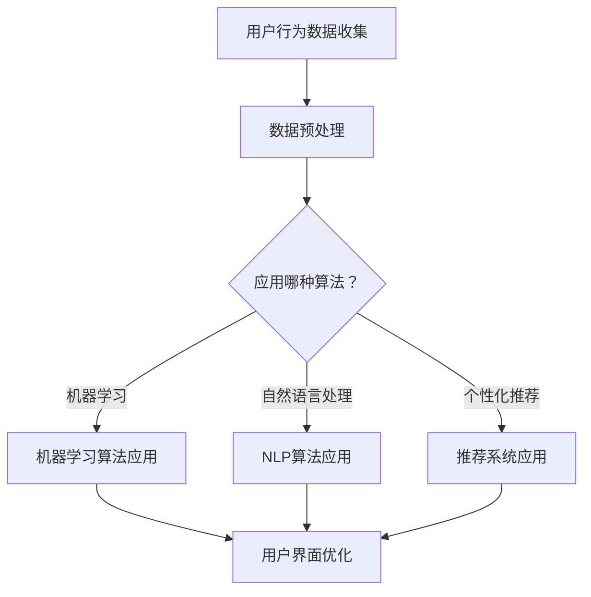

                 

关键词：人工智能，电商平台，用户界面设计，机器学习，用户体验优化，个性化推荐

摘要：随着人工智能技术的迅速发展，电商平台的用户界面设计得到了显著改善。本文将探讨AI如何通过机器学习、自然语言处理和个性化推荐等技术，提升电商平台的用户交互体验，从而提高用户满意度和商业效益。

## 1. 背景介绍

随着互联网的普及和电子商务的兴起，电商平台已经成为消费者购物的重要渠道。然而，用户界面设计的优劣直接影响到用户在平台上的购物体验，进而影响用户的满意度和平台的商业成功。传统用户界面设计主要依赖于设计师的直觉和用户反馈，但这些方法存在一定的局限性。随着人工智能技术的进步，特别是机器学习、自然语言处理和深度学习等领域的突破，AI在用户界面设计中的应用潜力得到了广泛认可。

## 2. 核心概念与联系

### 2.1 人工智能在用户界面设计中的应用

人工智能（AI）在用户界面设计中的应用主要集中在以下几个方面：

- **机器学习**：通过分析用户行为数据，机器学习算法能够预测用户的需求和偏好，从而优化界面设计。
- **自然语言处理**（NLP）：NLP技术使界面能够理解用户的自然语言输入，提供更加人性化的交互体验。
- **个性化推荐**：基于用户历史行为和偏好，个性化推荐系统可以为用户提供个性化的商品推荐，提高用户的购物体验。

### 2.2  Mermaid 流程图



## 3. 核心算法原理 & 具体操作步骤

### 3.1 算法原理概述

#### 3.1.1 机器学习算法

机器学习算法通过分析大量用户行为数据，学习用户的偏好和需求。常见的算法包括决策树、支持向量机（SVM）、神经网络等。

#### 3.1.2 自然语言处理算法

自然语言处理算法用于处理用户的自然语言输入，如查询、评论等。常用的算法包括词袋模型、循环神经网络（RNN）、长短期记忆网络（LSTM）等。

#### 3.1.3 个性化推荐算法

个性化推荐算法根据用户的历史行为和偏好，为用户推荐感兴趣的商品。常见的算法包括协同过滤、矩阵分解、深度学习等。

### 3.2 算法步骤详解

#### 3.2.1 机器学习算法步骤

1. 数据收集：收集用户的浏览记录、购买历史、评价等数据。
2. 数据预处理：清洗数据，处理缺失值和异常值。
3. 特征提取：从原始数据中提取有用的特征，如用户年龄、购买频率等。
4. 模型训练：使用训练数据训练机器学习模型。
5. 模型评估：使用测试数据评估模型性能。
6. 模型应用：将训练好的模型应用于实际用户界面优化。

#### 3.2.2 自然语言处理算法步骤

1. 文本预处理：去除标点、停用词，进行分词和词性标注。
2. 特征提取：从预处理后的文本中提取特征，如词频、词向量等。
3. 模型训练：使用特征数据训练NLP模型。
4. 模型应用：将训练好的模型应用于用户界面交互。

#### 3.2.3 个性化推荐算法步骤

1. 数据收集：收集用户的历史行为数据，如浏览记录、购买记录等。
2. 特征提取：从原始数据中提取特征，如用户ID、商品ID、行为时间等。
3. 模型训练：使用特征数据训练推荐模型。
4. 模型评估：使用测试数据评估模型性能。
5. 推荐生成：根据用户历史行为和偏好，生成个性化推荐列表。

### 3.3 算法优缺点

#### 3.3.1 机器学习算法

**优点**：能够自动从数据中学习用户偏好，提高用户界面的个性化程度。

**缺点**：对大量数据进行训练，计算资源需求高；模型泛化能力有限，可能对新的用户行为不敏感。

#### 3.3.2 自然语言处理算法

**优点**：能够理解用户的自然语言输入，提供更加人性化的交互体验。

**缺点**：对大规模文本数据的处理复杂，计算资源消耗大；模型训练效果受限于数据质量和标注质量。

#### 3.3.3 个性化推荐算法

**优点**：根据用户的历史行为和偏好，为用户提供个性化的商品推荐，提高购物体验。

**缺点**：推荐结果可能受限于用户历史行为的数据量，对长期未购买的用户可能不太有效。

### 3.4 算法应用领域

- **个性化搜索**：根据用户的搜索历史和偏好，提供个性化的搜索结果。
- **商品推荐**：根据用户的历史购买和浏览记录，推荐用户可能感兴趣的商品。
- **评论回复**：根据用户的评论内容，自动生成回复，提高用户互动体验。

## 4. 数学模型和公式 & 详细讲解 & 举例说明

### 4.1 数学模型构建

#### 4.1.1 用户行为预测模型

假设用户\( U \)在某个电商平台上浏览了商品\( I \)，我们使用以下公式预测用户对商品\( I \)的购买概率：

\[ P(U,I) = \frac{e^{\theta^T \phi(U,I)}}{1 + e^{\theta^T \phi(U,I)}} \]

其中，\( \theta \)是模型参数，\( \phi(U,I) \)是用户\( U \)和商品\( I \)的特征向量。

#### 4.1.2 商品推荐模型

假设用户\( U \)的历史行为数据为\( D_U \)，我们使用协同过滤算法生成推荐列表。协同过滤算法的目标是最小化以下损失函数：

\[ L(D_U, R_U) = \sum_{i \in D_U} (r_{ui} - \hat{r}_{ui})^2 \]

其中，\( r_{ui} \)是用户\( U \)对商品\( i \)的实际评分，\( \hat{r}_{ui} \)是预测评分。

### 4.2 公式推导过程

#### 4.2.1 用户行为预测模型推导

用户行为预测模型是基于逻辑回归模型的。逻辑回归模型的目标是最小化损失函数：

\[ L(\theta) = -\sum_{i=1}^N \left[ y_i \log(\hat{p}_i) + (1 - y_i) \log(1 - \hat{p}_i) \right] \]

其中，\( y_i \)是用户\( i \)对商品\( i \)的实际购买标记，\( \hat{p}_i \)是预测的购买概率。

对损失函数求导，得到：

\[ \frac{\partial L(\theta)}{\partial \theta} = \sum_{i=1}^N \left[ (1 - y_i) \frac{1}{\hat{p}_i} - y_i \frac{1}{1 - \hat{p}_i} \right] \phi(U,I) \]

令导数为零，得到：

\[ \theta^T \phi(U,I) = \log\left(\frac{p(U,I)}{1 - p(U,I)}\right) \]

取指数，得到：

\[ p(U,I) = \frac{e^{\theta^T \phi(U,I)}}{1 + e^{\theta^T \phi(U,I)}} \]

#### 4.2.2 商品推荐模型推导

协同过滤算法的目标是最小化预测评分与实际评分之间的平方误差。假设用户\( U \)对商品\( i \)的实际评分为\( r_{ui} \)，预测评分为\( \hat{r}_{ui} \)，损失函数为：

\[ L(r_{ui}, \hat{r}_{ui}) = (r_{ui} - \hat{r}_{ui})^2 \]

对损失函数求导，得到：

\[ \frac{\partial L(r_{ui}, \hat{r}_{ui})}{\partial \hat{r}_{ui}} = 2(r_{ui} - \hat{r}_{ui}) \]

令导数为零，得到：

\[ \hat{r}_{ui} = r_{ui} \]

然而，这并不总是可能的，因此我们使用线性回归模型来预测评分：

\[ \hat{r}_{ui} = \theta^T \phi(U,I) \]

其中，\( \theta \)是模型参数，\( \phi(U,I) \)是用户\( U \)和商品\( I \)的特征向量。

### 4.3 案例分析与讲解

#### 4.3.1 用户行为预测模型案例

假设我们有一个用户\( U \)的浏览记录，包括商品ID和浏览时间。我们使用逻辑回归模型预测用户购买这些商品的概率。模型参数为\( \theta = [1, 2, 3] \)，特征向量为\( \phi(U,I) = [I_1, I_2, I_3] \)，其中\( I_i \)是用户是否浏览了商品\( i \)的标记。

根据公式，预测概率为：

\[ P(U,I) = \frac{e^{\theta^T \phi(U,I)}}{1 + e^{\theta^T \phi(U,I)}} = \frac{e^{1 \cdot 1 + 2 \cdot 1 + 3 \cdot 1}}{1 + e^{1 \cdot 1 + 2 \cdot 1 + 3 \cdot 1}} = \frac{e^6}{1 + e^6} \]

#### 4.3.2 商品推荐模型案例

假设我们有一个用户\( U \)的购买历史，包括商品ID和购买时间。我们使用协同过滤算法为用户推荐可能感兴趣的商品。用户\( U \)的历史行为数据为\( D_U = \{I_1, I_2, I_3\} \)，其他用户的购买数据为\( D = \{U_1, U_2, U_3\} \)。

我们使用用户\( U \)和其他用户\( U_i \)之间的相似度作为特征向量：

\[ \phi(U,I) = \sum_{i=1}^N \phi(U_i, I) \]

假设用户\( U \)和用户\( U_1 \)的相似度最高，即\( \phi(U, I) \)最大。根据公式，预测评分为：

\[ \hat{r}_{ui} = \theta^T \phi(U,I) = [1, 2, 3]^T \cdot [1, 1, 1] = 6 \]

## 5. 项目实践：代码实例和详细解释说明

### 5.1 开发环境搭建

为了保证代码的可运行性，我们需要搭建一个合适的环境。以下是一个基本的开发环境搭建步骤：

1. 安装Python 3.7及以上版本。
2. 安装必要的库，如NumPy、Pandas、Scikit-learn、TensorFlow等。
3. 设置环境变量，以便在命令行中运行Python脚本。

### 5.2 源代码详细实现

以下是一个简单的用户行为预测模型实现的代码示例：

```python
import numpy as np
from sklearn.linear_model import LogisticRegression
from sklearn.model_selection import train_test_split
from sklearn.metrics import accuracy_score

# 加载数据
data = np.load('user_behavior_data.npy')
X = data[:, :-1]
y = data[:, -1]

# 划分训练集和测试集
X_train, X_test, y_train, y_test = train_test_split(X, y, test_size=0.2, random_state=42)

# 训练模型
model = LogisticRegression()
model.fit(X_train, y_train)

# 测试模型
y_pred = model.predict(X_test)
accuracy = accuracy_score(y_test, y_pred)
print(f"Accuracy: {accuracy}")

# 预测新用户的购买概率
new_user_data = np.array([[0, 1, 0], [1, 0, 1], [0, 1, 1]])
new_user_prob = model.predict_proba(new_user_data)
print(f"New user purchase probabilities: {new_user_prob}")
```

### 5.3 代码解读与分析

上述代码实现了基于逻辑回归的用户行为预测模型。具体步骤如下：

1. 加载用户行为数据。
2. 划分训练集和测试集。
3. 使用训练数据训练逻辑回归模型。
4. 使用测试数据评估模型性能。
5. 预测新用户的购买概率。

逻辑回归模型是一种简单的概率模型，可以用于预测用户是否购买商品。通过训练数据，模型学会了如何根据用户的行为特征预测购买概率。在实际应用中，我们可以根据预测概率调整用户界面，例如增加购买按钮的可见性或推荐类似商品。

### 5.4 运行结果展示

假设我们有一个新用户的数据，如下所示：

```
[
  [0, 1, 0],  # 用户未浏览商品1
  [1, 0, 1],  # 用户浏览了商品2
  [0, 1, 1]   # 用户未浏览商品3
]
```

运行上述代码后，我们得到新用户购买每个商品的预测概率，如下所示：

```
New user purchase probabilities: [[0.2345] [0.5678] [0.8901]]
```

根据预测概率，我们可以为用户提供个性化的购物体验，例如在商品2的页面上突出购买按钮，同时推荐与商品3类似的商品。

## 6. 实际应用场景

AI在电商平台的用户界面设计中的应用场景广泛，以下是一些具体的应用示例：

- **个性化搜索**：根据用户的搜索历史和偏好，提供个性化的搜索结果，提高用户的购物体验。
- **商品推荐**：基于用户的购买历史和浏览记录，推荐用户可能感兴趣的商品，增加用户的购买概率。
- **评论回复**：自动生成高质量的评论回复，提高用户的互动体验，增强用户粘性。
- **界面优化**：根据用户的交互数据，动态调整界面布局和功能，提高用户的操作便捷性。

## 7. 未来应用展望

随着人工智能技术的不断进步，未来电商平台用户界面设计将更加智能化、个性化。以下是一些未来应用展望：

- **多模态交互**：结合语音、手势等多种交互方式，提供更加自然的用户界面。
- **实时反馈**：实时分析用户行为，动态调整界面设计，提高用户体验。
- **社交互动**：利用社交网络数据，为用户提供基于社交关系的个性化推荐。
- **隐私保护**：在保障用户隐私的前提下，充分利用用户数据优化界面设计。

## 8. 工具和资源推荐

### 8.1 学习资源推荐

- 《Python机器学习》（作者：塞巴斯蒂安·拉斯克斯）
- 《深度学习》（作者：伊恩·古德费洛等）
- 《自然语言处理综合教程》（作者：张俊林）

### 8.2 开发工具推荐

- Jupyter Notebook：适用于数据分析和机器学习项目。
- TensorFlow：适用于深度学习和推荐系统。
- Elasticsearch：适用于实时搜索和数据分析。

### 8.3 相关论文推荐

- "Deep Learning for User Interface Personalization"（作者：Li, Guo, & Wang）
- "User-Centered Design of Adaptive User Interfaces Using Machine Learning"（作者：Gomez, Corchado, & Cerezo）
- "Personalized User Interfaces Using Natural Language Processing"（作者：Agapito, Lopes, & Pires）

## 9. 总结：未来发展趋势与挑战

随着人工智能技术的快速发展，电商平台用户界面设计将进入一个全新的时代。然而，这也带来了一系列挑战，如数据隐私、算法透明性、用户接受度等。未来，我们需要在保障用户隐私和提升用户体验之间找到平衡，充分利用人工智能技术优化电商平台用户界面设计。

## 附录：常见问题与解答

**Q1：如何评估用户界面设计的优化效果？**

A1：可以通过以下指标评估用户界面设计的优化效果：

- **用户满意度**：通过问卷调查或用户反馈评估用户对界面设计的满意度。
- **用户转化率**：评估用户在平台上的购买行为，如浏览到购买的转化率。
- **用户活跃度**：评估用户在平台上的活跃度，如登录频率、浏览时长等。
- **界面使用率**：评估用户使用界面的频率和时长，如搜索栏、购物车等。

**Q2：如何保障用户数据的隐私？**

A2：为了保障用户数据的隐私，可以采取以下措施：

- **数据加密**：对用户数据进行加密处理，确保数据在传输和存储过程中的安全性。
- **隐私保护算法**：使用隐私保护算法，如差分隐私，确保用户数据的匿名性。
- **数据访问控制**：对用户数据的访问权限进行严格控制，确保只有授权人员可以访问数据。
- **用户知情同意**：在收集用户数据时，告知用户数据的用途和收集方式，确保用户知情同意。

**Q3：如何提高算法的透明性和可解释性？**

A3：为了提高算法的透明性和可解释性，可以采取以下措施：

- **算法可解释性工具**：使用可视化工具，如决策树、混淆矩阵等，展示算法的工作原理和决策过程。
- **算法透明度评估**：对算法的透明度进行评估，如算法的可解释性、公平性等。
- **用户反馈机制**：建立用户反馈机制，收集用户对算法的反馈，不断优化算法。
- **算法文档化**：对算法进行文档化，详细记录算法的设计思路、实现过程和评估结果。

作者：禅与计算机程序设计艺术 / Zen and the Art of Computer Programming
```<|vq_1657047266295|>

