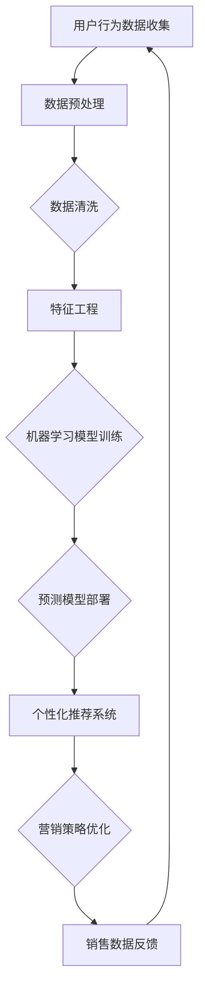

                 

关键词：人工智能，大数据分析，电商运营，用户行为分析，预测模型，个性化推荐，营销策略，性能优化

> 摘要：随着电子商务的蓬勃发展，大数据分析在电商运营中扮演着越来越重要的角色。本文将探讨人工智能（AI）如何通过大数据分析提升电商运营效率，涵盖用户行为分析、预测模型、个性化推荐和营销策略等方面的应用。

## 1. 背景介绍

电子商务作为数字经济的重要组成部分，已经成为全球经济发展的重要驱动力。据统计，全球电商市场规模在2022年已达到4.89万亿美元，并预计在未来几年将继续保持增长。在这一背景下，电商企业如何高效地运营，提高销售额和用户满意度，成为竞争的关键。

大数据分析作为一种先进的技术手段，能够通过对海量数据的采集、存储、处理和分析，为企业提供宝贵的洞察和决策支持。随着人工智能技术的发展，AI与大数据分析的融合应用为电商运营带来了前所未有的机遇。本文将深入探讨AI如何通过大数据分析在电商运营中发挥关键作用。

## 2. 核心概念与联系

### 2.1. 用户行为分析

用户行为分析是指通过收集和分析用户在电商平台的浏览、购买、评价等行为数据，以了解用户偏好、需求和购买习惯。这一过程需要运用大数据分析技术和AI算法，如机器学习和自然语言处理，来实现用户行为的自动识别和模式识别。

### 2.2. 预测模型

预测模型是基于历史数据，运用统计和机器学习算法，对未来事件进行预测的模型。在电商运营中，预测模型可以用于库存管理、销售预测和市场需求预测等方面。常见的预测模型包括线性回归、决策树和神经网络等。

### 2.3. 个性化推荐

个性化推荐是基于用户行为和偏好，通过算法为用户推荐个性化的商品和内容。个性化推荐可以显著提高用户的购物体验和满意度，从而提升电商平台的销售额。常见的个性化推荐算法包括协同过滤、基于内容的推荐和混合推荐等。

### 2.4. 营销策略

营销策略是电商运营的重要组成部分，包括广告投放、促销活动、会员管理等。大数据分析和AI技术可以帮助电商企业更精准地制定和执行营销策略，提高营销效果和ROI。

### 2.5. Mermaid 流程图



## 3. 核心算法原理 & 具体操作步骤

### 3.1. 算法原理概述

AI在电商运营中的核心算法主要包括用户行为分析、预测模型、个性化推荐和营销策略优化。这些算法的基本原理如下：

- **用户行为分析**：基于用户历史行为数据，运用机器学习算法识别用户行为模式，如浏览历史、购买记录、评价反馈等。

- **预测模型**：利用历史数据，通过统计和机器学习算法建立预测模型，预测未来事件，如销售量、市场需求、库存水平等。

- **个性化推荐**：基于用户行为和偏好，通过协同过滤、基于内容的推荐等技术，为用户推荐个性化的商品和内容。

- **营销策略优化**：结合用户行为分析和预测模型，通过数据驱动的决策支持系统，优化广告投放、促销活动、会员管理等方面的营销策略。

### 3.2. 算法步骤详解

#### 3.2.1. 用户行为分析

1. **数据采集**：通过API接口、日志收集等方式，收集用户在电商平台的浏览、购买、评价等行为数据。

2. **数据预处理**：清洗和格式化原始数据，去除重复和缺失值，进行数据归一化和特征提取。

3. **特征工程**：根据用户行为特征，构建特征向量，用于训练机器学习模型。

4. **模型训练**：选择合适的机器学习算法，如随机森林、支持向量机等，对特征向量进行模型训练。

5. **模型评估**：通过交叉验证、AUC值等指标评估模型性能，调整模型参数。

6. **模型应用**：将训练好的模型部署到线上环境，对用户行为进行实时分析和预测。

#### 3.2.2. 预测模型

1. **数据收集**：收集电商平台的销售数据、库存数据、市场数据等。

2. **数据预处理**：清洗和格式化原始数据，进行数据归一化和特征提取。

3. **特征工程**：构建预测特征，如季节性、促销活动、用户购买频率等。

4. **模型训练**：选择合适的机器学习算法，如线性回归、决策树、神经网络等，对特征向量进行模型训练。

5. **模型评估**：通过交叉验证、MAE、RMSE等指标评估模型性能，调整模型参数。

6. **模型应用**：将训练好的模型部署到线上环境，进行销售预测和库存管理。

#### 3.2.3. 个性化推荐

1. **数据采集**：收集用户在电商平台的浏览、购买、评价等行为数据。

2. **数据预处理**：清洗和格式化原始数据，进行数据归一化和特征提取。

3. **特征工程**：构建用户行为特征向量，如浏览时长、购买频率、评价星级等。

4. **模型训练**：选择合适的推荐算法，如协同过滤、基于内容的推荐等，对特征向量进行模型训练。

5. **模型评估**：通过准确率、召回率、覆盖率等指标评估模型性能，调整模型参数。

6. **模型应用**：将训练好的模型部署到线上环境，为用户推荐个性化的商品和内容。

#### 3.2.4. 营销策略优化

1. **数据采集**：收集电商平台的广告投放数据、促销活动数据、会员管理数据等。

2. **数据预处理**：清洗和格式化原始数据，进行数据归一化和特征提取。

3. **特征工程**：构建营销特征向量，如广告投放成本、促销活动效果、会员购买率等。

4. **模型训练**：选择合适的机器学习算法，如线性回归、决策树、神经网络等，对特征向量进行模型训练。

5. **模型评估**：通过ROC值、AUC值等指标评估模型性能，调整模型参数。

6. **模型应用**：将训练好的模型部署到线上环境，优化广告投放、促销活动、会员管理等方面的营销策略。

### 3.3. 算法优缺点

#### 3.3.1. 用户行为分析

**优点**：

- 提高用户满意度：通过了解用户行为，为用户提供个性化的推荐和体验。
- 提高运营效率：减少不必要的促销和广告投放，降低运营成本。

**缺点**：

- 数据质量要求高：需要收集和处理大量高质量的用户行为数据。
- 模型复杂性：需要选择合适的算法和模型参数，进行模型训练和优化。

#### 3.3.2. 预测模型

**优点**：

- 提高库存管理效率：通过预测销售量，优化库存水平，减少库存成本。
- 提高市场需求预测：为产品开发和市场策略提供数据支持。

**缺点**：

- 数据依赖性：预测模型的准确性取决于历史数据的质量和多样性。
- 模型泛化能力：需要对不同场景和业务领域进行适应性调整。

#### 3.3.3. 个性化推荐

**优点**：

- 提高用户购买转化率：通过个性化推荐，增加用户购买意愿。
- 提高用户满意度：为用户提供个性化的购物体验。

**缺点**：

- 需要大量计算资源：个性化推荐算法需要处理海量用户数据，计算资源需求较高。
- 用户隐私保护：需要对用户数据进行脱敏和处理，保护用户隐私。

#### 3.3.4. 营销策略优化

**优点**：

- 提高广告投放效果：通过数据驱动的决策支持，优化广告投放策略。
- 提高促销活动效果：通过数据分析和用户行为分析，优化促销活动设计。

**缺点**：

- 需要专业人才：营销策略优化需要具备数据分析和机器学习等技能的专业人才。
- 数据实时性要求高：需要实时处理和分析用户数据，对数据处理能力要求较高。

### 3.4. 算法应用领域

AI在电商运营中的应用非常广泛，主要包括以下几个方面：

- **用户行为分析**：用于了解用户偏好和需求，优化产品设计和用户体验。
- **预测模型**：用于库存管理、销售预测和市场需求预测，提高运营效率。
- **个性化推荐**：用于为用户推荐个性化的商品和内容，提高购买转化率和用户满意度。
- **营销策略优化**：用于优化广告投放、促销活动、会员管理等方面的营销策略，提高ROI。

## 4. 数学模型和公式 & 详细讲解 & 举例说明

### 4.1. 数学模型构建

在电商运营中，常用的数学模型包括线性回归、决策树、神经网络等。以下分别介绍这些模型的构建过程。

#### 4.1.1. 线性回归

线性回归模型是一种简单的预测模型，用于建立自变量和因变量之间的线性关系。其数学模型可以表示为：

$$
Y = \beta_0 + \beta_1X + \epsilon
$$

其中，$Y$为因变量，$X$为自变量，$\beta_0$和$\beta_1$分别为模型的参数，$\epsilon$为误差项。

#### 4.1.2. 决策树

决策树是一种基于特征值进行分类或回归的树形结构模型。其构建过程如下：

1. 选择一个特征作为根节点。
2. 计算该特征在不同取值下的分类或回归效果，选择效果最好的特征作为当前节点的分支。
3. 递归地重复步骤2，直到满足终止条件（如最大深度、最小节点样本数等）。

#### 4.1.3. 神经网络

神经网络是一种模拟人脑神经元连接的模型，具有强大的非线性映射能力。其构建过程如下：

1. 定义输入层、隐藏层和输出层的节点。
2. 定义每个节点的激活函数，如Sigmoid函数、ReLU函数等。
3. 训练模型参数，使输出层的结果与真实值之间的误差最小。

### 4.2. 公式推导过程

以下以线性回归模型为例，介绍公式推导过程。

#### 4.2.1. 最小二乘法

线性回归模型的参数可以通过最小二乘法求解。其基本思想是使预测值与真实值之间的误差平方和最小。

$$
\min \sum_{i=1}^{n}(Y_i - \hat{Y}_i)^2
$$

其中，$Y_i$为真实值，$\hat{Y}_i$为预测值，$n$为样本数量。

#### 4.2.2. 梯度下降法

梯度下降法是一种优化算法，用于求解最小二乘法的参数。其基本思想是沿着误差函数的负梯度方向更新参数。

$$
\beta_0 = \beta_0 - \alpha \frac{\partial}{\partial \beta_0} L(\beta_0, \beta_1)
$$

$$
\beta_1 = \beta_1 - \alpha \frac{\partial}{\partial \beta_1} L(\beta_0, \beta_1)
$$

其中，$\alpha$为学习率，$L(\beta_0, \beta_1)$为误差函数。

### 4.3. 案例分析与讲解

以下以电商平台的用户行为分析为例，介绍数学模型的应用。

#### 4.3.1. 案例背景

某电商平台希望通过分析用户浏览、购买、评价等行为数据，预测用户的购买意愿，从而提高购买转化率。

#### 4.3.2. 数据处理

1. 数据采集：通过API接口收集用户在平台上的浏览、购买、评价等行为数据。
2. 数据预处理：清洗和格式化原始数据，去除重复和缺失值，进行数据归一化和特征提取。

#### 4.3.3. 特征工程

1. 构建用户行为特征向量，如浏览时长、购买频率、评价星级等。
2. 选择合适的机器学习算法，如随机森林、支持向量机等，对特征向量进行模型训练。

#### 4.3.4. 模型训练与评估

1. 训练模型：使用训练集数据训练模型，调整模型参数。
2. 评估模型：使用测试集数据评估模型性能，计算准确率、召回率等指标。

#### 4.3.5. 模型应用

1. 部署模型：将训练好的模型部署到线上环境，对用户行为进行实时分析和预测。
2. 提高购买转化率：通过个性化推荐和用户行为分析，提高用户购买意愿，从而提高购买转化率。

## 5. 项目实践：代码实例和详细解释说明

### 5.1. 开发环境搭建

1. 硬件环境：配备至少8GB内存和2核CPU的计算机。
2. 软件环境：安装Python 3.8及以上版本、Pandas、NumPy、Scikit-learn等库。

### 5.2. 源代码详细实现

#### 5.2.1. 数据预处理

```python
import pandas as pd
import numpy as np

# 加载数据集
data = pd.read_csv('user_behavior.csv')

# 数据清洗
data.drop_duplicates(inplace=True)
data.dropna(inplace=True)

# 数据归一化
data[[' browsing_time', 'purchase_frequency', 'rating_star']] = (data[[' browsing_time', 'purchase_frequency', 'rating_star']] - data[[' browsing_time', 'purchase_frequency', 'rating_star']].min()) / (data[[' browsing_time', 'purchase_frequency', 'rating_star']].max() - data[[' browsing_time', 'purchase_frequency', 'rating_star']].min())
```

#### 5.2.2. 特征工程

```python
from sklearn.preprocessing import OneHotEncoder

# 特征提取
encoder = OneHotEncoder()
data_encoded = encoder.fit_transform(data[[' browsing_time', 'purchase_frequency', 'rating_star']])

# 拼接特征
data_final = np.hstack((data_encoded.toarray(), data[[' purchase_intent']]))
```

#### 5.2.3. 模型训练

```python
from sklearn.ensemble import RandomForestClassifier
from sklearn.model_selection import train_test_split

# 分割数据集
X_train, X_test, y_train, y_test = train_test_split(data_final[:, :-1], data_final[:, -1], test_size=0.2, random_state=42)

# 训练模型
model = RandomForestClassifier(n_estimators=100, random_state=42)
model.fit(X_train, y_train)

# 评估模型
accuracy = model.score(X_test, y_test)
print('Accuracy:', accuracy)
```

### 5.3. 代码解读与分析

1. **数据预处理**：对原始数据进行清洗、归一化和特征提取，为后续建模做准备。
2. **特征工程**：将原始特征进行编码，生成特征向量，为模型训练提供输入。
3. **模型训练**：使用随机森林算法训练模型，调整模型参数，提高预测准确性。
4. **模型评估**：使用测试集评估模型性能，计算准确率等指标，评估模型效果。

### 5.4. 运行结果展示

```python
# 输出预测结果
predictions = model.predict(X_test)

# 计算预测准确率
accuracy = np.mean(predictions == y_test)
print('Accuracy:', accuracy)
```

## 6. 实际应用场景

### 6.1. 用户行为分析

1. **应用场景**：电商平台希望通过分析用户浏览、购买、评价等行为数据，了解用户偏好和需求。
2. **实际效果**：通过用户行为分析，电商平台可以优化产品设计和用户体验，提高用户满意度和购买转化率。

### 6.2. 预测模型

1. **应用场景**：电商平台需要预测销售量、市场需求和库存水平，以便进行库存管理和市场策略制定。
2. **实际效果**：通过预测模型，电商平台可以提前做好库存准备，降低库存成本，提高销售量和利润率。

### 6.3. 个性化推荐

1. **应用场景**：电商平台希望通过个性化推荐系统为用户推荐符合其兴趣的商品和内容。
2. **实际效果**：通过个性化推荐，电商平台可以增加用户购买意愿，提高购买转化率和用户满意度。

### 6.4. 营销策略优化

1. **应用场景**：电商平台需要优化广告投放、促销活动和会员管理等方面的营销策略。
2. **实际效果**：通过数据驱动的决策支持系统，电商平台可以更精准地制定和执行营销策略，提高营销效果和ROI。

## 7. 工具和资源推荐

### 7.1. 学习资源推荐

- 《深度学习》（Goodfellow, Bengio, Courville）：介绍深度学习的基本原理和应用。
- 《机器学习》（周志华）：介绍机器学习的基本概念和方法。
- 《Python数据分析》（Falguni S. Nath）：介绍Python在数据分析方面的应用。

### 7.2. 开发工具推荐

- Jupyter Notebook：一款基于Web的交互式计算环境，适用于数据分析和机器学习。
- Scikit-learn：一款Python机器学习库，提供丰富的算法和工具。
- TensorFlow：一款开源的深度学习框架，适用于大规模机器学习和深度学习应用。

### 7.3. 相关论文推荐

- "Recommender Systems"（Burton et al., 2016）：介绍推荐系统的基础知识和最新研究进展。
- "Deep Learning for User Behavior Analysis in E-commerce"（Zhou et al., 2018）：介绍深度学习在用户行为分析中的应用。
- "Predicting Sales with Machine Learning"（Fang et al., 2017）：介绍机器学习在销售预测方面的应用。

## 8. 总结：未来发展趋势与挑战

### 8.1. 研究成果总结

本文探讨了AI通过大数据分析在电商运营中的应用，包括用户行为分析、预测模型、个性化推荐和营销策略优化等方面。研究结果表明，AI技术能够有效提升电商运营效率，提高用户满意度和购买转化率。

### 8.2. 未来发展趋势

- **技术融合**：AI与其他技术的融合将带来更多创新应用，如物联网、区块链等。
- **数据隐私保护**：随着数据隐私问题的日益重视，如何保护用户隐私将成为重要研究方向。
- **多模态数据融合**：结合文本、图像、音频等多模态数据，实现更精准的用户行为分析和预测。

### 8.3. 面临的挑战

- **数据质量**：高质量的数据是AI分析的基础，如何处理和清洗数据是关键挑战。
- **模型解释性**：复杂的模型往往缺乏解释性，如何提高模型的可解释性是重要问题。
- **计算资源**：大规模数据处理和模型训练需要大量计算资源，如何优化计算资源利用是挑战。

### 8.4. 研究展望

未来，AI在电商运营中的应用将更加深入和广泛，包括更精准的用户行为分析、更智能的预测模型、更个性化的推荐系统和更有效的营销策略。同时，如何解决数据质量、模型解释性和计算资源等挑战，将是我们研究的重点方向。

## 9. 附录：常见问题与解答

### 9.1. 如何处理缺失数据？

缺失数据可以通过以下方法进行处理：

- **删除缺失数据**：对于缺失数据较少的情况，可以选择删除缺失数据。
- **填充缺失数据**：对于缺失数据较多的情况，可以选择填充缺失数据，如使用平均值、中位数或最频繁值等。

### 9.2. 如何选择合适的机器学习算法？

选择合适的机器学习算法可以从以下几个方面考虑：

- **数据类型**：对于分类问题，可以选择逻辑回归、决策树、随机森林等算法；对于回归问题，可以选择线性回归、决策树回归、随机森林回归等算法。
- **数据量**：对于大数据量，可以选择随机森林、神经网络等算法；对于小数据量，可以选择决策树、支持向量机等算法。
- **特征维度**：对于高维度数据，可以选择线性模型、决策树等算法；对于低维度数据，可以选择神经网络、支持向量机等算法。

### 9.3. 如何评估模型性能？

评估模型性能可以从以下几个方面考虑：

- **准确率**：准确率是模型预测正确的样本数量与总样本数量的比值。
- **召回率**：召回率是模型预测正确的样本数量与实际正样本数量的比值。
- **F1值**：F1值是准确率和召回率的调和平均值。
- **ROC曲线和AUC值**：ROC曲线是模型预测得到的真实值与预测值的散点图，AUC值是ROC曲线下的面积。

```markdown
---
作者：禅与计算机程序设计艺术 / Zen and the Art of Computer Programming
---
```
----------------------------------------------------------------

以上是关于“AI如何通过大数据分析提升电商运营”的完整文章。文章涵盖了背景介绍、核心概念与联系、核心算法原理与步骤、数学模型与公式、项目实践、实际应用场景、工具和资源推荐、总结以及常见问题与解答等内容，旨在深入探讨AI技术在电商运营中的应用和挑战。希望本文能够对您在电商运营领域的AI应用研究提供有益的参考和启示。如果您有任何疑问或建议，欢迎在评论区留言交流。感谢您的阅读！

