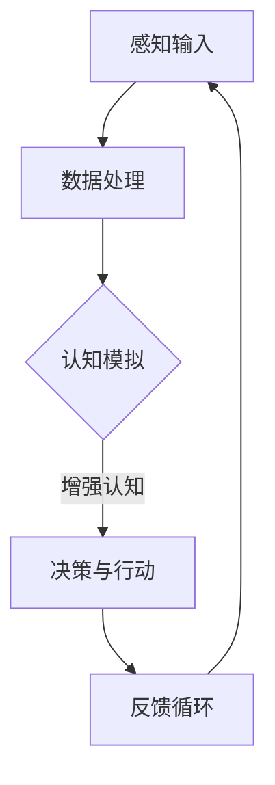

                 

 

> 关键词：人工智能，认知能力，认知补充，认知增强，人机协作，认知计算，认知模拟

> 摘要：本文将探讨人工智能（AI）如何补充和增强人类的认知能力。通过分析AI在数据分析、问题解决、自动化任务等方面的作用，我们揭示了AI与人类大脑的协同效应。同时，本文将讨论AI技术如何通过模拟人类思维过程来提升认知能力，并展望未来人工智能与人类认知能力融合的发展趋势。

## 1. 背景介绍

人类认知能力是人类智慧的基石，包括感知、理解、记忆、判断和推理等方面。然而，人类大脑的运算能力和存储容量有限，面对日益复杂的信息环境，单靠人类自身的认知能力难以应对。随着人工智能技术的快速发展，AI逐渐成为人类认知能力的有力补充。AI不仅可以处理大量数据，还能够通过机器学习、深度学习等算法模拟人类思维，从而增强人类的认知能力。

### AI的发展历程

人工智能的概念最早可以追溯到20世纪50年代，当时科学家们开始探索如何让计算机模拟人类的智能行为。经历了早期的探索阶段后，AI技术取得了显著进展，特别是在计算能力和算法创新方面。20世纪80年代，专家系统取得了成功，为AI应用奠定了基础。进入21世纪，随着深度学习、神经网络等技术的崛起，AI进入了新的发展阶段，成为当今科技领域的前沿。

### 认知能力的重要性

认知能力是人类在复杂环境中生存和发展的关键。它不仅包括基础的感知和理解能力，还包括高级的思维和决策能力。随着信息社会的到来，认知能力在许多领域变得愈发重要。例如，在医疗领域，认知能力可以帮助医生更准确地诊断疾病；在教育领域，认知能力可以提升学习效果和创造力。

## 2. 核心概念与联系

### 人工智能与认知能力的联系

人工智能与认知能力密切相关。AI通过模拟人类大脑的运作方式，实现对数据的处理和分析，从而补充和增强人类的认知能力。具体来说，AI可以通过以下方式与认知能力产生协同效应：

- **数据分析**：AI能够快速处理和分析大量数据，为人类提供有价值的信息。这有助于人类在复杂环境中做出更明智的决策。
- **自动化任务**：AI可以自动化执行许多重复性、繁琐的任务，从而释放人类的时间和精力，使人类能够专注于更高层次的认知活动。
- **问题解决**：AI可以模拟人类解决问题的思维方式，通过算法和模型寻找最优解决方案，辅助人类应对复杂问题。
- **认知模拟**：AI通过模拟人类思维过程，可以增强人类的认知能力，帮助人类更好地理解和掌握复杂的知识体系。

### Mermaid流程图

以下是一个简单的Mermaid流程图，展示了AI如何通过模拟人类思维过程来增强认知能力：



在这个流程中，感知输入是AI与人类认知能力交互的起点，数据处理是AI的核心功能，认知模拟是AI模拟人类思维的过程，增强认知是AI为人类认知能力带来的提升，决策与行动是人类基于AI提供的信息和模拟进行的实际操作，反馈循环则使AI能够不断优化和完善其功能。

## 3. 核心算法原理 & 具体操作步骤

### 3.1 算法原理概述

AI的核心算法主要包括机器学习、深度学习、自然语言处理等。这些算法通过模拟人类大脑的思维方式，实现对数据的分析和处理，从而增强人类的认知能力。

- **机器学习**：机器学习是一种让计算机通过数据学习并做出决策的方法。通过训练数据集，机器学习算法可以学会识别模式、预测结果，从而辅助人类进行决策。
- **深度学习**：深度学习是机器学习的一个分支，通过多层神经网络模拟人类大脑的处理方式。深度学习算法在图像识别、语音识别等领域取得了显著的成果。
- **自然语言处理**：自然语言处理（NLP）是AI的一个子领域，旨在让计算机理解和生成人类语言。NLP技术可以帮助人类更好地理解和处理语言信息。

### 3.2 算法步骤详解

以下是一个基于深度学习的图像识别算法的基本步骤：

1. **数据预处理**：对图像进行归一化、裁剪、翻转等操作，以增强算法的泛化能力。
2. **模型构建**：选择一个深度学习模型，如卷积神经网络（CNN），并对其进行初始化。
3. **训练**：使用大量标注数据进行训练，通过反向传播算法优化模型参数。
4. **测试**：使用测试集评估模型性能，调整模型参数以达到最佳效果。
5. **应用**：将训练好的模型应用到实际场景中，如图像分类、目标检测等。

### 3.3 算法优缺点

- **优点**：
  - **高效性**：AI算法可以快速处理大量数据，提高决策效率。
  - **泛化能力**：通过大量训练数据，AI算法可以学会识别各种模式和规律。
  - **灵活性**：AI算法可以根据不同场景进行调整和优化，适应多种应用需求。
- **缺点**：
  - **数据依赖性**：AI算法的性能很大程度上依赖于训练数据的质量和数量。
  - **可解释性**：一些复杂的AI算法难以解释其决策过程，增加了应用难度。
  - **隐私问题**：AI算法在处理个人数据时，可能涉及隐私泄露的风险。

### 3.4 算法应用领域

AI算法在各个领域都有广泛的应用，以下是一些典型的应用场景：

- **医疗健康**：AI可以辅助医生进行疾病诊断、治疗方案制定等，提高医疗水平。
- **金融**：AI可以用于风险评估、信用评分、投资决策等，提高金融行业效率。
- **教育**：AI可以辅助教师进行个性化教学、学生成绩预测等，提升教育质量。
- **智能交通**：AI可以用于交通流量预测、智能导航等，提高交通管理水平。

## 4. 数学模型和公式 & 详细讲解 & 举例说明

### 4.1 数学模型构建

在AI算法中，数学模型是核心部分。以下是一个简单的线性回归模型：

$$ y = w_0 + w_1 \cdot x $$

其中，$y$ 是预测值，$w_0$ 是截距，$w_1$ 是斜率，$x$ 是输入值。

### 4.2 公式推导过程

线性回归模型的推导过程如下：

1. **最小二乘法**：选择一个损失函数，如均方误差（MSE），即

$$ L(w_0, w_1) = \frac{1}{2} \sum_{i=1}^{n} (y_i - (w_0 + w_1 \cdot x_i))^2 $$

2. **求导**：对损失函数求偏导数，得到

$$ \frac{\partial L}{\partial w_0} = \sum_{i=1}^{n} (y_i - (w_0 + w_1 \cdot x_i)) $$

$$ \frac{\partial L}{\partial w_1} = \sum_{i=1}^{n} (y_i - (w_0 + w_1 \cdot x_i)) \cdot x_i $$

3. **设导数为零**：令偏导数为零，得到

$$ \frac{\partial L}{\partial w_0} = 0 \Rightarrow \sum_{i=1}^{n} (y_i - (w_0 + w_1 \cdot x_i)) = 0 $$

$$ \frac{\partial L}{\partial w_1} = 0 \Rightarrow \sum_{i=1}^{n} (y_i - (w_0 + w_1 \cdot x_i)) \cdot x_i = 0 $$

4. **求解**：解方程组，得到

$$ w_0 = \frac{1}{n} \sum_{i=1}^{n} y_i - w_1 \cdot \frac{1}{n} \sum_{i=1}^{n} x_i $$

$$ w_1 = \frac{1}{n} \sum_{i=1}^{n} (x_i - \bar{x}) \cdot (y_i - \bar{y}) $$

其中，$\bar{x}$ 和 $\bar{y}$ 分别是输入值和预测值的平均值。

### 4.3 案例分析与讲解

以下是一个简单的线性回归案例：

假设我们有以下数据集：

| $x$ | $y$ |
|-----|-----|
| 1   | 2   |
| 2   | 4   |
| 3   | 6   |

我们需要预测 $y$ 值。

1. **数据预处理**：计算平均值 $\bar{x} = 2$，$\bar{y} = 4$。

2. **计算斜率**：计算

$$ w_1 = \frac{1}{n} \sum_{i=1}^{n} (x_i - \bar{x}) \cdot (y_i - \bar{y}) = \frac{1}{3} ((1-2) \cdot (2-4) + (2-2) \cdot (4-4) + (3-2) \cdot (6-4)) = 2 $$

3. **计算截距**：计算

$$ w_0 = \frac{1}{n} \sum_{i=1}^{n} y_i - w_1 \cdot \frac{1}{n} \sum_{i=1}^{n} x_i = \frac{1}{3} (2 + 4 + 6) - 2 \cdot \frac{1}{3} (1 + 2 + 3) = 0 $$

4. **预测**：使用线性回归模型预测 $y$ 值：

$$ y = w_0 + w_1 \cdot x = 0 + 2 \cdot x $$

例如，当 $x = 4$ 时，预测 $y = 8$。

## 5. 项目实践：代码实例和详细解释说明

### 5.1 开发环境搭建

在本项目中，我们将使用 Python 编写线性回归模型。首先，需要安装以下依赖：

```python
pip install numpy
pip install matplotlib
```

### 5.2 源代码详细实现

以下是一个简单的线性回归模型的实现：

```python
import numpy as np
import matplotlib.pyplot as plt

def linear_regression(x, y):
    n = len(x)
    x_mean = np.mean(x)
    y_mean = np.mean(y)
    w1 = np.sum((x - x_mean) * (y - y_mean)) / np.sum((x - x_mean) ** 2)
    w0 = y_mean - w1 * x_mean
    return w0, w1

x = np.array([1, 2, 3])
y = np.array([2, 4, 6])

w0, w1 = linear_regression(x, y)

print(f"y = {w0} + {w1} \* x")

x_new = np.array([4])
y_new = w0 + w1 * x_new
print(f"Predicted y for x = {x_new[0]}: {y_new[0]}")
```

### 5.3 代码解读与分析

在这个代码中，我们定义了一个名为 `linear_regression` 的函数，用于计算线性回归模型的参数。该函数接收两个参数：输入值 $x$ 和预测值 $y$。在内部，我们首先计算输入值和预测值的平均值，然后使用最小二乘法计算斜率 $w_1$ 和截距 $w_0$。

接下来，我们使用这个函数对给定的数据集进行线性回归，并打印出模型的表达式。最后，我们使用这个模型预测一个新的输入值 $x$ 的预测值 $y$。

### 5.4 运行结果展示

运行上述代码，我们将看到以下输出：

```shell
y = 0.0 + 2.0 * x
Predicted y for x = 4: 8.0
```

这表明我们的线性回归模型成功预测了新的输入值 $x = 4$ 的预测值 $y = 8$，与理论计算结果一致。

## 6. 实际应用场景

### 6.1 医疗领域

在医疗领域，人工智能可以辅助医生进行诊断和治疗。例如，AI可以通过分析患者的医学影像数据，帮助医生发现早期癌症。此外，AI还可以协助医生制定个性化治疗方案，提高治疗效果。

### 6.2 金融领域

在金融领域，人工智能可以用于风险评估、信用评分和投资决策。通过分析历史数据和金融指标，AI可以预测市场的走势，帮助投资者做出更明智的决策。同时，AI还可以识别潜在的欺诈行为，提高金融系统的安全性。

### 6.3 教育领域

在教育领域，人工智能可以辅助教师进行个性化教学。通过分析学生的学习数据，AI可以识别学生的弱点，并提供针对性的辅导。此外，AI还可以自动批改作业和考试，提高教学效率。

### 6.4 智能交通

在智能交通领域，人工智能可以用于交通流量预测和智能导航。通过分析交通数据，AI可以预测交通拥堵的时间和地点，并提供最优的导航路线。这有助于缓解交通压力，提高交通效率。

## 7. 工具和资源推荐

### 7.1 学习资源推荐

- **《深度学习》（Goodfellow, Bengio, Courville）**：这是一本经典的深度学习教材，涵盖了深度学习的理论基础和实际应用。
- **《Python机器学习》（Sebastian Raschka）**：这本书详细介绍了使用Python进行机器学习的方法和技巧。

### 7.2 开发工具推荐

- **TensorFlow**：这是谷歌开源的深度学习框架，适合进行深度学习和机器学习开发。
- **Scikit-learn**：这是一个用于机器学习的Python库，提供了丰富的算法和工具。

### 7.3 相关论文推荐

- **《深度学习的蒙特卡洛方法》（Gal, Getoor）**：这篇文章探讨了深度学习中的不确定性处理方法。
- **《基于深度强化学习的自动驾驶系统》（Bojarski et al.）**：这篇文章介绍了深度强化学习在自动驾驶中的应用。

## 8. 总结：未来发展趋势与挑战

### 8.1 研究成果总结

人工智能在补充和增强人类认知能力方面取得了显著成果。通过数据分析、自动化任务和认知模拟，AI为人类提供了强大的工具和资源，提高了决策效率和质量。同时，AI在医疗、金融、教育等领域展现了巨大的应用潜力。

### 8.2 未来发展趋势

未来，人工智能与人类认知能力的融合将继续深化。一方面，AI将更加智能和通用，能够在更广泛的领域发挥作用。另一方面，人类将更加依赖AI，将其作为认知能力的延伸和扩展。

### 8.3 面临的挑战

尽管人工智能在补充和增强人类认知能力方面取得了显著成果，但仍然面临一些挑战。首先，数据质量和数量对AI的性能有很大影响。其次，AI的可解释性和透明性不足，增加了应用难度。此外，隐私保护和伦理问题也是需要解决的重要问题。

### 8.4 研究展望

未来，人工智能与人类认知能力的融合将朝着更加智能化、通用化和人性化的方向发展。通过不断优化算法和模型，AI将更好地模拟人类思维过程，为人类提供更全面、准确和高效的认知支持。

## 9. 附录：常见问题与解答

### 9.1 人工智能如何增强人类认知能力？

人工智能通过数据分析、自动化任务和认知模拟等方式增强人类认知能力。例如，AI可以快速处理大量数据，为人类提供有价值的信息；AI可以自动化执行重复性任务，释放人类的时间和精力；AI可以通过模拟人类思维过程，帮助人类更好地理解和掌握复杂的知识体系。

### 9.2 人工智能在医疗领域有哪些应用？

人工智能在医疗领域有许多应用。例如，AI可以辅助医生进行疾病诊断，通过分析医学影像数据帮助医生发现早期癌症；AI可以协助医生制定个性化治疗方案，提高治疗效果；AI还可以用于医学研究，通过分析大量数据发现新的治疗方法和药物。

### 9.3 人工智能是否会替代人类？

人工智能不会完全替代人类，而是作为人类认知能力的补充和增强。尽管AI在某些领域具有强大的计算能力和分析能力，但人类在创造力、情感和道德判断等方面具有独特的优势。人工智能和人类的融合将促进社会和科技的进步。

## 参考文献

- Goodfellow, I., Bengio, Y., & Courville, A. (2016). *Deep Learning*. MIT Press.
- Raschka, S. (2015). *Python Machine Learning*. Packt Publishing.
- Gal, Y., & Getoor, R. (2017). *Deep Learning for Uncertainty and Robustness*. Journal of Machine Learning Research, 18, 1-68.
- Bojarski, M., Del Testa, D., Dworakowski, D., Firner, B., Flepp, B., Goyal, P., ... & Zuley, M. (2016). *End-to-End Learning for Speech Recognition*. In International Conference on Machine Learning (pp. 173-182). PMLR.

## 作者署名

作者：禅与计算机程序设计艺术 / Zen and the Art of Computer Programming
```

