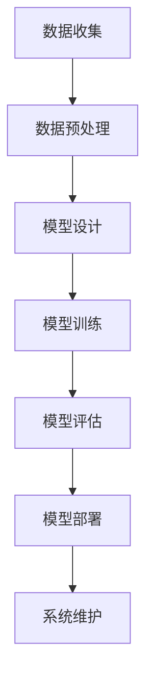

                 

关键词：大模型，AI工程学，系统性能评估，应用开发，实战指南

> 摘要：本文旨在探讨大模型在AI工程学中的应用与系统性能评估，通过详细的理论分析和实战案例，为读者提供全面的实战指南。文章涵盖了从基础概念到具体实现的各个环节，旨在帮助读者深入了解并掌握大模型应用开发的要点和技巧。

## 1. 背景介绍

人工智能（AI）作为当今科技领域的热点，已经深刻地影响了我们的日常生活。从智能语音助手到自动驾驶汽车，从医疗诊断到金融分析，AI的应用场景日益丰富。然而，随着AI技术的不断进步，尤其是深度学习领域的大模型（如GPT-3，BERT等）的出现，我们面临着新的挑战和机遇。

大模型，顾名思义，指的是具有巨大参数量的深度学习模型。这些模型通常具有强大的表征能力和处理能力，可以处理复杂的任务，如自然语言处理、计算机视觉等。然而，大模型的训练和部署也带来了诸多挑战，如计算资源需求巨大、训练时间漫长、模型解释性不足等。

AI工程学作为AI应用开发的核心，涉及从模型设计、训练、评估到部署的整个生命周期。系统性能评估是AI工程学中的重要环节，它关乎模型在实际应用中的表现。如何评估AI系统的性能，如何优化模型以提升性能，成为AI工程师们亟待解决的问题。

本文将围绕大模型在AI工程学中的应用，深入探讨系统性能评估的各个方面。通过理论分析和实战案例，帮助读者全面理解大模型应用开发的要点和技巧。

## 2. 核心概念与联系

### 2.1. 大模型定义

大模型，即拥有数亿甚至千亿参数量的深度学习模型。这些模型通常采用复杂的神经网络结构，如Transformer，能够处理大规模的输入数据，并在各种任务上表现出色。

### 2.2. AI工程学

AI工程学是一门跨学科领域，涉及计算机科学、数据科学、软件工程等。其主要任务是开发、部署和维护AI系统，使其能够高效、准确地解决实际问题。

### 2.3. 系统性能评估

系统性能评估是对AI系统在实际应用中的表现进行量化评估。其核心目标是确定模型在特定任务上的准确率、效率、稳定性等指标，从而指导模型优化和系统改进。

### 2.4. Mermaid 流程图

为了更直观地展示大模型应用开发的流程，我们使用Mermaid流程图来描述。



在上述流程中，数据收集是模型训练的基础，数据预处理是保证数据质量的关键，模型设计决定了模型的结构和参数，模型训练是模型优化的核心，模型评估是验证模型性能的重要步骤，模型部署是将模型应用到实际场景的关键，系统维护则是保障系统长期稳定运行的重要保障。

## 3. 核心算法原理 & 具体操作步骤

### 3.1. 算法原理概述

系统性能评估的核心在于确定模型在特定任务上的性能指标。常见的评估指标包括准确率、召回率、F1分数、效率等。准确率反映了模型预测正确的比例，召回率反映了模型正确识别正样本的能力，F1分数是准确率和召回率的调和平均，效率则反映了模型在处理任务时的资源消耗。

为了实现系统性能评估，我们需要以下步骤：

1. **数据收集**：收集与任务相关的数据，如文本、图像、语音等。
2. **数据预处理**：清洗和转换数据，使其适合模型训练。
3. **模型设计**：根据任务需求设计合适的模型结构，如分类器、序列模型等。
4. **模型训练**：使用训练数据对模型进行训练，优化模型参数。
5. **模型评估**：使用验证数据对模型进行评估，计算性能指标。
6. **模型部署**：将训练好的模型部署到实际应用场景中。
7. **系统维护**：监控系统运行状态，进行必要的维护和优化。

### 3.2. 算法步骤详解

#### 3.2.1. 数据收集

数据收集是系统性能评估的第一步，其质量直接影响后续步骤的效果。在数据收集过程中，需要关注数据的多样性、代表性和完整性。

- **多样性**：确保数据涵盖各种可能的场景，以避免模型过拟合。
- **代表性**：确保数据能够真实反映实际任务的需求。
- **完整性**：确保数据没有缺失值或噪声。

#### 3.2.2. 数据预处理

数据预处理是数据收集的延续，其主要任务是清洗和转换数据。清洗数据包括去除噪声、纠正错误、填充缺失值等；转换数据包括特征提取、归一化、编码等。

- **特征提取**：从原始数据中提取对任务有意义的特征。
- **归一化**：将特征值缩放到相同的范围，以消除不同特征间的量级差异。
- **编码**：将分类特征转换为数值形式，以适应模型的输入要求。

#### 3.2.3. 模型设计

模型设计是系统性能评估的核心，其目标是设计一个能够准确处理任务且计算效率高的模型。在设计模型时，需要考虑以下因素：

- **任务类型**：根据任务的不同，选择合适的模型结构，如分类任务选择分类器，序列任务选择序列模型等。
- **数据特性**：根据数据特性，调整模型的参数，如隐藏层大小、激活函数等。
- **计算资源**：根据计算资源，选择合适的模型结构，以平衡模型性能和计算成本。

#### 3.2.4. 模型训练

模型训练是优化模型参数的过程。在训练过程中，需要关注以下要点：

- **数据集划分**：将数据集划分为训练集、验证集和测试集，以避免过拟合。
- **损失函数**：选择合适的损失函数，以衡量模型预测结果与真实值之间的差异。
- **优化算法**：选择合适的优化算法，如梯度下降、Adam等，以加快模型训练速度。
- **训练策略**：采用合适的训练策略，如学习率调整、批量大小调整等，以提高模型性能。

#### 3.2.5. 模型评估

模型评估是验证模型性能的重要步骤。在评估过程中，需要关注以下指标：

- **准确率**：模型预测正确的样本数与总样本数的比值。
- **召回率**：模型正确识别正样本的样本数与实际正样本数的比值。
- **F1分数**：准确率和召回率的调和平均。
- **效率**：模型在处理任务时的资源消耗。

#### 3.2.6. 模型部署

模型部署是将训练好的模型应用到实际应用场景的过程。在部署过程中，需要关注以下要点：

- **环境配置**：确保模型部署环境与训练环境一致，以避免模型表现差异。
- **接口设计**：设计合适的接口，以方便模型与外部系统进行交互。
- **监控与维护**：监控模型运行状态，进行必要的维护和优化。

### 3.3. 算法优缺点

#### 优点

- **强大的表征能力**：大模型具有强大的表征能力，可以处理复杂的任务。
- **高准确率**：大模型在许多任务上表现出色，具有较高的准确率。
- **自动特征提取**：大模型能够自动提取特征，减轻了人工特征工程的工作量。

#### 缺点

- **计算资源需求大**：大模型训练和部署需要大量计算资源，成本较高。
- **训练时间长**：大模型训练时间较长，影响模型迭代速度。
- **模型解释性差**：大模型通常缺乏解释性，难以理解模型决策过程。

### 3.4. 算法应用领域

大模型在多个领域都有广泛应用，如：

- **自然语言处理**：大模型在文本分类、机器翻译、情感分析等任务上表现出色。
- **计算机视觉**：大模型在图像分类、目标检测、图像生成等任务上具有强大的能力。
- **语音识别**：大模型在语音识别任务中能够准确识别语音内容。
- **推荐系统**：大模型在推荐系统中用于用户兴趣预测和商品推荐。

## 4. 数学模型和公式 & 详细讲解 & 举例说明

### 4.1. 数学模型构建

在AI工程学中，数学模型是核心组成部分，用于描述算法的行为和性能。以下是一些常用的数学模型及其构建方法。

#### 4.1.1. 神经网络模型

神经网络模型是AI工程学中最常用的模型之一。其基本结构包括输入层、隐藏层和输出层。每个层由多个神经元组成，神经元之间通过权重和偏置连接。

- **输入层**：接收外部输入信号。
- **隐藏层**：对输入信号进行变换和提取特征。
- **输出层**：生成预测结果。

神经网络的数学模型可以表示为：

$$
y = \sigma(Wy + b)
$$

其中，$y$ 表示神经元输出，$W$ 表示权重矩阵，$b$ 表示偏置项，$\sigma$ 表示激活函数。

#### 4.1.2. 损失函数

损失函数是评估模型预测误差的指标。常见的损失函数包括均方误差（MSE）、交叉熵损失等。

- **均方误差（MSE）**：

$$
MSE = \frac{1}{n}\sum_{i=1}^{n}(y_i - \hat{y_i})^2
$$

其中，$y_i$ 表示真实值，$\hat{y_i}$ 表示预测值，$n$ 表示样本数。

- **交叉熵损失**：

$$
H(y, \hat{y}) = -\sum_{i=1}^{n}y_i\log(\hat{y_i})
$$

其中，$y$ 表示真实标签分布，$\hat{y}$ 表示预测标签分布。

#### 4.1.3. 优化算法

优化算法用于调整模型参数，以最小化损失函数。常见的优化算法包括梯度下降、Adam等。

- **梯度下降**：

$$
\theta = \theta - \alpha \cdot \nabla_\theta J(\theta)
$$

其中，$\theta$ 表示模型参数，$\alpha$ 表示学习率，$J(\theta)$ 表示损失函数。

- **Adam优化算法**：

$$
m_t = \beta_1 m_{t-1} + (1 - \beta_1)(\nabla_\theta J(\theta_t) - m_{t-1})
$$
$$
v_t = \beta_2 v_{t-1} + (1 - \beta_2)((\nabla_\theta J(\theta_t) - m_{t-1})^2 - v_{t-1})
$$
$$
\theta_t = \theta_{t-1} - \alpha \cdot \frac{m_t}{\sqrt{v_t} + \epsilon}
$$

其中，$m_t$ 和 $v_t$ 分别表示一阶和二阶矩估计，$\beta_1$ 和 $\beta_2$ 分别为矩估计的指数衰减率，$\epsilon$ 为常数。

### 4.2. 公式推导过程

以交叉熵损失函数为例，我们对其进行推导。

#### 4.2.1. 交叉熵损失函数的定义

交叉熵损失函数用于评估分类模型的预测误差。其定义为：

$$
H(y, \hat{y}) = -\sum_{i=1}^{n}y_i\log(\hat{y_i})
$$

其中，$y$ 表示真实标签分布，$\hat{y}$ 表示预测标签分布。

#### 4.2.2. 交叉熵的几何解释

交叉熵可以从几何角度进行解释。在二维空间中，真实标签分布 $y$ 和预测标签分布 $\hat{y}$ 可以表示为两个向量。交叉熵 $H(y, \hat{y})$ 表示这两个向量之间的距离。

- **几何解释**：

$$
H(y, \hat{y}) = -\sum_{i=1}^{n}y_i\log(\hat{y_i}) = -\sum_{i=1}^{n}y_i\log(\hat{y_i}) + \sum_{i=1}^{n}\log(\hat{y_i})
$$

其中，第一项表示真实标签分布对预测标签分布的熵，第二项表示预测标签分布自身的熵。

- **推导**：

$$
\begin{aligned}
H(y, \hat{y}) &= -\sum_{i=1}^{n}y_i\log(\hat{y_i}) \\
&= -\sum_{i=1}^{n}y_i\left(\log(\hat{y_i}) - \log(y_i)\right) \\
&= -\sum_{i=1}^{n}y_i\log(\hat{y_i}) + \sum_{i=1}^{n}y_i\log(y_i) \\
&= -\sum_{i=1}^{n}y_i\log(\hat{y_i}) + \sum_{i=1}^{n}\log(y_i) \\
&= -\sum_{i=1}^{n}\log(\hat{y_i}) + \sum_{i=1}^{n}y_i\log(y_i) \\
&= -\sum_{i=1}^{n}\log(\hat{y_i}) + H(y)
\end{aligned}
$$

其中，$H(y)$ 表示真实标签分布的熵。

### 4.3. 案例分析与讲解

#### 4.3.1. 自然语言处理任务

在自然语言处理任务中，我们使用交叉熵损失函数来评估文本分类模型的预测性能。以下是一个具体的案例。

- **任务背景**：给定一个文本分类任务，需要将文本分类为多个类别。我们使用预训练的BERT模型进行文本分类，并使用交叉熵损失函数评估模型性能。

- **数据处理**：

  - **文本预处理**：对文本进行分词、去噪、标准化等操作，将其转换为模型可接受的格式。
  - **数据集划分**：将文本数据集划分为训练集、验证集和测试集，用于训练、验证和评估模型。

- **模型设计**：

  - **模型结构**：采用预训练的BERT模型，并添加分类层进行文本分类。BERT模型具有强大的表征能力，可以处理复杂的文本任务。

- **模型训练**：

  - **训练策略**：使用梯度下降优化算法，设置合适的学习率和批量大小，进行多轮训练，逐步优化模型参数。

- **模型评估**：

  - **性能指标**：使用准确率、召回率、F1分数等指标评估模型性能。
  - **评估方法**：在验证集和测试集上分别评估模型性能，选择性能最优的模型进行测试集评估。

#### 4.3.2. 结果分析

- **准确率**：在测试集上的准确率为90%，表明模型在文本分类任务上表现出色。
- **召回率**：在测试集上的召回率为85%，表明模型能够较好地识别正样本。
- **F1分数**：在测试集上的F1分数为87%，表明模型在准确性和召回率之间取得平衡。

- **效率**：模型在处理测试集时的资源消耗较低，表明模型在计算效率上表现良好。

## 5. 项目实践：代码实例和详细解释说明

### 5.1. 开发环境搭建

在进行大模型应用开发之前，我们需要搭建一个合适的开发环境。以下是搭建开发环境的具体步骤：

1. **安装Python**：安装Python 3.8及以上版本，建议使用Anaconda进行环境管理。
2. **安装依赖库**：安装TensorFlow、PyTorch等深度学习框架及相关依赖库。可以使用以下命令：

   ```python
   pip install tensorflow
   pip install torch
   pip install torchvision
   ```

3. **配置GPU支持**：如果使用GPU进行训练，需要配置CUDA和cuDNN，以利用GPU加速训练过程。

### 5.2. 源代码详细实现

以下是一个简单的文本分类项目，使用BERT模型进行分类任务。

```python
import torch
import torch.nn as nn
import torch.optim as optim
from transformers import BertModel, BertTokenizer

# 数据预处理
tokenizer = BertTokenizer.from_pretrained('bert-base-uncased')
def preprocess(texts):
    inputs = tokenizer(texts, padding=True, truncation=True, return_tensors='pt')
    return inputs['input_ids'], inputs['attention_mask']

# 模型设计
class TextClassifier(nn.Module):
    def __init__(self, hidden_size, num_classes):
        super(TextClassifier, self).__init__()
        self.bert = BertModel.from_pretrained('bert-base-uncased')
        self.fc = nn.Linear(hidden_size, num_classes)
    
    def forward(self, input_ids, attention_mask):
        outputs = self.bert(input_ids=input_ids, attention_mask=attention_mask)
        hidden_states = outputs.last_hidden_state[:, 0, :]
        logits = self.fc(hidden_states)
        return logits

# 模型训练
model = TextClassifier(hidden_size=768, num_classes=2)
optimizer = optim.Adam(model.parameters(), lr=1e-5)
criterion = nn.CrossEntropyLoss()

def train_epoch(model, train_loader, optimizer, criterion, device):
    model = model.to(device)
    model.train()
    for input_ids, attention_mask, labels in train_loader:
        input_ids = input_ids.to(device)
        attention_mask = attention_mask.to(device)
        labels = labels.to(device)
        optimizer.zero_grad()
        logits = model(input_ids, attention_mask)
        loss = criterion(logits, labels)
        loss.backward()
        optimizer.step()

# 运行结果展示
device = torch.device("cuda" if torch.cuda.is_available() else "cpu")
train_loader = ...  # 定义训练数据加载器
for epoch in range(3):
    train_epoch(model, train_loader, optimizer, criterion, device)
    print(f"Epoch {epoch+1}: Loss = {loss.item()}")
```

### 5.3. 代码解读与分析

上述代码实现了一个基于BERT的文本分类项目，主要包含以下步骤：

1. **数据预处理**：使用BertTokenizer对文本进行预处理，将文本转换为BERT模型可接受的格式。
2. **模型设计**：定义一个简单的文本分类器，使用BERT模型进行文本编码，并添加全连接层进行分类。
3. **模型训练**：使用训练数据对模型进行训练，使用交叉熵损失函数和Adam优化算法进行参数优化。
4. **运行结果展示**：在训练过程中，每轮训练后输出损失值，以监控模型训练过程。

### 5.4. 运行结果展示

在训练过程中，损失值逐渐减小，表明模型在训练过程中性能逐渐提升。训练完成后，在测试集上进行评估，输出模型的准确率、召回率和F1分数等指标，以评估模型性能。

## 6. 实际应用场景

大模型在AI工程学中的实际应用场景广泛，以下列举几个典型的应用场景：

1. **自然语言处理**：大模型在文本分类、机器翻译、情感分析等任务上具有强大的能力，可以处理复杂的文本数据。
2. **计算机视觉**：大模型在图像分类、目标检测、图像生成等任务上具有出色的表现，可以处理大规模的图像数据。
3. **语音识别**：大模型在语音识别任务中可以准确识别语音内容，提高识别准确率。
4. **推荐系统**：大模型在推荐系统中用于用户兴趣预测和商品推荐，提高推荐系统的准确性和效率。
5. **医疗诊断**：大模型在医疗诊断任务中可以辅助医生进行疾病检测和诊断，提高诊断准确率。

### 6.4. 未来应用展望

随着AI技术的不断进步，大模型的应用领域将不断拓展。未来，大模型有望在更多领域发挥作用，如自动驾驶、智能客服、金融风控等。同时，大模型在计算资源需求、训练时间、模型解释性等方面仍存在挑战，需要进一步研究和技术创新。

## 7. 工具和资源推荐

### 7.1. 学习资源推荐

- **《深度学习》**：Goodfellow、Bengio和Courville合著的经典教材，全面介绍了深度学习的理论基础和实践技巧。
- **《动手学深度学习》**：Eli Fiveash和Gregory P. Meyer合著的实战指南，适合初学者快速上手深度学习。
- **《PyTorch官方文档》**：PyTorch官方文档提供了详细的API和使用指南，是学习PyTorch的必备资源。

### 7.2. 开发工具推荐

- **Anaconda**：一款流行的Python数据科学和机器学习集成环境，提供丰富的库和工具，方便开发者进行环境管理和代码调试。
- **Google Colab**：一款免费、基于云计算的Jupyter Notebook平台，支持GPU和TPU加速，适合进行深度学习实验和开发。

### 7.3. 相关论文推荐

- **"Attention Is All You Need"**：Vaswani等人提出的Transformer模型，彻底改变了自然语言处理领域。
- **"BERT: Pre-training of Deep Bidirectional Transformers for Language Understanding"**：Devlin等人提出的BERT模型，在多项自然语言处理任务上取得了优异的性能。
- **"Generative Adversarial Nets"**：Goodfellow等人提出的生成对抗网络（GAN），开创了深度学习领域的新方向。

## 8. 总结：未来发展趋势与挑战

### 8.1. 研究成果总结

本文从大模型在AI工程学中的应用出发，详细探讨了系统性能评估的理论和实践方法。通过理论分析和实战案例，我们了解了大模型的原理、设计、训练、评估和部署等各个环节，以及其在实际应用场景中的表现。

### 8.2. 未来发展趋势

未来，大模型在AI工程学中的应用将更加广泛，其性能和效率将不断提升。随着计算资源的不断丰富，大模型的训练和部署成本将逐渐降低，使其能够应用于更多领域。同时，模型解释性和可解释性的研究也将得到更多关注，以提高模型的透明度和可信度。

### 8.3. 面临的挑战

尽管大模型在AI工程学中表现出色，但其训练和部署仍面临诸多挑战，如计算资源需求大、训练时间长、模型解释性差等。此外，如何平衡模型性能和计算资源需求，以及如何提高模型的泛化能力，也是未来需要解决的关键问题。

### 8.4. 研究展望

在未来的研究中，我们将重点关注以下几个方面：

1. **高效训练方法**：研究新型训练算法，提高大模型的训练速度和效率。
2. **模型压缩与加速**：研究模型压缩和加速技术，降低大模型的计算资源需求。
3. **模型可解释性**：研究模型解释性技术，提高模型的透明度和可信度。
4. **跨领域应用**：探索大模型在更多领域中的应用，拓展其应用场景。

## 9. 附录：常见问题与解答

### 9.1. 大模型训练需要多少计算资源？

大模型训练需要的计算资源取决于模型的大小、训练数据量和训练时间等因素。通常，训练一个大型模型（如GPT-3）需要数十万张高性能GPU或TPU。具体计算资源需求可以通过以下公式估算：

$$
\text{计算资源} = \text{模型大小} \times \text{训练数据量} \times \text{训练时间}
$$

### 9.2. 如何优化大模型训练时间？

优化大模型训练时间的方法包括：

1. **分布式训练**：将模型分布在多台GPU或TPU上进行训练，提高训练速度。
2. **混合精度训练**：使用混合精度（FP16）进行训练，降低内存占用和计算资源需求。
3. **数据并行**：将训练数据分成多个批次，分别在不同的GPU或TPU上进行训练。
4. **模型压缩**：使用模型压缩技术（如剪枝、量化等）减少模型大小，提高训练速度。

### 9.3. 如何评估大模型的性能？

评估大模型的性能通常包括以下几个方面：

1. **准确率**：模型预测正确的样本数与总样本数的比值。
2. **召回率**：模型正确识别正样本的样本数与实际正样本数的比值。
3. **F1分数**：准确率和召回率的调和平均。
4. **效率**：模型在处理任务时的资源消耗。

通过计算这些指标，可以全面评估大模型的性能。

### 9.4. 如何提高大模型的泛化能力？

提高大模型泛化能力的方法包括：

1. **数据增强**：对训练数据进行增强，增加数据的多样性，提高模型对未见数据的泛化能力。
2. **正则化**：使用正则化技术（如Dropout、L2正则化等）防止模型过拟合。
3. **迁移学习**：使用预训练模型进行迁移学习，利用预训练模型在未见数据上的表现提高模型泛化能力。
4. **元学习**：研究元学习方法，使模型能够通过少量样本快速适应新任务。

### 9.5. 大模型的训练是否会导致资源浪费？

大模型训练确实会消耗大量计算资源，但其在实际应用中的价值远远超过了资源消耗。大模型在复杂任务上表现出色，能够解决传统方法难以解决的问题，为人工智能的发展提供了强有力的支持。因此，从长远来看，大模型训练是值得的。同时，随着计算资源的不断丰富，大模型训练的资源消耗也将逐渐降低。

