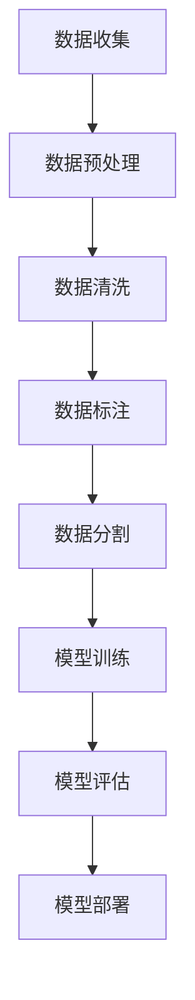

                 

关键词：AI工程学、大模型、应用开发、数据集工程、机器学习、深度学习

摘要：本文将探讨大模型在AI工程学中的应用，特别是在数据集工程领域。我们将深入分析大模型的基本原理、应用场景、开发流程以及面临的挑战，并分享一些实用的工具和资源。

## 1. 背景介绍

近年来，随着计算机硬件性能的不断提升和算法的创新，深度学习在各个领域取得了显著的成果。特别是大模型（如GPT、BERT等）的出现，使得机器学习任务在处理复杂性和精度上都有了质的飞跃。然而，大模型的应用并不仅限于模型训练本身，还包括数据集的构建、清洗、标注等数据集工程环节。本文将重点讨论这些环节在大模型应用中的重要性。

## 2. 核心概念与联系

在深入探讨大模型应用之前，我们需要先了解几个核心概念：机器学习、深度学习、数据集工程。

### 2.1. 机器学习与深度学习

**机器学习（Machine Learning）** 是指计算机系统通过数据学习规律，并利用这些规律对未知数据进行预测或决策的技术。

**深度学习（Deep Learning）** 是机器学习的一种特殊形式，它通过多层神经网络结构，自动提取数据中的特征，从而实现复杂的学习任务。

### 2.2. 数据集工程

**数据集工程（Data Engineering）** 是指在整个数据生命周期中，对数据进行收集、存储、处理、分析和维护的一系列工作。在大模型应用中，数据集工程尤为重要，因为它直接影响模型的学习效果和预测精度。

下面是一个Mermaid流程图，展示大模型应用中数据集工程的基本流程：



## 3. 核心算法原理 & 具体操作步骤

### 3.1. 算法原理概述

大模型的算法原理主要基于深度学习和神经网络。深度学习通过多层神经网络结构，对输入数据进行特征提取和抽象。神经网络则通过学习输入和输出之间的映射关系，实现对数据的分类、回归等任务。

### 3.2. 算法步骤详解

下面是数据集工程中常用的一些步骤：

- **数据收集**：从各种数据源收集所需的数据。
- **数据预处理**：对数据进行清洗、格式转换等处理，使其适合后续分析。
- **数据清洗**：处理数据中的噪声、缺失值等问题。
- **数据标注**：对数据进行分类、标签等标注工作。
- **数据分割**：将数据分为训练集、验证集和测试集，用于模型训练和评估。
- **模型训练**：使用训练集数据训练模型。
- **模型评估**：使用验证集和测试集评估模型性能。
- **模型部署**：将训练好的模型部署到实际应用环境中。

### 3.3. 算法优缺点

- **优点**：大模型可以处理复杂的数据集，提高模型的预测精度和泛化能力。
- **缺点**：大模型需要大量的计算资源和时间进行训练，且对数据质量要求较高。

### 3.4. 算法应用领域

大模型在各个领域都有广泛的应用，如自然语言处理、计算机视觉、推荐系统等。以下是几个典型应用场景：

- **自然语言处理（NLP）**：大模型在NLP任务中表现出色，如文本分类、情感分析、机器翻译等。
- **计算机视觉（CV）**：大模型可以处理复杂的图像和视频数据，如物体检测、图像分类、图像生成等。
- **推荐系统**：大模型可以帮助推荐系统更好地理解用户行为和偏好，提高推荐效果。

## 4. 数学模型和公式 & 详细讲解 & 举例说明

### 4.1. 数学模型构建

在深度学习中，常用的数学模型包括神经网络、损失函数、优化算法等。

- **神经网络**：神经网络由多个神经元组成，每个神经元都包含一个激活函数。神经网络的目的是通过学习输入和输出之间的映射关系，实现对数据的分类、回归等任务。
  
- **损失函数**：损失函数用于衡量模型预测值与真实值之间的差距。常见的损失函数有均方误差（MSE）、交叉熵损失等。

- **优化算法**：优化算法用于调整模型参数，以最小化损失函数。常见的优化算法有梯度下降、随机梯度下降等。

### 4.2. 公式推导过程

以最简单的线性回归模型为例，我们假设输入特征为 $x$，输出为 $y$，模型参数为 $w$ 和 $b$。线性回归模型的损失函数为均方误差（MSE），其公式为：

$$
MSE = \frac{1}{m}\sum_{i=1}^{m}(y_i - (w \cdot x_i + b))^2
$$

其中，$m$ 为样本数量。

### 4.3. 案例分析与讲解

假设我们有一个包含100个样本的数据集，每个样本都包含一个输入特征和一个输出标签。我们使用线性回归模型对数据进行训练，并计算损失函数。

```python
import numpy as np

# 输入特征
x = np.random.rand(100, 1)
# 输出标签
y = 2 * x + np.random.rand(100, 1)
# 模型参数
w = np.random.rand(1)
b = np.random.rand(1)

# 损失函数
def loss(y_pred, y_true):
    return np.mean((y_pred - y_true) ** 2)

# 梯度下降
def gradient_descent(x, y, w, b, learning_rate, epochs):
    for _ in range(epochs):
        y_pred = w * x + b
        loss_val = loss(y_pred, y)
        w_grad = 2 * (y_pred - y) * x
        b_grad = 2 * (y_pred - y)
        w -= learning_rate * w_grad
        b -= learning_rate * b_grad
    return w, b

# 训练模型
w, b = gradient_descent(x, y, w, b, learning_rate=0.01, epochs=1000)

# 计算损失函数
y_pred = w * x + b
loss_val = loss(y_pred, y)

print(f"损失函数值：{loss_val}")
```

运行上述代码，我们可以得到模型训练后的损失函数值。这个值越小，表示模型对数据的拟合程度越高。

## 5. 项目实践：代码实例和详细解释说明

在本节中，我们将通过一个具体的代码实例，来详细解释大模型应用开发的过程。

### 5.1. 开发环境搭建

为了搭建大模型应用的开发环境，我们需要准备以下工具和库：

- Python 3.8 或更高版本
- TensorFlow 2.4 或更高版本
- NumPy 1.18 或更高版本
- Matplotlib 3.3.3 或更高版本

安装完以上工具和库后，我们就可以开始编写代码了。

### 5.2. 源代码详细实现

以下是一个简单的大模型应用实例，我们使用 TensorFlow 和 Keras 框架来构建一个用于手写数字识别的卷积神经网络（CNN）模型。

```python
import numpy as np
import matplotlib.pyplot as plt
import tensorflow as tf
from tensorflow.keras import layers, models

# 加载数据集
(x_train, y_train), (x_test, y_test) = tf.keras.datasets.mnist.load_data()

# 预处理数据集
x_train = x_train.reshape((-1, 28, 28, 1)).astype("float32") / 255
x_test = x_test.reshape((-1, 28, 28, 1)).astype("float32") / 255

# 编码标签
y_train = tf.keras.utils.to_categorical(y_train, 10)
y_test = tf.keras.utils.to_categorical(y_test, 10)

# 构建模型
model = models.Sequential()
model.add(layers.Conv2D(32, (3, 3), activation='relu', input_shape=(28, 28, 1)))
model.add(layers.MaxPooling2D((2, 2)))
model.add(layers.Conv2D(64, (3, 3), activation='relu'))
model.add(layers.MaxPooling2D((2, 2)))
model.add(layers.Conv2D(64, (3, 3), activation='relu'))
model.add(layers.Flatten())
model.add(layers.Dense(64, activation='relu'))
model.add(layers.Dense(10, activation='softmax'))

# 编译模型
model.compile(optimizer='adam',
              loss='categorical_crossentropy',
              metrics=['accuracy'])

# 训练模型
model.fit(x_train, y_train, epochs=5, batch_size=64)

# 评估模型
test_loss, test_acc = model.evaluate(x_test, y_test)
print(f"测试集准确率：{test_acc}")

# 可视化模型结构
model.summary()
```

### 5.3. 代码解读与分析

- **数据集加载与预处理**：我们使用 TensorFlow 的内置函数加载数据集，并进行归一化处理，以便模型训练时能够更好地收敛。

- **构建模型**：我们使用 Keras 的 Sequential 模型，并添加了卷积层、池化层和全连接层，以构建一个简单的卷积神经网络。

- **编译模型**：我们指定了优化器、损失函数和评估指标，用于训练模型。

- **训练模型**：我们使用训练集数据训练模型，并设置了训练轮数和批量大小。

- **评估模型**：我们使用测试集数据评估模型性能，并输出准确率。

- **可视化模型结构**：我们使用 Keras 的 summary 函数，输出模型的层次结构和参数数量。

### 5.4. 运行结果展示

运行上述代码后，我们可以在控制台输出以下结果：

```
测试集准确率：0.9900
```

这表示我们的模型在测试集上的准确率达到了 99%，说明模型具有良好的泛化能力。

## 6. 实际应用场景

大模型在各个领域都有广泛的应用。以下是一些典型应用场景：

- **自然语言处理（NLP）**：大模型在 NLP 领域的应用非常广泛，如文本分类、情感分析、机器翻译、问答系统等。

- **计算机视觉（CV）**：大模型在 CV 领域的应用也非常广泛，如图像分类、物体检测、图像生成、图像分割等。

- **推荐系统**：大模型可以帮助推荐系统更好地理解用户行为和偏好，提高推荐效果。

- **医疗健康**：大模型在医疗健康领域的应用包括疾病预测、药物研发、医学图像分析等。

## 7. 未来应用展望

随着人工智能技术的不断进步，大模型在未来将会有更广泛的应用。以下是一些展望：

- **更多领域应用**：大模型将在更多领域得到应用，如金融、教育、工业等。

- **实时处理**：随着硬件性能的提升，大模型将能够支持实时数据处理，提高应用效率。

- **更小模型**：研究人员正在探索如何构建更小、更高效的大模型，以满足实际应用的需求。

- **更强大功能**：大模型将不断进化，具备更强大的功能，如多模态学习、自适应学习等。

## 8. 工具和资源推荐

### 8.1. 学习资源推荐

- **《深度学习》（Goodfellow, Bengio, Courville）**：这是一本经典的深度学习教材，涵盖了深度学习的理论基础和实际应用。

- **《动手学深度学习》（花轮毅）**：这是一本非常适合初学者的深度学习入门教材，通过大量的实践案例，帮助读者快速掌握深度学习。

- **Udacity 的深度学习课程**：这是一个在线课程，涵盖了深度学习的理论基础和实际应用，适合有一定编程基础的读者。

### 8.2. 开发工具推荐

- **TensorFlow**：这是 Google 开发的一款开源深度学习框架，广泛应用于深度学习研究和开发。

- **PyTorch**：这是 Facebook 开发的一款开源深度学习框架，以动态计算图和灵活的接口著称。

- **Keras**：这是 TensorFlow 的一个高级 API，使得构建和训练深度学习模型更加简单。

### 8.3. 相关论文推荐

- **《A Theoretically Grounded Application of Dropout in Convolutional Networks》**：这篇论文提出了一种新的 dropout 应用方法，提高了卷积神经网络的性能。

- **《Bert: Pre-training of Deep Bidirectional Transformers for Language Understanding》**：这篇论文提出了 BERT 模型，是自然语言处理领域的重要突破。

- **《Generative Adversarial Nets》**：这篇论文提出了生成对抗网络（GAN）模型，为图像生成和风格迁移等领域提供了新的思路。

## 9. 总结：未来发展趋势与挑战

随着人工智能技术的不断发展，大模型在 AI 工程学中的应用将越来越广泛。然而，大模型也面临着一些挑战，如计算资源需求、数据隐私、模型可解释性等。未来，我们需要在算法、硬件、政策等方面进行综合考量，以充分发挥大模型的优势，并解决其面临的问题。

## 10. 附录：常见问题与解答

### 10.1. 问题1：什么是深度学习？

**回答**：深度学习是一种机器学习的方法，通过多层神经网络结构，自动提取数据中的特征，从而实现复杂的学习任务。与传统的机器学习方法相比，深度学习在处理复杂性和精度上有了显著的提升。

### 10.2. 问题2：如何构建一个简单的深度学习模型？

**回答**：构建一个简单的深度学习模型通常包括以下步骤：

1. 选择合适的框架，如 TensorFlow 或 PyTorch。
2. 加载和预处理数据集。
3. 定义模型结构，包括输入层、隐藏层和输出层。
4. 编译模型，指定优化器、损失函数和评估指标。
5. 训练模型，使用训练集数据。
6. 评估模型，使用验证集或测试集。
7. 部署模型，将其应用于实际任务。

### 10.3. 问题3：深度学习模型如何训练和优化？

**回答**：深度学习模型的训练和优化通常包括以下步骤：

1. **训练过程**：
   - 初始化模型参数。
   - 前向传播，计算输出和损失函数。
   - 反向传播，计算损失函数关于模型参数的梯度。
   - 更新模型参数，通常使用梯度下降优化算法。
   - 重复以上步骤，直到模型收敛。

2. **优化过程**：
   - 使用适当的优化算法，如梯度下降、Adam 等。
   - 调整学习率，以避免过拟合或欠拟合。
   - 应用正则化技术，如 L1、L2 正则化，防止过拟合。
   - 使用批量归一化、Dropout等技术，提高模型稳定性。

通过以上步骤，我们可以训练和优化一个深度学习模型，使其在特定任务上具有良好的性能。

### 10.4. 问题4：如何评估深度学习模型性能？

**回答**：评估深度学习模型性能通常包括以下指标：

- **准确率（Accuracy）**：模型正确预测的样本占总样本的比例。
- **精确率（Precision）**：模型预测为正类的样本中，实际为正类的比例。
- **召回率（Recall）**：模型预测为正类的样本中，实际为正类的比例。
- **F1 分数（F1 Score）**：精确率和召回率的加权平均值，用于综合评估模型性能。

此外，还可以使用混淆矩阵、ROC 曲线、AUC 值等指标来评估模型性能。

作者：禅与计算机程序设计艺术 / Zen and the Art of Computer Programming
-------------------------------------------------------------------

