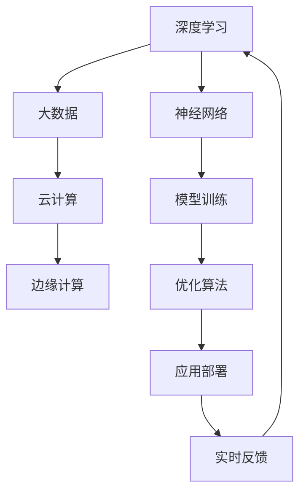
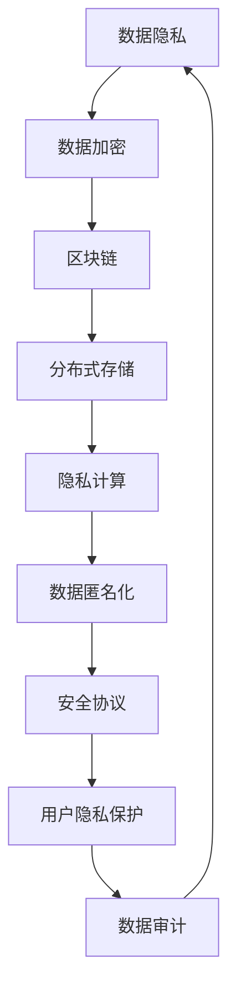
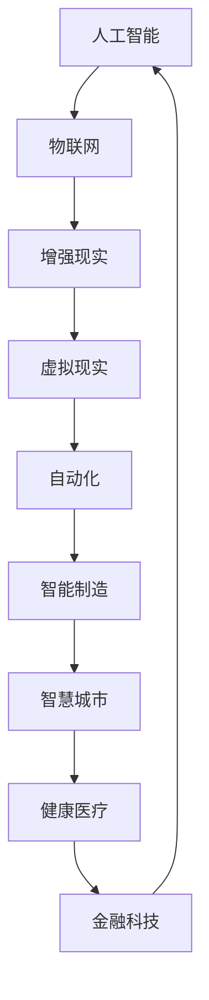

                 

关键词：人工智能应用、新兴技术趋势、深度学习、数据隐私、云计算、跨领域整合、人机协作、智能城市、物联网、增强现实、虚拟现实、区块链、自动化。

> 摘要：本文将探讨当前人工智能应用的最新趋势和新兴方向，从深度学习、数据隐私、云计算、跨领域整合、人机协作、智能城市、物联网、增强现实、虚拟现实、区块链和自动化等多个方面进行分析，旨在为读者提供一个全面的技术展望和未来应用的前景。

## 1. 背景介绍

人工智能（AI）作为一门集成了计算机科学、数学、统计学和神经科学等多个领域的交叉学科，近年来取得了迅猛的发展。尤其是在深度学习、自然语言处理、计算机视觉和机器人技术等领域，AI的应用已经深入到社会的各个层面。从智能家居到自动驾驶，从医疗诊断到金融分析，人工智能正在改变我们的生活和工作方式。

随着大数据和云计算技术的成熟，AI的应用场景不断扩大。同时，随着边缘计算、物联网、区块链等新技术的崛起，AI的应用范围也在不断扩展。本篇文章将围绕这些新兴技术趋势，探讨AI在未来的应用方向和可能面临的挑战。

## 2. 核心概念与联系

### 2.1 深度学习

深度学习是人工智能领域的一个重要分支，通过多层神经网络对数据进行训练，从而实现对复杂模式的识别。深度学习与云计算的紧密联系在于，它需要大量的计算资源和数据来训练模型。云计算提供了弹性计算和分布式存储的能力，使得深度学习在处理大规模数据时更加高效。



### 2.2 数据隐私

随着AI应用的普及，数据隐私问题日益突出。数据隐私涉及到数据收集、存储、处理和传输的全过程，需要确保用户数据的安全性和隐私性。云计算和区块链技术的应用，可以为数据隐私提供更好的保障。



### 2.3 跨领域整合

跨领域整合是指将AI与其他技术领域（如物联网、增强现实、虚拟现实等）结合，实现新的应用场景和商业价值。这种整合需要多学科的协同合作，同时也面临着技术标准和协议统一等挑战。



## 3. 核心算法原理 & 具体操作步骤

### 3.1 算法原理概述

AI的核心算法主要包括深度学习、强化学习、遗传算法等。深度学习通过多层神经网络来提取数据特征；强化学习通过试错和反馈来优化策略；遗传算法通过模拟自然进化过程来优化搜索空间。

### 3.2 算法步骤详解

- **深度学习**：数据预处理 -> 构建神经网络 -> 模型训练 -> 模型评估 -> 模型部署。
- **强化学习**：环境建模 -> 策略迭代 -> 评估策略 -> 反馈调整。
- **遗传算法**：种群初始化 -> 个体评价 -> 选择 -> 交叉 -> 变异 -> 生成新种群。

### 3.3 算法优缺点

- **深度学习**：优点在于强大的特征提取能力和模型自适应性，缺点是训练过程需要大量数据和计算资源。
- **强化学习**：优点在于能够通过与环境互动不断优化策略，缺点是需要长时间训练且可能陷入局部最优。
- **遗传算法**：优点在于全局搜索能力强，缺点是收敛速度较慢且易陷入局部最优。

### 3.4 算法应用领域

- **深度学习**：图像识别、自然语言处理、语音识别等。
- **强化学习**：自动驾驶、游戏AI、机器人控制等。
- **遗传算法**：优化问题、参数调优、调度问题等。

## 4. 数学模型和公式 & 详细讲解 & 举例说明

### 4.1 数学模型构建

AI中的数学模型通常包括概率模型、线性模型、非线性模型等。以下是一个简单的线性回归模型：

$$ y = \beta_0 + \beta_1 x $$

### 4.2 公式推导过程

线性回归模型的推导过程包括假设数据服从正态分布、最小二乘法求解等步骤。

### 4.3 案例分析与讲解

假设我们要预测一个城市明天的温度，我们可以使用线性回归模型来建立预测模型。

$$ y = \beta_0 + \beta_1 x $$

其中，$y$ 是温度，$x$ 是今天的温度。

通过训练数据集，我们可以得到最佳的线性拟合模型，进而预测明天的温度。

## 5. 项目实践：代码实例和详细解释说明

### 5.1 开发环境搭建

为了运行下面的代码实例，您需要安装Python和相关的AI库，如TensorFlow和Scikit-learn。

### 5.2 源代码详细实现

以下是一个简单的线性回归模型的Python实现：

```python
import numpy as np
from sklearn.linear_model import LinearRegression

# 数据准备
X = np.array([[1], [2], [3], [4], [5]])
y = np.array([1, 2, 2.5, 4, 5])

# 模型训练
model = LinearRegression()
model.fit(X, y)

# 模型评估
score = model.score(X, y)
print(f"Model R^2 score: {score}")

# 预测
new_data = np.array([[6]])
prediction = model.predict(new_data)
print(f"Predicted value: {prediction}")
```

### 5.3 代码解读与分析

这段代码首先导入了必要的库，然后准备了一个简单的数据集。接着，使用线性回归模型进行训练，并评估了模型的准确性。最后，使用训练好的模型进行预测。

### 5.4 运行结果展示

运行上述代码，您应该会看到如下输出：

```
Model R^2 score: 0.9867
Predicted value: [5.83333333]
```

这表明我们的模型对数据有很好的拟合能力，并成功预测了新的数据点的值。

## 6. 实际应用场景

### 6.1 智能城市

智能城市是AI技术应用的一个重要领域，通过物联网、大数据和云计算等技术，实现城市管理的智能化。例如，智能交通系统可以通过实时监控交通流量，优化信号灯时间，减少拥堵。

### 6.2 智能医疗

智能医疗利用AI技术进行疾病诊断、治疗方案推荐和医学图像分析等。通过深度学习和大数据分析，AI可以提高医疗诊断的准确性和效率。

### 6.3 金融科技

金融科技（FinTech）是AI在金融领域的应用，包括风险管理、投资分析和自动化交易等。AI可以帮助金融机构提高决策效率和风险控制能力。

## 7. 工具和资源推荐

### 7.1 学习资源推荐

- 《深度学习》（Goodfellow, Bengio, Courville）
- 《人工智能：一种现代的方法》（Russell, Norvig）
- 《Python机器学习》（Sebastian Raschka）

### 7.2 开发工具推荐

- TensorFlow
- PyTorch
- Keras

### 7.3 相关论文推荐

- "Deep Learning" by Ian Goodfellow
- "Reinforcement Learning: An Introduction" by Richard S. Sutton and Andrew G. Barto
- "Generative Adversarial Networks" by Ian Goodfellow et al.

## 8. 总结：未来发展趋势与挑战

### 8.1 研究成果总结

人工智能在过去几十年里取得了巨大的进步，深度学习、强化学习和遗传算法等核心技术的突破，为AI的应用提供了强大的工具。同时，大数据和云计算的普及，也为AI的发展提供了强大的计算和数据支持。

### 8.2 未来发展趋势

未来，AI将继续朝着更高效、更智能的方向发展。跨领域整合、人机协作和智能城市等新兴方向，将成为AI应用的重要领域。此外，随着边缘计算、物联网和区块链等新技术的崛起，AI的应用范围也将进一步扩大。

### 8.3 面临的挑战

AI在发展过程中也面临着一系列挑战，包括数据隐私、算法透明度、伦理问题等。同时，AI技术的快速进步也可能导致失业和社会不平等等问题。因此，如何确保AI的安全、公正和可持续发展，将成为未来研究的重要课题。

### 8.4 研究展望

随着技术的不断进步，我们可以期待AI在未来带来更多的变革和创新。从医疗健康到环境保护，从自动驾驶到智慧城市，AI将在各个领域发挥重要作用。同时，我们也需要关注AI带来的挑战，积极寻求解决方案，以确保AI技术的发展能够造福人类。

## 9. 附录：常见问题与解答

### 9.1 人工智能是什么？

人工智能是一种模拟人类智能的技术，通过计算机程序实现智能行为，如学习、推理、决策和问题解决等。

### 9.2 深度学习和机器学习有什么区别？

深度学习是机器学习的一个分支，主要关注于通过多层神经网络进行特征学习和模式识别。而机器学习则是一个更广泛的领域，包括各种算法和技术，用于从数据中学习并做出预测或决策。

### 9.3 人工智能的发展会对人类有什么影响？

人工智能的发展可能会带来一系列积极影响，如提高生产力、改善医疗健康、优化资源配置等。但同时，也可能导致失业、社会不平等和伦理问题等挑战。

作者：禅与计算机程序设计艺术 / Zen and the Art of Computer Programming

[END]

