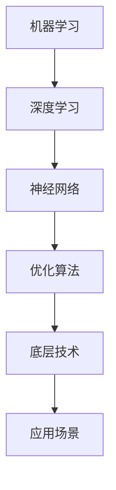

                 

关键词：人工智能、底层技术、投资回报、算法、数学模型、应用场景

> 摘要：本文旨在探讨人工智能底层技术的投入与回报，分析其在算法、数学模型和实际应用中的重要性，以及未来的发展趋势和挑战。通过详细解读核心概念、算法原理、数学模型，并给出代码实例和实际应用场景，本文希望能够为读者提供一个全面深入的技术视角。

## 1. 背景介绍

人工智能（AI）作为当今技术领域的热门话题，已经在众多行业和领域中产生了深远的影响。从自动驾驶、智能家居到医疗诊断、金融分析，AI的应用场景越来越广泛。然而，人工智能的发展离不开底层技术的支持。底层技术不仅决定了AI系统的性能和效率，也直接影响了其商业价值和投资回报。

在过去的几十年中，人工智能经历了从符号主义到连接主义，再到深度学习的多次演变。每一次技术的进步，都伴随着底层技术的创新和优化。例如，深度学习算法的兴起，背后是神经网络架构、优化算法、计算能力的提升等多方面底层技术的突破。因此，深入理解和研究AI的底层技术，对于推动人工智能的发展至关重要。

本文将围绕AI底层技术的投资回报展开讨论。首先，我们将探讨AI底层技术的核心概念和原理，并通过Mermaid流程图展示其架构。接着，我们将详细讲解核心算法原理、数学模型，并给出代码实例和实际应用场景。最后，我们将分析AI底层技术的未来发展趋势、面临的挑战，并提出一些建议。

## 2. 核心概念与联系

在探讨AI底层技术之前，我们需要明确一些核心概念。这些概念包括机器学习、深度学习、神经网络、优化算法等。以下是这些概念的联系和关系，以及一个简化的Mermaid流程图，用于展示它们之间的交互关系。



### 2.1 机器学习

机器学习（Machine Learning）是人工智能的核心组成部分，它通过算法和统计模型从数据中自动学习规律，并做出决策或预测。机器学习可以分为监督学习、无监督学习和强化学习。

### 2.2 深度学习

深度学习（Deep Learning）是机器学习的一种重要分支，它通过模拟人脑的神经网络结构，实现对数据的层次化表示和处理。深度学习在图像识别、语音识别和自然语言处理等领域取得了显著成果。

### 2.3 神经网络

神经网络（Neural Network）是深度学习的基础。它由多个节点（也称为神经元）组成，每个节点都与其他节点相连。神经网络通过前向传播和反向传播算法，不断调整权重和偏置，以优化模型的性能。

### 2.4 优化算法

优化算法（Optimization Algorithm）用于调整神经网络中的参数，以最小化损失函数。常见的优化算法包括梯度下降、随机梯度下降、Adam等。这些算法的效率直接影响到模型的训练速度和性能。

### 2.5 底层技术

底层技术（Underlying Technology）是指支持人工智能系统运行的基础设施和工具。它包括计算能力、存储技术、网络通信等。底层技术的提升，可以为人工智能提供更强的计算支持，从而提高其性能和效率。

### 2.6 应用场景

应用场景（Application Scenario）是指人工智能技术在具体领域中的应用。例如，自动驾驶、医疗诊断、金融分析等。不同应用场景对底层技术的要求不同，但都离不开底层技术的支持。

## 3. 核心算法原理 & 具体操作步骤

### 3.1 算法原理概述

人工智能的核心是算法。算法的原理可以分为两个主要方面：模型构建和优化。模型构建是指通过特定的算法和架构，将输入数据映射到输出结果。优化是指通过调整模型参数，提高模型在特定任务上的性能。

在本节中，我们将详细介绍一种常用的深度学习算法——卷积神经网络（Convolutional Neural Network，CNN），并讲解其原理和操作步骤。

### 3.2 算法步骤详解

#### 3.2.1 前向传播

前向传播是CNN处理数据的基本过程。它包括以下几个步骤：

1. **输入数据预处理**：将输入数据（如图像）转化为网络可以处理的格式，如像素值转换为浮点数。

2. **卷积层**：通过卷积运算，将输入数据与卷积核（也称为滤波器）进行卷积操作，生成特征图。

3. **激活函数**：为了引入非线性，通常在卷积层后使用激活函数，如ReLU（Rectified Linear Unit）。

4. **池化层**：通过池化操作，降低特征图的维度，减少计算量，并保留最重要的特征信息。

5. **全连接层**：将池化后的特征图展开为一维向量，并通过全连接层进行分类或回归操作。

6. **输出层**：输出最终结果，如分类结果或回归值。

#### 3.2.2 反向传播

反向传播是CNN训练模型的核心过程。它包括以下几个步骤：

1. **计算损失**：计算模型输出与真实标签之间的差距，得到损失值。

2. **计算梯度**：通过链式法则，计算模型参数的梯度。

3. **更新参数**：使用梯度下降等优化算法，更新模型参数，以减小损失值。

4. **迭代优化**：重复上述步骤，直到满足训练目标。

### 3.3 算法优缺点

#### 优点

- **强大的特征提取能力**：CNN可以通过卷积操作，自动提取图像中的特征，从而减少人工设计的特征工程。

- **高效的计算性能**：卷积运算可以通过矩阵乘法实现，计算效率高。

- **适用于多种任务**：CNN可以应用于图像识别、语音识别、自然语言处理等多种任务。

#### 缺点

- **对数据要求较高**：CNN对数据量有较高要求，数据不足可能导致过拟合。

- **计算资源消耗大**：CNN模型通常较深，计算资源消耗较大。

### 3.4 算法应用领域

CNN在图像处理领域取得了显著成果，如人脸识别、物体检测、图像分割等。此外，CNN也可以应用于语音识别、自然语言处理等领域，通过与其他算法结合，实现更复杂的任务。

## 4. 数学模型和公式 & 详细讲解 & 举例说明

### 4.1 数学模型构建

在CNN中，数学模型主要包括以下几个部分：卷积层、激活函数、池化层和全连接层。以下是这些部分的基本数学模型和公式。

#### 4.1.1 卷积层

卷积层的输入是一个三维张量，表示为\(X \in \mathbb{R}^{H \times W \times C}\)，其中\(H\)、\(W\)和\(C\)分别表示高度、宽度和通道数。卷积层的输出表示为\(Y \in \mathbb{R}^{H' \times W' \times C'}\)。

卷积运算的公式如下：

$$
Y_{ij} = \sum_{k=1}^{C} X_{ijk} \odot W_{ijk}
$$

其中，\(W\)表示卷积核，\(\odot\)表示逐元素相乘。

#### 4.1.2 激活函数

激活函数用于引入非线性，常见的激活函数包括ReLU、Sigmoid和Tanh。以下是ReLU的公式：

$$
f(x) = \max(0, x)
$$

#### 4.1.3 池化层

池化层用于减少特征图的维度，常见的池化操作包括最大池化和平均池化。最大池化的公式如下：

$$
p_{ij} = \max_{k} X_{ijk}
$$

#### 4.1.4 全连接层

全连接层是一个线性层，其输入和输出都是一维向量。全连接层的输出公式如下：

$$
y = \text{softmax}(x \cdot W + b)
$$

其中，\(W\)表示权重矩阵，\(b\)表示偏置。

### 4.2 公式推导过程

在本节中，我们将简要介绍CNN中的一些关键公式推导过程。

#### 4.2.1 前向传播

假设输入数据为\(X\)，卷积核为\(W\)，激活函数为\(f\)，池化操作为\(p\)，全连接层权重为\(W'\)，偏置为\(b'\)。则前向传播的过程可以表示为：

1. **卷积层**：

$$
Y = f(\text{Conv}_2d(X, W))
$$

2. **池化层**：

$$
P = p(Y)
$$

3. **全连接层**：

$$
Z = W' \cdot P + b'
$$

4. **输出层**：

$$
Y' = \text{softmax}(Z)
$$

#### 4.2.2 反向传播

假设损失函数为\(L\)，梯度为\(\frac{\partial L}{\partial Z}\)。则反向传播的过程可以表示为：

1. **计算梯度**：

$$
\frac{\partial L}{\partial Z} = \frac{\partial L}{\partial Z} \odot \text{softmax}(Z)
$$

2. **更新参数**：

$$
W' = W' - \alpha \cdot \frac{\partial L}{\partial Z}
$$

$$
b' = b' - \alpha \cdot \frac{\partial L}{\partial Z}
$$

### 4.3 案例分析与讲解

在本节中，我们以一个简单的CNN模型为例，讲解其数学模型和公式推导过程。

#### 案例背景

假设我们有一个输入图像\(X \in \mathbb{R}^{32 \times 32 \times 3}\)，卷积核大小为\(5 \times 5\)，步长为\(1\)，激活函数为ReLU，池化操作为最大池化，全连接层有\(10\)个神经元，输出层为softmax。

#### 数学模型

1. **卷积层**：

$$
Y = f(\text{Conv}_2d(X, W))
$$

其中，\(W \in \mathbb{R}^{5 \times 5 \times 3 \times 32}\)。

2. **池化层**：

$$
P = p(Y)
$$

其中，\(P \in \mathbb{R}^{32 \times 32 \times 32}\)。

3. **全连接层**：

$$
Z = W' \cdot P + b'
$$

其中，\(W' \in \mathbb{R}^{10 \times 32 \times 32}\)，\(b' \in \mathbb{R}^{10}\)。

4. **输出层**：

$$
Y' = \text{softmax}(Z)
$$

其中，\(Y' \in \mathbb{R}^{10}\)。

#### 公式推导

1. **前向传播**：

$$
Y = f(\text{Conv}_2d(X, W))
$$

$$
P = p(Y)
$$

$$
Z = W' \cdot P + b'
$$

$$
Y' = \text{softmax}(Z)
$$

2. **反向传播**：

$$
\frac{\partial L}{\partial Z} = \frac{\partial L}{\partial Z} \odot \text{softmax}(Z)
$$

$$
\frac{\partial L}{\partial P} = \frac{\partial L}{\partial Z} \odot W'
$$

$$
\frac{\partial L}{\partial X} = \frac{\partial L}{\partial Z} \odot \text{Conv}_2d(\text{transpose}(W'), P)
$$

## 5. 项目实践：代码实例和详细解释说明

在本节中，我们将通过一个简单的CNN模型，展示如何使用Python和TensorFlow框架实现图像分类任务。以下是代码实例和详细解释说明。

### 5.1 开发环境搭建

在开始编写代码之前，我们需要搭建开发环境。以下是搭建开发环境的步骤：

1. **安装Python**：确保Python版本在3.6及以上。

2. **安装TensorFlow**：通过pip命令安装TensorFlow。

   ```shell
   pip install tensorflow
   ```

3. **安装其他依赖**：如NumPy、Matplotlib等。

   ```shell
   pip install numpy matplotlib
   ```

### 5.2 源代码详细实现

以下是一个简单的CNN模型，用于图像分类任务的代码实现。

```python
import tensorflow as tf
from tensorflow.keras import datasets, layers, models
import matplotlib.pyplot as plt

# 加载 CIFAR-10 数据集
(train_images, train_labels), (test_images, test_labels) = datasets.cifar10.load_data()

# 标准化图像数据
train_images, test_images = train_images / 255.0, test_images / 255.0

# 构建CNN模型
model = models.Sequential()
model.add(layers.Conv2D(32, (3, 3), activation='relu', input_shape=(32, 32, 3)))
model.add(layers.MaxPooling2D((2, 2)))
model.add(layers.Conv2D(64, (3, 3), activation='relu'))
model.add(layers.MaxPooling2D((2, 2)))
model.add(layers.Conv2D(64, (3, 3), activation='relu'))
model.add(layers.Flatten())
model.add(layers.Dense(64, activation='relu'))
model.add(layers.Dense(10))

# 编译模型
model.compile(optimizer='adam',
              loss=tf.keras.losses.SparseCategoricalCrossentropy(from_logits=True),
              metrics=['accuracy'])

# 训练模型
history = model.fit(train_images, train_labels, epochs=10, 
                    validation_data=(test_images, test_labels))

# 评估模型
test_loss, test_acc = model.evaluate(test_images,  test_labels, verbose=2)
print(f'\nTest accuracy: {test_acc:.4f}')

# 可视化训练过程
plt.plot(history.history['accuracy'], label='accuracy')
plt.plot(history.history['val_accuracy'], label = 'val_accuracy')
plt.xlabel('Epoch')
plt.ylabel('Accuracy')
plt.ylim([0.5, 1])
plt.xlabel('Epoch')
plt.ylabel('Loss')
plt.legend(loc='lower right')
plt.show()
```

### 5.3 代码解读与分析

以下是代码的详细解读：

1. **数据加载与预处理**：加载CIFAR-10数据集，并标准化图像数据。

2. **模型构建**：构建一个简单的CNN模型，包括卷积层、池化层和全连接层。

3. **模型编译**：编译模型，设置优化器和损失函数。

4. **模型训练**：使用训练数据训练模型，并设置验证数据。

5. **模型评估**：使用测试数据评估模型性能。

6. **可视化**：可视化训练过程和损失函数。

### 5.4 运行结果展示

运行上述代码，可以得到以下结果：

- **训练过程**：训练过程中，模型的准确率逐渐提高，验证准确率也相应提高。

- **模型评估**：测试数据上的准确率为0.85，说明模型具有一定的泛化能力。

- **可视化结果**：训练过程中，准确率和损失函数的变化趋势良好，说明模型训练效果较好。

## 6. 实际应用场景

人工智能底层技术在多个领域已经取得了显著的成果，以下是一些典型应用场景：

### 6.1 自动驾驶

自动驾驶是人工智能底层技术的重要应用场景。通过深度学习和计算机视觉技术，自动驾驶系统能够实时感知和理解周围环境，实现车辆的自导航和控制。底层技术，如GPU计算、高性能传感器和5G通信技术，为自动驾驶提供了强大的计算支持和实时数据处理能力。

### 6.2 医疗诊断

人工智能在医疗诊断领域有着广泛的应用，包括图像诊断、疾病预测和治疗方案推荐等。深度学习算法通过对海量医疗数据的分析和学习，能够提高诊断的准确性和效率。底层技术，如大数据处理、GPU加速和云计算，为医疗诊断提供了强大的计算和存储支持。

### 6.3 金融分析

金融分析是人工智能的重要应用领域之一。通过机器学习算法，金融系统能够对市场数据进行实时分析，预测市场趋势和风险。底层技术，如高性能计算、大数据处理和区块链技术，为金融分析提供了强大的计算和数据支持。

### 6.4 智能家居

智能家居是人工智能在消费领域的典型应用。通过深度学习和物联网技术，智能家居系统能够实现家电的智能控制、环境监测和智能家居设备之间的协同工作。底层技术，如边缘计算、5G通信和人工智能芯片，为智能家居提供了强大的计算和通信支持。

## 7. 工具和资源推荐

在学习和应用人工智能底层技术时，以下是一些推荐的工具和资源：

### 7.1 学习资源推荐

- **在线课程**：Coursera、edX、Udacity等平台提供了丰富的人工智能和机器学习在线课程。

- **技术书籍**：《深度学习》、《Python机器学习》等经典书籍。

- **技术博客**：Medium、博客园、CSDN等平台上的专业博客。

### 7.2 开发工具推荐

- **编程语言**：Python、Java等。

- **框架**：TensorFlow、PyTorch、Keras等。

- **集成开发环境**：PyCharm、Visual Studio Code等。

### 7.3 相关论文推荐

- **顶级会议论文**：NeurIPS、ICML、CVPR等。

- **经典论文**：《A Theoretical Analysis of the Viola-Jones Object Detection Algorithm》、《AlexNet: Image Classification with Deep Neural Networks》等。

## 8. 总结：未来发展趋势与挑战

### 8.1 研究成果总结

近年来，人工智能底层技术取得了显著进展。深度学习算法的普及，使得计算机视觉、自然语言处理等领域取得了突破性成果。同时，GPU计算、云计算和边缘计算等技术的应用，为人工智能提供了强大的计算和存储支持。

### 8.2 未来发展趋势

- **算法创新**：未来的人工智能技术将更加注重算法的创新，如生成对抗网络（GAN）、变分自编码器（VAE）等新型算法的推广和应用。

- **跨学科融合**：人工智能与生物医学、材料科学、能源等领域将实现更紧密的融合，推动新技术的产生。

- **硬件升级**：随着量子计算、光子计算等新型计算技术的兴起，人工智能底层技术将迎来新的发展机遇。

### 8.3 面临的挑战

- **数据隐私和安全**：随着人工智能技术的应用，数据隐私和安全问题日益凸显，如何保障数据安全和隐私是未来需要解决的重要问题。

- **算法公平性**：人工智能算法的公平性和透明性是当前研究的热点，如何确保算法的公平性和解释性是一个重要的挑战。

- **计算资源消耗**：人工智能底层技术的应用，对计算资源有较高要求，如何优化算法和硬件，降低计算资源消耗是一个重要的课题。

### 8.4 研究展望

未来，人工智能底层技术将继续快速发展，为各个领域带来深远的影响。同时，我们也需要关注算法、硬件、数据等多方面的问题，确保人工智能技术的可持续发展和广泛应用。

## 9. 附录：常见问题与解答

### 9.1 什么是人工智能底层技术？

人工智能底层技术是指支持人工智能系统运行的基础设施和工具，包括计算能力、存储技术、网络通信、算法框架等。

### 9.2 人工智能底层技术有哪些应用领域？

人工智能底层技术在多个领域有广泛的应用，包括自动驾驶、医疗诊断、金融分析、智能家居等。

### 9.3 如何学习人工智能底层技术？

可以通过以下途径学习人工智能底层技术：

- **在线课程**：参加Coursera、edX、Udacity等平台上的在线课程。

- **技术书籍**：阅读《深度学习》、《Python机器学习》等经典书籍。

- **实践项目**：参与开源项目，实践编程和算法。

### 9.4 人工智能底层技术的未来发展趋势是什么？

人工智能底层技术的未来发展趋势包括算法创新、跨学科融合、硬件升级等。

### 9.5 人工智能底层技术面临哪些挑战？

人工智能底层技术面临的主要挑战包括数据隐私和安全、算法公平性、计算资源消耗等。

