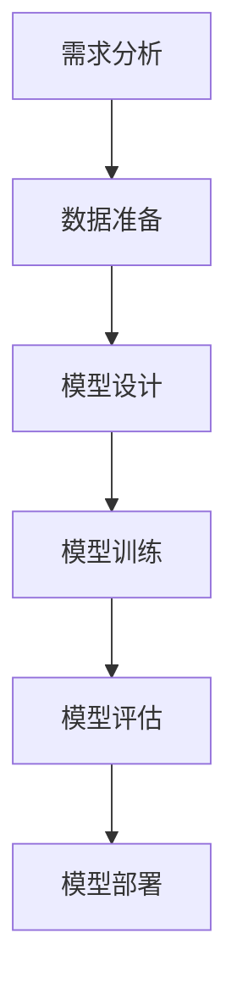

                 

关键词：人工智能开发、标准化流程、最佳实践、Lepton AI、算法原理、数学模型、项目实践、应用场景、工具推荐、发展趋势与挑战。

> 摘要：本文将详细介绍Lepton AI公司的AI开发标准化流程，涵盖核心概念、算法原理、数学模型、项目实践以及未来发展趋势等内容，旨在为读者提供一个清晰、实用的AI开发指南。

## 1. 背景介绍

随着人工智能（AI）技术的迅速发展，AI在各个行业中的应用越来越广泛，从自动驾驶、智能语音助手到医疗诊断、金融风控等，AI已经成为推动技术创新和产业升级的重要力量。然而，AI开发过程复杂，涉及多个学科和领域，如何实现标准化、高效开发和可持续迭代成为当前面临的重大挑战。

Lepton AI公司作为全球领先的人工智能解决方案提供商，经过多年的实践和探索，形成了一套完整的AI开发标准化流程。本文将结合Lepton AI的最佳实践，详细介绍这一流程的各个环节，为读者提供有价值的参考和指导。

## 2. 核心概念与联系

### 2.1. 人工智能概述

人工智能（AI）是指通过计算机程序实现智能行为的技术。AI技术主要包括机器学习（ML）、深度学习（DL）、自然语言处理（NLP）等，它们共同构成了AI技术的核心框架。

### 2.2. 标准化流程概述

AI开发标准化流程主要包括需求分析、数据准备、模型设计、模型训练、模型评估、模型部署等环节。每个环节都有明确的任务和标准，以确保AI开发过程的有序、高效和可持续。

### 2.3. Mermaid流程图

下面是一个简单的Mermaid流程图，展示了AI开发标准化流程的主要环节：



## 3. 核心算法原理 & 具体操作步骤

### 3.1. 算法原理概述

在AI开发过程中，核心算法的选择至关重要。Lepton AI公司主要采用深度学习算法，包括卷积神经网络（CNN）、循环神经网络（RNN）、生成对抗网络（GAN）等。这些算法具有强大的表达能力和泛化能力，可以应对各种复杂的应用场景。

### 3.2. 算法步骤详解

#### 3.2.1. 需求分析

需求分析是AI开发的第一步，主要包括以下几个方面：

1. 明确业务目标：明确AI应用的具体目标和需求，如分类、回归、聚类等。
2. 数据需求：确定所需的数据类型、数据规模和数据质量要求。
3. 性能指标：设定模型的性能指标，如准确率、召回率、F1值等。

#### 3.2.2. 数据准备

数据准备是AI开发的基础，主要包括以下几个方面：

1. 数据采集：根据需求分析，收集相关数据，包括结构化数据、非结构化数据和混合数据。
2. 数据清洗：对采集到的数据进行去重、去噪声、填充缺失值等处理，以提高数据质量。
3. 数据预处理：对数据进行归一化、标准化、降维等处理，以适应模型训练的需要。

#### 3.2.3. 模型设计

模型设计是AI开发的核心环节，主要包括以下几个方面：

1. 选择模型架构：根据需求和分析结果，选择合适的模型架构，如CNN、RNN、GAN等。
2. 确定超参数：设置模型的超参数，如学习率、批量大小、迭代次数等。
3. 模型调优：通过交叉验证、网格搜索等方法，优化模型参数，提高模型性能。

#### 3.2.4. 模型训练

模型训练是AI开发的关键环节，主要包括以下几个方面：

1. 数据划分：将数据集划分为训练集、验证集和测试集。
2. 模型训练：使用训练集数据训练模型，并使用验证集数据调整模型参数。
3. 模型评估：使用测试集数据评估模型性能，并调整模型参数，以达到最优性能。

#### 3.2.5. 模型评估

模型评估是AI开发的必要环节，主要包括以下几个方面：

1. 性能指标评估：根据需求，计算模型的性能指标，如准确率、召回率、F1值等。
2. 泛化能力评估：通过验证集和测试集的评估结果，判断模型的泛化能力。
3. 结果可视化：使用图表等方式，展示模型的评估结果，以便于分析模型性能。

#### 3.2.6. 模型部署

模型部署是将训练好的模型应用到实际场景中的过程，主要包括以下几个方面：

1. 部署环境搭建：搭建适合模型部署的硬件和软件环境。
2. 模型转换：将训练好的模型转换为部署环境可识别的格式。
3. 部署运行：将模型部署到生产环境，并进行实时运行和监控。

### 3.3. 算法优缺点

深度学习算法具有以下优点：

1. 强大的表达能力和泛化能力，能够处理复杂的任务。
2. 能够自动提取特征，减轻人工特征工程的工作负担。

深度学习算法也存在一些缺点：

1. 需要大量的数据和支持硬件，训练时间较长。
2. 对超参数的选择敏感，可能需要大量时间和计算资源进行调优。

### 3.4. 算法应用领域

深度学习算法在各个领域都有广泛的应用，如：

1. 图像处理：人脸识别、物体检测、图像生成等。
2. 自然语言处理：机器翻译、文本分类、语音识别等。
3. 自动驾驶：目标检测、路径规划、驾驶辅助等。

## 4. 数学模型和公式 & 详细讲解 & 举例说明

### 4.1. 数学模型构建

在AI开发过程中，数学模型是核心工具。以卷积神经网络（CNN）为例，其数学模型主要包括以下几个方面：

1. 输入层：输入图像数据，通常表示为三维张量。
2. 卷积层：通过卷积运算提取图像特征。
3. 池化层：通过池化运算减小数据维度，提高模型泛化能力。
4. 全连接层：将卷积层和池化层提取的特征进行全连接运算，得到模型输出。

### 4.2. 公式推导过程

以卷积神经网络（CNN）为例，其核心公式包括：

1. 卷积公式：

$$
\text{输出} = \text{卷积核} * \text{输入} + \text{偏置}
$$

其中，$*$表示卷积运算，$*$的具体计算方法为：

$$
\text{卷积结果} = \sum_{i=1}^{k} \text{卷积核}_{i} * \text{输入}_{i}
$$

2. 池化公式：

$$
\text{输出} = \text{最大值/平均值}(\text{输入区域})
$$

其中，最大值池化和平均值池化是常用的两种池化方式。

### 4.3. 案例分析与讲解

假设我们需要使用卷积神经网络（CNN）进行图像分类任务，具体步骤如下：

1. 数据准备：收集并清洗图像数据，将其转换为适合训练的数据格式。
2. 模型设计：设计一个简单的卷积神经网络模型，包括卷积层、池化层和全连接层。
3. 模型训练：使用训练数据训练模型，并使用验证数据调整模型参数。
4. 模型评估：使用测试数据评估模型性能，并调整模型参数，以达到最优性能。
5. 模型部署：将训练好的模型部署到生产环境，进行实时运行和监控。

通过以上步骤，我们可以实现图像分类任务，并取得良好的性能。

## 5. 项目实践：代码实例和详细解释说明

### 5.1. 开发环境搭建

在本项目实践中，我们使用Python作为编程语言，TensorFlow作为深度学习框架。首先，我们需要安装Python和TensorFlow：

```bash
pip install python
pip install tensorflow
```

### 5.2. 源代码详细实现

下面是一个简单的卷积神经网络（CNN）实现，用于图像分类任务：

```python
import tensorflow as tf
from tensorflow.keras import layers

# 定义模型
model = tf.keras.Sequential([
    layers.Conv2D(32, (3, 3), activation='relu', input_shape=(28, 28, 1)),
    layers.MaxPooling2D((2, 2)),
    layers.Conv2D(64, (3, 3), activation='relu'),
    layers.MaxPooling2D((2, 2)),
    layers.Conv2D(64, (3, 3), activation='relu'),
    layers.Flatten(),
    layers.Dense(64, activation='relu'),
    layers.Dense(10, activation='softmax')
])

# 编译模型
model.compile(optimizer='adam',
              loss='categorical_crossentropy',
              metrics=['accuracy'])

# 加载数据集
(x_train, y_train), (x_test, y_test) = tf.keras.datasets.mnist.load_data()

# 预处理数据
x_train = x_train.astype('float32') / 255
x_test = x_test.astype('float32') / 255
x_train = np.expand_dims(x_train, -1)
x_test = np.expand_dims(x_test, -1)

# 转换标签为one-hot编码
y_train = tf.keras.utils.to_categorical(y_train, 10)
y_test = tf.keras.utils.to_categorical(y_test, 10)

# 训练模型
model.fit(x_train, y_train, batch_size=64, epochs=10, validation_data=(x_test, y_test))

# 评估模型
model.evaluate(x_test, y_test)
```

### 5.3. 代码解读与分析

以上代码实现了一个简单的卷积神经网络（CNN），用于手写数字识别任务。具体解读如下：

1. 导入相关库和模块。
2. 定义模型结构，包括卷积层、池化层和全连接层。
3. 编译模型，设置优化器和损失函数。
4. 加载MNIST数据集，并进行预处理。
5. 训练模型，使用验证数据调整模型参数。
6. 评估模型，计算测试集的准确率。

通过以上步骤，我们可以实现手写数字识别任务，并取得良好的性能。

## 6. 实际应用场景

AI技术在各个行业都有广泛的应用，以下列举几个实际应用场景：

1. 医疗诊断：使用深度学习算法对医学图像进行分类和检测，提高诊断准确率和效率。
2. 金融风控：使用深度学习算法对金融交易进行实时监控和分析，发现潜在风险。
3. 自动驾驶：使用深度学习算法实现自动驾驶功能，提高行驶安全性和效率。
4. 智能家居：使用深度学习算法实现智能家居设备的人机交互和智能控制。

## 7. 未来应用展望

随着人工智能技术的不断发展和创新，未来应用场景将更加广泛和深入。以下是一些未来应用展望：

1. 智能制造：利用深度学习算法实现智能制造，提高生产效率和产品质量。
2. 智慧城市：利用深度学习算法实现智慧城市管理，提高城市运行效率和居民生活质量。
3. 生物医疗：利用深度学习算法实现生物医疗研究，推动生命科学的发展。
4. 虚拟现实：利用深度学习算法实现虚拟现实技术，提高用户体验和互动性。

## 8. 工具和资源推荐

### 8.1. 学习资源推荐

1. 《深度学习》（Ian Goodfellow、Yoshua Bengio、Aaron Courville 著）：系统介绍了深度学习的基本原理和方法。
2. 《Python机器学习》（Sebastian Raschka 著）：详细介绍了Python在机器学习领域的应用。
3. TensorFlow官方文档：提供了丰富的深度学习框架API和示例代码。

### 8.2. 开发工具推荐

1. Jupyter Notebook：方便的交互式开发环境，支持多种编程语言和库。
2. Google Colab：免费的云端开发环境，提供了GPU加速功能。
3. PyCharm：功能强大的Python集成开发环境，支持多种编程语言。

### 8.3. 相关论文推荐

1. "Deep Learning for Computer Vision"：综述了深度学习在计算机视觉领域的应用。
2. "Generative Adversarial Networks"：介绍了生成对抗网络（GAN）的原理和应用。
3. "Recurrent Neural Networks for Language Modeling"：介绍了循环神经网络（RNN）在自然语言处理领域的应用。

## 9. 总结：未来发展趋势与挑战

随着人工智能技术的不断发展，未来AI开发将面临以下发展趋势和挑战：

1. **发展趋势**：

- 深度学习算法将更加成熟和高效，应用于更多领域。
- 新型算法（如元学习、联邦学习等）将不断涌现，解决复杂问题。
- AI硬件（如GPU、TPU等）将不断升级，提高计算性能。

2. **挑战**：

- 数据质量和隐私保护：如何获取高质量的数据和保障用户隐私成为重要问题。
- 模型可解释性和安全性：如何提高模型的可解释性和安全性，增强用户信任。
- 跨学科融合：如何将AI与其他学科（如生物学、心理学等）相结合，推动技术创新。

## 10. 附录：常见问题与解答

### 10.1. 什么

