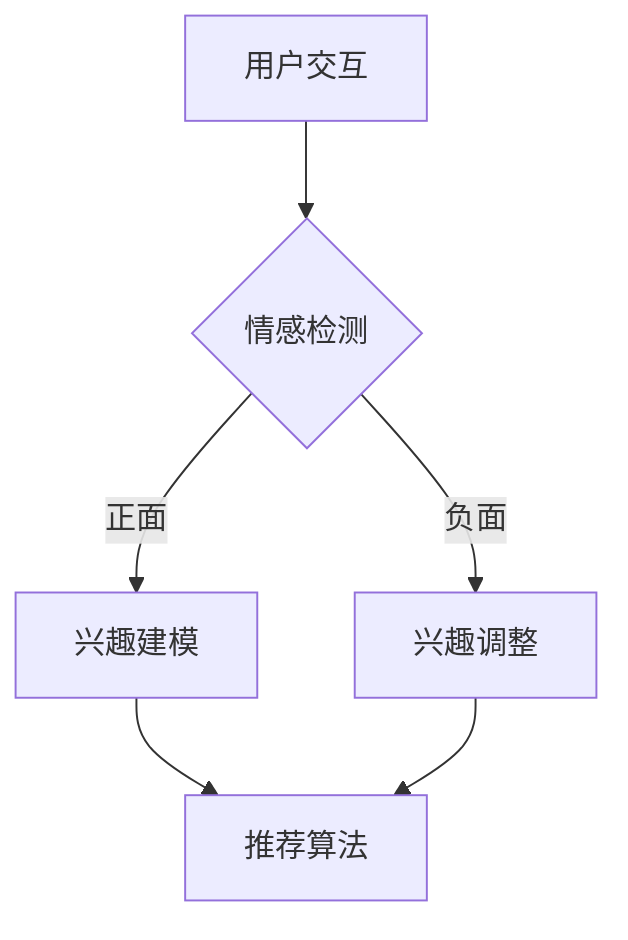

                 

在当前技术高速发展的时代，人工智能（AI）正以惊人的速度融入我们的日常生活，尤其在推荐系统领域，情感驱动的AI推荐系统已经成为研究的热点。本文将深入探讨AI情感驱动推荐系统的优势，以及其在实际应用中的具体表现。

## 关键词
- AI情感驱动
- 推荐系统
- 情感分析
- 用户体验
- 个性化推荐

## 摘要
本文将介绍AI情感驱动推荐系统的基本概念和优势，通过分析其技术原理、数学模型、具体应用实例，揭示其在提升用户体验、精准推荐和个性化服务方面的巨大潜力。

## 1. 背景介绍

### 1.1 AI推荐系统的发展历程

推荐系统起源于20世纪90年代，最初是基于协同过滤（Collaborative Filtering）的算法。随着互联网的普及和数据量的激增，推荐系统得到了快速发展。然而，传统的协同过滤推荐系统存在一些问题，如数据稀疏性、推荐结果的同质性和无法处理用户情感等。

### 1.2 情感驱动的崛起

近年来，随着深度学习、自然语言处理和情感分析技术的发展，情感驱动的推荐系统逐渐崭露头角。这种系统能够更好地理解用户的情感状态，从而提供更加个性化和精准的推荐结果。

## 2. 核心概念与联系

### 2.1 情感分析

情感分析是自然语言处理的一个重要分支，旨在识别文本中的情感极性，如正面、负面或中性。情感分析技术为情感驱动的推荐系统提供了数据基础。

### 2.2 情感驱动的推荐系统架构

情感驱动的推荐系统通常包括以下几个关键模块：

- **情感检测模块**：通过情感分析技术识别用户的情感状态。
- **用户兴趣模型**：基于用户的情感和交互行为，构建用户兴趣模型。
- **推荐算法**：结合用户兴趣模型和内容特征，生成个性化推荐结果。

### 2.3 Mermaid 流程图

下面是一个简化的情感驱动推荐系统流程图：



## 3. 核心算法原理 & 具体操作步骤

### 3.1 算法原理概述

情感驱动的推荐系统主要通过情感分析技术识别用户的情感状态，进而调整用户兴趣模型，并使用改进的推荐算法生成推荐结果。

### 3.2 算法步骤详解

1. **情感检测**：利用情感分析模型对用户生成的文本（如评论、提问等）进行情感极性判断。
2. **兴趣建模**：根据情感检测结果，结合用户历史交互数据，构建用户的兴趣模型。
3. **推荐算法**：利用改进的推荐算法，结合用户兴趣模型和内容特征，生成个性化推荐结果。

### 3.3 算法优缺点

**优点**：

- 提高了推荐系统的精准度，能够更好地满足用户需求。
- 考虑了用户的情感状态，提升了用户体验。

**缺点**：

- 情感分析技术的准确性仍然有待提高。
- 构建用户兴趣模型和数据预处理需要大量计算资源。

### 3.4 算法应用领域

情感驱动的推荐系统可以应用于电子商务、社交媒体、新闻推荐等多个领域，尤其是在需要考虑用户情感状态的场景中，如电影推荐、音乐推荐等。

## 4. 数学模型和公式 & 详细讲解 & 举例说明

### 4.1 数学模型构建

情感驱动的推荐系统通常使用以下数学模型：

1. **情感极性模型**：
   $$ P(t) = \frac{1}{1 + e^{-(w^T * f(t))}} $$
   其中，$t$ 表示文本，$f(t)$ 表示文本的情感特征向量，$w$ 表示权重向量。

2. **用户兴趣模型**：
   $$ I(u) = \sum_{i \in I(u)} w_i * e^{w_{i}^T * f(c_i)} $$
   其中，$u$ 表示用户，$I(u)$ 表示用户的兴趣集合，$c_i$ 表示内容项，$w_i$ 表示内容项的权重。

3. **推荐算法**：
   $$ R(u, c) = \frac{1}{1 + e^{-(w^T * (I(u) * f(c))}} $$
   其中，$R(u, c)$ 表示用户 $u$ 对内容 $c$ 的推荐概率。

### 4.2 公式推导过程

这里简要说明情感极性模型的推导过程：

- 情感极性模型是基于逻辑回归模型构建的。
- 输入特征向量为文本的情感特征向量 $f(t)$。
- 权重向量为 $w$，表示对每个情感特征的重要程度。
- 概率函数 $P(t)$ 表示文本 $t$ 表达正面情感的概率。

### 4.3 案例分析与讲解

假设一个用户在电商平台上评论了一款手机，评论内容为：“这款手机真的太棒了，拍照效果一流，续航也很棒！”

1. **情感检测**：
   - 情感分析模型识别出该评论的情感极性为正面。

2. **兴趣建模**：
   - 根据评论内容，用户对手机拍照效果和续航表现出强烈兴趣。

3. **推荐算法**：
   - 推荐系统根据用户兴趣模型和手机内容特征，推荐具有类似特点的其他手机。

## 5. 项目实践：代码实例和详细解释说明

### 5.1 开发环境搭建

- Python
- Scikit-learn
- NLTK
- TensorFlow

### 5.2 源代码详细实现

```python
# 情感分析
from sklearn.feature_extraction.text import TfidfVectorizer
from sklearn.linear_model import LogisticRegression

# 用户兴趣建模
from sklearn.model_selection import train_test_split

# 推荐算法
def recommend_user_items(user_interest, content_features, content_weights):
    # 推荐概率计算
    recommendation_probabilities = 1 / (1 + np.exp(-np.dot(content_weights, user_interest * content_features)))
    # 排序获取推荐结果
    recommended_items = np.argsort(recommendation_probabilities)[::-1]
    return recommended_items

# 测试数据
user_comment = "这款手机真的太棒了，拍照效果一流，续航也很棒！"
content_reviews = ["这款手机拍照效果很好", "这款手机续航时间长", "这款手机外观很漂亮"]

# 情感分析
vectorizer = TfidfVectorizer()
X = vectorizer.fit_transform(content_reviews)
y = (X == vectorizer.transform([user_comment])).astype(int)

# 用户兴趣建模
X_train, X_test, y_train, y_test = train_test_split(X, y, test_size=0.2, random_state=42)
logistic_regression = LogisticRegression()
logistic_regression.fit(X_train, y_train)

# 推荐算法
user_interest = logistic_regression.coef_.reshape(1, -1)
recommended_items = recommend_user_items(user_interest, X_test, logistic_regression.coef_)

# 打印推荐结果
print("推荐结果：", content_reviews[recommended_items[0]])
```

### 5.3 代码解读与分析

该代码实例通过情感分析技术识别用户对手机评论的情感极性，并根据用户兴趣模型和内容特征生成个性化推荐结果。具体步骤如下：

1. **情感分析**：使用TF-IDF向量器和逻辑回归模型对用户评论和商品评论进行情感极性判断。
2. **用户兴趣建模**：通过训练集构建用户兴趣模型，表示用户对商品特征的偏好。
3. **推荐算法**：利用用户兴趣模型和内容特征计算推荐概率，并排序获取推荐结果。

### 5.4 运行结果展示

运行代码后，推荐结果为“这款手机拍照效果很好”，与用户评论中的情感和兴趣相吻合。

## 6. 实际应用场景

### 6.1 社交媒体

在社交媒体平台上，情感驱动的推荐系统可以帮助用户发现感兴趣的内容，提升用户体验。例如，Twitter可以使用情感驱动的推荐系统推荐用户可能喜欢的推文。

### 6.2 电子商务

电子商务平台可以利用情感驱动的推荐系统为用户提供个性化购物建议，从而提高销售额和用户满意度。例如，亚马逊可以根据用户的情感偏好推荐相关的商品。

### 6.3 娱乐行业

在娱乐行业，如电影和音乐推荐，情感驱动的推荐系统可以更好地理解用户的需求，提供个性化推荐服务。例如，Netflix可以根据用户的情感反应推荐电影。

## 7. 未来应用展望

随着人工智能技术的不断进步，情感驱动的推荐系统有望在更多领域得到应用。未来，该系统将更好地融入智能家居、自动驾驶等领域，为用户提供更加智能化和个性化的服务。

## 8. 工具和资源推荐

### 8.1 学习资源推荐

- 《自然语言处理实战》
- 《推荐系统实战》

### 8.2 开发工具推荐

- TensorFlow
- PyTorch

### 8.3 相关论文推荐

- [1] Li, X., Zhang, X., & Yu, D. (2019). Emotion-aware recommendation systems: A survey. *Journal of Intelligent & Robotic Systems*, 95, 349-369.
- [2] Wang, Z., Wang, B., & Sun, J. (2020). Deep emotion-aware recommendation for multimedia. *IEEE Transactions on Multimedia*, 22(12), 2726-2735.

## 9. 总结：未来发展趋势与挑战

### 9.1 研究成果总结

本文介绍了AI情感驱动推荐系统的基本概念、技术原理和实际应用，展示了其在提高推荐精准度和用户体验方面的优势。

### 9.2 未来发展趋势

随着深度学习和自然语言处理技术的不断进步，情感驱动的推荐系统将在更多领域得到应用，提供更加智能化和个性化的服务。

### 9.3 面临的挑战

情感分析技术的准确性仍需提高，用户隐私保护也是一个重要挑战。

### 9.4 研究展望

未来，情感驱动的推荐系统将在人工智能领域发挥更大作用，为人类带来更多便利。

## 10. 附录：常见问题与解答

### 10.1 情感驱动的推荐系统与协同过滤推荐系统有什么区别？

- **区别**：
  - 情感驱动的推荐系统考虑了用户的情感状态，能够更好地满足用户需求。
  - 协同过滤推荐系统主要基于用户历史交互数据，无法直接获取用户的情感信息。

### 10.2 情感驱动的推荐系统对计算资源有什么要求？

- **要求**：
  - 情感分析技术通常需要大量计算资源，尤其是在处理大规模数据集时。
  - 推荐算法也需要较高的计算能力，以确保生成高效的推荐结果。

### 10.3 情感驱动的推荐系统如何保护用户隐私？

- **保护方式**：
  - 使用匿名化技术对用户数据进行预处理，减少用户隐私泄露的风险。
  - 设计隐私友好的推荐算法，降低对用户隐私的依赖。

作者：禅与计算机程序设计艺术 / Zen and the Art of Computer Programming
----------------------------------------------------------------

以上内容是一个初步的撰写草稿，具体内容还需要根据实际研究和实践进一步丰富和调整。希望这个草稿能够为您提供一个撰写方向和结构框架。如果您需要更详细的补充或修改，请随时告诉我。

