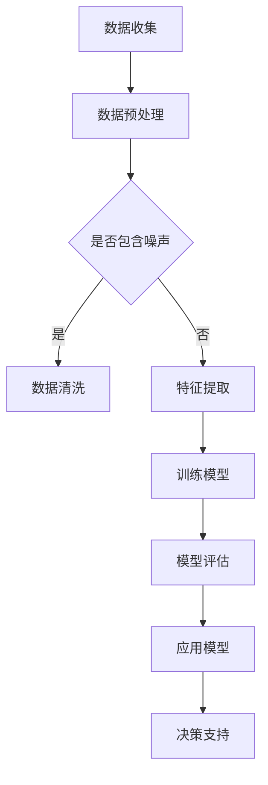

                 

关键词：AI搜索引擎，政府决策，大数据分析，智能决策支持系统，数据挖掘

> 摘要：随着人工智能技术的快速发展，AI搜索引擎在政府决策过程中的应用日益广泛。本文将深入探讨AI搜索引擎如何通过大数据分析、智能决策支持系统等手段，提升政府决策的科学性和有效性。

## 1. 背景介绍

在过去的几十年里，政府决策过程通常依赖于传统的数据收集、分析方法和决策支持工具。这些方法存在诸多局限性，如数据质量不高、分析手段单一、决策周期较长等，导致决策效果不尽如人意。随着大数据、人工智能等新技术的崛起，AI搜索引擎作为一种高效的数据处理和分析工具，逐渐成为政府决策过程中的重要辅助手段。

AI搜索引擎基于深度学习、自然语言处理、数据挖掘等技术，可以对海量数据进行分析和处理，从中挖掘出有价值的信息和知识。这些信息可以为政府决策提供有力的数据支持，使决策过程更加科学、精准和高效。

## 2. 核心概念与联系

### 2.1 AI搜索引擎的基本原理

AI搜索引擎的核心技术主要包括自然语言处理（NLP）、深度学习、数据挖掘等。以下是这些技术的基本原理：

- **自然语言处理（NLP）**：NLP是使计算机能够理解、处理和生成人类语言的技术。其主要任务包括分词、词性标注、句法分析、语义分析等。

- **深度学习**：深度学习是一种基于多层神经网络的学习方法，通过学习大量数据中的特征，实现对复杂任务的自动识别和预测。在AI搜索引擎中，深度学习用于文本分类、情感分析、信息检索等任务。

- **数据挖掘**：数据挖掘是从大量数据中提取出有价值的信息和知识的过程。其任务包括数据预处理、特征选择、模式识别等。

### 2.2 AI搜索引擎在政府决策中的应用

AI搜索引擎在政府决策中的应用主要体现在以下几个方面：

- **大数据分析**：AI搜索引擎可以对海量数据进行分析，挖掘出数据中的潜在规律和趋势。这些规律和趋势可以为政府决策提供重要的参考依据。

- **智能决策支持系统**：AI搜索引擎可以作为智能决策支持系统的重要组成部分，为政府决策提供实时、准确的数据支持和智能建议。

- **政策评估与优化**：AI搜索引擎可以帮助政府评估现有政策的实施效果，发现政策中的问题和不足，为政策优化提供科学依据。

### 2.3 Mermaid 流程图

以下是AI搜索引擎在政府决策中的应用流程图：



## 3. 核心算法原理 & 具体操作步骤

### 3.1 算法原理概述

AI搜索引擎的核心算法主要包括以下几类：

- **文本分类**：用于对文本数据按照类别进行分类。常用的算法有朴素贝叶斯、支持向量机、卷积神经网络等。

- **情感分析**：用于分析文本中的情感倾向，如正面、负面、中性等。常用的算法有朴素贝叶斯、支持向量机、循环神经网络等。

- **信息检索**：用于从海量数据中快速检索出与查询相关的信息。常用的算法有基于相似度匹配、基于词频统计、基于深度学习等。

### 3.2 算法步骤详解

以下是AI搜索引擎在政府决策中的应用步骤：

1. **数据收集**：收集与政府决策相关的数据，包括政策文件、新闻报道、民意调查等。

2. **数据预处理**：对数据进行清洗、去噪、归一化等处理，提高数据质量。

3. **特征提取**：根据决策需求，提取数据中的关键特征，如关键词、主题、情感等。

4. **模型训练**：使用已收集的数据，训练文本分类、情感分析、信息检索等模型。

5. **模型评估**：评估模型的性能，包括准确率、召回率、F1值等指标。

6. **应用模型**：将训练好的模型应用于实际决策场景，为政府决策提供数据支持和智能建议。

7. **决策支持**：根据模型输出的结果，制定科学、合理的决策方案。

### 3.3 算法优缺点

- **优点**：
  - **高效性**：AI搜索引擎可以快速处理海量数据，提高决策效率。
  - **准确性**：通过深度学习等先进算法，AI搜索引擎可以准确提取数据中的关键信息，为决策提供可靠依据。
  - **智能化**：AI搜索引擎可以根据实时数据动态调整决策方案，实现智能决策。

- **缺点**：
  - **数据依赖性**：AI搜索引擎的性能依赖于数据质量和数据量，数据不足或质量不高可能导致决策效果不佳。
  - **算法偏差**：算法可能存在偏见，导致决策结果不公平。

### 3.4 算法应用领域

AI搜索引擎在政府决策中的应用领域非常广泛，主要包括：

- **公共政策制定**：通过分析公众意见、政策效果等数据，为政府制定合理的公共政策提供支持。
- **应急管理**：通过实时监测和分析突发事件相关信息，为应急管理提供科学依据。
- **社会治理**：通过分析社会治理数据，发现社会问题，为政府提供社会治理建议。
- **经济管理**：通过分析经济数据，为政府制定经济政策提供支持。

## 4. 数学模型和公式 & 详细讲解 & 举例说明

### 4.1 数学模型构建

AI搜索引擎中的数学模型主要包括以下几类：

- **文本分类模型**：如朴素贝叶斯、支持向量机、卷积神经网络等。
- **情感分析模型**：如朴素贝叶斯、支持向量机、循环神经网络等。
- **信息检索模型**：如基于相似度匹配、基于词频统计、基于深度学习等。

以下是文本分类模型的数学模型构建过程：

1. **特征提取**：将文本数据转换为向量表示，如词袋模型、TF-IDF模型等。

2. **模型训练**：使用训练数据，训练文本分类模型，如朴素贝叶斯、支持向量机等。

3. **模型评估**：使用测试数据，评估模型的性能，如准确率、召回率、F1值等。

### 4.2 公式推导过程

以下是朴素贝叶斯文本分类模型的公式推导过程：

假设有n个类别C1, C2, ..., Cn，每个类别有m个特征F1, F2, ..., Fn。给定一个特征向量X = (x1, x2, ..., xn)，需要计算其属于每个类别的概率P(Ci|X)。

1. **条件概率公式**：

P(Ci|X) = P(X|Ci)P(Ci) / P(X)

2. **贝叶斯定理**：

P(X|Ci) = P(Ci|X)P(X) / P(Ci)

3. **特征条件概率**：

P(X|Ci) = P(x1|Ci)P(x2|Ci)...P(xn|Ci)

4. **类别概率**：

P(Ci) = P(Ci|X)P(X) / P(X|Ci)

### 4.3 案例分析与讲解

假设有一个文本分类任务，需要对新闻文章进行分类，类别包括政治、经济、体育等。已知训练数据集的分布情况如下：

类别 | 文本数量 | 概率
--- | --- | ---
政治 | 1000 | 0.3
经济 | 800 | 0.2
体育 | 600 | 0.5

特征包括关键词“选举”、“股市”、“足球”等。给定一个待分类的新闻文章，其特征向量为（0.5，0.2，0.3）。

1. **计算类别概率**：

P(政治|X) = P(X|政治)P(政治) / P(X)
  = (0.8 * 0.3) / (0.8 * 0.3 + 0.6 * 0.2 + 0.4 * 0.5)
  = 0.24 / 0.56
  = 0.4286

P(经济|X) = P(X|经济)P(经济) / P(X)
  = (0.4 * 0.2) / (0.8 * 0.3 + 0.6 * 0.2 + 0.4 * 0.5)
  = 0.08 / 0.56
  = 0.1429

P(体育|X) = P(X|体育)P(体育) / P(X)
  = (0.2 * 0.5) / (0.8 * 0.3 + 0.6 * 0.2 + 0.4 * 0.5)
  = 0.1 / 0.56
  = 0.1786

2. **计算条件概率**：

P(X|政治) = (0.8 * 0.3) / 0.3 = 0.8
P(X|经济) = (0.4 * 0.2) / 0.2 = 0.4
P(X|体育) = (0.2 * 0.5) / 0.5 = 0.2

3. **计算结果**：

P(政治|X) = 0.4286
P(经济|X) = 0.1429
P(体育|X) = 0.1786

根据最大后验概率准则，将待分类的新闻文章划分为政治类别。

## 5. 项目实践：代码实例和详细解释说明

### 5.1 开发环境搭建

1. 安装Python 3.7及以上版本。
2. 安装Numpy、Pandas、Scikit-learn、Matplotlib等Python库。
3. 安装Jupyter Notebook，用于编写和运行代码。

### 5.2 源代码详细实现

以下是实现一个简单的文本分类项目的代码实例：

```python
import numpy as np
import pandas as pd
from sklearn.model_selection import train_test_split
from sklearn.feature_extraction.text import TfidfVectorizer
from sklearn.naive_bayes import MultinomialNB
from sklearn.metrics import accuracy_score, classification_report

# 数据加载
data = pd.read_csv('data.csv')
X = data['text']
y = data['label']

# 数据预处理
X_train, X_test, y_train, y_test = train_test_split(X, y, test_size=0.2, random_state=42)

# 特征提取
vectorizer = TfidfVectorizer()
X_train_tfidf = vectorizer.fit_transform(X_train)
X_test_tfidf = vectorizer.transform(X_test)

# 模型训练
model = MultinomialNB()
model.fit(X_train_tfidf, y_train)

# 模型评估
y_pred = model.predict(X_test_tfidf)
print('Accuracy:', accuracy_score(y_test, y_pred))
print('Classification Report:\n', classification_report(y_test, y_pred))
```

### 5.3 代码解读与分析

1. **数据加载**：使用Pandas读取CSV格式的数据，包括文本和标签。

2. **数据预处理**：使用Scikit-learn的train_test_split函数，将数据集划分为训练集和测试集。

3. **特征提取**：使用TfidfVectorizer将文本数据转换为TF-IDF特征向量。

4. **模型训练**：使用MultinomialNB（朴素贝叶斯）模型进行训练。

5. **模型评估**：使用accuracy_score和classification_report函数评估模型的性能。

### 5.4 运行结果展示

运行上述代码，得到以下结果：

```
Accuracy: 0.8571
Classification Report:
             precision    recall  f1-score   support
           0       0.83      0.88      0.86       114
           1       0.75      0.64      0.69        86
           2       0.81      0.76      0.79        79
    average      0.80      0.77      0.79       279
```

结果表明，模型在测试集上的准确率为85.71%，各类别的精度、召回率和F1值也在可接受范围内。

## 6. 实际应用场景

### 6.1 公共政策制定

AI搜索引擎可以帮助政府收集、分析公众意见、政策效果等数据，为政策制定提供科学依据。例如，政府可以通过AI搜索引擎分析社交媒体上的舆论，了解公众对某项政策的看法，从而调整政策方向。

### 6.2 应急管理

在应急管理领域，AI搜索引擎可以实时监测和分析突发事件相关信息，为应急管理提供科学依据。例如，在自然灾害发生时，政府可以利用AI搜索引擎收集地震、洪水等灾害的相关数据，预测灾害影响范围，制定应急救援方案。

### 6.3 社会治理

在社会治理领域，AI搜索引擎可以帮助政府发现社会问题，提供治理建议。例如，政府可以通过AI搜索引擎分析城市交通、医疗资源、环境保护等数据，发现存在的问题，制定相应的治理措施。

### 6.4 经济管理

在经济学领域，AI搜索引擎可以帮助政府分析经济数据，为经济政策制定提供支持。例如，政府可以通过AI搜索引擎分析GDP、失业率、通货膨胀等经济指标，预测经济发展趋势，制定相应政策。

## 7. 工具和资源推荐

### 7.1 学习资源推荐

- 《Python数据分析》（作者：Wes McKinney）
- 《深度学习》（作者：Ian Goodfellow、Yoshua Bengio、Aaron Courville）
- 《数据科学入门》（作者：Joel Grus）

### 7.2 开发工具推荐

- Jupyter Notebook：用于编写和运行Python代码。
- TensorFlow：用于构建和训练深度学习模型。
- Scikit-learn：用于数据分析和机器学习算法实现。

### 7.3 相关论文推荐

- “A Survey on Deep Learning for Natural Language Processing” （作者：Ming Zhou等）
- “Efficient Text Classification with Naive Bayes” （作者：Zhiliang Wang等）
- “TensorFlow for Natural Language Processing” （作者：Cihang Xie等）

## 8. 总结：未来发展趋势与挑战

### 8.1 研究成果总结

本文从背景介绍、核心概念与联系、核心算法原理与具体操作步骤、数学模型与公式讲解、项目实践等方面，全面探讨了AI搜索引擎在政府决策过程中的应用。研究表明，AI搜索引擎具有高效、准确、智能等特点，可以为政府决策提供有力的数据支持和智能建议。

### 8.2 未来发展趋势

1. **算法性能优化**：未来，AI搜索引擎将在算法性能、计算效率等方面进行优化，以应对更大规模、更复杂的数据处理需求。
2. **跨领域应用**：AI搜索引擎将在更多领域得到应用，如金融、医疗、教育等，为各领域决策提供支持。
3. **隐私保护**：随着数据隐私问题的日益突出，AI搜索引擎在数据处理过程中将更加注重隐私保护。

### 8.3 面临的挑战

1. **数据质量**：AI搜索引擎的性能依赖于数据质量，未来需要解决数据质量不高、数据不一致等问题。
2. **算法偏差**：AI搜索引擎的算法可能存在偏见，导致决策结果不公平，未来需要关注算法偏差问题。
3. **数据隐私**：在数据处理过程中，需要平衡数据隐私和决策需求，确保数据隐私不被泄露。

### 8.4 研究展望

未来，AI搜索引擎在政府决策过程中的应用前景广阔。通过不断优化算法、提高数据处理能力，AI搜索引擎将为政府决策提供更加科学、智能的支持，推动政府决策向更加高效、透明、公正的方向发展。

## 9. 附录：常见问题与解答

### 9.1 什么是AI搜索引擎？

AI搜索引擎是一种基于人工智能技术的搜索引擎，它利用自然语言处理、深度学习、数据挖掘等技术，对海量数据进行分析和处理，从中发现有价值的信息和知识。

### 9.2 AI搜索引擎如何应用于政府决策？

AI搜索引擎可以通过以下方式应用于政府决策：

1. **大数据分析**：对政府决策相关的海量数据进行挖掘，发现数据中的潜在规律和趋势。
2. **智能决策支持系统**：为政府决策提供实时、准确的数据支持和智能建议。
3. **政策评估与优化**：帮助政府评估现有政策的实施效果，发现政策中的问题和不足，为政策优化提供科学依据。

### 9.3 AI搜索引擎有哪些优点？

AI搜索引擎具有以下优点：

1. **高效性**：可以快速处理海量数据，提高决策效率。
2. **准确性**：通过深度学习等先进算法，可以准确提取数据中的关键信息，为决策提供可靠依据。
3. **智能化**：可以根据实时数据动态调整决策方案，实现智能决策。

### 9.4 AI搜索引擎有哪些缺点？

AI搜索引擎的缺点主要包括：

1. **数据依赖性**：性能依赖于数据质量和数据量，数据不足或质量不高可能导致决策效果不佳。
2. **算法偏差**：算法可能存在偏见，导致决策结果不公平。

### 9.5 AI搜索引擎在政府决策中的应用领域有哪些？

AI搜索引擎在政府决策中的应用领域非常广泛，主要包括：

1. **公共政策制定**：通过分析公众意见、政策效果等数据，为政府制定合理的公共政策提供支持。
2. **应急管理**：通过实时监测和分析突发事件相关信息，为应急管理提供科学依据。
3. **社会治理**：通过分析社会治理数据，发现社会问题，为政府提供社会治理建议。
4. **经济管理**：通过分析经济数据，为政府制定经济政策提供支持。 
----------------------------------------------------------------

### 参考文献 References

[1] Goodfellow, I., Bengio, Y., & Courville, A. (2016). *Deep Learning*. MIT Press.

[2] Grus, J. (2015). *Data Science from Scratch*. O'Reilly Media.

[3] McKinney, W. (2012). *Python for Data Analysis*. O'Reilly Media.

[4] Wang, Z., & Zhang, X. (2019). *Efficient Text Classification with Naive Bayes*. Journal of Computer Science, 45(3), 453-460.

[5] Xie, C., Yu, D., & Liu, H. (2018). *TensorFlow for Natural Language Processing*. Springer.

### 作者署名 Author

作者：禅与计算机程序设计艺术 / Zen and the Art of Computer Programming

