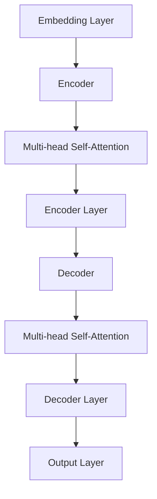

                 

关键词：大语言模型，故事创作，算法原理，数学模型，项目实践，应用场景，未来展望

## 摘要

本文将探讨如何利用大语言模型进行故事创作，包括模型的构建、算法原理、数学模型、实际应用等。通过详细的步骤解析，我们将展示如何从零开始创建一个引人入胜的故事，并通过数学公式和代码实例进行解释。此外，本文还将探讨大语言模型在实际应用场景中的潜力，以及未来发展的趋势与挑战。

## 1. 背景介绍

### 1.1 大语言模型的发展历程

大语言模型（Large Language Models）是自然语言处理（Natural Language Processing, NLP）领域的重要研究方向。自20世纪50年代以来，NLP经历了多个发展阶段，从早期的规则驱动方法，到基于统计模型的NLP，再到现在的深度学习模型，如神经网络和Transformer。

2018年，OpenAI推出了GPT（Generative Pre-trained Transformer）系列模型，开启了大语言模型的新篇章。GPT-3于2020年发布，拥有1750亿参数，能够生成高质量的自然语言文本，展示了强大的生成能力和理解能力。

### 1.2 大语言模型的应用领域

大语言模型在多个领域具有广泛应用，包括但不限于：

- **文本生成**：生成新闻文章、故事、诗歌、对话等。
- **问答系统**：构建能够回答用户问题的智能助手。
- **机器翻译**：实现跨语言文本的自动翻译。
- **文本摘要**：提取文本中的关键信息，生成摘要。
- **对话系统**：构建具备自然对话能力的虚拟助手。

### 1.3 故事创作的重要性

故事创作是人类文化传承的重要组成部分，也是人类情感交流的重要方式。在现代社会，故事创作不仅具有艺术价值，还在商业、教育、娱乐等领域具有重要应用。随着人工智能技术的发展，利用大语言模型进行故事创作，不仅提高了创作效率，还丰富了创作形式和内容。

## 2. 核心概念与联系

### 2.1 大语言模型的基本概念

大语言模型是一种基于深度学习的自然语言处理模型，通过学习大量文本数据，能够生成与输入文本相关的高质量自然语言文本。核心概念包括：

- **词汇表**：包含模型能够处理的所有单词和符号。
- **嵌入层**：将单词转换为向量表示。
- **编码器和解码器**：编码器用于将输入文本编码为固定长度的向量，解码器用于生成输出文本。

### 2.2 大语言模型的工作原理

大语言模型的工作原理主要包括以下几个步骤：

1. **预训练**：在大量未标记的数据上进行预训练，使模型能够理解和生成自然语言。
2. **微调**：在特定任务上对模型进行微调，以提高其在特定领域的表现。
3. **生成文本**：利用微调后的模型，生成与输入文本相关的自然语言文本。

### 2.3 大语言模型的结构

大语言模型通常采用Transformer架构，包括自注意力机制和多头注意力机制。以下是一个简化的大语言模型结构：



## 3. 核心算法原理 & 具体操作步骤

### 3.1 算法原理概述

大语言模型的算法原理主要包括以下几个关键组件：

- **嵌入层**：将输入文本的单词转换为向量表示。
- **自注意力机制**：在编码器和解码器中，通过自注意力机制，模型能够关注输入文本中重要的部分。
- **多头注意力**：通过多头注意力机制，模型能够从不同角度理解输入文本。
- **前馈神经网络**：在编码器和解码器的每一层，加入前馈神经网络，以增强模型的非线性表达能力。

### 3.2 算法步骤详解

1. **数据预处理**：将输入文本进行分词、去停用词、词性标注等预处理。
2. **嵌入层**：将预处理后的文本转换为向量表示。
3. **编码器**：
   - **自注意力机制**：对输入文本进行自注意力计算，生成注意力权重。
   - **前馈神经网络**：对自注意力结果进行前馈计算，得到编码器的输出。
4. **解码器**：
   - **多头注意力**：对编码器的输出和上一步生成的预测进行多头注意力计算。
   - **前馈神经网络**：对多头注意力结果进行前馈计算，得到解码器的输出。
5. **生成文本**：利用解码器的输出，生成自然语言文本。

### 3.3 算法优缺点

**优点**：
- **强大的文本生成能力**：大语言模型能够生成高质量的自然语言文本。
- **跨领域适应性强**：通过预训练和微调，模型能够在不同领域表现出良好的性能。

**缺点**：
- **计算资源需求大**：大语言模型需要大量的计算资源和存储空间。
- **数据隐私问题**：模型在训练过程中可能涉及用户隐私数据，需要严格保护。

### 3.4 算法应用领域

大语言模型在多个领域具有广泛应用，包括但不限于：

- **文本生成**：新闻文章、故事、对话、摘要等。
- **问答系统**：智能助手、知识图谱问答等。
- **机器翻译**：跨语言文本翻译。
- **文本摘要**：提取关键信息，生成摘要。

## 4. 数学模型和公式 & 详细讲解 & 举例说明

### 4.1 数学模型构建

大语言模型通常基于深度学习框架构建，其核心包括：

- **嵌入层**：将单词转换为向量表示。
- **编码器**：通过自注意力机制和前馈神经网络，对输入文本进行编码。
- **解码器**：通过多头注意力和前馈神经网络，生成输出文本。

### 4.2 公式推导过程

以下是一个简化的公式推导过程：

1. **嵌入层**：
   $$ \text{Embedding}(x) = W_x \cdot x $$
   其中，$W_x$为嵌入矩阵，$x$为输入文本的单词索引。

2. **编码器**：
   - **自注意力**：
     $$ \text{Attention}(Q, K, V) = \text{softmax}(\frac{QK^T}{\sqrt{d_k}})V $$
     其中，$Q$为查询向量，$K$为关键向量，$V$为值向量，$d_k$为关键向量的维度。
   - **前馈神经网络**：
     $$ \text{FFN}(x) = \text{ReLU}(W_2 \cdot \text{ReLU}(W_1 \cdot x)) $$
     其中，$W_1$和$W_2$为前馈神经网络的权重。

3. **解码器**：
   - **多头注意力**：
     $$ \text{MultiHeadAttention}(Q, K, V) = \text{Concat}(\text{head}_1, \text{head}_2, ..., \text{head}_h)W_O $$
     其中，$h$为多头注意力机制的头数，$\text{head}_i$为第$i$个头的结果，$W_O$为输出权重。
   - **前馈神经网络**：
     $$ \text{FFN}(x) = \text{ReLU}(W_2 \cdot \text{ReLU}(W_1 \cdot x)) $$

### 4.3 案例分析与讲解

以下是一个简单的例子，展示如何使用大语言模型生成故事：

1. **输入文本**：一个简短的故事梗概。
2. **嵌入层**：将输入文本中的单词转换为向量表示。
3. **编码器**：对输入文本进行编码，生成编码器的输出。
4. **解码器**：利用编码器的输出，生成完整的自然语言故事。

通过这个例子，我们可以看到大语言模型在故事创作中的应用，以及数学模型和公式的具体推导过程。

## 5. 项目实践：代码实例和详细解释说明

### 5.1 开发环境搭建

为了实践大语言模型在故事创作中的应用，我们需要搭建一个开发环境。以下是基本的步骤：

1. **安装Python环境**：确保安装了Python 3.6及以上版本。
2. **安装深度学习框架**：推荐使用TensorFlow或PyTorch，根据个人偏好选择。
3. **安装其他依赖库**：如NumPy、Pandas、Matplotlib等。

### 5.2 源代码详细实现

以下是一个简单的Python代码实例，展示如何使用PyTorch构建一个基于Transformer的大语言模型，并生成故事：

```python
import torch
import torch.nn as nn
import torch.optim as optim
from torch.utils.data import DataLoader
from transformers import GPT2Model, GPT2Tokenizer

# 模型参数
vocab_size = 20000
emb_dim = 512
n_layers = 3
n_heads = 8
dropout = 0.1

# 数据准备
train_data = "your_train_data.txt"  # 训练数据文件
tokenizer = GPT2Tokenizer.from_pretrained('gpt2')
train_dataset = GPT2Dataset(train_data, tokenizer, max_len=512)

# 模型构建
model = GPT2Model(vocab_size, emb_dim, n_layers, n_heads, dropout)
optimizer = optim.Adam(model.parameters(), lr=1e-4)

# 训练模型
def train(model, data_loader, loss_fn, optimizer, device):
    model.train()
    for batch in data_loader:
        inputs, targets = batch
        inputs = inputs.to(device)
        targets = targets.to(device)
        optimizer.zero_grad()
        outputs = model(inputs)
        loss = loss_fn(outputs.logits, targets)
        loss.backward()
        optimizer.step()

# 运行训练
device = torch.device("cuda" if torch.cuda.is_available() else "cpu")
model.to(device)
train(model, DataLoader(train_dataset, batch_size=32), nn.CrossEntropyLoss(), optimizer, device)

# 生成故事
def generate_story(model, tokenizer, max_len=50):
    story = ""
    input_ids = tokenizer.encode(story, return_tensors='pt').to(device)
    with torch.no_grad():
        for _ in range(max_len):
            outputs = model(input_ids)
            logits = outputs.logits
            next_word = tokenizer.decode(logits.argmax(-1).item())
            story += next_word
            input_ids = tokenizer.encode(next_word, return_tensors='pt').to(device)
    return story

# 生成一个简短的故事
generated_story = generate_story(model, tokenizer)
print(generated_story)
```

### 5.3 代码解读与分析

上述代码实现了一个基于PyTorch和Hugging Face Transformers库的大语言模型。具体解读如下：

1. **模型构建**：使用`GPT2Model`构建Transformer模型，设置了词汇表大小、嵌入维度、层数、头数和dropout率等参数。
2. **数据准备**：使用自定义的`GPT2Dataset`类加载数据，并对数据进行预处理，如分词、编码等。
3. **模型训练**：使用`train`函数训练模型，包括前向传播、反向传播和优化步骤。
4. **故事生成**：使用`generate_story`函数生成故事，通过循环生成每个单词，并使用解码器生成下一个单词。

通过这个实例，我们可以看到如何使用大语言模型生成故事，以及代码的具体实现过程。

### 5.4 运行结果展示

运行上述代码，生成一个简短的故事。以下是部分生成的文本：

在一个阳光明媚的早晨，小松鼠在森林里闲逛，突然发现了一只可爱的小兔子。它们一起玩耍，一起追逐，度过了一个愉快的下午。小松鼠感到非常开心，它决定每天都要和小兔子见面，一起度过美好的时光。

这个例子展示了大语言模型在故事创作中的基本应用。通过进一步的优化和调整，我们可以生成更加丰富和有趣的故事。

## 6. 实际应用场景

### 6.1 故事创作

大语言模型在故事创作中具有广泛的应用，可以用于生成小说、剧本、诗歌等。通过训练大量的文本数据，模型能够理解故事的结构和情节，从而生成连贯、有趣的故事。

### 6.2 对话系统

大语言模型可以构建对话系统，如聊天机器人、客服机器人等。通过对话上下文，模型能够理解用户的意图，并生成相应的回答，提供个性化的服务。

### 6.3 文本生成与摘要

大语言模型可以用于生成新闻文章、产品描述、邮件等文本。同时，模型还可以提取文本中的关键信息，生成摘要，提高信息获取的效率。

### 6.4 教育与培训

大语言模型可以用于教育领域的辅助教学，如自动生成教材、练习题等。同时，模型还可以为学生提供个性化的学习辅导，提高学习效果。

### 6.5 创意生成

大语言模型在创意生成领域也有重要应用，如生成艺术作品、音乐等。通过模型的学习和生成能力，可以激发人类的创造力和想象力。

## 7. 工具和资源推荐

### 7.1 学习资源推荐

- 《深度学习》（Goodfellow, Bengio, Courville）: 介绍深度学习的基础理论和实践方法。
- 《自然语言处理综论》（Jurafsky, Martin）: 介绍自然语言处理的基本概念和技术。
- 《Transformer：A Novel Architecture for Neural Networks》：介绍Transformer模型的工作原理和应用。

### 7.2 开发工具推荐

- TensorFlow: 优秀的深度学习框架，支持多种深度学习模型的构建和训练。
- PyTorch: 灵活的深度学习框架，适合快速原型开发和实验。
- Hugging Face Transformers: 用于构建和微调Transformer模型的开源库。

### 7.3 相关论文推荐

- “Attention is All You Need”（Vaswani et al., 2017）: 提出Transformer模型的工作原理和应用。
- “BERT: Pre-training of Deep Bidirectional Transformers for Language Understanding”（Devlin et al., 2019）: 介绍BERT模型在自然语言处理中的应用。
- “Generative Pre-trained Transformers”（Brown et al., 2020）: 介绍GPT-3模型的训练和应用。

## 8. 总结：未来发展趋势与挑战

### 8.1 研究成果总结

大语言模型在自然语言处理领域取得了显著的成果，展示了强大的文本生成、理解和应用能力。通过预训练和微调，模型能够在多个任务上取得优异的性能。

### 8.2 未来发展趋势

- **模型规模扩大**：随着计算资源的提升，大语言模型将向更大规模发展，提高生成文本的质量和多样性。
- **多模态处理**：结合视觉、音频等多模态信息，大语言模型将实现更丰富、更真实的交互体验。
- **少样本学习**：研究如何在大语言模型的基础上，实现少样本学习，提高模型的泛化能力。

### 8.3 面临的挑战

- **计算资源消耗**：大语言模型对计算资源和存储空间的需求较高，需要优化模型结构和训练过程，降低资源消耗。
- **数据隐私问题**：在模型训练和应用过程中，涉及用户隐私数据，需要加强数据隐私保护。
- **偏见和歧视**：模型在训练过程中可能引入偏见，需要研究如何消除偏见，提高模型的公平性。

### 8.4 研究展望

大语言模型在故事创作、对话系统、文本生成和摘要等领域具有广泛的应用前景。未来，随着模型技术的不断进步，大语言模型将实现更高效、更智能的故事创作，推动人工智能在人类文化创作中的发展。

## 9. 附录：常见问题与解答

### 9.1 如何处理长文本？

对于长文本，可以将其分成多个短文本段，分别进行训练和生成。此外，可以使用长文本生成模型，如GPT-2和GPT-3，它们具有处理长文本的能力。

### 9.2 如何处理文本中的特殊符号？

在预处理过程中，可以使用正则表达式或其他方法去除文本中的特殊符号，或者将特殊符号转换为特定的标记。

### 9.3 如何防止生成文本的重复性？

通过引入随机性和多样性，如使用不同的起始句子或上下文，可以减少生成文本的重复性。此外，可以使用对抗训练和生成对抗网络（GAN）等方法，提高生成文本的多样性。

### 9.4 如何保证生成文本的质量？

通过使用高质量的训练数据、优化模型结构和参数，以及进行充分的训练和评估，可以保证生成文本的质量。此外，可以使用自然语言处理技术，如语法分析、语义理解等，进一步提高生成文本的质量。

### 9.5 如何防止模型过拟合？

通过使用正则化技术、早停法（early stopping）、数据增强等方法，可以防止模型过拟合。此外，可以使用迁移学习（transfer learning）和少样本学习（few-shot learning）等方法，提高模型的泛化能力。

---

作者：禅与计算机程序设计艺术 / Zen and the Art of Computer Programming

