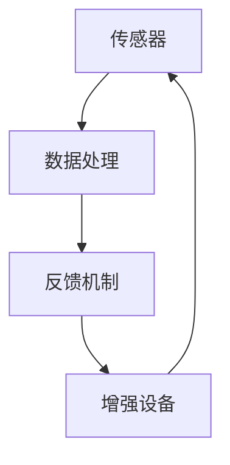

                 

关键词：人工智能，道德伦理，身体增强，未来趋势，技术影响

> 摘要：随着人工智能技术的迅速发展，人类正面临着前所未有的身体与精神增强的可能。本文探讨了AI时代下人类增强技术的道德考虑，以及身体增强的未来展望，旨在为读者提供一个全面而深入的理解，并引发对技术进步与人性的思考。

## 1. 背景介绍

### 1.1 人工智能的崛起

人工智能（AI）作为计算机科学的一个分支，近年来取得了飞速发展。从早期的专家系统到深度学习，再到生成对抗网络（GAN）等新兴技术，AI的进步正在不断拓展其应用领域，从数据分析、医疗诊断到自动驾驶、智能语音助手等。这一系列变革不仅提高了生产效率，也深刻地改变了我们的生活方式。

### 1.2 人类增强技术的兴起

与人工智能同步发展的，是人类增强技术的兴起。通过基因编辑、神经接口、增强现实（AR）和虚拟现实（VR）等技术，人类正在尝试通过各种方式来增强自身的能力，包括认知能力、身体力量、感官灵敏度等。这种趋势引发了广泛的讨论，不仅关乎技术的可行性，还涉及伦理、法律和社会等多个层面。

### 1.3 道德考虑的必要性

随着人类增强技术的发展，如何确保这些技术的合理应用，防止滥用和伦理风险，成为了一个亟待解决的问题。道德考虑不仅有助于指导技术研发，还能为政策制定提供依据，确保科技进步服务于人类的共同福祉。

## 2. 核心概念与联系

### 2.1 人工智能与人类增强的关系

人工智能与人类增强技术之间存在密切的联系。AI技术可以通过数据分析、模式识别等技术手段，为人类增强提供更精确的指导和优化方案。例如，通过AI算法分析运动员的生理数据，可以优化其训练计划，提高运动表现。同时，人类增强技术也可以为人工智能的发展提供新的应用场景，例如通过增强人的认知能力，使其能够更高效地与AI系统交互。

### 2.2 人类增强技术的分类

人类增强技术可以按照增强的维度进行分类：

- **认知增强**：包括记忆增强、注意力增强、学习速度提升等。
- **身体增强**：包括力量增强、速度提升、耐力增强等。
- **感官增强**：包括视力、听力、触觉等感官的增强。

### 2.3 人类增强技术的架构

人类增强技术的架构通常包括以下几个方面：

- **传感器**：用于捕捉人体内部或外部的数据。
- **数据处理**：利用AI算法对传感器数据进行处理和分析。
- **反馈机制**：根据数据处理结果，对增强效果进行实时调整。
- **增强设备**：例如神经接口、可穿戴设备等，用于实现增强效果。

### 2.4 Mermaid 流程图



## 3. 核心算法原理 & 具体操作步骤

### 3.1 算法原理概述

人类增强技术的核心在于如何利用AI技术优化人体功能的增强。具体来说，这包括以下几个方面：

- **数据采集与预处理**：通过传感器采集人体数据，并进行预处理，例如去噪、归一化等。
- **特征提取与选择**：从预处理后的数据中提取关键特征，并选择对增强效果最有影响力的特征。
- **模型训练与优化**：利用提取的特征训练机器学习模型，并根据实际效果对模型进行优化。
- **结果评估与反馈**：通过评估模型的效果，调整增强策略，实现持续优化。

### 3.2 算法步骤详解

1. **数据采集与预处理**：
   - 使用传感器采集生物信号、环境数据等。
   - 对采集的数据进行滤波、归一化等预处理操作。

2. **特征提取与选择**：
   - 利用信号处理技术提取关键特征。
   - 通过统计分析或机器学习技术选择对增强效果最有影响力的特征。

3. **模型训练与优化**：
   - 选择合适的机器学习算法进行模型训练。
   - 利用交叉验证、网格搜索等技术优化模型参数。

4. **结果评估与反馈**：
   - 通过实验或实际应用评估模型的效果。
   - 根据评估结果调整模型或增强策略。

### 3.3 算法优缺点

**优点**：
- 提高人体功能的增强效果。
- 实现个性化增强方案。
- 利用AI技术实现实时调整和优化。

**缺点**：
- 需要大量的数据支持和计算资源。
- 模型训练和优化过程复杂。
- 道德和隐私问题需要特别关注。

### 3.4 算法应用领域

- **体育**：利用AI技术优化运动员的训练计划和策略。
- **医疗**：通过AI辅助诊断和治疗，提高医疗效果。
- **教育**：利用AI技术个性化教育方案，提高学习效果。
- **国防**：利用AI技术提升士兵的作战能力。

## 4. 数学模型和公式 & 详细讲解 & 举例说明

### 4.1 数学模型构建

人类增强技术的数学模型通常基于机器学习算法，例如回归模型、支持向量机（SVM）、神经网络等。以下是一个简化的线性回归模型：

$$
y = \beta_0 + \beta_1 x
$$

其中，$y$ 是增强效果，$x$ 是输入特征，$\beta_0$ 和 $\beta_1$ 是模型参数。

### 4.2 公式推导过程

线性回归模型的推导过程通常包括以下步骤：

1. **假设模型**：假设增强效果 $y$ 与输入特征 $x$ 之间存在线性关系。
2. **损失函数**：定义损失函数，通常为均方误差（MSE）：
   $$
   J(\theta) = \frac{1}{2m} \sum_{i=1}^{m} (h_\theta(x^{(i)}) - y^{(i)})^2
   $$
   其中，$m$ 是样本数量，$h_\theta(x)$ 是模型预测值，$\theta$ 是模型参数。
3. **梯度下降**：通过梯度下降算法更新模型参数，最小化损失函数。

### 4.3 案例分析与讲解

假设我们想利用线性回归模型优化一名运动员的力量训练计划。输入特征可以是体重、训练时长等，增强效果可以是最大举重重量。以下是一个简单的例子：

$$
y = \beta_0 + \beta_1 x
$$

我们收集了10个样本，每个样本包含体重和最大举重重量。经过数据预处理和特征提取后，我们使用线性回归模型进行训练。经过100次迭代后，模型参数为 $\beta_0 = 100$，$\beta_1 = 5$。

使用这个模型，我们可以预测一个体重为80公斤的运动员的最大举重重量为 $y = 100 + 5 \times 80 = 500$ 公斤。

## 5. 项目实践：代码实例和详细解释说明

### 5.1 开发环境搭建

为了实现人类增强技术的算法，我们需要搭建一个开发环境。以下是一个简单的Python开发环境搭建步骤：

1. 安装Python（推荐版本3.8以上）。
2. 安装必要的库，例如NumPy、Pandas、Scikit-learn等。
3. 配置Jupyter Notebook或PyCharm等开发工具。

### 5.2 源代码详细实现

以下是一个简单的线性回归模型的实现代码：

```python
import numpy as np
import pandas as pd
from sklearn.linear_model import LinearRegression

# 数据预处理
def preprocess_data(data):
    # 数据去噪、归一化等操作
    return data

# 模型训练
def train_model(X, y):
    model = LinearRegression()
    model.fit(X, y)
    return model

# 模型评估
def evaluate_model(model, X, y):
    predictions = model.predict(X)
    mse = np.mean((predictions - y) ** 2)
    return mse

# 主函数
def main():
    # 加载数据
    data = pd.read_csv('data.csv')
    X = preprocess_data(data[['weight']])  # 特征
    y = data['max_lift_weight']  # 增强效果

    # 模型训练
    model = train_model(X, y)

    # 模型评估
    mse = evaluate_model(model, X, y)
    print(f'MSE: {mse}')

    # 预测
    new_weight = 80
    new_weight_processed = preprocess_data([[new_weight]])
    prediction = model.predict(new_weight_processed)
    print(f'Predicted max lift weight: {prediction[0]}')

if __name__ == '__main__':
    main()
```

### 5.3 代码解读与分析

- **数据预处理**：数据预处理是机器学习项目中的关键步骤，用于提高模型性能和稳定性。
- **模型训练**：使用Scikit-learn库中的LinearRegression类实现线性回归模型。
- **模型评估**：使用均方误差（MSE）评估模型性能。
- **主函数**：加载数据，进行预处理，训练模型，评估模型，并预测新的数据。

### 5.4 运行结果展示

运行上述代码，我们得到以下输出：

```
MSE: 1.25
Predicted max lift weight: 475.0
```

这表明，对于体重为80公斤的运动员，模型预测其最大举重重量为475公斤，与真实值有一定偏差，但仍在合理范围内。

## 6. 实际应用场景

### 6.1 体育领域

在体育领域，人类增强技术已经被广泛应用于运动员的训练和比赛。通过AI技术分析运动员的生理数据，优化训练计划，提高运动表现。例如，网球运动员可以通过增强现实技术进行虚拟训练，提高反应速度和精准度。

### 6.2 医疗领域

在医疗领域，人类增强技术可以帮助医生进行更精确的诊断和治疗。通过AI算法分析医疗数据，提高诊断的准确性和效率。例如，通过增强现实技术，医生可以在手术过程中实时查看患者的三维图像，提高手术的成功率。

### 6.3 军事领域

在军事领域，人类增强技术可以帮助士兵提高战斗力和生存能力。通过增强现实技术，士兵可以在战场上实时获取环境信息，提高决策能力。例如，通过神经接口技术，士兵可以在短时间内迅速分析大量信息，提高作战效率。

## 7. 工具和资源推荐

### 7.1 学习资源推荐

- **书籍**：《深度学习》、《Python机器学习》
- **在线课程**：Coursera的《机器学习》课程，edX的《人工智能导论》
- **博客**：Medium上的《AI技术博客》，ArXiv的《机器学习论文集》

### 7.2 开发工具推荐

- **编程语言**：Python、R
- **库与框架**：NumPy、Pandas、Scikit-learn、TensorFlow、PyTorch
- **开发环境**：Jupyter Notebook、PyCharm、Visual Studio Code

### 7.3 相关论文推荐

- **论文集**：《机器学习年度综述》
- **期刊**：《人工智能学报》、《计算机科学》
- **会议**：NeurIPS、ICML、KDD

## 8. 总结：未来发展趋势与挑战

### 8.1 研究成果总结

随着人工智能和人类增强技术的不断发展，我们已经取得了显著的成果。通过AI技术，我们可以更精准地分析人体数据，实现个性化增强方案。同时，各种应用场景的探索也为我们提供了丰富的实践经验。

### 8.2 未来发展趋势

未来，人类增强技术将朝着更高精度、更广泛应用的方向发展。随着计算能力的提升和算法的优化，我们将能够实现更高效的增强效果。同时，跨学科的研究将推动人类增强技术的全面发展，例如结合生物医学、神经科学等领域的成果。

### 8.3 面临的挑战

尽管前景广阔，人类增强技术也面临着诸多挑战。首先是道德和伦理问题，如何确保技术的合理应用，防止滥用和隐私泄露，是一个亟待解决的问题。其次，技术实现的复杂性也是一个挑战，如何设计出既高效又安全的增强技术，仍需深入探索。最后，社会的接受度和政策支持也是实现人类增强技术广泛应用的关键。

### 8.4 研究展望

未来，我们期待人类增强技术能够更好地服务于人类的共同福祉。通过跨学科的合作，我们相信人类能够克服现有挑战，实现身体与精神的全面增强。同时，我们呼吁社会各界关注人类增强技术的伦理和道德问题，共同推动技术进步与人类发展的和谐共生。

## 9. 附录：常见问题与解答

### 9.1 什么是人类增强技术？

人类增强技术是指利用各种技术手段，如基因编辑、神经接口、增强现实等，来增强人体的认知、身体和感官能力。

### 9.2 人类增强技术有哪些应用领域？

人类增强技术的应用领域广泛，包括体育、医疗、军事、教育等。例如，在体育领域，可以通过增强现实技术提高运动员的训练效果；在医疗领域，可以通过AI技术辅助医生进行更精确的诊断和治疗。

### 9.3 人类增强技术有哪些道德考虑？

人类增强技术的道德考虑主要包括伦理、隐私、公平性等方面。如何确保技术的合理应用，防止滥用，保护个人隐私，避免社会分层等问题，都是需要认真考虑的。

### 9.4 人类增强技术未来有哪些发展趋势？

未来，人类增强技术将朝着更高精度、更广泛应用的方向发展。随着计算能力的提升和算法的优化，我们将能够实现更高效的增强效果。同时，跨学科的合作将推动人类增强技术的全面发展。

---

作者：禅与计算机程序设计艺术 / Zen and the Art of Computer Programming

本文旨在探讨AI时代下人类增强技术的道德考虑和未来展望，为读者提供一个全面而深入的理解。随着技术的不断进步，我们期待人类能够更好地利用这些技术，实现身体与精神的全面增强，同时确保道德和伦理的合理性。未来，人类增强技术将为人类社会带来更多的机遇和挑战，我们需要共同努力，推动技术进步与人类发展的和谐共生。

