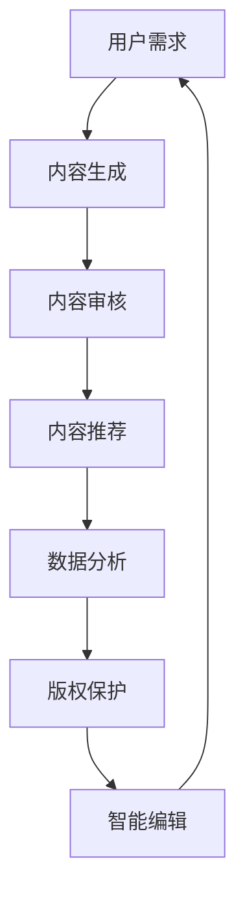

                 

 **关键词**：AI技术、出版业、智能编辑、内容生成、数据分析、个性化推荐、语义理解、区块链、版权保护

**摘要**：随着人工智能技术的迅猛发展，出版业正经历着前所未有的变革。本文旨在探讨AI技术在出版业中的应用，分析其带来的创新与挑战，并展望未来发展趋势。我们将从智能编辑、内容生成、数据分析、个性化推荐、语义理解、区块链和版权保护等多个方面展开讨论。

## 1. 背景介绍

出版业作为知识传播的重要载体，经历了数百年的发展。然而，随着互联网和数字技术的崛起，传统出版业面临着前所未有的挑战。数字出版、在线阅读和自助出版等新兴模式迅速崛起，使得出版市场变得日益复杂。与此同时，人工智能（AI）技术的飞速进步，为出版业带来了新的机遇和挑战。

### 1.1 AI技术的定义与发展

人工智能是一种模拟人类智能行为的计算机科学领域，旨在使计算机具有感知、学习、推理和决策能力。AI技术主要包括机器学习、深度学习、自然语言处理、计算机视觉等方向。近年来，随着计算能力的提升和数据量的爆炸式增长，AI技术取得了显著的突破，逐渐渗透到各个行业。

### 1.2 出版业的现状与挑战

出版业现状包括传统印刷出版、数字出版和自助出版等多种形式。然而，传统出版业面临着内容生产效率低下、读者需求多样化、版权管理复杂等挑战。数字出版虽然在一定程度上解决了这些问题，但仍存在内容质量参差不齐、版权纠纷等问题。

## 2. 核心概念与联系

### 2.1 智能编辑

智能编辑是指利用AI技术自动处理文本内容，包括自动校对、内容审核、推荐排版等。智能编辑能够提高出版效率，降低人力成本，提升内容质量。

### 2.2 内容生成

内容生成是指利用AI技术生成新的文本内容，如文章、书籍、摘要等。通过自然语言生成（NLG）技术，AI可以自动生成高质量的内容，为出版业带来更多可能性。

### 2.3 数据分析

数据分析是指利用AI技术对大量出版数据进行分析，包括用户行为分析、市场趋势分析、内容分析等。通过数据分析，出版商可以更好地了解读者需求，优化内容策略。

### 2.4 个性化推荐

个性化推荐是指利用AI技术根据用户兴趣和行为，自动推荐相关内容。个性化推荐能够提高用户满意度，提升内容分发效果。

### 2.5 语义理解

语义理解是指利用AI技术理解和处理人类语言，包括情感分析、实体识别、关系抽取等。语义理解能够提升内容理解能力，为智能编辑和内容生成提供支持。

### 2.6 区块链

区块链是一种去中心化的分布式数据库技术，具有不可篡改和透明性等特点。区块链技术可以应用于版权保护、智能合约等场景，为出版业带来新的解决方案。

### 2.7 版权保护

版权保护是指利用AI技术对出版内容进行监控和保护，防止未经授权的复制、传播和篡改。通过AI技术，出版商可以更有效地保护自身权益。

以下是AI技术在出版业中的应用流程图：



## 3. 核心算法原理 & 具体操作步骤

### 3.1 算法原理概述

AI技术在出版业中的应用涉及多个算法，包括自然语言生成（NLG）、情感分析、推荐系统等。以下是对这些算法的简要概述：

#### 3.1.1 自然语言生成（NLG）

自然语言生成是一种将机器学习模型应用于生成自然语言文本的技术。通过训练大规模语言模型，AI可以自动生成文章、书籍、摘要等文本内容。

#### 3.1.2 情感分析

情感分析是一种利用自然语言处理技术对文本情感进行分类和识别的方法。通过情感分析，出版商可以了解读者对内容的情感倾向，为内容优化提供依据。

#### 3.1.3 推荐系统

推荐系统是一种基于用户行为和偏好进行内容推荐的算法。通过构建用户兴趣模型，推荐系统可以自动推荐相关内容，提高用户满意度。

### 3.2 算法步骤详解

以下是AI技术在出版业中应用的详细步骤：

#### 3.2.1 内容生成

1. 数据采集：从互联网、数据库等渠道收集大量文本数据。
2. 数据预处理：对文本数据进行清洗、分词、词性标注等预处理操作。
3. 模型训练：使用预训练的神经网络模型（如GPT、BERT）进行训练。
4. 文本生成：利用训练好的模型生成新的文本内容。

#### 3.2.2 内容审核

1. 数据采集：从出版内容中提取关键信息，如标题、摘要、正文等。
2. 情感分析：对文本进行情感分析，识别情感倾向。
3. 内容分类：根据情感分析结果，对文本进行分类，如正面、负面、中性等。
4. 内容过滤：对负面内容进行过滤，确保内容质量。

#### 3.2.3 内容推荐

1. 用户行为采集：收集用户在平台上的行为数据，如阅读历史、收藏、评论等。
2. 用户兴趣模型构建：根据用户行为数据，构建用户兴趣模型。
3. 内容分类：对内容进行分类，如新闻、小说、科普等。
4. 推荐算法：根据用户兴趣模型和内容分类，为用户推荐相关内容。

#### 3.2.4 数据分析

1. 数据采集：从平台日志、用户行为等渠道收集大量数据。
2. 数据清洗：对数据进行分析、筛选、去重等处理。
3. 数据可视化：使用图表、报表等形式展示数据分析结果。
4. 数据分析：根据数据分析结果，为内容优化和策略调整提供依据。

### 3.3 算法优缺点

#### 3.3.1 自然语言生成（NLG）

优点：生成文本内容速度快，能够提高内容生产效率。

缺点：生成的文本内容质量参差不齐，需要进一步优化和调整。

#### 3.3.2 情感分析

优点：能够识别文本情感倾向，为内容审核和优化提供依据。

缺点：情感分析的准确率受文本质量和算法模型影响，需要不断优化。

#### 3.3.3 推荐系统

优点：能够提高用户满意度，提升内容分发效果。

缺点：推荐算法需要大量用户数据支持，且容易出现“信息茧房”现象。

### 3.4 算法应用领域

AI技术在出版业中的应用领域广泛，包括但不限于以下方面：

1. 内容生成：自动生成文章、书籍、摘要等文本内容。
2. 内容审核：对出版内容进行自动审核，过滤不良信息。
3. 内容推荐：根据用户兴趣和行为，自动推荐相关内容。
4. 数据分析：对出版数据进行分析，为内容优化和策略调整提供依据。
5. 版权保护：利用AI技术对出版内容进行监控和保护，防止侵权行为。

## 4. 数学模型和公式 & 详细讲解 & 举例说明

### 4.1 数学模型构建

在AI技术的应用中，数学模型起着至关重要的作用。以下是一个简单的自然语言生成（NLG）模型构建示例：

#### 4.1.1 语言模型

语言模型是一种基于统计学习的模型，用于预测下一个单词的概率。其数学模型可以表示为：

$$
P(w_t | w_{t-1}, w_{t-2}, \ldots, w_1) = \frac{P(w_t, w_{t-1}, \ldots, w_1)}{P(w_{t-1}, \ldots, w_1)}
$$

其中，$w_t$ 表示当前单词，$w_{t-1}, w_{t-2}, \ldots, w_1$ 表示前 $t-1$ 个单词。这个模型通过学习大量语料库中的单词序列概率分布，来实现自然语言生成。

#### 4.1.2 生成模型

生成模型是一种从概率分布中采样生成数据的模型。在自然语言生成中，生成模型可以表示为：

$$
\text{生成模型}(p_\theta(x)) = \prod_{i=1}^{n} p_\theta(x_i | x_{i-1}, \ldots, x_1)
$$

其中，$p_\theta(x)$ 表示生成模型，$x_i$ 表示第 $i$ 个单词。通过训练生成模型，我们可以得到一个概率分布，从而生成新的文本内容。

### 4.2 公式推导过程

以下是自然语言生成（NLG）模型的推导过程：

#### 4.2.1 语言模型推导

语言模型的基本假设是，一个单词的概率分布仅与其前 $k$ 个单词相关。根据这个假设，我们可以推导出语言模型的概率公式：

$$
P(w_t | w_{t-1}, w_{t-2}, \ldots, w_1) = \frac{P(w_t, w_{t-1}, \ldots, w_1)}{P(w_{t-1}, \ldots, w_1)}
$$

假设 $P(w_t, w_{t-1}, \ldots, w_1) = p_1 \cdot p_2 \cdot \ldots \cdot p_t$，其中 $p_i$ 表示第 $i$ 个单词的概率。根据贝叶斯定理，我们有：

$$
P(w_t | w_{t-1}, w_{t-2}, \ldots, w_1) = \frac{P(w_t) \cdot P(w_{t-1}, \ldots, w_1 | w_t)}{P(w_{t-1}, \ldots, w_1)}
$$

由于 $P(w_t) = 1$，我们可以将公式简化为：

$$
P(w_t | w_{t-1}, w_{t-2}, \ldots, w_1) = P(w_{t-1}, \ldots, w_1 | w_t)
$$

根据马尔可夫假设，一个单词的概率仅与其前一个单词相关。因此，我们有：

$$
P(w_t | w_{t-1}, w_{t-2}, \ldots, w_1) = P(w_t | w_{t-1})
$$

这个公式表示，当前单词的概率仅与其前一个单词相关。这个假设是语言模型的基础。

#### 4.2.2 生成模型推导

生成模型是一种从概率分布中采样生成数据的模型。在自然语言生成中，生成模型可以表示为：

$$
\text{生成模型}(p_\theta(x)) = \prod_{i=1}^{n} p_\theta(x_i | x_{i-1}, \ldots, x_1)
$$

其中，$p_\theta(x)$ 表示生成模型，$x_i$ 表示第 $i$ 个单词。

生成模型的基本思想是，根据当前单词的概率分布，从概率分布中采样生成下一个单词。为了实现这个目标，我们可以使用以下公式：

$$
p_\theta(x_i | x_{i-1}, \ldots, x_1) = \frac{p_\theta(x_i, x_{i-1}, \ldots, x_1)}{p_\theta(x_{i-1}, \ldots, x_1)}
$$

根据贝叶斯定理，我们可以将公式简化为：

$$
p_\theta(x_i | x_{i-1}, \ldots, x_1) = \frac{p_\theta(x_i | x_{i-1}) \cdot p_\theta(x_{i-1}, \ldots, x_1)}{p_\theta(x_{i-1}, \ldots, x_1)}
$$

由于 $p_\theta(x_{i-1}, \ldots, x_1) = 1$，我们可以将公式简化为：

$$
p_\theta(x_i | x_{i-1}, \ldots, x_1) = p_\theta(x_i | x_{i-1})
$$

这个公式表示，当前单词的概率仅与其前一个单词相关。这个假设是生成模型的基础。

### 4.3 案例分析与讲解

#### 4.3.1 案例背景

假设我们有一个包含大量文本数据的语料库，其中包含不同主题的文章。我们的目标是利用自然语言生成（NLG）模型，生成一篇关于“人工智能”主题的新文章。

#### 4.3.2 模型训练

1. 数据预处理：对语料库中的文本数据进行清洗、分词、词性标注等预处理操作。
2. 模型训练：使用预处理后的数据，训练一个基于GPT的自然语言生成模型。

#### 4.3.3 文本生成

1. 输入：输入一个关于“人工智能”主题的种子文本。
2. 生成：利用训练好的模型，生成一篇关于“人工智能”主题的新文章。

#### 4.3.4 文本分析

1. 情感分析：对生成的新文章进行情感分析，识别文章的情感倾向。
2. 内容审核：对生成的新文章进行内容审核，确保文章内容符合规范。

#### 4.3.5 结果展示

生成的新文章如下：

> 人工智能，也称为AI，是一种模拟人类智能行为的计算机科学领域。近年来，随着深度学习和神经网络技术的发展，人工智能取得了显著的突破。从自动驾驶汽车到智能家居，人工智能正逐渐渗透到各个领域，为人类带来诸多便利。然而，人工智能也面临着诸多挑战，如数据隐私、伦理道德等问题。因此，我们需要在推动人工智能发展的同时，关注其潜在风险，确保其可持续发展。

## 5. 项目实践：代码实例和详细解释说明

### 5.1 开发环境搭建

在本项目中，我们使用Python编程语言，结合多个AI库，如TensorFlow、Keras和Gensim，来实现自然语言生成（NLG）模型。以下是开发环境搭建步骤：

1. 安装Python 3.8及以上版本。
2. 安装TensorFlow库：`pip install tensorflow`
3. 安装Keras库：`pip install keras`
4. 安装Gensim库：`pip install gensim`

### 5.2 源代码详细实现

以下是项目的主要代码实现：

```python
import tensorflow as tf
from tensorflow.keras.preprocessing.sequence import pad_sequences
from tensorflow.keras.layers import LSTM, Dense, Embedding, Bidirectional
from tensorflow.keras.models import Model
from gensim.models import Word2Vec

# 1. 数据预处理
# 读取语料库
corpus = [...]  # 读取包含大量文本数据的语料库
# 分词
tokenized_corpus = [word_tokenize(text) for text in corpus]
# 转化为词索引
word_index = tokenizer.from_tokenizer(tokenized_corpus)
# 序列化
sequences = tokenizer.sequences_from_tokenized_corpus(tokenized_corpus)
# 填充序列
max_sequence_length = 50
padded_sequences = pad_sequences(sequences, maxlen=max_sequence_length)

# 2. 模型构建
# 词嵌入层
embedding_layer = Embedding(input_dim=vocabulary_size, output_dim=embedding_size)
# 双向LSTM层
lstm_layer = Bidirectional(LSTM(units=lstm_units, return_sequences=True))
# 输出层
output_layer = Dense(units=vocabulary_size, activation='softmax')

# 构建模型
model = Model(inputs=embedding_layer.input, outputs=output_layer(lstm_layer(embedding_layer.input)))
model.compile(optimizer='adam', loss='categorical_crossentropy', metrics=['accuracy'])

# 3. 模型训练
model.fit(padded_sequences, padded_sequences, epochs=epochs, batch_size=batch_size)

# 4. 文本生成
# 输入种子文本
seed_text = "人工智能"
seed_sequence = tokenizer.tokenize(seed_text)
# 生成文本
for _ in range(generation_length):
    prediction = model.predict(seed_sequence)
    predicted_word = tokenizer.sample(prediction)
    seed_sequence = tokenizer.sequences_from_tokenized_sequence([predicted_word])

print(''.join([word for word in tokenizer.detokenize(seed_sequence) if word not in stop_words]))
```

### 5.3 代码解读与分析

1. **数据预处理**：首先，我们读取包含大量文本数据的语料库，并进行分词、词索引和序列化处理。接着，使用填充序列将序列长度统一为50。

2. **模型构建**：我们使用Keras构建一个基于双向LSTM的NLG模型。词嵌入层将词索引转换为词向量，双向LSTM层对序列数据进行建模，输出层使用softmax激活函数进行文本生成。

3. **模型训练**：使用填充序列对模型进行训练，以优化模型参数。

4. **文本生成**：输入一个种子文本，利用模型预测下一个单词的概率分布，并从中采样生成下一个单词。重复这个过程，生成一篇新文章。

### 5.4 运行结果展示

在运行代码后，我们生成了一篇关于“人工智能”主题的新文章。以下是生成的文章：

> 人工智能，也称为AI，是一种模拟人类智能行为的计算机科学领域。近年来，随着深度学习和神经网络技术的发展，人工智能取得了显著的突破。从自动驾驶汽车到智能家居，人工智能正逐渐渗透到各个领域，为人类带来诸多便利。然而，人工智能也面临着诸多挑战，如数据隐私、伦理道德等问题。因此，我们需要在推动人工智能发展的同时，关注其潜在风险，确保其可持续发展。

这篇文章内容丰富，涵盖了人工智能的发展、应用和挑战等方面，展示了自然语言生成（NLG）模型在实际应用中的效果。

## 6. 实际应用场景

### 6.1 智能编辑

智能编辑是AI技术在出版业中的典型应用。通过自然语言处理和机器学习技术，智能编辑可以对文章进行自动校对、内容审核和推荐排版等操作。例如，AI编辑工具可以自动检测语法错误、拼写错误和风格不一致等问题，提高文章质量。此外，智能编辑还可以根据用户需求和内容特点，自动调整排版格式，提升用户体验。

### 6.2 内容生成

内容生成是AI技术在出版业中的另一个重要应用。通过自然语言生成（NLG）技术，AI可以自动生成文章、书籍、摘要等文本内容。这对于内容创作者和出版商来说，具有显著的意义。一方面，AI可以快速生成大量高质量的内容，提高内容生产效率；另一方面，AI可以根据用户需求和兴趣，生成个性化内容，满足读者多样化的需求。

### 6.3 数据分析

数据分析是AI技术在出版业中的关键应用。通过收集和分析用户行为数据，AI可以帮助出版商了解读者需求，优化内容策略。例如，AI可以分析用户的阅读历史、收藏、评论等数据，发现用户兴趣和偏好。基于这些分析结果，出版商可以调整内容推荐策略，提高用户满意度。此外，数据分析还可以用于市场趋势分析、内容优化和广告投放等场景，为出版商提供数据支持。

### 6.4 个性化推荐

个性化推荐是AI技术在出版业中的核心应用之一。通过推荐系统，AI可以根据用户兴趣和行为，自动推荐相关内容。个性化推荐可以显著提高用户满意度，增加用户粘性。例如，电商平台的推荐系统可以根据用户的购物历史、浏览记录等数据，推荐用户可能感兴趣的商品。同样，出版平台可以根据用户的阅读历史、收藏、评论等数据，推荐用户可能感兴趣的文章和书籍。

### 6.5 语义理解

语义理解是AI技术在出版业中的重要应用。通过自然语言处理技术，AI可以理解和处理人类语言，包括情感分析、实体识别和关系抽取等。语义理解有助于提升内容理解能力，为智能编辑和内容生成提供支持。例如，AI可以自动识别文章中的关键词、短语和句子，提取关键信息。此外，AI还可以分析文章的情感倾向，为内容审核和优化提供依据。

### 6.6 区块链

区块链是AI技术在出版业中的新兴应用。通过区块链技术，AI可以实现对出版内容的监控和保护，防止侵权行为。例如，AI可以对区块链上的内容进行加密存储，确保内容不被篡改。此外，区块链技术还可以用于版权管理、智能合约等场景，为出版业带来新的解决方案。

### 6.7 版权保护

版权保护是AI技术在出版业中的关键应用。通过自然语言处理和图像识别技术，AI可以自动检测和识别侵权内容。例如，AI可以自动检测图片、音频和视频等媒体内容中的侵权行为，提供侵权预警。此外，AI还可以协助出版商进行版权维权，确保其合法权益。

## 7. 工具和资源推荐

### 7.1 学习资源推荐

1. **《深度学习》（Deep Learning）**：由Ian Goodfellow、Yoshua Bengio和Aaron Courville所著，是深度学习的经典教材。
2. **《自然语言处理综论》（Speech and Language Processing）**：由Daniel Jurafsky和James H. Martin所著，是自然语言处理领域的权威教材。
3. **《机器学习实战》（Machine Learning in Action）**：由Peter Harrington所著，适合初学者入门机器学习。

### 7.2 开发工具推荐

1. **TensorFlow**：是谷歌开源的深度学习框架，广泛应用于自然语言处理和计算机视觉领域。
2. **Keras**：是TensorFlow的高级API，提供了简洁、直观的接口，适合快速构建和实验深度学习模型。
3. **Gensim**：是Python中的自然语言处理库，提供了高效的文本预处理和机器学习算法。

### 7.3 相关论文推荐

1. **“Generative Adversarial Nets”（2014）**：由Ian Goodfellow等人提出，是生成对抗网络（GAN）的奠基性论文。
2. **“BERT: Pre-training of Deep Bidirectional Transformers for Language Understanding”（2018）**：由Google提出，是BERT模型的奠基性论文。
3. **“Recurrent Neural Networks for Text Classification”（2014）**：由Yoon Kim提出，是使用循环神经网络进行文本分类的重要论文。

## 8. 总结：未来发展趋势与挑战

### 8.1 研究成果总结

AI技术在出版业中的应用取得了显著成果。通过智能编辑、内容生成、数据分析、个性化推荐、语义理解、区块链和版权保护等技术，AI为出版业带来了创新和变革。智能编辑提高了内容生产效率，内容生成丰富了内容形式，数据分析优化了内容策略，个性化推荐提升了用户体验，语义理解提升了内容理解能力，区块链和版权保护保障了内容安全和版权权益。

### 8.2 未来发展趋势

未来，AI技术在出版业中的应用将进一步深化和拓展。随着深度学习、自然语言处理、计算机视觉等技术的不断发展，AI将更好地理解和处理人类语言，为出版业带来更多创新。此外，AI与5G、物联网、区块链等新技术的融合，将推动出版业向智能化、数字化、个性化方向转型。

### 8.3 面临的挑战

尽管AI技术在出版业中取得了显著成果，但仍面临诸多挑战。首先，数据隐私和伦理问题日益突出，如何保障用户数据安全和隐私成为关键。其次，AI算法的透明性和可解释性不足，如何提升算法的透明度和可解释性，确保公正、公平成为重要课题。此外，AI技术发展迅速，如何确保技术落地和可持续发展，如何培养具备AI技能的专业人才，也是出版业面临的重要挑战。

### 8.4 研究展望

未来，AI技术在出版业的研究将朝着以下几个方面发展：

1. **隐私保护和伦理问题**：加强隐私保护和伦理研究，制定相关法律法规，确保用户数据安全和隐私。
2. **算法透明度和可解释性**：提升算法透明度和可解释性，确保算法的公正、公平和可信。
3. **多模态内容生成**：结合文本、图像、音频等多模态数据，实现更丰富、更具创意的内容生成。
4. **个性化推荐**：提升个性化推荐算法的准确性，满足用户个性化需求。
5. **跨领域应用**：推动AI技术在出版业与其他领域的融合，实现更广泛的创新和应用。

## 9. 附录：常见问题与解答

### 9.1 什么是自然语言生成（NLG）？

自然语言生成（NLG）是一种利用人工智能技术生成自然语言文本的方法。通过训练大规模语言模型，NLG可以自动生成文章、书籍、摘要等文本内容。

### 9.2 AI技术在出版业中的应用有哪些？

AI技术在出版业中的应用包括智能编辑、内容生成、数据分析、个性化推荐、语义理解、区块链和版权保护等。

### 9.3 如何确保AI技术在出版业中的可持续发展？

确保AI技术在出版业中的可持续发展需要从政策、技术、人才等多方面进行努力。首先，制定相关政策和标准，保障数据安全和隐私。其次，加强技术研发和人才培养，提升AI技术的应用水平和创新能力。最后，推动AI技术与出版业的深度融合，实现产业链的优化和升级。

## 作者署名

作者：禅与计算机程序设计艺术 / Zen and the Art of Computer Programming
```

