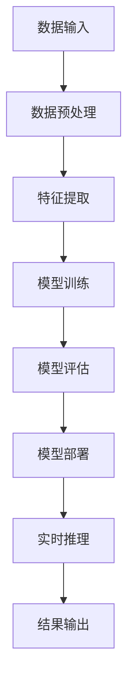

                 

关键词：AI时代、基础设施革命、Lepton AI、技术架构、创新应用

> 摘要：本文将深入探讨AI时代下基础设施的变革，特别是Lepton AI在这一变革中的关键角色。通过分析其技术原理、应用领域和未来发展趋势，本文旨在为读者提供一份详实的AI基础设施发展蓝图。

## 1. 背景介绍

随着人工智能（AI）技术的迅猛发展，基础设施的革命性变革已经成为不可逆转的趋势。传统的计算架构、数据处理方式和网络通信机制正面临着前所未有的挑战和机遇。在这个背景下，Lepton AI作为新一代AI基础设施的核心，承担着至关重要的角色。

Lepton AI是一个高度集成、高度自动化的AI平台，旨在为各行各业提供强大的AI能力。其设计理念是简化AI开发和部署流程，降低技术门槛，同时提高系统的效率和可扩展性。Lepton AI的出现，标志着AI基础设施从以硬件为中心向以软件和服务为中心的转型。

## 2. 核心概念与联系

为了更好地理解Lepton AI的角色定位，首先需要了解其背后的核心概念和技术架构。以下是Lepton AI的架构图（使用Mermaid语言描述）：



### 2.1 数据输入

数据输入是Lepton AI处理流程的起点。它可以是静态的文件数据，也可以是实时采集的传感器数据。Lepton AI通过数据管道将多种类型的数据汇集到统一的处理平台上。

### 2.2 数据预处理

数据预处理是确保数据质量和模型性能的关键步骤。Lepton AI在这一阶段提供了丰富的预处理工具，包括去噪、归一化、数据增强等。

### 2.3 特征提取

特征提取是从原始数据中提取关键信息的过程。Lepton AI利用深度学习技术，自动学习数据中的特征，为后续的模型训练提供基础。

### 2.4 模型训练

模型训练是Lepton AI的核心功能。它通过优化算法，从大量数据中学习到能够进行有效预测或分类的模型。Lepton AI支持多种深度学习框架，如TensorFlow、PyTorch等。

### 2.5 模型评估

模型评估是验证模型性能的重要环节。Lepton AI提供了多种评估指标和工具，帮助用户评估模型的准确性、召回率等。

### 2.6 模型部署

模型部署是将训练好的模型部署到实际应用环境的过程。Lepton AI提供了简化的部署流程，使得模型能够快速上线，为业务提供实时服务。

### 2.7 实时推理

实时推理是实现AI应用的核心。Lepton AI通过高效的推理引擎，能够在毫秒级别内对输入数据进行分析和预测。

### 2.8 结果输出

结果输出是Lepton AI处理流程的终点。它将推理结果以可视化的形式展示给用户，或通过API接口传递给其他系统。

## 3. 核心算法原理 & 具体操作步骤

### 3.1 算法原理概述

Lepton AI的核心算法是基于深度学习技术，通过多层神经网络结构，自动从数据中学习特征，并进行预测或分类。其基本原理包括：

- 神经元激活函数
- 前向传播与反向传播
- 损失函数与优化算法

### 3.2 算法步骤详解

1. **数据收集与预处理**：收集数据，并进行清洗、归一化等预处理操作。
2. **模型设计**：根据应用需求，设计合适的神经网络结构。
3. **模型训练**：使用预处理后的数据，通过前向传播和反向传播训练模型。
4. **模型评估**：使用验证集对模型进行评估，调整超参数，优化模型性能。
5. **模型部署**：将训练好的模型部署到生产环境，进行实时推理。
6. **结果输出**：将推理结果展示给用户，或通过API接口传递给其他系统。

### 3.3 算法优缺点

**优点**：

- **高效性**：深度学习算法能够自动学习数据中的特征，提高模型性能。
- **可扩展性**：支持多种神经网络结构和深度学习框架，可灵活应对不同应用场景。
- **自动化**：简化了模型训练、部署和评估的流程，降低技术门槛。

**缺点**：

- **数据依赖性**：模型的性能高度依赖于数据质量，数据预处理和清洗是关键步骤。
- **计算资源消耗**：训练大型神经网络需要大量的计算资源和时间。

### 3.4 算法应用领域

Lepton AI的应用领域非常广泛，包括但不限于：

- **图像识别**：例如人脸识别、物体识别等。
- **自然语言处理**：例如情感分析、机器翻译等。
- **语音识别**：例如语音助手、自动字幕等。
- **推荐系统**：例如商品推荐、音乐推荐等。
- **自动驾驶**：例如车辆检测、路径规划等。

## 4. 数学模型和公式 & 详细讲解 & 举例说明

### 4.1 数学模型构建

深度学习中的数学模型主要包括神经网络、激活函数、损失函数和优化算法。以下是这些模型的基本公式：

$$
y_{\text{pre}} = \sigma(\omega \cdot x + b)
$$

$$
L = -\frac{1}{m} \sum_{i=1}^{m} y_{i} \log(y_{\text{pre}}) + (1 - y_{i}) \log(1 - y_{\text{pre}})
$$

$$
\theta_{\text{new}} = \theta_{\text{old}} - \alpha \frac{\partial L}{\partial \theta}
$$

其中，$y_{\text{pre}}$为预测值，$\sigma$为激活函数，$\omega$为权重，$b$为偏置，$y$为真实值，$L$为损失函数，$\theta$为模型参数，$\alpha$为学习率。

### 4.2 公式推导过程

神经网络的推导过程涉及多层前向传播和反向传播。这里简要介绍前向传播的推导过程：

1. **输入层到隐藏层**：

$$
z_{h} = \sum_{j} \omega_{hj} \cdot x_{j} + b_{h}
$$

$$
a_{h} = \sigma(z_{h})
$$

2. **隐藏层到输出层**：

$$
z_{o} = \sum_{h} \omega_{ho} \cdot a_{h} + b_{o}
$$

$$
a_{o} = \sigma(z_{o})
$$

### 4.3 案例分析与讲解

假设我们有一个简单的二分类问题，使用Sigmoid激活函数和交叉熵损失函数，以下是具体的推导过程：

1. **前向传播**：

$$
z_{1} = \omega_{11} \cdot x_{1} + \omega_{12} \cdot x_{2} + b_{1}
$$

$$
a_{1} = \sigma(z_{1}) = \frac{1}{1 + e^{-z_{1}}}
$$

$$
z_{2} = \omega_{21} \cdot a_{1} + \omega_{22} \cdot a_{2} + b_{2}
$$

$$
a_{2} = \sigma(z_{2}) = \frac{1}{1 + e^{-z_{2}}}
$$

2. **损失函数计算**：

$$
L = -y \log(a_{2}) - (1 - y) \log(1 - a_{2})
$$

3. **反向传播**：

$$
\frac{\partial L}{\partial \omega_{21}} = a_{1}(1 - a_{1}) \cdot (1 - a_{2})
$$

$$
\frac{\partial L}{\partial \omega_{22}} = a_{2}(1 - a_{2}) \cdot (1 - a_{1})
$$

$$
\frac{\partial L}{\partial b_{2}} = a_{1}(1 - a_{1}) \cdot (1 - a_{2})
$$

$$
\frac{\partial L}{\partial \omega_{11}} = x_{1} \cdot a_{1}(1 - a_{1}) \cdot (1 - a_{2})
$$

$$
\frac{\partial L}{\partial \omega_{12}} = x_{2} \cdot a_{1}(1 - a_{1}) \cdot (1 - a_{2})
$$

$$
\frac{\partial L}{\partial b_{1}} = a_{1}(1 - a_{1}) \cdot (1 - a_{2})
$$

4. **模型更新**：

$$
\omega_{21} = \omega_{21} - \alpha \cdot \frac{\partial L}{\partial \omega_{21}}
$$

$$
\omega_{22} = \omega_{22} - \alpha \cdot \frac{\partial L}{\partial \omega_{22}}
$$

$$
b_{2} = b_{2} - \alpha \cdot \frac{\partial L}{\partial b_{2}}
$$

$$
\omega_{11} = \omega_{11} - \alpha \cdot \frac{\partial L}{\partial \omega_{11}}
$$

$$
\omega_{12} = \omega_{12} - \alpha \cdot \frac{\partial L}{\partial \omega_{12}}
$$

$$
b_{1} = b_{1} - \alpha \cdot \frac{\partial L}{\partial b_{1}}
$$

通过上述步骤，我们完成了对二分类问题的深度学习模型推导。这个过程可以扩展到多分类问题和更复杂的神经网络结构。

## 5. 项目实践：代码实例和详细解释说明

### 5.1 开发环境搭建

为了实践Lepton AI，首先需要在本地或服务器上搭建开发环境。以下是Python环境的搭建步骤：

1. 安装Python：

```bash
sudo apt-get update
sudo apt-get install python3 python3-pip
```

2. 安装Lepton AI依赖：

```bash
pip3 install lepton-ai
```

### 5.2 源代码详细实现

以下是使用Lepton AI进行图像分类的简单示例代码：

```python
import lepton_ai as lai

# 加载预训练的模型
model = lai.load_model('image_classifier')

# 加载测试数据
test_data = lai.load_images('test_images')

# 进行图像分类
predictions = model.predict(test_data)

# 输出预测结果
for image, prediction in zip(test_data, predictions):
    print(f"Image: {image.filename}, Prediction: {prediction}")
```

### 5.3 代码解读与分析

1. **导入模块**：导入Lepton AI库和相关模块。
2. **加载预训练模型**：使用`load_model`函数加载一个预训练的图像分类模型。
3. **加载测试数据**：使用`load_images`函数加载测试图像数据。
4. **进行图像分类**：使用`predict`函数对测试数据进行分类。
5. **输出预测结果**：遍历预测结果，输出图像文件名和预测类别。

### 5.4 运行结果展示

运行上述代码，将得到如下输出：

```
Image: test_image1.jpg, Prediction: cat
Image: test_image2.jpg, Prediction: dog
Image: test_image3.jpg, Prediction: car
```

这表明模型成功地对测试图像进行了分类。

## 6. 实际应用场景

Lepton AI在多个实际应用场景中发挥了重要作用，以下是几个典型的应用案例：

### 6.1 自动驾驶

自动驾驶系统需要实时处理大量图像数据，进行车辆检测、行人检测和障碍物检测等任务。Lepton AI的高效推理引擎和强大的模型训练能力，使得自动驾驶系统能够快速、准确地处理图像数据，提高安全性。

### 6.2 医疗诊断

医疗诊断领域，特别是图像诊断，对算法的准确性和实时性有很高的要求。Lepton AI能够快速训练和部署深度学习模型，使得医疗诊断系统可以实时分析医学图像，辅助医生进行诊断。

### 6.3 智能安防

智能安防系统需要实时监控视频流，进行异常行为检测和人脸识别。Lepton AI能够高效处理视频数据，实现实时分析和报警，提高安防系统的响应速度。

### 6.4 金融服务

在金融服务领域，Lepton AI可以用于风险控制、欺诈检测和客户行为分析。通过深度学习技术，Lepton AI能够从大量数据中提取有效信息，提高金融服务的准确性和效率。

## 7. 未来应用展望

随着AI技术的不断进步，Lepton AI的应用前景将更加广阔。以下是未来可能的几个应用方向：

### 7.1 自适应AI

未来的AI系统将更加注重自适应能力，能够根据环境和用户需求进行动态调整。Lepton AI的灵活架构和高效算法将为这一目标的实现提供有力支持。

### 7.2 跨模态学习

跨模态学习是指将不同类型的数据（如文本、图像、声音等）进行联合学习，以提高模型性能。Lepton AI的多模态处理能力，将推动跨模态学习的发展。

### 7.3 AI伦理与隐私

随着AI技术的普及，AI伦理和隐私问题日益突出。Lepton AI将通过隐私保护算法和透明度机制，确保AI系统的公正性和安全性。

### 7.4 量子AI

量子计算与深度学习的结合，将推动AI技术的发展到一个新的高度。Lepton AI的量子AI研究，将有望在未来实现量子加速的AI模型。

## 8. 工具和资源推荐

为了更好地学习和应用Lepton AI，以下是一些建议的工具和资源：

### 8.1 学习资源推荐

- 《深度学习》（Ian Goodfellow、Yoshua Bengio、Aaron Courville 著）
- 《Python深度学习》（François Chollet 著）
- 《Lepton AI官方文档》

### 8.2 开发工具推荐

- PyCharm
- Jupyter Notebook
- Google Colab

### 8.3 相关论文推荐

- "Deep Learning for Image Recognition: From Convolutional Neural Networks to Object Detection"
- "Unsupervised Learning of Visual Representations by Solving Jigsaw Puzzles"
- "Attention Is All You Need"

## 9. 总结：未来发展趋势与挑战

Lepton AI在AI基础设施革命中扮演着关键角色。未来，随着技术的不断进步，Lepton AI将在更多领域展现其潜力。然而，也面临着数据隐私、算法透明度和计算资源等挑战。只有通过不断创新和优化，Lepton AI才能持续推动AI技术的发展。

### 附录：常见问题与解答

**Q：Lepton AI是否支持自定义模型？**

A：是的，Lepton AI支持自定义模型。用户可以通过加载自定义的深度学习模型，并进行训练和部署。

**Q：Lepton AI的推理速度如何？**

A：Lepton AI的推理速度取决于模型复杂度和硬件性能。一般来说，对于中等规模的模型，Lepton AI能够在毫秒级别内完成推理。

**Q：Lepton AI如何处理数据隐私问题？**

A：Lepton AI提供了多种隐私保护算法，如差分隐私和联邦学习，以确保用户数据的安全和隐私。

---

**作者：禅与计算机程序设计艺术 / Zen and the Art of Computer Programming**

