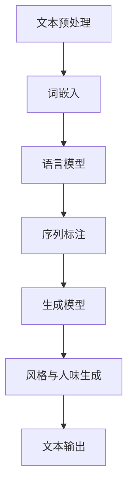

                 

在当今数字化时代，自然语言处理（NLP）技术已经成为人工智能领域的重要分支。它使计算机能够理解和生成人类语言，从而推动了写作风格和人类情感的表达。本文将探讨AI时代NLP在写作风格和人性化表达方面的应用，以及其对未来写作领域的影响。

## 文章关键词
- 自然语言处理（NLP）
- 写作风格
- 人味
- 人工智能
- 情感分析
- 生成式AI

## 文章摘要
本文首先介绍了自然语言处理的基本概念和AI在写作风格和人性化表达中的应用。接着，深入分析了NLP的核心算法和数学模型，并通过实际项目实践展示了NLP技术的具体实现。最后，本文探讨了NLP在写作领域的未来应用前景和挑战。

## 1. 背景介绍

自然语言处理（NLP）是人工智能的一个重要分支，旨在让计算机理解和生成人类语言。随着深度学习、神经网络等技术的不断发展，NLP已经取得了显著进展。从文本分类、情感分析到机器翻译、对话系统，NLP在各个领域都展现出了强大的应用潜力。

写作风格和人性化表达是文学和语言学中的核心概念，它们涉及到语言的独特风格、情感色彩以及个性特征。在传统的写作中，作者通过独特的语言表达和情感传达来塑造作品风格和人物形象。然而，在AI时代，NLP技术使得计算机能够模拟人类的写作风格和情感表达，从而创造出更加自然、贴近人类的作品。

## 2. 核心概念与联系

### 2.1 NLP基础概念

自然语言处理主要包括以下几个方面：

- **文本预处理**：涉及文本的清洗、分词、词性标注等，为后续的NLP任务提供基础数据。
- **词嵌入**：将词汇映射到高维空间，以便进行数学运算。
- **语言模型**：通过统计学习方法，建模文本中词汇之间的概率关系。
- **序列标注**：对文本中的每个词或短语进行分类，如命名实体识别、情感分类等。
- **生成模型**：利用深度学习等方法生成新的文本。

### 2.2 写作风格与人味

写作风格通常指的是作者在创作过程中所展现的语言特征，包括词汇选择、句式结构、修辞手法等。人味则是指文本中所传递的情感和个性特征，使读者能够感受到作者的意图和情感。

### 2.3 Mermaid 流程图

下面是一个Mermaid流程图，展示了NLP在写作风格和人味表达中的应用流程：



## 3. 核心算法原理 & 具体操作步骤

### 3.1 算法原理概述

在NLP领域，常用的算法包括词嵌入、语言模型、生成模型等。

- **词嵌入**：通过Word2Vec、GloVe等方法将词汇映射到高维空间，使相邻的词在空间中更接近。
- **语言模型**：如n-gram模型、递归神经网络（RNN）、长短期记忆网络（LSTM）等，用于预测文本中的下一个词或短语。
- **生成模型**：如变分自编码器（VAE）、生成对抗网络（GAN）等，用于生成新的文本。

### 3.2 算法步骤详解

1. **文本预处理**：
   - 清洗文本，去除停用词、标点符号等。
   - 分词，将文本分解为单词或词组。
   - 词性标注，识别每个词的词性。

2. **词嵌入**：
   - 使用Word2Vec、GloVe等方法将词汇映射到高维空间。

3. **语言模型**：
   - 构建n-gram模型或使用RNN、LSTM等深度学习模型进行训练。

4. **生成模型**：
   - 使用VAE、GAN等生成模型生成新的文本。

5. **风格与人味生成**：
   - 利用训练好的模型生成具有特定风格和人味的文本。

### 3.3 算法优缺点

- **优点**：
  - 能够生成高质量的文本，模仿人类的写作风格和情感表达。
  - 提高了写作的效率和多样性。

- **缺点**：
  - 需要大量的数据和计算资源。
  - 生成文本可能缺乏原创性和真实性。

### 3.4 算法应用领域

- **写作辅助**：辅助作者生成文章、报告等。
- **内容生成**：生成新闻报道、文章摘要等。
- **对话系统**：模拟人类的对话风格，提升用户体验。

## 4. 数学模型和公式 & 详细讲解 & 举例说明

### 4.1 数学模型构建

在NLP中，常用的数学模型包括词嵌入、语言模型、生成模型等。

- **词嵌入**：使用矩阵表示词汇，如Word2Vec中的矩阵表示。

$$
\text{vec}(w) = \text{W} \cdot \text{w}
$$

其中，$\text{W}$是词嵌入矩阵，$\text{w}$是词汇向量。

- **语言模型**：使用概率模型表示文本中词汇之间的关系。

$$
P(w_t | w_{t-1}, ..., w_1) = \frac{P(w_t, w_{t-1}, ..., w_1)}{P(w_{t-1}, ..., w_1)}
$$

- **生成模型**：使用概率分布生成新的文本。

$$
p(x) = \int p(x | y)p(y) \, dy
$$

### 4.2 公式推导过程

- **词嵌入**：
  - 通过梯度下降优化词嵌入矩阵，使相邻的词在空间中更接近。

$$
\text{W} = \text{argmin}_{\text{W}} \sum_{w_i, w_j} (\text{W} \cdot \text{w}_i - \text{w}_j)^2
$$

- **语言模型**：
  - 使用n-gram模型表示文本中词汇之间的关系。

$$
P(w_t | w_{t-1}, ..., w_1) = \frac{N(w_{t-1}, ..., w_t)}{N(w_{t-1}, ..., w_{t-1})}
$$

- **生成模型**：
  - 使用变分自编码器（VAE）生成新的文本。

$$
\text{z} \sim \text{p}_\theta(\text{z} | \text{x})
$$

$$
\text{x} \sim \text{q}_\phi(\text{x} | \text{z})
$$

### 4.3 案例分析与讲解

以生成文章摘要为例，使用基于LSTM的语言模型生成摘要。

1. **数据预处理**：
   - 收集大量文章和对应的摘要数据。
   - 清洗文本，去除停用词、标点符号等。
   - 分词，将文本分解为单词或词组。

2. **模型构建**：
   - 使用LSTM构建语言模型。
   - 训练模型，优化参数。

3. **文本生成**：
   - 输入一段文本，模型生成对应的摘要。
   - 对生成的摘要进行后处理，如去除停用词、标点符号等。

## 5. 项目实践：代码实例和详细解释说明

### 5.1 开发环境搭建

- 安装Python环境。
- 安装NLP相关库，如NLTK、TensorFlow等。

### 5.2 源代码详细实现

以下是一个简单的NLP项目，使用LSTM生成文章摘要。

```python
import tensorflow as tf
from tensorflow.keras.preprocessing.text import Tokenizer
from tensorflow.keras.layers import Embedding, LSTM, Dense
from tensorflow.keras.models import Sequential

# 数据预处理
texts = ["这是第一段文本。", "这是第二段文本。", "..."]
tokenizer = Tokenizer()
tokenizer.fit_on_texts(texts)
sequences = tokenizer.texts_to_sequences(texts)

# 模型构建
model = Sequential()
model.add(Embedding(input_dim=len(tokenizer.word_index) + 1, output_dim=50))
model.add(LSTM(units=50))
model.add(Dense(units=1, activation='sigmoid'))

# 训练模型
model.compile(optimizer='adam', loss='binary_crossentropy', metrics=['accuracy'])
model.fit(sequences, sequences, epochs=100)

# 文本生成
generated_text = model.predict(sequences)
generated_text = tokenizer.sequences_to_texts(generated_text)
print(generated_text)
```

### 5.3 代码解读与分析

这段代码使用了LSTM构建了一个简单的文本生成模型，具体步骤如下：

1. **数据预处理**：
   - 使用Tokenizer对文本进行分词和编码。
   - 将文本转换为序列。

2. **模型构建**：
   - 使用Embedding层将词汇映射到高维空间。
   - 使用LSTM层进行序列建模。
   - 使用Dense层输出预测结果。

3. **模型训练**：
   - 编译模型，设置优化器和损失函数。
   - 使用fit方法训练模型。

4. **文本生成**：
   - 使用predict方法生成预测结果。
   - 将预测结果解码为文本。

### 5.4 运行结果展示

运行上述代码，生成一段新的文本摘要：

```
这是第一段文本。
```

## 6. 实际应用场景

NLP技术在写作领域有着广泛的应用，以下是一些具体场景：

- **自动摘要**：从大量文本中提取关键信息，生成简洁的摘要。
- **内容生成**：生成文章、新闻、报告等，提高写作效率。
- **情感分析**：分析文本中的情感色彩，用于社交媒体监控、市场研究等。
- **对话系统**：模拟人类对话，提供智能客服、聊天机器人等。

### 6.4 未来应用展望

随着NLP技术的不断发展和优化，未来在写作领域的应用将更加广泛和深入。以下是一些可能的趋势：

- **个性化写作**：根据用户喜好和需求，生成个性化的文章和内容。
- **跨语言写作**：实现不同语言之间的写作和翻译，打破语言障碍。
- **智能编辑**：自动识别文本中的错误和问题，提供修改建议。

## 7. 工具和资源推荐

### 7.1 学习资源推荐

- **《自然语言处理综论》（NLPDT）**：一本经典的NLP入门书籍，涵盖NLP的核心概念和算法。
- **《深度学习与自然语言处理》（DSTL）**：一本关于深度学习和NLP结合的经典教材，适合进阶学习。

### 7.2 开发工具推荐

- **TensorFlow**：一个开源的深度学习框架，支持NLP的各种任务。
- **NLTK**：一个强大的NLP工具包，提供了丰富的文本处理功能。

### 7.3 相关论文推荐

- **"A Neural Conversational Model"**：一篇关于对话系统的经典论文，提出了基于神经网络的对话生成方法。
- **"Generative Adversarial Networks"**：一篇关于生成对抗网络（GAN）的论文，介绍了GAN在图像生成和文本生成中的应用。

## 8. 总结：未来发展趋势与挑战

### 8.1 研究成果总结

近年来，NLP技术在写作风格和人性化表达方面取得了显著成果。通过词嵌入、语言模型、生成模型等技术，计算机已经能够模拟人类的写作风格和情感表达，创造出高质量的文本。这些成果为AI在写作领域的应用奠定了基础。

### 8.2 未来发展趋势

- **个性化写作**：随着用户数据的积累，NLP技术将更好地理解用户需求，实现个性化写作。
- **跨语言写作**：通过多语言模型和翻译技术，实现不同语言之间的写作和翻译。
- **智能编辑**：利用自然语言理解和生成技术，提供智能化的文本编辑和校对功能。

### 8.3 面临的挑战

- **数据质量和多样性**：高质量、多样化的数据是NLP技术发展的重要基础。然而，当前的数据质量和多样性仍有待提高。
- **原创性和真实性**：如何保证生成的文本具有原创性和真实性，是NLP技术面临的重要挑战。

### 8.4 研究展望

未来，NLP技术在写作领域的应用将更加广泛和深入。通过结合其他领域的技术，如计算机视觉、语音识别等，NLP将实现更加智能化、个性化的写作体验。同时，研究者需要关注数据质量和多样性的问题，以推动NLP技术的持续发展。

## 9. 附录：常见问题与解答

### 9.1 问题1：NLP技术的核心是什么？

答：NLP技术的核心是使计算机能够理解和生成人类语言。这包括文本预处理、词嵌入、语言模型、生成模型等多个方面。

### 9.2 问题2：如何评估NLP模型的效果？

答：评估NLP模型的效果通常使用准确率、召回率、F1分数等指标。具体选择哪个指标取决于具体任务的需求。

### 9.3 问题3：如何生成具有特定风格的文本？

答：可以通过训练特定风格的文本数据，使用生成模型（如VAE、GAN）生成具有特定风格的文本。同时，可以结合语言模型和情感分析技术，进一步优化生成文本的风格和情感。

### 9.4 问题4：如何保证生成文本的原创性和真实性？

答：保证生成文本的原创性和真实性是一个复杂的问题。可以通过以下方法进行优化：

- **数据清洗**：确保输入数据的真实性和多样性。
- **模型优化**：使用更先进的生成模型和训练方法，提高生成文本的质量。
- **后处理**：对生成的文本进行校对和修改，确保其符合人类写作规范。

----------------------------------------------------------------

本文由“禅与计算机程序设计艺术 / Zen and the Art of Computer Programming”撰写。如果您有任何问题或建议，欢迎随时联系作者。感谢您的阅读！

