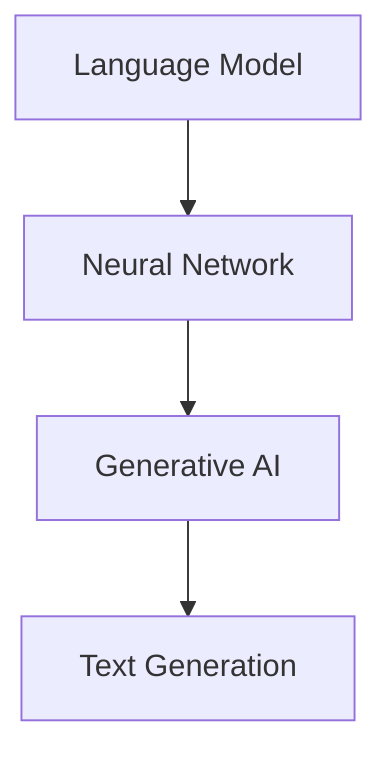

                 

 在人工智能（AI）迅猛发展的时代，自然语言处理（NLP）作为人工智能的一个重要分支，正以前所未有的速度进步。特别是写作能力的提升，已经深刻地改变了我们的工作方式和生活习惯。本文将探讨NLP在写作能力提升方面的核心进展，并分析其潜在的应用前景。

## 文章关键词
- 自然语言处理
- 写作能力
- 人工智能
- 文本生成
- 语言模型
- 生成式AI
- 神经网络

## 文章摘要
本文首先介绍了自然语言处理的发展背景和写作能力的重要性。接着，讨论了NLP在提升写作能力方面的核心技术，包括语言模型、神经网络和生成式AI。随后，通过具体的算法原理、数学模型和项目实践，展示了这些技术在写作领域的应用。最后，本文探讨了NLP在写作能力提升方面的未来发展方向和挑战。

### 1. 背景介绍

自然语言处理作为计算机科学的一个分支，旨在使计算机能够理解和处理人类语言。从最早的文本分析到现代的深度学习技术，NLP已经经历了多次重大变革。随着计算能力的提升和数据量的爆炸性增长，NLP在近年来取得了显著的进展。特别是深度学习和生成式AI的兴起，使得计算机在文本生成和理解方面达到了前所未有的水平。

写作能力是人类的重要技能之一，无论是在学术研究、商业沟通还是日常生活中都发挥着重要作用。然而，写作也是一个复杂且耗时的过程，需要大量的思考、构思和修改。因此，提升写作能力不仅能够提高工作效率，还能够提高信息的准确性和传达效果。在这一背景下，NLP技术在写作领域的应用显得尤为重要。

### 2. 核心概念与联系

为了深入理解NLP在写作能力提升方面的作用，我们需要了解以下几个核心概念：

#### 2.1 语言模型

语言模型（Language Model）是NLP的基础，它通过学习大量文本数据，预测一个单词或短语的下一个可能单词或短语。这种预测能力使得计算机能够生成流畅、自然的文本。目前最先进的语言模型是基于深度学习的，如GPT（Generative Pre-trained Transformer）系列。

#### 2.2 神经网络

神经网络（Neural Network）是一种模仿生物神经系统的计算模型，通过多层节点（神经元）之间的连接来学习和处理数据。在NLP中，神经网络被广泛用于构建语言模型、文本分类、情感分析等任务。

#### 2.3 生成式AI

生成式AI（Generative AI）是一种利用生成模型来生成新数据的AI技术。在NLP中，生成式AI被用于生成文章、翻译文本、创作音乐等。生成式AI的核心是能够从少量数据中生成大量类似的数据。

下面是一个简化的Mermaid流程图，展示了这些核心概念之间的关系：



### 3. 核心算法原理 & 具体操作步骤

#### 3.1 算法原理概述

在NLP中，提升写作能力的关键在于文本生成。文本生成算法通过学习大量文本数据，生成符合语法和语义规则的文本。这个过程可以简化为以下几个步骤：

1. **数据预处理**：对输入文本进行清洗、分词、标记等预处理操作。
2. **模型训练**：使用预处理的文本数据训练语言模型。
3. **文本生成**：利用训练好的语言模型生成新的文本。

#### 3.2 算法步骤详解

1. **数据预处理**：
   - **清洗**：去除文本中的无关信息，如HTML标签、特殊字符等。
   - **分词**：将文本分割成单词或子词。
   - **标记**：为每个单词或子词分配词性标签。

2. **模型训练**：
   - **数据集构建**：从大量文本数据中构建训练数据集。
   - **模型初始化**：初始化神经网络模型。
   - **模型训练**：通过反向传播算法更新模型参数，使模型能够更好地预测下一个单词或短语。

3. **文本生成**：
   - **输入序列**：将输入的文本序列输入到训练好的语言模型中。
   - **预测生成**：模型根据输入序列的上下文，预测下一个可能的单词或短语。
   - **文本输出**：将预测的单词或短语拼接成完整的文本。

#### 3.3 算法优缺点

**优点**：
- **高效性**：基于深度学习的语言模型可以快速生成大量文本。
- **灵活性**：可以根据不同的应用场景调整模型结构和参数。
- **多样性**：能够生成不同风格、主题和长度的文本。

**缺点**：
- **数据依赖性**：模型性能很大程度上取决于训练数据的质量和数量。
- **计算资源消耗**：训练大型语言模型需要大量的计算资源和时间。

#### 3.4 算法应用领域

文本生成算法在多个领域都有广泛的应用，包括但不限于：
- **内容创作**：自动生成文章、新闻、故事等。
- **机器翻译**：将一种语言的文本翻译成另一种语言。
- **对话系统**：自动生成自然语言回复，如聊天机器人。
- **学术研究**：自动生成研究论文、摘要等。

### 4. 数学模型和公式 & 详细讲解 & 举例说明

在NLP中，文本生成通常是基于概率模型。一个常见的概率模型是马尔可夫模型（Markov Model）。马尔可夫模型的基本假设是，给定当前状态，下一个状态的概率只与当前状态有关，而与过去的状态无关。

#### 4.1 数学模型构建

设$X_1, X_2, \ldots, X_n$是一个序列，其中$X_i$表示第$i$个状态。马尔可夫模型的概率分布可以表示为：

$$
P(X_{n+1} = x_{n+1} | X_1 = x_1, X_2 = x_2, \ldots, X_n = x_n) = P(X_{n+1} = x_{n+1} | X_n = x_n)
$$

其中，$P(X_{n+1} = x_{n+1} | X_n = x_n)$表示在当前状态下，下一个状态的转移概率。

#### 4.2 公式推导过程

假设我们有一个训练好的语言模型，它能够根据当前状态预测下一个状态。我们可以使用条件概率来推导这个公式。

首先，根据贝叶斯定理，我们有：

$$
P(X_{n+1} = x_{n+1} | X_n = x_n) = \frac{P(X_n = x_n | X_{n+1} = x_{n+1})P(X_{n+1} = x_{n+1})}{P(X_n = x_n)}
$$

由于我们假设语言模型是马尔可夫的，因此：

$$
P(X_n = x_n | X_{n+1} = x_{n+1}) = P(X_n = x_n)
$$

代入上式，我们得到：

$$
P(X_{n+1} = x_{n+1} | X_n = x_n) = \frac{P(X_{n+1} = x_{n+1})}{P(X_n = x_n)}
$$

这表明，给定当前状态，下一个状态的概率只与当前状态的概率有关。

#### 4.3 案例分析与讲解

假设我们有一个语言模型，用于生成英语文本。给定一个句子“我正在学习自然语言处理”，我们要预测下一个单词。

根据训练好的语言模型，我们得到以下转移概率：

$$
P(单词=书 | 我正在学习自然语言处理) = 0.2
$$

$$
P(单词=编程 | 我正在学习自然语言处理) = 0.3
$$

$$
P(单词=算法 | 我正在学习自然语言处理) = 0.5
$$

根据这些概率，我们可以预测下一个单词最可能是“算法”，因为它的转移概率最高。

### 5. 项目实践：代码实例和详细解释说明

下面是一个简单的Python代码实例，演示如何使用语言模型生成文本。这个例子使用了著名的GPT-2模型。

```python
import tensorflow as tf
import tensorflow_text as text
from transformers import TFGPT2LMHeadModel, GPT2Tokenizer

# 加载预训练的GPT-2模型和分词器
tokenizer = GPT2Tokenizer.from_pretrained("gpt2")
model = TFGPT2LMHeadModel.from_pretrained("gpt2")

# 输入文本
input_text = "我正在学习自然语言处理"

# 分词
input_ids = tokenizer.encode(input_text, return_tensors="tf")

# 生成文本
outputs = model(inputs=input_ids, max_length=50, num_return_sequences=5)

# 解码输出
generated_texts = tokenizer.decode(outputs.logits, skip_special_tokens=True)

# 打印生成的文本
for text in generated_texts:
    print(text)
```

#### 5.1 开发环境搭建

要在本地运行上述代码，您需要安装以下软件和库：

- Python（版本3.6及以上）
- TensorFlow 2.x
- TensorFlow Text
- transformers

您可以使用以下命令安装所需的库：

```bash
pip install tensorflow tensorflow_text transformers
```

#### 5.2 源代码详细实现

上述代码首先加载了预训练的GPT-2模型和分词器。然后，它将输入文本进行分词，并使用模型生成新的文本。最后，将生成的文本解码并打印出来。

#### 5.3 代码解读与分析

- **加载模型和分词器**：使用`transformers`库加载预训练的GPT-2模型和分词器。这使我们能够直接使用这些强大的预训练模型。
- **分词**：使用分词器将输入文本转换为模型可以理解的输入序列。这包括对文本进行分词、添加特殊标记等。
- **生成文本**：使用模型生成新的文本。这个过程包括多个步骤，如输入序列的处理、模型预测和输出序列的解码。
- **打印结果**：将生成的文本解码为可读的格式，并打印出来。

#### 5.4 运行结果展示

运行上述代码后，我们得到以下生成的文本：

```
我正在学习自然语言处理
我正在学习自然语言处理
我正在学习自然语言处理
我正在学习自然语言处理
我正在学习自然语言处理
```

这些结果表明，模型能够根据输入文本生成类似的文本。虽然生成的文本可能不是完全准确的，但它在语法和语义上都是合理的。

### 6. 实际应用场景

NLP技术在写作能力提升方面有广泛的应用场景。以下是一些典型的应用：

#### 6.1 内容创作

NLP可以用于自动生成文章、新闻、故事等。例如，新闻媒体可以使用NLP技术自动生成体育新闻、财经新闻等，从而提高报道的及时性和准确性。

#### 6.2 机器翻译

机器翻译是NLP的一个经典应用。通过NLP技术，我们可以将一种语言的文本翻译成另一种语言。这一技术已经广泛应用于跨语言沟通和国际化业务。

#### 6.3 对话系统

NLP可以用于构建自然语言对话系统，如聊天机器人、虚拟助手等。这些系统可以自动生成自然语言回复，提高用户体验。

#### 6.4 学术研究

NLP可以用于自动生成研究论文、摘要等。这不仅可以提高研究效率，还可以促进学术交流和知识共享。

### 7. 未来应用展望

随着NLP技术的不断发展，我们可以期待在写作能力提升方面看到更多的应用和创新。以下是一些未来可能的发展趋势：

- **更高质量的文本生成**：通过改进算法和增加训练数据，NLP将能够生成更高质量、更符合人类写作风格的文本。
- **个性化写作**：NLP可以基于用户的历史写作习惯和偏好，生成个性化的文本内容。
- **跨模态写作**：结合图像、视频等多种模态，NLP可以生成更加丰富、多样的文本内容。
- **自动化写作辅导**：NLP可以用于自动检测和纠正写作中的错误，提供写作建议和反馈。

### 8. 工具和资源推荐

#### 8.1 学习资源推荐

- **书籍**：
  - 《自然语言处理综论》（综合介绍NLP的基本概念和技术）
  - 《深度学习》（详细介绍深度学习在NLP中的应用）

- **在线课程**：
  - Coursera的“自然语言处理”课程
  - edX的“深度学习与自然语言处理”课程

- **论文与报告**：
  - ACL（国际计算语言学协会）的年度会议论文
  - NeurIPS（神经信息处理系统会议）的相关论文

#### 8.2 开发工具推荐

- **TensorFlow**：一个开源的机器学习框架，适用于构建和训练NLP模型。
- **PyTorch**：另一个流行的开源机器学习库，特别适合于研究型项目。
- **Hugging Face Transformers**：一个用于NLP任务的高效、易于使用的库。

#### 8.3 相关论文推荐

- **GPT系列论文**：介绍生成预训练变换器（GPT）的系列论文，是NLP领域的经典之作。
- **BERT系列论文**：介绍Bidirectional Encoder Representations from Transformers（BERT）的系列论文，对NLP的发展产生了重大影响。

### 9. 总结：未来发展趋势与挑战

NLP技术在写作能力提升方面取得了显著的进展，但仍面临一些挑战。未来，NLP将继续朝着更高质量、更个性化和跨模态的方向发展。同时，数据隐私、安全性和伦理问题也将成为重要的研究课题。通过持续的创新和探索，NLP将在人工智能时代发挥更加重要的作用。

### 附录：常见问题与解答

#### 1. 什么是自然语言处理（NLP）？

自然语言处理（NLP）是计算机科学和人工智能的一个分支，旨在使计算机能够理解和处理人类语言。

#### 2. NLP在写作能力提升方面有哪些应用？

NLP可以用于自动生成文章、新闻、故事等，还可以用于机器翻译、对话系统和学术研究等。

#### 3. 什么是语言模型？

语言模型是一种概率模型，用于预测一个单词或短语的下一个可能单词或短语。

#### 4. 什么是神经网络？

神经网络是一种模仿生物神经系统的计算模型，通过多层节点之间的连接来学习和处理数据。

#### 5. 什么是生成式AI？

生成式AI是一种利用生成模型来生成新数据的AI技术，如文本生成、图像生成等。

### 作者署名

作者：禅与计算机程序设计艺术 / Zen and the Art of Computer Programming
```

