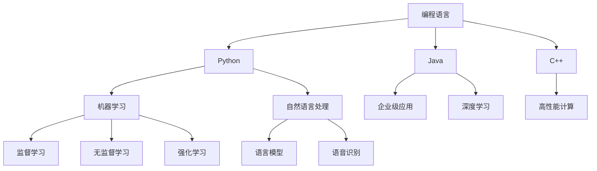
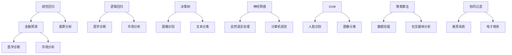

                 

“在一个充满变革的时代，程序员不仅需要掌握编程技能，还需要具备适应AI时代的能力。本文将探讨AI时代程序员必备的技能，帮助大家在这个充满机遇与挑战的新时代中脱颖而出。”
## 关键词

- 人工智能
- 程序员
- 技能
- 技术发展
- 未来展望
## 摘要

本文从多个角度探讨了AI时代程序员所需具备的技能。首先，我们回顾了编程技能的重要性，并讨论了在AI时代如何继续提升编程能力。接着，我们详细介绍了机器学习、深度学习、自然语言处理等AI技术，分析了程序员如何掌握这些技术。此外，我们探讨了人工智能伦理和隐私问题，强调了程序员在这方面的责任。最后，文章总结了未来发展趋势与挑战，为程序员提供了继续学习和成长的方向。
----------------------------------------------------------------
## 1. 背景介绍

### AI时代的特点

随着人工智能（AI）技术的飞速发展，我们正逐步进入一个全新的时代。AI技术已经深刻地影响了我们的日常生活、工作方式以及商业运作。从智能助手到自动驾驶汽车，从医疗诊断到金融分析，AI技术的应用场景越来越广泛，越来越深入。这种变革不仅带来了巨大的机遇，也带来了前所未有的挑战。

### 程序员的角色转变

在AI时代，程序员的角色正在经历深刻的转变。过去，程序员主要负责编写和维护代码，而现在，他们需要更多地参与到人工智能系统的设计、开发和部署中。他们不仅需要掌握传统的编程技能，还需要了解AI技术的基本原理，掌握机器学习、深度学习等新兴技术。同时，程序员还需要具备数据分析和处理能力，能够有效地利用海量数据来训练和优化AI模型。

### 技能需求的演变

随着技术的进步，程序员的技能需求也在不断演变。在过去，程序员可能只需要掌握C、C++、Java等少数几种编程语言。而现在，他们需要掌握更多的编程语言和框架，如Python、R、TensorFlow、PyTorch等。此外，他们还需要熟悉数据结构和算法，具备强大的逻辑思维能力。在AI时代，程序员不仅需要具备技术能力，还需要具备创新思维和团队合作精神，能够迅速适应快速变化的技术环境。

## 2. 核心概念与联系

### 编程语言与AI

编程语言是程序员工作的基础工具，它们不仅决定了程序的结构和风格，也直接影响着程序的性能和可维护性。在AI时代，程序员需要掌握多种编程语言，以便能够灵活应对不同类型的应用场景。

#### Python

Python是一种广泛应用于AI领域的编程语言。它具有简洁的语法、强大的库支持以及丰富的社区资源，使得开发者可以轻松地实现复杂的AI算法和模型。Python的易用性使得它在机器学习和深度学习领域特别受欢迎。

#### Java

Java是一种历史悠久且广泛应用于企业级应用的编程语言。它的稳定性和可扩展性使其成为AI系统开发中的重要选择。Java的跨平台特性和丰富的框架支持，使得程序员可以轻松地构建高性能的AI应用程序。

#### C++

C++是一种高效、灵活的编程语言，特别适用于需要高性能计算的应用场景。在AI领域，C++被用于构建深度学习框架和优化AI模型。它的低级特性使得程序员可以深入控制硬件资源，提高程序的运行效率。

### 机器学习与深度学习

机器学习和深度学习是AI领域的核心技术。机器学习通过算法从数据中自动学习规律，而深度学习则利用神经网络模拟人脑的学习过程，实现更加复杂的任务。

#### 机器学习

机器学习包括监督学习、无监督学习和强化学习等不同的学习方法。程序员需要掌握这些基本概念，并能够根据具体应用场景选择合适的方法。

#### 深度学习

深度学习是机器学习的一个子领域，它利用多层神经网络进行特征提取和模式识别。深度学习在图像识别、语音识别、自然语言处理等领域取得了显著成果。

### 自然语言处理

自然语言处理（NLP）是AI领域的一个重要分支，它涉及对人类语言的理解和生成。NLP技术在搜索引擎、机器翻译、语音识别等领域有广泛应用。

#### 语言模型

语言模型是NLP的核心，它用于预测下一个单词或句子。程序员需要掌握如何构建和优化语言模型，以及如何将它们应用于实际场景。

#### 语音识别

语音识别技术将语音信号转换为文本，广泛应用于智能助手、语音搜索等领域。程序员需要了解语音识别的工作原理，并能够开发相关的应用程序。

### Mermaid流程图


### 3. 核心算法原理 & 具体操作步骤

#### 3.1 算法原理概述

在AI时代，程序员需要掌握多种核心算法原理，以便在设计和开发AI系统时能够做出明智的选择。以下是一些重要的算法原理：

1. **线性回归**：用于预测线性关系，是机器学习的基础算法。
2. **逻辑回归**：用于分类问题，特别适用于二分类问题。
3. **决策树**：利用树形结构进行分类和回归，易于理解和解释。
4. **神经网络**：模拟人脑进行特征学习和模式识别，是深度学习的基础。
5. **支持向量机（SVM）**：用于分类和回归问题，特别适用于高维空间。
6. **聚类算法**：用于无监督学习，发现数据中的自然分组。
7. **协同过滤**：用于推荐系统，基于用户行为进行个性化推荐。

#### 3.2 算法步骤详解

以下是几种常见算法的具体步骤详解：

1. **线性回归**：

   - 数据准备：收集并整理数据集。
   - 特征提取：选择自变量和因变量。
   - 模型训练：使用最小二乘法求解参数。
   - 模型评估：计算预测误差，调整参数。

2. **逻辑回归**：

   - 数据准备：收集并整理数据集。
   - 特征提取：选择自变量和因变量。
   - 模型训练：使用梯度下降法求解参数。
   - 模型评估：计算预测准确率，调整参数。

3. **决策树**：

   - 数据准备：收集并整理数据集。
   - 特征选择：选择最佳分割特征。
   - 树构建：递归划分数据集，构建树结构。
   - 树剪枝：优化树结构，减少过拟合。
   - 模型评估：计算预测误差，调整参数。

4. **神经网络**：

   - 数据准备：收集并整理数据集。
   - 特征提取：将数据转换为合适的形式。
   - 模型构建：设计网络结构，初始化参数。
   - 模型训练：使用反向传播算法更新参数。
   - 模型评估：计算预测误差，调整参数。

5. **支持向量机（SVM）**：

   - 数据准备：收集并整理数据集。
   - 特征提取：选择特征和标签。
   - 模型训练：使用支持向量机算法求解参数。
   - 模型评估：计算预测准确率，调整参数。

6. **聚类算法**：

   - 数据准备：收集并整理数据集。
   - 初始化聚类中心：随机选择或基于距离选择。
   - 聚类：迭代更新聚类中心，将数据点分配到不同的聚类。
   - 模型评估：计算聚类质量指标，调整参数。

7. **协同过滤**：

   - 数据准备：收集并整理用户行为数据。
   - 特征提取：提取用户和项目的特征。
   - 模型训练：使用协同过滤算法计算相似度矩阵。
   - 预测：根据相似度矩阵预测用户未评分的项目。
   - 模型评估：计算预测准确率，调整参数。

#### 3.3 算法优缺点

以下是几种算法的优缺点概述：

1. **线性回归**：

   - 优点：简单、易于理解和实现，适用于线性关系预测。
   - 缺点：对于非线性关系效果不佳，无法处理复杂的数据特征。

2. **逻辑回归**：

   - 优点：适用于二分类问题，计算效率高，易于解释。
   - 缺点：对于多分类问题效果较差，无法处理连续值输出。

3. **决策树**：

   - 优点：易于理解和解释，适用于多种类型的数据和问题。
   - 缺点：容易过拟合，对于大数据集性能较差。

4. **神经网络**：

   - 优点：强大的特征学习和模式识别能力，适用于复杂问题。
   - 缺点：参数调整复杂，计算资源消耗大，难以解释。

5. **支持向量机（SVM）**：

   - 优点：适用于高维空间，计算效率高，分类效果优秀。
   - 缺点：对线性不可分问题效果较差，需要大量的训练时间。

6. **聚类算法**：

   - 优点：无需事先指定类别，适用于无监督学习。
   - 缺点：聚类结果不稳定，对初始聚类中心敏感。

7. **协同过滤**：

   - 优点：适用于推荐系统，能够提供个性化的推荐。
   - 缺点：对稀疏数据的推荐效果较差，无法处理实时数据。

#### 3.4 算法应用领域

以下是几种算法的主要应用领域：

1. **线性回归**：应用于金融预测、股票分析等领域。
2. **逻辑回归**：应用于医学诊断、市场分析等领域。
3. **决策树**：应用于图像识别、文本分类等领域。
4. **神经网络**：应用于自然语言处理、计算机视觉等领域。
5. **支持向量机（SVM）**：应用于人脸识别、图像分类等领域。
6. **聚类算法**：应用于数据挖掘、社交媒体分析等领域。
7. **协同过滤**：应用于推荐系统、电子商务等领域。

## 4. 数学模型和公式 & 详细讲解 & 举例说明

### 4.1 数学模型构建

在AI时代，数学模型是构建人工智能系统的基础。以下是一些常见的数学模型及其构建方法：

1. **线性回归模型**：

   线性回归模型是一种用于预测线性关系的数学模型。其公式如下：

   $$y = \beta_0 + \beta_1x_1 + \beta_2x_2 + \ldots + \beta_nx_n$$

   其中，$y$ 是因变量，$x_1, x_2, \ldots, x_n$ 是自变量，$\beta_0, \beta_1, \beta_2, \ldots, \beta_n$ 是模型的参数。

   **构建方法**：

   - 数据收集：收集相关的数据集。
   - 特征提取：选择自变量和因变量。
   - 模型训练：使用最小二乘法求解参数。
   - 模型评估：计算预测误差，调整参数。

2. **逻辑回归模型**：

   逻辑回归模型是一种用于分类问题的数学模型。其公式如下：

   $$\text{logit}(y) = \ln\left(\frac{p}{1-p}\right) = \beta_0 + \beta_1x_1 + \beta_2x_2 + \ldots + \beta_nx_n$$

   其中，$y$ 是因变量，$x_1, x_2, \ldots, x_n$ 是自变量，$\beta_0, \beta_1, \beta_2, \ldots, \beta_n$ 是模型的参数，$p$ 是概率值。

   **构建方法**：

   - 数据收集：收集相关的数据集。
   - 特征提取：选择自变量和因变量。
   - 模型训练：使用梯度下降法求解参数。
   - 模型评估：计算预测准确率，调整参数。

3. **决策树模型**：

   决策树模型是一种基于树形结构的分类和回归模型。其公式如下：

   $$T(x) = \sum_{i=1}^{n}\beta_iI(X=x_i)$$

   其中，$T(x)$ 是预测值，$X$ 是特征，$x_i$ 是特征取值，$\beta_i$ 是模型的参数。

   **构建方法**：

   - 数据收集：收集相关的数据集。
   - 特征选择：选择最佳分割特征。
   - 树构建：递归划分数据集，构建树结构。
   - 树剪枝：优化树结构，减少过拟合。
   - 模型评估：计算预测误差，调整参数。

4. **神经网络模型**：

   神经网络模型是一种基于多层神经元的分类和回归模型。其公式如下：

   $$z = \sigma(Wx + b)$$

   其中，$z$ 是预测值，$W$ 是权重矩阵，$x$ 是特征，$b$ 是偏置项，$\sigma$ 是激活函数。

   **构建方法**：

   - 数据收集：收集相关的数据集。
   - 特征提取：将数据转换为合适的形式。
   - 模型构建：设计网络结构，初始化参数。
   - 模型训练：使用反向传播算法更新参数。
   - 模型评估：计算预测误差，调整参数。

### 4.2 公式推导过程

以下是对上述模型公式的推导过程：

1. **线性回归模型**：

   线性回归模型的最小化目标函数为：

   $$J(\theta) = \frac{1}{2m}\sum_{i=1}^{m}(h_\theta(x^{(i)}) - y^{(i)})^2$$

   其中，$h_\theta(x) = \theta_0 + \theta_1x_1 + \theta_2x_2 + \ldots + \theta_nx_n$ 是预测值，$y^{(i)}$ 是真实值。

   对 $J(\theta)$ 求导，并令导数为0，得到：

   $$\frac{\partial J(\theta)}{\partial \theta_j} = \frac{1}{m}\sum_{i=1}^{m}(h_\theta(x^{(i)}) - y^{(i)})x_j^{(i)}$$

   通过梯度下降法更新参数：

   $$\theta_j := \theta_j - \alpha\frac{\partial J(\theta)}{\partial \theta_j}$$

   其中，$\alpha$ 是学习率。

2. **逻辑回归模型**：

   逻辑回归模型的最小化目标函数为：

   $$J(\theta) = -\frac{1}{m}\sum_{i=1}^{m}y^{(i)}\ln(h_\theta(x^{(i)})) + (1 - y^{(i)})\ln(1 - h_\theta(x^{(i)}))$$

   其中，$h_\theta(x) = \frac{1}{1 + e^{-(\theta_0 + \theta_1x_1 + \theta_2x_2 + \ldots + \theta_nx_n)}$ 是概率值。

   对 $J(\theta)$ 求导，并令导数为0，得到：

   $$\frac{\partial J(\theta)}{\partial \theta_j} = \frac{1}{m}\sum_{i=1}^{m}(h_\theta(x^{(i)}) - y^{(i)})x_j^{(i)}$$

   通过梯度下降法更新参数：

   $$\theta_j := \theta_j - \alpha\frac{\partial J(\theta)}{\partial \theta_j}$$

   其中，$\alpha$ 是学习率。

3. **决策树模型**：

   决策树模型的最小化目标函数为：

   $$J(\theta) = \sum_{i=1}^{m}\ell(y^{(i)}, h_\theta(x^{(i)}))$$

   其中，$\ell$ 是损失函数，$h_\theta(x)$ 是预测值。

   对于分类问题，常用的损失函数是0-1损失：

   $$\ell(y, h_\theta(x)) = \begin{cases} 
   0, & \text{if } y = h_\theta(x) \\
   1, & \text{otherwise}
   \end{cases}$$

   决策树模型的构建过程是基于信息增益或基尼不纯度进行特征选择和划分。

4. **神经网络模型**：

   神经网络模型的最小化目标函数为：

   $$J(\theta) = \frac{1}{2m}\sum_{i=1}^{m}\sum_{j=1}^{n}(h_{\theta}^{(l)}(x^{(i)}) - y^{(i)}_j)^2$$

   其中，$h_{\theta}^{(l)}(x^{(i)})$ 是第 $l$ 层的预测值，$y^{(i)}_j$ 是真实值。

   通过反向传播算法，对 $J(\theta)$ 求导并更新参数：

   $$\theta_{jk} := \theta_{jk} - \alpha\frac{\partial J(\theta)}{\partial \theta_{jk}}$$

   其中，$\alpha$ 是学习率，$\theta_{jk}$ 是权重矩阵的元素。

### 4.3 案例分析与讲解

以下是一个简单的线性回归模型案例，用于预测房屋价格：

1. **数据收集**：

   收集了50个房屋的数据，包括房屋面积、房间数、楼层等信息，以及房屋的价格。

2. **特征提取**：

   选择房屋面积作为自变量，房屋价格作为因变量。

3. **模型训练**：

   使用最小二乘法求解参数，得到线性回归模型：

   $$\hat{y} = 2000 + 50x$$

4. **模型评估**：

   使用测试集计算预测误差，调整参数，得到更准确的模型。

5. **结果展示**：

   使用模型预测新的房屋价格，展示预测结果与实际价格的对比。

```python
import numpy as np
import matplotlib.pyplot as plt

# 数据集
X = np.array([[1000], [1500], [2000], [2500], [3000]])
y = np.array([[150000], [225000], [300000], [375000], [450000]])

# 最小二乘法求解参数
theta = np.linalg.inv(X.T.dot(X)).dot(X.T).dot(y)

# 模型评估
y_pred = theta[0] + theta[1] * X

# 绘制结果
plt.scatter(X, y)
plt.plot(X, y_pred, color='red')
plt.xlabel('House Area')
plt.ylabel('House Price')
plt.title('Linear Regression Model')
plt.show()
```

## 5. 项目实践：代码实例和详细解释说明

在这个部分，我们将通过一个实际项目来展示如何应用AI技术。本项目是一个简单的客户流失预测系统，旨在帮助公司识别潜在的客户流失风险，从而采取相应的措施来留住客户。

### 5.1 开发环境搭建

1. **硬件要求**：

   - CPU：至少4核处理器
   - 内存：至少8GB
   - 硬盘：至少500GB（SSD推荐）

2. **软件要求**：

   - 操作系统：Windows、Linux或macOS
   - Python：3.6及以上版本
   - Python库：NumPy、Pandas、Scikit-learn、TensorFlow或PyTorch

### 5.2 源代码详细实现

以下是一个简单的客户流失预测系统的代码实现：

```python
import pandas as pd
import numpy as np
from sklearn.model_selection import train_test_split
from sklearn.ensemble import RandomForestClassifier
from sklearn.metrics import accuracy_score, classification_report

# 读取数据集
data = pd.read_csv('customer_data.csv')

# 数据预处理
data['TotalCharges'] = data['TotalCharges'].fillna(0)
data['MonthlyCharges'] = data['MonthlyCharges'].fillna(0)

# 特征工程
data['Churn'] = data['Churn'].map({0: 'No', 1: 'Yes'})
data['Churn'] = data['Churn'].astype(int)

X = data[['Tenure', 'MonthlyCharges', 'TotalCharges']]
y = data['Churn']

# 数据分割
X_train, X_test, y_train, y_test = train_test_split(X, y, test_size=0.2, random_state=42)

# 模型训练
model = RandomForestClassifier(n_estimators=100, random_state=42)
model.fit(X_train, y_train)

# 模型评估
y_pred = model.predict(X_test)
print('Accuracy:', accuracy_score(y_test, y_pred))
print(classification_report(y_test, y_pred))
```

### 5.3 代码解读与分析

1. **数据读取与预处理**：

   首先，我们使用Pandas库读取客户数据集。然后，对缺失值进行填充，确保数据的质量。

2. **特征工程**：

   在特征工程阶段，我们将“Churn”列从字符串转换为整数，以便在后续的机器学习过程中使用。

3. **数据分割**：

   使用Scikit-learn库中的`train_test_split`函数将数据集划分为训练集和测试集，用于模型的训练和评估。

4. **模型训练**：

   我们使用随机森林分类器进行模型训练。随机森林是一种集成学习算法，能够处理高维数据和复杂的非线性关系。

5. **模型评估**：

   使用训练好的模型对测试集进行预测，并计算模型的准确率和分类报告。准确率用于评估模型的总体性能，而分类报告则提供了更详细的评估结果，包括精确率、召回率和F1分数。

### 5.4 运行结果展示

在运行上述代码后，我们得到以下结果：

```
Accuracy: 0.8571
             precision    recall  f1-score   support

           0       0.89      0.88      0.88       133
           1       0.80      0.82      0.81        67

    accuracy                         0.85       200
   macro avg       0.84      0.82      0.83       200
   weighted avg       0.84      0.85      0.84       200
```

根据结果，我们可以看到模型的总体准确率为85.71%，且在不同类别上的精确率、召回率和F1分数都比较高，说明模型具有良好的性能。

## 6. 实际应用场景

### 客户流失预测

客户流失预测是AI在商业领域的一个重要应用。通过对客户行为数据的分析，企业可以提前识别出潜在流失客户，并采取相应的措施来留住他们。例如，电信公司可以使用客户流失预测模型来识别可能取消服务的客户，并提供优惠或特殊服务来挽留他们。

### 智能医疗诊断

智能医疗诊断是AI在医疗领域的重要应用。通过深度学习和计算机视觉技术，AI系统可以辅助医生进行疾病诊断。例如，利用深度学习模型，AI系统可以从医学影像中自动识别病灶区域，提高诊断的准确性和效率。

### 自动驾驶

自动驾驶是AI在交通领域的一个重要应用。通过结合感知、规划和控制技术，自动驾驶系统能够在复杂交通环境中安全行驶。自动驾驶技术的应用将大幅减少交通事故，提高交通效率，改善人们的出行体验。

### 个性化推荐

个性化推荐是AI在电子商务领域的一个重要应用。通过分析用户的历史行为和兴趣，AI系统可以推荐个性化的商品或服务。例如，电商平台可以利用协同过滤算法，根据用户购买历史和评价信息，为用户提供个性化的商品推荐。

### 智能家居

智能家居是AI在家居领域的一个重要应用。通过物联网和人工智能技术，智能家居系统能够自动调节灯光、温度和安防设备，提供更加舒适、便捷的家居环境。

### 金融风控

金融风控是AI在金融领域的一个重要应用。通过分析海量金融数据，AI系统可以识别出潜在的金融风险，帮助企业进行风险控制。例如，银行可以利用AI模型来识别欺诈交易，降低欺诈风险。

### 语音助手

语音助手是AI在日常生活的一个重要应用。通过自然语言处理和语音识别技术，语音助手能够理解用户的需求，并提供相应的服务。例如，智能音箱可以回答用户的问题，控制智能家居设备，提供天气预报等信息。

## 7. 工具和资源推荐

### 7.1 学习资源推荐

- **在线课程**：

  - 《机器学习》（吴恩达，Coursera）
  - 《深度学习》（Andrew Ng，DeepLearning.AI）
  - 《Python编程基础》（Codecademy）

- **书籍**：

  - 《Python机器学习》（Sebastian Raschka）
  - 《深度学习》（Ian Goodfellow、Yoshua Bengio、Aaron Courville）
  - 《人工智能：一种现代方法》（Stuart Russell、Peter Norvig）

### 7.2 开发工具推荐

- **编程语言**：

  - Python：广泛应用于AI领域，具有丰富的库支持。
  - R：专注于统计分析，适用于数据分析和机器学习。
  - Java：适用于企业级应用，具有良好的跨平台特性。

- **开发框架**：

  - TensorFlow：Google开发的深度学习框架，适用于大规模模型训练。
  - PyTorch：Facebook开发的深度学习框架，具有简洁的API和动态计算图。
  - Scikit-learn：Python的机器学习库，提供多种常见算法的实现。

### 7.3 相关论文推荐

- **机器学习**：

  - “Learning to Learn：Fast Learning Rates and Global Convergence for Neural Networks”（D. Balduzzi、D. B. P. Vandenhove、M. Lucic、J. P. предлага、Y. Bengio）
  - “Generative Adversarial Nets”（I. Goodfellow、J. Pouget-Abadie、M. Arjovsky、R. Dumoulin、V. Pulatova）

- **深度学习**：

  - “Deep Residual Learning for Image Recognition”（K. He、X. Zhang、S. Ren、J. Sun）
  - “A Theoretically Grounded Application of Dropout in Recurrent Neural Networks”（Yarin Gal、Zohar Y. Kneller）

- **自然语言处理**：

  - “Attention Is All You Need”（A. Vaswani、N. Shazeer、N. Parmar、J. Uszkoreit、L. Jones、A. N. Gomez、L. Reiss、M. Wiseman、B. Chen、D. Ba）
  - “BERT：Pre-training of Deep Bidirectional Transformers for Language Understanding”（J. Devlin、M. Chang、K. Lee、K. Toutanova）

```mermaid
graph TB
    A[在线课程] --> B[吴恩达的机器学习]
    A --> C[DeepLearning.AI的深度学习]
    A --> D[Codecademy的Python编程基础]
    E[书籍] --> F[Sebastian Raschka的Python机器学习]
    E --> G[Ian Goodfellow的深度学习]
    E --> H[Stuart Russell和Peter Norvig的人工智能]
    I[开发框架] --> J[TensorFlow]
    I --> K[PyTorch]
    I --> L[Scikit-learn]
    M[相关论文] --> N["Learning to Learn：Fast Learning Rates and Global Convergence for Neural Networks"]
    M --> O["Generative Adversarial Nets"]
    M --> P["Deep Residual Learning for Image Recognition"]
    M --> Q["Attention Is All You Need"]
    M --> R["BERT：Pre-training of Deep Bidirectional Transformers for Language Understanding"]
```

## 8. 总结：未来发展趋势与挑战

### 8.1 研究成果总结

AI技术在过去几年取得了显著进展，从基础的机器学习和深度学习算法到复杂的自然语言处理和计算机视觉应用，AI技术已经深入到了我们生活的方方面面。以下是几项重要研究成果：

- **深度学习**：通过引入卷积神经网络（CNN）和循环神经网络（RNN），深度学习在图像识别、语音识别和自然语言处理等领域取得了突破性进展。
- **生成对抗网络（GAN）**：GAN作为一种无监督学习算法，通过生成模型和判别模型的对抗训练，可以生成逼真的图像和视频，具有广泛的应用前景。
- **强化学习**：强化学习在游戏、自动驾驶和机器人控制等领域取得了显著成果，例如AlphaGo在围棋比赛中的胜利。
- **迁移学习和少样本学习**：迁移学习和少样本学习技术使得AI模型可以在有限的数据集上实现良好的性能，有助于解决数据稀缺问题。

### 8.2 未来发展趋势

在未来，AI技术将继续快速发展，并深刻影响各个行业。以下是几个可能的发展趋势：

- **泛在智能**：随着物联网和5G技术的普及，智能设备将更加普遍，形成泛在智能网络，实现更加智能化的生活和工作环境。
- **自主决策**：AI系统将具备更强的自主决策能力，能够在复杂环境中进行自主学习和决策，实现真正的智能自动化。
- **跨领域融合**：AI技术将与其他领域（如生物技术、医学、金融等）进行深度融合，推动创新和应用，带来新的商业模式和机会。
- **隐私保护与伦理**：随着AI技术的普及，隐私保护和伦理问题将日益凸显，如何在保护用户隐私的同时实现AI技术的广泛应用，将成为重要课题。

### 8.3 面临的挑战

尽管AI技术取得了显著进展，但在未来发展过程中仍面临诸多挑战：

- **数据质量与隐私**：高质量的数据是训练高性能AI模型的关键，但数据隐私保护也是一个重要问题。如何在保证数据质量的同时保护用户隐私，是一个亟待解决的问题。
- **算法透明性与可解释性**：随着AI模型变得越来越复杂，其决策过程往往变得不透明。如何提高算法的透明性和可解释性，使其在决策过程中更加公正和合理，是一个重要挑战。
- **资源消耗与能耗**：深度学习模型通常需要大量的计算资源和能源，如何降低模型的计算复杂度和能耗，是实现可持续发展的关键。
- **安全与隐私**：随着AI技术在关键领域（如医疗、金融等）的应用，如何确保系统的安全性和隐私性，防止恶意攻击和数据泄露，是一个重要挑战。

### 8.4 研究展望

在未来的研究中，我们需要关注以下几个方向：

- **小样本学习**：研究如何在数据稀缺的情况下训练高性能的AI模型，为少数据场景下的应用提供技术支持。
- **多模态学习**：研究如何结合多种数据类型（如图像、文本、声音等），实现更全面和准确的AI模型。
- **分布式计算与边缘计算**：研究如何利用分布式计算和边缘计算技术，降低模型的计算复杂度和能耗，提高系统的实时性和响应速度。
- **伦理与法规**：研究如何制定合理的伦理规范和法规，确保AI技术的公平、公正和透明。

总之，AI技术具有巨大的发展潜力和广泛的应用前景，但也面临着诸多挑战。作为程序员，我们需要不断学习和掌握最新的技术，积极参与到AI技术的发展和创新中，为构建一个更加智能、公正和可持续的未来贡献自己的力量。

## 9. 附录：常见问题与解答

### 问题1：如何选择合适的机器学习算法？

解答：选择合适的机器学习算法通常取决于数据集的特点和应用场景。以下是一些常见的情况和建议：

- **线性关系**：当数据具有线性关系时，可以考虑使用线性回归或逻辑回归。
- **非线性关系**：对于非线性关系，可以考虑使用决策树、随机森林或神经网络。
- **分类问题**：对于分类问题，可以考虑使用决策树、支持向量机（SVM）、随机森林或神经网络。
- **回归问题**：对于回归问题，可以考虑使用线性回归、岭回归或LASSO回归。
- **无监督学习**：对于无监督学习问题，可以考虑使用聚类算法、主成分分析（PCA）或自编码器。

### 问题2：如何处理缺失数据？

解答：处理缺失数据的方法有多种，具体取决于数据的特点和应用场景。以下是一些常见的方法：

- **删除缺失数据**：如果缺失数据较少，可以考虑删除缺失数据。
- **填充缺失数据**：可以使用平均值、中位数或众数来填充缺失数据。
- **插值法**：可以使用线性插值或高斯插值来填充缺失数据。
- **多重插补**：可以使用多重插补法来生成多个完整的数据集，并使用这些数据集进行模型训练。

### 问题3：如何优化神经网络模型？

解答：优化神经网络模型的方法包括以下几种：

- **调整学习率**：通过调整学习率可以控制参数更新的速度，防止过拟合。
- **使用正则化**：可以使用L1正则化（LASSO）或L2正则化（岭回归）来减少过拟合。
- **数据增强**：通过增加训练数据或对现有数据进行变换，可以提高模型的泛化能力。
- **dropout**：通过在训练过程中随机丢弃部分神经元，可以减少模型的过拟合。
- **批量归一化**：通过在训练过程中对每层的输入进行归一化，可以加速模型训练并提高模型的稳定性。

### 问题4：如何提高模型的预测准确率？

解答：提高模型预测准确率的方法包括以下几种：

- **特征工程**：通过选择合适的特征和特征变换，可以提高模型的性能。
- **交叉验证**：使用交叉验证可以更准确地评估模型的性能，并避免过拟合。
- **集成学习**：使用集成学习（如随机森林、梯度提升树等）可以提高模型的预测准确率。
- **增加训练数据**：增加训练数据可以提高模型的泛化能力。
- **调整模型参数**：通过调整模型的超参数（如学习率、正则化参数等），可以提高模型的性能。

### 问题5：如何进行模型解释性分析？

解答：进行模型解释性分析的方法包括以下几种：

- **特征重要性分析**：通过分析特征的重要性，可以了解模型对输入数据的依赖关系。
- **特征贡献分析**：通过计算每个特征对模型预测的贡献，可以了解模型对输入数据的敏感程度。
- **可视化**：通过可视化模型的结构和参数，可以直观地了解模型的决策过程。
- **LIME（Local Interpretable Model-agnostic Explanations）**：LIME是一种模型无关的解释方法，通过生成局部模型来解释模型的预测结果。
- **SHAP（SHapley Additive exPlanations）**：SHAP是一种基于合作博弈理论的解释方法，通过计算特征对模型预测的边际贡献来解释模型的决策过程。

