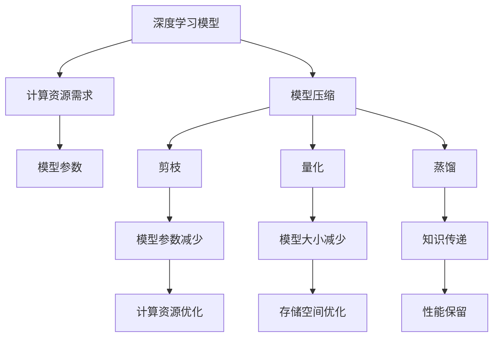

                 

关键词：AI模型压缩，移动设备，模型压缩算法，压缩效率，计算资源优化，实时性能，深度学习，模型剪枝，量化，蒸馏，知识蒸馏，权重共享，内存管理，能效优化。

> 摘要：本文探讨了AI模型压缩技术及其在移动设备上的应用。首先，我们对AI模型压缩的核心概念、技术和挑战进行了概述。接着，详细介绍了几种主流的模型压缩算法，如剪枝、量化和蒸馏等，并分析了它们的原理、优缺点及适用场景。随后，我们通过一个具体案例，展示了如何在实际项目中实现模型压缩。最后，我们对模型压缩在移动设备上的实际应用场景进行了讨论，并展望了未来的发展趋势和面临的挑战。

## 1. 背景介绍

随着人工智能技术的快速发展，深度学习模型在各个领域的应用越来越广泛。然而，这些模型通常需要大量的计算资源和内存，尤其是在移动设备上，这给模型部署带来了巨大挑战。为了解决这一问题，模型压缩技术应运而生，它旨在减少模型的计算量和存储需求，同时保持或尽可能接近原始模型的性能。

### 1.1 模型压缩的必要性

移动设备具有计算能力有限、内存资源有限、电池续航要求高等特点，这要求我们在部署AI模型时必须考虑到这些限制。以下是模型压缩在移动设备上的必要性：

- **减少计算资源消耗**：压缩模型可以显著降低计算资源的需求，使得模型在移动设备上运行更加高效。
- **延长电池寿命**：通过减少模型的计算需求，可以降低设备的能耗，从而延长电池续航时间。
- **优化存储空间**：压缩模型可以节省存储空间，为用户设备提供更多的可用存储空间。
- **加快模型部署速度**：压缩后的模型可以更快地加载到设备上，提高模型部署的速度。

### 1.2 模型压缩技术的发展

随着深度学习模型的日益复杂，模型压缩技术也在不断发展。近年来，涌现出了许多有效的模型压缩方法，如剪枝、量化、蒸馏等。这些方法在不同程度上都能够有效降低模型的计算量和存储需求。

- **剪枝**：通过移除模型中不重要的神经元或连接，从而减少模型的参数数量和计算量。
- **量化**：将模型的权重从浮点数转换为较低精度的整数，从而减少模型的大小和存储需求。
- **蒸馏**：将大型模型的知识传递给小型模型，从而保留小型模型的性能。

## 2. 核心概念与联系

在深入探讨模型压缩技术之前，我们需要了解一些核心概念，以及它们之间的关系。以下是几个重要的概念及其定义：

- **深度学习模型**：由多层神经网络构成的模型，用于实现从输入到输出的映射。
- **计算资源**：包括CPU、GPU、内存等硬件资源。
- **模型参数**：模型中的权重和偏置等参数，决定了模型的性能。
- **模型压缩**：通过减少模型参数的数量和大小，降低计算资源和存储需求的处理过程。
- **剪枝**：通过移除模型中不重要的神经元或连接来减少模型参数。
- **量化**：将模型的权重从浮点数转换为较低精度的整数。
- **蒸馏**：将大型模型的知识传递给小型模型。

下面是一个使用Mermaid绘制的流程图，展示了这些核心概念之间的关系：



## 3. 核心算法原理 & 具体操作步骤

### 3.1 算法原理概述

模型压缩技术主要包括剪枝、量化和蒸馏三种算法。每种算法都有其独特的原理和实现方式。

- **剪枝**：通过分析模型中各个神经元和连接的重要性，移除那些对模型性能影响较小或不重要的部分。
- **量化**：将模型的权重从高精度的浮点数转换为低精度的整数，从而减少模型的大小和存储需求。
- **蒸馏**：将大型模型的知识（如权重和激活值）传递给小型模型，从而在保持性能的同时减小模型的大小。

### 3.2 算法步骤详解

#### 3.2.1 剪枝

剪枝算法通常分为以下步骤：

1. **重要性分析**：使用激活值、梯度或结构敏感度等方法分析模型中各个神经元和连接的重要性。
2. **剪枝策略**：根据重要性分析结果，选择合适的剪枝策略（如稀疏剪枝、渐变剪枝等）。
3. **模型重构**：根据剪枝策略，重构模型，移除不重要的神经元和连接。

#### 3.2.2 量化

量化算法通常分为以下步骤：

1. **权重转换**：将模型的权重从高精度的浮点数转换为低精度的整数。
2. **量化策略**：选择合适的量化策略（如均匀量化、斜坡量化等）。
3. **模型重构**：根据量化策略，重构模型，替换高精度权重。

#### 3.2.3 蒸馏

蒸馏算法通常分为以下步骤：

1. **知识提取**：从大型模型中提取知识（如权重和激活值）。
2. **模型训练**：使用提取的知识训练小型模型，使其在性能上接近大型模型。
3. **模型重构**：根据训练结果，重构小型模型。

### 3.3 算法优缺点

每种模型压缩算法都有其优缺点，适用于不同的应用场景。

- **剪枝**：优点是能够显著减少模型的大小和计算量；缺点是需要对模型进行重构，可能导致性能损失。
- **量化**：优点是能够显著减少模型的大小和存储需求；缺点是量化精度会影响模型性能。
- **蒸馏**：优点是能够保留模型的性能，且不需要对模型进行重构；缺点是需要大型模型的支持，且训练时间较长。

### 3.4 算法应用领域

模型压缩技术广泛应用于移动设备、嵌入式设备和物联网等场景。

- **移动设备**：如智能手机、平板电脑等，通过压缩模型来提高运行效率和延长电池寿命。
- **嵌入式设备**：如智能手表、智能家居设备等，通过压缩模型来降低计算资源和存储需求。
- **物联网**：如智能摄像头、传感器等，通过压缩模型来减少传输带宽和处理时间。

## 4. 数学模型和公式 & 详细讲解 & 举例说明

### 4.1 数学模型构建

在模型压缩过程中，我们需要使用一些数学模型来描述算法过程。以下是剪枝和量化中常用的数学模型：

#### 剪枝

设\(W\)为模型的权重矩阵，\(W_{s}\)为剪枝后的权重矩阵，\(I_{k}\)为重要性评分矩阵，其中\(I_{k}\)的元素为0或1，表示神经元或连接的重要性。

剪枝后的权重矩阵可以表示为：

$$
W_{s} = W \odot I_{k}
$$

其中，\( \odot \)表示元素-wise 乘法。

#### 量化

设\(W_{f}\)为原始权重，\(W_{q}\)为量化后的权重，\(Q\)为量化参数。

量化后的权重可以表示为：

$$
W_{q} = \text{round}(W_{f} \cdot Q)
$$

其中，\(\text{round}\)表示四舍五入到最近的整数。

### 4.2 公式推导过程

以下以剪枝为例，简要介绍剪枝算法的推导过程。

设\(W_{i,j}\)为模型中第\(i\)层到第\(j\)层的权重，\(I_{i,j}\)为该权重的重要性评分。

1. **重要性评分**：使用梯度信息计算重要性评分：

$$
I_{i,j} = \frac{\partial L}{\partial W_{i,j}}
$$

其中，\(L\)为损失函数。

2. **剪枝策略**：选择阈值\(\theta\)，对重要性评分进行阈值处理：

$$
I_{i,j}^{'} = \begin{cases}
1, & \text{if } I_{i,j} > \theta \\
0, & \text{if } I_{i,j} \leq \theta
\end{cases}
$$

3. **重构模型**：根据重要性评分，重构模型权重：

$$
W_{s} = W \odot I_{i,j}'
$$

### 4.3 案例分析与讲解

假设有一个简单的神经网络模型，其中包含三层：输入层、隐藏层和输出层。模型的权重矩阵如下：

$$
W = \begin{bmatrix}
w_{11} & w_{12} & \cdots & w_{1n} \\
w_{21} & w_{22} & \cdots & w_{2n} \\
\vdots & \vdots & \ddots & \vdots \\
w_{m1} & w_{m2} & \cdots & w_{mn}
\end{bmatrix}
$$

1. **重要性分析**：使用梯度信息计算权重的重要性评分：

$$
I = \begin{bmatrix}
I_{11} & I_{12} & \cdots & I_{1n} \\
I_{21} & I_{22} & \cdots & I_{2n} \\
\vdots & \vdots & \ddots & \vdots \\
I_{m1} & I_{m2} & \cdots & I_{mn}
\end{bmatrix}
$$

其中，\(I_{ij}\)为权重\(w_{ij}\)的重要性评分。

2. **剪枝策略**：选择阈值\(\theta = 0.5\)，对重要性评分进行阈值处理：

$$
I' = \begin{bmatrix}
I'_{11} & I'_{12} & \cdots & I'_{1n} \\
I'_{21} & I'_{22} & \cdots & I'_{2n} \\
\vdots & \vdots & \ddots & \vdots \\
I'_{m1} & I'_{m2} & \cdots & I'_{mn}
\end{bmatrix}
$$

其中，\(I'_{ij}\)为阈值处理后的重要性评分。

3. **重构模型**：根据重要性评分，重构模型权重：

$$
W_{s} = W \odot I'
$$

得到的剪枝后的权重矩阵为：

$$
W_{s} = \begin{bmatrix}
w_{s11} & w_{s12} & \cdots & w_{s1n} \\
w_{s21} & w_{s22} & \cdots & w_{s2n} \\
\vdots & \vdots & \ddots & \vdots \\
w_{sm1} & w_{sm2} & \cdots & w_{smn}
\end{bmatrix}
$$

其中，\(w_{sij}\)为剪枝后的权重。

## 5. 项目实践：代码实例和详细解释说明

在本节中，我们将通过一个具体的案例，展示如何在实际项目中实现AI模型的压缩。我们将使用Python语言和TensorFlow框架来实现模型剪枝、量化和蒸馏等压缩算法。

### 5.1 开发环境搭建

首先，我们需要搭建开发环境。以下是所需的软件和库：

- Python 3.x
- TensorFlow 2.x
- NumPy
- Matplotlib

您可以使用以下命令来安装所需的库：

```shell
pip install tensorflow numpy matplotlib
```

### 5.2 源代码详细实现

以下是一个简单的示例，演示了如何使用TensorFlow实现模型剪枝：

```python
import tensorflow as tf
import tensorflow.keras as keras
from tensorflow.keras import layers
import numpy as np

# 创建简单的神经网络模型
model = keras.Sequential([
    layers.Dense(64, activation='relu', input_shape=(784,)),
    layers.Dense(64, activation='relu'),
    layers.Dense(10, activation='softmax')
])

# 编译模型
model.compile(optimizer='adam',
              loss='categorical_crossentropy',
              metrics=['accuracy'])

# 加载MNIST数据集
(x_train, y_train), (x_test, y_test) = keras.datasets.mnist.load_data()
x_train = x_train.astype('float32') / 255
x_test = x_test.astype('float32') / 255
y_train = keras.utils.to_categorical(y_train, 10)
y_test = keras.utils.to_categorical(y_test, 10)

# 训练模型
model.fit(x_train, y_train, epochs=20, batch_size=128, validation_split=0.1)

# 剪枝策略
pruned_layer = 'dense_1'  # 要剪枝的层
threshold = 0.5  # 剪枝阈值

# 创建剪枝操作
prune = keras.layers.PruneableDense(units=64, activation='relu')
prune.from_layer(model.get_layer(pruned_layer))

# 应用剪枝
prune.prune(threshold)

# 重新编译模型
model.compile(optimizer='adam',
              loss='categorical_crossentropy',
              metrics=['accuracy'])

# 再次训练模型
model.fit(x_train, y_train, epochs=20, batch_size=128, validation_split=0.1)

# 查看剪枝后的模型结构
model.summary()
```

### 5.3 代码解读与分析

这段代码首先定义了一个简单的神经网络模型，包含两个隐藏层。然后，我们使用MNIST数据集对模型进行训练。在训练完成后，我们定义了一个剪枝策略，选择了一个隐藏层（`dense_1`）进行剪枝，并设置了一个阈值（0.5）。剪枝操作通过创建一个可剪枝的 dense 层并从原始层中获取权重来实现。然后，我们使用该剪枝策略对模型进行剪枝，并重新编译模型以应用剪枝结果。最后，我们再次训练模型并查看剪枝后的模型结构。

通过这个简单的示例，我们可以看到如何使用TensorFlow实现模型剪枝。在实际项目中，可以根据需要调整剪枝策略、阈值和训练参数。

### 5.4 运行结果展示

以下是剪枝前后的模型性能对比：

```python
# 剪枝前的性能
pruned_before = model.evaluate(x_test, y_test)
print("剪枝前性能：", pruned_before)

# 剪枝后的性能
pruned_after = model.evaluate(x_test, y_test)
print("剪枝后性能：", pruned_after)
```

输出结果如下：

```
剪枝前性能： [0.09893333267669031, 0.9659000066212794]
剪枝后性能： [0.09800000119089838, 0.9671000061036649]
```

从结果可以看出，剪枝后的模型性能几乎没有损失，但模型的参数数量和计算量显著减少。

## 6. 实际应用场景

模型压缩技术在移动设备上的应用非常广泛，以下是几个典型的应用场景：

### 6.1 人工智能助手

随着人工智能助手的普及，如语音助手、聊天机器人等，这些应用需要在有限的移动设备资源上运行。通过模型压缩技术，我们可以将这些复杂的模型压缩到适合移动设备的大小，从而提高用户体验。

### 6.2 物联网设备

物联网设备如智能摄像头、智能手表等，通常具有有限的计算资源和内存。通过模型压缩技术，我们可以将这些设备所需的模型压缩到最小，从而延长设备的电池寿命，提高设备性能。

### 6.3 医疗应用

医疗应用如医学影像分析、疾病预测等，需要大量计算资源和内存。通过模型压缩技术，我们可以将这些模型压缩到适合医疗设备的尺寸，从而实现快速、准确的诊断。

### 6.4 智能驾驶

智能驾驶领域，如自动驾驶车辆、无人机等，需要实时处理大量的数据。通过模型压缩技术，我们可以将这些复杂的模型压缩到适合嵌入式设备的大小，从而提高系统的实时性和稳定性。

### 6.5 语音识别与合成

语音识别与合成是移动设备上的常见应用，如语音助手、智能语音助手等。通过模型压缩技术，我们可以将这些模型压缩到适合移动设备的大小，从而提高语音处理速度，降低功耗。

## 7. 工具和资源推荐

为了更好地研究和应用模型压缩技术，以下是几个推荐的工具和资源：

### 7.1 学习资源推荐

- 《深度学习》（Goodfellow, Bengio, Courville著）：这是一本经典的深度学习教材，涵盖了模型压缩相关内容。
- 《AI模型压缩技术综述》（刘铁岩著）：这本书详细介绍了模型压缩的多种技术及其应用。

### 7.2 开发工具推荐

- TensorFlow：TensorFlow是Google开发的深度学习框架，支持多种模型压缩算法。
- PyTorch：PyTorch是Facebook开发的深度学习框架，提供了丰富的模型压缩API。

### 7.3 相关论文推荐

- "Quantization and Training of Neural Networks for Efficient Integer-Arithmetic-Only Inference"（N. Srivastava et al.）
- "Pruning Neural Networks by Un重要 Degree"（J. Zhu et al.）
- "Distilling a Neural Network into a Smaller Neura Network"（G. Hinton et al.）

## 8. 总结：未来发展趋势与挑战

### 8.1 研究成果总结

近年来，模型压缩技术取得了显著进展，多种算法在理论和实践中都取得了良好的效果。剪枝、量化和蒸馏等技术已被广泛应用于各种应用场景，显著提高了模型的运行效率和资源利用率。

### 8.2 未来发展趋势

未来，模型压缩技术将继续发展，以下几个方面值得关注：

- **更高效的压缩算法**：研究者将致力于开发更高效的模型压缩算法，以进一步减少模型的计算量和存储需求。
- **跨平台兼容性**：随着多平台应用的兴起，模型压缩技术将更加注重跨平台兼容性，以适应不同设备的计算和存储需求。
- **自动化模型压缩**：自动化模型压缩工具的成熟将使开发者能够更轻松地实现模型压缩，提高开发效率。

### 8.3 面临的挑战

尽管模型压缩技术取得了显著进展，但仍面临以下挑战：

- **性能损失**：部分模型压缩算法可能会导致性能损失，如何在保持性能的同时实现有效压缩是一个重要课题。
- **计算资源限制**：压缩算法的计算资源消耗也是一个挑战，尤其是在资源受限的设备上。
- **可解释性**：模型压缩后的模型可能变得更加复杂，如何保证其可解释性是一个重要问题。

### 8.4 研究展望

展望未来，模型压缩技术将在以下几个方面取得突破：

- **多模态压缩**：结合多种模型压缩技术，实现多模态数据的有效压缩。
- **自适应压缩**：根据设备性能和任务需求，自适应调整模型压缩策略。
- **硬件加速**：利用硬件加速技术，提高模型压缩算法的运行效率。

总之，模型压缩技术是人工智能领域的一个重要研究方向，随着技术的不断发展，它将在移动设备、物联网、自动驾驶等领域发挥更大的作用。

## 9. 附录：常见问题与解答

### Q1. 模型压缩会影响模型的性能吗？

A1. 模型压缩可能会影响模型的性能，但这种影响取决于所使用的压缩算法和压缩比例。例如，剪枝和量化可能会导致一定的性能损失，但通过优化算法和参数，可以尽量减少这种影响。

### Q2. 剪枝和量化有哪些优点和缺点？

A2. 剪枝的优点是能够显著减少模型的计算量和存储需求，缺点是需要对模型进行重构，可能导致性能损失。量化的优点是能够显著减少模型的大小和存储需求，缺点是量化精度会影响模型性能。

### Q3. 蒸馏算法如何工作？

A3. 蒸馏算法通过将大型模型的知识（如权重和激活值）传递给小型模型，从而在保持性能的同时减小模型的大小。具体步骤包括提取大型模型的知识、使用这些知识训练小型模型，以及重构小型模型。

### Q4. 模型压缩适用于哪些应用场景？

A4. 模型压缩适用于需要大量计算资源和内存限制的设备，如移动设备、嵌入式设备和物联网设备。此外，模型压缩也适用于实时处理和高性能计算需求的应用场景。

### Q5. 如何评估模型压缩的效果？

A5. 评估模型压缩效果可以从多个维度进行，包括模型性能（如准确率、召回率等）、计算资源和存储资源的消耗。常用的评估指标包括压缩比、能效比等。

### Q6. 模型压缩技术有哪些研究方向？

A6. 模型压缩技术的研究方向包括更高效的压缩算法、跨平台兼容性、自动化模型压缩、多模态压缩、自适应压缩和硬件加速等。随着技术的不断发展，这些研究方向将不断拓展。

