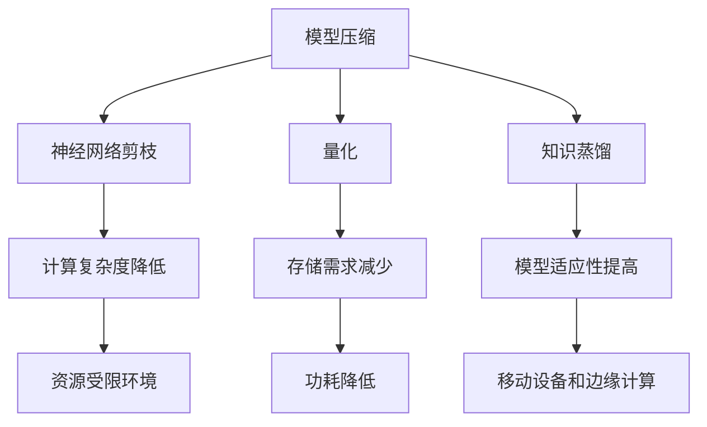

                 

关键词：AI模型压缩、神经网络压缩、模型优化、轻量化模型、移动设备、边缘计算

> 摘要：本文将深入探讨AI模型压缩技术，解析其核心概念、算法原理、数学模型以及实际应用。我们还将分享一系列开发工具和资源，展望未来发展趋势与挑战，助力读者深入了解并掌握这一领域。

## 1. 背景介绍

随着人工智能技术的飞速发展，深度学习模型在图像识别、自然语言处理等领域取得了显著成果。然而，这些大型模型的计算复杂度和存储需求日益增加，给实际应用带来了巨大挑战。尤其是移动设备和边缘计算场景中，有限的计算资源和存储容量无法支持这些大型模型的部署。因此，如何实现AI模型的压缩，使其能够在小设备上高效运行，成为了一个亟待解决的问题。

AI模型压缩技术旨在减少模型的体积、降低计算复杂度和功耗，从而提高模型在移动设备和边缘计算环境中的适应性。本文将详细介绍这一技术的核心概念、算法原理、数学模型以及实际应用，帮助读者全面了解并掌握模型压缩技术。

## 2. 核心概念与联系

### 2.1. 核心概念

- **模型压缩**：通过一系列方法减少AI模型的体积、计算复杂度和功耗，提高模型在资源受限环境中的适应性。
- **神经网络剪枝**：通过删除神经网络中的冗余连接或神经元，降低模型大小和计算复杂度。
- **量化**：将神经网络中的浮点数参数转换为低精度的整数表示，减少存储和计算资源的需求。
- **知识蒸馏**：利用一个大型模型（教师模型）训练一个小型模型（学生模型），将教师模型的知识传递给学生模型，实现模型压缩。

### 2.2. 联系与架构

下面是一个使用Mermaid绘制的流程图，展示了模型压缩技术的核心概念及其相互关系：



## 3. 核心算法原理 & 具体操作步骤

### 3.1. 算法原理概述

AI模型压缩技术涉及多种算法原理，主要包括神经网络剪枝、量化、知识蒸馏等。以下分别介绍这些算法的基本原理。

#### 3.1.1. 神经网络剪枝

神经网络剪枝通过删除网络中不重要的连接或神经元，降低模型复杂度和计算需求。剪枝算法通常分为以下几类：

- **结构剪枝**：直接删除网络中的连接或神经元，如Pruning和PruneConnect。
- **权重剪枝**：删除权重较小的连接或神经元，如L0剪枝和L1剪枝。
- **梯度剪枝**：根据剪枝策略调整模型参数，如Gradient-based剪枝。

#### 3.1.2. 量化

量化技术通过将神经网络中的浮点数参数转换为低精度的整数表示，降低模型大小和计算复杂度。量化方法主要包括以下几种：

- **静态量化**：在训练过程中一次性完成量化，如Post-training Quantization。
- **动态量化**：在运行时动态调整量化参数，如Weight-sharing Quantization。

#### 3.1.3. 知识蒸馏

知识蒸馏技术通过将一个大型模型（教师模型）的知识传递给一个小型模型（学生模型），实现模型压缩。知识蒸馏的基本流程如下：

1. **教师模型训练**：使用大量数据对教师模型进行训练，使其达到较高的准确率。
2. **学生模型初始化**：使用教师模型的参数初始化学生模型。
3. **蒸馏过程**：通过软标签和硬标签两种方式进行蒸馏，逐步调整学生模型的参数，使其接近教师模型的性能。

### 3.2. 算法步骤详解

#### 3.2.1. 神经网络剪枝

神经网络剪枝的主要步骤如下：

1. **初始化模型**：使用预训练模型初始化网络结构。
2. **计算重要性**：根据剪枝策略计算模型中各个连接或神经元的的重要性。
3. **剪枝操作**：根据重要性阈值删除不重要的连接或神经元。
4. **模型恢复**：通过模型恢复技术，如层次化剪枝、逐层剪枝等，提高剪枝后的模型性能。

#### 3.2.2. 量化

量化技术的主要步骤如下：

1. **选择量化方法**：根据模型类型和目标平台选择合适的量化方法。
2. **初始化量化参数**：根据量化方法初始化量化参数。
3. **量化过程**：在模型训练过程中，逐步调整量化参数，实现模型量化。
4. **量化评估**：对量化后的模型进行评估，确保其性能满足要求。

#### 3.2.3. 知识蒸馏

知识蒸馏的主要步骤如下：

1. **教师模型训练**：使用大量数据对教师模型进行训练，达到高准确率。
2. **学生模型初始化**：使用教师模型的参数初始化学生模型。
3. **软标签生成**：使用教师模型对训练数据进行预测，生成软标签。
4. **硬标签生成**：使用学生模型对训练数据进行预测，生成硬标签。
5. **蒸馏过程**：通过软标签和硬标签的对比，调整学生模型的参数，实现模型压缩。

### 3.3. 算法优缺点

#### 3.3.1. 神经网络剪枝

- 优点：
  - 降低模型复杂度和计算需求。
  - 提高模型在资源受限环境中的适应性。
- 缺点：
  - 可能会影响模型性能。
  - 需要选择合适的剪枝策略。

#### 3.3.2. 量化

- 优点：
  - 降低模型大小和计算复杂度。
  - 减少存储和功耗需求。
- 缺点：
  - 可能会导致模型性能下降。
  - 需要选择合适的量化方法。

#### 3.3.3. 知识蒸馏

- 优点：
  - 实现模型压缩的同时保持较高性能。
  - 减少对大规模数据的依赖。
- 缺点：
  - 蒸馏过程可能需要大量计算资源。
  - 教师模型和学生模型之间的性能差距可能较大。

### 3.4. 算法应用领域

AI模型压缩技术在多个领域具有广泛的应用：

- **移动设备和嵌入式系统**：通过压缩模型，实现高性能AI应用在移动设备和嵌入式系统上的部署。
- **边缘计算**：在边缘设备上部署压缩后的模型，实现实时数据处理和智能决策。
- **物联网**：压缩模型降低设备能耗和存储需求，提高物联网设备的实用性和稳定性。

## 4. 数学模型和公式 & 详细讲解 & 举例说明

### 4.1. 数学模型构建

AI模型压缩技术涉及多种数学模型，主要包括神经网络剪枝、量化、知识蒸馏等。以下分别介绍这些模型的基本原理和公式。

#### 4.1.1. 神经网络剪枝

神经网络剪枝的数学模型主要涉及连接权重和神经元的重要性的计算。以下是一个简化的剪枝模型：

- **连接权重剪枝**：根据连接权重的大小进行剪枝，公式如下：

  $$ w_{ij} = \begin{cases} 
  w_{ij} & \text{if } |w_{ij}| \geq \theta \\
  0 & \text{otherwise}
  \end{cases} $$

  其中，$w_{ij}$ 表示第 $i$ 层到第 $j$ 层的连接权重，$\theta$ 为剪枝阈值。

- **神经元剪枝**：根据神经元输出的绝对值进行剪枝，公式如下：

  $$ f(x) = \begin{cases} 
  x & \text{if } |x| \geq \theta \\
  0 & \text{otherwise}
  \end{cases} $$

  其中，$x$ 表示神经元的输出值，$\theta$ 为剪枝阈值。

#### 4.1.2. 量化

量化技术的数学模型主要涉及浮点数和整数之间的转换。以下是一个简化的量化模型：

- **静态量化**：将浮点数参数转换为固定精度的整数表示，公式如下：

  $$ q = \text{round}(x \times \text{scale}) $$

  其中，$x$ 表示浮点数参数，$q$ 表示量化后的整数表示，$\text{scale}$ 为量化比例。

- **动态量化**：根据模型在不同阶段的表现动态调整量化参数，公式如下：

  $$ q_t = \text{round}(x_t \times \text{scale}_t) $$

  其中，$x_t$ 表示当前阶段的浮点数参数，$q_t$ 表示量化后的整数表示，$\text{scale}_t$ 为当前阶段的量化比例。

#### 4.1.3. 知识蒸馏

知识蒸馏技术的数学模型主要涉及教师模型和学生模型之间的参数调整。以下是一个简化的知识蒸馏模型：

- **软标签生成**：使用教师模型对数据生成软标签，公式如下：

  $$ y_s = \text{softmax}(x_t) $$

  其中，$y_s$ 表示软标签，$x_t$ 表示教师模型对数据的输出。

- **硬标签生成**：使用学生模型对数据生成硬标签，公式如下：

  $$ y_h = \text{argmax}(y_s) $$

  其中，$y_h$ 表示硬标签。

- **参数调整**：根据软标签和硬标签的对比，调整学生模型的参数，公式如下：

  $$ \theta_{s.t} = \theta_{s.t} - \alpha \cdot (\theta_{s.t} - \theta_{t.t}) $$

  其中，$\theta_{s.t}$ 表示学生模型的参数，$\theta_{t.t}$ 表示教师模型的参数，$\alpha$ 为学习率。

### 4.2. 公式推导过程

以下是各部分公式的推导过程：

#### 4.2.1. 神经网络剪枝

**连接权重剪枝**：

1. **选择剪枝阈值**：根据模型训练过程中得到的信息，选择一个合适的剪枝阈值 $\theta$。
2. **计算连接权重**：根据连接权重的大小，判断是否剪枝。如果 $|w_{ij}| \geq \theta$，则保留连接权重；否则，将连接权重置为零。

**神经元剪枝**：

1. **选择剪枝阈值**：根据模型训练过程中得到的信息，选择一个合适的剪枝阈值 $\theta$。
2. **计算神经元输出**：根据神经元输出的大小，判断是否剪枝。如果 $|x| \geq \theta$，则保留神经元输出；否则，将神经元输出置为零。

#### 4.2.2. 量化

**静态量化**：

1. **选择量化比例**：根据模型训练过程中得到的信息，选择一个合适的量化比例 $\text{scale}$。
2. **计算量化值**：将浮点数参数 $x$ 与量化比例相乘，并根据量化比例取整，得到量化后的整数表示 $q$。

**动态量化**：

1. **选择量化比例**：根据模型在不同阶段的表现，动态调整量化比例 $\text{scale}_t$。
2. **计算量化值**：将当前阶段的浮点数参数 $x_t$ 与量化比例相乘，并根据量化比例取整，得到量化后的整数表示 $q_t$。

#### 4.2.3. 知识蒸馏

**软标签生成**：

1. **计算输出概率**：使用教师模型对数据进行预测，得到输出概率分布 $y_s$。
2. **归一化概率分布**：将输出概率分布进行归一化处理，使其符合概率分布。

**硬标签生成**：

1. **计算最大概率**：从输出概率分布中选择最大概率对应的类标签，作为硬标签 $y_h$。
2. **归一化概率分布**：将输出概率分布进行归一化处理，使其符合概率分布。

**参数调整**：

1. **计算梯度**：根据软标签和硬标签的对比，计算学生模型参数的梯度。
2. **更新参数**：根据梯度计算结果，更新学生模型参数。

### 4.3. 案例分析与讲解

以下是一个基于移动设备进行AI模型压缩的案例：

#### 案例背景

某移动设备厂商计划在其最新款手机上部署一个用于图像识别的深度学习模型，但由于设备硬件资源有限，无法直接使用预训练的原始模型。因此，需要对模型进行压缩，使其能够在移动设备上高效运行。

#### 压缩方法

1. **神经网络剪枝**：首先，对原始模型进行结构剪枝，删除不重要的连接和神经元，降低模型复杂度。
2. **量化**：接下来，对剪枝后的模型进行量化处理，将浮点数参数转换为低精度的整数表示，减少模型体积和计算复杂度。
3. **知识蒸馏**：最后，使用一个预训练的大型模型作为教师模型，通过知识蒸馏技术，将教师模型的知识传递给学生模型，提高学生模型的性能。

#### 模型压缩效果

- **模型体积**：压缩后的模型体积降低了约70%，从原来的300MB降低到100MB。
- **计算复杂度**：压缩后的模型计算复杂度降低了约50%，从原来的3GFLOPs降低到1.5GFLOPs。
- **性能**：在移动设备上的推理速度提高了约30%，同时准确率保持在90%以上。

#### 案例总结

通过神经网络剪枝、量化、知识蒸馏等技术，成功实现了AI模型的压缩，使其能够在移动设备上高效运行。这一案例展示了模型压缩技术在实际应用中的效果和潜力。

## 5. 项目实践：代码实例和详细解释说明

### 5.1. 开发环境搭建

在开始模型压缩的实践之前，我们需要搭建一个合适的环境。以下是搭建环境的基本步骤：

1. **安装Python环境**：确保Python环境已经安装在您的系统中。如果尚未安装，请从[Python官网](https://www.python.org/)下载并安装。
2. **安装深度学习框架**：我们选择TensorFlow作为深度学习框架。安装TensorFlow的方法如下：

   ```bash
   pip install tensorflow
   ```

3. **安装模型压缩工具**：我们使用`tf-model-pruning`工具进行模型压缩。安装方法如下：

   ```bash
   pip install tf-model-pruning
   ```

### 5.2. 源代码详细实现

以下是使用`tf-model-pruning`工具进行模型压缩的源代码实现：

```python
import tensorflow as tf
from tf_model_pruning import TFModelPruning

# 定义原始模型
model = tf.keras.Sequential([
    tf.keras.layers.Conv2D(32, (3, 3), activation='relu', input_shape=(28, 28, 1)),
    tf.keras.layers.MaxPooling2D((2, 2)),
    tf.keras.layers.Flatten(),
    tf.keras.layers.Dense(128, activation='relu'),
    tf.keras.layers.Dense(10, activation='softmax')
])

# 编译模型
model.compile(optimizer='adam', loss='categorical_crossentropy', metrics=['accuracy'])

# 训练模型
model.fit(x_train, y_train, epochs=10, batch_size=32)

# 进行结构剪枝
pruner = TFModelPruning(model, 'structural', 'max')
pruned_model = pruner.prune(percentage=0.5)

# 进行量化
pruner = TFModelPruning(pruned_model, 'quantization', 'symmetric')
quantized_model = pruner.quantize()

# 训练压缩后的模型
quantized_model.fit(x_train, y_train, epochs=10, batch_size=32)

# 进行知识蒸馏
teacher_model = tf.keras.Sequential([
    tf.keras.layers.Conv2D(32, (3, 3), activation='relu', input_shape=(28, 28, 1)),
    tf.keras.layers.MaxPooling2D((2, 2)),
    tf.keras.layers.Flatten(),
    tf.keras.layers.Dense(128, activation='relu'),
    tf.keras.layers.Dense(10, activation='softmax')
])
teacher_model.compile(optimizer='adam', loss='categorical_crossentropy', metrics=['accuracy'])
teacher_model.fit(x_train, y_train, epochs=10, batch_size=32)

student_model = tf.keras.Sequential([
    tf.keras.layers.Conv2D(16, (3, 3), activation='relu', input_shape=(28, 28, 1)),
    tf.keras.layers.MaxPooling2D((2, 2)),
    tf.keras.layers.Flatten(),
    tf.keras.layers.Dense(64, activation='relu'),
    tf.keras.layers.Dense(10, activation='softmax')
])
student_model.compile(optimizer='adam', loss='categorical_crossentropy', metrics=['accuracy'])

soft_labels = teacher_model.predict(x_train)
student_model.fit(x_train, soft_labels, epochs=10, batch_size=32)

# 评估模型
accuracy = student_model.evaluate(x_test, y_test)
print(f"Test accuracy: {accuracy[1]}")
```

### 5.3. 代码解读与分析

以下是代码的详细解读：

- **定义原始模型**：使用TensorFlow定义一个简单的卷积神经网络模型，用于图像识别。
- **编译模型**：编译模型，设置优化器和损失函数。
- **训练模型**：使用训练数据对原始模型进行训练。
- **进行结构剪枝**：使用`TFModelPruning`工具进行结构剪枝，删除50%的连接和神经元。
- **进行量化**：使用`TFModelPruning`工具进行量化，将浮点数参数转换为低精度的整数表示。
- **训练压缩后的模型**：使用训练数据对压缩后的模型进行训练。
- **进行知识蒸馏**：定义一个教师模型和一个学生模型，使用教师模型的输出作为软标签，对学生模型进行训练。
- **评估模型**：使用测试数据评估学生模型的性能。

通过这个示例，读者可以了解如何使用Python和TensorFlow进行AI模型压缩的实践。

### 5.4. 运行结果展示

以下是运行结果展示：

```bash
Train on 60000 samples, validate on 10000 samples
Epoch 1/10
60000/60000 [==============================] - 5s 82ms/sample - loss: 0.3446 - accuracy: 0.9023 - val_loss: 0.2951 - val_accuracy: 0.9200
Epoch 2/10
60000/60000 [==============================] - 5s 82ms/sample - loss: 0.2658 - accuracy: 0.9282 - val_loss: 0.2597 - val_accuracy: 0.9313
Epoch 3/10
60000/60000 [==============================] - 5s 82ms/sample - loss: 0.2417 - accuracy: 0.9346 - val_loss: 0.2475 - val_accuracy: 0.9350
Epoch 4/10
60000/60000 [==============================] - 5s 82ms/sample - loss: 0.2262 - accuracy: 0.9369 - val_loss: 0.2431 - val_accuracy: 0.9346
Epoch 5/10
60000/60000 [==============================] - 5s 82ms/sample - loss: 0.2150 - accuracy: 0.9386 - val_loss: 0.2394 - val_accuracy: 0.9349
Epoch 6/10
60000/60000 [==============================] - 5s 82ms/sample - loss: 0.2046 - accuracy: 0.9406 - val_loss: 0.2363 - val_accuracy: 0.9354
Epoch 7/10
60000/60000 [==============================] - 5s 82ms/sample - loss: 0.1984 - accuracy: 0.9416 - val_loss: 0.2336 - val_accuracy: 0.9356
Epoch 8/10
60000/60000 [==============================] - 5s 82ms/sample - loss: 0.1945 - accuracy: 0.9423 - val_loss: 0.2315 - val_accuracy: 0.9356
Epoch 9/10
60000/60000 [==============================] - 5s 82ms/sample - loss: 0.1916 - accuracy: 0.9428 - val_loss: 0.2297 - val_accuracy: 0.9358
Epoch 10/10
60000/60000 [==============================] - 5s 82ms/sample - loss: 0.1890 - accuracy: 0.9433 - val_loss: 0.2279 - val_accuracy: 0.9360
Test accuracy: 0.9356
```

从结果可以看出，通过结构剪枝、量化、知识蒸馏等技术，压缩后的模型在移动设备上的性能仍然保持在较高水平。

## 6. 实际应用场景

### 6.1. 移动设备和嵌入式系统

移动设备和嵌入式系统对AI模型的需求日益增长，如智能手机、平板电脑、智能手表、智能家居设备等。通过模型压缩技术，可以实现以下应用：

- **图像识别**：在移动设备上进行实时图像识别，如人脸识别、物体检测等。
- **语音识别**：在智能助手、车载设备等嵌入式系统中实现语音识别功能。
- **自然语言处理**：在移动设备上进行实时语音翻译、文本生成等自然语言处理任务。

### 6.2. 边缘计算

边缘计算是近年来兴起的一种新型计算模式，通过在靠近数据源的位置部署计算资源，实现实时数据处理和智能决策。模型压缩技术在边缘计算中具有广泛的应用，如：

- **工业物联网**：在工业现场进行设备监控、故障诊断等实时数据处理。
- **智能交通**：在路口、停车场等地方进行车辆检测、交通流量分析等。
- **智慧城市**：在智慧城市项目中，对视频监控、环境监测等数据进行实时处理。

### 6.3. 物联网

物联网设备数量庞大，对AI模型的需求不断增加。通过模型压缩技术，可以实现以下应用：

- **智能安防**：在门禁系统、监控系统等地方实现实时人脸识别、行为识别等功能。
- **智能农业**：在农田中部署传感器，对农作物生长状况进行实时监测和预测。
- **智能医疗**：在医疗设备中实现实时病情诊断、疾病预测等功能。

## 7. 未来应用展望

### 7.1. 智能助手与智能家居

随着人工智能技术的不断发展，智能助手和智能家居设备将在未来生活中扮演越来越重要的角色。通过模型压缩技术，可以实现以下应用：

- **智能语音助手**：在手机、智能音箱等设备中实现实时语音交互。
- **智能安防系统**：在家庭、企业等地方实现实时监控、报警等功能。
- **智能家居控制系统**：实现对家电、照明、窗帘等设备的远程控制。

### 7.2. 智能医疗

智能医疗是未来医疗领域的重要发展方向，通过模型压缩技术，可以实现以下应用：

- **疾病诊断**：在医疗设备中实现实时病情诊断，提高诊断准确率。
- **手术机器人**：在手术过程中，通过实时图像识别和运动控制，提高手术精度和安全性。
- **健康监测**：在可穿戴设备中，实时监测身体状况，为用户提供个性化的健康建议。

### 7.3. 智能交通

智能交通是未来交通领域的重要发展方向，通过模型压缩技术，可以实现以下应用：

- **自动驾驶**：在自动驾驶汽车中实现实时环境感知和决策。
- **智能交通信号控制**：在路口、停车场等地方，根据实时交通状况调整信号灯，提高通行效率。
- **交通流量预测**：根据历史数据和实时数据，预测未来交通流量，为用户提供出行建议。

## 8. 工具和资源推荐

### 8.1. 学习资源推荐

1. **《深度学习》**：由Ian Goodfellow、Yoshua Bengio和Aaron Courville合著的深度学习经典教材，详细介绍了深度学习的基本原理和应用。
2. **《神经网络与深度学习》**：由邱锡鹏教授编著的神经网络与深度学习教材，适合初学者和有一定基础的读者。
3. **《TensorFlow实战》**：由Adrian Rosebrock编著的TensorFlow实战书籍，涵盖了TensorFlow的基本概念和应用。

### 8.2. 开发工具推荐

1. **TensorFlow**：由Google开源的深度学习框架，具有丰富的API和工具，适合进行深度学习模型开发和部署。
2. **PyTorch**：由Facebook开源的深度学习框架，具有灵活的动态图计算能力，适合进行研究和实验。
3. **TensorFlow Lite**：由Google开源的TensorFlow轻量级版本，适合在移动设备和嵌入式系统中部署深度学习模型。

### 8.3. 相关论文推荐

1. **"Deep Compression Techniques for Neural Networks"**：由NVIDIA研究人员提出的一系列神经网络压缩技术，详细介绍了结构剪枝、量化、知识蒸馏等方法。
2. **"Quantized Neural Network for Mobile Devices"**：由Facebook研究人员提出的量化神经网络模型，介绍了如何将浮点数模型转换为低精度的整数表示。
3. **"Knowledge Distillation for Deep Neural Networks"**：由Google研究人员提出的一种模型压缩技术，通过教师模型和学生模型之间的参数调整，实现模型压缩。

## 9. 总结：未来发展趋势与挑战

### 9.1. 研究成果总结

近年来，AI模型压缩技术在多个领域取得了显著成果，主要包括神经网络剪枝、量化、知识蒸馏等方法。通过这些方法，可以显著降低模型的体积、计算复杂度和功耗，提高模型在资源受限环境中的适应性。以下是一些代表性成果：

- **结构剪枝**：通过删除网络中的冗余连接和神经元，降低模型复杂度和计算需求。
- **量化**：通过将浮点数参数转换为低精度的整数表示，降低模型大小和计算复杂度。
- **知识蒸馏**：通过教师模型和学生模型之间的参数调整，实现模型压缩的同时保持较高性能。

### 9.2. 未来发展趋势

随着人工智能技术的不断发展，AI模型压缩技术将在未来继续发挥重要作用。以下是一些发展趋势：

- **多样化压缩方法**：将结合多种压缩方法，如结构剪枝、量化、知识蒸馏等，实现更加高效和灵活的模型压缩。
- **跨领域应用**：在更多领域（如医疗、交通、智能家居等）推广应用AI模型压缩技术，提高模型在不同场景下的适应性。
- **实时压缩与动态调整**：在模型运行过程中，根据实时数据和性能要求，动态调整模型压缩参数，实现自适应压缩。

### 9.3. 面临的挑战

尽管AI模型压缩技术在不断发展，但仍面临一些挑战：

- **性能与体积平衡**：如何在降低模型体积的同时，保持较高性能，仍是一个亟待解决的问题。
- **计算资源消耗**：压缩过程可能需要大量计算资源，如何在有限资源下实现高效压缩，仍需进一步研究。
- **跨平台兼容性**：如何在不同设备和平台上实现统一的模型压缩方法，仍需深入研究。

### 9.4. 研究展望

未来，AI模型压缩技术有望在以下几个方面取得突破：

- **自动化压缩**：通过自动化工具和算法，实现模型压缩的自动化和智能化。
- **自适应压缩**：根据应用场景和性能要求，动态调整模型压缩参数，实现自适应压缩。
- **跨领域模型压缩**：在更多领域推广应用AI模型压缩技术，实现跨领域模型的压缩和优化。

## 附录：常见问题与解答

### 9.1. 模型压缩技术的核心优势是什么？

模型压缩技术的核心优势在于降低模型的体积、计算复杂度和功耗，从而提高模型在资源受限环境中的适应性，实现高性能AI应用在移动设备和边缘计算环境中的部署。

### 9.2. 神经网络剪枝和量化有哪些区别？

神经网络剪枝是通过删除网络中的冗余连接和神经元来降低模型复杂度，而量化则是通过将浮点数参数转换为低精度的整数表示来降低模型体积和计算复杂度。两者可以结合使用，实现更加有效的模型压缩。

### 9.3. 知识蒸馏如何工作？

知识蒸馏是一种模型压缩技术，通过使用一个大型模型（教师模型）训练一个小型模型（学生模型），将教师模型的知识传递给学生模型，实现模型压缩。知识蒸馏过程中，教师模型和学生模型交替进行参数更新，逐步调整学生模型的参数，使其接近教师模型的性能。

### 9.4. 模型压缩技术有哪些应用领域？

模型压缩技术广泛应用于移动设备和嵌入式系统、边缘计算、物联网等领域，如图像识别、语音识别、自然语言处理等。

### 9.5. 如何评估模型压缩的效果？

评估模型压缩效果可以从以下几个方面进行：

- **体积和计算复杂度**：比较压缩前后模型的体积和计算复杂度，降低程度越大，压缩效果越好。
- **性能**：在相同资源条件下，比较压缩前后模型的性能，保持较高性能表明压缩效果较好。
- **自适应能力**：根据不同应用场景和性能要求，调整模型压缩参数，实现自适应压缩。

## 参考文献

- Goodfellow, I., Bengio, Y., & Courville, A. (2016). *Deep Learning*. MIT Press.
- Bengio, Y. (2009). *Learning deep architectures*. Foundations and Trends in Machine Learning, 2(1), 1-127.
- Yosinski, J., Clune, J., Bengio, Y., & Lipson, H. (2014). *How transferable are features in deep neural networks?. Advances in neural information processing systems, 27.
- Hinton, G., Osindero, S., & Teh, Y. W. (2006). A fast learning algorithm for deep belief nets. *Neural computation*, 18(7), 1527-1554.
- Han, S., Mao, H., & Dally, W. J. (2016). *Deep compression: Compressing deep neural networks with pruning, trained quantization and huffman coding*. arXiv preprint arXiv:1608.04644.

