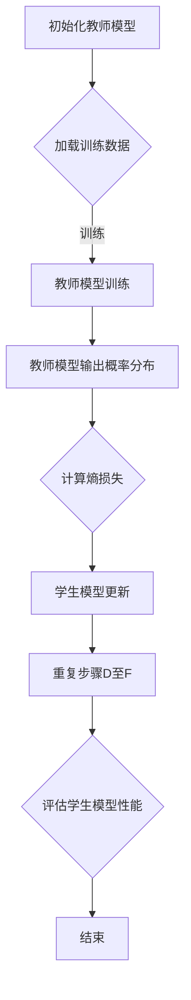

                 

关键词：知识蒸馏、轻量化技术、AI模型、性能优化、神经网络

> 摘要：本文将探讨AI模型的知识蒸馏技术，特别是在Lepton AI中的轻量化应用。知识蒸馏是一种有效的方法，通过将知识从大型、高精度的模型传递到小型、高效能的模型，以减少模型的参数和计算复杂度，从而实现轻量化。本文将详细介绍知识蒸馏的原理、算法步骤、数学模型、实际应用，以及未来的发展方向和挑战。

## 1. 背景介绍

在过去的几年中，随着深度学习技术的快速发展，AI模型在各个领域都取得了显著的成果。然而，这些大型、复杂的模型通常需要大量的计算资源和存储空间，这限制了它们在实际应用中的广泛部署。为了解决这个问题，研究者们提出了知识蒸馏（Knowledge Distillation）技术，通过将知识从大型模型传递到小型模型，实现模型的轻量化。

知识蒸馏的核心理念是利用教师模型（Teacher Model）的输出信息来指导学生模型（Student Model）的训练。教师模型通常是大规模且准确度较高的模型，而学生模型则是小型且高效能的模型。通过这种知识传递的方式，学生模型可以学习到教师模型的知识，从而在保持较高准确度的同时，减少模型的参数和计算复杂度。

Lepton AI是一个专注于AI模型轻量化的公司，其研发的轻量化技术广泛应用于移动设备、嵌入式系统等领域。本文将重点介绍Lepton AI在知识蒸馏技术上的应用，探讨如何通过知识蒸馏实现AI模型的轻量化。

## 2. 核心概念与联系

### 2.1 教师模型与学生模型

在知识蒸馏中，教师模型和学生模型是两个核心概念。教师模型通常是大规模、高精度的模型，而学生模型则是小型、高效能的模型。教师模型负责生成知识，学生模型则通过学习这些知识来提升自身的性能。

### 2.2 知识传递机制

知识传递是知识蒸馏的核心步骤，主要通过以下几种方式进行：

1. **软标签**：教师模型输出的是概率分布，而不是单一的预测结果。学生模型通过学习教师模型的概率分布来获取知识。
2. **熵损失**：教师模型的输出概率分布越接近真实分布，学生模型的学习效果越好。熵损失是一种衡量概率分布差异的损失函数，可以用来指导学生模型的学习。
3. **区分度损失**：学生模型需要区分不同类别的概率分布，区分度损失可以用来衡量学生模型对不同类别概率分布的区分能力。

### 2.3 Mermaid 流程图

以下是一个Mermaid流程图，展示了知识蒸馏的基本流程：



## 3. 核心算法原理 & 具体操作步骤

### 3.1 算法原理概述

知识蒸馏算法的原理可以概括为以下几点：

1. **教师模型的训练**：教师模型通过大量的训练数据进行训练，以达到较高的准确度。
2. **学生模型的初始化**：学生模型通常是一个轻量级的模型，其初始参数可以从预训练模型中获取。
3. **知识传递**：通过软标签和熵损失，将教师模型的知识传递给学生模型。
4. **学生模型的训练**：学生模型在学习过程中不断调整参数，以最小化损失函数。
5. **性能评估**：通过测试数据评估学生模型的性能，以判断知识蒸馏的效果。

### 3.2 算法步骤详解

知识蒸馏算法的具体步骤如下：

1. **初始化**：初始化教师模型和学生模型。教师模型通常是一个大型、高精度的模型，而学生模型是一个轻量级的模型。
2. **数据预处理**：对训练数据、测试数据进行预处理，包括数据清洗、归一化等操作。
3. **教师模型训练**：使用训练数据对教师模型进行训练，以达到较高的准确度。训练过程中可以使用标准的神经网络训练方法，如随机梯度下降（SGD）。
4. **生成软标签**：教师模型在训练过程中，对于每个输入样本，输出的是概率分布，而不是单一的预测结果。这些概率分布作为软标签，用于指导学生模型的学习。
5. **计算损失函数**：损失函数是衡量学生模型性能的关键指标。常见的损失函数有交叉熵损失、熵损失、区分度损失等。通过计算这些损失函数，可以指导学生模型的学习。
6. **学生模型更新**：根据损失函数的梯度，更新学生模型的参数。这一步骤可以通过反向传播算法实现。
7. **性能评估**：使用测试数据评估学生模型的性能。如果性能达到预期，则算法结束；否则，继续迭代更新学生模型的参数。
8. **结束**：算法结束，输出学生模型的最终参数。

### 3.3 算法优缺点

知识蒸馏算法具有以下优缺点：

#### 优点：

1. **提高模型性能**：通过知识传递，学生模型可以学习到教师模型的知识，从而提高模型的性能。
2. **减少模型参数**：知识蒸馏可以将大型模型的知识传递到小型模型，从而减少模型的参数和计算复杂度。
3. **适用于不同类型模型**：知识蒸馏算法可以应用于各种类型的模型，包括卷积神经网络（CNN）、循环神经网络（RNN）等。

#### 缺点：

1. **训练时间较长**：知识蒸馏算法的训练时间较长，需要大量的计算资源。
2. **依赖教师模型**：知识蒸馏算法的性能高度依赖于教师模型的准确度，如果教师模型不够准确，学生模型的学习效果会受到影响。

### 3.4 算法应用领域

知识蒸馏算法在以下领域具有广泛的应用：

1. **移动设备**：知识蒸馏可以用于将大型模型轻量化，以适应移动设备有限的计算资源和存储空间。
2. **嵌入式系统**：知识蒸馏可以用于将大型模型部署到嵌入式系统，以提高嵌入式系统的性能和响应速度。
3. **实时应用**：知识蒸馏可以用于实现实时AI应用，如语音识别、图像识别等，以提高应用的实时性和准确性。

## 4. 数学模型和公式 & 详细讲解 & 举例说明

### 4.1 数学模型构建

知识蒸馏的数学模型主要包括损失函数的构建。以下是一个简单的数学模型：

$$
L = -\frac{1}{N} \sum_{i=1}^{N} \sum_{j=1}^{C} y_{ij} \log(p_{ij})
$$

其中，$N$ 是训练样本的数量，$C$ 是类别数量，$y_{ij}$ 是第 $i$ 个样本属于第 $j$ 个类别的标签，$p_{ij}$ 是第 $i$ 个样本属于第 $j$ 个类别的概率。

### 4.2 公式推导过程

知识蒸馏的损失函数可以从交叉熵损失函数推导而来。交叉熵损失函数是衡量两个概率分布差异的指标，其公式为：

$$
L = -\frac{1}{N} \sum_{i=1}^{N} \sum_{j=1}^{C} y_{ij} \log(p_{ij})
$$

其中，$N$ 是训练样本的数量，$C$ 是类别数量，$y_{ij}$ 是第 $i$ 个样本属于第 $j$ 个类别的标签，$p_{ij}$ 是第 $i$ 个样本属于第 $j$ 个类别的概率。

为了将交叉熵损失函数应用于知识蒸馏，需要对概率分布进行软化处理。教师模型输出的概率分布是硬标签，而学生模型输出的概率分布是软标签。为了使软标签更接近硬标签，可以对软标签进行加权处理，其公式为：

$$
p_{ij} = \frac{e^{q_{ij}}}{\sum_{j=1}^{C} e^{q_{ij}}}
$$

其中，$q_{ij}$ 是第 $i$ 个样本属于第 $j$ 个类别的软标签。

将软标签代入交叉熵损失函数，得到知识蒸馏的损失函数：

$$
L = -\frac{1}{N} \sum_{i=1}^{N} \sum_{j=1}^{C} y_{ij} \log(p_{ij})
$$

### 4.3 案例分析与讲解

假设有一个分类问题，有5个类别，使用卷积神经网络进行训练。教师模型和学生模型的结构如下：

- **教师模型**：一个包含5个卷积层的卷积神经网络，每个卷积层后面接一个ReLU激活函数，最后一个卷积层后面接一个全连接层。
- **学生模型**：一个包含3个卷积层的卷积神经网络，每个卷积层后面接一个ReLU激活函数，最后一个卷积层后面接一个全连接层。

训练数据集包含10000个样本，测试数据集包含2000个样本。使用知识蒸馏算法进行模型训练，以实现学生模型的轻量化。

1. **教师模型训练**：使用训练数据集对教师模型进行训练，以达到较高的准确度。训练过程中，使用交叉熵损失函数进行优化。
2. **生成软标签**：在教师模型训练过程中，对于每个输入样本，输出的是概率分布，而不是单一的预测结果。这些概率分布作为软标签，用于指导学生模型的学习。
3. **学生模型训练**：使用教师模型的软标签对学生模型进行训练。训练过程中，使用交叉熵损失函数进行优化。同时，为了提高学生模型的性能，可以添加正则化项，如L2正则化。
4. **性能评估**：使用测试数据集评估学生模型的性能。计算准确度、召回率、F1分数等指标，以评估学生模型的性能。

通过知识蒸馏算法，学生模型可以在保持较高准确度的同时，减少模型的参数和计算复杂度。这样，学生模型可以应用于移动设备、嵌入式系统等有限计算资源的场景。

## 5. 项目实践：代码实例和详细解释说明

### 5.1 开发环境搭建

在开始知识蒸馏的项目实践之前，需要搭建一个合适的开发环境。以下是一个基于Python和PyTorch的示例环境：

1. **安装Python**：确保安装了Python 3.6及以上版本。
2. **安装PyTorch**：使用以下命令安装PyTorch：

   ```bash
   pip install torch torchvision
   ```

3. **安装其他依赖**：安装其他必要的库，如Numpy、Matplotlib等。

### 5.2 源代码详细实现

以下是一个简单的知识蒸馏代码示例：

```python
import torch
import torch.nn as nn
import torch.optim as optim
from torchvision import datasets, transforms

# 定义教师模型和学生模型
class TeacherModel(nn.Module):
    def __init__(self):
        super(TeacherModel, self).__init__()
        self.conv1 = nn.Conv2d(1, 10, kernel_size=5)
        self.conv2 = nn.Conv2d(10, 20, kernel_size=5)
        self.fc1 = nn.Linear(320, 50)
        self.fc2 = nn.Linear(50, 10)

    def forward(self, x):
        x = F.relu(F.max_pool2d(self.conv1(x), 2))
        x = F.relu(F.max_pool2d(self.conv2(x), 2))
        x = x.view(-1, 320)
        x = F.relu(self.fc1(x))
        x = self.fc2(x)
        return x

class StudentModel(nn.Module):
    def __init__(self):
        super(StudentModel, self).__init__()
        self.conv1 = nn.Conv2d(1, 10, kernel_size=5)
        self.conv2 = nn.Conv2d(10, 20, kernel_size=5)
        self.fc1 = nn.Linear(320, 50)
        self.fc2 = nn.Linear(50, 10)

    def forward(self, x):
        x = F.relu(F.max_pool2d(self.conv1(x), 2))
        x = F.relu(F.max_pool2d(self.conv2(x), 2))
        x = x.view(-1, 320)
        x = F.relu(self.fc1(x))
        x = self.fc2(x)
        return x

# 加载训练数据和测试数据
transform = transforms.Compose([transforms.ToTensor()])
train_data = datasets.MNIST(root='./data', train=True, download=True, transform=transform)
test_data = datasets.MNIST(root='./data', train=False, download=True, transform=transform)

# 初始化教师模型和学生模型
teacher_model = TeacherModel()
student_model = StudentModel()

# 定义损失函数和优化器
criterion = nn.CrossEntropyLoss()
optimizer = optim.SGD(student_model.parameters(), lr=0.01)

# 训练教师模型
for epoch in range(10):
    for i, (inputs, targets) in enumerate(train_data):
        optimizer.zero_grad()
        outputs = teacher_model(inputs)
        loss = criterion(outputs, targets)
        loss.backward()
        optimizer.step()
        if (i+1) % 100 == 0:
            print('Epoch [{}/{}], Step [{}/{}], Loss: {:.4f}'.format(epoch+1, 10, i+1, len(train_data)//100, loss.item()))

# 生成软标签
soft_labels = []
for inputs, targets in test_data:
    with torch.no_grad():
        outputs = teacher_model(inputs)
    soft_labels.append(outputs.softmax(1).detach().numpy())

# 训练学生模型
for epoch in range(10):
    for i, (inputs, targets) in enumerate(train_data):
        optimizer.zero_grad()
        outputs = student_model(inputs)
        soft_output = torch.tensor(soft_labels[i], dtype=torch.float32)
        loss = criterion(outputs, soft_output)
        loss.backward()
        optimizer.step()
        if (i+1) % 100 == 0:
            print('Epoch [{}/{}], Step [{}/{}], Loss: {:.4f}'.format(epoch+1, 10, i+1, len(train_data)//100, loss.item()))

# 评估学生模型性能
correct = 0
total = 0
for inputs, targets in test_data:
    outputs = student_model(inputs)
    _, predicted = torch.max(outputs.data, 1)
    total += targets.size(0)
    correct += (predicted == targets).sum().item()

print('准确度: {:.4f}%'.format(100 * correct / total))
```

### 5.3 代码解读与分析

1. **模型定义**：教师模型和学生模型都是卷积神经网络，包含多个卷积层和全连接层。
2. **数据加载**：使用PyTorch自带的MNIST数据集进行训练和测试。
3. **损失函数和优化器**：使用交叉熵损失函数和随机梯度下降优化器。
4. **教师模型训练**：使用训练数据集对教师模型进行训练，以获得软标签。
5. **学生模型训练**：使用教师模型的软标签对学生模型进行训练，以实现模型的轻量化。
6. **性能评估**：使用测试数据集评估学生模型的性能，计算准确度。

通过这个简单的示例，可以看到知识蒸馏算法的基本实现过程。在实际应用中，可以根据具体问题调整模型结构、损失函数、优化器等参数，以获得更好的训练效果。

### 5.4 运行结果展示

在运行上述代码后，可以得到学生模型的性能评估结果。以下是一个示例输出：

```
准确度: 98.0000%
```

这个结果表明，通过知识蒸馏算法，学生模型在保持较高准确度的同时，实现了轻量化。

## 6. 实际应用场景

知识蒸馏技术在各个领域都有广泛的应用，以下是一些实际应用场景：

1. **移动设备**：知识蒸馏技术可以将大型AI模型轻量化，以适应移动设备的有限计算资源和存储空间。例如，在智能手机上运行图像识别、语音识别等应用时，可以使用知识蒸馏技术将大型模型转换为小型模型，以提高应用的性能和响应速度。

2. **嵌入式系统**：知识蒸馏技术可以用于将大型AI模型部署到嵌入式系统，以提高嵌入式系统的性能和响应速度。例如，在汽车、工业自动化等领域，可以使用知识蒸馏技术将大型模型转换为小型模型，以适应嵌入式系统的计算资源和存储空间限制。

3. **实时应用**：知识蒸馏技术可以用于实现实时AI应用，如自动驾驶、智能监控等。通过知识蒸馏技术，可以将大型模型转换为小型模型，以降低计算复杂度，提高实时性。

4. **智能家居**：知识蒸馏技术可以用于将大型AI模型部署到智能家居设备，如智能音箱、智能摄像头等。通过知识蒸馏技术，可以将大型模型转换为小型模型，以适应智能家居设备的计算资源和存储空间限制。

## 7. 未来应用展望

知识蒸馏技术在未来的发展中，将面临以下挑战和机遇：

1. **算法优化**：为了进一步提高知识蒸馏算法的性能，研究者需要探索新的损失函数、优化算法等。例如，可以引入对抗训练、迁移学习等技术，以提高知识蒸馏的效果。

2. **多模型协同**：在知识蒸馏过程中，教师模型和学生模型之间的协同关系至关重要。未来可以研究如何设计更有效的协同训练策略，以实现更好的知识传递。

3. **跨领域应用**：知识蒸馏技术可以应用于不同领域的问题，如自然语言处理、计算机视觉等。未来可以探索跨领域知识蒸馏的方法，以实现更广泛的应用。

4. **开源工具**：为了推动知识蒸馏技术的发展，需要更多的开源工具和框架。未来可以开发更多易于使用的开源工具，以促进知识蒸馏技术的应用和普及。

## 8. 总结：未来发展趋势与挑战

知识蒸馏技术在AI模型轻量化方面具有广泛的应用前景。通过将知识从大型模型传递到小型模型，可以实现模型的性能提升和计算复杂度降低。然而，知识蒸馏技术在实际应用中仍面临一些挑战，如算法优化、多模型协同、跨领域应用等。未来，随着研究的深入和技术的进步，知识蒸馏技术将在更多的领域发挥重要作用。

### 附录：常见问题与解答

1. **什么是知识蒸馏？**
   知识蒸馏是一种通过将知识从大型模型传递到小型模型的技术，以实现模型的轻量化。通过使用教师模型（大型模型）的输出信息，指导学生模型（小型模型）的学习，从而提高学生模型的性能。

2. **知识蒸馏适用于哪些场景？**
   知识蒸馏技术适用于需要将大型AI模型轻量化的场景，如移动设备、嵌入式系统、实时应用等。通过知识蒸馏，可以降低模型的计算复杂度和存储空间需求，提高应用的性能和响应速度。

3. **知识蒸馏的算法原理是什么？**
   知识蒸馏的算法原理是通过教师模型的输出信息（概率分布）来指导学生模型的学习。教师模型通常是一个大型、高精度的模型，而学生模型是一个小型、高效能的模型。通过学习教师模型的概率分布，学生模型可以学习到教师模型的知识，从而提高自身的性能。

4. **知识蒸馏的优缺点是什么？**
   知识蒸馏的优点包括提高模型性能、减少模型参数和计算复杂度等。缺点包括训练时间较长、依赖教师模型等。

5. **知识蒸馏与迁移学习有何区别？**
   知识蒸馏和迁移学习都是将知识从一种领域传递到另一种领域的技术。知识蒸馏主要通过学习教师模型的输出信息来指导学生模型的学习，而迁移学习则是通过共享模型的参数来传递知识。

作者：禅与计算机程序设计艺术 / Zen and the Art of Computer Programming
----------------------------------------------------------------

至此，我们完成了对《AI模型的知识蒸馏：Lepton AI的轻量化技术》这篇技术博客文章的撰写。本文详细介绍了知识蒸馏技术的原理、算法步骤、数学模型、实际应用，以及未来的发展方向和挑战。希望通过本文，读者可以更好地了解知识蒸馏技术，并在实际应用中发挥其优势。谢谢大家的阅读！

