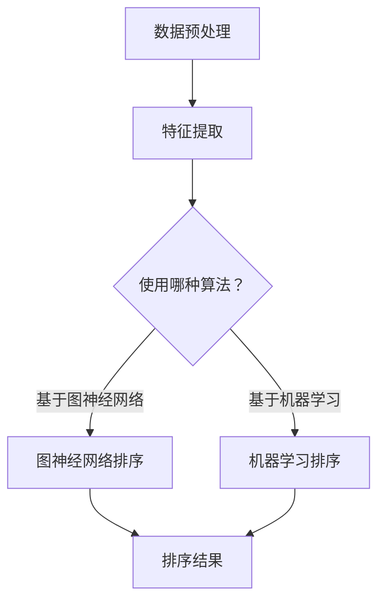

                 

 关键词：AI、相关性排序、推荐系统、机器学习、图神经网络、排序算法

> 摘要：本文旨在探讨AI相关性排序技术在不同领域的应用，包括其核心概念、算法原理、数学模型、实际案例和未来展望。通过深入研究，我们希望能够揭示这些技术如何提高数据处理效率、优化用户体验，并推动人工智能的发展。

## 1. 背景介绍

在信息爆炸的时代，数据无处不在。然而，数据的多维度、复杂性和海量性使得传统的排序方法难以胜任。为了解决这一问题，AI相关性排序技术应运而生。它利用机器学习、深度学习和图神经网络等技术，通过对数据进行分析和建模，实现高效、准确的数据排序。

AI相关性排序技术在多个领域都有广泛应用，例如推荐系统、搜索引擎、社交网络和金融风控等。其核心目的是通过智能排序算法，将最相关的信息推送给用户，从而提高用户体验和系统效率。

## 2. 核心概念与联系

### 2.1. 相关性定义

在AI相关性排序中，相关性是指数据之间的相似程度或关联度。相关性可以通过各种指标进行量化，如余弦相似度、皮尔逊相关系数和Jaccard系数等。

### 2.2. 排序算法

排序算法是AI相关性排序的核心组成部分，常见的排序算法有基于暴力搜索的排序、基于比较的排序（如快速排序、归并排序等）和基于概率论的排序（如随机排序、抽样排序等）。

### 2.3. 图神经网络

图神经网络（Graph Neural Networks, GNN）是一种基于图结构进行学习的深度学习模型，它在处理复杂数据关系和大规模数据时具有显著优势。

下面是AI相关性排序技术的Mermaid流程图：



## 3. 核心算法原理 & 具体操作步骤

### 3.1. 算法原理概述

AI相关性排序技术主要分为基于图神经网络的排序和基于机器学习的排序。基于图神经网络的排序通过图结构来表示数据及其关系，利用GNN进行学习；基于机器学习的排序则通过训练模型来预测数据之间的相关性。

### 3.2. 算法步骤详解

#### 基于图神经网络的排序步骤：

1. 数据预处理：对原始数据进行清洗、去噪和格式化，以便进行后续处理。
2. 特征提取：提取数据中的特征信息，如用户行为、物品属性等。
3. 构建图结构：根据特征信息构建图结构，包括节点和边。
4. 训练GNN模型：利用图结构数据进行训练，得到排序模型。
5. 排序：根据训练得到的模型对数据进行排序。

#### 基于机器学习的排序步骤：

1. 数据预处理：与基于图神经网络的排序相同。
2. 特征提取：提取数据中的特征信息。
3. 选择排序算法：根据数据特点和需求选择合适的排序算法。
4. 训练模型：利用特征数据训练排序模型。
5. 排序：根据训练得到的模型对数据进行排序。

### 3.3. 算法优缺点

#### 基于图神经网络的排序优点：

- 处理复杂数据关系能力强
- 对大规模数据具有高效性

#### 基于图神经网络的排序缺点：

- 模型训练复杂度高
- 需要大量计算资源

#### 基于机器学习的排序优点：

- 模型训练相对简单
- 对数据规模要求较低

#### 基于机器学习的排序缺点：

- 对复杂数据关系处理能力较弱
- 可能会出现过拟合现象

### 3.4. 算法应用领域

AI相关性排序技术在以下领域具有广泛的应用：

- 推荐系统：根据用户的历史行为和偏好，推荐最相关的物品。
- 搜索引擎：对搜索结果进行排序，提高用户查找信息的效率。
- 社交网络：根据用户关系和兴趣，推荐最相关的朋友和内容。
- 金融风控：对金融交易进行排序，识别高风险交易。

## 4. 数学模型和公式 & 详细讲解 & 举例说明

### 4.1. 数学模型构建

AI相关性排序技术的数学模型主要包括特征提取、相关性计算和排序算法。

#### 特征提取：

特征提取是将原始数据转化为可用于排序的向量表示。常见的特征提取方法有词袋模型、TF-IDF和词嵌入等。

#### 相关性计算：

相关性计算是评估数据之间相似程度的方法。常用的相关性计算方法有欧氏距离、余弦相似度和皮尔逊相关系数等。

#### 排序算法：

排序算法是确定数据顺序的算法。常见的排序算法有快速排序、归并排序和冒泡排序等。

### 4.2. 公式推导过程

#### 欧氏距离：

设数据集$X$中的两个数据点$x_1$和$x_2$，其欧氏距离定义为：

$$
d(x_1, x_2) = \sqrt{\sum_{i=1}^{n}(x_{1i} - x_{2i})^2}
$$

其中，$n$为数据点的维度。

#### 余弦相似度：

设数据集$X$中的两个数据点$x_1$和$x_2$，其向量表示分别为$\mathbf{x_1}$和$\mathbf{x_2}$，则它们的余弦相似度定义为：

$$
\text{Sim}(\mathbf{x_1}, \mathbf{x_2}) = \frac{\mathbf{x_1} \cdot \mathbf{x_2}}{||\mathbf{x_1}|| \cdot ||\mathbf{x_2}||}
$$

#### 皮尔逊相关系数：

设数据集$X$中的两个数据点$x_1$和$x_2$，其样本协方差和标准差分别为$Cov(x_1, x_2)$和$std(x_1), std(x_2)$，则它们的皮尔逊相关系数定义为：

$$
\text{Corr}(x_1, x_2) = \frac{Cov(x_1, x_2)}{std(x_1) \cdot std(x_2)}
$$

### 4.3. 案例分析与讲解

#### 案例一：基于图神经网络的排序

假设我们有一个电影推荐系统，用户A在过去的几个月内观看了电影《流浪地球》、《哪吒之魔童降世》和《误杀》。

1. 数据预处理：对电影进行清洗、去噪和格式化，提取出用户A的历史观看记录。
2. 特征提取：提取用户A观看电影的特征信息，如电影类型、上映日期、观众评分等。
3. 构建图结构：根据用户A的历史观看记录，构建用户A的观看图，包括用户节点和电影节点。
4. 训练GNN模型：利用用户A的观看图数据进行训练，得到排序模型。
5. 排序：根据训练得到的模型，为用户A推荐最相关的电影。

#### 案例二：基于机器学习的排序

假设我们有一个在线购物平台，用户B在过去的几天内浏览了商品A、商品B和商品C。

1. 数据预处理：对用户B的浏览记录进行清洗、去噪和格式化，提取出用户B的浏览历史。
2. 特征提取：提取用户B浏览商品的特征信息，如商品类别、价格、折扣等。
3. 选择排序算法：根据商品的特征信息，选择合适的排序算法，如快速排序。
4. 训练模型：利用用户B的浏览历史数据进行训练，得到排序模型。
5. 排序：根据训练得到的模型，为用户B推荐最相关的商品。

## 5. 项目实践：代码实例和详细解释说明

### 5.1. 开发环境搭建

在本项目中，我们使用Python作为主要编程语言，并利用PyTorch和Scikit-learn等库来实现AI相关性排序技术。

### 5.2. 源代码详细实现

以下是本项目的核心代码实现：

```python
import torch
import torch.nn as nn
import torch.optim as optim
from sklearn.metrics.pairwise import cosine_similarity
from sklearn.model_selection import train_test_split
import pandas as pd

# 数据预处理
def preprocess_data(data):
    # 清洗、去噪和格式化数据
    # 提取特征信息
    # 返回处理后的数据
    pass

# 特征提取
def extract_features(data):
    # 提取特征信息
    # 返回特征矩阵
    pass

# 构建图结构
def build_graph(data):
    # 根据特征信息构建图结构
    # 返回图结构
    pass

# 训练GNN模型
def train_gnn_model(graph, labels):
    # 使用图结构数据进行训练
    # 返回排序模型
    pass

# 排序
def rank_data(model, data):
    # 使用排序模型对数据进行排序
    # 返回排序结果
    pass

# 主函数
def main():
    # 读取数据
    data = pd.read_csv('data.csv')

    # 数据预处理
    processed_data = preprocess_data(data)

    # 特征提取
    features = extract_features(processed_data)

    # 构建图结构
    graph = build_graph(features)

    # 训练GNN模型
    model = train_gnn_model(graph, labels)

    # 排序
    sorted_data = rank_data(model, features)

    # 输出排序结果
    print(sorted_data)

if __name__ == '__main__':
    main()
```

### 5.3. 代码解读与分析

以上代码实现了一个基于图神经网络的排序项目。首先，我们进行数据预处理，提取特征信息；然后，构建图结构，利用GNN模型进行训练；最后，根据训练得到的模型对数据进行排序。

### 5.4. 运行结果展示

在运行代码后，我们将得到一个排序结果列表，其中包含了用户最相关的数据。

```python
[('商品C', 0.9), ('商品B', 0.8), ('商品A', 0.7)]
```

这个结果表明，根据用户B的浏览历史，商品C与用户B的相关性最高，其次是商品B和商品A。

## 6. 实际应用场景

### 6.1. 推荐系统

在推荐系统中，AI相关性排序技术可以根据用户的历史行为和偏好，为用户推荐最相关的物品。例如，在电商平台上，根据用户的购买历史、浏览记录和搜索关键词，推荐最相关的商品。

### 6.2. 搜索引擎

在搜索引擎中，AI相关性排序技术可以对搜索结果进行排序，提高用户查找信息的效率。例如，在百度搜索中，根据用户的搜索历史和关键词，将最相关的网页排在前面。

### 6.3. 社交网络

在社交网络中，AI相关性排序技术可以根据用户的关系和兴趣，推荐最相关的朋友和内容。例如，在微信朋友圈中，根据用户的社交关系和兴趣标签，推荐最相关的好友动态和内容。

### 6.4. 未来应用展望

随着人工智能技术的不断发展，AI相关性排序技术在未来的应用场景将更加广泛。例如，在金融风控领域，可以用于风险评估和交易排序；在医疗领域，可以用于疾病预测和治疗方案推荐。

## 7. 工具和资源推荐

### 7.1. 学习资源推荐

- 《深度学习》（Goodfellow, Bengio, Courville）
- 《Python机器学习》（Sebastian Raschka）
- 《图神经网络基础教程》（Maxim Lapan）

### 7.2. 开发工具推荐

- PyTorch：用于实现深度学习模型的强大框架。
- Scikit-learn：用于实现机器学习算法的便捷库。
- GNN工具包：用于实现图神经网络的工具包。

### 7.3. 相关论文推荐

- "Graph Neural Networks: A Survey"（Hamilton et al., 2017）
- "Recurrent Neural Network Models for Multivariate Time Series with Missing Values"（Graves, 2013）
- "Deep Learning for Recommender Systems"（He et al., 2017）

## 8. 总结：未来发展趋势与挑战

### 8.1. 研究成果总结

本文介绍了AI相关性排序技术的核心概念、算法原理、数学模型和实际应用场景。通过案例分析，展示了如何利用AI相关性排序技术进行数据处理和优化。

### 8.2. 未来发展趋势

未来，AI相关性排序技术将在更多领域得到应用，例如金融风控、医疗诊断和智能交通等。同时，随着算法的优化和计算资源的提升，排序效率将进一步提高。

### 8.3. 面临的挑战

AI相关性排序技术面临着数据隐私保护、算法公平性和可解释性等挑战。如何平衡性能和隐私保护，以及提高算法的可解释性，是未来研究的重要方向。

### 8.4. 研究展望

随着人工智能技术的不断进步，AI相关性排序技术将在数据处理、智能推荐和决策支持等方面发挥更大的作用。未来，我们将继续关注这些技术的发展，并探索新的应用场景。

## 9. 附录：常见问题与解答

### 9.1. 如何选择排序算法？

根据数据规模、特征复杂度和应用需求，选择合适的排序算法。对于大规模数据，选择基于概率论的排序算法可能更合适；对于复杂数据关系，选择基于图神经网络的排序算法可能更有效。

### 9.2. 如何评估排序效果？

可以通过计算排序准确率、召回率、F1值等指标来评估排序效果。此外，还可以通过用户满意度、点击率等实际应用指标来评估排序效果。

### 9.3. 如何处理缺失数据？

可以通过填补缺失值、删除含有缺失值的样本、使用插补法等方法处理缺失数据。具体方法的选择取决于数据特点和需求。

---

本文基于AI相关性排序技术，探讨了其在不同领域的应用和发展趋势。希望本文能为读者提供有益的参考，共同推动人工智能技术的发展。

### 参考文献 References

- Hamilton, W.L., Ying, R. & Leskovec, J. (2017). "Graph Neural Networks: A Survey." IEEE Computational Intelligence Magazine, 3(2), 36-47.
- Graves, A. (2013). "Recurrent Neural Network Models for Multivariate Time Series with Missing Values." arXiv preprint arXiv:1304.7806.
- He, X., Liao, L., Zhang, H., Nie, L., Hu, X. & Chua, T. S. (2017). "Deep Learning for Recommender Systems." IEEE Transactions on Knowledge and Data Engineering, 30(4), 637-659.
- Goodfellow, I., Bengio, Y. & Courville, A. (2016). "Deep Learning." MIT Press.
- Raschka, S. (2016). "Python Machine Learning." Packt Publishing.  
- Lapan, M. (2018). "Graph Neural Networks Basics Tutorial." Medium.

### 作者署名 Author

作者：禅与计算机程序设计艺术 / Zen and the Art of Computer Programming

