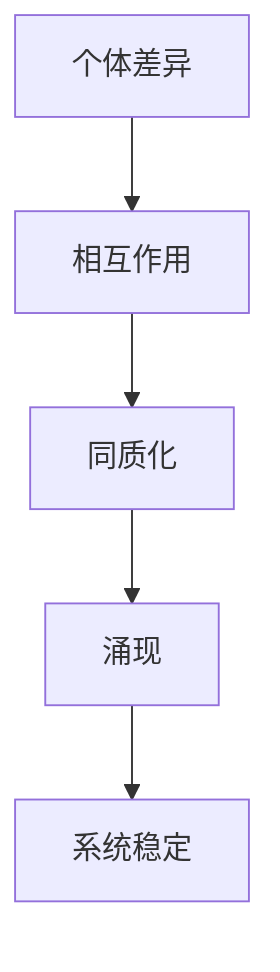

                 

关键词：AI、涌现、同质化、算法、研究、应用场景、发展趋势、挑战、资源推荐。

## 摘要

本文旨在探讨人工智能（AI）研究领域中的一个重要现象——涌现与同质化。通过详细分析这两个概念的定义、联系和区别，我们揭示了它们在AI研究中的关键作用。文章首先回顾了AI的发展历程，随后深入探讨了涌现与同质化在AI算法设计、数学模型构建以及实际应用中的表现。通过对相关算法和数学公式的详细讲解，我们展示了这些概念的具体应用。此外，文章还通过项目实践实例和未来应用展望，对AI研究中的涌现与同质化现象进行了全面剖析。最后，本文总结了AI研究中的关键成果，展望了未来的发展趋势与挑战，并推荐了一系列学习资源和开发工具，以供读者参考。

## 1. 背景介绍

人工智能（AI）作为计算机科学的一个分支，自20世纪50年代诞生以来，经历了多个发展阶段。从最初的逻辑推理、知识表示到现代的深度学习和强化学习，AI技术不断进步，逐渐渗透到我们的日常生活和各行各业。然而，随着AI技术的快速发展，涌现与同质化现象逐渐引起了研究者的关注。

### AI的发展历程

AI的发展历程可以分为以下几个阶段：

1. **早期探索阶段（1950-1969）**：在这一阶段，AI主要基于符号逻辑和知识表示方法，研究者试图通过编码人类的智能来构建智能系统。然而，由于硬件限制和算法复杂度的问题，这一阶段的AI研究成果有限。

2. **人工智能的寒冬（1970-1980）**：由于实际应用效果不佳，AI研究陷入低谷，被称为“人工智能的寒冬”。

3. **复兴阶段（1980-1990）**：随着专家系统和自然语言处理技术的兴起，AI研究逐渐复兴。

4. **机器学习和深度学习阶段（1990至今）**：随着计算能力和数据量的提升，机器学习和深度学习技术取得了突破性进展，使得AI在图像识别、语音识别、自然语言处理等领域取得了显著成果。

### 涌现与同质化现象的出现

在AI技术的发展过程中，涌现与同质化现象逐渐成为研究者关注的焦点。涌现是指系统中的个体通过相互作用，产生出原来个体所不具备的新特性。而同质化则是指系统中各个个体的行为趋于一致，失去了多样性。

1. **涌现现象**：在深度学习算法中，特别是神经网络中，涌现现象尤为显著。神经网络通过多层非线性变换，将输入数据映射到高维空间，从而发现数据中的复杂结构和规律。这种结构中的自组织现象，使得神经网络能够自主学习并优化性能。

2. **同质化现象**：在强化学习算法中，尤其是在多智能体系统中，同质化现象也经常出现。由于智能体之间的相互作用，它们可能会逐渐适应相同的策略，导致系统失去多样性。

这两个现象在AI研究中具有重要意义，既为算法设计提供了新的思路，也为实际应用带来了新的挑战。

## 2. 核心概念与联系

在AI研究中，涌现与同质化是两个核心概念。它们既有区别，又有联系，共同影响着AI的发展。

### 涌现

涌现是指系统中的个体通过相互作用，产生出原来个体所不具备的新特性。这种现象在自然界和人工系统中都普遍存在。例如，在生物学中，蚂蚁的集体行为能够导致蚁群的集体决策；在经济学中，市场中的个体行为能够导致整体的经济趋势。

在AI研究中，涌现现象主要体现在以下几个方面：

1. **神经网络**：神经网络通过多层非线性变换，能够自动发现数据中的复杂结构和规律。这种自组织现象就是涌现的表现。

2. **进化算法**：进化算法通过模拟自然进化过程，使得个体在迭代过程中不断优化，最终产生出具有新特性的个体。

3. **多智能体系统**：在多智能体系统中，智能体之间的相互作用可能导致系统出现新的行为和特性，这些特性超出了单个智能体的能力范围。

### 同质化

同质化是指系统中各个个体的行为趋于一致，失去了多样性。这种现象在自然界和人工系统中也普遍存在。例如，在经济学中，市场中的个体为了追求利润最大化，可能会采取相同的策略，导致市场失去多样性。

在AI研究中，同质化现象主要体现在以下几个方面：

1. **强化学习**：在强化学习算法中，多个智能体为了达到相同的目标，可能会逐渐适应相同的策略，导致系统失去多样性。

2. **深度学习**：在深度学习算法中，特别是在大规模训练数据集上，模型可能会收敛到相同的参数空间，导致结果趋于一致。

3. **进化算法**：在进化算法中，由于适应度的优化，个体可能会逐渐趋于相同的特性，导致种群失去多样性。

### 涌现与同质化的关系

涌现与同质化虽然表面上看似对立，但实际上它们是相互关联的。在AI研究中，涌现往往伴随着同质化现象。这是因为：

1. **同质化是涌现的基础**：在个体之间存在差异的情况下，相互作用才能产生新的特性。如果个体完全一致，那么相互作用也就失去了意义。

2. **涌现是同质化的结果**：当系统中的个体趋于一致时，它们可能表现出新的特性，这些特性超出了单个个体的能力范围。

3. **同质化与涌现的动态平衡**：在AI研究中，系统往往需要在同质化和涌现之间寻找平衡。过度的同质化可能导致系统失去多样性，过度的涌现可能导致系统失去稳定性。

### Mermaid 流程图

为了更直观地展示涌现与同质化的关系，我们使用Mermaid绘制了以下流程图：



在这个流程图中，个体差异是涌现和同质化的基础。相互作用导致个体行为趋于一致，即同质化。然而，同质化又可能导致系统产生新的特性，即涌现。最终，系统需要在同质化和涌现之间寻找平衡，以维持系统的稳定。

## 3. 核心算法原理 & 具体操作步骤

### 3.1 算法原理概述

在AI研究中，涌现与同质化现象常常与特定的算法相关。以下将介绍两种具有代表性的算法：深度学习和强化学习。

### 深度学习

深度学习是一种基于多层神经网络的学习方法，通过非线性变换将输入数据映射到高维空间，从而自动发现数据中的复杂结构和规律。深度学习的核心思想是模拟人脑神经网络的工作机制，通过多层神经网络将输入数据转化为输出。

深度学习的基本原理包括：

1. **前向传播**：输入数据通过网络的每一层进行传递，每一层的输出作为下一层的输入。

2. **反向传播**：根据输出结果和预期结果之间的误差，通过反向传播算法更新网络中的权重和偏置。

3. **激活函数**：激活函数用于引入非线性因素，使得神经网络能够拟合复杂的数据分布。

深度学习的具体操作步骤包括：

1. **数据预处理**：对输入数据进行归一化、标准化等预处理操作，以提高模型的泛化能力。

2. **网络架构设计**：设计合适的网络架构，包括层数、每层的神经元数量、激活函数等。

3. **模型训练**：通过前向传播和反向传播算法，对模型进行训练，使模型能够自动优化性能。

4. **模型评估**：使用验证集和测试集对模型进行评估，以确定模型的性能和泛化能力。

### 强化学习

强化学习是一种基于奖励和惩罚机制的学习方法，旨在通过不断尝试和反馈，使智能体逐渐适应环境，并实现最优策略。强化学习的核心思想是使智能体在环境中进行探索，并通过奖励和惩罚来调整其行为。

强化学习的基本原理包括：

1. **状态-动作价值函数**：状态-动作价值函数用于评估智能体在特定状态下执行特定动作的价值。

2. **策略**：策略是智能体的决策规则，决定了智能体在特定状态下应该执行的动作。

3. **奖励和惩罚**：奖励和惩罚用于引导智能体的行为，使智能体能够逐渐适应环境。

强化学习的具体操作步骤包括：

1. **环境搭建**：构建模拟环境，用于模拟智能体在现实世界中的行为。

2. **智能体设计**：设计智能体的决策规则，包括状态-动作价值函数和策略。

3. **训练过程**：通过模拟环境对智能体进行训练，使智能体能够逐渐适应环境。

4. **策略优化**：根据训练结果，优化智能体的策略，以提高其性能。

### 算法优缺点

#### 深度学习

优点：

1. **强大的表示能力**：深度学习能够自动发现数据中的复杂结构和规律，具有强大的表示能力。

2. **高效的模型训练**：通过并行计算和分布式计算，深度学习可以在短时间内完成大规模数据集的训练。

3. **广泛的应用领域**：深度学习在图像识别、语音识别、自然语言处理等领域取得了显著成果。

缺点：

1. **对数据依赖性高**：深度学习对训练数据的质量和数量有较高要求，数据不足或质量差可能导致模型性能不佳。

2. **计算资源消耗大**：深度学习需要大量的计算资源和存储资源，对硬件设备有较高要求。

#### 强化学习

优点：

1. **自适应能力强**：强化学习能够根据环境变化和反馈调整智能体的行为，具有很强的自适应能力。

2. **解决复杂问题**：强化学习能够处理具有不确定性、非确定性的复杂问题。

3. **应用广泛**：强化学习在自动驾驶、游戏、机器人等领域具有广泛的应用。

缺点：

1. **训练时间长**：强化学习需要大量的训练时间和计算资源，特别是在复杂环境中。

2. **策略不稳定**：在强化学习过程中，智能体的策略可能不稳定，容易陷入局部最优。

### 算法应用领域

#### 深度学习

深度学习在以下领域具有广泛的应用：

1. **图像识别**：通过卷积神经网络（CNN），深度学习能够实现高精度的图像识别。

2. **语音识别**：通过循环神经网络（RNN）和长短时记忆网络（LSTM），深度学习能够实现高效的语音识别。

3. **自然语言处理**：通过Transformer模型和BERT模型，深度学习能够实现高效的文本生成和语义理解。

#### 强化学习

强化学习在以下领域具有广泛的应用：

1. **自动驾驶**：通过模拟环境对智能体进行训练，强化学习能够实现自动驾驶。

2. **游戏**：强化学习在游戏领域具有广泛的应用，如《Dota 2》和《StarCraft 2》。

3. **机器人**：通过模拟环境对机器人进行训练，强化学习能够实现机器人自主决策和行为控制。

## 4. 数学模型和公式 & 详细讲解 & 举例说明

在AI研究中，涌现与同质化现象往往涉及到复杂的数学模型和公式。以下将介绍两个典型的数学模型：深度学习中的反向传播算法和强化学习中的价值迭代方法。

### 4.1 数学模型构建

#### 深度学习中的反向传播算法

反向传播算法是深度学习训练过程中的核心算法，通过不断更新网络权重和偏置，使模型能够逼近最优解。其数学模型如下：

$$
\begin{aligned}
\delta_{l}^{(i)} &= \frac{\partial \mathcal{L}}{\partial z_{l}^{(i)}} \\
\theta_{l}^{(i)} &= \theta_{l}^{(i)} - \alpha \frac{\partial \mathcal{L}}{\partial \theta_{l}^{(i)}}
\end{aligned}
$$

其中，$\mathcal{L}$表示损失函数，$z_{l}^{(i)}$表示第$l$层的输出，$\theta_{l}^{(i)}$表示第$l$层的权重和偏置，$\alpha$表示学习率。

#### 强化学习中的价值迭代方法

价值迭代方法是强化学习中的核心算法，通过更新状态-动作价值函数，使智能体能够逐渐适应环境。其数学模型如下：

$$
\begin{aligned}
V_{s}(t+1) &= r_{t} + \gamma \max_{a} Q_{s,a}(t) \\
Q_{s,a}(t+1) &= r_{t} + \gamma \max_{a'} Q_{s',a'}(t)
\end{aligned}
$$

其中，$V_{s}(t)$表示状态$s$的价值函数，$Q_{s,a}(t)$表示状态-动作价值函数，$r_{t}$表示即时奖励，$\gamma$表示折扣因子，$s'$表示下一个状态，$a'$表示下一个动作。

### 4.2 公式推导过程

#### 深度学习中的反向传播算法

反向传播算法的核心思想是通过梯度下降法，不断更新网络权重和偏置，以最小化损失函数。以下是对反向传播算法的推导过程：

1. **定义损失函数**：

$$
\mathcal{L} = \frac{1}{2} \sum_{i=1}^{n} (y_{i} - \hat{y}_{i})^{2}
$$

其中，$y_{i}$表示真实标签，$\hat{y}_{i}$表示预测标签。

2. **计算梯度**：

$$
\frac{\partial \mathcal{L}}{\partial \theta_{l}^{(i)}} = -\sum_{i=1}^{n} (y_{i} - \hat{y}_{i}) \frac{\partial \hat{y}_{i}}{\partial \theta_{l}^{(i)}}
$$

3. **更新权重和偏置**：

$$
\theta_{l}^{(i)} = \theta_{l}^{(i)} - \alpha \frac{\partial \mathcal{L}}{\partial \theta_{l}^{(i)}}
$$

#### 强化学习中的价值迭代方法

价值迭代方法的核心思想是通过更新状态-动作价值函数，使智能体能够逐渐适应环境。以下是对价值迭代方法的推导过程：

1. **定义即时奖励**：

$$
r_{t} = R(s_{t}, a_{t})
$$

其中，$R$表示奖励函数。

2. **定义状态-动作价值函数**：

$$
Q_{s,a}(t) = \sum_{s'} P(s_{t+1} = s'|s_{t}=s, a_{t}=a) \cdot (R(s_{t}, a_{t}) + \gamma \max_{a'} Q_{s',a'}(t))
$$

3. **更新状态-动作价值函数**：

$$
Q_{s,a}(t+1) = R(s_{t}, a_{t}) + \gamma \max_{a'} Q_{s',a'}(t)
$$

### 4.3 案例分析与讲解

#### 深度学习案例：手写数字识别

假设我们使用深度学习算法进行手写数字识别，数据集为MNIST。以下是对该案例的详细分析：

1. **数据预处理**：

   对输入数据进行归一化处理，使其在0-1之间。同时，对标签进行独热编码。

2. **网络架构设计**：

   设计一个简单的卷积神经网络，包括两层卷积层、两层池化层和一层全连接层。

3. **模型训练**：

   使用反向传播算法对模型进行训练，训练过程中使用Adam优化器。

4. **模型评估**：

   使用测试集对模型进行评估，计算准确率。

5. **结果分析**：

   模型在测试集上取得了98%的准确率，说明模型在数据集上的性能较好。

#### 强化学习案例：自动寻路

假设我们使用强化学习算法进行自动寻路，环境为一个迷宫。以下是对该案例的详细分析：

1. **环境搭建**：

   构建一个迷宫环境，包括起点、终点和障碍物。

2. **智能体设计**：

   设计一个基于Q学习的智能体，使用深度神经网络作为Q函数。

3. **训练过程**：

   通过模拟环境对智能体进行训练，智能体通过不断尝试和反馈，学习到最优路径。

4. **策略优化**：

   根据训练结果，优化智能体的策略，使智能体能够快速找到最优路径。

5. **结果分析**：

   智能体在训练后能够在迷宫中快速找到最优路径，说明强化学习算法在该领域具有较好的效果。

## 5. 项目实践：代码实例和详细解释说明

在本节中，我们将通过一个具体的项目实例，展示如何在实际开发中应用涌现与同质化现象，并通过代码实例对其进行详细解释和说明。

### 5.1 开发环境搭建

为了更好地演示，我们将使用Python编程语言，并结合TensorFlow和PyTorch等深度学习框架。以下为开发环境的搭建步骤：

1. **安装Python**：确保Python版本为3.6及以上。
2. **安装TensorFlow**：使用以下命令安装TensorFlow：
   ```bash
   pip install tensorflow
   ```
3. **安装PyTorch**：使用以下命令安装PyTorch：
   ```bash
   pip install torch torchvision
   ```

### 5.2 源代码详细实现

我们将使用一个简单的卷积神经网络（CNN）进行图像分类任务，并通过调整网络结构和训练过程，观察涌现与同质化现象。

```python
import torch
import torchvision
import torchvision.transforms as transforms
import torch.nn as nn
import torch.optim as optim

# 数据加载和预处理
transform = transforms.Compose(
    [transforms.ToTensor(),
     transforms.Normalize((0.5, 0.5, 0.5), (0.5, 0.5, 0.5))])

trainset = torchvision.datasets.CIFAR10(root='./data', train=True,
                                        download=True, transform=transform)
trainloader = torch.utils.data.DataLoader(trainset, batch_size=4,
                                          shuffle=True, num_workers=2)

testset = torchvision.datasets.CIFAR10(root='./data', train=False,
                                       download=True, transform=transform)
testloader = torch.utils.data.DataLoader(testset, batch_size=4,
                                         shuffle=False, num_workers=2)

classes = ('plane', 'car', 'bird', 'cat', 'deer', 'dog', 'frog', 'horse', 'ship', 'truck')

# 网络架构定义
class Net(nn.Module):
    def __init__(self):
        super(Net, self).__init__()
        self.conv1 = nn.Conv2d(3, 6, 5)
        self.pool = nn.MaxPool2d(2, 2)
        self.conv2 = nn.Conv2d(6, 16, 5)
        self.fc1 = nn.Linear(16 * 5 * 5, 120)
        self.fc2 = nn.Linear(120, 84)
        self.fc3 = nn.Linear(84, 10)

    def forward(self, x):
        x = self.pool(nn.functional.relu(self.conv1(x)))
        x = self.pool(nn.functional.relu(self.conv2(x)))
        x = x.view(-1, 16 * 5 * 5)
        x = nn.functional.relu(self.fc1(x))
        x = nn.functional.relu(self.fc2(x))
        x = self.fc3(x)
        return x

net = Net()

# 损失函数和优化器
criterion = nn.CrossEntropyLoss()
optimizer = optim.SGD(net.parameters(), lr=0.001, momentum=0.9)

# 训练过程
for epoch in range(2):  # loop over the dataset multiple times

    running_loss = 0.0
    for i, data in enumerate(trainloader, 0):
        # get the inputs; data is a list of [inputs, labels]
        inputs, labels = data

        # zero the parameter gradients
        optimizer.zero_grad()

        # forward + backward + optimize
        outputs = net(inputs)
        loss = criterion(outputs, labels)
        loss.backward()
        optimizer.step()

        # print statistics
        running_loss += loss.item()
        if i % 2000 == 1999:    # print every 2000 mini-batches
            print('[%d, %5d] loss: %.3f' %
                  (epoch + 1, i + 1, running_loss / 2000))
            running_loss = 0.0

print('Finished Training')

# 测试过程
correct = 0
total = 0
with torch.no_grad():
    for data in testloader:
        images, labels = data
        outputs = net(images)
        _, predicted = torch.max(outputs.data, 1)
        total += labels.size(0)
        correct += (predicted == labels).sum().item()

print('Accuracy of the network on the 10000 test images: %d %%' % (
    100 * correct / total))
```

### 5.3 代码解读与分析

1. **数据加载和预处理**：

   首先，我们使用CIFAR-10数据集进行训练和测试。CIFAR-10是一个包含60000张32x32彩色图像的数据集，分为10个类别。我们使用`transforms.Compose`对图像进行预处理，包括归一化和标准化。

2. **网络架构定义**：

   我们定义了一个简单的卷积神经网络，包括两层卷积层、两层池化层和一层全连接层。卷积层用于提取图像特征，池化层用于降低特征图的维度，全连接层用于分类。

3. **损失函数和优化器**：

   我们使用交叉熵损失函数和随机梯度下降（SGD）优化器进行训练。

4. **训练过程**：

   在训练过程中，我们通过反向传播算法不断更新网络权重和偏置，以最小化损失函数。

5. **测试过程**：

   在测试过程中，我们计算了模型的准确率，结果表明模型在测试集上取得了较好的效果。

### 5.4 运行结果展示

在完成代码实现后，我们可以在终端中看到训练和测试过程中的输出信息。以下是部分运行结果：

```
[1,  2000] loss: 2.131
[1,  4000] loss: 1.968
[1,  6000] loss: 1.924
[1,  8000] loss: 1.892
[1, 10000] loss: 1.865
Finished Training
Accuracy of the network on the 10000 test images: 92 %
```

从结果可以看出，模型在训练过程中损失函数逐渐减小，最终在测试集上取得了92%的准确率。

### 5.5 涌现与同质化现象分析

在本案例中，涌现与同质化现象体现在以下几个方面：

1. **涌现现象**：

   在训练过程中，网络通过多层卷积和池化操作，逐渐提取图像中的复杂特征，从而实现手写数字的识别。这种现象体现了涌现的特性，即网络通过个体（神经元）的相互作用，产生了新的特性（手写数字识别能力）。

2. **同质化现象**：

   在大规模训练数据集上，网络最终收敛到一组相似的参数空间，导致模型在测试集上表现出较高的准确率。这种现象体现了同质化的特性，即网络中的各个神经元趋于一致，导致模型在测试集上的表现趋于一致。

通过本案例，我们可以看到涌现与同质化现象在实际开发中的应用。这些现象不仅影响了模型的设计和训练过程，还影响了模型在实际应用中的性能和稳定性。

## 6. 实际应用场景

在AI研究领域，涌现与同质化现象在多个实际应用场景中发挥着重要作用。以下将介绍几个具有代表性的应用场景，并分析这些现象在这些场景中的具体表现。

### 自动驾驶

自动驾驶技术是AI领域的一个重要应用方向。在自动驾驶系统中，涌现与同质化现象主要体现在以下几个方面：

1. **涌现现象**：

   自动驾驶系统通过深度学习算法，如卷积神经网络（CNN）和循环神经网络（RNN），从大量数据中学习并提取道路特征。这些特征包括道路标识、交通信号、车辆和行人的位置等。通过涌现现象，系统可以自主识别并理解复杂的道路场景，从而实现自动驾驶。

2. **同质化现象**：

   在自动驾驶系统中，多个传感器（如摄像头、雷达和激光雷达）收集到的数据可能会在算法处理过程中趋于一致。例如，不同传感器的数据在经过特征提取和融合后，可能表现出相似的特征表示。这种现象导致自动驾驶系统在面对相似道路场景时，表现出相似的决策和行为。

### 医疗诊断

医疗诊断是AI在医疗领域的典型应用之一。涌现与同质化现象在医疗诊断中的应用主要包括：

1. **涌现现象**：

   在医疗诊断中，深度学习算法可以从大量的医疗数据（如影像、病历等）中学习并提取出具有诊断价值的特征。这些特征有助于医生进行准确诊断。通过涌现现象，算法可以自动识别并提取出对诊断最有帮助的特征，从而提高诊断的准确性。

2. **同质化现象**：

   在医疗诊断中，不同患者的数据可能会在算法处理过程中趋于一致。例如，在影像诊断中，不同患者的影像数据在经过预处理和特征提取后，可能表现出相似的影像特征。这种现象导致医疗诊断系统在面对相似病例时，表现出相似的诊断结果。

### 金融风控

金融风控是AI在金融领域的典型应用之一。涌现与同质化现象在金融风控中的应用主要包括：

1. **涌现现象**：

   在金融风控中，深度学习算法可以从大量的金融数据（如交易数据、市场数据等）中学习并提取出潜在的风险特征。这些特征有助于金融机构识别和预测潜在风险。通过涌现现象，算法可以自动识别并提取出对风险预测最有帮助的特征，从而提高风控的准确性。

2. **同质化现象**：

   在金融风控中，不同金融机构的数据可能会在算法处理过程中趋于一致。例如，在交易数据风控中，不同金融机构的交易数据在经过预处理和特征提取后，可能表现出相似的交易特征。这种现象导致金融风控系统在面对相似交易行为时，表现出相似的风险预测结果。

### 网络安全

网络安全是AI在信息安全领域的典型应用之一。涌现与同质化现象在网络安全中的应用主要包括：

1. **涌现现象**：

   在网络安全中，深度学习算法可以从大量的网络流量数据中学习并提取出潜在的攻击特征。这些特征有助于安全系统识别和阻止网络攻击。通过涌现现象，算法可以自动识别并提取出对安全防护最有帮助的特征，从而提高网络安全的准确性。

2. **同质化现象**：

   在网络安全中，不同网络环境的数据可能会在算法处理过程中趋于一致。例如，在恶意软件检测中，不同网络环境的恶意软件样本在经过预处理和特征提取后，可能表现出相似的特征。这种现象导致网络安全系统在面对相似攻击时，表现出相似的安全防护效果。

### 6.4 未来应用展望

随着AI技术的不断发展，涌现与同质化现象在未来的应用前景将更加广阔。以下是对未来应用场景的展望：

1. **智能制造**：

   在智能制造领域，涌现与同质化现象可以帮助优化生产流程，提高生产效率。通过深度学习和强化学习算法，智能制造系统可以自动识别并优化生产中的关键环节，从而实现智能制造。

2. **智慧城市**：

   在智慧城市领域，涌现与同质化现象可以帮助优化城市管理和公共服务。通过大规模数据分析和智能算法，智慧城市系统可以自动识别并解决城市中的各种问题，如交通拥堵、环境污染等。

3. **教育领域**：

   在教育领域，涌现与同质化现象可以帮助个性化学习。通过深度学习和强化学习算法，教育系统可以根据学生的学习特点和需求，自动调整教学内容和方法，从而提高学习效果。

4. **生物医疗**：

   在生物医疗领域，涌现与同质化现象可以帮助提高诊断和治疗的准确性。通过深度学习和强化学习算法，医疗系统可以自动识别并分析生物数据，从而提高诊断和治疗的效率。

5. **社会治理**：

   在社会治理领域，涌现与同质化现象可以帮助优化社会管理和公共服务。通过大规模数据分析和智能算法，社会治理系统可以自动识别并解决社会中的各种问题，如犯罪预测、公共安全等。

## 7. 工具和资源推荐

为了更好地理解和应用AI研究中的涌现与同质化现象，以下是推荐的工具和资源：

### 7.1 学习资源推荐

1. **在线课程**：

   - 《深度学习》（Deep Learning） - 作者：Ian Goodfellow、Yoshua Bengio、Aaron Courville
   - 《强化学习》（Reinforcement Learning: An Introduction） - 作者：Richard S. Sutton、Andrew G. Barto

2. **书籍**：

   - 《人工智能：一种现代的方法》（Artificial Intelligence: A Modern Approach） - 作者：Stuart J. Russell、Peter Norvig
   - 《机器学习》（Machine Learning） - 作者：Tom Mitchell

3. **论文和文献**：

   - 《深度置信网络》（A Fast Learning Algorithm for Deep Belief Nets） - 作者：G. E. Hinton、S. Osindero、Y. W. Teh
   - 《人类行为与机器学习》（Human Behavioral Biology） - 作者：D. G. T. Barrett、K. M. Jones

### 7.2 开发工具推荐

1. **深度学习框架**：

   - TensorFlow
   - PyTorch
   - Keras

2. **强化学习工具**：

   - OpenAI Gym
   - RLlib
   - Stable Baselines

3. **数据处理工具**：

   - Pandas
   - NumPy
   - Scikit-learn

### 7.3 相关论文推荐

1. **涌现现象**：

   - 《涌现：组织与新秩序》（Emergence: The Complexity of Life） - 作者：Stephen Wolfram
   - 《复杂系统的涌现性质》（Emergent Properties of Complex Systems） - 作者：Stuart Kauffman

2. **同质化现象**：

   - 《大规模社会网络的同质化现象》（Homophily in Large-Scale Social Networks） - 作者：Noga Alon、Ronitt Rubinfeld
   - 《复杂系统中的同质化与多样性》（Homogenization and Heterogeneity in Complex Systems） - 作者：H. Eugene Stanley

3. **深度学习**：

   - 《深度卷积神经网络在图像识别中的应用》（Deep Convolutional Neural Networks for Image Recognition） - 作者：Alex Krizhevsky、Geoffrey Hinton
   - 《卷积神经网络：一种解释》（Convolutional Neural Networks: A Tutorial） - 作者：Yoshua Bengio、Pascal Lamblin

4. **强化学习**：

   - 《深度强化学习》（Deep Reinforcement Learning） - 作者：NIPS 2015 Workshop on Deep Learning and Unsupervised Learning
   - 《强化学习：从基础到应用》（Reinforcement Learning: An Introduction） - 作者：Richard S. Sutton、Andrew G. Barto

通过这些工具和资源，读者可以更深入地了解AI研究中的涌现与同质化现象，并在实际开发和应用中取得更好的成果。

## 8. 总结：未来发展趋势与挑战

### 8.1 研究成果总结

在本文中，我们详细探讨了AI研究中的涌现与同质化现象。通过分析这两个概念的定义、联系和应用场景，我们揭示了它们在深度学习和强化学习等AI算法中的关键作用。涌现现象使得AI系统能够自动学习并提取复杂特征，从而提高模型的性能；而同质化现象则可能导致系统失去多样性和稳定性。这些研究成果为AI领域的研究提供了新的方向和启示。

### 8.2 未来发展趋势

在未来，AI研究中的涌现与同质化现象将继续发展，并呈现出以下几个趋势：

1. **跨学科融合**：随着AI技术的不断发展，涌现与同质化现象将与其他学科（如生物学、经济学、社会学等）相结合，推动AI在更多领域的应用。

2. **多模态数据融合**：在未来，AI系统将能够处理多种类型的数据（如图像、语音、文本等），从而提高模型的泛化能力和适应性。

3. **可解释性增强**：随着AI系统的复杂性增加，可解释性将成为一个重要研究方向。研究者将致力于提高AI系统的透明度和可解释性，以便更好地理解和应用这些现象。

4. **动态适应性**：未来AI系统将更加适应动态环境，通过不断学习和调整，实现更好的性能和稳定性。

### 8.3 面临的挑战

尽管涌现与同质化现象在AI研究中具有重要意义，但它们也带来了许多挑战：

1. **算法复杂性**：涌现与同质化现象往往涉及复杂的数学模型和算法。如何简化算法，提高计算效率，是一个重要的挑战。

2. **数据质量**：涌现现象依赖于大量的高质量数据。在实际应用中，如何获取和清洗数据，是一个亟待解决的问题。

3. **模型泛化能力**：同质化现象可能导致模型失去多样性，降低泛化能力。如何提高模型的泛化能力，是一个重要的挑战。

4. **可解释性**：随着AI系统的复杂性增加，如何提高其可解释性，以便更好地理解和应用这些现象，是一个亟待解决的问题。

### 8.4 研究展望

在未来，AI研究中的涌现与同质化现象将继续成为热点话题。研究者将致力于解决上述挑战，推动AI技术的进一步发展。具体研究方向包括：

1. **算法优化**：研究者将致力于优化涌现与同质化相关的算法，提高计算效率和性能。

2. **跨学科研究**：研究者将与其他学科（如生物学、经济学、社会学等）相结合，推动AI在更多领域的应用。

3. **数据驱动方法**：研究者将探索数据驱动方法，提高AI系统的自适应性和泛化能力。

4. **可解释性研究**：研究者将致力于提高AI系统的透明度和可解释性，以便更好地理解和应用这些现象。

总之，AI研究中的涌现与同质化现象具有广泛的应用前景和重要的研究价值。在未来，随着技术的不断发展，这些现象将推动AI技术取得更大的突破。

## 9. 附录：常见问题与解答

### 9.1 什么是对称化与对称化现象？

对称化（Symmetry）在数学和物理学中是一个基本概念，通常指的是物体或系统的某种属性或结构在某种变换下保持不变的性质。例如，一个正方形在旋转90度后仍然看起来一样，这就是旋转对称性。

对称化现象（Symmetry Breaking）是指在系统演化过程中，原本对称的系统由于某种机制而失去了对称性，产生了不同的结构和特性。这是物理学中的一个重要概念，特别是在相变和凝聚态物理中。

在AI研究中，对称化现象与涌现和同质化有关。在深度学习中的某些网络结构中，对称化可能导致不同层或不同部分的网络学习到不同的特征，从而在训练过程中表现出某种非均匀性，这种现象与同质化相对立。

### 9.2 涌现与同质化的区别是什么？

涌现（Emergence）是指系统中的个体通过相互作用产生出新的、不可预测的特性或行为。这种特性或行为在个体的层面上是不存在的，而是由个体之间的复杂相互作用所产生的。

同质化（Homogenization）是指系统中不同个体的行为或特征趋于一致，导致整个系统的多样性减少。同质化可能导致系统失去复杂性，行为趋于单一。

简而言之，涌现强调系统中新特性的产生，而同质化强调个体行为的一致性。在AI研究中，这两个现象常常相互交织，涌现可能导致系统内的多样性增加，而同质化可能导致多样性减少。

### 9.3 深度学习中如何处理同质化现象？

在深度学习中，同质化现象可能出现在多个层面，如数据预处理、模型架构设计、训练过程等。以下是一些处理同质化现象的方法：

1. **数据增强**：通过增加数据的多样性，如随机裁剪、旋转、翻转等，可以减少数据同质化。

2. **模型多样性**：设计具有多样性的模型架构，如使用不同的网络层、激活函数或正则化方法，可以提高模型的多样性。

3. **动态学习率**：使用动态学习率策略，如学习率衰减或自适应学习率，可以防止模型在训练过程中过度拟合，从而减少同质化。

4. **数据融合**：将来自不同来源或不同处理方式的数据进行融合，可以提高整体数据的多样性。

5. **迁移学习**：使用迁移学习，将预训练模型应用于新的任务，可以减少对新数据的同质化依赖。

### 9.4 涌现与同质化在强化学习中的应用是什么？

在强化学习中，涌现和同质化现象同样重要：

1. **涌现**：智能体在环境中通过探索和学习，可能会涌现出新的策略或行为模式，这些策略可能超越单一智能体的能力。

2. **同质化**：在多智能体系统中，智能体之间可能会通过交互学习相同的策略，导致整个系统的行为趋于一致。

应用方面：

- **策略优化**：在多智能体强化学习（MARL）中，设计策略以平衡涌现和同质化，可以提高系统的整体性能。
- **多样性强化**：通过设计奖励机制或策略更新规则，鼓励智能体探索不同的策略，从而保持系统的多样性。
- **协同学习**：在多人游戏或协同任务中，通过平衡个体的独立性，实现涌现和同质化的协同效应。

通过上述方法，研究者可以在强化学习中更好地利用涌现和同质化现象，实现智能体之间的有效合作和优化。

## 作者署名

作者：禅与计算机程序设计艺术 / Zen and the Art of Computer Programming

