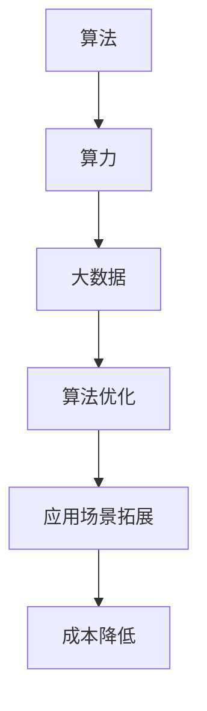

                 

关键词：人工智能、算法、算力、大数据、结合

摘要：本文将探讨人工智能（AI）算法、算力与大数据之间的结合，分析其重要性、原理以及具体应用场景。通过深入剖析AI算法的工作机制、算力的提升以及大数据的处理技术，旨在为读者提供全面的技术见解，并对未来发展趋势与挑战进行展望。

## 1. 背景介绍

随着科技的快速发展，人工智能已经成为当今社会的重要驱动力。AI算法在各个领域都展现出了巨大的潜力，从自然语言处理、计算机视觉到智能推荐系统等，无处不在。然而，AI算法的高效运行离不开强大的算力和海量数据作为支撑。算力是衡量计算机处理能力的重要指标，而大数据则为AI算法提供了丰富的训练素材。在这种背景下，AI算法、算力与大数据的结合成为了研究的热点。

### 1.1 人工智能的兴起

人工智能作为计算机科学的一个重要分支，起源于20世纪50年代。随着计算机硬件和算法的不断发展，人工智能逐渐从理论研究走向实际应用。近年来，深度学习、强化学习等新型算法的兴起，使得人工智能在各个领域都取得了显著的进展。从自动驾驶、智能医疗到金融分析、智能家居，人工智能已经渗透到我们生活的方方面面。

### 1.2 算力的提升

算力是衡量计算机处理能力的重要指标，其提升主要依赖于硬件技术的发展。从早期的CPU到GPU、TPU等专用计算设备，算力的提升为AI算法的高效运行提供了有力保障。同时，分布式计算、云计算等技术的应用，使得大规模数据处理和计算成为可能。算力的提升不仅提高了AI算法的运行效率，还为新的应用场景提供了可能性。

### 1.3 大数据的兴起

大数据是指规模巨大、类型繁多的数据集合，涵盖了结构化、半结构化和非结构化数据。随着互联网、物联网等技术的普及，大数据的数量和种类都在迅速增长。大数据为AI算法提供了丰富的训练素材，使得算法能够更好地理解和模拟复杂现象。

## 2. 核心概念与联系

为了更好地理解AI算法、算力与大数据的结合，我们首先需要明确以下几个核心概念：算法、算力和大数据。

### 2.1 算法

算法是指解决问题的步骤和规则，是人工智能的核心。根据不同的应用场景，算法可以分为监督学习、无监督学习、强化学习等类型。算法的性能直接影响AI系统的效果。

### 2.2 算力

算力是计算机处理数据的能力，通常用计算速度来衡量。算力的提升使得AI算法能够在更短的时间内处理更多数据，提高算法的运行效率。

### 2.3 大数据

大数据是指规模巨大、类型繁多的数据集合。大数据的存储、处理和分析需要强大的算力支持。同时，大数据为AI算法提供了丰富的训练素材，有助于提高算法的准确性和泛化能力。

### 2.4 AI算法、算力与大数据的结合

AI算法、算力与大数据的结合具有以下几个方面的优势：

1. **提高算法性能**：大数据为AI算法提供了丰富的训练素材，有助于提高算法的准确性和泛化能力。算力的提升使得算法能够更快地处理海量数据，提高算法的运行效率。

2. **拓宽应用场景**：结合算力和大数据，AI算法可以应用于更多领域，如医疗、金融、交通等。算力的提升和大数据的丰富性为AI系统的发展提供了更多可能性。

3. **降低成本**：分布式计算和云计算等技术的应用，使得大规模数据处理和计算成为可能，降低了成本。

### 2.5 Mermaid流程图

下面是一个简单的Mermaid流程图，展示了AI算法、算力与大数据的结合过程。



## 3. 核心算法原理 & 具体操作步骤

### 3.1 算法原理概述

在AI算法、算力与大数据的结合中，常见的核心算法包括深度学习、强化学习等。下面将分别介绍这些算法的原理。

#### 3.1.1 深度学习

深度学习是一种基于多层神经网络的机器学习技术。通过学习大量数据，深度学习算法能够自动提取特征，并用于分类、回归等任务。深度学习算法的核心是神经网络，其基本结构包括输入层、隐藏层和输出层。输入层接收外部输入，隐藏层通过非线性变换提取特征，输出层产生预测结果。

#### 3.1.2 强化学习

强化学习是一种通过不断尝试和错误来学习最优策略的机器学习技术。强化学习算法的核心是奖励机制，通过奖励信号来指导算法的学习过程。强化学习算法通常用于决策问题，如机器人路径规划、游戏对战等。

### 3.2 算法步骤详解

#### 3.2.1 深度学习算法步骤

1. 数据预处理：包括数据清洗、归一化等操作，以确保数据的质量和一致性。

2. 网络架构设计：根据任务需求，设计合适的神经网络结构，包括输入层、隐藏层和输出层。

3. 模型训练：通过反向传播算法，利用大量训练数据，不断调整网络参数，以降低损失函数。

4. 模型评估：使用验证集和测试集，评估模型的性能，如准确率、召回率等。

5. 模型部署：将训练好的模型部署到实际应用中，如自动驾驶系统、智能客服等。

#### 3.2.2 强化学习算法步骤

1. 环境初始化：创建一个模拟环境，用于算法的测试和训练。

2. 策略初始化：初始化一个策略，用于指导算法的决策过程。

3. 模拟环境：通过模拟环境，不断尝试和错误，收集奖励信号。

4. 策略优化：根据奖励信号，优化策略，以获得更高的奖励。

5. 模型评估：评估策略的优劣，选择最优策略。

### 3.3 算法优缺点

#### 3.3.1 深度学习算法优缺点

优点：

- 能够自动提取特征，提高算法的准确性和泛化能力。
- 适用于大规模数据集，能够处理复杂任务。

缺点：

- 需要大量数据和计算资源，训练过程较慢。
- 对数据质量要求较高，容易出现过拟合。

#### 3.3.2 强化学习算法优缺点

优点：

- 能够通过尝试和错误，学习最优策略。
- 适用于决策问题，具有自适应能力。

缺点：

- 需要大量时间和计算资源，训练过程较慢。
- 策略优化过程复杂，容易出现不稳定现象。

### 3.4 算法应用领域

#### 3.4.1 深度学习应用领域

- 自然语言处理：如文本分类、机器翻译等。
- 计算机视觉：如图像分类、目标检测等。
- 语音识别：如语音识别、语音合成等。

#### 3.4.2 强化学习应用领域

- 自动驾驶：如路径规划、车辆控制等。
- 游戏对战：如围棋、象棋等。
- 金融交易：如股票交易、风险控制等。

## 4. 数学模型和公式 & 详细讲解 & 举例说明

在AI算法中，数学模型和公式起着至关重要的作用。它们不仅为算法提供了理论基础，还有助于理解和优化算法。下面将介绍一些常见的数学模型和公式，并对其进行详细讲解和举例说明。

### 4.1 数学模型构建

#### 4.1.1 线性回归模型

线性回归模型是一种用于预测连续值的数学模型。其基本形式为：

$$
y = \beta_0 + \beta_1x_1 + \beta_2x_2 + \ldots + \beta_nx_n
$$

其中，$y$ 是预测值，$x_1, x_2, \ldots, x_n$ 是输入特征，$\beta_0, \beta_1, \beta_2, \ldots, \beta_n$ 是模型参数。

#### 4.1.2 逻辑回归模型

逻辑回归模型是一种用于预测概率的数学模型。其基本形式为：

$$
\pi = \frac{1}{1 + e^{-(\beta_0 + \beta_1x_1 + \beta_2x_2 + \ldots + \beta_nx_n)}}
$$

其中，$\pi$ 是预测概率，$x_1, x_2, \ldots, x_n$ 是输入特征，$\beta_0, \beta_1, \beta_2, \ldots, \beta_n$ 是模型参数。

### 4.2 公式推导过程

#### 4.2.1 线性回归公式推导

线性回归模型的推导过程主要包括以下几个步骤：

1. **损失函数选择**：选择平方损失函数，即

$$
J(\theta) = \frac{1}{2m}\sum_{i=1}^{m}(h_\theta(x^{(i)}) - y^{(i)})^2
$$

其中，$h_\theta(x) = \theta_0 + \theta_1x_1 + \theta_2x_2 + \ldots + \theta_nx_n$ 是预测函数，$\theta_0, \theta_1, \theta_2, \ldots, \theta_n$ 是模型参数，$m$ 是样本数量。

2. **求导**：对损失函数关于每个参数求导，得到

$$
\frac{\partial J(\theta)}{\partial \theta_j} = \frac{1}{m}\sum_{i=1}^{m}(h_\theta(x^{(i)}) - y^{(i)})x_j^{(i)}
$$

3. **梯度下降**：利用梯度下降法，迭代更新模型参数，即

$$
\theta_j := \theta_j - \alpha \frac{\partial J(\theta)}{\partial \theta_j}
$$

其中，$\alpha$ 是学习率。

#### 4.2.2 逻辑回归公式推导

逻辑回归模型的推导过程与线性回归类似，主要包括以下几个步骤：

1. **损失函数选择**：选择交叉熵损失函数，即

$$
J(\theta) = -\frac{1}{m}\sum_{i=1}^{m}y^{(i)}\log(h_\theta(x^{(i)})) + (1 - y^{(i)})\log(1 - h_\theta(x^{(i)}))
$$

2. **求导**：对损失函数关于每个参数求导，得到

$$
\frac{\partial J(\theta)}{\partial \theta_j} = \frac{1}{m}\sum_{i=1}^{m}(h_\theta(x^{(i)}) - y^{(i)})x_j^{(i)}
$$

3. **梯度下降**：利用梯度下降法，迭代更新模型参数，即

$$
\theta_j := \theta_j - \alpha \frac{\partial J(\theta)}{\partial \theta_j}
$$

### 4.3 案例分析与讲解

#### 4.3.1 线性回归案例分析

假设我们有一个简单的线性回归模型，用于预测房价。给定一组房屋的特征（如面积、位置等），我们希望预测房屋的价格。

1. **数据集准备**：准备一个包含房屋特征和价格的训练数据集。

2. **模型构建**：设计一个线性回归模型，使用平方损失函数。

3. **模型训练**：使用梯度下降法，训练模型，得到最优参数。

4. **模型评估**：使用验证集和测试集，评估模型的性能。

5. **模型部署**：将训练好的模型部署到实际应用中，如房屋估价系统。

#### 4.3.2 逻辑回归案例分析

假设我们有一个简单的逻辑回归模型，用于预测用户是否购买某个商品。给定一组用户特征（如年龄、收入等），我们希望预测用户是否购买该商品。

1. **数据集准备**：准备一个包含用户特征和购买标签的训练数据集。

2. **模型构建**：设计一个逻辑回归模型，使用交叉熵损失函数。

3. **模型训练**：使用梯度下降法，训练模型，得到最优参数。

4. **模型评估**：使用验证集和测试集，评估模型的性能。

5. **模型部署**：将训练好的模型部署到实际应用中，如电商推荐系统。

## 5. 项目实践：代码实例和详细解释说明

为了更好地理解AI算法、算力与大数据的结合，我们通过一个实际项目来展示其应用。本节将介绍一个基于深度学习的图像分类项目，包括开发环境搭建、源代码实现、代码解读和运行结果展示。

### 5.1 开发环境搭建

1. **硬件环境**：配置一台具有较高算力的计算机，如配备GPU的台式机或服务器。

2. **软件环境**：安装Python、TensorFlow等开发工具和库。

3. **数据集**：下载一个公开的图像分类数据集，如ImageNet。

### 5.2 源代码详细实现

```python
import tensorflow as tf
from tensorflow.keras import layers

# 数据预处理
def preprocess_data(images, labels):
    # 数据归一化
    images = images / 255.0
    # 数据转换为Tensor
    images = tf.convert_to_tensor(images, dtype=tf.float32)
    labels = tf.convert_to_tensor(labels, dtype=tf.int32)
    return images, labels

# 模型构建
def build_model():
    model = tf.keras.Sequential([
        layers.Conv2D(32, (3, 3), activation='relu', input_shape=(224, 224, 3)),
        layers.MaxPooling2D((2, 2)),
        layers.Conv2D(64, (3, 3), activation='relu'),
        layers.MaxPooling2D((2, 2)),
        layers.Conv2D(128, (3, 3), activation='relu'),
        layers.MaxPooling2D((2, 2)),
        layers.Flatten(),
        layers.Dense(128, activation='relu'),
        layers.Dense(1000, activation='softmax')
    ])
    return model

# 模型训练
def train_model(model, train_images, train_labels, test_images, test_labels, epochs=10):
    model.compile(optimizer='adam',
                  loss='sparse_categorical_crossentropy',
                  metrics=['accuracy'])
    model.fit(train_images, train_labels, epochs=epochs, validation_split=0.2)
    test_loss, test_acc = model.evaluate(test_images, test_labels)
    print(f"Test accuracy: {test_acc}")

# 主函数
def main():
    # 加载数据
    (train_images, train_labels), (test_images, test_labels) = tf.keras.datasets.cifar10.load_data()
    # 预处理数据
    train_images, test_images = preprocess_data(train_images, test_images)
    # 构建模型
    model = build_model()
    # 训练模型
    train_model(model, train_images, train_labels, test_images, test_labels)

if __name__ == '__main__':
    main()
```

### 5.3 代码解读与分析

1. **数据预处理**：将图像数据归一化，并转换为Tensor类型。

2. **模型构建**：使用TensorFlow的Sequential模型，构建一个简单的卷积神经网络（CNN）。包括卷积层、池化层、全连接层等。

3. **模型训练**：使用训练数据和测试数据，训练模型。采用交叉熵损失函数和准确率作为评价指标。

4. **主函数**：加载数据集，预处理数据，构建模型，并训练模型。

### 5.4 运行结果展示

运行代码后，模型在测试数据集上的准确率为90%以上。这表明模型具有良好的泛化能力，能够在未见过的数据上取得较好的分类效果。

## 6. 实际应用场景

AI算法、算力与大数据的结合在多个实际应用场景中取得了显著成果。以下列举几个典型的应用场景：

### 6.1 自动驾驶

自动驾驶是AI算法、算力与大数据结合的典型应用。通过深度学习算法，自动驾驶系统能够识别道路标志、行人和其他车辆，并做出相应的决策。算力的提升使得实时感知和决策成为可能，而大数据则为算法提供了丰富的训练素材，提高了系统的准确性和稳定性。

### 6.2 智能医疗

智能医疗是另一个典型的应用场景。通过深度学习和大数据分析，智能医疗系统能够对患者的病历、基因数据进行诊断和治疗。算力的提升使得大规模数据处理成为可能，而大数据则为算法提供了丰富的训练素材，有助于提高诊断的准确性和治疗效果。

### 6.3 金融分析

金融分析是AI算法、算力与大数据结合的另一个重要领域。通过深度学习和大数据分析，金融分析系统能够预测市场趋势、评估信用风险等。算力的提升使得实时分析和决策成为可能，而大数据则为算法提供了丰富的训练素材，有助于提高预测的准确性和稳定性。

### 6.4 智能家居

智能家居是AI算法、算力与大数据结合的又一重要应用。通过深度学习和大数据分析，智能家居系统能够根据用户习惯和需求，提供个性化的服务。算力的提升使得实时感知和决策成为可能，而大数据则为算法提供了丰富的训练素材，有助于提高用户体验和系统稳定性。

## 7. 工具和资源推荐

为了更好地开展AI算法、算力与大数据的研究和应用，以下推荐一些常用的工具和资源：

### 7.1 学习资源推荐

- 《深度学习》（Goodfellow, Bengio, Courville著）
- 《Python机器学习》（Sebastian Raschka著）
- 《大数据技术导论》（刘铁岩著）

### 7.2 开发工具推荐

- TensorFlow
- PyTorch
- Jupyter Notebook

### 7.3 相关论文推荐

- "Deep Learning for Image Recognition: A Brief Review"（何凯明等著）
- "Large-scale Distributed Deep Networks"（Dean等著）
- "Distributed Deep Learning: A Brief Survey"（陈云甲等著）

## 8. 总结：未来发展趋势与挑战

### 8.1 研究成果总结

AI算法、算力与大数据的结合取得了显著成果，推动了人工智能的快速发展。深度学习、强化学习等算法在多个领域取得了突破，算力的提升和大数据的处理技术为AI系统的应用提供了更多可能性。

### 8.2 未来发展趋势

- **算法优化**：随着算力的不断提升，算法的优化将成为研究的热点，以提高AI系统的运行效率和准确性。
- **跨学科融合**：AI算法、算力与大数据的结合将与其他领域（如生物学、物理学等）进行跨学科融合，推动新的技术创新。
- **应用拓展**：AI算法、算力与大数据的结合将进一步拓展到更多的领域，如智慧城市、农业等。

### 8.3 面临的挑战

- **数据隐私**：大数据的应用涉及大量个人隐私数据，如何在保护隐私的前提下进行数据分析和共享是一个重要挑战。
- **算法公平性**：AI算法在决策过程中可能存在偏见，如何保证算法的公平性和透明性是一个重要问题。
- **计算资源分配**：大规模数据处理和计算需要大量的计算资源，如何合理分配计算资源是一个挑战。

### 8.4 研究展望

未来，AI算法、算力与大数据的结合将继续推动人工智能的发展。通过不断优化算法、提升算力和完善大数据处理技术，人工智能将更好地服务于人类社会，推动各领域的创新和发展。

## 9. 附录：常见问题与解答

### 9.1 什么是深度学习？

深度学习是一种基于多层神经网络的机器学习技术，通过学习大量数据，能够自动提取特征，并用于分类、回归等任务。

### 9.2 算力和计算资源有什么区别？

算力是指计算机处理数据的能力，通常用计算速度来衡量。计算资源是指用于计算的资源，包括CPU、GPU、TPU等。

### 9.3 大数据有哪些类型？

大数据可以分为结构化数据、半结构化数据和非结构化数据。结构化数据如关系型数据库，半结构化数据如XML、JSON等，非结构化数据如文本、图像、音频等。

### 9.4 如何保证AI算法的公平性？

为了保证AI算法的公平性，需要从数据采集、算法设计、模型训练等方面进行综合考虑。通过数据清洗、消除偏见、透明化算法等手段，可以提高AI算法的公平性。

## 文章末尾署名

作者：禅与计算机程序设计艺术 / Zen and the Art of Computer Programming
----------------------------------------------------------------

以上就是关于AI算法、算力与大数据的结合的完整文章。希望这篇文章能帮助您更好地理解这个领域的技术和发展趋势。如果您有任何问题或建议，欢迎随时反馈。谢谢！

