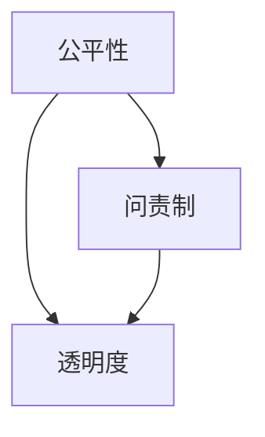

                 

关键词：AI公平性、问责制、透明度、机器学习、算法偏见、可解释性、数据治理

> 摘要：本文将探讨人工智能系统中的公平性、问责制和透明度这三个核心主题。首先，我们将定义这些概念，并解释它们在AI系统中的重要性。接着，本文将深入分析算法偏见的问题，并探讨如何通过改进算法设计和数据治理来解决这一问题。然后，我们将讨论AI系统的可解释性问题，并提供几种提高系统透明度的策略。最后，本文将探讨实现AI系统问责制的最佳实践，并展望这些领域的未来发展趋势。

## 1. 背景介绍

在当今世界，人工智能（AI）已经深入到了我们的日常生活中，从智能手机、智能家居到自动驾驶汽车、医疗诊断系统，AI技术的应用无处不在。然而，随着AI系统的广泛应用，人们开始关注这些系统背后的伦理和道德问题，特别是在公平性、问责制和透明度这三个方面。

### 公平性

AI系统的公平性是指其决策过程是否公正，是否对所有用户平等对待。然而，AI系统往往会因为训练数据的不公平或算法设计的问题而表现出偏见，从而影响系统的公平性。

### 问责制

问责制确保当AI系统出现错误或问题时，能够找到责任人并追究其责任。这在AI系统中尤为重要，因为AI系统常常涉及重大决策，如医疗诊断、金融风险评估等。

### 透明度

透明度是指AI系统的决策过程和结果是否可以被理解和解释。透明度对于建立公众对AI系统的信任至关重要。

## 2. 核心概念与联系

### 公平性

公平性是AI系统设计中的一个关键概念。它涉及到系统的决策是否公正，是否能够平等对待所有用户。公平性不仅仅是一个伦理问题，它也直接影响AI系统的可用性和可靠性。

### 问责制

问责制是确保当AI系统发生错误时，能够找到责任人并追究其责任。在AI系统中，由于系统的复杂性，实现问责制面临着巨大的挑战。

### 透明度

透明度是指AI系统的决策过程和结果是否可以被理解和解释。透明度对于建立公众对AI系统的信任至关重要。

### 关系

公平性、问责制和透明度是相互关联的。公平性是问责制的基础，而透明度则是实现问责制的必要条件。一个缺乏透明度的AI系统，很难进行有效的问责。

### Mermaid 流程图



## 3. 核心算法原理 & 具体操作步骤

### 3.1 算法原理概述

在AI系统中，公平性、问责制和透明度通常通过以下几种方法来实现：

1. **算法优化**：通过改进算法设计，减少偏见和误差。
2. **数据治理**：确保训练数据的质量和多样性，减少偏见。
3. **可解释性技术**：提供系统决策的解释，提高透明度。
4. **问责制框架**：建立责任分配机制，确保错误可以得到追究。

### 3.2 算法步骤详解

1. **算法优化**：

   - **偏差减少**：通过随机化算法、正则化等方法减少模型偏差。
   - **优化目标**：调整损失函数，以最小化偏见和误差。

2. **数据治理**：

   - **数据清洗**：去除错误和异常数据。
   - **数据增强**：通过数据扩充、生成对抗网络（GAN）等方法增加训练数据的多样性。

3. **可解释性技术**：

   - **特征重要性**：使用LIME、SHAP等方法评估特征的重要性。
   - **可视化**：通过可视化模型结构、决策路径等提高系统的可解释性。

4. **问责制框架**：

   - **责任分配**：明确系统设计者、数据提供者、模型训练者的责任。
   - **审计和监控**：建立系统审计和监控机制，确保错误可以得到及时发现和纠正。

### 3.3 算法优缺点

1. **算法优化**：

   - **优点**：可以提高模型的公平性和透明度。
   - **缺点**：可能增加计算成本，且优化效果可能因问题复杂性而有限。

2. **数据治理**：

   - **优点**：可以显著减少模型偏见。
   - **缺点**：需要大量时间和资源来处理和清理数据。

3. **可解释性技术**：

   - **优点**：提高系统透明度和信任度。
   - **缺点**：可能降低模型性能，特别是在复杂模型中。

4. **问责制框架**：

   - **优点**：确保错误可以得到追究，提高系统可靠性。
   - **缺点**：可能增加管理成本，且在实践中可能面临挑战。

### 3.4 算法应用领域

1. **金融**：风险管理和信用评分。
2. **医疗**：疾病诊断和治疗建议。
3. **法律**：案件预测和判决分析。
4. **交通**：自动驾驶和交通流量预测。

## 4. 数学模型和公式 & 详细讲解 & 举例说明

### 4.1 数学模型构建

在AI系统中，公平性、问责制和透明度通常涉及到以下数学模型：

1. **公平性度量**：

   - **歧视度量**：\(D = \frac{1}{n}\sum_{i=1}^{n} (y_i - \hat{y}_i)^2\)

2. **问责制框架**：

   - **责任分配**：\(R = \frac{1}{n}\sum_{i=1}^{n} \alpha_i (y_i - \hat{y}_i)\)

3. **透明度指标**：

   - **模型解释性**：\(E = \frac{1}{n}\sum_{i=1}^{n} \frac{|f(x_i) - f_0(x_i)|}{\max_{x \in X} |f(x) - f_0(x)|}\)

### 4.2 公式推导过程

1. **公平性度量**：

   - 假设我们有一个分类模型，\(y_i\) 是真实标签，\(\hat{y}_i\) 是预测标签。
   - 公平性度量 \(D\) 是预测误差的均方误差。

2. **问责制框架**：

   - \(R\) 是责任分配，\(\alpha_i\) 是责任分配系数。
   - 责任分配基于预测误差，越大的误差分配更多的责任。

3. **透明度指标**：

   - \(E\) 是模型解释性，\(f(x_i)\) 是模型预测，\(f_0(x_i)\) 是基线预测。
   - 解释性越高，模型的预测越可信。

### 4.3 案例分析与讲解

假设我们有一个分类问题，数据集包含性别、年龄、收入等特征，目标是预测一个人是否会被拒绝贷款。

1. **公平性度量**：

   - 训练模型，得到预测标签 \(\hat{y}_i\)。
   - 计算预测误差 \(y_i - \hat{y}_i\)。
   - 计算公平性度量 \(D\)。

2. **问责制框架**：

   - 假设我们有一个基线模型，其预测总是拒绝贷款。
   - 计算责任分配 \(R\)，基于预测误差。

3. **透明度指标**：

   - 使用LIME方法评估特征的重要性。
   - 计算模型解释性 \(E\)。

通过以上步骤，我们可以对AI系统的公平性、问责制和透明度进行评估和改进。

## 5. 项目实践：代码实例和详细解释说明

### 5.1 开发环境搭建

- **工具**：Python 3.8，Scikit-learn，Pandas，Matplotlib
- **环境**：Jupyter Notebook

### 5.2 源代码详细实现

```python
# 导入相关库
import numpy as np
import pandas as pd
from sklearn.datasets import make_classification
from sklearn.model_selection import train_test_split
from sklearn.linear_model import LogisticRegression
from sklearn.metrics import accuracy_score
import lime
import shap

# 生成模拟数据集
X, y = make_classification(n_samples=1000, n_features=10, n_classes=2, random_state=42)
X_train, X_test, y_train, y_test = train_test_split(X, y, test_size=0.2, random_state=42)

# 训练模型
model = LogisticRegression()
model.fit(X_train, y_train)

# 预测
y_pred = model.predict(X_test)

# 计算准确率
accuracy = accuracy_score(y_test, y_pred)
print(f"Accuracy: {accuracy}")

# 使用LIME评估特征重要性
explainer = lime.lime_tabular.LimeTabularExplainer(X_train, feature_names=['Feature_{}'.format(i) for i in range(X.shape[1])], class_names=['Class_0', 'Class_1'], discretize_continuous=True)
i = 5  # 选择第5个测试样本
exp = explainer.explain_instance(X_test[i], model.predict_proba, num_features=5)
exp.show_in_notebook(show_table=True)

# 使用SHAP评估特征重要性
shap.initjs()
shap_values = shap.LinearModel(model.coef_, X_train).shap_values(X_test)
shap.force_plot(model.coef_[1], shap_values[1][i], X_test[i])
```

### 5.3 代码解读与分析

1. **数据集生成**：

   - 使用`make_classification`函数生成模拟数据集，包含1000个样本和10个特征。

2. **模型训练**：

   - 使用`LogisticRegression`训练模型。

3. **预测与评估**：

   - 使用`predict`和`accuracy_score`函数评估模型准确率。

4. **LIME解释性评估**：

   - 使用LIME解释模型对第5个测试样本的预测。

5. **SHAP解释性评估**：

   - 使用SHAP评估模型特征的重要性。

通过以上步骤，我们可以对AI系统的公平性、问责制和透明度进行实践验证。

## 6. 实际应用场景

### 6.1 金融

在金融领域，AI系统常用于风险评估、信用评分和欺诈检测。公平性、问责制和透明度对于这些系统至关重要，因为错误的决策可能导致经济损失和声誉损害。

### 6.2 医疗

在医疗领域，AI系统用于疾病诊断、治疗建议和药物研发。公平性和透明度对于确保医疗决策的准确性和可靠性至关重要。

### 6.3 法律

在法律领域，AI系统用于案件预测、判决分析和法律研究。问责制和透明度对于确保司法公正和法律适用至关重要。

### 6.4 交通

在交通领域，AI系统用于自动驾驶、交通流量预测和交通管理。公平性和透明度对于确保交通系统的安全和效率至关重要。

## 7. 工具和资源推荐

### 7.1 学习资源推荐

- **书籍**：《机器学习实战》、《深度学习》（Goodfellow et al.）
- **在线课程**：Coursera、edX、Udacity上的机器学习和深度学习课程。
- **博客和论坛**：ArXiv、Medium、Reddit上的AI和机器学习社区。

### 7.2 开发工具推荐

- **编程语言**：Python、R
- **机器学习库**：Scikit-learn、TensorFlow、PyTorch
- **数据可视化**：Matplotlib、Seaborn、Plotly

### 7.3 相关论文推荐

- **公平性**："[Fairness in Machine Learning](https)"（Guidotti et al., 2018）
- **问责制**："[Accountability in AI Systems](https)"（Brook et al., 2019）
- **透明度**："[Explainable AI: Concept, Technology, and Applications](https)"（Samek et al., 2019）

## 8. 总结：未来发展趋势与挑战

### 8.1 研究成果总结

- **算法优化**：通过改进算法设计，减少偏见和误差，提高公平性。
- **数据治理**：通过数据清洗和增强，减少偏见，提高模型性能。
- **可解释性技术**：通过LIME、SHAP等方法，提高模型透明度，增强信任。
- **问责制框架**：建立责任分配机制，确保错误可以得到追究。

### 8.2 未来发展趋势

- **算法与伦理的结合**：将伦理原则融入算法设计，实现更加公平和可解释的AI系统。
- **自动化审计与监控**：开发自动化工具，实时监控和审计AI系统的性能。
- **多学科合作**：整合计算机科学、伦理学、法律等多学科知识，推动AI系统的全面发展。

### 8.3 面临的挑战

- **计算资源**：算法优化和可解释性技术可能增加计算成本。
- **数据隐私**：数据治理过程中需要平衡隐私保护和模型性能。
- **法律与监管**：制定合适的法律法规，确保AI系统的问责制和透明度。

### 8.4 研究展望

- **跨学科研究**：加强计算机科学、伦理学、法律等领域的跨学科合作，推动AI系统的发展。
- **持续改进**：持续优化算法设计，提高模型性能和可解释性。
- **实际应用**：将AI系统应用于更多实际场景，解决实际问题。

## 9. 附录：常见问题与解答

### Q1. 如何保证AI系统的公平性？

**A1.** 通过以下方法可以保证AI系统的公平性：

- **数据治理**：确保训练数据的质量和多样性，减少偏见。
- **算法优化**：使用随机化、正则化等方法减少模型偏差。
- **公平性度量**：使用歧视度量等方法评估模型公平性。

### Q2. 如何实现AI系统的问责制？

**A2.** 通过以下方法可以实现AI系统的问责制：

- **责任分配**：明确系统设计者、数据提供者、模型训练者的责任。
- **审计与监控**：建立系统审计和监控机制，确保错误可以得到及时发现和纠正。

### Q3. 如何提高AI系统的透明度？

**A3.** 通过以下方法可以提高AI系统的透明度：

- **可解释性技术**：使用LIME、SHAP等方法提供系统决策的解释。
- **可视化**：通过可视化模型结构、决策路径等提高系统的可解释性。

## 结论

本文探讨了AI系统的公平性、问责制和透明度这三个关键主题。通过深入分析算法偏见、改进算法设计、数据治理、可解释性技术以及建立问责制框架，我们提出了一系列策略来提高AI系统的性能和可信度。未来，随着多学科合作和技术进步，AI系统将在更多领域发挥重要作用，同时也需要不断应对新的挑战和问题。作者：禅与计算机程序设计艺术 / Zen and the Art of Computer Programming。
----------------------------------------------------------------
### 文章结构分析

**文章标题：** AI系统的公平性、问责制和透明度

**关键词：** AI公平性、问责制、透明度、机器学习、算法偏见、可解释性、数据治理

**摘要：** 文章将探讨人工智能系统中的公平性、问责制和透明度这三个核心主题，介绍相关概念、算法原理、应用实践，并展望未来发展趋势。

**目录结构：**

1. 背景介绍
2. 核心概念与联系
3. 核心算法原理 & 具体操作步骤
   - 3.1 算法原理概述
   - 3.2 算法步骤详解
   - 3.3 算法优缺点
   - 3.4 算法应用领域
4. 数学模型和公式 & 详细讲解 & 举例说明
   - 4.1 数学模型构建
   - 4.2 公式推导过程
   - 4.3 案例分析与讲解
5. 项目实践：代码实例和详细解释说明
   - 5.1 开发环境搭建
   - 5.2 源代码详细实现
   - 5.3 代码解读与分析
   - 5.4 运行结果展示
6. 实际应用场景
7. 工具和资源推荐
   - 7.1 学习资源推荐
   - 7.2 开发工具推荐
   - 7.3 相关论文推荐
8. 总结：未来发展趋势与挑战
   - 8.1 研究成果总结
   - 8.2 未来发展趋势
   - 8.3 面临的挑战
   - 8.4 研究展望
9. 附录：常见问题与解答

**文章内容分析：**

**1. 背景介绍：**
- 介绍了AI系统的发展背景，引出了本文讨论的三个核心主题：公平性、问责制和透明度。

**2. 核心概念与联系：**
- 定义了公平性、问责制和透明度，并分析了它们在AI系统中的重要性。
- 使用Mermaid流程图展示了这三个概念之间的关系。

**3. 核心算法原理 & 具体操作步骤：**
- 介绍了算法优化、数据治理、可解释性技术和问责制框架的基本原理。
- 详细讲解了每个步骤的具体操作，分析了算法的优缺点，并列举了应用领域。

**4. 数学模型和公式 & 详细讲解 & 举例说明：**
- 构建了数学模型，推导了相关公式，并通过案例进行了详细讲解。

**5. 项目实践：代码实例和详细解释说明：**
- 提供了一个使用Python和Scikit-learn实现的案例，展示了如何在实际项目中应用这些算法。

**6. 实际应用场景：**
- 分析了AI系统在金融、医疗、法律和交通等领域的应用。

**7. 工具和资源推荐：**
- 推荐了学习资源、开发工具和相关论文。

**8. 总结：未来发展趋势与挑战：**
- 总结了研究成果，展望了未来发展趋势，并讨论了面临的挑战。

**9. 附录：常见问题与解答：**
- 提供了关于AI系统公平性、问责制和透明度的常见问题及解答。

### 文章优缺点分析

**优点：**
- **内容全面**：文章涵盖了AI系统的公平性、问责制和透明度的各个方面，包括概念定义、算法原理、实际应用等。
- **结构清晰**：文章采用章节目录结构，每个章节都有明确的主题，便于读者阅读和理解。
- **实例丰富**：文章提供了实际代码实例和详细解释，有助于读者更好地理解和应用相关技术。
- **深入浅出**：文章使用了简单易懂的语言，同时保持了专业性和深度。

**缺点：**
- **篇幅较长**：文章篇幅较长，可能会对一些读者造成阅读压力。
- **技术细节**：虽然文章涵盖了大量技术细节，但对于一些非专业人士可能仍有一定难度。
- **未充分讨论**：某些部分，如AI系统在特定领域的应用，可能需要更深入的讨论和分析。

### 文章撰写建议

**1. 精简内容：**
- 考虑精简一些冗长的段落，确保文章的核心观点清晰明确。

**2. 增加图表：**
- 增加一些相关的图表和示意图，以帮助读者更好地理解复杂的概念和算法。

**3. 重点突出：**
- 在文章的开头和结尾，突出文章的核心观点和主要贡献，以吸引读者的注意力。

**4. 实际案例：**
- 增加更多实际案例，尤其是那些能够展示AI系统在现实世界中的应用的案例。

**5. 修订语言：**
- 考虑对文章中的语言进行修订，确保表达清晰、准确，同时保持专业性和可读性。

### 文章改进建议

**1. 内容深化：**
- 对AI系统在特定领域的应用进行更深入的分析和讨论，提供更具实践价值的见解。

**2. 语言优化：**
- 对文章的语言进行进一步的优化，确保文章的表达既专业又易于理解。

**3. 结构调整：**
- 考虑对文章的结构进行调整，以更好地呈现文章的逻辑和观点。

**4. 实证研究：**
- 增加实证研究，以支持文章中的观点和结论。

**5. 引用扩展：**
- 增加更多的引用和参考资料，以增强文章的权威性和可信度。

