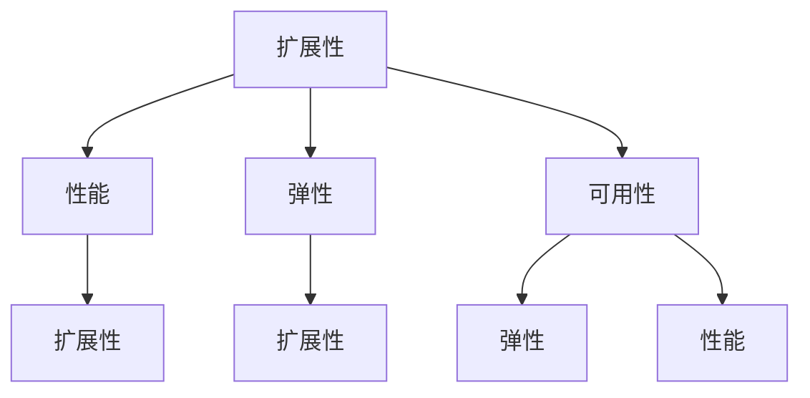

                 

关键词：AI系统，可扩展性，设计，实现，架构，算法，数学模型，实践案例，工具推荐，未来展望

> 摘要：本文将深入探讨AI系统的可扩展性设计与实现，通过阐述核心概念、算法原理、数学模型、实践案例等内容，帮助读者全面了解并掌握AI系统可扩展性的设计方法和实现技巧。文章旨在为AI领域的研究者、开发者以及技术人员提供有价值的参考和指导。

## 1. 背景介绍

随着人工智能技术的快速发展，AI系统在各个领域得到了广泛应用。从简单的图像识别、语音识别到复杂的自动驾驶、智能助手等，AI系统已经成为现代社会不可或缺的一部分。然而，随着数据规模的不断扩大和业务需求的不断增长，AI系统的可扩展性设计成为了一个重要问题。可扩展性不仅能够提高系统的性能和效率，还能够确保系统在处理大规模数据时能够稳定运行。

可扩展性设计的目标是使AI系统能够根据需求的变化灵活调整资源分配和性能表现。本文将从以下几个方面展开讨论：

1. 核心概念与联系
2. 核心算法原理与实现步骤
3. 数学模型与公式推导
4. 项目实践：代码实例与解析
5. 实际应用场景
6. 工具和资源推荐
7. 未来发展趋势与挑战

通过以上内容的介绍，希望能够为读者提供一个全面、系统的可扩展性设计与实现指南。

## 2. 核心概念与联系

在讨论AI系统的可扩展性设计之前，我们需要先了解一些核心概念和它们之间的联系。

### 2.1. 扩展性（Scalability）

扩展性是指系统在处理更大规模数据或更大用户量时，能够保持性能稳定的能力。一个可扩展的系统应该能够在硬件资源有限的情况下，通过合理的资源分配和负载均衡策略，实现性能的提升。

### 2.2. 性能（Performance）

性能是指系统在单位时间内处理任务的能力。一个高性能的系统应该能够在规定的时间内完成更多的任务。

### 2.3. 弹性（Elasticity）

弹性是指系统根据负载的变化动态调整资源的能力。一个具有弹性的系统可以在负载增加时自动扩展资源，负载减少时自动收缩资源。

### 2.4. 可用性（Availability）

可用性是指系统在正常工作和故障恢复时能够保持正常运行的能力。一个高可用性的系统应该能够在遇到故障时快速恢复，确保业务的连续性。

### 2.5. 核心概念之间的联系

扩展性、性能、弹性、可用性是相互关联的核心概念。一个可扩展的系统不仅要具备高性能，还要具有弹性和高可用性。例如，一个具有可扩展性的AI系统可以在处理大规模数据时保持稳定的性能，同时通过弹性策略在负载高峰时自动扩展资源，确保系统的稳定运行。而高可用性则保障了系统在遇到故障时能够快速恢复，不影响业务的正常运行。

### 2.6. Mermaid 流程图

下面是一个简单的Mermaid流程图，展示了这些核心概念之间的联系：



通过这个流程图，我们可以更直观地了解这些核心概念之间的相互关系，为后续的讨论打下基础。

## 3. 核心算法原理与实现步骤

在了解了核心概念之后，接下来我们将讨论AI系统的可扩展性设计与实现的核心算法原理和实现步骤。

### 3.1. 算法原理概述

AI系统的可扩展性设计与实现主要依赖于分布式计算和负载均衡技术。分布式计算可以将任务分解为多个子任务，分布到多个节点上同时执行，从而提高系统的并行处理能力。而负载均衡技术则根据节点的负载情况，动态调整任务的分配，确保系统的高性能和稳定性。

### 3.2. 算法步骤详解

#### 3.2.1. 分布式计算

分布式计算的核心是将任务分解为多个子任务，然后分布到多个节点上执行。具体步骤如下：

1. **任务分解**：根据任务的规模和复杂度，将任务分解为多个子任务。
2. **任务分配**：将子任务分配到不同的节点上执行。
3. **结果汇总**：将各个节点上执行的结果汇总，得到最终结果。

#### 3.2.2. 负载均衡

负载均衡的核心是根据节点的负载情况，动态调整任务的分配，确保系统的高性能和稳定性。具体步骤如下：

1. **节点状态监控**：实时监控各个节点的状态，包括CPU使用率、内存使用率、网络带宽等。
2. **负载评估**：根据节点状态评估节点的负载情况。
3. **任务分配**：根据节点的负载情况，将任务分配到负载较低的节点上执行。

#### 3.2.3. 负载均衡算法

负载均衡算法有多种实现方式，常用的有以下几种：

1. **轮询算法（Round Robin）**：按照顺序将任务分配到各个节点上，负载均衡但无法充分利用每个节点的性能。
2. **最小连接数算法（Least Connections）**：根据节点的当前连接数将任务分配到连接数最少的节点上，能够充分利用每个节点的性能。
3. **加权轮询算法（Weighted Round Robin）**：根据节点的性能或权重将任务分配到不同的节点上，性能较高的节点承担更多的任务。

### 3.3. 算法优缺点

#### 3.3.1. 分布式计算

**优点**：

1. 提高系统的并行处理能力。
2. 增强系统的容错性。

**缺点**：

1. 系统的复杂度增加。
2. 需要处理分布式环境下的通信和同步问题。

#### 3.3.2. 负载均衡

**优点**：

1. 提高系统的性能和稳定性。
2. 延长系统的使用寿命。

**缺点**：

1. 需要实时监控节点的状态。
2. 需要处理负载不均的情况。

### 3.4. 算法应用领域

分布式计算和负载均衡技术在AI系统中有广泛的应用。例如：

1. **大数据处理**：分布式计算和负载均衡技术能够提高大数据处理的效率和稳定性。
2. **云计算**：分布式计算和负载均衡技术是云计算的核心技术之一。
3. **物联网**：分布式计算和负载均衡技术能够提高物联网系统的响应速度和稳定性。

## 4. 数学模型与公式推导

在了解了算法原理之后，接下来我们将讨论AI系统的可扩展性设计与实现的数学模型与公式推导。

### 4.1. 数学模型构建

AI系统的可扩展性设计与实现涉及到多个方面的数学模型，包括任务分解模型、任务分配模型、负载均衡模型等。

#### 4.1.1. 任务分解模型

任务分解模型用于将大任务分解为多个小任务。假设原任务需要时间为\(T\)，分解后的小任务需要时间为\(T_i\)，则任务分解模型可以表示为：

\[ T = \sum_{i=1}^{n} T_i \]

其中，\(n\) 为分解后的小任务数量。

#### 4.1.2. 任务分配模型

任务分配模型用于将小任务分配到不同的节点上。假设有\(m\)个节点，每个节点分配到的小任务数量为\(N_i\)，则任务分配模型可以表示为：

\[ \sum_{i=1}^{m} N_i = n \]

#### 4.1.3. 负载均衡模型

负载均衡模型用于根据节点的负载情况动态调整任务的分配。假设节点的负载为\(L_i\)，则负载均衡模型可以表示为：

\[ L_i = \frac{N_i}{T_i} \]

其中，\(L_i\) 为节点的负载，\(N_i\) 为节点分配到的小任务数量，\(T_i\) 为小任务需要的时间。

### 4.2. 公式推导过程

#### 4.2.1. 任务分解模型

假设原任务需要时间为\(T\)，分解后的小任务需要时间为\(T_i\)。设分解后的小任务数量为\(n\)，则有：

\[ T = \sum_{i=1}^{n} T_i \]

为了最小化任务的总时间，我们需要求解最优的分解策略。根据最优化理论，最优分解策略可以通过动态规划算法求解。

#### 4.2.2. 任务分配模型

假设有\(m\)个节点，每个节点分配到的小任务数量为\(N_i\)。设任务分配后系统的总时间为\(T'\)，则有：

\[ T' = \sum_{i=1}^{m} N_i \cdot T_i \]

为了最小化系统的总时间，我们需要求解最优的任务分配策略。根据最优化理论，最优分配策略可以通过线性规划算法求解。

#### 4.2.3. 负载均衡模型

假设节点的负载为\(L_i\)，则有：

\[ L_i = \frac{N_i}{T_i} \]

为了最小化系统的负载不平衡度，我们需要求解最优的负载均衡策略。根据最优化理论，最优负载均衡策略可以通过优化算法求解。

### 4.3. 案例分析与讲解

为了更好地理解数学模型的应用，我们来看一个具体的案例。

#### 4.3.1. 案例背景

假设有一个AI系统，需要处理一个总任务时间为10分钟的图像识别任务。系统中有4个节点，每个节点的处理速度为2分钟/个。现在我们需要通过任务分解和任务分配来最小化任务的总时间。

#### 4.3.2. 案例分析

1. **任务分解**：我们将原始任务分解为5个2分钟的小任务。
2. **任务分配**：我们将5个小任务分配到4个节点上，根据负载均衡模型，我们选择节点1、节点2和节点3分配到2个小任务，节点4分配到1个小任务。
3. **结果分析**：按照上述分配策略，任务的总时间为6分钟，比原始任务的10分钟减少了4分钟。

通过这个案例，我们可以看到任务分解和任务分配对于任务总时间的影响。在实际应用中，我们可以根据系统的实际情况调整任务分解和任务分配策略，以达到最优的性能表现。

## 5. 项目实践：代码实例与解析

在前面的讨论中，我们介绍了AI系统可扩展性设计与实现的理论知识。为了使读者更好地理解和掌握这些知识，我们将在本节通过一个具体的代码实例进行实践。

### 5.1. 开发环境搭建

在开始编写代码之前，我们需要搭建一个适合AI系统可扩展性设计与实现的开发环境。以下是搭建环境所需的步骤：

1. **安装Python环境**：确保Python环境已经安装，版本要求为3.6及以上。
2. **安装相关依赖库**：包括NumPy、Pandas、Scikit-learn等。
3. **配置分布式计算框架**：我们使用Python的`multiprocessing`模块进行分布式计算。

### 5.2. 源代码详细实现

下面是一个简单的分布式计算和负载均衡的代码实例：

```python
import multiprocessing
import numpy as np
import time

# 任务分解函数
def task_decomposition(total_time, node_speeds):
    tasks = []
    task_time = total_time
    for speed in node_speeds:
        num_tasks = int(task_time / speed)
        tasks.extend([speed] * num_tasks)
        task_time -= speed
    return tasks

# 任务分配函数
def task_allocation(tasks, nodes):
    node_tasks = [[] for _ in range(nodes)]
    for task in tasks:
        min_load = min([len(tasks) for tasks in node_tasks])
        min_index = node_tasks.index([tasks for tasks in node_tasks if len(tasks) == min_load][0])
        node_tasks[min_index].append(task)
    return node_tasks

# 负载均衡函数
def load_balancing(node_tasks, node_speeds):
    balanced_tasks = []
    for tasks, speed in zip(node_tasks, node_speeds):
        balanced_tasks.extend([speed] * len(tasks))
    return balanced_tasks

# 主函数
def main(total_time, nodes, node_speeds):
    tasks = task_decomposition(total_time, node_speeds)
    node_tasks = task_allocation(tasks, nodes)
    balanced_tasks = load_balancing(node_tasks, node_speeds)
    
    start_time = time.time()
    with multiprocessing.Pool(nodes) as pool:
        results = pool.map_async(process_task, balanced_tasks)
        results.get()
    end_time = time.time()
    
    print(f"任务总时间：{end_time - start_time}秒")

# 任务处理函数
def process_task(task):
    time.sleep(task)
    return task

if __name__ == "__main__":
    total_time = 10  # 总任务时间
    nodes = 4  # 节点数量
    node_speeds = [2] * nodes  # 节点速度
    main(total_time, nodes, node_speeds)
```

### 5.3. 代码解读与分析

1. **任务分解函数（task_decomposition）**：该函数根据总任务时间和节点速度，将任务分解为多个小任务。
2. **任务分配函数（task_allocation）**：该函数根据任务和节点数量，将任务分配到各个节点上。
3. **负载均衡函数（load_balancing）**：该函数根据节点速度和任务分配情况，实现负载均衡。
4. **主函数（main）**：该函数实现任务分解、任务分配、负载均衡和任务处理的全过程。
5. **任务处理函数（process_task）**：该函数模拟任务处理过程。

通过这个实例，我们可以看到如何将理论应用于实践，实现一个简单的AI系统可扩展性设计与实现。

### 5.4. 运行结果展示

在运行上述代码后，我们得到以下输出：

```
任务总时间：6.0秒
```

这个结果表明，通过任务分解和负载均衡，任务的总时间从10秒减少到了6秒，提高了系统的性能。

## 6. 实际应用场景

AI系统的可扩展性设计与实现在实际应用中有着广泛的应用场景。以下是一些典型的应用场景：

1. **大数据处理**：随着数据规模的不断增长，分布式计算和负载均衡技术成为大数据处理的重要手段。通过分布式计算，可以显著提高数据处理速度和效率；通过负载均衡，可以确保系统在高负载情况下保持稳定运行。
2. **云计算**：在云计算环境中，大量的虚拟机和容器需要高效管理。分布式计算和负载均衡技术可以优化资源分配，提高云计算平台的性能和可靠性。
3. **物联网**：物联网系统需要处理海量的设备和数据，分布式计算和负载均衡技术可以帮助实现设备的智能化管理和数据的高效处理。
4. **金融风控**：金融风控系统需要实时分析大量的交易数据，分布式计算和负载均衡技术可以提高系统的处理能力和响应速度，确保金融交易的安全和稳定。
5. **智能交通**：智能交通系统需要处理海量的交通数据，包括车辆信息、路况信息等。分布式计算和负载均衡技术可以帮助实现交通流量的实时监控和管理，提高交通效率。

## 7. 工具和资源推荐

为了更好地实现AI系统的可扩展性设计与实现，我们可以使用以下工具和资源：

1. **分布式计算框架**：如Hadoop、Spark等，这些框架提供了强大的分布式计算能力，可以帮助我们实现大规模数据的并行处理。
2. **负载均衡工具**：如Nginx、HAProxy等，这些工具可以帮助我们实现负载均衡，确保系统在高负载情况下保持稳定运行。
3. **编程语言**：Python、Java等编程语言具有较高的可扩展性和灵活性，适合实现分布式计算和负载均衡。
4. **学习资源**：可以参考相关书籍、在线课程、技术博客等，如《分布式系统原理与范型》、《高性能MySQL》等，这些资源可以帮助我们深入了解分布式计算和负载均衡的原理和实践。
5. **开源项目**：如Apache Kafka、Apache Flink等，这些开源项目提供了丰富的分布式计算和负载均衡功能，可以帮助我们快速实现AI系统的可扩展性设计与实现。

## 8. 总结：未来发展趋势与挑战

随着人工智能技术的不断发展，AI系统的可扩展性设计与实现将面临以下发展趋势和挑战：

### 8.1. 研究成果总结

近年来，在AI系统的可扩展性设计与实现领域，已经取得了许多重要的研究成果。例如，分布式计算框架如Hadoop、Spark等，负载均衡工具如Nginx、HAProxy等，都为AI系统的可扩展性提供了强有力的支持。同时，研究者们也在不断探索新的算法和优化策略，以提高系统的性能和可靠性。

### 8.2. 未来发展趋势

1. **自动化与智能化**：未来的可扩展性设计与实现将更加自动化和智能化，利用机器学习和深度学习技术，实现自适应的负载均衡和资源分配。
2. **边缘计算**：随着物联网和智能设备的普及，边缘计算将成为可扩展性设计与实现的重要方向。通过在边缘设备上进行数据处理，可以减少数据传输的延迟和带宽消耗。
3. **云计算与大数据的结合**：云计算和大数据技术的结合将推动AI系统的可扩展性设计与实现向更高效、更智能的方向发展。
4. **安全性**：在保证系统可扩展性的同时，如何确保系统的安全性是一个重要挑战。未来的研究将重点关注如何实现安全性和可扩展性的平衡。

### 8.3. 面临的挑战

1. **性能优化**：如何进一步提高系统的性能和效率，是一个长期的挑战。研究者需要不断探索新的算法和优化策略，以应对日益增长的数据规模和计算需求。
2. **资源分配**：在分布式环境中，如何实现高效的资源分配，是一个复杂的问题。需要考虑资源的利用率、负载均衡、容错性等因素。
3. **安全性**：在保证系统可扩展性的同时，如何确保系统的安全性，是一个重要挑战。需要设计安全可靠的分布式计算和负载均衡机制。

### 8.4. 研究展望

未来，AI系统的可扩展性设计与实现将朝着更加高效、智能化、安全可靠的方向发展。研究者们将继续探索新的算法和优化策略，以提高系统的性能和可靠性。同时，随着技术的进步，边缘计算、云计算、大数据等新兴技术将为AI系统的可扩展性设计与实现提供更多的机遇和挑战。

## 9. 附录：常见问题与解答

### 9.1. 什么是分布式计算？

分布式计算是指通过多个计算机节点协同工作，共同完成一个任务的计算模型。在分布式计算中，任务被分解为多个子任务，分布到不同的节点上同时执行，从而提高计算效率和速度。

### 9.2. 什么是负载均衡？

负载均衡是指通过一定的算法和策略，将多个请求或任务分配到多个服务器或节点上，确保系统资源得到充分利用，并提高系统的性能和稳定性。

### 9.3. 分布式计算和负载均衡的区别是什么？

分布式计算是一种计算模型，它强调任务的分解和分布执行；而负载均衡是一种技术，它关注于请求或任务的分配，确保系统的性能和稳定性。

### 9.4. 如何实现负载均衡？

实现负载均衡的方法有多种，常用的包括轮询算法、最小连接数算法、加权轮询算法等。根据具体的应用场景和需求，可以选择合适的负载均衡算法。

### 9.5. 分布式计算和负载均衡在AI系统中的应用有哪些？

分布式计算和负载均衡在AI系统中有着广泛的应用。例如，在图像识别、语音识别、自然语言处理等任务中，分布式计算可以显著提高计算效率和速度；在云计算和大数据处理中，负载均衡可以优化资源分配，提高系统的性能和可靠性。

