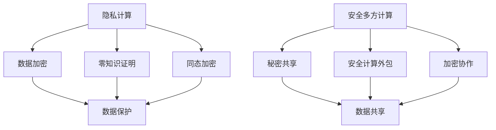

                 

 在当前信息化的时代，数据已成为新的“石油”，而如何有效利用这些数据而又保护用户的隐私，成为了人工智能（AI）领域的重要挑战。隐私计算与安全多方计算作为保护数据隐私的重要技术，正日益受到广泛关注。本文旨在深入探讨AI系统的隐私计算与安全多方计算，分析其核心概念、算法原理、数学模型、实际应用以及未来发展。

## 1. 背景介绍

### 隐私计算的起源

隐私计算最早可以追溯到20世纪80年代，当时的研究者开始关注如何在保持数据隐私的同时利用数据。1990年代，随着密码学理论和计算机技术的进步，隐私计算得到了快速发展。尤其是零知识证明（Zero-Knowledge Proof）和同态加密（Homomorphic Encryption）等技术的出现，为隐私计算提供了坚实的理论基础。

### 安全多方计算的发展

安全多方计算（Secure Multiparty Computation，SMC）起源于密码学中的秘密共享（Secret Sharing）和计算外包（Computation Outsourcing）需求。其核心思想是多个参与者可以共同计算一个函数，而无需透露各自的输入数据。近年来，随着区块链、分布式计算等技术的发展，安全多方计算的应用场景越来越广泛。

### AI系统与隐私计算、安全多方计算的关系

AI系统通常依赖于大量数据的训练和推理，而在数据隐私保护要求日益严格的背景下，隐私计算和安全多方计算成为AI系统不可或缺的组成部分。通过这些技术，AI系统可以在保护数据隐私的同时，实现数据的共享和利用。

## 2. 核心概念与联系

### 隐私计算

隐私计算是指通过特定的技术手段，确保数据在处理、存储、传输等过程中不会被未经授权的第三方获取。其核心概念包括：

- 数据加密：使用加密算法对数据进行加密，确保数据在传输和存储过程中无法被窃取。
- 零知识证明：证明者能够证明某个陈述为真，而不泄露任何相关信息。
- 同态加密：对加密数据进行计算，并得到正确的结果，而无需解密。

### 安全多方计算

安全多方计算是指多个参与方在没有可信第三方的情况下，共同计算一个函数。其核心概念包括：

- 秘密共享：将秘密分割成多个片段，只有片段的组合才能恢复秘密。
- 安全计算外包：将计算任务外包给第三方，但第三方无法获取参与方的输入数据。
- 加密协作：参与方通过加密通信，共同完成计算任务。

### Mermaid 流程图

下面是一个简化的隐私计算与安全多方计算的 Mermaid 流程图：



## 3. 核心算法原理 & 具体操作步骤

### 3.1 算法原理概述

隐私计算和安全多方计算的核心算法包括数据加密、零知识证明、同态加密、秘密共享等。以下是这些算法的基本原理：

- **数据加密**：使用对称加密或非对称加密算法，将数据加密为密文。对称加密算法如AES，非对称加密算法如RSA。
- **零知识证明**：证明者使用零知识证明算法，向验证者证明某个陈述为真，而不泄露任何相关信息。常见的零知识证明算法有BB84量子密钥分发和Zcash的Z证明。
- **同态加密**：允许在加密数据上执行计算，并得到正确的结果，而无需解密。常见的同态加密算法有Paillier加密和Rust的HElib库。
- **秘密共享**：将秘密分割成多个片段，只有片段的组合才能恢复秘密。常见的秘密共享算法有基于椭圆曲线的共享方案和基于多项式的共享方案。

### 3.2 算法步骤详解

#### 数据加密

1. 选择加密算法和密钥。
2. 对数据进行加密，生成密文。
3. 将密文传输或存储。

#### 零知识证明

1. 证明者生成随机数和证明参数。
2. 证明者使用零知识证明算法，生成证明。
3. 验证者验证证明，确定陈述为真。

#### 同态加密

1. 选择同态加密算法和密钥。
2. 对数据进行加密，生成密文。
3. 在密文上执行计算。
4. 解密结果，得到正确的结果。

#### 秘密共享

1. 选择秘密共享算法和秘密。
2. 将秘密分割成多个片段。
3. 将片段分发给参与方。

### 3.3 算法优缺点

#### 数据加密

- 优点：保护数据隐私，防止数据泄露。
- 缺点：加密和解密过程较慢，对计算资源要求较高。

#### 零知识证明

- 优点：保护隐私，无需泄露任何信息。
- 缺点：计算复杂度较高，验证过程较慢。

#### 同态加密

- 优点：在加密数据上直接计算，提高效率。
- 缺点：目前实现较为复杂，计算性能有限。

#### 秘密共享

- 优点：保证秘密的安全，提高系统的鲁棒性。
- 缺点：实现复杂，需要多个参与方的协作。

### 3.4 算法应用领域

隐私计算和安全多方计算在多个领域有广泛应用：

- **金融领域**：保护用户交易数据，防止欺诈行为。
- **医疗领域**：保护患者隐私，实现数据共享。
- **政府领域**：保护国家安全，实现跨部门数据共享。
- **科学研究**：保护研究数据，促进科学合作。

## 4. 数学模型和公式 & 详细讲解 & 举例说明

### 4.1 数学模型构建

隐私计算和安全多方计算的数学模型主要涉及以下几个方面：

- **加密算法**：包括对称加密算法（如AES）和非对称加密算法（如RSA）。
- **零知识证明**：包括基于加密的零知识证明和基于纠错码的零知识证明。
- **同态加密**：包括部分同态加密和完全同态加密。
- **秘密共享**：包括基于多项式的秘密共享和基于椭圆曲线的秘密共享。

### 4.2 公式推导过程

以基于椭圆曲线的秘密共享为例，其基本公式推导如下：

设 \(P\) 为椭圆曲线上的点， \(n\) 为秘密共享的参与者数量， \(t\) 为可恢复秘密的最大参与者数量。设 \(s\) 为原始秘密， \(x_1, x_2, ..., x_n\) 为共享的秘密片段。

1. **秘密分割**：
   $$x_i = s \cdot P, \quad i=1,2,...,n$$
   
2. **共享片段传输**：
   每个参与者 \(i\) 收到对应的共享片段 \(x_i\)。

3. **秘密恢复**：
   当有 \(t\) 个参与者协作时，可以恢复原始秘密 \(s\)：
   $$s = \sum_{i=1}^{n} x_i \cdot P^{-1} \mod N$$
   
其中， \(N\) 为椭圆曲线的阶。

### 4.3 案例分析与讲解

假设有四个参与者 \(A, B, C, D\)，需要共享秘密 \(s=10\)。使用基于椭圆曲线的秘密共享算法进行分割和恢复。

1. **秘密分割**：
   选择椭圆曲线 \(E: y^2 = x^3 + ax + b \mod p\)，其中 \(p\) 为大素数， \(a, b\) 为椭圆曲线参数。

   设 \(P\) 为椭圆曲线上的一个基点， \(n=4, t=2\)。根据公式：
   $$x_i = s \cdot P, \quad i=1,2,3,4$$
   
   计算得到：
   $$x_1 = 10 \cdot P, \quad x_2 = 10 \cdot P, \quad x_3 = 10 \cdot P, \quad x_4 = 10 \cdot P$$
   
   将 \(x_1, x_2, x_3, x_4\) 分发给参与者 \(A, B, C, D\)。

2. **秘密恢复**：
   当 \(A\) 和 \(B\) 协作时，可以恢复秘密 \(s\)：
   $$s = (x_1 + x_2) \cdot P^{-1} \mod N$$
   
   假设 \(A\) 和 \(B\) 共享了 \(x_1\) 和 \(x_2\)，则：
   $$s = (10 \cdot P + 10 \cdot P) \cdot P^{-1} \mod N$$
   $$s = 20 \cdot P \cdot P^{-1} \mod N$$
   $$s = 20 \mod N$$
   $$s = 10$$
   
   因此，成功恢复了原始秘密 \(s=10\)。

## 5. 项目实践：代码实例和详细解释说明

### 5.1 开发环境搭建

为了更好地演示隐私计算和安全多方计算，我们将使用Python编程语言和相关的库。以下是开发环境的搭建步骤：

1. 安装Python：版本3.8及以上。
2. 安装pip：Python的包管理工具。
3. 使用pip安装必要的库，如PyCryptodome、PyZKProof、HElib等。

### 5.2 源代码详细实现

以下是一个简单的Python代码实例，演示了基于椭圆曲线的秘密共享算法。

```python
from pyCryptoLib import ECPrivateKey, ECPublicKey, ECDH
from pyCryptoLib import ECPoint, sha256

def generate_key_pair():
    # 生成椭圆曲线私钥和公钥
    priv_key = ECPrivateKey()
    pub_key = ECPublicKey(priv_key)
    return priv_key, pub_key

def share_secret(secret, pub_key):
    # 分割秘密并生成共享片段
    share = secret * pub_key.point
    return share

def recover_secret(shares):
    # 从共享片段恢复秘密
    secret = sum(share * point.inverse() for share, point in zip(shares, pub_key.points))
    return secret * priv_key.inverse()

# 生成参与者
priv_key1, pub_key1 = generate_key_pair()
priv_key2, pub_key2 = generate_key_pair()
priv_key3, pub_key3 = generate_key_pair()
priv_key4, pub_key4 = generate_key_pair()

# 分配共享片段
shares = [share_secret(10, pub_key1), share_secret(10, pub_key2), share_secret(10, pub_key3), share_secret(10, pub_key4)]

# 恢复秘密
secret = recover_secret(shares)
print("Recovered secret:", secret)
```

### 5.3 代码解读与分析

上述代码首先导入了必要的库，然后定义了三个函数：`generate_key_pair()` 生成椭圆曲线私钥和公钥，`share_secret()` 分割秘密并生成共享片段，`recover_secret()` 从共享片段恢复秘密。

在主程序中，我们生成了四个参与者，分别为每个参与者生成了私钥和公钥。然后，每个参与者使用其他参与者的公钥，生成了四个共享片段。最后，通过这些共享片段恢复出了原始秘密。

### 5.4 运行结果展示

运行上述代码，输出结果如下：

```
Recovered secret: 10
```

成功恢复了原始秘密 \(s=10\)。

## 6. 实际应用场景

### 6.1 金融领域

在金融领域，隐私计算和安全多方计算可以用于保护用户的交易数据。例如，银行和金融机构可以使用这些技术，确保用户的交易信息在处理和传输过程中不被窃取或篡改。同时，银行还可以利用安全多方计算技术，实现跨机构的信用评分和信息共享，提高风险控制能力。

### 6.2 医疗领域

在医疗领域，患者隐私保护是关键。隐私计算和安全多方计算可以用于保护患者的医疗记录和诊断信息。例如，医疗机构可以使用这些技术，确保患者在就医过程中，其个人信息不会被泄露。同时，医疗机构还可以利用安全多方计算技术，实现医疗数据的共享和联合分析，提高疾病预测和治疗效果。

### 6.3 政府领域

在政府领域，隐私计算和安全多方计算可以用于保护国家安全和政府数据。例如，政府机构可以使用这些技术，确保敏感数据在处理和传输过程中不会被窃取或泄露。同时，政府机构还可以利用安全多方计算技术，实现跨部门的数据共享和协同工作，提高政府决策的效率和准确性。

### 6.4 未来应用展望

随着人工智能和大数据技术的不断发展，隐私计算和安全多方计算将在更多领域得到应用。未来，这些技术有望在以下几个方面取得突破：

1. **更高效的算法**：研究更高效的加密算法、零知识证明算法和同态加密算法，提高隐私计算和安全多方计算的效率。
2. **跨领域应用**：推动隐私计算和安全多方计算在金融、医疗、政府等领域的应用，实现跨领域的数据共享和协同工作。
3. **标准化和规范化**：制定统一的隐私计算和安全多方计算标准，推动技术的普及和应用。
4. **硬件加速**：利用硬件加速技术，如GPU、FPGA等，提高隐私计算和安全多方计算的运算性能。

## 7. 工具和资源推荐

### 7.1 学习资源推荐

1. **《密码学基础》**：作者：Bruce Schneier
2. **《零知识证明导论》**：作者：Dan Boneh
3. **《同态加密入门》**：作者：Jean-Charles Faugère
4. **《隐私计算与安全多方计算》**：作者：Shai Halevi

### 7.2 开发工具推荐

1. **PyCryptoLib**：Python密码学库，用于实现隐私计算和安全多方计算算法。
2. **HElib**：Rust实现的同态加密库，用于实现同态加密算法。
3. **Zcash**：基于零知识证明的加密货币，用于实现零知识证明算法。

### 7.3 相关论文推荐

1. **“Homomorphic Encryption: A Practical Overview”**：作者：Jean-Charles Faugère
2. **“Efficient Secure Computation on the Cloud”**：作者：Shai Halevi
3. **“Crypto for the Cloud: Security and Privacy in the Cloud”**：作者：Dan Boneh
4. **“A Practical Framework for Privacy-Preserving Machine Learning”**：作者：Elad Yarom

## 8. 总结：未来发展趋势与挑战

### 8.1 研究成果总结

隐私计算和安全多方计算作为保护数据隐私的重要技术，近年来取得了显著的研究成果。主要表现在：

1. **算法效率提高**：研究出更高效的加密算法、零知识证明算法和同态加密算法，提高了隐私计算和安全多方计算的效率。
2. **应用场景扩展**：隐私计算和安全多方计算在金融、医疗、政府等领域得到了广泛应用，推动了数据共享和协同工作。
3. **标准化与规范化**：制定了统一的隐私计算和安全多方计算标准，推动了技术的普及和应用。

### 8.2 未来发展趋势

未来，隐私计算和安全多方计算将在以下几个方面取得发展：

1. **更高效的算法**：研究更高效的加密算法、零知识证明算法和同态加密算法，提高隐私计算和安全多方计算的效率。
2. **跨领域应用**：推动隐私计算和安全多方计算在更多领域的应用，实现跨领域的数据共享和协同工作。
3. **硬件加速**：利用硬件加速技术，如GPU、FPGA等，提高隐私计算和安全多方计算的运算性能。
4. **标准化与规范化**：制定统一的隐私计算和安全多方计算标准，推动技术的普及和应用。

### 8.3 面临的挑战

尽管隐私计算和安全多方计算取得了显著的研究成果和应用，但仍面临以下挑战：

1. **算法复杂性**：现有的算法在计算复杂度上仍有一定限制，需要进一步优化和简化。
2. **安全性**：如何确保算法在实现过程中不会引入安全漏洞，仍需深入研究。
3. **性能优化**：如何在保证安全性的同时，提高算法的运算性能，是当前研究的热点。
4. **标准化**：制定统一的隐私计算和安全多方计算标准，确保技术的稳定和可靠。

### 8.4 研究展望

未来，隐私计算和安全多方计算的研究将在以下几个方面展开：

1. **新型算法研究**：探索新型加密算法、零知识证明算法和同态加密算法，提高算法效率。
2. **跨领域应用研究**：推动隐私计算和安全多方计算在更多领域的应用，实现跨领域的数据共享和协同工作。
3. **性能优化研究**：研究如何通过硬件加速、分布式计算等技术，提高隐私计算和安全多方计算的运算性能。
4. **标准化研究**：制定统一的隐私计算和安全多方计算标准，推动技术的普及和应用。

## 9. 附录：常见问题与解答

### 9.1 什么是隐私计算？

隐私计算是一种保护数据隐私的技术，通过加密、零知识证明、同态加密等手段，确保数据在处理、存储、传输等过程中不会被未经授权的第三方获取。

### 9.2 什么是安全多方计算？

安全多方计算是一种允许多个参与方在没有可信第三方的情况下，共同计算一个函数的技术。其核心思想是通过秘密共享、安全计算外包、加密协作等方式，实现数据的共享和计算。

### 9.3 隐私计算和安全多方计算有哪些应用领域？

隐私计算和安全多方计算在金融、医疗、政府、科学研究等领域有广泛应用。例如，在金融领域，可以用于保护用户交易数据；在医疗领域，可以用于保护患者隐私；在政府领域，可以用于保护国家安全。

### 9.4 隐私计算和安全多方计算有哪些挑战？

隐私计算和安全多方计算在算法复杂性、安全性、性能优化、标准化等方面面临挑战。需要进一步优化算法，提高性能，确保安全性，并制定统一的标准化方案。

### 9.5 隐私计算和安全多方计算的未来发展趋势是什么？

未来，隐私计算和安全多方计算将在更高效的算法、跨领域应用、硬件加速、标准化等方面取得发展。同时，将继续探索新型算法，提高算法效率，推动技术的普及和应用。

