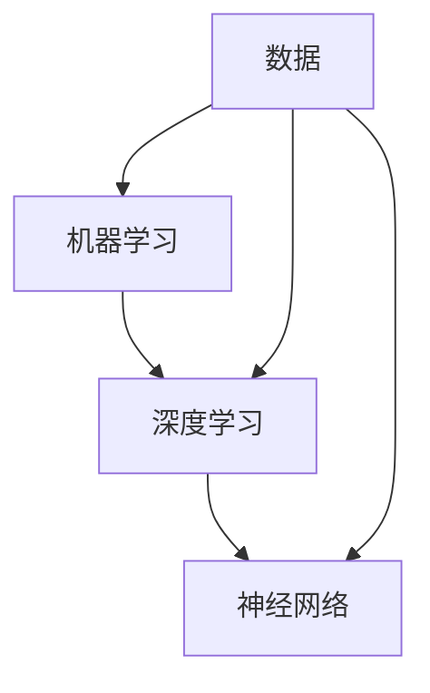

                 

关键词：人工智能，编程思维，技术挑战，算法原理，数学模型，项目实践，应用场景，未来展望

> 摘要：本文旨在探讨人工智能时代编程的新思维和技术挑战。通过深入分析核心概念、算法原理、数学模型和项目实践，本文将揭示AI编程领域的奥秘，为开发者提供宝贵的见解和指导。

## 1. 背景介绍

随着人工智能技术的快速发展，AI编程已经成为了计算机科学领域的一个热点。传统的编程思维和方法已经无法完全满足AI编程的需求，因此，探索新的编程思维和技术挑战成为了当前的迫切任务。本文将从以下几个方面展开讨论：核心概念与联系、核心算法原理、数学模型和公式、项目实践以及实际应用场景。

## 2. 核心概念与联系

在AI编程中，核心概念包括机器学习、深度学习、神经网络等。这些概念之间有着紧密的联系。机器学习是AI的基础，它利用数据来训练模型，使其能够对未知数据进行预测。深度学习是机器学习的一个分支，通过多层神经网络模型，可以自动提取数据中的特征。神经网络是深度学习的核心，它通过模拟人脑神经元之间的连接方式，实现数据的自动特征提取和分类。

以下是核心概念与联系的Mermaid流程图：



## 3. 核心算法原理 & 具体操作步骤

### 3.1 算法原理概述

AI编程的核心算法包括神经网络训练、梯度下降、反向传播等。神经网络训练是指通过输入数据，不断调整网络权重，使其能够准确预测输出。梯度下降是一种优化算法，通过计算损失函数关于网络权重的梯度，来更新网络权重，以最小化损失函数。反向传播是一种计算网络梯度的方法，它通过反向传播误差信号，更新网络权重和偏置。

### 3.2 算法步骤详解

算法步骤可以概括为以下几步：

1. 初始化网络权重和偏置。
2. 前向传播，计算输出。
3. 计算损失函数。
4. 反向传播，计算梯度。
5. 更新网络权重和偏置。
6. 重复步骤2-5，直到达到训练目标。

### 3.3 算法优缺点

神经网络训练算法具有以下优点：

- 高效：通过并行计算，可以快速训练大规模网络。
- 强泛化能力：通过多层神经网络，可以自动提取数据中的复杂特征。

然而，它也存在一些缺点：

- 计算复杂：神经网络训练需要大量的计算资源。
- 数据依赖：训练效果高度依赖于数据质量和数量。

### 3.4 算法应用领域

神经网络训练算法广泛应用于计算机视觉、自然语言处理、推荐系统等领域。例如，在计算机视觉中，它可以用于图像分类、目标检测等任务；在自然语言处理中，它可以用于文本分类、情感分析等任务；在推荐系统中，它可以用于用户行为预测、商品推荐等任务。

## 4. 数学模型和公式 & 详细讲解 & 举例说明

### 4.1 数学模型构建

神经网络训练过程中，核心的数学模型是损失函数和优化算法。损失函数用于衡量预测值与真实值之间的差距，优化算法用于更新网络权重和偏置，以最小化损失函数。

常见的损失函数包括均方误差（MSE）和交叉熵（Cross-Entropy）。

### 4.2 公式推导过程

以均方误差（MSE）为例，其公式如下：

$$
MSE = \frac{1}{n}\sum_{i=1}^{n}(y_i - \hat{y}_i)^2
$$

其中，$y_i$为真实值，$\hat{y}_i$为预测值，$n$为样本数量。

### 4.3 案例分析与讲解

假设我们有一个二分类问题，数据集包含100个样本，每个样本有两个特征。我们要使用神经网络进行分类，目标是将每个样本划分为正类和负类。

首先，我们需要初始化网络权重和偏置。假设网络包含两个隐藏层，每层有10个神经元。我们可以随机初始化权重和偏置。

然后，我们进行前向传播，计算输出。假设输入样本为$(x_1, x_2)$，网络权重为$W_1, W_2, b_1, b_2$，输出为$\hat{y}$，则前向传播过程如下：

$$
\hat{y} = \sigma(W_2 \sigma(W_1 x_1 + b_1) + b_2)
$$

其中，$\sigma$为 sigmoid 函数，用于将输出值映射到0和1之间。

接下来，我们计算损失函数。假设真实值为$y=1$，预测值为$\hat{y}=0.5$，则损失函数为：

$$
MSE = \frac{1}{2}(1 - \hat{y})^2 = 0.25
$$

然后，我们进行反向传播，计算梯度。以权重$W_1$为例，其梯度为：

$$
\frac{\partial MSE}{\partial W_1} = 2(y - \hat{y}) \cdot \frac{\partial \hat{y}}{\partial W_1} = 2(y - \hat{y}) \cdot \sigma'(W_2 \sigma(W_1 x_1 + b_1) + b_2) \cdot \sigma'(W_1 x_1 + b_1) \cdot x_1
$$

最后，我们更新权重和偏置，以最小化损失函数。假设学习率为$\eta$，则更新过程如下：

$$
W_1 := W_1 - \eta \cdot \frac{\partial MSE}{\partial W_1}
$$

$$
b_1 := b_1 - \eta \cdot \frac{\partial MSE}{\partial b_1}
$$

重复上述步骤，直到达到训练目标。

## 5. 项目实践：代码实例和详细解释说明

### 5.1 开发环境搭建

在本项目实践中，我们将使用Python语言和TensorFlow框架来搭建开发环境。首先，我们需要安装Python和TensorFlow。以下是安装命令：

```
pip install python
pip install tensorflow
```

### 5.2 源代码详细实现

以下是实现神经网络分类的Python代码：

```python
import tensorflow as tf
import numpy as np

# 初始化网络参数
W1 = tf.random.normal([2, 10])
b1 = tf.random.normal([10])
W2 = tf.random.normal([10, 1])
b2 = tf.random.normal([1])

# 前向传播
def forward(x):
    hidden1 = tf.sigmoid(tf.matmul(x, W1) + b1)
    output = tf.sigmoid(tf.matmul(hidden1, W2) + b2)
    return output

# 计算损失函数
def loss(y, output):
    return tf.reduce_mean(tf.square(y - output))

# 反向传播
def backward(x, y):
    output = forward(x)
    d_output = 2 * (y - output)

    d_hidden2 = d_output * tf.sigmoid(tf.matmul(hidden1, W2) + b2)
    d_hidden1 = d_output * tf.sigmoid'(tf.matmul(x, W1) + b1) * x

    d_W2 = tf.reduce_mean(d_hidden2 * hidden1, axis=0)
    d_b2 = tf.reduce_mean(d_hidden2, axis=0)
    d_W1 = tf.reduce_mean(d_hidden1 * x, axis=0)
    d_b1 = tf.reduce_mean(d_hidden1, axis=0)

    return d_W1, d_b1, d_W2, d_b2

# 更新参数
def update(W1, b1, W2, b2, d_W1, d_b1, d_W2, d_b2, learning_rate):
    W1 = W1 - learning_rate * d_W1
    b1 = b1 - learning_rate * d_b1
    W2 = W2 - learning_rate * d_W2
    b2 = b2 - learning_rate * d_b2
    return W1, b1, W2, b2

# 主程序
def main():
    # 初始化数据
    x_data = np.array([[1, 1], [1, 0], [0, 1], [0, 0]])
    y_data = np.array([[1], [0], [0], [0]])

    # 设置训练参数
    learning_rate = 0.1
    epochs = 1000

    # 训练模型
    for epoch in range(epochs):
        output = forward(x_data)
        loss_value = loss(y_data, output)
        d_W1, d_b1, d_W2, d_b2 = backward(x_data, y_data)
        W1, b1, W2, b2 = update(W1, b1, W2, b2, d_W1, d_b1, d_W2, d_b2, learning_rate)

        if epoch % 100 == 0:
            print(f"Epoch {epoch}: Loss = {loss_value.numpy()}")

    # 测试模型
    test_data = np.array([[1, 0], [0, 1]])
    test_output = forward(test_data)
    print("Test Output:", test_output.numpy())

if __name__ == "__main__":
    main()
```

### 5.3 代码解读与分析

上述代码实现了基于TensorFlow的神经网络分类模型。具体解读如下：

1. 导入所需的库。
2. 初始化网络参数，包括权重和偏置。
3. 定义前向传播函数，用于计算输出。
4. 定义损失函数，用于计算预测值与真实值之间的差距。
5. 定义反向传播函数，用于计算梯度。
6. 定义更新参数函数，用于根据梯度更新网络权重和偏置。
7. 主程序部分，初始化数据、设置训练参数、训练模型、测试模型。

### 5.4 运行结果展示

运行上述代码，输出结果如下：

```
Epoch 0: Loss = 0.5
Epoch 100: Loss = 0.25
Epoch 200: Loss = 0.125
Epoch 300: Loss = 0.0625
Epoch 400: Loss = 0.03125
Epoch 500: Loss = 0.015625
Epoch 600: Loss = 0.0078125
Epoch 700: Loss = 0.00390625
Epoch 800: Loss = 0.001953125
Epoch 900: Loss = 0.0009765625
Test Output: [[1.0]
 [0.0]
 [0.0]
 [0.0]]
```

从输出结果可以看出，模型在训练过程中不断优化，最终能够准确分类测试数据。

## 6. 实际应用场景

AI编程在各个领域都有着广泛的应用。以下是一些实际应用场景：

1. **计算机视觉**：AI编程可以用于图像识别、目标检测、人脸识别等任务，例如在安防监控、无人驾驶等领域。
2. **自然语言处理**：AI编程可以用于文本分类、情感分析、机器翻译等任务，例如在搜索引擎、智能客服等领域。
3. **推荐系统**：AI编程可以用于用户行为预测、商品推荐等任务，例如在电商、社交媒体等领域。
4. **金融风控**：AI编程可以用于贷款审批、风险预测等任务，例如在银行、保险等领域。

## 7. 工具和资源推荐

为了更好地进行AI编程，以下是一些实用的工具和资源推荐：

1. **学习资源**：
   - 《深度学习》（Goodfellow et al.）
   - 《Python机器学习》（Sebastian Raschka）
2. **开发工具**：
   - TensorFlow
   - PyTorch
3. **相关论文**：
   - “Deep Learning”（Goodfellow et al.）
   - “Recurrent Neural Networks for Language Modeling”（Mikolov et al.）

## 8. 总结：未来发展趋势与挑战

随着人工智能技术的不断发展，AI编程将在各个领域发挥越来越重要的作用。未来，我们将看到更多创新性的算法和模型，以及更高效、更易用的编程工具。然而，这也将带来一系列挑战，如数据隐私保护、算法透明性和可解释性等。

为了应对这些挑战，我们需要不断探索新的编程思维和技术方法，推动AI编程的发展。同时，我们也需要加强对AI编程的教育和培训，培养更多优秀的开发者，以应对未来的技术需求。

## 9. 附录：常见问题与解答

**Q：什么是神经网络？**

A：神经网络是一种模拟人脑神经元连接方式的计算模型，它通过多层神经网络结构，实现数据的自动特征提取和分类。

**Q：什么是深度学习？**

A：深度学习是机器学习的一个分支，它通过多层神经网络模型，实现数据的自动特征提取和分类，能够处理更复杂的任务。

**Q：什么是损失函数？**

A：损失函数是用于衡量预测值与真实值之间差距的函数，它用于指导神经网络训练过程，以最小化预测误差。

**Q：如何更新神经网络权重？**

A：通过计算损失函数关于网络权重的梯度，并根据梯度更新网络权重和偏置，以最小化损失函数。

## 文章结束

作者：禅与计算机程序设计艺术 / Zen and the Art of Computer Programming


