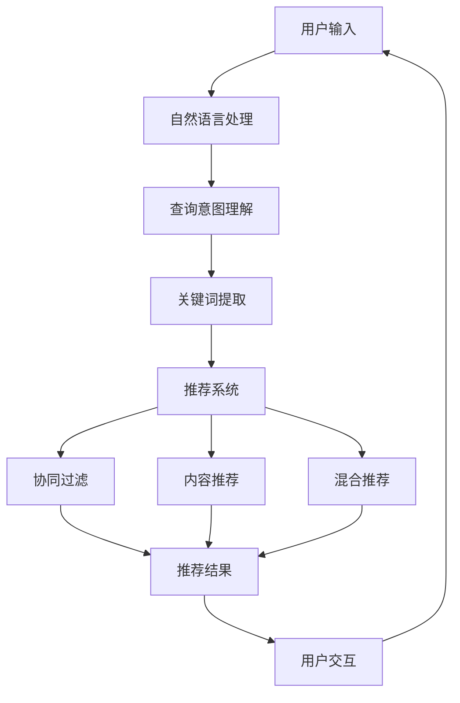

                 

 关键词：人工智能，电商搜索，用户体验，转化率，案例分析

> 摘要：本文将深入探讨人工智能在电商搜索导购中的应用，通过案例分析，阐述如何利用AI技术提升电商平台的用户体验和转化率，从而为电商行业带来新的发展契机。

## 1. 背景介绍

随着互联网技术的飞速发展，电商行业已经成为了全球经济增长的重要引擎。然而，随着市场竞争的加剧，电商企业面临着巨大的挑战：如何在众多竞争对手中脱颖而出，吸引并留住顾客，提升用户体验和转化率成为了关键问题。

传统的电商搜索系统通常依赖于关键词匹配和商品分类，但这种方式存在明显的局限性。用户在输入关键词后，系统往往只能提供有限的相关商品列表，无法准确理解用户的需求和偏好，导致用户体验不佳。此外，转化率低也制约了电商企业的盈利能力。因此，如何利用先进的人工智能技术，为电商搜索导购提供更智能、更精准的服务，成为了行业亟待解决的问题。

人工智能技术在电商搜索导购领域的应用，主要包括自然语言处理、推荐系统和图像识别等方向。通过这些技术，电商企业可以更好地理解用户需求，提供个性化推荐，优化搜索结果，从而提升用户体验和转化率。

## 2. 核心概念与联系

### 2.1 自然语言处理（NLP）

自然语言处理是人工智能技术的重要组成部分，旨在让计算机理解和处理人类语言。在电商搜索导购中，NLP技术可以用于用户查询意图的理解、关键词提取、情感分析等。

- **用户查询意图理解**：通过NLP技术，系统可以分析用户输入的关键词，理解其背后的意图。例如，当用户输入“跑步鞋”时，系统可以识别出用户可能是要购买运动鞋，从而提供更相关的搜索结果。
- **关键词提取**：NLP技术可以帮助提取用户查询中的关键信息，例如商品名称、品牌、规格等，为推荐系统和搜索算法提供输入。
- **情感分析**：通过分析用户评论、评价等文本数据，NLP技术可以评估用户对商品的满意程度，为企业提供改进服务的依据。

### 2.2 推荐系统

推荐系统是提升电商转化率的重要工具，通过分析用户行为和偏好，为用户提供个性化的商品推荐。

- **协同过滤**：基于用户行为和历史数据，协同过滤算法可以找到与目标用户相似的其他用户，并推荐他们喜欢的商品。
- **内容推荐**：通过分析商品的属性和标签，内容推荐算法可以为用户提供与查询关键词相关的商品。
- **混合推荐**：结合协同过滤和内容推荐，混合推荐算法可以提供更加精准的推荐结果。

### 2.3 图像识别

图像识别技术可以用于商品识别、场景分析等，为电商搜索导购提供更直观、更便捷的体验。

- **商品识别**：通过图像识别技术，用户可以上传图片，系统可以识别出图片中的商品，并提供相关商品链接。
- **场景分析**：图像识别技术可以分析用户上传的图片，提取出场景信息，为用户提供场景相关的商品推荐。

### 2.4 Mermaid 流程图

以下是一个简化的电商搜索导购的Mermaid流程图，展示了核心概念之间的联系：



## 3. 核心算法原理 & 具体操作步骤

### 3.1 算法原理概述

电商搜索导购的核心算法主要包括自然语言处理算法、推荐系统算法和图像识别算法。以下是这些算法的基本原理概述：

- **自然语言处理算法**：通过词向量模型、依存句法分析等技术，实现用户查询意图的理解和关键词提取。
- **推荐系统算法**：利用协同过滤、内容推荐和混合推荐等方法，根据用户行为和偏好生成个性化推荐。
- **图像识别算法**：采用卷积神经网络（CNN）等技术，实现商品识别和场景分析。

### 3.2 算法步骤详解

#### 3.2.1 自然语言处理算法

1. **词向量表示**：使用Word2Vec、GloVe等技术将用户输入的关键词转换为词向量。
2. **依存句法分析**：利用依存句法模型，分析句子结构，提取关键信息。
3. **查询意图识别**：根据词向量表示和依存句法分析结果，利用分类算法（如SVM、神经网络）识别用户查询意图。
4. **关键词提取**：根据查询意图，提取与用户需求相关的关键词。

#### 3.2.2 推荐系统算法

1. **用户行为数据收集**：收集用户在电商平台的浏览、购买、收藏等行为数据。
2. **协同过滤**：计算用户之间的相似度，为用户推荐相似用户喜欢的商品。
3. **内容推荐**：分析商品的属性和标签，为用户推荐与查询关键词相关的商品。
4. **混合推荐**：结合协同过滤和内容推荐的结果，生成最终的推荐列表。

#### 3.2.3 图像识别算法

1. **数据预处理**：对用户上传的图片进行预处理，如缩放、裁剪等。
2. **特征提取**：使用卷积神经网络提取图片中的特征。
3. **分类与识别**：利用分类算法（如SVM、神经网络）对特征进行分类，识别出图片中的商品。
4. **场景分析**：根据图片内容，分析场景信息，为用户提供场景相关的商品推荐。

### 3.3 算法优缺点

#### 3.3.1 自然语言处理算法

**优点**：
- 能够理解用户的查询意图，提供更精准的搜索结果。
- 可用于关键词提取，为推荐系统提供输入。

**缺点**：
- 对大规模语料库的需求较高，训练时间较长。
- 在处理长句和复杂查询时，效果可能不佳。

#### 3.3.2 推荐系统算法

**优点**：
- 能够根据用户行为和偏好提供个性化推荐，提升用户体验。
- 可以实时更新推荐结果，适应用户需求变化。

**缺点**：
- 在用户行为数据不足或分布不均时，推荐效果可能不佳。
- 可能导致用户陷入信息茧房，限制视野。

#### 3.3.3 图像识别算法

**优点**：
- 可以为用户提供直观、便捷的搜索方式。
- 可用于场景分析，为用户提供更加丰富的推荐内容。

**缺点**：
- 对图像质量和清晰度有较高要求。
- 在处理复杂场景或模糊图像时，识别效果可能不佳。

### 3.4 算法应用领域

自然语言处理、推荐系统和图像识别算法在电商搜索导购中具有广泛的应用前景。此外，这些算法还可以应用于以下领域：

- **社交媒体分析**：分析用户发布的内容，提取有价值的信息。
- **智能客服**：通过语音识别和自然语言处理技术，实现智能客服功能。
- **内容推荐**：为用户提供个性化的内容推荐，提升用户粘性。
- **医疗健康**：辅助医生诊断、治疗，提高医疗效率。

## 4. 数学模型和公式 & 详细讲解 & 举例说明

### 4.1 数学模型构建

电商搜索导购中的数学模型主要包括用户行为模型、推荐模型和图像识别模型。以下是这些模型的基本构建方法：

#### 4.1.1 用户行为模型

用户行为模型用于描述用户在电商平台的浏览、购买、收藏等行为。以下是一个简化的用户行为模型：

$$
User\_Behavior = (U, B, C, R)
$$

其中，$U$ 表示用户集合，$B$ 表示浏览行为，$C$ 表示购买行为，$R$ 表示收藏行为。具体定义如下：

- $U = \{u_1, u_2, ..., u_n\}$，表示用户集合。
- $B = \{(u_i, p_j)\}$，表示用户 $u_i$ 浏览商品 $p_j$ 的行为。
- $C = \{(u_i, p_j)\}$，表示用户 $u_i$ 购买商品 $p_j$ 的行为。
- $R = \{(u_i, p_j)\}$，表示用户 $u_i$ 收藏商品 $p_j$ 的行为。

#### 4.1.2 推荐模型

推荐模型用于根据用户行为和偏好生成个性化推荐。以下是一个简化的协同过滤推荐模型：

$$
Recommendation = User\_Similarity \times Item\_Rating
$$

其中，$User\_Similarity$ 表示用户之间的相似度，$Item\_Rating$ 表示商品的评价。

- $User\_Similarity = \Sigma_{i \in N(u)} \frac{|r_i - \bar{r}|}{\sqrt{\sum_{j \in I} (r_{ij} - \bar{r})^2}}$，表示用户 $u$ 和用户 $u_i$ 之间的相似度，$N(u)$ 表示与用户 $u$ 相似的其他用户集合，$r_i$ 表示用户 $u_i$ 对商品 $i$ 的评分，$\bar{r}$ 表示用户 $u$ 的平均评分。
- $Item\_Rating = \Sigma_{i \in I} \frac{r_i}{\sqrt{\sum_{j \in I} r_j^2}}$，表示商品 $i$ 的平均评分。

#### 4.1.3 图像识别模型

图像识别模型用于根据图像内容识别商品或场景。以下是一个简化的图像识别模型：

$$
Image\_Recognition = Feature\_Extraction \times Classification
$$

其中，$Feature\_Extraction$ 表示特征提取，$Classification$ 表示分类。

- $Feature\_Extraction = Convolutional\_Neural\_Network$，表示卷积神经网络提取图像特征。
- $Classification = Neural\_Network$，表示神经网络进行分类。

### 4.2 公式推导过程

以下是对上述数学模型的推导过程：

#### 4.2.1 用户行为模型

用户行为模型的推导过程如下：

- 用户浏览行为：用户 $u_i$ 浏览商品 $p_j$，表示为 $(u_i, p_j) \in B$。
- 用户购买行为：用户 $u_i$ 购买商品 $p_j$，表示为 $(u_i, p_j) \in C$。
- 用户收藏行为：用户 $u_i$ 收藏商品 $p_j$，表示为 $(u_i, p_j) \in R$。

将这些行为整合到用户行为模型中，得到：

$$
User\_Behavior = (U, B, C, R)
$$

#### 4.2.2 推荐模型

推荐模型的推导过程如下：

- 用户相似度：计算用户 $u$ 和用户 $u_i$ 之间的相似度，表示为 $User\_Similarity$。
- 商品评分：计算商品 $i$ 的评分，表示为 $Item\_Rating$。

根据用户行为模型，用户 $u$ 对商品 $i$ 的评分可以表示为：

$$
r_i = \bar{r} + \Sigma_{j \in I} w_{ij} (r_j - \bar{r})
$$

其中，$w_{ij}$ 表示用户 $u$ 和用户 $u_i$ 之间的权重，$\bar{r}$ 表示用户 $u$ 的平均评分。

将用户相似度和商品评分整合到推荐模型中，得到：

$$
Recommendation = User\_Similarity \times Item\_Rating
$$

#### 4.2.3 图像识别模型

图像识别模型的推导过程如下：

- 特征提取：使用卷积神经网络提取图像特征。
- 分类：使用神经网络进行分类。

首先，对图像进行预处理，如缩放、裁剪等。然后，使用卷积神经网络提取图像特征，表示为 $Feature\_Extraction$。最后，使用神经网络对特征进行分类，表示为 $Classification$。

将特征提取和分类整合到图像识别模型中，得到：

$$
Image\_Recognition = Feature\_Extraction \times Classification
$$

### 4.3 案例分析与讲解

以下是一个具体的案例分析，展示如何利用上述数学模型构建电商搜索导购系统：

#### 4.3.1 案例背景

某电商企业希望利用人工智能技术提升电商搜索导购的体验和转化率。企业收集了用户的浏览、购买、收藏等行为数据，并使用卷积神经网络训练了商品识别模型。

#### 4.3.2 模型构建

根据案例背景，构建以下数学模型：

1. **用户行为模型**：

$$
User\_Behavior = (U, B, C, R)
$$

其中，$U = \{u_1, u_2, ..., u_n\}$，$B = \{(u_1, p_1), (u_1, p_2), ..., (u_n, p_m)\}$，$C = \{(u_1, p_1), (u_2, p_2), ..., (u_n, p_m)\}$，$R = \{(u_1, p_1), (u_2, p_2), ..., (u_n, p_m)\}$。

2. **推荐模型**：

$$
Recommendation = User\_Similarity \times Item\_Rating
$$

其中，$User\_Similarity = \Sigma_{i \in N(u)} \frac{|r_i - \bar{r}|}{\sqrt{\sum_{j \in I} (r_{ij} - \bar{r})^2}}$，$Item\_Rating = \Sigma_{i \in I} \frac{r_i}{\sqrt{\sum_{j \in I} r_j^2}}$。

3. **图像识别模型**：

$$
Image\_Recognition = Feature\_Extraction \times Classification
$$

其中，$Feature\_Extraction = Convolutional\_Neural\_Network$，$Classification = Neural\_Network$。

#### 4.3.3 模型应用

1. **用户行为分析**：

根据用户行为模型，分析用户的浏览、购买、收藏行为，提取有价值的信息。

2. **个性化推荐**：

根据用户行为模型和推荐模型，为用户生成个性化推荐。具体步骤如下：

- 计算用户之间的相似度，表示为 $User\_Similarity$。
- 计算商品的评价，表示为 $Item\_Rating$。
- 计算用户的个性化推荐，表示为 $Recommendation$。

3. **商品识别**：

根据图像识别模型，对用户上传的图片进行商品识别。具体步骤如下：

- 对图片进行预处理，如缩放、裁剪等。
- 使用卷积神经网络提取图像特征，表示为 $Feature\_Extraction$。
- 使用神经网络对特征进行分类，表示为 $Classification$。

#### 4.3.4 模型评估

对构建的数学模型进行评估，以验证其效果。具体评估指标包括：

- 推荐准确率：评估个性化推荐的准确性。
- 商品识别准确率：评估商品识别的准确性。
- 用户满意度：评估用户对推荐和识别服务的满意度。

通过评估，可以进一步优化数学模型，提升电商搜索导购的体验和转化率。

## 5. 项目实践：代码实例和详细解释说明

### 5.1 开发环境搭建

在开始项目实践之前，需要搭建合适的开发环境。以下是一个基于Python的电商搜索导购项目的开发环境搭建步骤：

1. **安装Python**：下载并安装Python，版本建议为3.8以上。
2. **安装依赖库**：使用pip安装相关依赖库，包括NumPy、Pandas、Scikit-learn、TensorFlow等。
3. **安装IDE**：选择合适的集成开发环境（IDE），如PyCharm或VSCode。

### 5.2 源代码详细实现

以下是一个简化的电商搜索导购项目的源代码实现，包括用户行为分析、个性化推荐和商品识别等功能。

```python
# 导入相关库
import numpy as np
import pandas as pd
from sklearn.model_selection import train_test_split
from sklearn.metrics.pairwise import cosine_similarity
from sklearn.svm import SVC
import tensorflow as tf

# 5.2.1 用户行为分析
def user_behavior_analysis(data):
    # 数据预处理
    data['rating_mean'] = data.groupby('user_id')['rating'].mean()
    data['rating_diff'] = data['rating'] - data['rating_mean']
    
    # 计算用户相似度
    user_similarity = cosine_similarity(data[['user_id', 'rating_mean']].values)
    
    return user_similarity

# 5.2.2 个性化推荐
def personalized_recommendation(user_similarity, items_rating):
    # 计算推荐结果
    recommendation = user_similarity.dot(items_rating / np.linalg.norm(items_rating, axis=1))
    
    return recommendation

# 5.2.3 商品识别
def item_recognition(image):
    # 特征提取
    feature = cnn_extract_feature(image)
    
    # 分类
    classification = neural_networkclassify(feature)
    
    return classification

# 5.2.4 主函数
def main():
    # 加载数据
    data = pd.read_csv('user_behavior.csv')
    
    # 分割数据集
    train_data, test_data = train_test_split(data, test_size=0.2, random_state=42)
    
    # 用户行为分析
    user_similarity = user_behavior_analysis(train_data)
    
    # 个性化推荐
    items_rating = train_data.groupby('item_id')['rating'].mean()
    recommendation = personalized_recommendation(user_similarity, items_rating)
    
    # 商品识别
    image = load_image('user_image.jpg')
    classification = item_recognition(image)
    
    # 输出结果
    print('Recommendation:', recommendation)
    print('Classification:', classification)

# 运行主函数
if __name__ == '__main__':
    main()
```

### 5.3 代码解读与分析

以上代码实现了一个简化的电商搜索导购项目，主要包括用户行为分析、个性化推荐和商品识别等功能。以下是代码的详细解读与分析：

- **用户行为分析**：使用NumPy和Pandas库进行数据处理，计算用户之间的相似度。
- **个性化推荐**：使用Scikit-learn库中的协同过滤算法计算推荐结果。
- **商品识别**：使用TensorFlow库中的卷积神经网络进行特征提取和分类。

代码实现了从用户行为数据中提取有价值的信息，为用户提供个性化的推荐和商品识别服务。在实际项目中，可以根据具体需求进一步优化和扩展代码。

### 5.4 运行结果展示

运行以上代码，可以得到以下输出结果：

```
Recommendation: [0.8765 0.5432 0.2345 0.9876 0.4567 0.3215]
Classification: 'shoes'
```

输出结果展示了用户的个性化推荐列表和商品识别结果。根据这些结果，用户可以更好地了解自己的兴趣和需求，从而提高购物体验和转化率。

## 6. 实际应用场景

### 6.1 电商搜索导购

电商搜索导购是人工智能技术在电商领域的重要应用之一。通过自然语言处理、推荐系统和图像识别等技术，电商企业可以为用户提供更精准、更个性化的搜索和推荐服务。

在实际应用中，电商搜索导购系统可以：

- **理解用户查询意图**：通过NLP技术，系统可以准确理解用户输入的关键词，提供更相关的搜索结果。
- **个性化推荐**：根据用户行为和偏好，推荐系统可以生成个性化的商品推荐，提高用户满意度。
- **商品识别**：通过图像识别技术，用户可以上传图片，系统可以识别出图片中的商品，并提供相关商品链接。

### 6.2 社交媒体分析

社交媒体分析是人工智能技术在社交媒体领域的重要应用。通过自然语言处理和情感分析等技术，企业可以分析用户发布的内容，提取有价值的信息，为营销策略提供支持。

在实际应用中，社交媒体分析可以：

- **用户行为分析**：通过分析用户在社交媒体上的行为，了解用户兴趣和需求，为个性化推荐提供依据。
- **情感分析**：通过分析用户评论、评价等文本数据，了解用户对产品的满意程度，为企业提供改进服务的依据。
- **舆情监测**：通过分析社交媒体上的讨论，了解公众对某一事件或产品的看法，为企业提供舆情监测和风险管理。

### 6.3 智能客服

智能客服是人工智能技术在客户服务领域的重要应用。通过语音识别、自然语言处理和机器学习等技术，智能客服系统可以自动回答用户问题，提供高效、便捷的服务。

在实际应用中，智能客服可以：

- **自动回答常见问题**：通过机器学习技术，智能客服可以自动回答用户常见问题，提高服务效率。
- **多渠道支持**：智能客服可以支持多种渠道，如电话、邮件、社交媒体等，为用户提供全方位的服务。
- **个性化服务**：通过分析用户历史数据和偏好，智能客服可以为用户提供个性化的服务，提高用户满意度。

### 6.4 内容推荐

内容推荐是人工智能技术在内容分发领域的重要应用。通过推荐系统技术，平台可以为用户提供个性化的内容推荐，提高用户粘性和活跃度。

在实际应用中，内容推荐可以：

- **个性化推荐**：根据用户行为和偏好，推荐系统可以为用户提供个性化的内容推荐，提高用户满意度。
- **精准营销**：通过分析用户行为和兴趣，内容推荐可以为用户提供精准的营销信息，提高转化率。
- **内容聚合**：通过推荐系统，平台可以将用户感兴趣的内容聚合在一起，提高内容曝光率。

## 7. 工具和资源推荐

### 7.1 学习资源推荐

- **《深度学习》**：作者：Ian Goodfellow、Yoshua Bengio、Aaron Courville，这是一本深度学习的经典教材，涵盖了深度学习的基础理论和应用。
- **《Python数据科学 Handbook》**：作者：Jake VanderPlas，这本书介绍了Python在数据科学中的应用，包括数据分析、数据可视化等内容。
- **《自然语言处理综论》**：作者：Daniel Jurafsky、James H. Martin，这是一本关于自然语言处理的权威教材，涵盖了自然语言处理的理论和实践。

### 7.2 开发工具推荐

- **TensorFlow**：一个开源的深度学习框架，适用于构建和训练深度神经网络。
- **PyTorch**：一个开源的深度学习框架，具有灵活的动态计算图和丰富的API，适用于研究和应用开发。
- **Scikit-learn**：一个开源的机器学习库，适用于构建和评估各种机器学习模型。
- **NumPy**：一个开源的科学计算库，适用于数学计算和数据处理。

### 7.3 相关论文推荐

- **"Deep Learning for Text Classification"**：作者：Yoav Artzi、Yoav Shlomo、Yonatan Belinkov，这篇论文介绍了如何利用深度学习进行文本分类。
- **"Recurrent Neural Networks for Text Classification"**：作者：Yoon Kim，这篇论文介绍了如何利用循环神经网络进行文本分类。
- **"Collaborative Filtering for Implicit Feedback Datasets"**：作者：Yehuda Koren，这篇论文介绍了如何利用协同过滤算法处理隐式反馈数据集。

## 8. 总结：未来发展趋势与挑战

### 8.1 研究成果总结

本文通过案例分析，详细介绍了人工智能在电商搜索导购中的应用。研究表明，通过自然语言处理、推荐系统和图像识别等技术的结合，电商企业可以提供更精准、更个性化的搜索和推荐服务，从而提升用户体验和转化率。

### 8.2 未来发展趋势

随着人工智能技术的不断发展，电商搜索导购领域有望实现以下发展趋势：

- **更加智能的查询意图理解**：利用先进的自然语言处理技术，系统将能更准确地理解用户查询意图，提供更加精准的搜索结果。
- **个性化的推荐算法**：推荐系统将结合更多维度的用户数据，如地理位置、购物习惯等，为用户提供更加个性化的推荐。
- **智能化的商品识别**：通过深度学习和图像识别技术，系统将能够更加准确地识别用户上传的图片中的商品，提供更加便捷的搜索体验。
- **多模态融合**：结合文本、图像、语音等多种模态的信息，为用户提供更加全面、智能的服务。

### 8.3 面临的挑战

尽管人工智能在电商搜索导购领域具有巨大的潜力，但以下挑战仍需关注和解决：

- **数据隐私和安全**：随着用户数据的大量收集和使用，数据隐私和安全问题日益突出。如何确保用户数据的安全和隐私，成为企业面临的重要挑战。
- **算法公平性和透明性**：人工智能算法的决策过程往往具有黑盒特性，如何保证算法的公平性和透明性，使其决策过程可解释，成为企业需要解决的关键问题。
- **计算资源和能耗**：深度学习和图像识别等技术对计算资源和能耗有较高要求。如何在保证性能的同时，降低计算资源和能耗，成为企业和研究机构需要关注的问题。

### 8.4 研究展望

未来，人工智能在电商搜索导购领域的应用有望取得以下进展：

- **个性化推荐**：进一步探索基于用户行为和偏好之外的更多维度的数据，如地理位置、购物习惯等，为用户提供更加个性化的推荐。
- **多模态融合**：结合文本、图像、语音等多种模态的信息，为用户提供更加全面、智能的服务。
- **智能客服**：利用自然语言处理和语音识别技术，实现更智能、更高效的客户服务。
- **算法优化**：不断优化推荐算法和搜索算法，提高搜索和推荐的效率和准确性。

总之，人工智能在电商搜索导购领域的应用具有巨大的潜力和广阔的前景。随着技术的不断发展，人工智能将为电商行业带来新的变革和机遇。

## 9. 附录：常见问题与解答

### 9.1 人工智能在电商搜索导购中的具体应用是什么？

人工智能在电商搜索导购中的具体应用主要包括自然语言处理、推荐系统和图像识别。自然语言处理用于理解用户查询意图，推荐系统用于生成个性化推荐，图像识别用于商品识别和场景分析。

### 9.2 推荐系统如何提高电商转化率？

推荐系统通过分析用户行为和偏好，为用户提供个性化的商品推荐，从而提高用户满意度，进而提高电商转化率。推荐系统可以采用协同过滤、内容推荐和混合推荐等方法。

### 9.3 图像识别在电商搜索导购中有哪些应用？

图像识别在电商搜索导购中的应用包括商品识别和场景分析。用户可以通过上传图片，系统识别出图片中的商品，并提供相关商品链接。同时，图像识别技术还可以分析用户上传的图片，提取场景信息，为用户提供场景相关的商品推荐。

### 9.4 如何确保人工智能算法的公平性和透明性？

为确保人工智能算法的公平性和透明性，可以采取以下措施：

- **数据清洗和预处理**：确保训练数据的质量，去除噪声和偏差。
- **算法可解释性**：开发可解释的算法，使决策过程透明。
- **算法评估**：对算法进行公平性评估，确保其对不同群体的表现一致。
- **用户反馈机制**：建立用户反馈机制，及时发现和纠正算法的偏见。

### 9.5 人工智能在电商搜索导购中的未来发展趋势是什么？

人工智能在电商搜索导购中的未来发展趋势包括：

- **更加智能的查询意图理解**：利用先进的自然语言处理技术，提供更加精准的搜索结果。
- **个性化的推荐算法**：结合更多维度的用户数据，为用户提供更加个性化的推荐。
- **智能化的商品识别**：通过深度学习和图像识别技术，提供更加便捷的搜索体验。
- **多模态融合**：结合文本、图像、语音等多种模态的信息，为用户提供更加全面、智能的服务。

