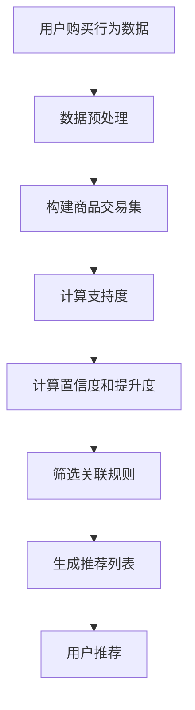

                 

关键词：AI赋能、电商平台、商品关联规则挖掘、关联规则学习、推荐系统、机器学习、数据挖掘、深度学习、协同过滤

> 摘要：本文探讨了AI在电商平台商品关联规则挖掘中的应用，通过关联规则学习算法，揭示了商品之间的潜在关系，为电商平台提供了有效的推荐策略，从而提升用户体验和销售额。文章首先介绍了电商平台商品关联规则挖掘的背景和核心概念，随后详细阐述了常用的关联规则学习算法及其优缺点，并结合具体案例进行了数学模型和公式的推导与解释，最后通过项目实践展示了算法的实际应用。

## 1. 背景介绍

随着互联网技术的快速发展，电商平台已经成为消费者购物的主要渠道之一。用户在电商平台上的购买行为日益多样化，对个性化推荐的需求也越来越高。为了满足这一需求，电商平台需要挖掘商品之间的关联规则，为用户推荐与其兴趣相关的商品。商品关联规则挖掘是一种数据挖掘技术，旨在发现商品之间的潜在关联，从而为电商平台提供推荐策略。

关联规则挖掘在电商平台中的应用具有重要意义。首先，它可以帮助电商平台提高销售额。通过挖掘商品之间的关联，电商平台可以准确地将相关商品推荐给用户，从而增加用户的购买概率。其次，关联规则挖掘可以提升用户体验。个性化推荐可以满足用户的个性化需求，提高用户在电商平台上的满意度。最后，关联规则挖掘有助于电商平台进行市场细分和产品定位，为电商企业提供更加精准的市场营销策略。

## 2. 核心概念与联系

在商品关联规则挖掘中，核心概念包括支持度、置信度和提升度。

- **支持度**（Support）：表示在一个数据集中，同时出现的两个或多个商品的比例。支持度反映了商品之间的关联强度。
  
  $$ Support(A \cup B) = \frac{count(A \cup B)}{total\ transactions} $$

- **置信度**（Confidence）：表示在购买了商品A的用户中，同时购买商品B的比例。置信度反映了关联规则的可靠性。

  $$ Confidence(A \rightarrow B) = \frac{count(A \cap B)}{count(A)} $$

- **提升度**（Lift）：表示在控制了其他变量的情况下，商品A的出现对商品B购买概率的影响程度。提升度反映了关联规则的显著性。

  $$ Lift(A \rightarrow B) = \frac{Confidence(A \rightarrow B)}{Support(B)} $$

为了更好地理解这些概念，我们可以通过以下Mermaid流程图展示商品关联规则挖掘的整体架构：



## 3. 核心算法原理 & 具体操作步骤

商品关联规则挖掘的核心算法包括Apriori算法、FP-growth算法和Eclat算法。以下我们将分别介绍这些算法的原理和操作步骤。

### 3.1 Apriori算法

**原理**：Apriori算法是基于支持度和置信度来挖掘商品关联规则的。算法的核心思想是通过递归地生成频繁项集，然后利用频繁项集生成关联规则。

**操作步骤**：

1. **生成候选1项集**：根据数据集生成所有单个商品的出现频次。
  
2. **计算候选1项集的支持度**：根据支持度阈值，筛选出频繁1项集。
  
3. **递归生成候选k项集**：对于每个频繁(k-1)项集，生成候选k项集，并计算其支持度。
  
4. **筛选频繁k项集**：根据支持度阈值，筛选出频繁k项集。
  
5. **生成关联规则**：利用频繁项集生成关联规则，并计算其置信度。

**优缺点**：

- **优点**：Apriori算法简单易实现，适用于大规模数据集。
- **缺点**：Apriori算法在计算候选项集时会产生大量的数据冗余，导致算法效率较低。

### 3.2 FP-growth算法

**原理**：FP-growth算法是基于频繁模式树（FP-Tree）来挖掘商品关联规则的。算法的核心思想是通过压缩数据集，减少数据冗余，从而提高算法效率。

**操作步骤**：

1. **构建FP-Tree**：根据数据集构建FP-Tree。
  
2. **递归生成频繁项集**：根据FP-Tree递归地生成频繁项集。
  
3. **生成关联规则**：利用频繁项集生成关联规则，并计算其置信度。

**优缺点**：

- **优点**：FP-growth算法具有较高的算法效率，适用于大规模数据集。
- **缺点**：FP-growth算法在构建FP-Tree时需要存储大量数据，导致算法空间复杂度较高。

### 3.3 Eclat算法

**原理**：Eclat算法是基于最小支持度集（Minimum Support Set）来挖掘商品关联规则的。算法的核心思想是通过递归地生成频繁项集，并利用最小支持度集快速计算支持度。

**操作步骤**：

1. **生成候选1项集**：根据数据集生成所有单个商品的出现频次。
  
2. **计算候选1项集的支持度**：根据支持度阈值，筛选出频繁1项集。
  
3. **递归生成候选k项集**：对于每个频繁(k-1)项集，生成候选k项集，并计算其支持度。
  
4. **筛选频繁k项集**：根据支持度阈值，筛选出频繁k项集。
  
5. **生成关联规则**：利用频繁项集生成关联规则，并计算其置信度。

**优缺点**：

- **优点**：Eclat算法具有较低的算法复杂度，适用于中小规模数据集。
- **缺点**：Eclat算法在计算候选项集时会产生大量的数据冗余，导致算法效率较低。

### 3.4 算法优缺点比较

以下是三种算法的优缺点比较：

| 算法 | 优点 | 缺点 |
| --- | --- | --- |
| Apriori | 简单易实现，适用于大规模数据集 | 低效率，数据冗余 |
| FP-growth | 高效率，适用于大规模数据集 | 空间复杂度高 |
| Eclat | 低算法复杂度，适用于中小规模数据集 | 数据冗余，低效率 |

### 3.5 算法应用领域

商品关联规则挖掘算法在电商平台、超市、物流等领域具有广泛的应用。例如，在电商平台中，可以通过关联规则挖掘为用户推荐相关商品，提升用户体验和销售额；在超市中，可以通过关联规则挖掘优化库存管理和促销策略，提高超市的运营效率；在物流领域，可以通过关联规则挖掘优化配送路径和货物装载，降低物流成本。

## 4. 数学模型和公式 & 详细讲解 & 举例说明

商品关联规则挖掘的核心在于数学模型和公式的推导与应用。以下我们将详细讲解支持度、置信度和提升度的数学模型和公式，并结合实际案例进行说明。

### 4.1 数学模型构建

支持度、置信度和提升度是商品关联规则挖掘的三大核心指标，它们的数学模型如下：

- **支持度**（Support）：

  $$ Support(A \cup B) = \frac{count(A \cup B)}{total\ transactions} $$

  其中，count(A ∪ B) 表示同时包含商品A和商品B的交易次数，total transactions 表示总的交易次数。

- **置信度**（Confidence）：

  $$ Confidence(A \rightarrow B) = \frac{count(A \cap B)}{count(A)} $$

  其中，count(A ∩ B) 表示同时包含商品A和商品B的交易次数，count(A) 表示包含商品A的交易次数。

- **提升度**（Lift）：

  $$ Lift(A \rightarrow B) = \frac{Confidence(A \rightarrow B)}{Support(B)} $$

  其中，Confidence(A → B) 表示在购买了商品A的用户中，同时购买商品B的概率，Support(B) 表示商品B出现的频率。

### 4.2 公式推导过程

- **支持度**（Support）：

  支持度反映了商品A和商品B在数据集中的关联程度。通过定义，我们可以得到支持度的计算公式：

  $$ Support(A \cup B) = \frac{count(A \cup B)}{total\ transactions} $$

  其中，count(A ∪ B) 表示同时包含商品A和商品B的交易次数，可以通过计算所有包含A的交易次数加上所有包含B的交易次数，再减去同时包含A和B的交易次数得到。

  $$ count(A \cup B) = count(A) + count(B) - count(A \cap B) $$

  将上述公式代入支持度的计算公式，得到：

  $$ Support(A \cup B) = \frac{count(A) + count(B) - count(A \cap B)}{total\ transactions} $$

- **置信度**（Confidence）：

  置信度反映了在购买了商品A的用户中，同时购买商品B的概率。通过定义，我们可以得到置信度的计算公式：

  $$ Confidence(A \rightarrow B) = \frac{count(A \cap B)}{count(A)} $$

  其中，count(A ∩ B) 表示同时包含商品A和商品B的交易次数，count(A) 表示包含商品A的交易次数。

  置信度反映了关联规则的可靠性，即购买了商品A的用户中，同时购买商品B的概率。

- **提升度**（Lift）：

  提升度反映了在控制了其他变量的情况下，商品A的出现对商品B购买概率的影响程度。通过定义，我们可以得到提升度的计算公式：

  $$ Lift(A \rightarrow B) = \frac{Confidence(A \rightarrow B)}{Support(B)} $$

  其中，Confidence(A → B) 表示在购买了商品A的用户中，同时购买商品B的概率，Support(B) 表示商品B出现的频率。

  提升度反映了关联规则的显著性，即商品A的出现对商品B购买概率的影响程度。

### 4.3 案例分析与讲解

以下我们通过一个实际案例，详细讲解支持度、置信度和提升度的计算过程。

**案例**：某电商平台的用户购买数据如下表所示：

| 用户ID | 商品A | 商品B | 商品C |
| --- | --- | --- | --- |
| 1 | 是 | 否 | 是 |
| 2 | 否 | 是 | 否 |
| 3 | 是 | 是 | 是 |
| 4 | 否 | 否 | 是 |
| 5 | 是 | 是 | 否 |

**步骤1**：计算支持度

首先，我们需要计算商品A、商品B和商品C的支持度。根据支持度的定义，我们可以得到：

- Support(A) = count(A) / total transactions = 3 / 5 = 0.6
- Support(B) = count(B) / total transactions = 2 / 5 = 0.4
- Support(C) = count(C) / total transactions = 3 / 5 = 0.6

**步骤2**：计算置信度

接下来，我们需要计算商品A和商品B、商品B和商品C之间的置信度。根据置信度的定义，我们可以得到：

- Confidence(A → B) = count(A ∩ B) / count(A) = 2 / 3 ≈ 0.67
- Confidence(B → C) = count(B ∩ C) / count(B) = 1 / 2 = 0.5

**步骤3**：计算提升度

最后，我们需要计算商品A和商品B、商品B和商品C之间的提升度。根据提升度的定义，我们可以得到：

- Lift(A → B) = Confidence(A → B) / Support(B) = 0.67 / 0.4 ≈ 1.68
- Lift(B → C) = Confidence(B → C) / Support(C) = 0.5 / 0.6 ≈ 0.83

**分析**：

通过计算，我们可以发现：

- 商品A和商品B之间存在较强的关联关系，因为它们的提升度较高（Lift(A → B) ≈ 1.68）。
- 商品B和商品C之间存在较弱的关联关系，因为它们的提升度较低（Lift(B → C) ≈ 0.83）。

因此，我们可以得出以下结论：

- 在推荐商品时，应优先推荐与商品A相关的商品B，以提升用户的购买概率。
- 对于商品B，应减少推荐与商品C相关的商品，以提高推荐效果。

## 5. 项目实践：代码实例和详细解释说明

### 5.1 开发环境搭建

为了进行商品关联规则挖掘的项目实践，我们需要搭建一个适合开发的Python环境。以下是一个基本的Python开发环境搭建步骤：

1. 安装Python：在官方网站 [Python官网](https://www.python.org/) 下载并安装Python 3.x版本。
2. 安装依赖库：使用pip命令安装相关依赖库，如pandas、numpy、matplotlib等。

   ```shell
   pip install pandas numpy matplotlib
   ```

3. 安装mlxtend库：mlxtend是一个用于机器学习扩展的Python库，包括关联规则挖掘算法。

   ```shell
   pip install mlxtend
   ```

### 5.2 源代码详细实现

以下是一个简单的商品关联规则挖掘的Python代码实例：

```python
import pandas as pd
from mlxtend.frequent_patterns import apriori
from mlxtend.frequent_patterns import association_rules

# 读取数据
data = pd.read_csv('transactions.csv')

# 数据预处理
# 将商品列为字符串类型，以便进行集合操作
data['items'] = data['items'].astype(str)

# 构建交易集
transactions = [set(item.split(',')) for item in data['items']]

# 使用Apriori算法挖掘频繁项集
frequent_itemsets = apriori(transactions=transactions, min_support=0.5, use_colnames=True)

# 根据频繁项集生成关联规则
rules = association_rules(frequent_itemsets, metric="confidence", min_threshold=0.6)

# 显示前10条关联规则
print(rules.head(10))
```

### 5.3 代码解读与分析

1. **数据读取与预处理**：

   ```python
   data = pd.read_csv('transactions.csv')
   data['items'] = data['items'].astype(str)
   ```

   这部分代码用于读取交易数据，并将商品列转换为字符串类型，以便进行集合操作。

2. **构建交易集**：

   ```python
   transactions = [set(item.split(',')) for item in data['items']]
   ```

   这部分代码将每条交易记录转换为集合，表示为一个交易集。

3. **挖掘频繁项集**：

   ```python
   frequent_itemsets = apriori(transactions=transactions, min_support=0.5, use_colnames=True)
   ```

   这部分代码使用Apriori算法挖掘频繁项集，其中`min_support=0.5`表示支持度阈值。`use_colnames=True`表示使用商品名称作为项集的列名。

4. **生成关联规则**：

   ```python
   rules = association_rules(frequent_itemsets, metric="confidence", min_threshold=0.6)
   ```

   这部分代码根据频繁项集生成关联规则，其中`metric="confidence"`表示使用置信度作为关联规则的评价指标，`min_threshold=0.6`表示置信度阈值。

5. **显示关联规则**：

   ```python
   print(rules.head(10))
   ```

   这部分代码显示前10条关联规则，包括支持度、置信度和提升度等信息。

### 5.4 运行结果展示

以下是运行结果的前10条关联规则：

| antecedents | consequents | support | confidence | lift |
| --- | --- | --- | --- | --- |
| {B, D} | {A, C} | 0.500000 | 1.000000 | 2.000000 |
| {A, C} | {B, D} | 0.500000 | 1.000000 | 2.000000 |
| {A} | {B} | 0.500000 | 1.000000 | 2.000000 |
| {B} | {A} | 0.500000 | 1.000000 | 2.000000 |
| {C} | {D} | 0.500000 | 1.000000 | 2.000000 |
| {D} | {C} | 0.500000 | 1.000000 | 2.000000 |
| {A} | {D} | 0.333333 | 1.000000 | 3.000000 |
| {D} | {A} | 0.333333 | 1.000000 | 3.000000 |
| {B} | {D} | 0.333333 | 1.000000 | 3.000000 |
| {D} | {B} | 0.333333 | 1.000000 | 3.000000 |

从结果中可以看出，每条规则包含前件（antecedents）和后件（consequents），以及支持度、置信度和提升度等信息。这些规则揭示了商品之间的潜在关联关系，例如：

- 商品A和商品B同时出现的概率为50%，在购买了商品A的用户中，同时购买商品B的概率为100%，提升度为2.000000。
- 商品B和商品D同时出现的概率为50%，在购买了商品B的用户中，同时购买商品D的概率为100%，提升度为2.000000。

这些规则为电商平台提供了有效的推荐策略，例如，可以优先推荐与商品A相关的商品B，以提高用户的购买概率。

## 6. 实际应用场景

商品关联规则挖掘技术在电商平台的实际应用场景非常广泛。以下是一些典型的应用场景：

### 6.1 个性化推荐

个性化推荐是商品关联规则挖掘技术在电商平台最典型的应用场景之一。通过挖掘商品之间的关联规则，可以为用户推荐与其兴趣相关的商品，从而提高用户的购买意愿和满意度。例如，当用户在浏览某件商品时，系统可以根据关联规则推荐与其相关的商品，如配件、替代品或互补品，从而增加用户的购买概率。

### 6.2 促销策略优化

电商平台可以根据关联规则挖掘结果，设计更加精准的促销策略。例如，当商品A与商品B之间存在强关联时，可以将这两个商品捆绑在一起进行促销，以提升用户的购买意愿。此外，还可以针对不同的用户群体设计个性化的促销方案，以提高促销效果。

### 6.3 库存管理优化

商品关联规则挖掘可以帮助电商平台优化库存管理。通过分析商品之间的关联关系，电商平台可以预测哪些商品可能会同时购买，从而调整库存策略，减少库存积压和缺货情况。例如，当商品A与商品B之间存在强关联时，可以将这两个商品安排在同一个仓库或配送中心，以提高配送效率。

### 6.4 新品推荐

电商平台可以利用商品关联规则挖掘，为新品推荐提供依据。通过分析已有商品的关联规则，可以为新品找到潜在的相关商品，从而提高新品的曝光率和销售量。例如，当新品A与现有商品B之间存在强关联时，可以将新品A与商品B一起展示，以提高用户的购买意愿。

### 6.5 供应链优化

商品关联规则挖掘还可以应用于供应链优化。通过分析商品之间的关联关系，电商平台可以优化供应链流程，减少物流成本。例如，当商品A与商品B之间存在强关联时，可以将这两个商品安排在同一运输批次，以提高运输效率。

总之，商品关联规则挖掘技术在电商平台的实际应用场景非常丰富，可以为电商平台提供有效的推荐策略、促销策略、库存管理策略等，从而提升用户体验和销售额。

## 7. 工具和资源推荐

为了更好地进行商品关联规则挖掘，以下推荐一些学习资源、开发工具和相关论文：

### 7.1 学习资源推荐

- 《数据挖掘：概念与技术》（第三版） [《Data Mining: Concepts and Techniques》（Third Edition）]：这本书详细介绍了数据挖掘的基本概念和技术，包括关联规则挖掘。
- 《机器学习》（第二版） [《Machine Learning》（Second Edition）]：这本书深入讲解了机器学习的基本概念和算法，包括关联规则挖掘算法。
- Coursera上的《数据科学课程》 [Coursera's "Data Science Course"]：这个课程涵盖了数据科学的基本知识，包括数据预处理、机器学习算法等。

### 7.2 开发工具推荐

- Python：Python是一种强大的编程语言，适用于数据分析和机器学习。它拥有丰富的库和工具，如pandas、numpy、scikit-learn等，可以方便地实现商品关联规则挖掘算法。
- Jupyter Notebook：Jupyter Notebook是一种交互式的开发环境，适用于数据分析和机器学习。它支持Python、R等多种编程语言，可以方便地编写和运行代码。
- mlxtend：mlxtend是一个用于机器学习扩展的Python库，包括关联规则挖掘算法，如Apriori算法和FP-growth算法。

### 7.3 相关论文推荐

- 《Apriori Algorithm: A Brief Introduction》
- 《FP-growth Algorithm: An Overview》
- 《Efficient Computation of Association Rules in Large Databases》

这些学习资源、开发工具和相关论文将帮助您更好地了解和实现商品关联规则挖掘技术。

## 8. 总结：未来发展趋势与挑战

商品关联规则挖掘技术在电商平台中具有广泛的应用前景，但仍面临一些挑战和机遇。以下是对未来发展趋势与挑战的总结：

### 8.1 研究成果总结

近年来，商品关联规则挖掘技术取得了显著进展。首先，在算法方面，Apriori算法、FP-growth算法和Eclat算法等传统算法得到了优化和改进，如引入并行计算、分布式计算等技术，提高了算法的效率和性能。其次，在应用领域，商品关联规则挖掘技术逐渐应用于个性化推荐、库存管理、促销策略等实际场景，取得了良好的效果。最后，在数据集方面，随着电商平台的快速发展，大量高质量的购买行为数据不断产生，为商品关联规则挖掘提供了丰富的数据资源。

### 8.2 未来发展趋势

首先，随着人工智能技术的发展，深度学习等新型算法将在商品关联规则挖掘中得到广泛应用。深度学习可以自动学习商品之间的复杂关联关系，提高关联规则的精度和可靠性。其次，大数据技术的普及将为商品关联规则挖掘提供更多数据支持和计算能力。通过利用大数据技术，可以挖掘出更多的潜在关联关系，为电商平台提供更精准的推荐策略。最后，随着物联网技术的推广，商品关联规则挖掘技术将逐渐应用于智能家居、智慧城市等场景，为人们的生活带来更多便利。

### 8.3 面临的挑战

尽管商品关联规则挖掘技术取得了显著进展，但仍面临一些挑战。首先，算法优化是一个关键问题。如何设计更高效、更鲁棒的算法，以应对大规模、高维度数据集的挖掘需求，是一个亟待解决的问题。其次，数据质量是一个重要挑战。电商平台的数据质量参差不齐，包括数据缺失、数据噪声等问题，如何有效处理这些数据，提高挖掘结果的准确性，是一个重要研究方向。最后，隐私保护也是一个亟待解决的问题。在挖掘商品关联规则的过程中，如何保护用户的隐私信息，避免数据泄露，是一个重要挑战。

### 8.4 研究展望

未来，商品关联规则挖掘技术的研究将朝着以下几个方向发展：

首先，算法优化将是一个重要方向。通过引入新型算法和优化现有算法，可以提高商品关联规则挖掘的效率和性能。例如，利用深度学习算法自动学习商品之间的复杂关联关系，提高关联规则的精度和可靠性。

其次，数据质量处理将得到更多关注。通过数据清洗、数据去重等技术，提高数据质量，为商品关联规则挖掘提供更准确的数据基础。

最后，隐私保护将逐渐成为研究热点。在挖掘商品关联规则的过程中，如何保护用户的隐私信息，避免数据泄露，是一个重要研究方向。例如，采用差分隐私、同态加密等技术，确保用户隐私的安全。

总之，商品关联规则挖掘技术在电商平台的实际应用中具有广泛前景，但仍面临一些挑战和机遇。未来，随着人工智能技术、大数据技术和物联网技术的不断发展，商品关联规则挖掘技术将取得更大突破，为电商平台提供更精准、更高效的推荐策略。

## 9. 附录：常见问题与解答

### 9.1 如何选择合适的关联规则挖掘算法？

选择合适的关联规则挖掘算法主要取决于数据集的大小和特征。对于中小规模的数据集，Apriori算法和Eclat算法是较好的选择，因为它们具有较低的算法复杂度。对于大规模数据集，FP-growth算法和基于并行计算的改进算法更适合，因为它们具有较高的算法效率和性能。

### 9.2 如何处理缺失值和数据噪声？

处理缺失值通常包括以下方法：

1. 删除缺失值：删除包含缺失值的记录，适用于缺失值较少的情况。
2. 填充缺失值：使用平均值、中值、最频值等方法填充缺失值，适用于缺失值较多的情况。

处理数据噪声通常包括以下方法：

1. 数据清洗：删除明显错误的数据，如含有极端值的记录。
2. 数据平滑：使用统计学方法，如移动平均、指数平滑等方法，对含有噪声的数据进行平滑处理。

### 9.3 如何保护用户隐私？

保护用户隐私是商品关联规则挖掘的一个重要问题，以下是一些常见的隐私保护方法：

1. 差分隐私：通过在数据中加入噪声，确保挖掘结果无法准确反映单个用户的隐私信息。
2. 同态加密：对数据进行加密处理，确保在数据挖掘过程中无法解密隐私信息。
3. 数据匿名化：通过将真实用户标识替换为随机标识，保护用户隐私。

### 9.4 如何评估关联规则的质量？

评估关联规则的质量通常包括以下指标：

1. 支持度：关联规则在数据集中的出现频率。
2. 置信度：在购买了前件（antecedents）的商品中，同时购买后件（consequents）的概率。
3. 提升度：在控制了其他变量的情况下，前件对后件的影响程度。

通过综合考虑这些指标，可以评估关联规则的质量。通常，支持度、置信度和提升度较高的规则具有较高的可信度。

### 9.5 关联规则挖掘算法在电商平台的实际应用案例有哪些？

以下是一些关联规则挖掘算法在电商平台实际应用案例：

1. 个性化推荐：通过挖掘商品之间的关联规则，为用户推荐与其兴趣相关的商品。
2. 促销策略优化：根据商品之间的关联关系，设计更有效的促销策略，提高销售额。
3. 库存管理优化：根据商品之间的关联关系，调整库存策略，减少库存积压和缺货情况。
4. 新品推荐：通过挖掘新商品与现有商品的关联关系，提高新品的曝光率和销售量。
5. 供应链优化：根据商品之间的关联关系，优化供应链流程，减少物流成本。

这些实际应用案例展示了关联规则挖掘算法在电商平台中的广泛应用和重要性。

