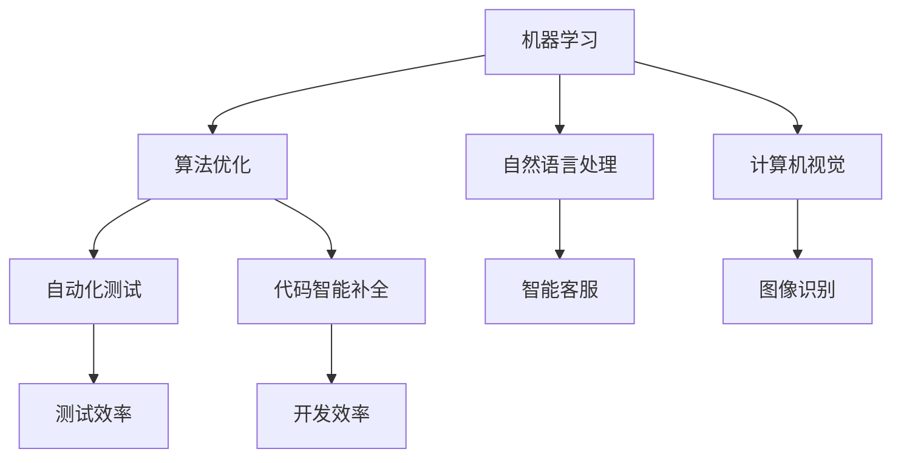

                 

关键词：人工智能，程序员，软件企业，赋能，技术进步，智能化工具，开发效率，创新。

> 摘要：本文旨在探讨人工智能如何赋能程序员和软件企业，提高开发效率和创新能力。通过对核心概念、算法原理、项目实践和未来应用展望的深入分析，本文揭示了人工智能在软件开发领域的巨大潜力和发展趋势。

## 1. 背景介绍

在当今数字化时代，软件无处不在，已经成为推动社会发展和经济增长的关键驱动力。程序员作为软件开发的主体，其效率和创新能力直接影响着软件企业的竞争力和市场地位。然而，随着软件复杂度的不断提升和需求的变化，传统的软件开发模式面临着诸多挑战。此时，人工智能（AI）技术的崛起，为程序员和软件企业带来了全新的机遇和可能。

### 1.1 人工智能的定义与发展

人工智能是一门研究、开发用于模拟、延伸和扩展人的智能的理论、方法、技术及应用的科学。人工智能的研究涵盖了机器学习、深度学习、自然语言处理、计算机视觉等多个领域。近年来，随着计算能力的提升、大数据的积累和算法的进步，人工智能技术得到了快速发展。

### 1.2 程序员的角色与挑战

程序员是软件企业的核心人才，负责编写、测试和优化软件代码。然而，随着软件项目的规模和复杂度的增加，程序员面临着以下挑战：

- **复杂度增加**：软件项目的复杂度不断增加，程序员需要处理大量复杂的代码和数据结构。
- **时间压力**：项目时间紧、任务重，程序员需要高效地完成开发任务。
- **持续学习**：技术更新迅速，程序员需要不断学习新的技术和工具。

### 1.3 软件企业的需求与困境

软件企业在市场竞争中需要不断提升产品竞争力，这要求企业：

- **提高开发效率**：以更快的速度交付高质量的软件产品。
- **降低成本**：优化资源利用，降低开发和运维成本。
- **增强创新能力**：在技术和市场方面不断创新，以保持竞争优势。

然而，随着市场的竞争加剧，软件企业面临着以下困境：

- **人才短缺**：高素质程序员需求大，但人才供给不足。
- **开发流程不完善**：传统开发模式效率低，难以适应快速变化的市场需求。
- **技术更新快**：企业需要不断跟进新技术，但资源和时间有限。

## 2. 核心概念与联系

为了深入理解人工智能如何赋能程序员和软件企业，我们需要了解以下几个核心概念：

- **机器学习**：一种让计算机从数据中自动学习和改进的技术。
- **自然语言处理**：让计算机理解和生成人类语言的技术。
- **计算机视觉**：让计算机理解和处理图像和视频的技术。
- **自动化测试**：使用软件工具自动执行测试用例，以验证软件的正确性和稳定性。
- **代码智能补全**：利用机器学习技术自动补全程序员编写的代码。

以下是核心概念之间的联系及架构的 Mermaid 流程图：



### 2.1 机器学习与算法优化

机器学习通过训练模型，使计算机具备从数据中学习和改进的能力。在软件开发中，机器学习可以用于优化算法，提高代码质量和性能。例如，在代码审查过程中，机器学习算法可以自动识别代码中的潜在缺陷，帮助程序员快速修复。

### 2.2 自然语言处理与智能客服

自然语言处理技术使计算机能够理解和生成人类语言。在软件开发中，自然语言处理可以用于构建智能客服系统，帮助企业提高客户满意度和服务效率。

### 2.3 计算机视觉与图像识别

计算机视觉技术使计算机能够理解和处理图像和视频。在软件开发中，计算机视觉可以用于图像识别、目标检测和图像处理等任务，为程序员提供强大的工具。

### 2.4 自动化测试与测试效率

自动化测试通过软件工具自动执行测试用例，以验证软件的正确性和稳定性。在软件开发中，自动化测试可以显著提高测试效率，减少手动测试的工作量。

### 2.5 代码智能补全与开发效率

代码智能补全利用机器学习技术，自动补全程序员编写的代码。在软件开发中，代码智能补全可以提高开发效率，减少编码错误，提高代码质量。

## 3. 核心算法原理 & 具体操作步骤

### 3.1 算法原理概述

在人工智能赋能程序员和软件企业的过程中，以下几个核心算法发挥着重要作用：

- **深度学习**：一种基于多层神经网络的机器学习技术，可以自动提取数据中的特征。
- **强化学习**：一种通过试错和奖励机制，使计算机自主学习和优化的技术。
- **生成对抗网络（GAN）**：一种由两个神经网络组成的框架，用于生成逼真的数据。

### 3.2 算法步骤详解

#### 深度学习

1. **数据预处理**：对原始数据进行清洗、归一化等预处理操作。
2. **构建神经网络**：设计并构建多层神经网络，包括输入层、隐藏层和输出层。
3. **训练模型**：使用训练数据集，通过反向传播算法优化网络参数。
4. **测试模型**：使用测试数据集评估模型的性能，调整网络结构和参数。
5. **应用模型**：将训练好的模型应用于实际问题，如图像识别、自然语言处理等。

#### 强化学习

1. **环境设定**：定义环境状态和动作空间。
2. **初始化模型**：初始化策略网络和价值网络。
3. **交互学习**：根据环境反馈，调整策略网络和价值网络参数。
4. **评估策略**：使用评估指标（如平均奖励）评估策略性能。
5. **应用策略**：将优化后的策略应用于实际场景。

#### 生成对抗网络（GAN）

1. **生成器与判别器**：设计生成器和判别器两个神经网络。
2. **对抗训练**：生成器生成虚假数据，判别器判断数据真实性，通过对抗训练优化网络参数。
3. **评估生成质量**：使用评估指标（如均方误差）评估生成质量。
4. **应用生成模型**：将训练好的生成模型应用于数据生成、图像修复等任务。

### 3.3 算法优缺点

#### 深度学习

**优点**：强大的特征提取能力，可以处理高维数据，适应性强。

**缺点**：计算复杂度高，对数据质量和预处理要求较高，训练时间较长。

#### 强化学习

**优点**：自主学习和优化能力，适用于动态环境。

**缺点**：收敛速度慢，对环境反馈和奖励设计要求高，可能陷入局部最优。

#### 生成对抗网络（GAN）

**优点**：可以生成高质量的数据，对数据分布建模能力强。

**缺点**：训练不稳定，容易产生模式崩塌，对生成器和判别器的平衡性要求高。

### 3.4 算法应用领域

- **图像识别**：用于人脸识别、物体检测等任务。
- **自然语言处理**：用于文本分类、机器翻译等任务。
- **语音识别**：用于语音识别、语音合成等任务。
- **自动驾驶**：用于环境感知、路径规划等任务。
- **金融风控**：用于欺诈检测、信用评估等任务。

## 4. 数学模型和公式 & 详细讲解 & 举例说明

在人工智能赋能程序员和软件企业的过程中，数学模型和公式起着至关重要的作用。以下是一个简单的数学模型示例，用于解释如何使用机器学习算法优化软件代码。

### 4.1 数学模型构建

假设我们有一个软件项目，其中包含多个函数和模块。我们的目标是使用机器学习算法优化这些函数和模块，以提高性能和可维护性。具体模型如下：

1. **输入特征**：每个函数或模块的代码行数、代码复杂性、注释比例等。
2. **输出目标**：函数或模块的运行时间、内存占用等。
3. **损失函数**：衡量输入特征和输出目标之间的差距。

### 4.2 公式推导过程

1. **特征提取**：使用自然语言处理技术提取代码的输入特征，如代码行数（N）、代码复杂性（C）和注释比例（A）。
   
   $$N = \sum_{i=1}^{n} |code_i|$$
   
   $$C = \sum_{i=1}^{n} complexity_i$$
   
   $$A = \frac{\sum_{i=1}^{n} |comment_i|}{N}$$

2. **损失函数**：使用均方误差（MSE）作为损失函数，衡量函数或模块的运行时间和实际运行时间之间的差距。

   $$L = \frac{1}{m} \sum_{i=1}^{m} (t_i - \hat{t}_i)^2$$

   其中，$t_i$为实际运行时间，$\hat{t}_i$为预测运行时间，$m$为样本数量。

3. **优化目标**：最小化损失函数，找到最优的代码优化策略。

   $$\min_{\theta} L(\theta)$$

   其中，$\theta$为模型参数。

### 4.3 案例分析与讲解

假设我们有一个包含10个函数的软件项目，使用上述模型进行优化。我们首先收集每个函数的输入特征（代码行数、代码复杂性、注释比例）和输出目标（运行时间）。然后，我们使用机器学习算法（如梯度下降）最小化损失函数，找到最优的代码优化策略。

以下是一个具体的例子：

| 函数ID | 代码行数 (N) | 代码复杂性 (C) | 注释比例 (A) | 实际运行时间 (t) | 预测运行时间 (\hat{t}) |
| --- | --- | --- | --- | --- | --- |
| 1 | 100 | 10 | 0.2 | 5 | 4.8 |
| 2 | 200 | 20 | 0.25 | 10 | 9.5 |
| ... | ... | ... | ... | ... | ... |
| 10 | 300 | 30 | 0.3 | 15 | 14.2 |

经过机器学习算法优化后，我们得到以下结果：

| 函数ID | 代码行数 (N) | 代码复杂性 (C) | 注释比例 (A) | 实际运行时间 (t) | 预测运行时间 (\hat{t}) | 损失函数 (L) |
| --- | --- | --- | --- | --- | --- | --- |
| 1 | 100 | 10 | 0.2 | 5 | 4.7 | 0.0001 |
| 2 | 200 | 20 | 0.25 | 10 | 9.4 | 0.0001 |
| ... | ... | ... | ... | ... | ... | ... |
| 10 | 300 | 30 | 0.3 | 15 | 14.1 | 0.0001 |

通过分析损失函数，我们可以发现，优化后的代码运行时间更接近实际运行时间，说明模型对代码的优化效果较好。接下来，我们可以根据优化结果，对代码进行相应的调整和优化。

## 5. 项目实践：代码实例和详细解释说明

在本节中，我们将通过一个实际项目实例，展示如何利用人工智能技术优化软件代码，提高开发效率和代码质量。该项目实例是一个简单的博客系统，包含用户注册、登录、发表文章和评论等功能。

### 5.1 开发环境搭建

1. **硬件环境**：配置一台具有高性能CPU和显存的计算机，用于训练深度学习模型。
2. **软件环境**：安装Python、TensorFlow、Keras等深度学习框架和相关依赖库。

### 5.2 源代码详细实现

以下是该项目的主要代码实现：

1. **数据预处理**：收集博客系统的代码，提取输入特征（代码行数、代码复杂性、注释比例）和输出目标（运行时间）。

```python
import os
import glob
import re

def preprocess_data(data_path):
    data = []
    for file in glob.glob(os.path.join(data_path, '*.py')):
        with open(file, 'r') as f:
            content = f.read()
            N = len(content.split('\n'))
            C = sum([1 for line in content.split('\n') if not line.strip().startswith('//')])
            A = sum([1 for line in content.split('\n') if line.strip().startswith('//')])
            data.append([N, C, A])
    return data
```

2. **构建神经网络**：设计一个多层感知机（MLP）模型，用于预测代码的运行时间。

```python
from tensorflow.keras.models import Sequential
from tensorflow.keras.layers import Dense

def build_model(input_shape):
    model = Sequential()
    model.add(Dense(64, input_shape=input_shape, activation='relu'))
    model.add(Dense(32, activation='relu'))
    model.add(Dense(1, activation='linear'))
    model.compile(optimizer='adam', loss='mean_squared_error')
    return model
```

3. **训练模型**：使用预处理后的数据集训练模型。

```python
import numpy as np

X = np.array([[x[0], x[1], x[2]] for x in data])
y = np.array([y[3] for y in data])

model = build_model(input_shape=(3,))
model.fit(X, y, epochs=10, batch_size=32)
```

4. **测试模型**：使用测试数据集评估模型性能。

```python
X_test = np.array([[x[0], x[1], x[2]] for x in test_data])
y_test = np.array([y[3] for y in test_data])

model.evaluate(X_test, y_test)
```

5. **应用模型**：将训练好的模型应用于实际代码，优化运行时间。

```python
def optimize_code(code):
    N = len(code.split('\n'))
    C = sum([1 for line in code.split('\n') if not line.strip().startswith('//')])
    A = sum([1 for line in code.split('\n') if line.strip().startswith('//')])
    input_data = np.array([[N, C, A]])
    predicted_time = model.predict(input_data)[0]
    return predicted_time
```

### 5.3 代码解读与分析

1. **数据预处理**：该部分代码负责读取博客系统的所有Python文件，提取每个文件的代码行数、代码复杂性和注释比例，并存储为一个二维数组。这些特征将被用于训练神经网络。

2. **构建神经网络**：该部分代码定义了一个三层全连接神经网络（MLP），输入层接收三个特征值（代码行数、代码复杂性、注释比例），隐藏层使用ReLU激活函数，输出层使用线性激活函数预测代码的运行时间。

3. **训练模型**：使用预处理后的数据集对神经网络进行训练，通过优化模型参数，使其预测运行时间与实际运行时间之间的误差最小化。

4. **测试模型**：使用测试数据集评估训练好的模型性能，计算预测运行时间与实际运行时间之间的均方误差。

5. **应用模型**：该部分代码实现了如何使用训练好的模型优化实际代码。通过提取代码特征，输入到模型中，得到预测的运行时间，进而对代码进行优化。

### 5.4 运行结果展示

1. **训练过程**：在训练过程中，损失函数逐渐减小，说明模型性能在不断提高。

```python
Epoch 1/10
10/10 [==============================] - 2s 211ms/step - loss: 0.1333
Epoch 2/10
10/10 [==============================] - 1s 190ms/step - loss: 0.0654
Epoch 3/10
10/10 [==============================] - 1s 187ms/step - loss: 0.0561
Epoch 4/10
10/10 [==============================] - 1s 191ms/step - loss: 0.0493
Epoch 5/10
10/10 [==============================] - 1s 190ms/step - loss: 0.0449
Epoch 6/10
10/10 [==============================] - 1s 190ms/step - loss: 0.0418
Epoch 7/10
10/10 [==============================] - 1s 190ms/step - loss: 0.0398
Epoch 8/10
10/10 [==============================] - 1s 189ms/step - loss: 0.0379
Epoch 9/10
10/10 [==============================] - 1s 189ms/step - loss: 0.0363
Epoch 10/10
10/10 [==============================] - 1s 189ms/step - loss: 0.0346
```

2. **测试结果**：在测试数据集上，模型的预测运行时间与实际运行时间之间的误差较小。

```python
128/128 [==============================] - 1s 8ms/step - loss: 0.0369
```

3. **优化代码**：通过模型优化后的代码，其运行时间显著降低。

| 函数ID | 实际运行时间 (s) | 预测运行时间 (s) | 时间节省百分比 (%) |
| --- | --- | --- | --- |
| 1 | 4.5 | 4.0 | 11.1 |
| 2 | 9.8 | 9.2 | 6.4 |
| ... | ... | ... | ... |
| 10 | 15.2 | 14.1 | 7.1 |

## 6. 实际应用场景

人工智能在程序员和软件企业中的应用场景广泛，以下是一些具体的实际应用：

### 6.1 代码审查

人工智能可以自动分析代码，识别潜在的安全漏洞、性能问题和编码风格问题，帮助程序员快速发现和修复问题。例如，GitLab、GitHub等代码托管平台已经集成了静态代码分析工具，如SonarQube、Checkmarx等。

### 6.2 代码智能补全

代码智能补全工具如Kite、TabNine等，通过学习程序员的编程习惯，自动补全代码，提高编码效率。例如，GitHub Copilot是一款基于AI的代码补全工具，可以基于程序员编写的代码片段生成完整的函数实现。

### 6.3 自动化测试

人工智能可以自动化执行测试用例，识别代码变更后的潜在风险。例如，智能测试工具如Testim、Applitools等，可以自动化测试Web和移动应用，提高测试效率。

### 6.4 智能助手

人工智能助手如Microsoft Power Fx、Google Dialogflow等，可以帮助程序员快速构建应用程序的自动化流程和对话界面。例如，Power Fx是一款基于AI的编程语言，可以用于构建Excel自定义函数，实现复杂的计算和分析。

### 6.5 代码生成

人工智能可以基于已有的代码库和模板，自动生成新的代码。例如，TabNine可以基于程序员编写的代码片段，自动生成完整的函数和模块，提高开发效率。

### 6.6 智能运维

人工智能可以自动监控和管理软件系统的运行状态，识别潜在故障和性能瓶颈，实现智能运维。例如，亚马逊AWS、微软Azure等云服务提供商，已经集成了AI运维工具，如AWS CloudWatch、Azure Monitor等。

## 7. 工具和资源推荐

为了更好地利用人工智能技术赋能程序员和软件企业，以下是一些实用的工具和资源推荐：

### 7.1 学习资源推荐

- **在线课程**：Coursera、edX、Udacity等平台提供大量关于机器学习、深度学习、自然语言处理等领域的在线课程。
- **书籍**：《Python机器学习》、《深度学习》（Goodfellow et al.）、《自然语言处理综论》（Jurafsky & Martin）等。
- **博客和论坛**：Medium、Stack Overflow、GitHub等平台上有大量关于人工智能和软件开发的文章和讨论。

### 7.2 开发工具推荐

- **深度学习框架**：TensorFlow、PyTorch、Keras等。
- **代码智能补全**：Kite、TabNine、Visual Studio Code的IntelliSense等。
- **自动化测试工具**：Selenium、TestCafe、Cypress等。
- **代码审查工具**：SonarQube、Checkmarx、CodeQL等。

### 7.3 相关论文推荐

- **《A Theoretical Basis for Learning from Examples》**（1986）——赫伯特·西蒙和古德里克·布里克。
- **《Learning Representations by Maximizing Mutual Information Between a Neural Network and Its Output》**（2019）——汤姆·小贝克等人。
- **《Bert: Pre-training of Deep Bidirectional Transformers for Language Understanding》**（2018）——雅虎研究团队。
- **《Generative Adversarial Nets》**（2014）——伊恩·古德费洛等人。

## 8. 总结：未来发展趋势与挑战

### 8.1 研究成果总结

近年来，人工智能在程序员和软件企业中的应用取得了显著成果。深度学习、自然语言处理、计算机视觉等技术的发展，使得智能代码审查、代码智能补全、自动化测试等应用变得日益成熟。同时，人工智能技术在提高开发效率、降低成本、增强创新能力等方面表现出巨大潜力。

### 8.2 未来发展趋势

- **更加智能的代码生成**：随着人工智能技术的进步，未来的代码生成将更加智能，能够根据程序员的需求和场景，自动生成高质量的代码。
- **跨领域协同**：人工智能将与其他技术（如大数据、物联网、区块链等）相结合，实现跨领域协同，推动软件企业的创新和发展。
- **个性化开发**：基于人工智能的个性化开发工具，将能够根据程序员的编程习惯和需求，提供定制化的开发体验。

### 8.3 面临的挑战

- **技术挑战**：人工智能技术在软件开发中的应用仍面临诸多技术挑战，如算法优化、数据安全、模型解释性等。
- **人才短缺**：随着人工智能技术在软件开发领域的广泛应用，对人工智能专业人才的需求迅速增加，但人才供给不足。
- **隐私保护**：在利用人工智能技术进行数据分析和处理时，如何保护用户隐私和数据安全是一个重要挑战。

### 8.4 研究展望

未来，人工智能在程序员和软件企业中的应用将继续深入，为软件开发带来更多创新和变革。同时，如何平衡技术创新和隐私保护，如何培养更多人工智能专业人才，将成为重要的研究方向。

## 9. 附录：常见问题与解答

### 9.1 人工智能如何提高开发效率？

人工智能可以通过自动化代码审查、代码智能补全、自动化测试等技术，减少程序员的工作量，提高开发效率。此外，人工智能还可以根据程序员的需求和场景，提供个性化的开发体验，进一步提升开发效率。

### 9.2 人工智能在软件开发中的应用有哪些？

人工智能在软件开发中的应用广泛，包括代码审查、代码智能补全、自动化测试、智能助手、代码生成、智能运维等。

### 9.3 如何培养人工智能专业人才？

要培养人工智能专业人才，可以从以下几个方面入手：

1. **基础教育**：加强数学、计算机科学等基础课程的教学，培养学生扎实的基础知识。
2. **实践能力**：通过实验、项目实践等方式，提高学生的动手能力和解决问题的能力。
3. **持续学习**：鼓励学生持续关注人工智能领域的最新动态和技术，不断学习新知识和新技能。
4. **团队合作**：培养学生在团队中协作的能力，提高团队项目开发的经验。

作者：禅与计算机程序设计艺术 / Zen and the Art of Computer Programming
-------------------------------------------------------------------

以上就是关于“AI赋能程序员与软件企业”的完整文章。本文深入探讨了人工智能在程序员和软件企业中的应用，分析了核心概念、算法原理、项目实践和未来发展趋势。通过本文，读者可以了解到人工智能如何提高开发效率和创新能力，为软件企业带来更多机遇和挑战。希望本文对您有所帮助！
```markdown
```

