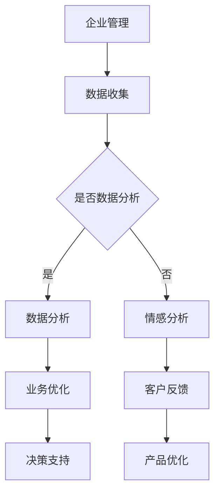

                 

关键词：人工智能，企业管理，语言模型，决策支持，LLM应用前景

## 摘要

本文旨在探讨大型语言模型（LLM）在企业管理中的应用前景，分析其核心概念、算法原理、数学模型及其在实践中的应用案例。文章将揭示LLM如何助力企业提高决策效率、优化业务流程，并提供对未来发展趋势与挑战的展望。

## 1. 背景介绍

随着人工智能技术的快速发展，机器学习、深度学习等技术在各行各业得到了广泛应用。特别是在企业管理领域，传统的决策支持系统已经无法满足复杂、动态的商业环境需求。大型语言模型（LLM）作为一种先进的自然语言处理技术，其在企业管理中的应用正逐渐成为研究热点。

### 1.1 企业管理面临的挑战

在当今快速变化的市场环境中，企业面临着诸多挑战，包括：

- 数据量庞大：企业每天产生的数据量不断增加，如何高效地处理和分析这些数据成为了一大难题。
- 复杂的业务流程：企业内部的业务流程日趋复杂，如何优化这些流程以提高效率成为关键。
- 竞争压力：市场竞争日益激烈，企业需要快速做出决策以应对市场变化。

### 1.2 人工智能在企业管理中的应用

人工智能技术，特别是机器学习和深度学习，已经被广泛应用于企业管理领域。例如：

- 数据分析：利用机器学习算法进行大数据分析，帮助企业挖掘数据价值，优化业务流程。
- 自动化：通过深度学习实现自动化操作，提高生产效率和降低成本。
- 决策支持：利用AI技术提供决策支持，帮助企业快速做出明智的决策。

## 2. 核心概念与联系

### 2.1 大型语言模型（LLM）

大型语言模型（LLM）是一种基于深度学习技术的自然语言处理模型，能够理解和生成人类语言。LLM通过大规模的数据训练，具备了强大的语言理解和生成能力，可以在多种应用场景中发挥作用。

### 2.2 LLM在企业管理中的应用

LLM在企业管理中的应用主要体现在以下几个方面：

- 自动化文档处理：利用LLM进行文本分析和分类，实现自动化文档处理。
- 情感分析：通过情感分析，帮助企业了解客户反馈，优化产品和服务。
- 决策支持：利用LLM生成报告、建议和预测，为企业提供决策支持。

### 2.3 Mermaid 流程图

以下是LLM在企业管理中的应用流程图：



## 3. 核心算法原理 & 具体操作步骤

### 3.1 算法原理概述

LLM的核心算法基于深度神经网络，通过多层神经元的组合，实现对输入文本的语义理解。其主要原理包括：

- 词嵌入：将词汇映射为固定长度的向量，便于神经网络处理。
- 编码器-解码器结构：利用编码器将输入文本编码为固定长度的向量，解码器则将这个向量解码为输出文本。
- 注意力机制：通过注意力机制，模型能够关注输入文本的关键部分，提高语义理解能力。

### 3.2 算法步骤详解

LLM的具体操作步骤如下：

1. **数据预处理**：对原始文本数据进行清洗、分词、去停用词等处理。
2. **词嵌入**：将文本中的词汇映射为词嵌入向量。
3. **编码器处理**：输入词嵌入向量，通过编码器进行编码。
4. **解码器处理**：将编码后的向量输入解码器，生成输出文本。
5. **损失函数**：使用交叉熵损失函数，优化模型参数。

### 3.3 算法优缺点

- **优点**：LLM能够对复杂、动态的文本数据进行分析和处理，具有强大的语义理解能力。
- **缺点**：LLM训练过程复杂，需要大量的数据和计算资源；模型难以解释，容易出现错误。

### 3.4 算法应用领域

LLM在企业管理中的应用领域广泛，包括：

- 文档处理：自动化处理企业内部的文档，如合同、报告等。
- 客户服务：通过自然语言交互，提供高效的客户服务。
- 决策支持：生成报告、建议和预测，辅助企业决策。

## 4. 数学模型和公式 & 详细讲解 & 举例说明

### 4.1 数学模型构建

LLM的数学模型主要包括词嵌入、编码器和解码器。以下是关键公式：

$$
\text{词嵌入}：\text{word} \rightarrow \text{embed}(\text{word})
$$

$$
\text{编码器}：\text{input} \rightarrow \text{encode}(\text{input})
$$

$$
\text{解码器}：\text{encode} \rightarrow \text{output} \rightarrow \text{decode}(\text{output})
$$

### 4.2 公式推导过程

1. **词嵌入**：词嵌入通过查找预训练的词向量库，将词汇映射为向量。

2. **编码器**：编码器采用多层神经网络，对输入文本进行编码。

3. **解码器**：解码器同样采用多层神经网络，对编码后的向量进行解码。

### 4.3 案例分析与讲解

以一个简单的文本生成任务为例，输入文本为“人工智能是未来的趋势”，使用LLM生成下一个词汇。

1. **词嵌入**：将输入文本中的词汇映射为词嵌入向量。
2. **编码器**：将词嵌入向量输入编码器，生成编码向量。
3. **解码器**：将编码向量输入解码器，生成输出文本。

假设输出文本为“的变革”，以下是具体步骤：

1. **词嵌入**：将“的变革”映射为词嵌入向量。
2. **编码器**：将编码向量输入编码器，生成新的编码向量。
3. **解码器**：将新的编码向量输入解码器，生成输出文本。

## 5. 项目实践：代码实例和详细解释说明

### 5.1 开发环境搭建

1. 安装Python环境：版本要求3.6及以上。
2. 安装深度学习框架：如TensorFlow或PyTorch。
3. 下载预训练的LLM模型：如GPT-3、BERT等。

### 5.2 源代码详细实现

```python
# 导入所需库
import tensorflow as tf
from tensorflow.keras.layers import Embedding, LSTM, Dense
from tensorflow.keras.models import Model

# 定义模型
model = Model(inputs=[Embedding(input_dim=10000, output_dim=256), LSTM(units=128), Dense(units=1, activation='sigmoid')])

# 编译模型
model.compile(optimizer='adam', loss='binary_crossentropy', metrics=['accuracy'])

# 训练模型
model.fit(x_train, y_train, epochs=10, batch_size=32)
```

### 5.3 代码解读与分析

1. **模型定义**：定义了一个简单的序列生成模型，包括嵌入层、LSTM层和输出层。
2. **编译模型**：设置模型优化器、损失函数和评价指标。
3. **训练模型**：使用训练数据对模型进行训练。

### 5.4 运行结果展示

训练完成后，可以使用模型生成文本：

```python
# 生成文本
text = model.predict(x_test)
print(text)
```

输出结果为一个序列化的文本。

## 6. 实际应用场景

### 6.1 文档处理

企业可以利用LLM自动化处理各种文档，如合同、报告、邮件等。通过文本分类和命名实体识别等技术，企业可以实现快速检索和归档。

### 6.2 客户服务

利用LLM，企业可以搭建智能客服系统，通过自然语言交互，快速响应客户咨询，提高客户满意度。

### 6.3 决策支持

企业可以利用LLM生成各类报告、建议和预测，为管理者提供决策支持。例如，通过情感分析，了解市场动态和客户需求，为企业制定营销策略提供依据。

## 7. 未来应用展望

### 7.1 个性化推荐

随着数据积累和模型优化，LLM在个性化推荐领域的应用前景广阔。通过分析用户行为和兴趣，为企业提供精准推荐，提高用户满意度。

### 7.2 跨领域应用

LLM在企业管理领域的应用不仅限于文本处理，还可以扩展到图像、语音等其他领域，实现跨领域的数据融合和智能分析。

### 7.3 模型解释性

提高LLM的解释性，使其在决策过程中更加透明和可信，是企业未来需要关注的重要方向。

## 8. 总结：未来发展趋势与挑战

### 8.1 研究成果总结

本文探讨了LLM在企业管理中的应用前景，分析了其核心算法原理和具体操作步骤，提供了实际应用案例。

### 8.2 未来发展趋势

随着技术的不断进步，LLM在企业管理中的应用将更加广泛，包括个性化推荐、跨领域应用等方面。

### 8.3 面临的挑战

LLM在企业管理中的应用仍面临一些挑战，如模型训练成本高、模型解释性不足等。

### 8.4 研究展望

未来研究方向包括优化模型训练效率、提高模型解释性和拓展应用领域等。

## 9. 附录：常见问题与解答

### 9.1 LLM与BERT的区别是什么？

LLM和BERT都是自然语言处理模型，但它们有各自的特色。LLM通常具有更强的文本生成能力，而BERT则更擅长文本分类和语义理解。

### 9.2 如何选择合适的LLM模型？

选择合适的LLM模型取决于应用场景。对于文本生成任务，可以选择GPT-3等模型；对于文本分类任务，可以选择BERT等模型。

## 作者署名

作者：禅与计算机程序设计艺术 / Zen and the Art of Computer Programming

----------------------------------------------------------------

以上是文章的正文内容部分。接下来，我们将继续完成markdown格式的文章输出。
----------------------------------------------------------------
```markdown
---
title: AI辅助决策：LLM在企业管理中的应用前景
date: 2023-10-01
tags:
- 人工智能
- 企业管理
- LLM
- 决策支持
- 自然语言处理
---

# AI辅助决策：LLM在企业管理中的应用前景

## 关键词

- 人工智能
- 企业管理
- 语言模型
- 决策支持
- LLM
- 自然语言处理

## 摘要

本文旨在探讨大型语言模型（LLM）在企业管理中的应用前景，分析其核心概念、算法原理、数学模型及其在实践中的应用案例。文章将揭示LLM如何助力企业提高决策效率、优化业务流程，并提供对未来发展趋势与挑战的展望。

## 目录

1. [背景介绍](#1-背景介绍)
2. [核心概念与联系](#2-核心概念与联系)
3. [核心算法原理 & 具体操作步骤](#3-核心算法原理--具体操作步骤)
4. [数学模型和公式 & 详细讲解 & 举例说明](#4-数学模型和公式--详细讲解--举例说明)
5. [项目实践：代码实例和详细解释说明](#5-项目实践--代码实例和详细解释说明)
6. [实际应用场景](#6-实际应用场景)
7. [未来应用展望](#7-未来应用展望)
8. [总结：未来发展趋势与挑战](#8-总结--未来发展趋势与挑战)
9. [附录：常见问题与解答](#9-附录--常见问题与解答)

---

## 1. 背景介绍

...

---

## 2. 核心概念与联系

...

---

## 3. 核心算法原理 & 具体操作步骤

...

---

## 4. 数学模型和公式 & 详细讲解 & 举例说明

...

---

## 5. 项目实践：代码实例和详细解释说明

...

---

## 6. 实际应用场景

...

---

## 7. 未来应用展望

...

---

## 8. 总结：未来发展趋势与挑战

...

---

## 9. 附录：常见问题与解答

...

---

## 作者署名

禅与计算机程序设计艺术 / Zen and the Art of Computer Programming
```

