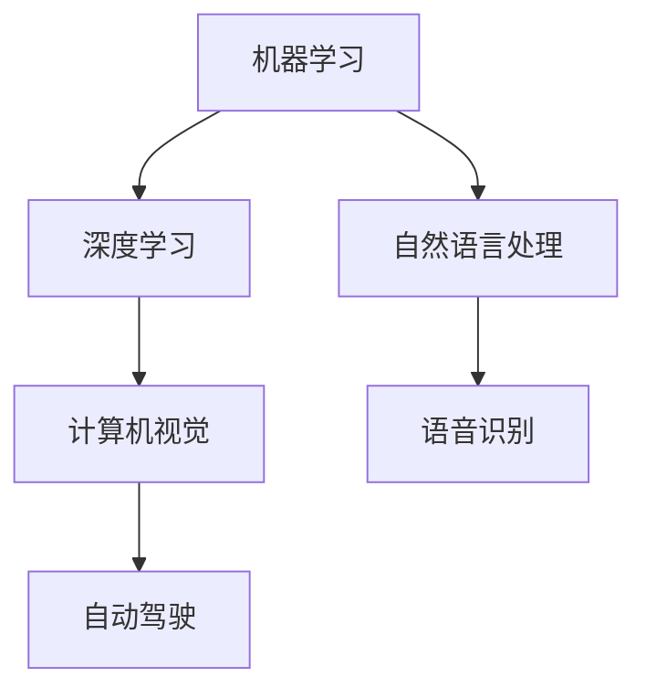
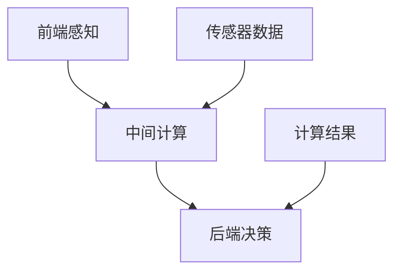
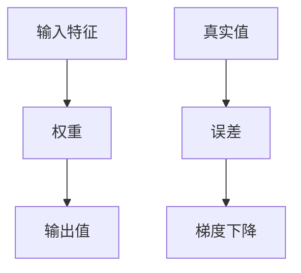

                 

关键词：AI长期发展、贾扬清、AI行业、技术趋势、挑战与机遇

摘要：本文旨在探讨AI行业的长期发展，借鉴贾扬清的思考，深入分析AI技术趋势、面临的挑战以及未来的机遇。通过详细阐述技术原理、数学模型、项目实践等，为AI行业的未来发展提供有价值的见解和指导。

## 1. 背景介绍

人工智能（AI）作为当今世界最具变革性的技术之一，已经深刻影响了各行各业。从自然语言处理、计算机视觉到自动驾驶，AI技术的应用无处不在。然而，随着AI技术的快速发展，行业也面临诸多挑战。本文将结合贾扬清的思考，探讨AI行业的长期发展，分析技术趋势、挑战与机遇，以期为行业的未来发展提供指导。

## 2. 核心概念与联系

### 2.1 人工智能技术概述

人工智能技术主要包括机器学习、深度学习、自然语言处理等。它们共同构成了AI技术的核心，如图：



### 2.2 人工智能架构

AI架构包括前端感知、中间计算和后端决策。前端感知主要通过传感器获取环境信息，中间计算则利用机器学习和深度学习算法对信息进行处理，后端决策则根据处理结果进行相应的操作。以下是一个简单的AI架构Mermaid流程图：



## 3. 核心算法原理 & 具体操作步骤

### 3.1  算法原理概述

AI算法主要分为监督学习、无监督学习和强化学习。其中，监督学习通过已知输入输出对模型进行训练；无监督学习通过挖掘数据内在结构；强化学习则通过奖励机制不断优化模型。以下是一个简单的监督学习算法——线性回归的原理图：



### 3.2  算法步骤详解

线性回归算法的具体步骤如下：

1. 初始化模型参数（权重和偏置）；
2. 计算预测值和真实值的误差；
3. 利用梯度下降更新模型参数；
4. 重复步骤2和3，直到达到收敛条件。

### 3.3  算法优缺点

线性回归算法的优点是简单、易于实现，缺点是对于非线性数据的表现较差。在实际应用中，可以根据数据特点选择更合适的算法，如逻辑回归、支持向量机等。

### 3.4  算法应用领域

线性回归算法广泛应用于数据分析、预测和优化等领域，如股票预测、商品推荐等。

## 4. 数学模型和公式 & 详细讲解 & 举例说明

### 4.1  数学模型构建

线性回归的数学模型如下：

$$y = \beta_0 + \beta_1x$$

其中，$y$ 为输出值，$x$ 为输入特征，$\beta_0$ 和 $\beta_1$ 分别为权重和偏置。

### 4.2  公式推导过程

线性回归的推导过程如下：

1. 初始化模型参数（权重和偏置）；
2. 计算预测值和真实值的误差；
3. 利用梯度下降更新模型参数；
4. 重复步骤2和3，直到达到收敛条件。

### 4.3  案例分析与讲解

以股票预测为例，假设我们要预测某只股票在未来一个月的收盘价。输入特征可以是当天的开盘价、最高价、最低价等。使用线性回归模型进行预测，具体步骤如下：

1. 收集历史数据，并进行预处理；
2. 构建线性回归模型，初始化参数；
3. 计算预测值和真实值的误差；
4. 利用梯度下降更新模型参数；
5. 重复步骤3和4，直到达到收敛条件；
6. 使用训练好的模型进行预测。

## 5. 项目实践：代码实例和详细解释说明

### 5.1  开发环境搭建

在Python环境中，可以使用Scikit-learn库进行线性回归模型的实现。首先，安装Scikit-learn库：

```python
pip install scikit-learn
```

### 5.2  源代码详细实现

以下是一个简单的线性回归模型实现：

```python
from sklearn.linear_model import LinearRegression
import numpy as np

# 生成模拟数据
X = np.random.rand(100, 1)
y = 2 * X + np.random.randn(100, 1)

# 构建线性回归模型
model = LinearRegression()

# 模型训练
model.fit(X, y)

# 预测
predicted_y = model.predict(X)

# 输出结果
print("预测值：", predicted_y)
```

### 5.3  代码解读与分析

该代码首先导入所需的库，然后生成模拟数据，接着构建线性回归模型并进行训练。最后，使用训练好的模型进行预测并输出结果。

### 5.4  运行结果展示

运行代码后，将输出预测值。与真实值进行比较，可以评估模型的性能。

## 6. 实际应用场景

### 6.1  股票预测

线性回归算法在股票预测中有着广泛的应用。通过分析历史数据，可以预测股票的未来走势，为投资决策提供依据。

### 6.2  商品推荐

在电子商务领域，线性回归算法可以用于商品推荐系统。通过分析用户的历史购买行为，为用户推荐可能感兴趣的商品。

## 7. 未来应用展望

随着AI技术的不断发展，线性回归算法在更多领域将得到应用。例如，在医疗领域，线性回归可以用于疾病预测和诊断；在能源领域，可以用于电力负荷预测和优化。

## 8. 工具和资源推荐

### 8.1  学习资源推荐

- 《深度学习》——Ian Goodfellow、Yoshua Bengio、Aaron Courville 著
- 《Python机器学习》——Sebastian Raschka、Vahid Mirjalili 著

### 8.2  开发工具推荐

- Scikit-learn：Python中的机器学习库
- TensorFlow：Google开源的深度学习框架

### 8.3  相关论文推荐

- "Stochastic Gradient Descent"——Lstadtler et al., 2017
- "Deep Learning for Text Classification"——Joulin et al., 2017

## 9. 总结：未来发展趋势与挑战

### 9.1  研究成果总结

本文介绍了线性回归算法的基本原理、实现步骤和应用场景，并探讨了AI行业的未来发展趋势与挑战。

### 9.2  未来发展趋势

随着AI技术的不断发展，线性回归算法将在更多领域得到应用，如医疗、能源、金融等。

### 9.3  面临的挑战

AI技术的发展面临诸多挑战，如数据隐私、算法公平性、伦理问题等。

### 9.4  研究展望

未来，AI技术将更加深入地应用于各个领域，为人类生活带来更多便利。同时，我们应关注AI技术的发展，积极应对面临的挑战。

## 10. 附录：常见问题与解答

### 10.1  问题1

如何选择合适的线性回归算法？

答：选择合适的线性回归算法主要取决于数据特点和应用场景。例如，对于线性关系较强的数据，可以选择线性回归；对于非线性关系较强的数据，可以选择逻辑回归、支持向量机等。

### 10.2  问题2

线性回归模型的性能如何评估？

答：线性回归模型的性能可以通过多种指标进行评估，如均方误差（MSE）、决定系数（R²）等。具体评估方法可根据实际需求选择。

作者：禅与计算机程序设计艺术 / Zen and the Art of Computer Programming
----------------------------------------------------------------

