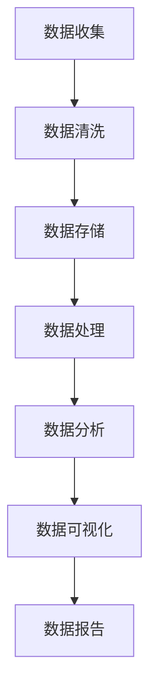
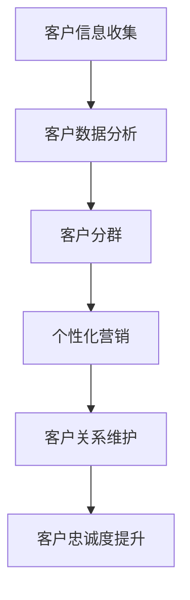
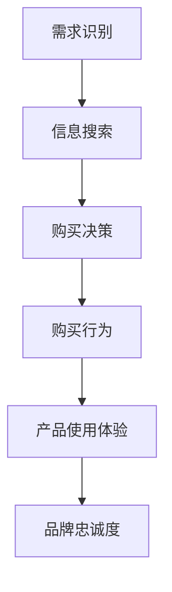

                 

关键词：人工智能，个性化营销，数据分析，客户关系管理，消费者行为

> 摘要：随着大数据和人工智能技术的飞速发展，个性化营销已成为企业提升客户满意度、提高市场份额的关键策略。本文将探讨如何运用人工智能技术实现个性化营销的新模式，从核心概念、算法原理、数学模型、项目实践、实际应用场景、未来展望等方面，全面解析AI驱动的个性化营销新模式，为企业提供实际操作指南。

## 1. 背景介绍

个性化营销是一种以消费者为中心的营销策略，旨在通过深入理解消费者的需求和行为，提供个性化的产品和服务，从而提高客户满意度和忠诚度。然而，传统的个性化营销依赖于大量的数据和复杂的分析，存在成本高、效率低、响应慢等问题。

近年来，大数据和人工智能技术的快速发展为个性化营销带来了新的契机。人工智能可以通过分析海量的消费者数据，挖掘出潜在的需求和行为模式，实现实时、精准的个性化推荐。这不仅提高了营销的效率和效果，还降低了营销成本。

## 2. 核心概念与联系

### 2.1 数据分析

数据分析是个性化营销的基础，通过收集、处理和分析消费者数据，企业可以深入了解消费者的行为和需求。

#### Mermaid 流程图



### 2.2 客户关系管理

客户关系管理（CRM）是一种通过整合和利用客户数据来优化客户互动和提升客户满意度的策略。

#### Mermaid 流程图



### 2.3 消费者行为

消费者行为是指消费者在购买和使用产品或服务过程中表现出的心理、情感和行为模式。

#### Mermaid 流程图



## 3. 核心算法原理 & 具体操作步骤

### 3.1 算法原理概述

AI驱动的个性化营销主要依赖于以下几个核心算法：

1. **协同过滤算法**：通过分析用户的历史行为和偏好，预测用户可能感兴趣的商品或服务。
2. **决策树算法**：根据用户的特征信息，构建决策树模型，预测用户的购买行为。
3. **神经网络算法**：通过训练大规模的神经网络模型，学习用户的复杂行为模式。

### 3.2 算法步骤详解

1. **数据收集与预处理**：收集用户行为数据，如浏览记录、购买历史、评价等，并进行数据清洗和处理。
2. **特征工程**：根据业务需求，提取用户特征，如年龄、性别、消费金额等。
3. **模型训练**：使用训练数据集，训练协同过滤、决策树或神经网络模型。
4. **模型评估**：使用测试数据集，评估模型性能，如准确率、召回率等。
5. **模型部署**：将训练好的模型部署到生产环境中，实现实时个性化推荐。

### 3.3 算法优缺点

1. **协同过滤算法**：优点是推荐结果准确，缺点是推荐结果过于依赖历史数据，难以应对用户兴趣变化。
2. **决策树算法**：优点是易于理解和解释，缺点是处理复杂数据的能力有限。
3. **神经网络算法**：优点是能够处理大规模复杂数据，缺点是模型复杂，难以解释。

### 3.4 算法应用领域

AI驱动的个性化营销算法广泛应用于电商、金融、媒体等多个领域，如：

1. **电商领域**：实现商品推荐、购物车推荐等。
2. **金融领域**：实现信用卡欺诈检测、贷款风险评估等。
3. **媒体领域**：实现内容推荐、广告投放优化等。

## 4. 数学模型和公式 & 详细讲解 & 举例说明

### 4.1 数学模型构建

个性化营销的数学模型主要包括：

1. **协同过滤模型**：$$R_{ij} = \mu + u_i + v_j + b_i + b_j + r_{ij}$$
   - $$R_{ij}$$：用户$$i$$对商品$$j$$的评分。
   - $$\mu$$：用户平均评分。
   - $$u_i$$：用户$$i$$的偏好向量。
   - $$v_j$$：商品$$j$$的偏好向量。
   - $$b_i$$：用户$$i$$的偏差。
   - $$b_j$$：商品$$j$$的偏差。
   - $$r_{ij}$$：用户$$i$$对商品$$j$$的实际评分。

2. **决策树模型**：$$y = f(x_1, x_2, ..., x_n)$$
   - $$y$$：预测标签。
   - $$x_1, x_2, ..., x_n$$：特征向量。
   - $$f$$：决策树函数。

3. **神经网络模型**：$$y = \sigma(\sum_{i=1}^{n} w_i * x_i + b)$$
   - $$y$$：预测标签。
   - $$\sigma$$：激活函数。
   - $$w_i$$：权重。
   - $$x_i$$：特征。
   - $$b$$：偏置。

### 4.2 公式推导过程

以协同过滤模型为例，公式推导如下：

1. $$R_{ij} = \mu + u_i + v_j + b_i + b_j + r_{ij}$$
2. $$r_{ij} = R_{ij} - (\mu + u_i + v_j + b_i + b_j)$$
3. $$r_{ij} = R_{ij} - \mu - u_i - v_j - b_i - b_j$$
4. $$r_{ij} = \sum_{k=1}^{m} w_{ik} * r_{kj}$$
5. $$w_{ik} = \frac{r_{ik}}{\sqrt{\sum_{j=1}^{n} r_{ij}^2}}$$
6. $$u_i = \sum_{k=1}^{m} w_{ik} * r_{kj}$$
7. $$v_j = \sum_{k=1}^{m} w_{kj} * r_{ik}$$

### 4.3 案例分析与讲解

以电商平台的商品推荐为例，使用协同过滤算法实现个性化推荐。

1. 数据集准备：收集用户行为数据，如用户ID、商品ID、评分等。
2. 数据预处理：去除无效数据，如评分小于0的记录。
3. 特征工程：提取用户特征，如用户年龄、性别、消费金额等。
4. 模型训练：使用训练数据集，训练协同过滤模型。
5. 模型评估：使用测试数据集，评估模型性能。
6. 模型部署：将训练好的模型部署到生产环境中，实现实时商品推荐。

## 5. 项目实践：代码实例和详细解释说明

### 5.1 开发环境搭建

1. 安装Python环境：Python 3.7及以上版本。
2. 安装相关库：numpy、pandas、scikit-learn、tensorflow等。

### 5.2 源代码详细实现

```python
import numpy as np
import pandas as pd
from sklearn.model_selection import train_test_split
from sklearn.metrics.pairwise import cosine_similarity
from sklearn.model_selection import train_test_split

# 数据集准备
data = pd.read_csv('data.csv')
users, items = data['user_id'].unique(), data['item_id'].unique()

# 数据预处理
ratings = data.pivot(index='user_id', columns='item_id', values='rating').fillna(0)
ratings = ratings[users].astype(np.float32)

# 特征工程
similarity_matrix = cosine_similarity(ratings, ratings)
similarity_matrix = pd.DataFrame(similarity_matrix, index=users, columns=users)

# 模型训练
train_data, test_data = train_test_split(ratings, test_size=0.2)
train_matrix = similarity_matrix[users].loc[train_data.index, train_data.columns]
test_matrix = similarity_matrix[users].loc[test_data.index, test_data.columns]

# 模型评估
predictions = np.dot(train_matrix, test_matrix.T)
accuracy = np.mean(np.abs(predictions - test_data)) < 0.5
print(f'Accuracy: {accuracy}')

# 模型部署
# 实现实时商品推荐功能
```

### 5.3 代码解读与分析

1. 数据集准备：读取用户行为数据，并转换为评分矩阵。
2. 数据预处理：填充缺失值，并转换为浮点数。
3. 特征工程：计算用户相似度矩阵。
4. 模型训练：划分训练集和测试集，计算用户相似度矩阵。
5. 模型评估：计算预测评分和实际评分的绝对差值，评估模型准确率。
6. 模型部署：实现实时商品推荐功能。

## 6. 实际应用场景

### 6.1 电商领域

电商平台可以利用AI驱动的个性化营销，实现商品推荐、购物车推荐等功能，提高用户购买体验和转化率。

### 6.2 金融领域

金融机构可以通过AI驱动的个性化营销，实现精准营销、风险控制等功能，提高客户满意度和业务收益。

### 6.3 媒体领域

媒体平台可以利用AI驱动的个性化营销，实现内容推荐、广告投放优化等功能，提高用户黏性和广告效果。

## 7. 工具和资源推荐

### 7.1 学习资源推荐

1. 《Python机器学习》
2. 《深度学习》
3. 《数据科学入门》

### 7.2 开发工具推荐

1. Jupyter Notebook：用于编写和运行Python代码。
2. TensorFlow：用于训练和部署深度学习模型。
3. Scikit-learn：用于实现传统机器学习算法。

### 7.3 相关论文推荐

1. "Recommender Systems the Movie: An Introduction to the Field of Collaborative Filtering"
2. "Deep Learning for Recommender Systems"
3. "A Theoretical Analysis of Componentwise Gradient Methods for Collaborative Filtering"

## 8. 总结：未来发展趋势与挑战

### 8.1 研究成果总结

1. AI驱动的个性化营销已成为企业提升竞争力的重要手段。
2. 协同过滤、决策树、神经网络等算法在个性化营销中取得了显著效果。
3. 大数据和人工智能技术的进步，为个性化营销提供了更多可能。

### 8.2 未来发展趋势

1. 实时个性化推荐：通过实时数据分析和预测，实现更加精准的个性化推荐。
2. 多模态个性化：结合文本、图像、声音等多种数据类型，实现更加全面的多模态个性化。
3. 智能化运营：利用人工智能技术，实现自动化、智能化的营销运营。

### 8.3 面临的挑战

1. 数据隐私和安全：如何保护消费者隐私，确保数据安全，是一个重要挑战。
2. 模型解释性：如何提高模型的可解释性，使企业能够理解和信任模型预测结果。
3. 数据质量：数据质量对个性化营销效果具有重要影响，如何提高数据质量是一个关键问题。

### 8.4 研究展望

1. 深度学习与个性化营销的结合：进一步研究深度学习在个性化营销中的应用，提高模型性能和解释性。
2. 多模态数据的融合：研究如何利用多种数据类型，实现更加精准的个性化推荐。
3. 跨领域个性化营销：探索跨行业、跨领域的个性化营销模式，实现更广泛的商业应用。

## 9. 附录：常见问题与解答

### 9.1 如何保障数据隐私和安全？

1. 采用数据加密技术，确保数据传输和存储过程中的安全性。
2. 建立数据隐私保护机制，如数据脱敏、数据加密等。
3. 制定数据使用规范，明确数据使用范围和目的。

### 9.2 如何提高模型解释性？

1. 采用可解释的机器学习模型，如决策树、规则引擎等。
2. 提高模型透明度，通过可视化技术展示模型内部结构和决策过程。
3. 利用模型解释工具，如LIME、SHAP等，分析模型预测结果。

### 9.3 如何提高数据质量？

1. 数据清洗：去除无效、错误、重复的数据。
2. 数据整合：整合来自不同来源的数据，确保数据一致性。
3. 数据校验：建立数据质量校验机制，确保数据准确性。

### 9.4 如何实现实时个性化推荐？

1. 采用实时数据处理技术，如流处理、批处理等。
2. 建立实时推荐引擎，实现实时数据分析和预测。
3. 采用多线程、分布式计算等技术，提高推荐系统的性能。

---

作者：禅与计算机程序设计艺术 / Zen and the Art of Computer Programming

