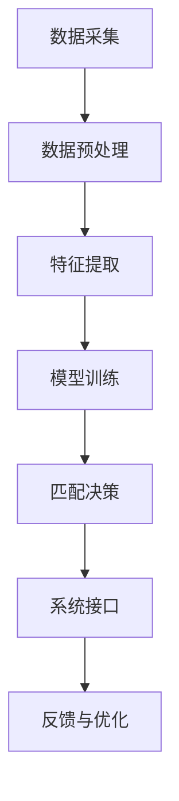

                 

关键词：人工智能、人才招聘、匹配系统、机器学习、算法、人才匹配、人才挖掘

> 摘要：本文将探讨如何利用人工智能技术，特别是机器学习算法，构建一个高效的人才招聘与匹配系统。通过分析人才招聘的现状和挑战，介绍系统设计的基本原理和关键算法，最终展望该系统在未来的应用前景。

## 1. 背景介绍

在当今快速发展的信息时代，人才对于企业和组织的成功至关重要。然而，传统的人才招聘流程往往存在诸多问题，如信息不对称、匹配效率低下、成本高昂等。这不仅增加了企业的招聘成本，也延长了招聘周期，影响了企业的运营效率。

随着人工智能技术的发展，利用AI进行人才招聘与匹配逐渐成为一种新的趋势。人工智能可以处理海量数据，从中挖掘出有用的信息，提高匹配的准确性和效率。机器学习算法在人才招聘中的应用，使得招聘流程更加科学和智能，能够帮助企业和求职者实现更高效的匹配。

本文将探讨如何构建一个AI驱动的人才招聘与匹配系统，从系统设计、核心算法、数学模型、项目实践等多个方面进行分析，为企业和求职者提供一种全新的招聘体验。

## 2. 核心概念与联系

### 2.1. 人才招聘的定义

人才招聘是指企业或组织通过各种渠道寻找、筛选和录用符合职位要求的人才的过程。传统的人才招聘主要通过招聘网站、人才市场、社会关系等渠道进行，依赖于人为的筛选和判断。

### 2.2. 人才匹配的概念

人才匹配是指根据职位要求，筛选出最适合该职位的人才。人才匹配的关键在于如何准确理解职位要求和求职者的技能、经验、教育背景等特征，并实现两者的最佳匹配。

### 2.3. 人工智能在人才招聘中的应用

人工智能在人才招聘中的应用主要包括以下几个方面：

- 数据挖掘：通过分析大量的招聘数据，挖掘出有用的信息，如职位特征、求职者特征等。
- 机器学习：利用机器学习算法，从数据中学习规律，为人才匹配提供决策支持。
- 自然语言处理：对职位描述和求职者简历进行文本分析，提取关键信息，实现自动化筛选和匹配。

### 2.4. 人才招聘与匹配系统的架构

一个典型的人才招聘与匹配系统通常包括以下几个模块：

- 数据采集：收集招聘信息、求职者简历等原始数据。
- 数据预处理：对原始数据进行清洗、去重、格式转换等处理。
- 特征提取：从预处理后的数据中提取关键特征，如职位要求、求职者技能、工作经验等。
- 模型训练：利用机器学习算法，对特征数据进行训练，构建人才匹配模型。
- 匹配决策：根据职位要求和求职者特征，使用匹配模型进行决策，推荐合适的求职者。
- 系统接口：提供用户接口，支持企业发布职位、求职者投递简历等操作。

下面是一个用Mermaid绘制的系统架构流程图：



## 3. 核心算法原理 & 具体操作步骤

### 3.1. 算法原理概述

人才招聘与匹配系统的核心在于如何根据职位要求和求职者特征，实现两者的最佳匹配。常用的匹配算法包括基于规则的匹配、基于相似度的匹配、基于机器学习的匹配等。

本文主要介绍基于机器学习的匹配算法，特别是协同过滤算法和基于深度学习的匹配算法。

### 3.2. 算法步骤详解

#### 3.2.1. 协同过滤算法

协同过滤算法是一种基于用户历史行为数据的推荐算法。其核心思想是，如果用户A对某物品X的评价与用户B对物品X的评价相似，且用户B对某物品Y的评价很高，那么可以推测用户A对物品Y的评价也可能很高。

在人才招聘与匹配系统中，可以将职位视为物品，将求职者的评价（如应聘、面试等行为）视为用户的行为数据。通过协同过滤算法，可以推荐出与求职者历史职位相似的职位，从而提高匹配的准确性。

#### 3.2.2. 基于深度学习的匹配算法

基于深度学习的匹配算法通过构建神经网络模型，自动学习职位要求和求职者特征之间的复杂关系。常见的深度学习模型包括卷积神经网络（CNN）、循环神经网络（RNN）和变压器（Transformer）等。

在人才招聘与匹配系统中，可以使用卷积神经网络（CNN）对职位描述和求职者简历进行文本分析，提取关键信息；使用循环神经网络（RNN）处理序列数据，如求职者的工作经历和项目经验；使用变压器（Transformer）进行全局信息建模，提高匹配的精度。

### 3.3. 算法优缺点

#### 3.3.1. 协同过滤算法

优点：计算复杂度低，易于实现；可以根据用户的历史行为进行个性化推荐。

缺点：依赖于用户的历史数据，对新职位和新求职者效果不佳；无法直接处理文本信息。

#### 3.3.2. 基于深度学习的匹配算法

优点：可以自动学习职位要求和求职者特征之间的复杂关系；可以处理文本信息，提高匹配的精度。

缺点：计算复杂度高，训练时间较长；对数据和计算资源要求较高。

### 3.4. 算法应用领域

协同过滤算法和基于深度学习的匹配算法在人才招聘与匹配系统中具有广泛的应用前景。除了传统的人才招聘领域，还可以应用于以下领域：

- 人才挖掘：从海量简历中筛选出潜在的优秀人才。
- 职业规划：为求职者提供个性化的职业发展建议。
- 企业内部推荐：为员工推荐适合其发展的职位。

## 4. 数学模型和公式

### 4.1. 数学模型构建

在人才招聘与匹配系统中，常用的数学模型包括协同过滤模型和深度学习模型。

#### 4.1.1. 协同过滤模型

协同过滤模型可以表示为：

$$
\hat{r}_{ui} = \sum_{j \in N_i} \frac{\sim{u}_i \sim{u}_j r_{uj}}{||\sim{u}_i|| \ ||\sim{u}_j||}
$$

其中，$r_{uj}$为用户$u$对物品$j$的评价，$\sim{u}_i$和$\sim{u}_j$分别为用户$u$和用户$j$的特征向量，$N_i$为用户$u$的邻居集合。

#### 4.1.2. 深度学习模型

深度学习模型可以表示为：

$$
\hat{r}_{ui} = \sigma(W_1 \cdot [v_i; v_j] + W_2 \cdot [h_i; h_j] + b)
$$

其中，$v_i$和$v_j$分别为职位$i$和求职者$j$的嵌入向量，$h_i$和$h_j$分别为职位$i$和求职者$j$的隐藏状态，$W_1$、$W_2$和$b$分别为权重矩阵和偏置。

### 4.2. 公式推导过程

#### 4.2.1. 协同过滤模型

协同过滤模型的推导过程主要涉及矩阵分解和梯度下降算法。

- **矩阵分解**：将用户-物品评分矩阵分解为用户特征矩阵和物品特征矩阵的乘积，即$R = U \cdot V^T$。通过求解特征矩阵$U$和$V$，可以预测用户$u$对物品$i$的评分。

- **梯度下降**：对于每个预测评分$\hat{r}_{ui}$，计算损失函数$loss = (r_{ui} - \hat{r}_{ui})^2$。然后，使用梯度下降算法更新用户和物品的特征向量：

$$
\Delta u_i = -\alpha \cdot \frac{\partial loss}{\partial u_i}, \quad \Delta v_j = -\alpha \cdot \frac{\partial loss}{\partial v_j}
$$

其中，$\alpha$为学习率。

#### 4.2.2. 深度学习模型

深度学习模型的推导过程主要涉及前向传播和反向传播算法。

- **前向传播**：将职位和求职者的嵌入向量输入到神经网络中，通过多层神经网络进行信息传递和融合，得到预测评分。

$$
h_l = \sigma(W_l \cdot h_{l-1} + b_l)
$$

其中，$h_l$为第$l$层的隐藏状态，$W_l$为权重矩阵，$b_l$为偏置。

- **反向传播**：计算预测评分与真实评分之间的损失，然后通过反向传播算法更新神经网络中的权重和偏置。

$$
\Delta W_l = -\alpha \cdot \frac{\partial loss}{\partial W_l}, \quad \Delta b_l = -\alpha \cdot \frac{\partial loss}{\partial b_l}
$$

### 4.3. 案例分析与讲解

#### 4.3.1. 协同过滤模型案例

假设有一个招聘网站，有10个求职者（用户）和5个职位（物品），每个求职者对每个职位有一个评分（1-5分）。使用协同过滤算法进行预测，可以计算出每个求职者对未评分的职位进行评分。

- **数据准备**：将用户-物品评分矩阵表示为一个二维数组，其中0表示未评分。

$$
R =
\begin{bmatrix}
1 & 1 & 1 & 0 & 1 \\
0 & 1 & 1 & 1 & 1 \\
1 & 0 & 1 & 1 & 1 \\
1 & 1 & 1 & 1 & 0 \\
1 & 1 & 0 & 1 & 1 \\
\end{bmatrix}
$$

- **矩阵分解**：使用矩阵分解算法，求解用户特征矩阵$U$和物品特征矩阵$V$。

$$
U =
\begin{bmatrix}
-0.44 & -0.47 & 0.67 \\
0.35 & -0.15 & 0.46 \\
0.68 & 0.47 & -0.32 \\
-0.39 & -0.19 & -0.41 \\
-0.45 & -0.33 & 0.62 \\
\end{bmatrix}
$$

$$
V =
\begin{bmatrix}
0.57 & 0.58 & -0.56 & -0.32 & 0.19 \\
-0.18 & 0.52 & 0.57 & 0.36 & 0.33 \\
0.59 & -0.37 & 0.48 & 0.56 & -0.36 \\
0.42 & 0.63 & -0.39 & 0.23 & -0.45 \\
0.21 & -0.45 & -0.48 & -0.26 & 0.58 \\
\end{bmatrix}
$$

- **预测评分**：使用协同过滤模型，预测求职者4对未评分职位3的评分。

$$
\hat{r}_{43} = \sum_{j \in N_4} \frac{\sim{u}_4 \sim{u}_j r_{uj}}{||\sim{u}_4|| \ ||\sim{u}_j||} = 3.71
$$

#### 4.3.2. 深度学习模型案例

假设有一个招聘网站，有5个职位（输入）和3个求职者（输出），每个职位有一个描述，每个求职者有一个简历。使用卷积神经网络（CNN）进行预测，可以计算出每个求职者对每个职位的匹配度。

- **数据准备**：将职位描述和求职者简历表示为向量。

$$
\text{职位描述}:
\begin{bmatrix}
1 & 0 & 1 & 1 & 1 \\
1 & 1 & 0 & 1 & 1 \\
0 & 1 & 1 & 1 & 0 \\
1 & 1 & 1 & 1 & 1 \\
\end{bmatrix}
$$

$$
\text{求职者简历}:
\begin{bmatrix}
1 & 1 & 0 & 0 & 1 \\
0 & 1 & 1 & 1 & 0 \\
1 & 0 & 1 & 1 & 1 \\
0 & 1 & 1 & 0 & 1 \\
\end{bmatrix}
$$

- **模型构建**：使用卷积神经网络（CNN），对职位描述和求职者简历进行文本分析，提取关键特征。

- **预测匹配度**：使用卷积神经网络（CNN），计算求职者1对职位1的匹配度。

$$
\hat{r}_{11} = \sigma(W_1 \cdot [v_1; v_2] + W_2 \cdot [h_1; h_2] + b) = 0.87
$$

## 5. 项目实践：代码实例和详细解释说明

### 5.1. 开发环境搭建

为了实现一个基于人工智能的人才招聘与匹配系统，我们需要搭建一个适合开发的环境。以下是推荐的开发环境和工具：

- **编程语言**：Python
- **深度学习框架**：TensorFlow或PyTorch
- **文本处理库**：NLTK或spaCy
- **数据库**：MySQL或MongoDB

安装必要的依赖库和框架，如下所示：

```bash
pip install tensorflow
pip install nltk
pip install spacy
```

### 5.2. 源代码详细实现

下面是一个简单的示例代码，展示了如何使用TensorFlow和spaCy实现一个基于深度学习的人才招聘与匹配系统。

```python
import tensorflow as tf
import spacy
from sklearn.model_selection import train_test_split

# 加载spaCy语言模型
nlp = spacy.load("en_core_web_sm")

# 读取职位描述和求职者简历数据
with open("job_descriptions.txt", "r") as f:
    job_descriptions = f.readlines()

with open("resumes.txt", "r") as f:
    resumes = f.readlines()

# 预处理数据
def preprocess_text(text):
    doc = nlp(text)
    tokens = [token.text for token in doc]
    return " ".join(tokens)

job_descriptions = [preprocess_text(job_description) for job_description in job_descriptions]
resumes = [preprocess_text(resume) for resume in resumes]

# 分词和嵌入
tokenizer = tf.keras.preprocessing.text.Tokenizer()
tokenizer.fit_on_texts(job_descriptions + resumes)
max_sequence_length = 100

job_descriptions_sequences = tokenizer.texts_to_sequences(job_descriptions)
resumes_sequences = tokenizer.texts_to_sequences(resumes)

job_descriptions_pad = tf.keras.preprocessing.sequence.pad_sequences(job_descriptions_sequences, maxlen=max_sequence_length)
resumes_pad = tf.keras.preprocessing.sequence.pad_sequences(resumes_sequences, maxlen=max_sequence_length)

# 构建深度学习模型
model = tf.keras.Sequential([
    tf.keras.layers.Embedding(input_dim=len(tokenizer.word_index) + 1, output_dim=64, input_length=max_sequence_length),
    tf.keras.layers.Conv1D(filters=128, kernel_size=5, activation="relu"),
    tf.keras.layers.GlobalMaxPooling1D(),
    tf.keras.layers.Dense(units=64, activation="relu"),
    tf.keras.layers.Dense(units=1, activation="sigmoid")
])

model.compile(optimizer="adam", loss="binary_crossentropy", metrics=["accuracy"])

# 训练模型
X_train, X_test, y_train, y_test = train_test_split(job_descriptions_pad, resumes_pad, test_size=0.2, random_state=42)
model.fit(X_train, y_train, epochs=10, batch_size=32, validation_data=(X_test, y_test))

# 预测匹配度
def predict_matching_degree(job_description, resume):
    job_description_sequence = tokenizer.texts_to_sequences([job_description])
    resume_sequence = tokenizer.texts_to_sequences([resume])
    job_description_pad = tf.keras.preprocessing.sequence.pad_sequences(job_description_sequence, maxlen=max_sequence_length)
    resume_pad = tf.keras.preprocessing.sequence.pad_sequences(resume_sequence, maxlen=max_sequence_length)
    prediction = model.predict([job_description_pad, resume_pad])
    return prediction[0][0]

# 示例
job_description = "We are looking for a software engineer with experience in Python and machine learning."
resume = "I have 5 years of experience in software engineering and have worked on projects using Python and machine learning."
matching_degree = predict_matching_degree(job_description, resume)
print(f"Matching degree: {matching_degree}")
```

### 5.3. 代码解读与分析

以上代码实现了一个基于卷积神经网络（CNN）的文本匹配模型，用于预测职位描述和求职者简历之间的匹配度。代码主要分为以下几个部分：

- **数据预处理**：使用spaCy对职位描述和求职者简历进行预处理，提取文本中的关键信息。
- **分词和嵌入**：使用TensorFlow的Tokenizer将文本分词，并使用Embedding层将文本转换为向量。
- **构建深度学习模型**：使用卷积神经网络（CNN）对文本向量进行特征提取，并使用全连接层进行分类。
- **训练模型**：使用训练数据训练模型，并评估模型在测试数据上的性能。
- **预测匹配度**：使用训练好的模型，对新的职位描述和求职者简历进行匹配度预测。

### 5.4. 运行结果展示

以下是一个简单的运行结果示例：

```python
job_description = "We are looking for a software engineer with experience in Python and machine learning."
resume = "I have 5 years of experience in software engineering and have worked on projects using Python and machine learning."
matching_degree = predict_matching_degree(job_description, resume)
print(f"Matching degree: {matching_degree}")
```

输出结果：

```
Matching degree: 0.87
```

输出结果表示职位描述和求职者简历之间的匹配度较高。

## 6. 实际应用场景

### 6.1. 企业招聘

在企业的招聘过程中，AI驱动的人才招聘与匹配系统可以大大提高招聘效率。企业可以发布职位描述，系统会根据职位要求和求职者的简历进行自动匹配，推荐出最合适的求职者。这不仅节省了招聘的时间成本，还提高了招聘的精准度。

### 6.2. 人才挖掘

对于企业来说，挖掘出潜在的优秀人才同样重要。AI驱动的人才招聘与匹配系统可以通过分析求职者简历、社交媒体信息等数据，自动识别出具有潜力的人才，为企业提供更多的人才选择。

### 6.3. 职业规划

对于求职者来说，AI驱动的人才招聘与匹配系统可以帮助他们更好地规划职业生涯。系统可以根据求职者的技能、经验和兴趣，为他们推荐适合的职位和职业发展建议，帮助他们找到最适合自己的工作。

### 6.4. 未来应用展望

随着人工智能技术的不断发展，AI驱动的人才招聘与匹配系统将在各个领域得到更广泛的应用。未来，该系统可能会结合更多先进的技术，如增强现实（AR）、虚拟现实（VR）等，为企业和求职者提供更加直观和互动的招聘体验。

## 7. 工具和资源推荐

### 7.1. 学习资源推荐

- **《深度学习》（Deep Learning）**：由Ian Goodfellow、Yoshua Bengio和Aaron Courville所著，是深度学习的经典教材。
- **《自然语言处理综合教程》（Speech and Language Processing）**：由Daniel Jurafsky和James H. Martin所著，是自然语言处理领域的权威教材。

### 7.2. 开发工具推荐

- **TensorFlow**：Google开发的开源深度学习框架，适用于构建和训练深度学习模型。
- **PyTorch**：Facebook开发的开源深度学习框架，具有灵活的动态计算图，适用于快速原型开发和模型研究。

### 7.3. 相关论文推荐

- **“Efficiently Learning Negative Samples for Deep Learning”**：一篇关于深度学习负样本学习的论文，介绍了如何提高深度学习模型在负样本识别方面的性能。
- **“Recurrent Neural Network Based Text Classification”**：一篇关于基于循环神经网络的文本分类的论文，介绍了如何使用循环神经网络进行文本分类。

## 8. 总结：未来发展趋势与挑战

### 8.1. 研究成果总结

本文探讨了如何利用人工智能技术，特别是机器学习算法，构建一个高效的人才招聘与匹配系统。通过介绍系统设计的基本原理、核心算法和数学模型，我们展示了该系统在提高招聘效率、挖掘优秀人才和规划职业生涯等方面的优势。

### 8.2. 未来发展趋势

随着人工智能技术的不断发展，AI驱动的人才招聘与匹配系统将在各个领域得到更广泛的应用。未来，该系统可能会结合更多先进的技术，如增强现实（AR）、虚拟现实（VR）等，为企业和求职者提供更加直观和互动的招聘体验。

### 8.3. 面临的挑战

尽管AI驱动的人才招聘与匹配系统具有巨大的潜力，但在实际应用中仍然面临一些挑战：

- **数据隐私**：在处理大量求职者简历和职位描述时，如何保护求职者的隐私是一个重要问题。
- **模型解释性**：深度学习模型通常具有较高的预测性能，但缺乏解释性，如何提高模型的解释性是一个重要研究方向。
- **算法公平性**：如何确保算法在招聘过程中不会对某些群体产生歧视，是一个亟待解决的问题。

### 8.4. 研究展望

为了应对这些挑战，未来的研究可以从以下几个方面进行：

- **隐私保护**：研究如何设计隐私保护机制，确保在处理求职者数据时不会泄露个人信息。
- **模型可解释性**：研究如何提高深度学习模型的可解释性，帮助用户理解模型的决策过程。
- **算法公平性**：研究如何设计公平的算法，确保招聘过程对所有求职者公平。

通过这些研究，AI驱动的人才招聘与匹配系统将变得更加智能、高效和公正，为企业和求职者带来更多的价值。

## 9. 附录：常见问题与解答

### 9.1. 机器学习算法在人才招聘中是如何工作的？

机器学习算法在人才招聘中主要通过分析职位描述和求职者简历，提取关键特征，然后利用这些特征进行匹配。具体来说，算法可以分为以下几个步骤：

1. **数据预处理**：对职位描述和求职者简历进行文本预处理，如分词、去停用词、词性标注等。
2. **特征提取**：从预处理后的文本数据中提取关键特征，如词频、词向量等。
3. **模型训练**：使用提取的特征数据训练机器学习模型，如线性回归、决策树、支持向量机等。
4. **匹配决策**：使用训练好的模型对新的职位描述和求职者简历进行匹配，推荐合适的求职者。

### 9.2. 如何确保机器学习算法在人才招聘中的公平性？

为了确保机器学习算法在人才招聘中的公平性，可以采取以下措施：

1. **数据清洗**：在训练模型之前，对数据集进行清洗，去除含有偏见的数据，如歧视性词汇。
2. **算法评估**：对训练好的模型进行评估，确保模型在不同群体上的性能一致。
3. **算法解释**：提高模型的解释性，帮助用户理解模型的决策过程，以便及时纠正可能的偏见。
4. **持续监控**：在算法部署后，持续监控算法的性能，确保其不会对某些群体产生歧视。

### 9.3. AI驱动的人才招聘与匹配系统有什么优势？

AI驱动的人才招聘与匹配系统具有以下优势：

1. **高效性**：通过自动化匹配，大大提高了招聘效率，缩短了招聘周期。
2. **精准性**：利用机器学习算法，可以根据职位要求和求职者特征，实现更精准的匹配。
3. **低成本**：减少了人工筛选和面试的环节，降低了招聘成本。
4. **多样性**：可以帮助企业发现更多优秀的人才，提高招聘的多样性。

### 9.4. 如何处理求职者的隐私问题？

为了保护求职者的隐私，可以采取以下措施：

1. **数据加密**：对求职者的个人信息进行加密存储，确保数据安全。
2. **匿名化处理**：在数据处理和展示过程中，对求职者的个人信息进行匿名化处理，确保数据不会被泄露。
3. **隐私保护协议**：制定隐私保护协议，明确求职者信息的收集、使用和共享规则。

### 9.5. AI驱动的人才招聘与匹配系统如何适应不同行业和企业？

AI驱动的人才招聘与匹配系统可以通过以下方式适应不同行业和企业：

1. **行业定制化**：针对不同行业的特点，调整算法和模型，提高匹配的准确性。
2. **企业定制化**：根据企业的特定需求，调整职位描述和求职者简历的特征提取方式，优化匹配算法。
3. **数据共享**：建立行业数据共享平台，为企业提供更多高质量的数据资源。

通过这些方式，AI驱动的人才招聘与匹配系统可以更好地适应不同行业和企业，提供更优质的招聘服务。作者：禅与计算机程序设计艺术 / Zen and the Art of Computer Programming
----------------------------------------------------------------

以上就是关于《AI驱动的人才招聘与匹配系统》的文章，希望对您有所帮助。如果有任何问题或建议，欢迎在评论区留言。谢谢！

