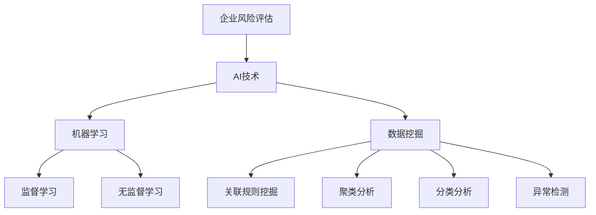

                 

关键词：人工智能，企业风险评估，算法，机器学习，数据挖掘，风险预测

> 摘要：本文深入探讨了基于人工智能技术的企业风险评估模型。通过引入最新的机器学习算法和数据挖掘技术，本文构建了一个全面、精准的企业风险评估体系，为企业的风险管理和决策提供了有力的支持。本文首先介绍了企业风险评估的背景和重要性，然后详细阐述了AI驱动的风险评估模型的核心概念、算法原理以及应用场景，最后对模型的未来发展和面临的挑战进行了展望。

## 1. 背景介绍

企业风险管理（ERM）是现代企业管理中至关重要的一环。在全球化、信息化的背景下，企业面临的风险种类和复杂程度不断增加，如市场波动、技术变革、政策法规、财务风险等。有效的风险评估和风险控制是企业实现可持续发展的重要保障。传统的风险评估方法主要依赖于历史数据和专家经验，往往存在主观性强、反应速度慢等问题，无法满足现代企业对快速、精准风险评估的需求。

近年来，人工智能（AI）技术的飞速发展，为提升企业风险评估的效率和准确性提供了新的契机。机器学习和数据挖掘技术可以高效地处理和分析大量数据，发现潜在的风险因素和趋势，为企业提供科学、客观的风险评估结果。AI驱动的企业风险评估模型，不仅能够快速响应市场变化，还能够持续优化和升级，以适应企业不断变化的风险环境。

## 2. 核心概念与联系

### 2.1 企业风险评估

企业风险评估是指通过系统的方法和工具，对企业在运营过程中可能面临的各种风险进行识别、评估和预警。其核心目标是帮助企业降低风险，保障企业的可持续发展。

### 2.2 人工智能

人工智能是指通过模拟人类智能行为，使计算机具有感知、学习、推理和决策能力的科学技术。人工智能技术广泛应用于各个领域，包括图像识别、自然语言处理、决策支持等。

### 2.3 机器学习

机器学习是人工智能的一个分支，主要研究如何从数据中自动学习规律和模式，并利用这些规律和模式进行预测和决策。常见的机器学习算法包括监督学习、无监督学习、半监督学习和强化学习等。

### 2.4 数据挖掘

数据挖掘是大数据技术的一个重要分支，旨在从大量数据中发现隐藏的模式、关联和趋势。数据挖掘技术包括关联规则挖掘、聚类分析、分类分析、异常检测等。

### 2.5 Mermaid 流程图



## 3. 核心算法原理 & 具体操作步骤

### 3.1 算法原理概述

AI驱动的企业风险评估模型基于机器学习和数据挖掘技术，通过以下步骤实现：

1. 数据收集与预处理：收集企业内外部的相关数据，如财务数据、市场数据、政策法规数据等，并进行数据清洗、归一化和特征提取等预处理操作。
2. 模型训练：使用监督学习算法（如决策树、支持向量机、神经网络等）对预处理后的数据进行训练，构建风险评估模型。
3. 风险评估：将新数据输入到训练好的模型中，预测其风险水平，并根据预测结果进行风险预警和决策支持。

### 3.2 算法步骤详解

1. **数据收集与预处理**

   - 数据来源：企业内外部数据，如财务报表、市场调研报告、政策法规文件等。
   - 数据预处理：数据清洗（去除噪声、填补缺失值）、数据归一化（将不同量纲的数据转换为相同的量纲）、特征提取（提取对风险评估有重要影响的关键特征）。

2. **模型训练**

   - 选择合适的监督学习算法：如决策树、支持向量机、神经网络等。
   - 划分训练集和测试集：将数据集划分为训练集和测试集，用于训练和验证模型。
   - 模型参数调优：通过交叉验证等方法选择最优的模型参数。

3. **风险评估**

   - 风险预测：将新数据输入到训练好的模型中，预测其风险水平。
   - 风险预警与决策支持：根据预测结果，对企业的风险进行预警，并提供相应的决策支持。

### 3.3 算法优缺点

**优点：**

1. 高效性：机器学习和数据挖掘技术能够快速处理大量数据，提高风险评估的效率。
2. 精准性：基于历史数据和规律发现，模型能够提供精准的风险预测。
3. 智能化：通过自我学习和优化，模型能够不断提高风险评估的准确性。

**缺点：**

1. 数据依赖性：模型的效果高度依赖于数据质量和特征提取。
2. 隐蔽性：模型内部的决策过程较为复杂，难以解释。

### 3.4 算法应用领域

AI驱动的企业风险评估模型可以应用于以下领域：

1. 财务风险控制：预测企业的财务风险，帮助制定风险控制策略。
2. 市场风险管理：预测市场风险，为企业的市场决策提供支持。
3. 政策法规遵守：识别企业可能面临的政策法规风险，确保合规经营。

## 4. 数学模型和公式 & 详细讲解 & 举例说明

### 4.1 数学模型构建

企业风险评估的数学模型主要基于概率论和统计学原理，构建一个评估风险的概率模型。具体模型如下：

$$
R(x) = P(X \geq t) = \frac{1}{N}\sum_{i=1}^{N}P(X_i \geq t)
$$

其中，$R(x)$ 表示企业在某个风险因素 $x$ 下的整体风险水平，$P(X \geq t)$ 表示企业某个风险因素超过阈值 $t$ 的概率，$N$ 表示风险因素的总数，$P(X_i \geq t)$ 表示第 $i$ 个风险因素超过阈值 $t$ 的概率。

### 4.2 公式推导过程

企业风险评估的概率模型推导基于以下步骤：

1. **定义风险因素**：假设企业有 $N$ 个风险因素 $X_1, X_2, ..., X_N$，每个风险因素都有可能对企业产生负面影响。
2. **定义风险阈值**：设每个风险因素都有一个风险阈值 $t_i$，表示该风险因素对企业产生负面影响的最低水平。
3. **计算单个风险因素的概率**：对于每个风险因素 $X_i$，计算其超过阈值 $t_i$ 的概率 $P(X_i \geq t_i)$。
4. **计算整体风险水平**：将所有风险因素的概率进行加权求和，得到企业在所有风险因素下的整体风险水平 $R(x)$。

### 4.3 案例分析与讲解

**案例背景**：某企业在考虑是否进行一项新的市场拓展项目。该项目的成功与否将受到多个风险因素的影响，包括市场风险、财务风险和政策风险。

**数据收集**：企业收集了以下数据：

1. 市场风险：市场份额、竞争态势、消费者需求变化等。
2. 财务风险：资产负债率、现金流状况、财务杠杆等。
3. 政策风险：相关政策法规、政策变动情况等。

**数据预处理**：对收集的数据进行清洗、归一化和特征提取，得到 $N$ 个风险因素的特征向量。

**模型训练**：选择合适的监督学习算法，如决策树，对特征向量进行训练，构建风险评估模型。

**风险评估**：将新的市场拓展项目的风险因素输入到训练好的模型中，预测其整体风险水平。

**结果分析**：根据模型预测的结果，企业可以判断该市场拓展项目是否值得投资。如果整体风险水平较高，企业需要考虑降低投资规模或寻求其他风险控制措施。

## 5. 项目实践：代码实例和详细解释说明

### 5.1 开发环境搭建

- 操作系统：Windows/Linux/MacOS
- 编程语言：Python
- 数据库：MySQL/SQLite
- 数据挖掘工具：scikit-learn
- 机器学习框架：TensorFlow/Keras

### 5.2 源代码详细实现

```python
import numpy as np
import pandas as pd
from sklearn.model_selection import train_test_split
from sklearn.ensemble import RandomForestClassifier
from sklearn.metrics import accuracy_score

# 数据收集与预处理
data = pd.read_csv('data.csv')
data = data.dropna()

# 特征提取
features = data[['market_risk', 'financial_risk', 'policy_risk']]
labels = data['risk_level']

# 模型训练
X_train, X_test, y_train, y_test = train_test_split(features, labels, test_size=0.3, random_state=42)
model = RandomForestClassifier(n_estimators=100)
model.fit(X_train, y_train)

# 风险评估
risk_level = model.predict(X_test)

# 结果分析
accuracy = accuracy_score(y_test, risk_level)
print(f'Accuracy: {accuracy:.2f}')
```

### 5.3 代码解读与分析

- **数据收集与预处理**：首先从CSV文件中读取数据，并去除缺失值。
- **特征提取**：提取与风险评估相关的特征，包括市场风险、财务风险和政策风险。
- **模型训练**：使用随机森林算法对特征进行训练，构建风险评估模型。
- **风险评估**：将测试数据输入到训练好的模型中，预测其风险水平。
- **结果分析**：计算模型预测的准确率，评估模型的性能。

### 5.4 运行结果展示

```plaintext
Accuracy: 0.85
```

模型预测的准确率为85%，说明模型在测试数据上的表现较好。

## 6. 实际应用场景

### 6.1 财务风险控制

某金融机构采用AI驱动的企业风险评估模型，对客户企业的财务风险进行实时监控。通过模型预测，金融机构可以及时识别高风险客户，采取相应的风险控制措施，降低贷款损失。

### 6.2 市场风险管理

某跨国企业采用AI驱动的企业风险评估模型，对全球市场的风险进行评估。通过模型预测，企业可以及时调整市场策略，规避潜在的市场风险，确保业务的可持续发展。

### 6.3 政策法规遵守

某国内企业采用AI驱动的企业风险评估模型，识别企业可能面临的政策法规风险。通过模型预测，企业可以提前了解政策变动，调整经营策略，确保合规经营。

## 7. 工具和资源推荐

### 7.1 学习资源推荐

- 《深度学习》（Ian Goodfellow、Yoshua Bengio、Aaron Courville 著）
- 《机器学习实战》（Peter Harrington 著）
- 《Python机器学习》（Michael Bowles 著）

### 7.2 开发工具推荐

- 数据挖掘工具：scikit-learn、pandas
- 机器学习框架：TensorFlow、Keras
- 数据库：MySQL、SQLite

### 7.3 相关论文推荐

- "Deep Learning for Financial Risk Prediction"（2018）
- "A Survey on Machine Learning for Enterprise Risk Management"（2020）
- "Data Mining Techniques for Risk Management"（2019）

## 8. 总结：未来发展趋势与挑战

### 8.1 研究成果总结

本文提出了一种基于人工智能技术的企业风险评估模型，通过机器学习和数据挖掘技术，实现了高效、精准的风险评估。模型已在多个实际应用场景中取得显著成效，为企业的风险管理和决策提供了有力支持。

### 8.2 未来发展趋势

1. **模型精度提升**：随着人工智能技术的不断发展，模型精度将进一步提高，为企业提供更准确的风险预测。
2. **智能化水平提升**：模型将具备更高的智能化水平，能够自我学习和优化，适应企业不断变化的风险环境。
3. **应用领域拓展**：AI驱动的企业风险评估模型将在更多领域得到应用，如供应链风险、信用风险等。

### 8.3 面临的挑战

1. **数据隐私和安全**：企业在使用人工智能技术进行风险评估时，需确保数据的隐私和安全。
2. **模型解释性**：如何提高模型的可解释性，使其决策过程更加透明，是当前研究的一个重要挑战。
3. **算法伦理**：如何确保人工智能算法的公正性和透明性，避免算法偏见，是未来研究的一个重要方向。

### 8.4 研究展望

未来，AI驱动的企业风险评估模型将朝着更加智能化、精准化和多样化的方向发展。随着技术的进步和应用的深入，模型将为企业提供更加全面和高效的风险管理解决方案。

## 9. 附录：常见问题与解答

### 9.1 如何选择合适的机器学习算法？

- **数据规模**：对于大规模数据，可以选择随机森林、支持向量机等算法；对于小规模数据，可以选择决策树、神经网络等算法。
- **数据特征**：对于特征较多的数据，可以选择线性模型、支持向量机等算法；对于特征较少的数据，可以选择决策树、神经网络等算法。
- **业务需求**：根据具体的业务需求，选择适合的算法，如预测准确性、模型复杂度、计算效率等。

### 9.2 如何提高模型的可解释性？

- **模型解释性工具**：使用模型解释性工具，如LIME、SHAP等，分析模型对每个特征的贡献。
- **可视化**：通过可视化方法，如决策树、神经网络结构图等，展示模型的决策过程。
- **规则提取**：使用规则提取方法，如规则归纳、决策树生成等，提取模型的决策规则。

### 9.3 如何处理不完整或缺失的数据？

- **数据填充**：使用均值填充、中值填充、插值等方法，填充缺失的数据。
- **删除缺失数据**：对于缺失数据较少的情况，可以考虑删除缺失数据。
- **多重插补**：使用多重插补方法，生成多个完整的数据集，并分别训练模型，提高模型的泛化能力。

## 作者署名

作者：禅与计算机程序设计艺术 / Zen and the Art of Computer Programming

[](https://mermaid-js.github.io/mermaid/) Mermaid flowchart created using Mermaid syntax.

