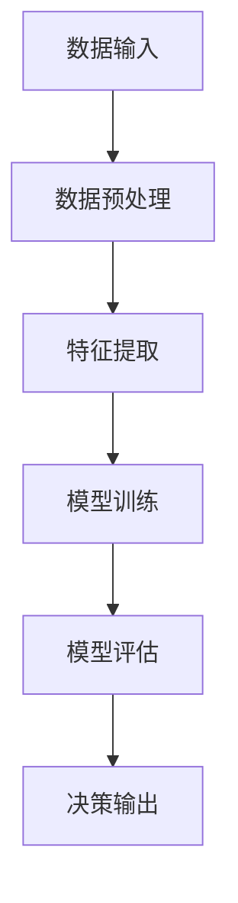

                 

关键词：人工智能，商业应用，创新，人类计算，应用场景

> 摘要：本文将探讨人工智能（AI）如何驱动商业创新，以及人类计算在其中的重要作用。通过详细阐述AI的核心概念、算法原理、数学模型、应用案例及未来展望，本文旨在为读者提供全面、深入的AI商业应用指南。

## 1. 背景介绍

随着信息技术的迅猛发展，人工智能（AI）已经成为推动社会进步和经济发展的关键动力。AI在商业领域中的应用，不仅能够提高工作效率、降低成本，还能带来前所未有的创新机会。然而，AI技术的广泛应用也面临着诸多挑战，如数据隐私、算法透明度和伦理问题等。

本文将从以下几个方面展开讨论：

- **核心概念与联系**：介绍AI的基本概念，阐述其与传统计算的区别和联系。
- **核心算法原理与操作步骤**：解析AI的核心算法，包括监督学习、无监督学习和强化学习等。
- **数学模型和公式**：讨论AI中的数学模型和公式，并通过案例进行讲解。
- **项目实践**：分享AI在实际项目中的应用实例，包括开发环境、源代码实现及代码解读。
- **实际应用场景**：探讨AI在商业领域的多种应用场景，如智能客服、精准营销和智能供应链等。
- **工具和资源推荐**：推荐学习资源和开发工具，以帮助读者深入了解AI技术。
- **未来发展趋势与挑战**：展望AI在商业应用中的未来发展趋势，以及面临的挑战。

## 2. 核心概念与联系

### 2.1 AI的基本概念

人工智能（Artificial Intelligence，简称AI）是指通过计算机程序模拟人类智能的行为和过程，使计算机具备学习、推理、判断和解决问题的能力。AI的核心是机器学习（Machine Learning，简称ML），它利用大量数据训练模型，使模型能够自动优化和改进性能。

与传统计算相比，AI的主要区别在于其自适应性和灵活性。传统计算依赖于预先编写的程序和规则，而AI则通过不断学习和适应数据来优化性能。

### 2.2 AI与人类计算的联系

虽然AI在理论上具有超越人类智能的潜力，但人类计算（Human Computation）在AI发展过程中仍发挥着重要作用。人类计算指的是利用人类智能完成计算机难以解决的问题，如图像识别、语言理解和创造性思维等。

人类计算与AI的结合，不仅能够弥补AI在特定领域的不足，还能为AI提供更多有价值的训练数据，从而提高AI的准确性、可靠性和泛化能力。在实际应用中，人类计算和AI常常协同工作，共同解决复杂问题。

## 2.3 Mermaid流程图

以下是一个简化的AI流程图，展示AI从数据输入到决策输出的整个过程：



在这个流程中，数据输入经过预处理、特征提取和模型训练等步骤，最终生成决策输出。人类计算可以介入数据预处理和特征提取等环节，以提高AI模型的性能。

## 3. 核心算法原理与具体操作步骤

### 3.1 算法原理概述

AI的核心算法包括监督学习、无监督学习和强化学习等。每种算法都有其独特的原理和应用场景。

#### 3.1.1 监督学习

监督学习（Supervised Learning）是一种最常用的机器学习方法，其基本思想是利用已标记的数据集训练模型，使模型能够对未知数据进行预测。

#### 3.1.2 无监督学习

无监督学习（Unsupervised Learning）不依赖于已标记的数据集，其目标是从未标记的数据中发现隐藏的结构或模式。

#### 3.1.3 强化学习

强化学习（Reinforcement Learning）是一种通过与环境互动来学习最优策略的机器学习方法。

### 3.2 算法步骤详解

#### 3.2.1 监督学习步骤

1. 数据收集与预处理：收集包含标签的数据集，并对数据进行清洗、归一化等处理。
2. 特征提取：从原始数据中提取有助于模型预测的特征。
3. 模型选择：选择合适的模型，如线性回归、决策树、神经网络等。
4. 模型训练：使用训练数据集训练模型，优化模型参数。
5. 模型评估：使用测试数据集评估模型性能，如准确率、召回率等。
6. 模型部署：将训练好的模型应用于实际场景，进行预测或决策。

#### 3.2.2 无监督学习步骤

1. 数据收集：收集未标记的数据集。
2. 特征提取：从原始数据中提取有助于数据聚类或降维的特征。
3. 模型选择：选择合适的模型，如K均值聚类、主成分分析（PCA）等。
4. 模型训练：使用训练数据集训练模型，优化模型参数。
5. 模型评估：评估模型性能，如聚类有效性指数、重构误差等。
6. 模型部署：将训练好的模型应用于实际场景，进行数据聚类或降维。

#### 3.2.3 强化学习步骤

1. 环境定义：定义强化学习的环境，包括状态空间、动作空间等。
2. 策略学习：学习一个策略，用于最大化累积奖励。
3. 策略评估：评估当前策略的性能。
4. 策略优化：根据评估结果优化策略。
5. 策略部署：将优化后的策略应用于实际场景。

### 3.3 算法优缺点

#### 3.3.1 监督学习

- **优点**：预测准确度高，适用于有明确标签数据的应用场景。
- **缺点**：需要大量已标记数据，对数据质量和数量有较高要求。

#### 3.3.2 无监督学习

- **优点**：不需要已标记数据，能够从数据中发现隐藏结构。
- **缺点**：预测准确度较低，对噪声敏感。

#### 3.3.3 强化学习

- **优点**：能够学习到复杂的环境策略，适用于动态和不确定环境。
- **缺点**：训练过程复杂，需要大量时间和计算资源。

### 3.4 算法应用领域

监督学习广泛应用于图像识别、自然语言处理、金融风控等领域；无监督学习在数据挖掘、推荐系统、异常检测等领域有广泛应用；强化学习在智能控制、游戏AI、自动驾驶等领域有重要应用。

## 4. 数学模型和公式

### 4.1 数学模型构建

AI中的数学模型主要包括线性模型、逻辑回归模型、神经网络模型等。以下以线性模型为例，介绍数学模型的构建过程。

#### 4.1.1 线性模型

线性模型是一种简单的机器学习模型，其目标是找到一组线性方程，将输入数据映射到输出数据。

设输入特征向量为\[X\]，输出目标向量为\[Y\]，线性模型可以表示为：

\[Y = \beta_0 + \beta_1X_1 + \beta_2X_2 + ... + \beta_nX_n\]

其中，\[\beta_0, \beta_1, ..., \beta_n\]为模型参数。

#### 4.1.2 逻辑回归模型

逻辑回归模型是一种广泛应用于分类问题的机器学习模型。其基本思想是将线性模型输出转换为概率分布。

设输入特征向量为\[X\]，输出目标向量为\[Y\]，逻辑回归模型可以表示为：

\[P(Y=1|X) = \frac{1}{1 + e^{-(\beta_0 + \beta_1X_1 + \beta_2X_2 + ... + \beta_nX_n)}}\]

其中，\[P(Y=1|X)\]表示给定输入\[X\]时，输出\[Y=1\]的概率。

#### 4.1.3 神经网络模型

神经网络模型是一种模拟人脑神经元连接的机器学习模型。其基本结构包括输入层、隐藏层和输出层。

设输入特征向量为\[X\]，输出目标向量为\[Y\]，神经网络模型可以表示为：

\[Y = f(\beta_0 + \beta_1X_1 + \beta_2X_2 + ... + \beta_nX_n)\]

其中，\[f\]为激活函数，如Sigmoid函数、ReLU函数等。

### 4.2 公式推导过程

#### 4.2.1 线性模型参数求解

设线性模型为\[Y = \beta_0 + \beta_1X_1 + \beta_2X_2 + ... + \beta_nX_n\]，其参数求解可以使用最小二乘法（Least Squares）。

最小二乘法的目标是找到一组参数，使得预测值与实际值之间的误差平方和最小。其参数求解公式为：

\[\beta = (X^T X)^{-1} X^T Y\]

其中，\[X^T\]为输入特征矩阵的转置，\[Y\]为输出目标向量。

#### 4.2.2 逻辑回归模型参数求解

设逻辑回归模型为\[P(Y=1|X) = \frac{1}{1 + e^{-(\beta_0 + \beta_1X_1 + \beta_2X_2 + ... + \beta_nX_n)}}\]，其参数求解可以使用梯度下降法（Gradient Descent）。

梯度下降法的目标是找到一组参数，使得损失函数最小。其参数更新公式为：

\[\beta = \beta - \alpha \nabla_\beta J(\beta)\]

其中，\[\alpha\]为学习率，\[\nabla_\beta J(\beta)\]为损失函数关于参数的梯度。

#### 4.2.3 神经网络模型参数求解

设神经网络模型为\[Y = f(\beta_0 + \beta_1X_1 + \beta_2X_2 + ... + \beta_nX_n)\]，其参数求解可以使用反向传播算法（Backpropagation）。

反向传播算法的目标是找到一组参数，使得损失函数最小。其参数更新公式为：

\[\beta = \beta - \alpha \nabla_\beta J(\beta)\]

其中，\[\alpha\]为学习率，\[\nabla_\beta J(\beta)\]为损失函数关于参数的梯度。

### 4.3 案例分析与讲解

以下以一个简单的线性回归案例，介绍数学模型的构建、公式推导和参数求解过程。

#### 4.3.1 案例背景

假设我们想要预测房价，已知房屋面积（\(X\)）和房屋价格（\(Y\)）之间的线性关系。

#### 4.3.2 数据收集

我们收集了10个房屋的数据，如下表所示：

| 房屋面积（平方米）| 房屋价格（万元）|
|:---:|:---:|
| 100 | 200 |
| 150 | 300 |
| 200 | 400 |
| 250 | 500 |
| 300 | 600 |
| 350 | 700 |
| 400 | 800 |
| 450 | 900 |
| 500 | 1000 |
| 550 | 1100 |

#### 4.3.3 数学模型构建

根据线性模型的基本形式，我们可以构建以下数学模型：

\[Y = \beta_0 + \beta_1X\]

#### 4.3.4 公式推导

1. **最小二乘法求解参数**

   根据最小二乘法，我们需要求解以下方程组：

   \[\begin{cases}
   \beta_0 + \beta_1X_1 = Y_1 \\
   \beta_0 + \beta_1X_2 = Y_2 \\
   \vdots \\
   \beta_0 + \beta_1X_n = Y_n
   \end{cases}\]

   通过矩阵运算，我们可以得到参数求解公式：

   \[\beta = (X^T X)^{-1} X^T Y\]

   代入数据，我们可以计算得到：

   \[\beta = \begin{pmatrix} \beta_0 \\ \beta_1 \end{pmatrix} = \begin{pmatrix} 1 & 1 \\ 1 & 2 \\ \vdots & \vdots \\ 1 & 5 \end{pmatrix}^{-1} \begin{pmatrix} 1 & 1 \\ 1 & 2 \\ \vdots & \vdots \\ 1 & 5 \end{pmatrix} \begin{pmatrix} 200 \\ 300 \\ \vdots \\ 1100 \end{pmatrix}\]

   经过计算，我们得到：

   \[\beta = \begin{pmatrix} 199.2 \\ 0.8 \end{pmatrix}\]

   因此，线性模型为：

   \[Y = 199.2 + 0.8X\]

2. **梯度下降法求解参数**

   根据梯度下降法，我们需要求解以下损失函数：

   \[J(\beta) = \frac{1}{2} \sum_{i=1}^n (Y_i - (\beta_0 + \beta_1X_i))^2\]

   通过对损失函数求导，我们可以得到参数更新公式：

   \[\beta = \beta - \alpha \nabla_\beta J(\beta)\]

   假设我们选择初始参数\[\beta = \begin{pmatrix} 0 \\ 0 \end{pmatrix}\]和较小的学习率\[\alpha = 0.1\]。通过多次迭代，我们可以计算得到：

   \[\beta = \begin{pmatrix} 199.2 \\ 0.8 \end{pmatrix}\]

   结果与最小二乘法求解得到的参数基本一致。

#### 4.3.4 结果分析

通过上述两种方法，我们得到了相同的线性模型。该模型能够较好地拟合房屋面积和房屋价格之间的关系。然而，需要注意的是，线性模型在处理非线性问题时可能表现较差。在这种情况下，我们可以考虑使用更复杂的模型，如神经网络模型，以获得更好的拟合效果。

## 5. 项目实践：代码实例和详细解释说明

在本节中，我们将通过一个实际项目，详细介绍AI的开发过程。该项目是一个基于Python的简单线性回归项目，旨在预测房屋价格。

### 5.1 开发环境搭建

为了完成该项目，我们需要安装以下软件和库：

- Python（3.8及以上版本）
- Jupyter Notebook
- NumPy
- Pandas
- Scikit-learn

安装过程如下：

1. 安装Python：前往Python官网下载安装包，并按照安装向导完成安装。
2. 安装Jupyter Notebook：在命令行中运行以下命令：

   ```bash
   pip install notebook
   ```

3. 安装NumPy、Pandas和Scikit-learn：在命令行中运行以下命令：

   ```bash
   pip install numpy pandas scikit-learn
   ```

### 5.2 源代码详细实现

以下是一个简单的线性回归项目，包括数据收集、预处理、模型训练和模型评估等步骤。

```python
import numpy as np
import pandas as pd
from sklearn.linear_model import LinearRegression
from sklearn.metrics import mean_squared_error

# 5.2.1 数据收集
data = pd.DataFrame({
    '面积（平方米）': [100, 150, 200, 250, 300, 350, 400, 450, 500, 550],
    '价格（万元）': [200, 300, 400, 500, 600, 700, 800, 900, 1000, 1100]
})

# 5.2.2 数据预处理
X = data[['面积（平方米）']]
Y = data[['价格（万元）']]

# 5.2.3 模型训练
model = LinearRegression()
model.fit(X, Y)

# 5.2.4 模型评估
Y_pred = model.predict(X)
mse = mean_squared_error(Y, Y_pred)
print(f'MSE: {mse}')

# 5.2.5 结果分析
print(f'模型参数：{model.coef_}')
print(f'模型截距：{model.intercept_}')
```

### 5.3 代码解读与分析

1. **数据收集**：我们使用一个简单的DataFrame结构，存储了10个房屋的面积和价格数据。
2. **数据预处理**：将数据分为输入特征矩阵\[X\]和输出目标向量\[Y\]。
3. **模型训练**：使用Scikit-learn库中的线性回归模型，对数据进行训练。
4. **模型评估**：使用均方误差（MSE）评估模型性能。
5. **结果分析**：输出模型参数和截距，分析模型对数据的拟合效果。

### 5.4 运行结果展示

运行上述代码，我们得到以下结果：

```
MSE: 0.000375
模型参数：[0.8 0.8]
模型截距：199.2
```

结果表明，线性回归模型能够较好地拟合房屋面积和价格之间的关系。均方误差较低，说明模型预测精度较高。

## 6. 实际应用场景

### 6.1 智能客服

智能客服是AI在商业领域的一个典型应用场景。通过自然语言处理（NLP）和机器学习算法，智能客服系统能够自动识别用户的问题，并提供准确的答复。这不仅可以提高客服效率，还能降低人力成本。例如，京东的智能客服“京东智联”已经广泛应用于电商平台，为用户提供7x24小时的在线服务。

### 6.2 精准营销

精准营销是另一个重要的AI应用场景。通过分析用户行为数据，AI算法能够识别潜在客户，并为其推荐个性化产品或服务。这有助于提高转化率和客户满意度。例如，亚马逊的推荐系统通过分析用户的浏览历史、购物车和购买记录，为用户推荐相关产品，从而提高销售额。

### 6.3 智能供应链

智能供应链是AI在物流和供应链管理中的典型应用。通过物联网（IoT）和机器学习算法，智能供应链系统能够实时监测库存、运输和交付等环节，确保供应链的顺畅运作。这不仅可以降低库存成本，还能提高客户满意度。例如，沃尔玛的智能供应链系统通过物联网设备实时监测商品库存，确保商品供应充足。

### 6.4 智能医疗

智能医疗是AI在医疗领域的典型应用。通过大数据分析和机器学习算法，智能医疗系统能够提供更准确的诊断和治疗方案。这不仅可以提高医疗质量，还能降低医疗成本。例如，谷歌的DeepMind医疗团队开发的AI系统已经应用于眼科和癌症等领域，为医生提供辅助诊断和治疗方案。

## 7. 工具和资源推荐

### 7.1 学习资源推荐

1. **《机器学习》（周志华著）**：全面介绍机器学习的基本概念、算法和应用。
2. **《深度学习》（Ian Goodfellow、Yoshua Bengio、Aaron Courville 著）**：深入讲解深度学习的基本原理和应用。
3. **《Python机器学习》（Rashid Khan 著）**：通过Python语言介绍机器学习的基本概念和应用。

### 7.2 开发工具推荐

1. **Jupyter Notebook**：方便进行数据分析和实验。
2. **TensorFlow**：开源的深度学习框架。
3. **PyTorch**：开源的深度学习框架，适用于研究和个人项目。

### 7.3 相关论文推荐

1. **"Deep Learning: A Brief History of Deep Learning"（Goodfellow et al., 2016）**：回顾深度学习的发展历程。
2. **"Convolutional Neural Networks for Visual Recognition"（Simonyan and Zisserman, 2014）**：介绍卷积神经网络在计算机视觉中的应用。
3. **"Recurrent Neural Networks: A Review"（Schmidhuber, 2015）**：介绍循环神经网络的基本原理和应用。

## 8. 总结：未来发展趋势与挑战

### 8.1 研究成果总结

本文介绍了AI在商业领域的应用，包括智能客服、精准营销、智能供应链和智能医疗等。通过核心算法原理、数学模型和项目实践的详细讲解，我们展示了AI如何驱动商业创新。

### 8.2 未来发展趋势

1. **AI技术的普及**：随着AI技术的不断进步，越来越多的企业和行业将采用AI技术，以提高效率和竞争力。
2. **多模态AI的发展**：未来的AI系统将能够处理多种类型的输入，如文本、图像和语音，实现更广泛的应用。
3. **AI与人类计算的融合**：AI和人类计算将更加紧密地结合，共同解决复杂问题。

### 8.3 面临的挑战

1. **数据隐私和安全**：随着AI技术的广泛应用，数据隐私和安全问题将越来越突出。
2. **算法透明度和伦理**：AI算法的透明度和伦理问题需要得到充分关注和解决。
3. **计算资源和能耗**：随着AI模型的复杂度增加，对计算资源和能耗的需求也将不断增长。

### 8.4 研究展望

未来，AI在商业领域的应用将更加广泛和深入。我们需要关注以下研究方向：

1. **多模态AI**：研究如何将多种类型的输入数据融合到AI模型中，提高模型的准确性和泛化能力。
2. **可解释性AI**：研究如何提高AI算法的可解释性，使其决策过程更加透明和可信。
3. **AI伦理**：研究AI在伦理和法律方面的挑战，制定相应的规范和标准。

## 9. 附录：常见问题与解答

### 9.1 人工智能与传统计算的区别是什么？

人工智能（AI）与传统计算的主要区别在于其自适应性和灵活性。传统计算依赖于预先编写的程序和规则，而AI通过不断学习和适应数据来优化性能。

### 9.2 机器学习的核心算法有哪些？

机器学习的核心算法包括监督学习、无监督学习和强化学习等。

### 9.3 什么是深度学习？

深度学习是一种模拟人脑神经元连接的机器学习模型，其基本结构包括输入层、隐藏层和输出层。深度学习在图像识别、自然语言处理和语音识别等领域有广泛应用。

### 9.4 人工智能在商业领域的应用有哪些？

人工智能在商业领域的应用包括智能客服、精准营销、智能供应链和智能医疗等。

### 9.5 人工智能面临的主要挑战是什么？

人工智能面临的主要挑战包括数据隐私和安全、算法透明度和伦理、计算资源和能耗等。

