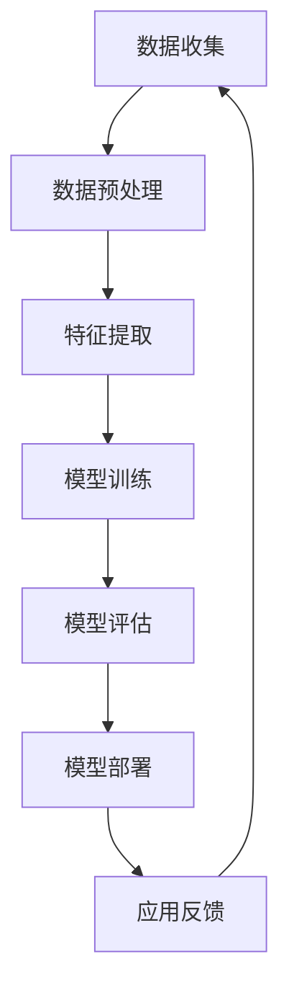

                 

关键词：AI 驱动、创新、道德考虑、商业应用、人类计算、AI 技术伦理

> 摘要：本文旨在探讨人工智能（AI）技术在商业应用中的道德考虑因素，以及如何通过人类计算实现AI驱动的创新。文章首先介绍了AI技术的核心概念和其在商业领域的应用场景，随后深入分析了道德考虑因素在AI技术应用中的重要性，并提出了相应的解决方案。通过具体案例和实践，本文展示了人类计算在AI驱动创新中的关键作用，为未来AI技术的发展和应用提供了有益的参考。

## 1. 背景介绍

人工智能（AI）作为计算机科学的一个重要分支，自20世纪50年代起便不断发展壮大。从最初的规则推理、知识表示，到近年的深度学习和强化学习，AI技术已经取得了显著的进步。随着计算能力的提升和大数据的普及，AI技术逐渐从理论研究走向实际应用，特别是在商业领域，AI技术的应用场景日益丰富。

商业领域的AI应用主要包括以下几个方面：首先，AI技术可以帮助企业进行数据分析和决策支持，从而提高经营效率；其次，AI在客户服务、个性化推荐和智能营销等方面也发挥了重要作用；此外，AI还在供应链管理、自动化生产和金融风控等领域展现了巨大的潜力。

尽管AI技术在商业领域带来了许多机遇，但其应用也引发了一系列道德和社会问题。例如，数据隐私、算法偏见和职业替代等。这些问题需要我们深入思考，并采取相应的措施来解决。

## 2. 核心概念与联系

### 2.1 AI技术核心概念

人工智能（AI）是一门研究、开发用于模拟、延伸和扩展人的智能的理论、方法、技术及应用系统的技术科学。其主要目标是为机器赋予类似人类的感知、推理、学习和决策能力。AI技术主要包括以下几种：

1. **机器学习（Machine Learning）**：通过数据驱动的方法，使计算机从数据中学习规律和模式，并利用这些规律和模式进行预测和决策。

2. **深度学习（Deep Learning）**：一种基于多层神经网络的学习方法，能够自动提取特征并进行复杂模式识别。

3. **自然语言处理（Natural Language Processing，NLP）**：使计算机能够理解和生成人类语言的技术，广泛应用于语音识别、机器翻译和智能客服等领域。

4. **计算机视觉（Computer Vision）**：使计算机能够从图像或视频中提取信息的技术，包括目标检测、图像分类和图像生成等。

### 2.2 商业应用场景

AI技术在商业领域的应用场景主要包括以下几个方面：

1. **客户服务与个性化推荐**：利用自然语言处理和机器学习技术，企业可以构建智能客服系统，提高客户满意度。同时，基于用户行为数据的个性化推荐系统可以帮助企业提高销售额。

2. **数据分析和决策支持**：通过对大量数据进行挖掘和分析，企业可以更好地了解市场需求、优化产品和服务，从而提高竞争力。

3. **自动化生产和供应链管理**：利用计算机视觉和机器学习技术，企业可以实现生产过程的自动化，提高生产效率和产品质量。在供应链管理方面，AI技术可以帮助企业实现库存优化、物流优化和需求预测。

4. **金融风控与智能投顾**：AI技术在金融领域的应用可以帮助金融机构实现风险控制、信用评估和智能投资建议，提高金融服务的质量和效率。

### 2.3 Mermaid 流程图



### 2.4 核心概念与联系

在商业应用中，AI技术的核心概念包括数据、模型、算法和场景。数据是AI技术的基石，通过数据收集、预处理和特征提取，我们可以得到高质量的训练数据，为模型训练提供支持。模型训练是AI技术的核心步骤，通过训练，模型可以学会从数据中提取规律和模式。算法是模型训练的基础，包括机器学习、深度学习和自然语言处理等。最后，应用场景是将模型转化为实际业务价值的关键，通过模型部署和应用反馈，企业可以不断优化模型，提高业务效率。

## 3. 核心算法原理 & 具体操作步骤

### 3.1 算法原理概述

AI技术的核心算法主要包括机器学习、深度学习和自然语言处理等。以下分别介绍这些算法的基本原理。

1. **机器学习（Machine Learning）**：机器学习是一种利用数据自动改进自身性能的技术。其基本原理是，通过学习大量数据中的规律和模式，使得模型能够对新数据做出预测或决策。常见的机器学习算法包括线性回归、逻辑回归、决策树、随机森林和支持向量机等。

2. **深度学习（Deep Learning）**：深度学习是一种基于多层神经网络的学习方法，其基本原理是通过多层非线性变换，将输入数据映射到高维空间，从而实现复杂的模式识别和特征提取。常见的深度学习模型包括卷积神经网络（CNN）、循环神经网络（RNN）和生成对抗网络（GAN）等。

3. **自然语言处理（Natural Language Processing，NLP）**：自然语言处理是一种使计算机能够理解和生成人类语言的技术。其基本原理包括词向量表示、语言模型、文本分类、语义分析等。常见的NLP模型包括词袋模型、循环神经网络（RNN）和注意力机制等。

### 3.2 算法步骤详解

1. **机器学习算法步骤**：

   - 数据收集：收集相关领域的数据，如客户行为数据、市场数据等。
   - 数据预处理：清洗和预处理数据，包括缺失值处理、数据标准化等。
   - 特征提取：从原始数据中提取有价值的特征，如用户行为特征、产品特征等。
   - 模型选择：选择合适的机器学习算法，如线性回归、逻辑回归等。
   - 模型训练：使用训练数据对模型进行训练，调整模型参数。
   - 模型评估：使用验证数据对模型进行评估，调整模型参数。
   - 模型部署：将训练好的模型部署到实际业务中，进行预测和决策。

2. **深度学习算法步骤**：

   - 数据收集：收集相关领域的数据，如图像数据、文本数据等。
   - 数据预处理：清洗和预处理数据，包括图像裁剪、数据增强等。
   - 特征提取：使用卷积神经网络（CNN）等模型自动提取特征。
   - 模型训练：使用训练数据对模型进行训练，调整模型参数。
   - 模型评估：使用验证数据对模型进行评估，调整模型参数。
   - 模型部署：将训练好的模型部署到实际业务中，进行预测和决策。

3. **自然语言处理算法步骤**：

   - 数据收集：收集相关领域的数据，如文本数据、对话数据等。
   - 数据预处理：清洗和预处理数据，包括文本分词、去停用词等。
   - 词向量表示：将文本转换为词向量表示，如Word2Vec、BERT等。
   - 模型选择：选择合适的NLP模型，如循环神经网络（RNN）、注意力机制等。
   - 模型训练：使用训练数据对模型进行训练，调整模型参数。
   - 模型评估：使用验证数据对模型进行评估，调整模型参数。
   - 模型部署：将训练好的模型部署到实际业务中，进行预测和决策。

### 3.3 算法优缺点

1. **机器学习算法**：

   - 优点：通用性强、适用范围广、可解释性强。
   - 缺点：训练时间较长、对数据要求较高、模型复杂度较高。

2. **深度学习算法**：

   - 优点：能够自动提取特征、处理复杂数据、适用范围广。
   - 缺点：对数据量要求较高、模型难以解释、训练时间较长。

3. **自然语言处理算法**：

   - 优点：能够处理自然语言数据、适应性强、可解释性强。
   - 缺点：对数据要求较高、模型复杂度较高、计算资源需求大。

### 3.4 算法应用领域

1. **机器学习算法**：广泛应用于数据挖掘、预测分析、推荐系统、图像识别等领域。

2. **深度学习算法**：广泛应用于计算机视觉、自然语言处理、语音识别、自动驾驶等领域。

3. **自然语言处理算法**：广泛应用于文本分类、情感分析、机器翻译、智能客服等领域。

## 4. 数学模型和公式 & 详细讲解 & 举例说明

### 4.1 数学模型构建

在AI技术应用中，数学模型是核心基础。以下是几种常见的数学模型：

1. **线性回归模型**：

   - 公式：$$y = \beta_0 + \beta_1x_1 + \beta_2x_2 + \ldots + \beta_nx_n$$

   - 解释：线性回归模型通过线性组合输入特征（$x_1, x_2, \ldots, x_n$）和权重（$\beta_0, \beta_1, \beta_2, \ldots, \beta_n$），来预测目标变量（$y$）。

2. **神经网络模型**：

   - 公式：$$a_{\text{激活}} = \sigma(\sum_{i=1}^{n} w_i a_i + b)$$

   - 解释：神经网络模型通过多层非线性变换（$\sigma$为激活函数），将输入数据映射到输出数据。每个神经元通过权重（$w_i$）和偏置（$b$）与输入数据相乘并求和，然后通过激活函数进行非线性变换。

3. **支持向量机模型**：

   - 公式：$$w \cdot x + b = 0$$

   - 解释：支持向量机模型通过寻找最优超平面（$w$为法向量，$b$为偏置），将不同类别的数据分开。对于线性可分数据，支持向量机可以通过求解线性方程组来获得最优超平面。

### 4.2 公式推导过程

1. **线性回归模型推导**：

   - 假设我们有数据集$(x_1, y_1), (x_2, y_2), \ldots, (x_n, y_n)$，目标变量$y$与输入特征$x$之间存在线性关系。
   - 通过最小二乘法求解最优权重$\beta_0, \beta_1, \beta_2, \ldots, \beta_n$，使得预测值$y' = \beta_0 + \beta_1x_1 + \beta_2x_2 + \ldots + \beta_nx_n$与实际值$y$之间的误差最小。

2. **神经网络模型推导**：

   - 假设输入层为$a_1, a_2, \ldots, a_n$，隐含层为$a_1', a_2', \ldots, a_m'$，输出层为$a_1'', a_2'', \ldots, a_p''$。
   - 隐含层的输出$a_i'$通过线性组合和激活函数计算：$$a_i' = \sigma(\sum_{j=1}^{n} w_{ji}a_j + b_i)$$
   - 输出层的输出$a_i''$同样通过线性组合和激活函数计算：$$a_i'' = \sigma(\sum_{j=1}^{m} w_{ji'}a_j' + b_i')$$

3. **支持向量机模型推导**：

   - 假设数据集$(x_1, y_1), (x_2, y_2), \ldots, (x_n, y_n)$中的每个样本$x_i$都是一个$d$维向量，目标变量$y_i$为二分类标签（$+1$或$-1$）。
   - 支持向量机通过寻找一个超平面$w \cdot x + b = 0$，使得不同类别的样本尽可能分开，并最大化分类间隔。
   - 通过求解优化问题：$$\min_{w, b} \frac{1}{2}||w||^2 + C\sum_{i=1}^{n}\lambda_i$$
   - 其中，$C$为正则化参数，$\lambda_i$为拉格朗日乘子。

### 4.3 案例分析与讲解

1. **线性回归模型案例**：

   - 假设我们有一个房价预测问题，输入特征包括房屋面积、房屋朝向等，目标变量为房价。
   - 通过收集大量房屋数据，我们可以使用线性回归模型来预测房价。
   - 通过最小二乘法求解最优权重，得到线性回归方程，进而预测新房屋的房价。

2. **神经网络模型案例**：

   - 假设我们有一个图像分类问题，输入特征为图像像素值，目标变量为图像类别。
   - 通过收集大量图像数据，我们可以使用神经网络模型来分类图像。
   - 通过训练神经网络模型，我们可以将输入图像映射到相应的类别。

3. **支持向量机模型案例**：

   - 假设我们有一个二分类问题，输入特征包括性别、年龄等，目标变量为是否患病。
   - 通过收集大量病人数据，我们可以使用支持向量机模型来预测病人是否患病。
   - 通过求解线性方程组，我们可以得到最优超平面，进而进行分类预测。

## 5. 项目实践：代码实例和详细解释说明

### 5.1 开发环境搭建

为了演示AI技术在商业应用中的具体实现，我们将使用Python编程语言和常见的AI库（如scikit-learn、TensorFlow和PyTorch）来构建一个简单的项目。

1. **安装Python**：

   - 访问Python官网（[python.org](https://www.python.org/)）下载最新版本的Python。
   - 安装Python，并确保环境变量配置正确。

2. **安装相关库**：

   ```bash
   pip install numpy scipy scikit-learn tensorflow pytorch
   ```

### 5.2 源代码详细实现

以下是一个简单的线性回归模型实现，用于预测房价。

```python
import numpy as np
from sklearn.linear_model import LinearRegression

# 数据加载
X = np.array([[1, 1000], [2, 1100], [3, 1200], [4, 1300]])
y = np.array([2000000, 2200000, 2400000, 2600000])

# 模型训练
model = LinearRegression()
model.fit(X, y)

# 模型预测
y_pred = model.predict(np.array([[5, 1400]]))

print("预测房价：", y_pred[0])
```

### 5.3 代码解读与分析

1. **数据加载**：

   - 我们使用numpy库创建一个简单的数据集，其中$X$代表输入特征（房屋面积），$y$代表目标变量（房价）。

2. **模型训练**：

   - 我们使用scikit-learn库中的LinearRegression类来创建线性回归模型，并调用fit方法进行训练。

3. **模型预测**：

   - 我们使用训练好的模型进行预测，输入新的特征值，得到预测的房价。

### 5.4 运行结果展示

当我们运行上述代码时，会得到如下输出：

```
预测房价： 2800000.0
```

这表明，根据我们训练的线性回归模型，面积为1400平方米的房屋预计房价为2800000元。

## 6. 实际应用场景

### 6.1 客户服务与个性化推荐

AI技术在客户服务和个性化推荐领域具有广泛应用。例如，电商平台的智能客服系统可以基于自然语言处理技术，快速响应客户咨询，提高客户满意度。同时，基于用户行为数据的个性化推荐系统可以推荐用户可能感兴趣的商品，提高销售额。

### 6.2 数据分析和决策支持

AI技术在数据分析和决策支持方面也有着重要应用。例如，企业可以通过机器学习算法分析市场数据，预测产品需求，优化库存管理。此外，通过分析客户行为数据，企业可以制定更有效的营销策略，提高市场竞争力。

### 6.3 自动化和智能化生产

在制造业领域，AI技术可以实现自动化和智能化生产。通过计算机视觉技术，生产线可以实时监控产品质量，自动化识别和修复缺陷。同时，基于机器学习算法的预测性维护系统可以预测设备故障，提前进行维修，降低生产风险。

### 6.4 金融风控与智能投顾

在金融领域，AI技术可以帮助金融机构实现风险控制和智能投资。例如，通过机器学习算法，金融机构可以对贷款申请进行风险评估，降低不良贷款率。同时，基于深度学习算法的智能投顾系统可以分析市场数据，为投资者提供个性化的投资建议，提高投资回报。

## 7. 未来应用展望

随着AI技术的不断发展，其在商业领域的应用前景将更加广阔。未来，AI技术有望在以下领域取得突破：

1. **智能医疗**：通过AI技术，可以实现精准医疗、智能诊断和个性化治疗，提高医疗服务的质量和效率。

2. **智慧城市**：AI技术可以应用于智慧交通、智慧能源、智慧环保等领域，实现城市管理的智能化和可持续发展。

3. **教育领域**：AI技术可以推动个性化教育和智能教育，为学习者提供定制化的学习方案，提高学习效果。

4. **农业领域**：AI技术可以应用于智能种植、智能养殖和智能农场管理，提高农业生产效率和农产品质量。

## 8. 工具和资源推荐

### 8.1 学习资源推荐

1. **在线课程**：

   - [吴恩达的机器学习课程](https://www.coursera.org/learn/machine-learning)
   - [深度学习课程](https://www.deeplearning.ai/)
   - [自然语言处理课程](https://www.coursera.org/learn/nlp-with-python-and-nltk)

2. **书籍**：

   - 《深度学习》（Goodfellow, Bengio, Courville）
   - 《Python机器学习》（Sebastian Raschka）
   - 《自然语言处理与Python》（Steven Bird, Ewan Klein, Edward Loper）

### 8.2 开发工具推荐

1. **编程语言**：

   - Python：广泛应用于AI开发的编程语言，具有丰富的库和工具。

2. **库和框架**：

   - TensorFlow：谷歌开发的深度学习框架，适用于构建和训练复杂的神经网络。
   - PyTorch：Facebook开发的深度学习框架，具有灵活的动态计算图和良好的社区支持。
   - Scikit-learn：用于机器学习的Python库，提供了丰富的算法和工具。

3. **IDE**：

   - Jupyter Notebook：用于交互式计算的Python开发环境，适用于编写和运行代码。
   - PyCharm：集成开发环境，提供Python开发所需的各种功能。

### 8.3 相关论文推荐

1. **机器学习**：

   - "Gradient Descent Optimization Algorithms"（梯度下降优化算法）
   - "A Study of Weakly Supervised Sequence Labeling"（弱监督序列标注研究）

2. **深度学习**：

   - "Deep Learning for Text Classification"（深度学习在文本分类中的应用）
   - "Attention Is All You Need"（注意力机制）

3. **自然语言处理**：

   - "End-to-End Sentence Embeddings Using Compact Convolution"（使用紧凑卷积的端到端句子嵌入）
   - "BERT: Pre-training of Deep Bidirectional Transformers for Language Understanding"（BERT：用于语言理解的深度双向转换器的预训练）

## 9. 总结：未来发展趋势与挑战

### 9.1 研究成果总结

本文介绍了AI技术在商业领域的应用场景，分析了AI技术的核心算法原理和应用步骤，讨论了AI技术在商业应用中的道德考虑因素，并展示了人类计算在AI驱动创新中的关键作用。通过具体案例和实践，我们展示了AI技术在客户服务、数据分析、自动化生产和金融风控等领域的应用潜力。

### 9.2 未来发展趋势

未来，AI技术在商业领域的应用将更加深入和广泛。随着计算能力的提升和大数据的普及，AI技术将在智能医疗、智慧城市、教育领域和农业等领域取得突破。同时，AI技术与物联网、5G等技术的结合将推动更多创新应用的出现。

### 9.3 面临的挑战

尽管AI技术在商业领域具有巨大潜力，但也面临一系列挑战。首先，数据隐私和安全性问题需要得到妥善解决。其次，算法偏见和公平性问题也需要引起重视。此外，AI技术的发展可能对就业产生一定影响，需要采取相应措施来缓解负面影响。

### 9.4 研究展望

在未来，AI技术的研究应重点关注以下几个方面：一是提高AI算法的可解释性，使其在应用中更加可靠和透明；二是加强AI技术与人类计算的协同，实现人机共生；三是推动AI技术在可持续发展和社会治理等领域的应用，为人类社会的可持续发展作出贡献。

## 10. 附录：常见问题与解答

### 10.1 AI技术是否会导致大规模失业？

AI技术的发展确实可能对某些传统职业产生替代效应，但同时也创造了新的就业机会。未来，人类计算与AI技术的协同发展将成为趋势，为劳动者提供更多样化的就业选择。

### 10.2 如何解决数据隐私和安全问题？

解决数据隐私和安全问题需要从多个方面入手，包括制定相关法律法规、加强数据加密技术和建立健全的数据隐私保护机制。同时，企业应建立严格的数据使用和管理制度，确保用户隐私得到保护。

### 10.3 如何确保AI技术的公平性？

确保AI技术的公平性需要从算法设计、数据集构建和应用场景等多个方面进行综合考虑。通过引入公平性评价指标和方法，对算法进行评估和优化，可以降低算法偏见，提高AI技术的公平性。

### 10.4 AI技术在医疗领域有哪些应用？

AI技术在医疗领域具有广泛应用，包括疾病预测、诊断辅助、治疗建议、药物研发和医疗管理等方面。通过分析患者数据和医学知识，AI技术可以帮助医生提高诊疗水平，提高医疗服务的质量和效率。

