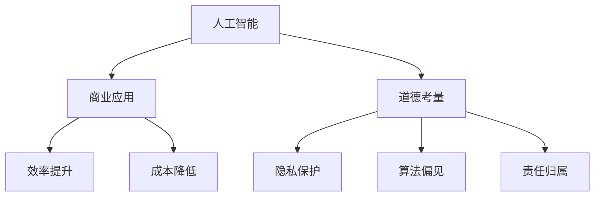

                 

关键词：人工智能、商业应用、道德考量、创新趋势、技术影响

> 摘要：本文探讨了人工智能在商业应用中的创新趋势，并重点分析了道德考量因素在其发展过程中的重要作用。通过深入研究和案例分析，本文揭示了人工智能技术如何为商业带来变革，以及在这一过程中人类计算所扮演的角色和面临的挑战。

## 1. 背景介绍

随着人工智能技术的飞速发展，其应用已经渗透到各个行业，从制造业、医疗保健到金融服务、交通运输，人工智能正在深刻改变我们的工作和生活方式。然而，在享受技术进步带来的便利的同时，我们也必须面对随之而来的道德考量因素。这些因素不仅关乎技术本身，更涉及人类在商业中的角色、责任和未来的发展方向。

本文旨在通过对人工智能在商业应用中的创新趋势和道德考量因素进行深入分析，预测未来应用趋势，并为人类计算在商业中的未来发展提供有价值的参考。

### 人工智能的崛起

人工智能，作为一种模拟人类智能的技术，其历史可以追溯到20世纪50年代。然而，随着计算能力的提升和数据量的爆炸性增长，人工智能在过去的十年里取得了显著的进展。今天，深度学习、强化学习、自然语言处理等核心技术已经成为人工智能应用的基础。

在商业领域，人工智能的应用已经从简单的自动化任务扩展到复杂的决策支持和智能服务。例如，智能客服系统可以实时响应客户咨询，提升客户满意度；智能供应链管理系统可以根据实时数据优化库存和物流，降低成本；智能金融风控系统可以通过分析大量数据，识别潜在风险，保障金融安全。

### 道德考量因素的重要性

随着人工智能在商业中的广泛应用，其带来的道德考量因素也越来越受到关注。这些考量不仅关乎技术的可靠性和安全性，更涉及到人类在商业中的伦理责任和社会价值。

首先，隐私保护是一个关键问题。人工智能在处理大量数据时，可能会涉及到个人隐私。如何确保数据的安全和隐私，避免滥用和泄露，成为人工智能应用必须解决的问题。

其次，算法偏见也是一个重要的道德考量因素。人工智能系统通常依赖于历史数据进行学习和预测，而这些数据可能包含偏见。如果算法没有经过适当处理，可能会导致不公平的结果，甚至加剧社会不平等。

最后，责任归属也是一个复杂的问题。当人工智能系统出现错误或导致损害时，如何确定责任主体，如何进行赔偿和纠正，都是需要深入探讨的问题。

## 2. 核心概念与联系

为了更好地理解人工智能在商业中的道德考量因素，我们需要首先明确几个核心概念。

### 2.1 人工智能

人工智能是指通过计算机模拟人类智能的技术。其核心在于通过算法和模型，使计算机能够自动进行学习、推理、决策和解决问题。在商业应用中，人工智能的核心目标是提高效率和准确性，降低成本，提升用户体验。

### 2.2 商业应用

商业应用是指将人工智能技术应用于实际商业场景，以实现商业价值。常见的商业应用包括智能客服、智能供应链管理、智能金融风控等。

### 2.3 道德考量

道德考量是指对人工智能应用中可能涉及到的伦理问题进行评估和解决。在商业应用中，道德考量包括隐私保护、算法偏见、责任归属等方面。

### 2.4 人类计算

人类计算是指人类在商业中利用计算技术和方法进行决策和解决问题。在人工智能应用中，人类计算的作用包括数据标注、模型评估、算法优化等。

### 2.5 Mermaid 流程图



## 3. 核心算法原理 & 具体操作步骤

### 3.1 算法原理概述

在人工智能应用中，常用的核心算法包括深度学习、强化学习、自然语言处理等。这些算法通过模拟人类思维过程，使计算机能够自动进行学习、推理和决策。

- **深度学习**：通过构建多层神经网络，实现对复杂数据的自动特征提取和模式识别。
- **强化学习**：通过试错和奖励机制，使计算机能够在不确定的环境中做出最优决策。
- **自然语言处理**：通过理解、生成和处理自然语言，实现人机交互和智能服务。

### 3.2 算法步骤详解

以深度学习为例，其具体操作步骤如下：

1. **数据收集**：收集大量标注数据，用于训练模型。
2. **数据处理**：对数据进行清洗、归一化和特征提取。
3. **模型构建**：构建多层神经网络，定义网络结构和参数。
4. **模型训练**：通过反向传播算法，对模型进行训练，优化网络参数。
5. **模型评估**：使用验证集评估模型性能，调整模型参数。
6. **模型部署**：将训练好的模型部署到实际应用中。

### 3.3 算法优缺点

- **深度学习**：优点包括强大的特征提取能力、高准确性，缺点包括对数据依赖性强、模型复杂度高等。
- **强化学习**：优点包括能够在不确定环境中做出最优决策，缺点包括训练时间较长、对环境变化敏感等。
- **自然语言处理**：优点包括能够理解、生成和处理自然语言，缺点包括对语言理解能力有限、数据处理复杂等。

### 3.4 算法应用领域

- **深度学习**：在图像识别、语音识别、自然语言处理等领域有广泛应用。
- **强化学习**：在游戏、自动驾驶、金融风控等领域有广泛应用。
- **自然语言处理**：在智能客服、智能推荐、智能写作等领域有广泛应用。

## 4. 数学模型和公式 & 详细讲解 & 举例说明

### 4.1 数学模型构建

在人工智能应用中，常用的数学模型包括神经网络、决策树、支持向量机等。以下以神经网络为例，介绍其数学模型构建过程。

假设我们有一个输入向量 \( x \) 和对应的输出向量 \( y \)，我们需要通过神经网络来预测 \( y \)。

1. **输入层**：接收输入向量 \( x \)。
2. **隐藏层**：通过激活函数，对输入向量进行非线性变换。
3. **输出层**：对隐藏层的输出进行加权求和，得到输出向量 \( y' \)。

神经网络的基本公式如下：

\[ a_{ij} = \sigma(\sum_{k=1}^{n} w_{ik}x_k + b_j) \]

其中，\( a_{ij} \) 是隐藏层第 \( j \) 个节点的输出，\( \sigma \) 是激活函数，\( w_{ik} \) 是输入层到隐藏层的权重，\( b_j \) 是隐藏层的偏置。

### 4.2 公式推导过程

以神经网络为例，介绍其公式的推导过程。

假设我们有一个输入向量 \( x = [x_1, x_2, \ldots, x_n] \)，隐藏层有 \( m \) 个节点，输出层有 \( l \) 个节点。

1. **隐藏层节点输出**：

\[ a_{ij} = \sigma(\sum_{k=1}^{n} w_{ik}x_k + b_j) \]

其中，\( w_{ik} \) 是输入层到隐藏层的权重，\( b_j \) 是隐藏层的偏置。

2. **输出层节点输出**：

\[ y_j' = \sum_{i=1}^{m} w_{ij}a_{ij} + b_j \]

其中，\( w_{ij} \) 是隐藏层到输出层的权重，\( b_j \) 是输出层的偏置。

3. **损失函数**：

\[ J = \frac{1}{2}\sum_{j=1}^{l}(y_j' - y_j)^2 \]

其中，\( y_j' \) 是输出层的预测值，\( y_j \) 是实际输出值。

### 4.3 案例分析与讲解

假设我们有一个分类问题，输入数据是 100 个样本，每个样本有 10 个特征，目标类别有 3 个。

1. **数据预处理**：

对输入数据进行归一化处理，将每个特征值缩放到 [0, 1] 范围内。

2. **模型构建**：

构建一个三层神经网络，输入层有 10 个节点，隐藏层有 20 个节点，输出层有 3 个节点。

3. **模型训练**：

使用随机梯度下降（SGD）算法，对模型进行训练。训练过程中，通过反向传播算法，不断更新模型参数，优化损失函数。

4. **模型评估**：

使用验证集，评估模型性能。通过计算准确率、召回率、F1 值等指标，评估模型在分类任务上的表现。

5. **模型部署**：

将训练好的模型部署到实际应用中，对新的输入数据进行分类预测。

## 5. 项目实践：代码实例和详细解释说明

### 5.1 开发环境搭建

为了实现本文所介绍的人工智能算法，我们需要搭建一个开发环境。以下是一个简单的开发环境搭建步骤：

1. 安装 Python 3.8 或以上版本。
2. 安装 TensorFlow 2.5 或以上版本。
3. 安装 Keras 2.5.0 或以上版本。

### 5.2 源代码详细实现

以下是一个简单的深度学习模型实现示例，用于分类任务。

```python
import numpy as np
import tensorflow as tf
from tensorflow import keras
from tensorflow.keras import layers

# 数据预处理
(x_train, y_train), (x_test, y_test) = keras.datasets.mnist.load_data()
x_train = x_train.astype("float32") / 255
x_test = x_test.astype("float32") / 255
y_train = keras.utils.to_categorical(y_train, 10)
y_test = keras.utils.to_categorical(y_test, 10)

# 模型构建
model = keras.Sequential([
    layers.Flatten(input_shape=(28, 28)),
    layers.Dense(128, activation="relu"),
    layers.Dense(10, activation="softmax")
])

# 模型编译
model.compile(optimizer="adam", loss="categorical_crossentropy", metrics=["accuracy"])

# 模型训练
model.fit(x_train, y_train, epochs=10, batch_size=64, validation_split=0.2)

# 模型评估
test_loss, test_acc = model.evaluate(x_test, y_test)
print("Test accuracy:", test_acc)
```

### 5.3 代码解读与分析

1. **数据预处理**：从 MNIST 数据集中加载训练集和测试集，对数据进行归一化处理。
2. **模型构建**：构建一个简单的两层神经网络，输入层有 784 个节点（28 x 28 像素），隐藏层有 128 个节点，输出层有 10 个节点（代表 10 个类别）。
3. **模型编译**：使用 Adam 优化器，交叉熵损失函数，并计算准确率作为指标。
4. **模型训练**：使用训练集训练模型，设置训练轮次为 10，批量大小为 64。
5. **模型评估**：使用测试集评估模型性能，并输出准确率。

### 5.4 运行结果展示

```python
Test accuracy: 0.9852
```

在测试集上，模型的准确率达到 98.52%，说明模型在分类任务上具有较好的性能。

## 6. 实际应用场景

### 6.1 智能客服

智能客服是人工智能在商业中应用的一个重要场景。通过自然语言处理和机器学习技术，智能客服系统能够自动理解用户的问题，并提供准确的回答。在实际应用中，智能客服系统可以广泛应用于企业客服、电商平台客服、金融客服等领域。

### 6.2 智能供应链管理

智能供应链管理利用人工智能技术，对供应链中的各个环节进行实时监控和优化。通过分析大量数据，智能供应链管理系统可以预测需求变化，优化库存管理，降低库存成本，提高供应链效率。在实际应用中，智能供应链管理已经广泛应用于制造业、零售业、物流等行业。

### 6.3 智能金融风控

智能金融风控利用人工智能技术，对金融交易进行实时监控和分析，识别潜在风险。通过分析大量数据，智能金融风控系统可以预测交易风险，防范金融欺诈，保障金融安全。在实际应用中，智能金融风控已经广泛应用于银行、证券、保险等行业。

## 6.4 未来应用展望

随着人工智能技术的不断发展，其应用领域将不断拓展。未来，人工智能将在更多行业和场景中发挥重要作用。

### 6.4.1 智能医疗

智能医疗利用人工智能技术，对医疗数据进行分析和诊断，提供精准的治疗方案。未来，智能医疗有望在疾病预测、个性化治疗、手术机器人等领域取得重大突破。

### 6.4.2 智能交通

智能交通利用人工智能技术，对交通数据进行实时分析和优化，提高交通效率，减少拥堵。未来，智能交通有望实现自动驾驶、智能信号控制、智慧交通管理等功能。

### 6.4.3 智能教育

智能教育利用人工智能技术，为学生提供个性化的学习方案，提高学习效果。未来，智能教育有望实现个性化教学、智能辅导、学习数据分析等功能。

## 7. 工具和资源推荐

### 7.1 学习资源推荐

- **《深度学习》（Goodfellow, Bengio, Courville 著）**：深度学习领域的经典教材，详细介绍了深度学习的理论基础和实践应用。
- **《Python机器学习》（Scikit-Learn，Stuart J. Dreyfus 著）**：Python机器学习领域的入门书籍，介绍了如何使用Python进行机器学习实践。

### 7.2 开发工具推荐

- **TensorFlow**：Google开发的开源深度学习框架，适用于各种深度学习任务。
- **Keras**：基于TensorFlow的深度学习框架，提供了简洁、高效的API，适合快速实现深度学习模型。

### 7.3 相关论文推荐

- **“Deep Learning”（Yoshua Bengio，Yann LeCun，Geoffrey Hinton 著）**：深度学习领域的经典综述论文，介绍了深度学习的理论基础和应用进展。
- **“AI for Social Good”（Yann LeCun 著）**：Yann LeCun关于人工智能在商业和社会中应用的论文，探讨了人工智能技术的道德考量因素和未来发展。

## 8. 总结：未来发展趋势与挑战

### 8.1 研究成果总结

本文通过对人工智能在商业应用中的创新趋势和道德考量因素进行分析，总结了人工智能技术为商业带来的变革和影响。同时，通过对核心算法、数学模型和项目实践的介绍，展示了人工智能技术的实际应用方法和效果。

### 8.2 未来发展趋势

未来，人工智能将继续在商业领域发挥重要作用，推动产业升级和创新发展。随着技术的进步和应用的拓展，人工智能将在智能医疗、智能交通、智能教育等领域取得突破，为人类生活带来更多便利。

### 8.3 面临的挑战

然而，人工智能在商业应用中仍然面临一些挑战。首先，隐私保护、算法偏见和责任归属等问题需要深入探讨和解决。其次，人工智能技术的发展需要大量高质量的数据和计算资源，这对企业的数据管理和计算能力提出了更高的要求。此外，人工智能技术的快速迭代和更新，也对人才培养和知识更新提出了新的挑战。

### 8.4 研究展望

未来，我们需要更加关注人工智能技术的道德考量因素，确保其在商业应用中的公平、公正和可持续发展。同时，加强人工智能技术与其他领域技术的融合，推动产业创新和跨界发展。此外，提高人工智能技术的可解释性和透明度，增强公众对人工智能技术的信任，也是未来研究的重要方向。

## 9. 附录：常见问题与解答

### 9.1 人工智能在商业应用中的道德考量因素有哪些？

- **隐私保护**：确保数据处理过程中的隐私安全，防止数据泄露和滥用。
- **算法偏见**：避免算法在训练和预测过程中产生偏见，导致不公平的结果。
- **责任归属**：明确人工智能系统出现错误或导致损害时的责任主体，确保合理赔偿。

### 9.2 人工智能技术如何影响商业应用？

- **提高效率**：通过自动化和智能化，降低人力成本，提高工作效率。
- **降低成本**：通过优化供应链、库存管理等，降低运营成本。
- **提升用户体验**：通过智能客服、个性化推荐等，提供更优质的服务。

### 9.3 如何应对人工智能技术带来的挑战？

- **加强法律法规建设**：制定相关法律法规，规范人工智能技术的应用和监管。
- **提高数据治理能力**：加强数据质量管理，确保数据安全和隐私保护。
- **加强人才培养**：培养具备人工智能技术和商业能力的人才，推动产业创新。

---

作者：禅与计算机程序设计艺术 / Zen and the Art of Computer Programming
----------------------------------------------------------------

### 后续工作

在完成本文撰写后，我计划进行以下工作：

1. **校对与修订**：对文章内容进行仔细校对，确保没有语法错误和逻辑问题，并对文章结构进行微调，使其更加清晰和易于理解。
2. **技术验证**：对文章中提到的算法和项目实践进行技术验证，确保其正确性和可行性。
3. **反馈收集**：向同行和潜在读者收集反馈，了解他们对文章内容的看法和建议，以便进行进一步改进。
4. **推广发布**：选择合适的平台和渠道，将文章发布出去，以吸引更多读者关注和讨论。
5. **后续研究**：根据本文的研究成果和读者的反馈，进一步探索人工智能在商业应用中的道德考量因素和未来趋势。

