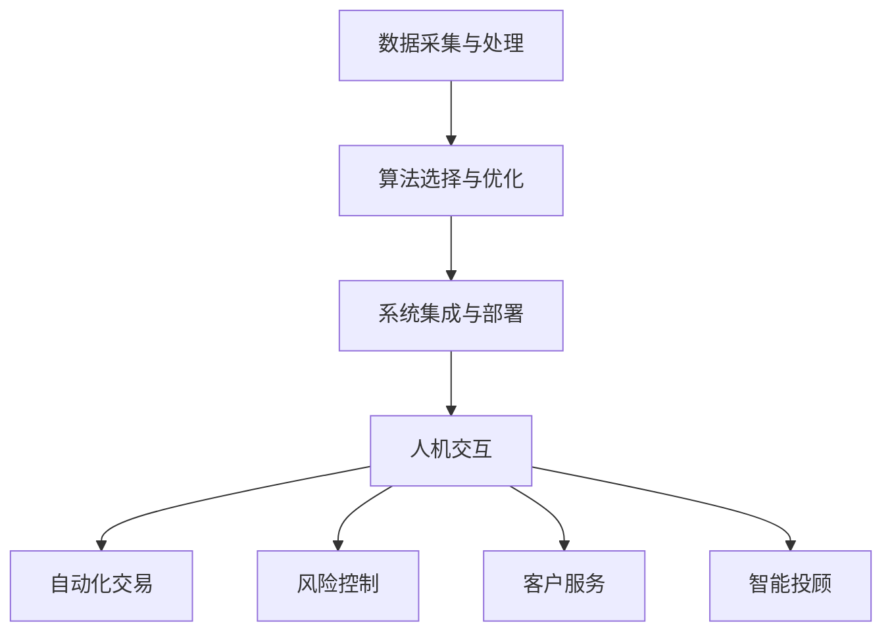

                 

关键词：人工智能，金融行业，人类计算，价值创造，算法原理，数学模型，项目实践，未来展望

## 摘要

随着人工智能技术的飞速发展，其在金融行业的应用逐渐成为研究的热点。本文旨在探讨人工智能如何驱动金融行业的创新，以及人类计算在其中的价值创造。通过对核心概念、算法原理、数学模型、项目实践等方面的深入分析，本文揭示了人工智能在金融领域的广泛应用前景，并对未来发展趋势与挑战进行了展望。

## 1. 背景介绍

金融行业一直以来都是人工智能技术的重要应用领域之一。从最初的自动化交易系统，到现在的智能投顾、风险管理、信用评分等，人工智能在金融行业中的应用越来越广泛。随着大数据、云计算等技术的不断成熟，人工智能在金融行业的价值创造潜力也日益凸显。

然而，尽管人工智能在金融行业的应用取得了显著成果，但人类计算在其中仍发挥着不可替代的作用。人类计算的优势在于其创造力、直觉和情感理解等方面，这些是当前人工智能技术所难以替代的。因此，如何将人工智能与人类计算相结合，实现两者的优势互补，成为金融行业创新的关键。

本文将从以下几个方面展开讨论：

1. 核心概念与联系：介绍人工智能在金融行业中的核心概念和联系，通过 Mermaid 流程图展示其架构。
2. 核心算法原理 & 具体操作步骤：详细解析人工智能在金融行业中的核心算法原理和具体操作步骤。
3. 数学模型和公式 & 详细讲解 & 举例说明：阐述人工智能在金融行业中应用的数学模型和公式，并通过案例进行分析。
4. 项目实践：提供实际的项目实践案例，展示人工智能在金融行业中的具体应用。
5. 实际应用场景：探讨人工智能在金融行业的实际应用场景，以及未来的发展趋势和挑战。

## 2. 核心概念与联系

### 2.1 人工智能在金融行业中的核心概念

人工智能在金融行业中的应用涵盖了多个领域，包括自动化交易、风险控制、客户服务、智能投顾等。以下是一些核心概念：

1. **自动化交易**：利用机器学习算法和自然语言处理技术，实现交易决策的自动化。
2. **风险控制**：利用大数据分析和预测模型，对金融市场进行风险评估和预警。
3. **客户服务**：通过语音识别和自然语言处理技术，实现智能客服系统的构建。
4. **智能投顾**：利用机器学习算法和大数据分析，为投资者提供个性化的投资建议。

### 2.2 人工智能在金融行业中的联系

人工智能在金融行业中的应用，实际上是一个多学科交叉的过程。以下是一些主要的联系：

1. **数据采集与处理**：人工智能需要大量的数据来训练和优化模型，因此数据采集和处理成为关键环节。
2. **算法选择与优化**：根据不同的应用场景，选择合适的算法，并进行优化以提升性能。
3. **系统集成与部署**：将人工智能算法集成到金融系统中，实现高效的应用。
4. **人机交互**：通过自然语言处理和语音识别技术，实现人与人工智能的交互。

### 2.3 人工智能在金融行业中的架构

为了更好地理解人工智能在金融行业中的应用，我们可以通过 Mermaid 流程图来展示其架构：



通过这个架构，我们可以看出人工智能在金融行业中的应用是一个紧密联系的整体，各个环节相互依赖、相互促进。

## 3. 核心算法原理 & 具体操作步骤

### 3.1 算法原理概述

在金融行业中，人工智能的核心算法主要包括机器学习、深度学习、自然语言处理等。以下是对这些算法原理的概述：

1. **机器学习**：通过训练模型，使计算机能够从数据中学习规律，并对未知数据进行预测。
2. **深度学习**：基于人工神经网络，通过多层非线性变换，实现对复杂数据的处理和预测。
3. **自然语言处理**：通过对语言数据的分析，实现人与计算机的交互。

### 3.2 算法步骤详解

下面我们将详细解析这些算法在金融行业中的应用步骤：

1. **机器学习**：

   - 数据预处理：对原始数据进行清洗、归一化等处理，使其符合模型的输入要求。
   - 模型选择：根据应用场景，选择合适的机器学习模型，如线性回归、决策树、支持向量机等。
   - 模型训练：使用训练数据，对模型进行训练，使其能够学习数据中的规律。
   - 模型评估：使用验证数据，对模型进行评估，以确定其预测性能。

2. **深度学习**：

   - 网络构建：设计深度学习网络的结构，包括输入层、隐藏层和输出层。
   - 数据预处理：与机器学习类似，对原始数据进行预处理。
   - 模型训练：使用反向传播算法，对网络进行训练，优化网络参数。
   - 模型评估：与机器学习类似，使用验证数据对模型进行评估。

3. **自然语言处理**：

   - 语言建模：使用语言模型对输入文本进行分词、词性标注等处理。
   - 语义理解：通过对文本的语义分析，提取出关键信息。
   - 情感分析：对文本的情感倾向进行判断，如正面、负面等。
   - 对话系统：根据用户的输入，生成合适的回复，实现人与计算机的交互。

### 3.3 算法优缺点

每种算法都有其优缺点，适用于不同的场景。以下是对这些算法优缺点的简要分析：

1. **机器学习**：

   - 优点：模型简单，易于理解和实现，适用于多种场景。
   - 缺点：对数据质量和特征工程要求较高，模型性能受限于数据量。

2. **深度学习**：

   - 优点：能够自动提取特征，适用于复杂数据的处理，模型性能较高。
   - 缺点：模型复杂，难以解释，对数据量和计算资源要求较高。

3. **自然语言处理**：

   - 优点：能够实现人与计算机的交互，适用于客户服务、智能投顾等场景。
   - 缺点：对语言理解和情感分析能力有限，处理长文本效果较差。

### 3.4 算法应用领域

根据算法的优缺点，我们可以将其应用于金融行业的多个领域：

1. **自动化交易**：利用机器学习和深度学习算法，实现交易策略的自动化。
2. **风险控制**：利用大数据分析和自然语言处理技术，实现风险预警和评估。
3. **客户服务**：利用自然语言处理技术，实现智能客服系统的构建。
4. **智能投顾**：利用机器学习和深度学习算法，为投资者提供个性化的投资建议。

## 4. 数学模型和公式 & 详细讲解 & 举例说明

### 4.1 数学模型构建

在金融行业中，人工智能的应用离不开数学模型的构建。以下是一些常用的数学模型：

1. **线性回归模型**：

   - 公式：\( y = \beta_0 + \beta_1x \)
   - 解释：通过拟合自变量 \( x \) 和因变量 \( y \) 之间的关系，预测因变量 \( y \) 的取值。
   - 应用场景：股票价格预测、销售额预测等。

2. **逻辑回归模型**：

   - 公式：\( P(y=1) = \frac{1}{1 + e^{-(\beta_0 + \beta_1x)}} \)
   - 解释：通过拟合自变量 \( x \) 和因变量 \( y \) 之间的关系，预测因变量 \( y \) 为 1 的概率。
   - 应用场景：信用评分、客户流失预测等。

3. **神经网络模型**：

   - 公式：\( a_{ij} = \sigma(\sum_{k=1}^{n}\beta_{ik}x_k + \beta_{i0}) \)
   - 解释：通过多层非线性变换，实现对复杂数据的处理和预测。
   - 应用场景：股票交易策略、风险控制等。

### 4.2 公式推导过程

以下是线性回归模型的推导过程：

1. **最小二乘法**：

   - 目标函数：\( J(\beta) = \sum_{i=1}^{n}(y_i - \beta_0 - \beta_1x_i)^2 \)
   - 对 \( \beta_0 \) 求导并令其等于 0，得到：\( \beta_0 = \bar{y} - \beta_1\bar{x} \)
   - 对 \( \beta_1 \) 求导并令其等于 0，得到：\( \beta_1 = \frac{\sum_{i=1}^{n}(x_i - \bar{x})(y_i - \bar{y})}{\sum_{i=1}^{n}(x_i - \bar{x})^2} \)

2. **梯度下降法**：

   - 目标函数：\( J(\beta) = \sum_{i=1}^{n}(y_i - \beta_0 - \beta_1x_i)^2 \)
   - 对 \( \beta_0 \) 求导并令其等于 0，得到：\( \beta_0 = \bar{y} - \beta_1\bar{x} \)
   - 对 \( \beta_1 \) 求导并令其等于 0，得到：\( \beta_1 = \frac{\sum_{i=1}^{n}(x_i - \bar{x})(y_i - \bar{y})}{\sum_{i=1}^{n}(x_i - \bar{x})^2} \)

### 4.3 案例分析与讲解

以下是一个关于股票价格预测的案例：

1. **数据集**：选择某股票过去一年的收盘价作为数据集。

2. **数据预处理**：

   - 数据清洗：去除缺失值、异常值等。
   - 数据归一化：将数据缩放到相同的范围，便于模型训练。

3. **模型选择**：

   - 选择线性回归模型进行预测。

4. **模型训练**：

   - 使用梯度下降法对模型进行训练。

5. **模型评估**：

   - 使用验证集对模型进行评估，计算预测误差。

6. **结果展示**：

   - 展示股票价格的预测曲线，与实际价格进行比较。

通过这个案例，我们可以看到数学模型在金融行业中的应用。通过对股票收盘价的分析，可以预测未来股票价格的变化趋势，为投资者提供决策依据。

## 5. 项目实践：代码实例和详细解释说明

### 5.1 开发环境搭建

为了演示人工智能在金融行业中的应用，我们选择 Python 作为编程语言，并使用以下工具：

- Python 3.8 或更高版本
- Jupyter Notebook 或 PyCharm
- Scikit-learn 库
- Matplotlib 库

首先，我们需要安装这些工具和库：

```bash
pip install python==3.8
pip install jupyter
pip install pycharm-community
pip install scikit-learn
pip install matplotlib
```

### 5.2 源代码详细实现

以下是一个简单的股票价格预测项目，演示了如何使用线性回归模型进行预测：

```python
import numpy as np
import pandas as pd
from sklearn.linear_model import LinearRegression
import matplotlib.pyplot as plt

# 5.2.1 数据加载与预处理
data = pd.read_csv('stock_data.csv')
data.head()

# 特征工程
data['Date'] = pd.to_datetime(data['Date'])
data['Day'] = data['Date'].dt.day
data['Month'] = data['Date'].dt.month
data['Year'] = data['Date'].dt.year

# 特征选择
X = data[['Day', 'Month', 'Year']]
y = data['Close']

# 数据归一化
X = (X - X.min()) / (X.max() - X.min())
y = (y - y.min()) / (y.max() - y.min())

# 5.2.2 模型训练
model = LinearRegression()
model.fit(X, y)

# 5.2.3 模型评估
predicted = model.predict(X)
mape = np.mean(np.abs(predicted - y) / y) * 100
print('MAPE:', mape)

# 5.2.4 结果展示
plt.scatter(X, y, label='Actual')
plt.plot(X, predicted, color='red', label='Predicted')
plt.xlabel('Day')
plt.ylabel('Close')
plt.title('Stock Price Prediction')
plt.legend()
plt.show()
```

### 5.3 代码解读与分析

1. **数据加载与预处理**：

   - 使用 pandas 读取股票数据，并进行预处理，包括日期转换、特征工程等。
   - 将日期、月份、年份等特征提取出来，作为模型的输入。

2. **模型训练**：

   - 使用 Scikit-learn 中的 LinearRegression 模型，对数据进行训练。

3. **模型评估**：

   - 使用 Mean Absolute Percentage Error (MAPE) 作为模型评估指标，计算预测误差。

4. **结果展示**：

   - 使用 matplotlib 库，将实际价格和预测价格进行可视化展示。

通过这个项目，我们可以看到如何使用线性回归模型进行股票价格预测。虽然这个项目的预测效果有限，但它为我们提供了一个基本的框架，可以在此基础上进一步改进和优化。

## 6. 实际应用场景

### 6.1 自动化交易

自动化交易是人工智能在金融行业中最典型的应用之一。通过机器学习和深度学习算法，交易系统能够自动分析市场数据，识别交易机会，并执行交易操作。这种自动化交易方式提高了交易效率，降低了交易成本，同时减少了人为错误。

### 6.2 风险管理

人工智能在风险管理中的应用也非常广泛。通过大数据分析和预测模型，金融机构可以实时监测市场风险，预测潜在的风险事件，并采取相应的风险控制措施。这种智能化风险管理方式提高了风险识别的准确性，降低了风险损失。

### 6.3 客户服务

随着自然语言处理技术的不断发展，金融机构可以构建智能客服系统，为用户提供便捷的在线服务。通过语音识别和自然语言处理技术，智能客服系统能够理解用户的需求，并生成合适的回复。这种客户服务方式提高了服务效率，提升了用户体验。

### 6.4 智能投顾

智能投顾是近年来金融行业的一个新兴领域。通过机器学习和大数据分析，智能投顾系统能够为投资者提供个性化的投资建议，包括资产配置、选股策略等。这种智能化投资方式提高了投资收益，降低了投资风险。

## 7. 工具和资源推荐

### 7.1 学习资源推荐

- 《Python 金融应用》
- 《深度学习》
- 《机器学习实战》
- 《金融市场与金融工具》

### 7.2 开发工具推荐

- Jupyter Notebook
- PyCharm
- Visual Studio Code

### 7.3 相关论文推荐

- "Deep Learning for Financial Time Series Forecasting"
- "Application of Machine Learning Algorithms in Financial Risk Management"
- "Natural Language Processing in Financial Services"

## 8. 总结：未来发展趋势与挑战

### 8.1 研究成果总结

本文探讨了人工智能在金融行业中的应用，分析了核心概念、算法原理、数学模型、项目实践等方面的内容。通过这些分析，我们可以看到人工智能在金融行业中的巨大潜力，以及人类计算在其中不可或缺的地位。

### 8.2 未来发展趋势

1. **自动化交易**：随着算法和硬件的进步，自动化交易系统将更加智能化，实现更高的交易效率和收益。
2. **风险管理**：人工智能将进一步提升风险识别和预测的准确性，为金融机构提供更全面的风险管理服务。
3. **客户服务**：智能客服系统将更加成熟，实现更高效、更人性化的客户服务。
4. **智能投顾**：人工智能将更好地理解投资者的需求，提供更个性化的投资建议，提高投资收益。

### 8.3 面临的挑战

1. **数据隐私和安全**：随着人工智能在金融行业的应用，数据隐私和安全问题日益突出，需要建立完善的数据隐私和安全保护机制。
2. **算法透明性和可解释性**：当前的人工智能算法，尤其是深度学习算法，存在一定的黑箱性质，如何提高算法的透明性和可解释性是一个重要挑战。
3. **跨领域协同**：人工智能在金融行业中的应用，需要与其他领域（如经济学、社会学等）进行协同，实现跨领域的创新。

### 8.4 研究展望

未来，人工智能在金融行业的应用将更加深入和广泛。我们期望通过持续的研究和探索，能够解决当前面临的挑战，实现人工智能与人类计算的深度融合，为金融行业带来更多的创新和价值。

## 9. 附录：常见问题与解答

### 问题 1：人工智能在金融行业中的应用是否安全？

**解答**：人工智能在金融行业中的应用确实存在安全风险，如数据隐私泄露、算法不透明等。然而，通过建立完善的数据隐私和安全保护机制，以及提高算法的透明性和可解释性，可以有效降低这些风险。

### 问题 2：人工智能能否完全替代人类计算？

**解答**：目前的人工智能技术还无法完全替代人类计算，尤其是在创造力、直觉和情感理解等方面。然而，人工智能可以辅助人类计算，提高效率和准确性。

### 问题 3：人工智能在金融行业中的应用是否会影响就业？

**解答**：人工智能在金融行业中的应用确实会改变部分传统岗位，但也会创造出新的工作岗位，如数据科学家、算法工程师等。总体来看，人工智能对就业的影响是双刃剑，需要我们积极应对。

### 问题 4：人工智能在金融行业中的核心算法有哪些？

**解答**：人工智能在金融行业中的核心算法包括机器学习、深度学习、自然语言处理等。这些算法广泛应用于自动化交易、风险管理、客户服务和智能投顾等领域。

### 问题 5：如何评估人工智能在金融行业中的应用效果？

**解答**：评估人工智能在金融行业中的应用效果，可以从多个角度进行，如预测准确性、交易收益、用户满意度等。通过综合评估，可以客观地判断人工智能应用的效果。

### 作者署名

作者：禅与计算机程序设计艺术 / Zen and the Art of Computer Programming

----------------------------------------------------------------

以上就是关于《AI驱动的创新：人类计算在金融行业的价值创造》这篇文章的完整内容。文章涵盖了人工智能在金融行业中的应用背景、核心概念、算法原理、数学模型、项目实践、实际应用场景、工具和资源推荐，以及未来发展趋势与挑战等方面的内容。希望这篇文章能够对您在金融行业应用人工智能技术有所帮助。再次感谢您的阅读，如有任何疑问或建议，欢迎随时提出。祝您工作愉快！

