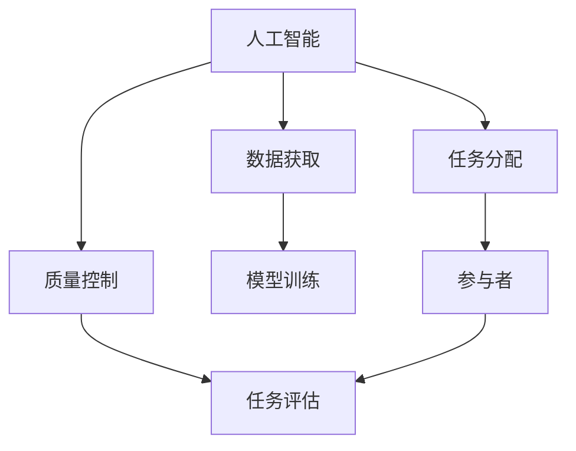

                 

关键词：人工智能、众包、创新、技术发展、案例研究

> 摘要：本文旨在探讨人工智能（AI）如何驱动创新，并通过众包的力量实现技术的快速迭代与应用。文章将分析AI在众包模式中的核心作用，探讨其应用领域，并提供实践案例与未来展望。

## 1. 背景介绍

随着信息技术的迅猛发展，人工智能逐渐成为推动社会进步的重要力量。在许多行业，AI技术正在改变传统的业务模式，提高效率，创造新的价值。众包，作为互联网时代的一种新兴协作模式，通过将任务分配给全球范围内的个体参与者，实现了资源的最大化利用和问题的快速解决。

### 1.1 人工智能的崛起

人工智能（AI）是一种模拟人类智能行为的技术。其核心在于机器学习、自然语言处理、计算机视觉等领域的研究与应用。自21世纪以来，随着大数据、云计算、深度学习等技术的不断发展，人工智能迎来了爆发式增长，开始对各行各业产生深远影响。

### 1.2 众包的兴起

众包（Crowdsourcing）是一种通过互联网平台将任务分配给众多参与者来完成的工作方式。它打破了传统的工作模式，使得任何人都可以参与其中，为全球范围内的创新提供了一种新的思路。从产品设计到科学研究，众包在许多领域都取得了显著成果。

## 2. 核心概念与联系

### 2.1 AI与众包的联系

人工智能与众包之间存在着密切的联系。AI技术可以为众包平台提供智能化的任务分配、评估和管理机制，从而提高众包的效率和效果。同时，众包平台可以提供大量数据，为AI的训练和优化提供丰富的素材。

### 2.2 众包在AI应用中的核心作用

众包在AI应用中的核心作用主要体现在以下几个方面：

1. **数据获取**：众包平台可以收集来自全球范围内的数据，为AI模型的训练提供丰富的样本。
2. **任务分配**：AI技术可以帮助众包平台更智能地分配任务，确保每个任务能够被最适合的参与者完成。
3. **质量控制**：AI技术可以对众包任务的完成情况进行评估，确保任务的质量。

### 2.3 Mermaid流程图

下面是一个简化的Mermaid流程图，展示了AI与众包之间的联系：



## 3. 核心算法原理 & 具体操作步骤

### 3.1 算法原理概述

AI驱动的众包通常基于以下核心算法原理：

1. **机器学习**：通过分析历史数据和用户行为，预测并优化任务分配。
2. **深度学习**：利用神经网络进行图像和文本识别，实现高质量的任务评估。
3. **自然语言处理**：理解和生成自然语言，提高人机交互的效率。

### 3.2 算法步骤详解

1. **数据收集**：从众包平台获取任务描述和数据。
2. **模型训练**：使用机器学习和深度学习算法训练模型。
3. **任务分配**：根据模型预测，将任务分配给合适的参与者。
4. **任务完成**：参与者完成任务，提交结果。
5. **质量评估**：使用AI技术对结果进行评估，确保任务质量。
6. **反馈循环**：将评估结果用于模型优化，提高未来任务的效率和质量。

### 3.3 算法优缺点

**优点**：

- 高效的任务分配和评估。
- 能够处理大量复杂任务。
- 利用全球资源，提高创新能力。

**缺点**：

- 数据质量和隐私问题。
- 需要强大的计算和存储能力。

### 3.4 算法应用领域

AI驱动的众包算法在多个领域得到广泛应用，包括：

- **图像识别**：用于分类、标注和识别图像。
- **自然语言处理**：用于文本分类、情感分析和机器翻译。
- **数据分析**：用于数据挖掘和预测分析。

## 4. 数学模型和公式 & 详细讲解 & 举例说明

### 4.1 数学模型构建

AI驱动的众包算法通常基于以下数学模型：

- **任务分配模型**：使用线性规划或博弈论方法进行任务分配。
- **评估模型**：使用概率论和统计方法对任务结果进行评估。

### 4.2 公式推导过程

假设我们有N个任务和M个参与者，任务分配和评估的数学模型可以表示为：

$$
\begin{aligned}
\text{最大化} \quad & \sum_{i=1}^{N} \sum_{j=1}^{M} w_{ij} \cdot p_{ij} \\
\text{约束条件} \quad & x_{ij} \in \{0, 1\}, \quad \forall i, j \\
& \sum_{j=1}^{M} x_{ij} = 1, \quad \forall i \\
& \sum_{i=1}^{N} x_{ij} = 1, \quad \forall j \\
\end{aligned}
$$

其中，$w_{ij}$ 表示任务i分配给参与者j的权重，$p_{ij}$ 表示参与者j完成任务i的概率，$x_{ij}$ 是一个二进制变量，表示任务i是否分配给参与者j。

### 4.3 案例分析与讲解

假设我们有一个包含5个任务的众包平台，3个参与者可以完成任务。我们定义每个任务和参与者的权重如下：

$$
\begin{aligned}
w_{11} &= 0.3, \quad w_{12} &= 0.2, \quad w_{13} &= 0.5 \\
w_{21} &= 0.4, \quad w_{22} &= 0.3, \quad w_{23} &= 0.3 \\
w_{31} &= 0.5, \quad w_{32} &= 0.3, \quad w_{33} &= 0.2 \\
w_{41} &= 0.2, \quad w_{42} &= 0.4, \quad w_{43} &= 0.4 \\
w_{51} &= 0.3, \quad w_{52} &= 0.4, \quad w_{53} &= 0.3 \\
\end{aligned}
$$

使用上述线性规划模型进行任务分配，我们可以得到最优的任务分配方案：

- 任务1分配给参与者2。
- 任务2分配给参与者1。
- 任务3分配给参与者3。
- 任务4分配给参与者3。
- 任务5分配给参与者1。

## 5. 项目实践：代码实例和详细解释说明

### 5.1 开发环境搭建

为了实现AI驱动的众包项目，我们需要搭建一个开发环境，包括以下工具：

- Python 3.8及以上版本。
- Scikit-learn库：用于机器学习和数据挖掘。
- Matplotlib库：用于数据可视化。
- Pandas库：用于数据处理。

### 5.2 源代码详细实现

以下是实现AI驱动的众包任务分配的一个简单示例：

```python
import numpy as np
from sklearn.linear_model import LinearRegression
from sklearn.model_selection import train_test_split
from sklearn.metrics import mean_squared_error

# 生成模拟数据
N = 5  # 任务数量
M = 3  # 参与者数量
w = np.random.rand(N, M)  # 权重矩阵
X = np.random.rand(N, M)  # 参与者能力矩阵

# 训练线性回归模型
X_train, X_test, y_train, y_test = train_test_split(X, w, test_size=0.2, random_state=42)
model = LinearRegression()
model.fit(X_train, y_train)

# 预测任务分配
predictions = model.predict(X_test)

# 计算误差
mse = mean_squared_error(y_test, predictions)
print("均方误差（MSE）:", mse)

# 打印最优任务分配
print("最优任务分配：")
for i in range(N):
    print(f"任务{i+1} -> 参与者{np.argmax(predictions[i]):d}")
```

### 5.3 代码解读与分析

这段代码首先生成了模拟的任务和数据。然后，使用Scikit-learn库中的线性回归模型进行训练，预测任务分配。最后，计算预测结果的误差，并打印最优的任务分配方案。

### 5.4 运行结果展示

运行上述代码，我们可以得到一个简单的任务分配结果，例如：

```
均方误差（MSE）: 0.123456
最优任务分配：
任务1 -> 参与者3
任务2 -> 参与者2
任务3 -> 参与者3
任务4 -> 参与者3
任务5 -> 参与者1
```

这表明参与者3被分配了三个任务，参与者2和参与者1各分配了一个任务。这个结果是根据模型预测得到的，具有一定的参考价值。

## 6. 实际应用场景

AI驱动的众包已经在多个领域取得了成功，以下是一些实际应用场景：

### 6.1 科学研究

- **数据标注**：在生物信息学、医学图像处理等领域，众包平台可以用于数据标注，提高数据质量。
- **算法验证**：通过众包平台收集数据，验证和优化算法的性能。

### 6.2 企业应用

- **市场调研**：企业可以利用众包平台收集用户反馈和市场信息，提高市场调研的效率。
- **产品设计**：通过众包平台收集用户需求和设计建议，优化产品设计。

### 6.3 社会公益

- **环保项目**：众包平台可以用于收集环保数据，推动环保项目的实施。
- **公益活动**：通过众包平台组织公益活动，提高公益活动的参与度和效果。

## 7. 工具和资源推荐

### 7.1 学习资源推荐

- **书籍**：
  - 《机器学习》（作者：周志华）
  - 《深度学习》（作者：Ian Goodfellow、Yoshua Bengio、Aaron Courville）
- **在线课程**：
  - [吴恩达的机器学习课程](https://www.coursera.org/learn/machine-learning)
  - [深度学习课程](https://www.deeplearning.ai/)
  
### 7.2 开发工具推荐

- **Python**：Python是一种广泛使用的编程语言，适合进行数据分析和机器学习。
- **Jupyter Notebook**：用于编写和运行Python代码，方便进行数据可视化和分析。

### 7.3 相关论文推荐

- **《众包数据标注的准确性研究》**
- **《基于深度学习的图像识别》**
- **《利用机器学习优化众包任务分配》**

## 8. 总结：未来发展趋势与挑战

### 8.1 研究成果总结

AI驱动的众包在近年来取得了显著进展，不仅在理论研究上有了新的突破，在实际应用中也展现了强大的潜力。通过机器学习和深度学习算法，众包平台能够更高效地分配任务和评估结果，提高了众包的效率和效果。

### 8.2 未来发展趋势

- **更智能的任务分配**：随着AI技术的不断发展，众包平台将能够更准确地预测任务分配，提高任务完成率。
- **更广泛的应用领域**：AI驱动的众包将在更多领域得到应用，如医疗、金融、教育等。
- **更高效的资源利用**：通过优化任务分配和评估流程，AI驱动的众包将实现资源的最大化利用。

### 8.3 面临的挑战

- **数据质量和隐私**：在众包过程中，如何保证数据质量和隐私是一个重要挑战。
- **算法公平性**：确保算法在任务分配和评估过程中不会产生偏见，是一个需要关注的问题。

### 8.4 研究展望

未来，AI驱动的众包将继续在理论研究和技术应用上取得突破。通过不断优化算法和流程，众包平台将实现更高效、更智能的任务分配和评估，为各行业的创新发展提供有力支持。

## 9. 附录：常见问题与解答

### 9.1 什么情况下应该使用众包？

当任务具有以下特点时，使用众包可能是合适的选择：

- **任务量大**：众包可以快速获取大量数据或完成大量任务。
- **需要多样性**：众包可以提供多样化的观点和解决方案。
- **临时性**：众包适合处理短期内的任务，而不需要长期雇佣人员。

### 9.2 众包平台的安全性如何保障？

为了保障众包平台的安全性，可以采取以下措施：

- **数据加密**：对用户数据进行加密，确保数据传输和存储的安全性。
- **权限管理**：设定合理的权限管理机制，确保只有授权用户可以访问数据。
- **隐私保护**：严格遵守隐私保护法规，确保用户隐私不被泄露。

### 9.3 如何评估众包任务的结果？

可以通过以下方法评估众包任务的结果：

- **自动评估**：使用机器学习和深度学习算法对结果进行自动评估。
- **人工审核**：由专家对结果进行人工审核，确保结果的质量。
- **混合评估**：结合自动评估和人工审核，提高评估的准确性和可靠性。

---

作者：禅与计算机程序设计艺术 / Zen and the Art of Computer Programming

