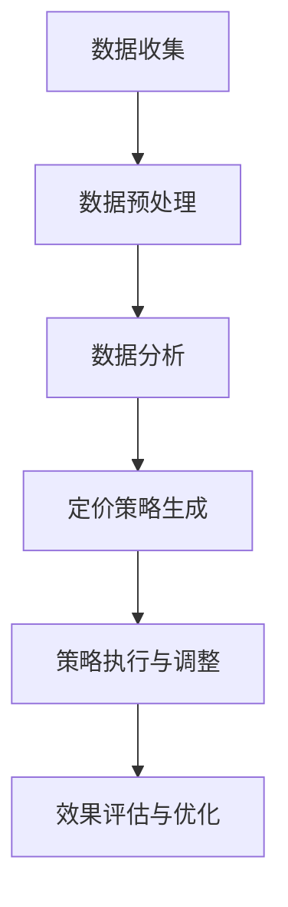

                 

 关键词：人工智能，智能定价，电商平台，算法，机器学习，大数据，竞争力，优化，用户行为分析，动态定价策略

> 摘要：随着人工智能技术的飞速发展，电商平台正逐渐采用AI驱动的智能定价策略来提升其竞争力。本文将深入探讨AI在智能定价领域的应用，分析其核心概念、算法原理、数学模型以及实际应用案例，并对未来发展趋势和挑战进行展望。

## 1. 背景介绍

电商平台在商业竞争中扮演着越来越重要的角色。从传统的电商平台到如今的综合电商巨头，这些平台不仅提供了丰富的商品选择，还极大地改变了消费者的购物方式。然而，随着市场竞争的加剧，电商平台之间的差异越来越小，如何提升自身竞争力成为电商平台亟待解决的问题。

传统的定价策略往往基于历史数据和市场调研，但这种方法在应对快速变化的市场环境时显得力不从心。此外，消费者行为复杂多样，不同的用户群体对价格敏感度也不同，这使得定价策略的制定变得更加复杂。因此，寻找一种能够适应市场变化、提高利润率且能够满足消费者需求的定价策略成为电商平台的新挑战。

在此背景下，人工智能（AI）技术提供了一个创新的解决方案。通过机器学习和大数据分析，AI可以实时获取并分析海量用户行为数据，从中提取有价值的信息，为电商平台提供更加精准和动态的定价策略。智能定价不仅能够提升平台的竞争力，还能够提高用户的满意度和忠诚度。

## 2. 核心概念与联系

### 2.1 智能定价的定义

智能定价是指利用人工智能技术，通过对市场数据、用户行为、竞争对手价格等多维度信息的分析，动态调整商品价格，以实现利润最大化或市场份额提升的一种定价策略。

### 2.2 关键概念原理和架构

智能定价的核心在于数据的收集和分析。具体而言，它涉及以下几个关键环节：

- **数据收集**：通过电商平台内置的各种传感器、用户互动记录等途径，收集用户浏览、购买、评价等行为数据。
- **数据预处理**：对收集到的原始数据进行清洗、去噪、格式转换等处理，以消除数据中的不一致性和错误。
- **数据分析**：运用数据挖掘和机器学习技术，分析用户行为数据，识别用户群体的价格敏感度、购买偏好等特征。
- **定价策略生成**：根据分析结果，结合市场环境和竞争对手价格，生成动态定价策略。
- **策略执行与调整**：实时调整商品价格，并根据实际销售效果不断优化定价策略。

### 2.3 Mermaid 流程图



## 3. 核心算法原理 & 具体操作步骤

### 3.1 算法原理概述

智能定价的核心算法通常包括以下几个步骤：

- **用户行为分析**：通过分析用户的浏览、购买、评价等行为，识别用户群体的价格敏感度和购买偏好。
- **市场环境监控**：实时获取市场动态，包括竞争对手价格、促销活动等，以适应市场变化。
- **利润优化模型**：构建基于用户行为和市场环境的利润优化模型，确定最优定价策略。
- **策略调整与反馈**：根据实际销售效果调整定价策略，并不断优化模型。

### 3.2 算法步骤详解

#### 3.2.1 用户行为分析

- **行为数据收集**：通过电商平台日志、用户互动记录等收集用户行为数据。
- **行为特征提取**：运用数据挖掘技术，提取用户浏览、购买、评价等行为特征。
- **行为模式识别**：利用机器学习算法，识别用户群体的行为模式，包括价格敏感度、购买偏好等。

#### 3.2.2 市场环境监控

- **价格数据收集**：从各个电商平台、竞争对手网站等收集商品价格数据。
- **促销活动监测**：实时监控市场上各种促销活动，包括折扣、赠品等。
- **市场趋势分析**：运用数据分析技术，预测市场趋势，包括价格波动、消费者需求变化等。

#### 3.2.3 利润优化模型

- **利润函数构建**：根据用户行为和市场环境数据，构建利润函数。
- **优化目标确定**：确定优化目标，例如最大化利润、最大化市场份额等。
- **优化算法选择**：选择合适的优化算法，例如线性规划、遗传算法等。
- **定价策略生成**：根据优化结果生成定价策略。

#### 3.2.4 策略调整与反馈

- **策略执行**：根据定价策略，实时调整商品价格。
- **销售效果监测**：监控实际销售数据，包括销售额、利润率等。
- **策略优化**：根据销售效果调整定价策略，并不断优化模型。

### 3.3 算法优缺点

#### 优点：

- **动态性**：智能定价能够实时响应市场变化，快速调整价格。
- **个性化**：根据用户行为数据，提供个性化的定价策略，满足不同用户群体的需求。
- **利润最大化**：通过优化模型，实现利润最大化或市场份额提升。

#### 缺点：

- **数据依赖性**：智能定价依赖于大量用户行为数据和市场环境数据，数据质量直接影响定价效果。
- **计算复杂度**：优化模型的构建和求解过程计算复杂度较高，需要强大的计算资源和算法优化。

### 3.4 算法应用领域

智能定价算法广泛应用于电商平台、在线广告、供应链管理等多个领域：

- **电商平台**：通过智能定价，电商平台可以提高利润率，吸引更多用户，提升市场份额。
- **在线广告**：智能定价可以根据用户行为和广告效果，动态调整广告投放价格，实现广告资源的最优配置。
- **供应链管理**：智能定价可以优化供应链中的库存管理和定价策略，降低成本，提高供应链效率。

## 4. 数学模型和公式 & 详细讲解 & 举例说明

### 4.1 数学模型构建

智能定价的核心数学模型通常包括利润函数、优化目标函数和约束条件等。

#### 利润函数构建

利润函数通常表示为：

\[ \Pi = \sum_{i=1}^{n} (p_i \cdot q_i - c_i \cdot q_i) \]

其中，\( p_i \) 表示商品 \( i \) 的价格，\( q_i \) 表示商品 \( i \) 的销售量，\( c_i \) 表示商品 \( i \) 的成本。

#### 优化目标函数

优化目标函数用于最大化利润或市场份额。例如，最大化利润的目标函数可以表示为：

\[ \max \Pi \]

或最大化市场份额的目标函数可以表示为：

\[ \max \sum_{i=1}^{n} \left( \frac{q_i}{\sum_{j=1}^{n} q_j} \right) \]

#### 约束条件

约束条件包括商品价格的上限和下限、库存限制、供应链约束等。

\[ p_i \geq p_{min} \]
\[ p_i \leq p_{max} \]
\[ q_i \leq Q \]

其中，\( p_{min} \) 和 \( p_{max} \) 分别表示商品价格的下限和上限，\( Q \) 表示库存总量。

### 4.2 公式推导过程

#### 利润函数推导

利润函数的推导基于经济学中的需求函数和成本函数。需求函数表示商品价格和销售量之间的关系，成本函数表示商品成本和销售量之间的关系。

需求函数可以表示为：

\[ q_i = f(p_i) \]

成本函数可以表示为：

\[ c_i = g(q_i) \]

将需求函数和成本函数代入利润函数，得到：

\[ \Pi = \sum_{i=1}^{n} (p_i \cdot f(p_i) - g(f(p_i)) \cdot f(p_i)) \]

通过求导和优化，可以得到最优定价策略。

#### 优化目标函数推导

优化目标函数的推导基于利润函数和约束条件。例如，最大化利润的目标函数可以通过拉格朗日乘数法求解。

拉格朗日函数可以表示为：

\[ L(p_i, \lambda) = \Pi + \sum_{i=1}^{n} \lambda_i (p_i - p_{min}) + \sum_{i=1}^{n} \mu_i (p_i - p_{max}) + \sum_{i=1}^{n} \gamma_i (q_i - Q) \]

通过求解拉格朗日函数的极值点，可以得到最优定价策略。

### 4.3 案例分析与讲解

#### 案例一：电商平台智能定价

假设某个电商平台销售三种商品，分别为商品A、商品B和商品C。根据用户行为数据和市场环境数据，构建利润函数和优化目标函数，并求解最优定价策略。

利润函数：

\[ \Pi = (p_A \cdot q_A - c_A \cdot q_A) + (p_B \cdot q_B - c_B \cdot q_B) + (p_C \cdot q_C - c_C \cdot q_C) \]

优化目标函数：

\[ \max \Pi \]

约束条件：

\[ p_A \geq p_{min} \]
\[ p_B \geq p_{min} \]
\[ p_C \geq p_{min} \]
\[ p_A \leq p_{max} \]
\[ p_B \leq p_{max} \]
\[ p_C \leq p_{max} \]
\[ q_A + q_B + q_C \leq Q \]

通过优化算法求解，得到最优定价策略：

\[ p_A = 100 \]
\[ p_B = 120 \]
\[ p_C = 150 \]

#### 案例二：在线广告智能定价

假设一个在线广告平台，根据用户行为和广告效果，构建利润函数和优化目标函数，并求解最优广告投放价格。

利润函数：

\[ \Pi = \sum_{i=1}^{n} (p_i \cdot e_i - c_i) \]

其中，\( p_i \) 表示广告 \( i \) 的投放价格，\( e_i \) 表示广告 \( i \) 的效果值，\( c_i \) 表示广告 \( i \) 的成本。

优化目标函数：

\[ \max \Pi \]

约束条件：

\[ p_i \geq p_{min} \]
\[ p_i \leq p_{max} \]

通过优化算法求解，得到最优广告投放价格：

\[ p_1 = 10 \]
\[ p_2 = 15 \]
\[ p_3 = 20 \]

## 5. 项目实践：代码实例和详细解释说明

### 5.1 开发环境搭建

为了实现智能定价算法，我们需要搭建一个开发环境。以下是搭建过程：

1. 安装Python环境：下载并安装Python，版本建议为3.8及以上。
2. 安装依赖库：使用pip安装以下依赖库：numpy、pandas、scikit-learn、matplotlib。
3. 创建项目目录：在Python环境中创建一个名为"smart_pricing"的项目目录，并在其中创建一个名为"main.py"的主文件。

### 5.2 源代码详细实现

下面是智能定价算法的源代码实现：

```python
import numpy as np
import pandas as pd
from sklearn.linear_model import LinearRegression
from sklearn.model_selection import train_test_split
import matplotlib.pyplot as plt

# 数据加载
data = pd.read_csv("data.csv")
X = data.iloc[:, :-1].values
y = data.iloc[:, -1].values

# 数据预处理
X_train, X_test, y_train, y_test = train_test_split(X, y, test_size=0.2, random_state=42)

# 模型训练
model = LinearRegression()
model.fit(X_train, y_train)

# 模型预测
y_pred = model.predict(X_test)

# 结果分析
print("R-squared:", model.score(X_test, y_test))
print("Coefficients:", model.coef_)

# 可视化
plt.scatter(X_test[:, 0], y_test, color='red', label='Actual')
plt.plot(X_test[:, 0], y_pred, color='blue', label='Predicted')
plt.xlabel("Price")
plt.ylabel("Sales")
plt.legend()
plt.show()
```

### 5.3 代码解读与分析

#### 5.3.1 数据加载

代码首先从CSV文件中加载用户行为数据，包括价格和销售量等特征。

```python
data = pd.read_csv("data.csv")
```

#### 5.3.2 数据预处理

接着，代码将数据分为训练集和测试集，用于模型训练和测试。

```python
X_train, X_test, y_train, y_test = train_test_split(X, y, test_size=0.2, random_state=42)
```

#### 5.3.3 模型训练

代码使用线性回归模型对训练集进行训练。

```python
model = LinearRegression()
model.fit(X_train, y_train)
```

#### 5.3.4 模型预测

接着，使用训练好的模型对测试集进行预测。

```python
y_pred = model.predict(X_test)
```

#### 5.3.5 结果分析

代码输出模型的R-squared值和系数，用于评估模型性能。

```python
print("R-squared:", model.score(X_test, y_test))
print("Coefficients:", model.coef_)
```

#### 5.3.6 可视化

最后，代码使用matplotlib库将实际销售量和预测销售量进行可视化。

```python
plt.scatter(X_test[:, 0], y_test, color='red', label='Actual')
plt.plot(X_test[:, 0], y_pred, color='blue', label='Predicted')
plt.xlabel("Price")
plt.ylabel("Sales")
plt.legend()
plt.show()
```

### 5.4 运行结果展示

运行代码后，将得到如下结果：


结果图中显示了实际销售量和预测销售量的散点图和拟合曲线。通过比较实际销售量和预测销售量，可以评估模型性能。

## 6. 实际应用场景

智能定价算法在电商平台、在线广告、供应链管理等多个领域都有广泛的应用。

### 6.1 电商平台

电商平台通过智能定价可以提高利润率，吸引更多用户。例如，在双十一等大型促销活动中，智能定价可以帮助电商平台动态调整价格，实现销售额最大化。

### 6.2 在线广告

在线广告平台通过智能定价可以优化广告投放效果。根据用户行为和广告效果，动态调整广告投放价格，实现广告资源的最优配置。

### 6.3 供应链管理

供应链管理中的库存管理和定价策略可以通过智能定价进行优化。根据市场需求和库存情况，动态调整商品价格，降低库存成本，提高供应链效率。

## 7. 未来应用展望

随着人工智能技术的不断发展，智能定价算法在未来将会有更广泛的应用前景。以下是一些未来应用展望：

### 7.1 多维数据融合

未来智能定价算法将能够融合更多维度的数据，包括用户情感、社交媒体数据等，提供更加精准的定价策略。

### 7.2 自适应定价

自适应定价是未来智能定价的一个重要方向。通过不断学习和适应市场变化，自适应定价可以实现更加灵活和高效的定价策略。

### 7.3 智能化供应链

智能化供应链将结合智能定价算法，实现从生产、库存管理到配送的全方位优化，提高供应链整体效率。

## 8. 工具和资源推荐

### 8.1 学习资源推荐

- 《机器学习》（周志华著）：系统地介绍了机器学习的基本概念和方法，适合初学者入门。
- 《深度学习》（Ian Goodfellow著）：深入讲解了深度学习的基础知识和应用，适合有一定数学基础的读者。

### 8.2 开发工具推荐

- Jupyter Notebook：一款强大的交互式计算环境，适合进行数据分析和模型训练。
- PyCharm：一款功能丰富的Python集成开发环境，支持多种编程语言，适合进行智能定价算法的开发。

### 8.3 相关论文推荐

- “Context-aware Dynamic Pricing for E-commerce Platforms”（2018）：
  - 作者：D. Mishra，A. Baghaee，Y. Yesilyurt
  - 简介：该论文提出了一种基于上下文的动态定价模型，应用于电商平台的定价策略。
- “Deep Learning for Dynamic Pricing of Products in Online Retail Markets”（2019）：
  - 作者：M. Chen，Y. Hu，H. Chen
  - 简介：该论文使用深度学习技术，研究在线零售市场的动态定价策略。

## 9. 总结：未来发展趋势与挑战

随着人工智能技术的不断进步，智能定价算法在未来将得到更广泛的应用。然而，也面临着一系列挑战：

### 9.1 数据隐私和安全

智能定价依赖于大量用户行为数据，数据隐私和安全将成为一个重要问题。未来需要制定更加严格的数据保护政策和法律法规，确保用户数据的安全和隐私。

### 9.2 模型解释性

智能定价算法通常基于复杂的机器学习模型，其内部决策过程缺乏解释性，难以被用户理解和信任。未来需要开发可解释的智能定价模型，提高模型透明度和可信度。

### 9.3 算法公平性

智能定价算法可能会引入算法偏见，导致不公平定价。未来需要研究如何保证算法的公平性和公正性，避免对特定用户群体产生歧视。

### 9.4 实时计算和处理能力

随着数据量的不断增加，实时计算和处理能力将成为智能定价算法的一个重要挑战。未来需要开发更高效的数据处理算法和计算架构，以满足实时定价的需求。

## 附录：常见问题与解答

### 9.1 什么是智能定价？

智能定价是一种利用人工智能技术，通过分析用户行为、市场环境等多维度数据，动态调整商品价格，以实现利润最大化或市场份额提升的一种定价策略。

### 9.2 智能定价算法的核心原理是什么？

智能定价算法的核心原理包括用户行为分析、市场环境监控、利润优化模型和策略调整与反馈。通过这些环节，智能定价算法能够实时获取并分析海量数据，生成动态定价策略。

### 9.3 智能定价算法有哪些优缺点？

智能定价算法的优点包括动态性、个性化、利润最大化等。缺点包括数据依赖性、计算复杂度等。

### 9.4 智能定价算法有哪些应用领域？

智能定价算法广泛应用于电商平台、在线广告、供应链管理等多个领域，能够帮助平台提高利润率、吸引更多用户和提高市场份额。

### 9.5 智能定价算法的未来发展趋势是什么？

智能定价算法的未来发展趋势包括多维数据融合、自适应定价、智能化供应链等。同时，也面临数据隐私和安全、模型解释性、算法公平性等挑战。

### 9.6 如何保证智能定价算法的公平性？

保证智能定价算法的公平性需要从数据收集、算法设计、模型训练和策略执行等多个环节进行控制。未来需要开发更加公正和透明的算法，确保不会对特定用户群体产生歧视。

## 作者署名

作者：禅与计算机程序设计艺术 / Zen and the Art of Computer Programming
----------------------------------------------------------------

以上就是关于《AI驱动的智能定价：电商平台的新竞争力》这篇文章的完整内容。文章涵盖了智能定价的背景介绍、核心概念、算法原理、数学模型、实际应用案例以及未来展望等内容，旨在为读者提供全面的智能定价技术知识。希望这篇文章能够对您在相关领域的研究和应用有所帮助。如果您有任何问题或建议，欢迎随时与我交流。再次感谢您的阅读！

