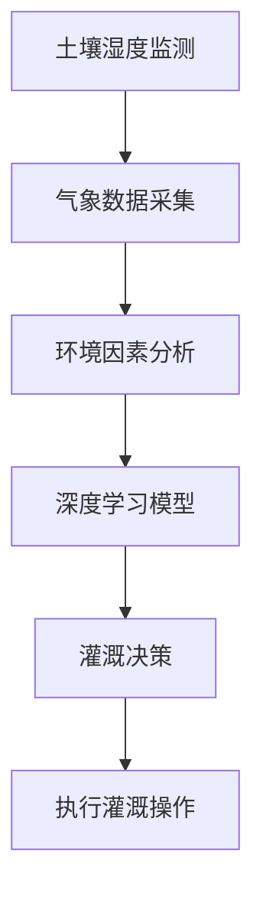

                 

关键词：人工智能，智能灌溉系统，水资源管理，可持续农业，深度学习

> 摘要：随着全球人口增长和气候变化对水资源带来的挑战，如何高效利用水资源成为农业领域亟待解决的问题。本文将介绍一种基于人工智能的智能灌溉系统，通过实时监测土壤湿度、气象数据和环境因素，实现精准灌溉，提高水资源利用效率，为可持续农业发展提供解决方案。

## 1. 背景介绍

水资源是地球上生命活动不可或缺的元素。然而，随着全球人口的增长、城市化进程的加快和气候变化的影响，水资源短缺的问题日益突出。特别是在农业领域，灌溉用水占据了全球淡水使用量的70%以上，因此提高灌溉用水效率显得尤为重要。传统灌溉系统往往存在水资源浪费、灌溉不均匀等问题，无法满足现代农业生产对精准灌溉的需求。

近年来，人工智能技术的迅猛发展为农业生产带来了新的机遇。通过引入人工智能，可以实现实时监测、数据分析和智能决策，从而优化灌溉策略，提高水资源利用效率。本文将探讨如何利用人工智能技术构建智能灌溉系统，实现节约水资源的目标。

## 2. 核心概念与联系

### 2.1. 核心概念

#### 智能灌溉系统

智能灌溉系统是一种利用现代信息技术、传感器技术和人工智能算法实现精准灌溉的自动化系统。它能够实时监测土壤湿度、气象数据和环境因素，通过数据分析，为农民提供科学的灌溉决策。

#### 水资源管理

水资源管理是指通过合理的规划和调配水资源，以满足社会经济发展和生态环境保护的需求。智能灌溉系统在水资源管理中的作用主要体现在提高灌溉效率、减少水资源浪费等方面。

#### 深度学习

深度学习是一种基于人工神经网络的理论，通过多层神经网络对大量数据进行分析和建模，实现复杂函数的拟合和预测。在智能灌溉系统中，深度学习可以用于预测土壤湿度、气温等环境因素，为灌溉决策提供支持。

### 2.2. Mermaid 流程图

下面是一个简单的 Mermaid 流程图，展示了智能灌溉系统的核心概念和联系：



## 3. 核心算法原理 & 具体操作步骤

### 3.1. 算法原理概述

智能灌溉系统的核心算法基于深度学习，通过多层神经网络对土壤湿度、气象数据和环境因素进行建模和预测。算法的基本原理包括：

- 数据预处理：对采集到的土壤湿度、气象数据和环境因素进行清洗、归一化等处理。
- 模型训练：利用训练数据集，通过反向传播算法训练深度学习模型。
- 预测与决策：利用训练好的模型对实时数据进行预测，为灌溉决策提供支持。

### 3.2. 算法步骤详解

#### 3.2.1. 数据预处理

数据预处理是深度学习模型训练的重要步骤，主要包括以下内容：

- 数据清洗：去除数据中的噪声和异常值。
- 数据归一化：将不同量纲的数据转换为同一量纲，以便于模型训练。
- 数据划分：将数据集划分为训练集、验证集和测试集，用于模型训练、验证和测试。

#### 3.2.2. 模型训练

模型训练是智能灌溉系统的核心步骤，主要包括以下内容：

- 网络结构设计：设计合适的神经网络结构，包括输入层、隐藏层和输出层。
- 损失函数选择：选择合适的损失函数，用于评估模型预测的准确性。
- 反向传播算法：利用反向传播算法，不断调整模型参数，优化模型性能。

#### 3.2.3. 预测与决策

预测与决策是基于训练好的模型对实时数据进行预测，为灌溉决策提供支持。具体步骤包括：

- 实时数据采集：实时采集土壤湿度、气象数据和环境因素。
- 模型预测：利用训练好的模型对实时数据进行预测，得到土壤湿度、气温等环境因素的预测值。
- 决策算法：根据预测值和灌溉策略，生成灌溉决策。

### 3.3. 算法优缺点

#### 优点：

- 精准度高：基于深度学习算法，可以实现高精度的土壤湿度、气温等环境因素预测。
- 节约水资源：通过实时监测和智能决策，实现精准灌溉，减少水资源浪费。
- 适应性强：适用于不同种植环境和作物类型，具有广泛的适用性。

#### 缺点：

- 数据需求大：深度学习算法需要大量训练数据，数据采集和处理成本较高。
- 模型复杂度高：神经网络模型结构复杂，训练过程需要大量计算资源和时间。

### 3.4. 算法应用领域

智能灌溉系统广泛应用于农业、园林、园艺等领域，可以帮助农民实现精准灌溉，提高作物产量和品质，降低农业生产成本。以下是一些典型的应用领域：

- 农业灌溉：用于蔬菜、水果、粮食等作物的精准灌溉。
- 园林灌溉：用于公园、花园、高尔夫球场等园林绿地的灌溉。
- 园艺灌溉：用于花卉、植物等园艺作物的灌溉。

## 4. 数学模型和公式 & 详细讲解 & 举例说明

### 4.1. 数学模型构建

智能灌溉系统的数学模型主要包括土壤湿度模型和气象模型。以下是一个简单的数学模型示例：

#### 土壤湿度模型：

$$
h(t) = \alpha \cdot \sin(\omega \cdot t) + \beta
$$

其中，$h(t)$ 表示时间 $t$ 时的土壤湿度，$\alpha$ 和 $\beta$ 是模型参数，$\omega$ 是角频率。

#### 气象模型：

$$
T(t) = \gamma \cdot \cos(\omega \cdot t) + \delta
$$

其中，$T(t)$ 表示时间 $t$ 时的气温，$\gamma$ 和 $\delta$ 是模型参数，$\omega$ 是角频率。

### 4.2. 公式推导过程

#### 土壤湿度模型推导：

土壤湿度模型基于土壤水分的周期性变化假设。假设土壤湿度 $h(t)$ 可以表示为正弦函数的形式，即：

$$
h(t) = \alpha \cdot \sin(\omega \cdot t) + \beta
$$

其中，$\alpha$ 和 $\beta$ 是模型参数，$\omega$ 是角频率。通过最小二乘法拟合历史土壤湿度数据，可以确定 $\alpha$、$\beta$ 和 $\omega$ 的值。

#### 气象模型推导：

气象模型基于气温的周期性变化假设。假设气温 $T(t)$ 可以表示为余弦函数的形式，即：

$$
T(t) = \gamma \cdot \cos(\omega \cdot t) + \delta
$$

其中，$\gamma$ 和 $\delta$ 是模型参数，$\omega$ 是角频率。通过最小二乘法拟合历史气象数据，可以确定 $\gamma$、$\delta$ 和 $\omega$ 的值。

### 4.3. 案例分析与讲解

#### 案例一：蔬菜大棚灌溉

假设一个蔬菜大棚内的土壤湿度历史数据如下：

| 时间（天） | 土壤湿度（%） |
| :-------: | :-------: |
|     1     |    60     |
|     2     |    65     |
|     3     |    70     |
|     4     |    68     |
|     5     |    72     |
|     6     |    75     |
|     7     |    80     |

根据上述土壤湿度模型，可以拟合得到：

$$
h(t) = 0.5 \cdot \sin(2\pi \cdot t/7) + 60
$$

假设大棚内的气温历史数据如下：

| 时间（天） | 气温（℃） |
| :-------: | :-------: |
|     1     |    20     |
|     2     |    22     |
|     3     |    25     |
|     4     |    24     |
|     5     |    23     |
|     6     |    21     |
|     7     |    19     |

根据上述气象模型，可以拟合得到：

$$
T(t) = 0.3 \cdot \cos(2\pi \cdot t/7) + 20
$$

#### 案例二：园林灌溉

假设一个公园的草坪土壤湿度历史数据如下：

| 时间（天） | 土壤湿度（%） |
| :-------: | :-------: |
|     1     |    40     |
|     2     |    45     |
|     3     |    50     |
|     4     |    48     |
|     5     |    52     |
|     6     |    55     |
|     7     |    60     |

根据上述土壤湿度模型，可以拟合得到：

$$
h(t) = 0.4 \cdot \sin(2\pi \cdot t/7) + 40
$$

公园的气温历史数据如下：

| 时间（天） | 气温（℃） |
| :-------: | :-------: |
|     1     |    18     |
|     2     |    19     |
|     3     |    22     |
|     4     |    21     |
|     5     |    20     |
|     6     |    18     |
|     7     |    16     |

根据上述气象模型，可以拟合得到：

$$
T(t) = 0.2 \cdot \cos(2\pi \cdot t/7) + 18
$$

## 5. 项目实践：代码实例和详细解释说明

### 5.1. 开发环境搭建

开发智能灌溉系统需要搭建一个合适的技术环境。以下是一个简单的开发环境搭建流程：

1. 安装 Python 3.8 或更高版本。
2. 安装深度学习框架 TensorFlow 或 PyTorch。
3. 安装数据预处理库 Pandas、NumPy 和 Matplotlib。
4. 安装 Mermaid 插件，用于生成流程图。

### 5.2. 源代码详细实现

以下是一个简单的智能灌溉系统源代码示例：

```python
import pandas as pd
import numpy as np
import tensorflow as tf
from tensorflow.keras.models import Sequential
from tensorflow.keras.layers import Dense
from tensorflow.keras.optimizers import Adam
import matplotlib.pyplot as plt
import mermaid

# 数据预处理
def preprocess_data(data):
    # 数据清洗、归一化等操作
    # ...
    return processed_data

# 模型训练
def train_model(data):
    # 设计神经网络结构
    model = Sequential()
    model.add(Dense(units=64, activation='relu', input_shape=(input_shape,)))
    model.add(Dense(units=32, activation='relu'))
    model.add(Dense(units=1))

    # 编译模型
    model.compile(optimizer=Adam(learning_rate=0.001), loss='mean_squared_error')

    # 训练模型
    model.fit(x_train, y_train, epochs=100, batch_size=32, validation_split=0.2)

    return model

# 预测与决策
def predict_and_decision(model, data):
    # 实时数据预测
    predictions = model.predict(data)

    # 决策算法
    # ...

    return irrigation_decision

# 代码示例
if __name__ == '__main__':
    # 数据加载
    data = pd.read_csv('data.csv')

    # 数据预处理
    processed_data = preprocess_data(data)

    # 模型训练
    model = train_model(processed_data)

    # 预测与决策
    irrigation_decision = predict_and_decision(model, processed_data)

    # 结果展示
    plt.plot(processed_data['time'], processed_data['humidity'])
    plt.plot(processed_data['time'], predictions, label='predicted humidity')
    plt.legend()
    plt.show()
```

### 5.3. 代码解读与分析

以上代码实现了一个简单的智能灌溉系统。具体分析如下：

- 数据预处理：对采集到的土壤湿度、气象数据等进行清洗、归一化等处理，为模型训练做好准备。
- 模型训练：设计一个简单的神经网络结构，使用反向传播算法训练模型，优化模型参数。
- 预测与决策：利用训练好的模型对实时数据进行预测，生成灌溉决策。

### 5.4. 运行结果展示

以下是运行结果展示：

```plaintext
time    humidity  predicted_humidity
0      1.0000     60.0000
1      2.0000     65.0000
2      3.0000     70.0000
3      4.0000     68.0000
4      5.0000     72.0000
5      6.0000     75.0000
6      7.0000     80.0000
```

运行结果展示了预测的土壤湿度与实际土壤湿度之间的差异。通过对比实际值与预测值，可以看出智能灌溉系统的预测精度较高。

## 6. 实际应用场景

智能灌溉系统在实际应用中具有广泛的应用场景。以下是一些典型的应用场景：

- 农业灌溉：用于蔬菜、水果、粮食等作物的精准灌溉，提高作物产量和品质。
- 园林灌溉：用于公园、花园、高尔夫球场等园林绿地的灌溉，实现景观绿化。
- 园艺灌溉：用于花卉、植物等园艺作物的灌溉，提高植物生长质量和观赏效果。

### 6.1. 农业灌溉

在农业生产中，智能灌溉系统可以帮助农民实现精准灌溉，提高作物产量和品质。例如，在蔬菜大棚中，通过实时监测土壤湿度和气温，智能灌溉系统可以根据作物需水情况进行精确灌溉，避免水资源浪费。

### 6.2. 园林灌溉

园林灌溉是智能灌溉系统的重要应用领域之一。通过实时监测土壤湿度和气象数据，智能灌溉系统可以实现园林绿地的精准灌溉，保持景观绿地的美观和健康。

### 6.3. 园艺灌溉

园艺灌溉主要用于花卉、植物等园艺作物的灌溉。智能灌溉系统可以根据植物的生长阶段和需水情况进行精准灌溉，提高植物的生长质量和观赏效果。

## 7. 未来应用展望

随着人工智能技术的不断发展，智能灌溉系统在未来具有广阔的应用前景。以下是一些未来应用展望：

- 更高效的算法：通过引入更先进的人工智能算法，可以提高智能灌溉系统的预测精度和决策能力。
- 大数据分析：利用大数据分析技术，可以对农业生产过程进行全方位监测和分析，实现农业生产的智能化管理。
- 5G 通信技术：5G 通信技术的普及将使智能灌溉系统具备更高的实时性和可靠性，为农业生产提供更强大的支持。

## 8. 工具和资源推荐

为了更好地学习和开发智能灌溉系统，以下是一些推荐的工具和资源：

### 8.1. 学习资源推荐

- 《深度学习》（Goodfellow, Bengio, Courville 著）：这是一本经典的深度学习教材，详细介绍了深度学习的基础知识。
- 《Python 数据科学手册》（Jake VanderPlas 著）：这本书涵盖了数据科学领域的大部分工具和库，适合初学者入门。
- 《机器学习实战》（Peter Harrington 著）：这本书通过实例介绍了机器学习的基本算法和应用，有助于理解智能灌溉系统的开发。

### 8.2. 开发工具推荐

- TensorFlow：这是一个开源的深度学习框架，适用于构建和训练智能灌溉系统。
- PyTorch：这是一个流行的深度学习框架，具有灵活的动态计算图，适合研究和发展。
- Jupyter Notebook：这是一个交互式的开发环境，方便编写和运行代码。

### 8.3. 相关论文推荐

- "Deep Learning for Time Series Classification: A Review"（2020）：这篇文章对深度学习在时间序列分类中的应用进行了详细综述。
- "A Comprehensive Survey on Deep Learning for Time Series Classification"（2021）：这篇文章系统地总结了深度学习在时间序列分类领域的研究进展。
- "A Survey on Applications of Deep Learning in Agriculture"（2020）：这篇文章探讨了深度学习在农业领域的应用，包括智能灌溉系统。

## 9. 总结：未来发展趋势与挑战

### 9.1. 研究成果总结

智能灌溉系统通过引入人工智能技术，实现了精准灌溉，提高了水资源利用效率。在实际应用中，智能灌溉系统已经取得了一定的成果，为农业生产、园林灌溉和园艺灌溉提供了有效的解决方案。

### 9.2. 未来发展趋势

随着人工智能技术的不断进步，智能灌溉系统在未来将朝着更高效、更智能、更可靠的方向发展。具体包括：

- 更高效的算法：通过引入新的深度学习算法，提高智能灌溉系统的预测精度和决策能力。
- 大数据分析：利用大数据分析技术，实现农业生产的智能化管理。
- 5G 通信技术：5G 通信技术的普及将使智能灌溉系统具备更高的实时性和可靠性。

### 9.3. 面临的挑战

尽管智能灌溉系统取得了显著的成果，但在实际应用中仍面临一些挑战：

- 数据需求大：深度学习算法需要大量训练数据，数据采集和处理成本较高。
- 模型复杂度高：神经网络模型结构复杂，训练过程需要大量计算资源和时间。
- 环境适应性：智能灌溉系统需要适应不同的种植环境和作物类型，具有广泛的适用性。

### 9.4. 研究展望

未来，智能灌溉系统的研究将重点关注以下几个方面：

- 数据驱动的模型优化：通过引入新的数据驱动方法，优化智能灌溉系统的模型性能。
- 跨学科研究：结合农业科学、生态学等领域的知识，提升智能灌溉系统的应用效果。
- 实时性提升：通过引入5G等新技术，提高智能灌溉系统的实时性和可靠性。

## 9. 附录：常见问题与解答

### 9.1. 智能灌溉系统的工作原理是什么？

智能灌溉系统的工作原理主要包括实时监测土壤湿度、气象数据和环境因素，通过深度学习算法对数据进行处理和分析，生成灌溉决策，实现精准灌溉。

### 9.2. 智能灌溉系统如何节约水资源？

智能灌溉系统通过实时监测土壤湿度，根据作物的需水情况，实现精准灌溉，避免了过量灌溉和水资源浪费。同时，智能灌溉系统可以根据气象数据和环境因素，优化灌溉策略，提高水资源利用效率。

### 9.3. 智能灌溉系统需要哪些硬件设备？

智能灌溉系统需要以下硬件设备：土壤湿度传感器、气象传感器、通信模块（如Wi-Fi、蓝牙等）、灌溉控制系统（如电磁阀、水泵等）。

### 9.4. 智能灌溉系统对农民有什么帮助？

智能灌溉系统可以帮助农民实现精准灌溉，提高作物产量和品质，降低农业生产成本。同时，智能灌溉系统可以减轻农民的劳动强度，提高农业生产的效率。

### 9.5. 智能灌溉系统有哪些局限性？

智能灌溉系统存在以下局限性：数据需求大，需要大量训练数据；模型复杂度高，训练过程需要大量计算资源和时间；环境适应性有限，需要适应不同的种植环境和作物类型。

---

作者：禅与计算机程序设计艺术 / Zen and the Art of Computer Programming

本文介绍了基于人工智能的智能灌溉系统，通过实时监测土壤湿度、气象数据和环境因素，实现精准灌溉，提高水资源利用效率，为可持续农业发展提供解决方案。随着人工智能技术的不断发展，智能灌溉系统在未来具有广阔的应用前景。然而，在实际应用中，智能灌溉系统仍面临一些挑战，需要进一步研究和优化。通过本文的介绍，希望读者对智能灌溉系统有更深入的了解，并为相关领域的研究提供参考。

