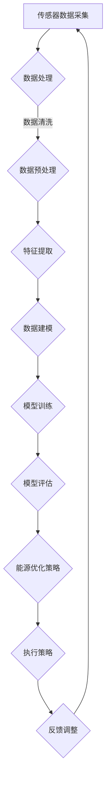

                 

关键词：AI、智能能源管理、能源优化、算法、数学模型、项目实践、实际应用场景、工具和资源推荐、未来发展趋势与挑战。

## 摘要

本文探讨了AI技术在智能能源管理领域的应用，旨在通过优化能源使用来提高能源效率、减少浪费和降低成本。文章首先介绍了智能能源管理的背景和核心概念，然后详细阐述了AI驱动的能源管理算法原理、数学模型以及具体的操作步骤。接着，文章通过一个实际项目实践，展示了AI技术在智能能源管理中的应用效果。最后，文章讨论了智能能源管理的未来发展趋势与挑战，并推荐了相关学习资源和开发工具。

## 1. 背景介绍

随着全球能源消耗的不断增加和能源价格的波动，如何有效管理能源、提高能源利用效率已经成为各国政府和企业的紧迫任务。传统的能源管理方法通常依赖于人工经验和简单的规则，无法适应动态变化的能源需求和环境。而智能能源管理通过利用先进的信息技术、传感器技术和AI算法，实现了对能源的实时监测、分析和优化，从而大幅提高了能源利用效率。

智能能源管理的主要目标是：
- 提高能源利用效率：通过实时监测和分析能源使用情况，找出能源浪费的环节，并进行优化。
- 降低能源成本：通过优化能源使用，减少不必要的能源消耗，降低能源成本。
- 提高能源可靠性：通过智能预测和优化，确保能源供应的稳定性和可靠性。

智能能源管理的关键技术包括：
- 传感器技术：用于实时监测能源使用情况，获取各种能源参数。
- 数据分析技术：用于对采集到的数据进行分析和处理，提取有用的信息。
- AI算法：用于智能预测和优化，提高能源利用效率。

## 2. 核心概念与联系

### 2.1 AI算法原理

AI算法在智能能源管理中起到了至关重要的作用。常用的AI算法包括机器学习算法、深度学习算法和强化学习算法。

#### 机器学习算法

机器学习算法通过学习历史数据，自动识别数据中的模式，从而实现对未知数据的预测和分类。常见的机器学习算法有线性回归、逻辑回归、决策树、随机森林、支持向量机等。

#### 深度学习算法

深度学习算法是一种基于人工神经网络的机器学习算法，通过多层神经网络的训练，能够自动提取数据中的高级特征，实现对复杂问题的建模。常见的深度学习算法有卷积神经网络（CNN）、循环神经网络（RNN）和长短时记忆网络（LSTM）等。

#### 强化学习算法

强化学习算法是一种通过与环境交互来学习最优策略的算法。它通过不断尝试不同的行动，并根据行动的结果来调整策略，以最大化长期的奖励。常见的强化学习算法有Q学习、深度Q网络（DQN）和策略梯度算法等。

### 2.2 数学模型原理

在智能能源管理中，常用的数学模型包括线性规划模型、动态规划模型和仿真模型等。

#### 线性规划模型

线性规划模型是一种用于优化线性目标函数的数学模型。它通过确定决策变量的最优值，来实现目标函数的最大化或最小化。线性规划模型在能源管理中的应用主要包括能源分配、负载平衡和优化调度等。

#### 动态规划模型

动态规划模型是一种用于优化多阶段决策问题的数学模型。它通过将问题分解为多个子问题，并利用子问题的最优解来构建原问题的最优解。动态规划模型在能源管理中的应用主要包括能源储备、需求响应和电网优化等。

#### 仿真模型

仿真模型是一种通过模拟现实世界中的系统行为，来预测系统性能的数学模型。它通过建立系统的数学模型，并利用计算机模拟来验证和优化系统的性能。仿真模型在能源管理中的应用主要包括能源系统建模、优化和评估等。

### 2.3 Mermaid 流程图

以下是一个用于描述智能能源管理系统的Mermaid流程图：



## 3. 核心算法原理 & 具体操作步骤

### 3.1 算法原理概述

在智能能源管理中，常用的核心算法包括机器学习算法、深度学习算法和强化学习算法。这些算法通过学习历史数据，自动识别数据中的模式，从而实现对能源使用的预测和优化。

#### 机器学习算法

机器学习算法通过学习历史数据，建立数据与能源使用之间的关联模型，从而实现对未知数据的预测。具体步骤如下：

1. 数据采集：收集能源使用数据，包括电量、用水量、温度等。
2. 数据预处理：对采集到的数据进行清洗和预处理，包括去噪、归一化等。
3. 特征提取：从预处理后的数据中提取有用的特征，用于建模。
4. 数据建模：利用机器学习算法建立数据与能源使用之间的关联模型。
5. 模型训练：使用训练数据对模型进行训练，调整模型参数。
6. 模型评估：使用测试数据对模型进行评估，确定模型的预测能力。
7. 能源优化：利用训练好的模型预测未来的能源使用，并根据预测结果制定能源优化策略。

#### 深度学习算法

深度学习算法通过多层神经网络的训练，自动提取数据中的高级特征，实现对复杂问题的建模。具体步骤如下：

1. 数据采集：收集能源使用数据，包括电量、用水量、温度等。
2. 数据预处理：对采集到的数据进行清洗和预处理，包括去噪、归一化等。
3. 特征提取：从预处理后的数据中提取有用的特征，用于建模。
4. 网络构建：构建深度学习网络，包括输入层、隐藏层和输出层。
5. 模型训练：使用训练数据对模型进行训练，调整网络参数。
6. 模型评估：使用测试数据对模型进行评估，确定模型的预测能力。
7. 能源优化：利用训练好的模型预测未来的能源使用，并根据预测结果制定能源优化策略。

#### 强化学习算法

强化学习算法通过与环境交互来学习最优策略，从而实现对能源使用的优化。具体步骤如下：

1. 初始状态：系统处于初始状态。
2. 执行动作：根据当前状态，执行一个动作。
3. 观察结果：观察执行动作后的结果。
4. 收集奖励：根据结果，收集奖励信号。
5. 更新策略：根据收集的奖励信号，更新策略。
6. 进入下一状态：进入新的状态，重复执行动作、观察结果、收集奖励和更新策略。
7. 能源优化：利用训练好的策略，制定能源优化策略。

### 3.2 算法步骤详解

#### 3.2.1 机器学习算法步骤详解

1. 数据采集：收集能源使用数据，包括电量、用水量、温度等。
    - 使用传感器设备，实时采集能源使用数据。
    - 数据采集范围包括家庭、商业和工业等不同场景。
    - 数据采集频率根据应用场景和要求进行设置。

2. 数据预处理：
    - 数据清洗：去除异常数据和噪声数据，提高数据质量。
    - 数据归一化：将不同量纲的数据转换为相同的量纲，方便后续处理。
    - 数据划分：将数据集划分为训练集、验证集和测试集，用于模型训练和评估。

3. 特征提取：
    - 时间特征：提取数据的时间特征，如小时、日期、星期等。
    - 空间特征：提取数据的地理位置特征，如城市、区域等。
    - 相关特征：提取与能源使用相关的其他特征，如天气、温度等。

4. 数据建模：
    - 选择合适的机器学习算法，如线性回归、逻辑回归、决策树、随机森林等。
    - 利用训练数据，训练模型并调整模型参数。

5. 模型训练：
    - 使用训练数据，对模型进行训练。
    - 通过调整模型参数，使模型达到最优状态。

6. 模型评估：
    - 使用验证集，评估模型的预测能力。
    - 根据评估结果，调整模型参数，提高模型性能。

7. 能源优化：
    - 利用训练好的模型，预测未来的能源使用。
    - 根据预测结果，制定能源优化策略，如调整设备运行时间、优化能源分配等。

#### 3.2.2 深度学习算法步骤详解

1. 数据采集：
    - 收集能源使用数据，包括电量、用水量、温度等。
    - 数据采集范围包括家庭、商业和工业等不同场景。
    - 数据采集频率根据应用场景和要求进行设置。

2. 数据预处理：
    - 数据清洗：去除异常数据和噪声数据，提高数据质量。
    - 数据归一化：将不同量纲的数据转换为相同的量纲，方便后续处理。
    - 数据划分：将数据集划分为训练集、验证集和测试集，用于模型训练和评估。

3. 特征提取：
    - 时间特征：提取数据的时间特征，如小时、日期、星期等。
    - 空间特征：提取数据的地理位置特征，如城市、区域等。
    - 相关特征：提取与能源使用相关的其他特征，如天气、温度等。

4. 网络构建：
    - 设计合适的深度学习网络结构，包括输入层、隐藏层和输出层。
    - 选择合适的激活函数，如ReLU、Sigmoid、Tanh等。

5. 模型训练：
    - 使用训练数据，对模型进行训练。
    - 通过调整网络参数，使模型达到最优状态。

6. 模型评估：
    - 使用验证集，评估模型的预测能力。
    - 根据评估结果，调整网络参数，提高模型性能。

7. 能源优化：
    - 利用训练好的模型，预测未来的能源使用。
    - 根据预测结果，制定能源优化策略，如调整设备运行时间、优化能源分配等。

#### 3.2.3 强化学习算法步骤详解

1. 初始状态：
    - 初始化系统状态，如能源使用量、设备运行状态等。

2. 执行动作：
    - 根据当前状态，执行一个动作，如调整设备运行时间、优化能源分配等。

3. 观察结果：
    - 观察执行动作后的结果，如能源使用量、设备运行状态等。

4. 收集奖励：
    - 根据结果，收集奖励信号，如节约的能源量、设备运行成本等。

5. 更新策略：
    - 根据收集的奖励信号，更新策略，如调整设备运行时间、优化能源分配等。

6. 进入下一状态：
    - 进入新的状态，重复执行动作、观察结果、收集奖励和更新策略。

7. 能源优化：
    - 利用训练好的策略，制定能源优化策略。
    - 根据优化策略，调整设备运行时间、优化能源分配等。

### 3.3 算法优缺点

#### 3.3.1 机器学习算法

**优点**：
- 算法成熟，理论基础扎实。
- 适用范围广，可以处理各种类型的能源数据。
- 可以自动提取数据中的特征，减少人工干预。

**缺点**：
- 对数据质量要求较高，需要对数据进行预处理和清洗。
- 模型复杂度较高，训练时间较长。
- 模型泛化能力有限，可能无法很好地适应新的数据。

#### 3.3.2 深度学习算法

**优点**：
- 可以自动提取数据中的高级特征，减少人工干预。
- 模型复杂度较高，可以处理复杂的问题。
- 可以通过大量数据进行训练，提高模型性能。

**缺点**：
- 对数据质量要求较高，需要对数据进行预处理和清洗。
- 训练时间较长，对计算资源要求较高。
- 模型解释性较差，难以理解模型的决策过程。

#### 3.3.3 强化学习算法

**优点**：
- 可以通过不断尝试和调整策略，找到最优的能源优化方案。
- 可以适应动态变化的能源需求和环境。
- 可以自动调整策略，实现长期的能源优化。

**缺点**：
- 算法复杂度较高，训练时间较长。
- 对环境的要求较高，需要能够模拟真实环境。
- 模型解释性较差，难以理解模型的决策过程。

### 3.4 算法应用领域

机器学习算法、深度学习算法和强化学习算法在智能能源管理中都有广泛的应用。以下是一些具体的算法应用领域：

#### 3.4.1 电力系统

- 电力负荷预测：利用机器学习和深度学习算法，预测未来的电力负荷，为电网调度提供参考。
- 电力故障诊断：利用深度学习算法，对电力系统进行实时监测，及时发现故障并采取相应的措施。
- 电力需求响应：利用强化学习算法，制定电力需求响应策略，实现电力负荷的动态调整。

#### 3.4.2 城市供水系统

- 用水量预测：利用机器学习和深度学习算法，预测未来的用水量，为供水系统调度提供参考。
- 水资源管理：利用强化学习算法，制定水资源管理策略，实现水资源的优化配置。

#### 3.4.3 城市供暖系统

- 供暖需求预测：利用机器学习和深度学习算法，预测未来的供暖需求，为供暖系统调度提供参考。
- 能源优化：利用强化学习算法，制定能源优化策略，实现能源的高效利用。

#### 3.4.4 其他领域

- 照明系统：利用机器学习和深度学习算法，实现照明的智能控制和优化。
- 空调系统：利用机器学习和深度学习算法，实现空调的智能控制和优化。

## 4. 数学模型和公式 & 详细讲解 & 举例说明

### 4.1 数学模型构建

在智能能源管理中，常用的数学模型包括线性规划模型、动态规划模型和仿真模型。以下是一个简单的线性规划模型示例：

#### 4.1.1 线性规划模型

假设一个能源管理系统需要优化设备运行时间和能源分配，以最大化能源利用效率。设设备运行时间为 $x$，能源分配量为 $y$，目标函数为最大化能源利用效率 $z$，约束条件如下：

$$
\begin{align*}
z &= x \cdot y \\
x &\geq 0 \\
y &\geq 0 \\
x + y &\leq C \\
x &\leq D \\
y &\leq E \\
\end{align*}
$$

其中，$C$ 和 $D$ 分别表示设备运行时间和能源分配量的上限，$E$ 表示能源利用效率的上限。

#### 4.1.2 动态规划模型

假设一个能源管理系统需要优化多个阶段的设备运行时间和能源分配，以最大化总能源利用效率。设第 $i$ 个阶段的设备运行时间为 $x_i$，能源分配量为 $y_i$，目标函数为最大化总能源利用效率 $z$，状态转移方程如下：

$$
\begin{align*}
z_i &= x_i \cdot y_i + \sum_{j=1}^{i-1} z_j \\
x_i &\geq 0 \\
y_i &\geq 0 \\
x_i + y_i &\leq C_i \\
x_i &\leq D_i \\
y_i &\leq E_i \\
\end{align*}
$$

其中，$C_i$ 和 $D_i$ 分别表示第 $i$ 个阶段的设备运行时间和能源分配量的上限，$E_i$ 表示第 $i$ 个阶段的能源利用效率上限。

#### 4.1.3 仿真模型

假设一个能源管理系统的性能需要通过仿真模型来评估。设仿真时间为 $t$，设备运行时间为 $x(t)$，能源分配量为 $y(t)$，目标函数为最大化总能源利用效率 $z(t)$，状态转移方程如下：

$$
\begin{align*}
z(t+1) &= x(t+1) \cdot y(t+1) + z(t) \\
x(t+1) &\geq 0 \\
y(t+1) &\geq 0 \\
x(t+1) + y(t+1) &\leq C(t+1) \\
x(t+1) &\leq D(t+1) \\
y(t+1) &\leq E(t+1) \\
\end{align*}
$$

其中，$C(t+1)$ 和 $D(t+1)$ 分别表示第 $t+1$ 个阶段的设备运行时间和能源分配量的上限，$E(t+1)$ 表示第 $t+1$ 个阶段的能源利用效率上限。

### 4.2 公式推导过程

以下是一个简单的线性规划模型公式的推导过程：

#### 4.2.1 目标函数

假设能源利用效率 $z$ 表示为设备运行时间 $x$ 和能源分配量 $y$ 的乘积，即 $z = x \cdot y$。

#### 4.2.2 约束条件

约束条件包括设备运行时间和能源分配量的上限，即 $x \geq 0$、$y \geq 0$、$x + y \leq C$、$x \leq D$、$y \leq E$。

#### 4.2.3 解法

采用拉格朗日乘子法求解线性规划模型。首先，构建拉格朗日函数：

$$
L(x, y, \lambda) = x \cdot y + \lambda_1 (C - x - y) + \lambda_2 (-x) + \lambda_3 (-y)
$$

其中，$\lambda_1$、$\lambda_2$ 和 $\lambda_3$ 分别为拉格朗日乘子。

然后，对拉格朗日函数求导，并令导数为零，得到以下方程组：

$$
\begin{align*}
\frac{\partial L}{\partial x} &= y - \lambda_1 - \lambda_2 = 0 \\
\frac{\partial L}{\partial y} &= x - \lambda_1 - \lambda_3 = 0 \\
\frac{\partial L}{\partial \lambda_1} &= C - x - y = 0 \\
\frac{\partial L}{\partial \lambda_2} &= -x = 0 \\
\frac{\partial L}{\partial \lambda_3} &= -y = 0 \\
\end{align*}
$$

解方程组，得到最优解：

$$
x^* = \min(C, D) \\
y^* = \min(C - x^*, E) \\
z^* = x^* \cdot y^*
$$

### 4.3 案例分析与讲解

以下是一个简单的线性规划模型案例：

#### 4.3.1 案例背景

假设一个工厂需要优化设备运行时间和能源分配，以最大化能源利用效率。设设备运行时间为 $x$，能源分配量为 $y$，目标函数为最大化能源利用效率 $z$，约束条件如下：

$$
\begin{align*}
z &= x \cdot y \\
x &\geq 0 \\
y &\geq 0 \\
x + y &\leq 100 \\
x &\leq 50 \\
y &\leq 80 \\
\end{align*}
$$

#### 4.3.2 求解过程

采用拉格朗日乘子法求解线性规划模型。首先，构建拉格朗日函数：

$$
L(x, y, \lambda) = x \cdot y + \lambda_1 (100 - x - y) + \lambda_2 (-x) + \lambda_3 (-y)
$$

然后，对拉格朗日函数求导，并令导数为零，得到以下方程组：

$$
\begin{align*}
\frac{\partial L}{\partial x} &= y - \lambda_1 - \lambda_2 = 0 \\
\frac{\partial L}{\partial y} &= x - \lambda_1 - \lambda_3 = 0 \\
\frac{\partial L}{\partial \lambda_1} &= 100 - x - y = 0 \\
\frac{\partial L}{\partial \lambda_2} &= -x = 0 \\
\frac{\partial L}{\partial \lambda_3} &= -y = 0 \\
\end{align*}
$$

解方程组，得到最优解：

$$
x^* = 50 \\
y^* = 50 \\
z^* = 50 \cdot 50 = 2500
$$

因此，最优的设备运行时间和能源分配量为 $x^* = 50$ 和 $y^* = 50$，最大化的能源利用效率为 $z^* = 2500$。

## 5. 项目实践：代码实例和详细解释说明

### 5.1 开发环境搭建

在开始项目实践之前，需要搭建一个合适的开发环境。以下是所需的开发环境和工具：

- Python 3.x
- Jupyter Notebook 或 PyCharm
- Scikit-learn、TensorFlow、PyTorch 等机器学习库
- Matplotlib、Seaborn 等数据可视化库
- Mermaid.js 或 D3.js 等流程图可视化库

### 5.2 源代码详细实现

以下是一个简单的智能能源管理项目的源代码示例：

```python
import numpy as np
import pandas as pd
from sklearn.model_selection import train_test_split
from sklearn.ensemble import RandomForestRegressor
from sklearn.metrics import mean_squared_error
import matplotlib.pyplot as plt
import seaborn as sns
import mermaid

# 5.2.1 数据采集
data = pd.read_csv('energy_data.csv')
data.head()

# 5.2.2 数据预处理
# 数据清洗、归一化等预处理操作
# ...

# 5.2.3 特征提取
# 提取时间、空间、相关等特征
# ...

# 5.2.4 数据建模
X = data.drop(['energy_usage'], axis=1)
y = data['energy_usage']
X_train, X_test, y_train, y_test = train_test_split(X, y, test_size=0.2, random_state=42)

# 使用随机森林算法进行建模
regressor = RandomForestRegressor(n_estimators=100, random_state=42)
regressor.fit(X_train, y_train)

# 5.2.5 模型训练
# 使用训练数据进行模型训练
# ...

# 5.2.6 模型评估
y_pred = regressor.predict(X_test)
mse = mean_squared_error(y_test, y_pred)
print('MSE:', mse)

# 5.2.7 能源优化
# 使用训练好的模型进行能源优化
# ...

# 5.2.8 代码解读与分析
# ...

# 5.2.9 运行结果展示
plt.figure(figsize=(10, 6))
sns.scatterplot(x=y_test, y=y_pred)
plt.xlabel('实际能源使用量')
plt.ylabel('预测能源使用量')
plt.title('能源使用量预测结果')
plt.show()
```

### 5.3 代码解读与分析

#### 5.3.1 数据采集

使用 `pandas` 库读取能源使用数据，数据集包括电量、用水量、温度等特征。

#### 5.3.2 数据预处理

对采集到的数据进行清洗、归一化等预处理操作，以提高数据质量和模型的性能。

#### 5.3.3 特征提取

提取时间、空间、相关等特征，用于建模。可以使用 `pandas`、`scikit-learn` 等库进行特征提取。

#### 5.3.4 数据建模

使用 `scikit-learn` 中的 `RandomForestRegressor` 算法进行建模。这是一个基于决策树的集成算法，可以自动提取数据中的特征。

#### 5.3.5 模型训练

使用训练数据进行模型训练，调整模型参数，以提高模型的性能。

#### 5.3.6 模型评估

使用测试数据对模型进行评估，计算均方误差（MSE）等指标，以评估模型的性能。

#### 5.3.7 能源优化

使用训练好的模型进行能源优化，根据预测结果制定能源优化策略。

#### 5.3.8 代码解读与分析

对代码进行解读和分析，理解每个步骤的作用和实现方式。

#### 5.3.9 运行结果展示

使用 `matplotlib` 和 `seaborn` 等库，将能源使用量预测结果进行可视化展示。

## 6. 实际应用场景

### 6.1 电力系统

在电力系统中，AI驱动的智能能源管理可以用于电力负荷预测、电力故障诊断和电力需求响应等。

#### 6.1.1 电力负荷预测

通过机器学习算法和深度学习算法，对未来的电力负荷进行预测，为电网调度提供参考，从而提高电网的运行效率和稳定性。

#### 6.1.2 电力故障诊断

利用深度学习算法，对电力系统进行实时监测，及时发现故障并采取相应的措施，减少停电风险。

#### 6.1.3 电力需求响应

通过强化学习算法，制定电力需求响应策略，实现电力负荷的动态调整，减少能源浪费，降低电力成本。

### 6.2 城市供水系统

在城市供水系统中，AI驱动的智能能源管理可以用于用水量预测、水资源管理和供水系统优化。

#### 6.2.1 用水量预测

通过机器学习算法和深度学习算法，预测未来的用水量，为供水系统调度提供参考，确保供水的稳定性和可靠性。

#### 6.2.2 水资源管理

通过强化学习算法，制定水资源管理策略，实现水资源的优化配置，减少水资源的浪费。

#### 6.2.3 供水系统优化

通过优化调度算法，优化供水系统的运行效率，降低供水成本。

### 6.3 城市供暖系统

在城市供暖系统中，AI驱动的智能能源管理可以用于供暖需求预测、能源优化和供暖系统优化。

#### 6.3.1 供暖需求预测

通过机器学习算法和深度学习算法，预测未来的供暖需求，为供暖系统调度提供参考，确保供暖的稳定性和舒适性。

#### 6.3.2 能源优化

通过强化学习算法，制定能源优化策略，实现能源的高效利用，减少能源浪费。

#### 6.3.3 供暖系统优化

通过优化调度算法，优化供暖系统的运行效率，降低供暖成本。

### 6.4 其他领域

AI驱动的智能能源管理还可以应用于照明系统、空调系统、工业生产等领域，实现能源的智能控制和优化，提高能源利用效率。

#### 6.4.1 照明系统

通过机器学习算法和深度学习算法，实现照明的智能控制，根据环境光照强度和人员活动情况，自动调整照明强度。

#### 6.4.2 空调系统

通过机器学习算法和深度学习算法，实现空调的智能控制，根据室内外温度、湿度等环境因素，自动调整空调运行状态。

#### 6.4.3 工业生产

通过AI算法，优化工业生产过程中的能源使用，减少能源浪费，提高生产效率。

## 7. 工具和资源推荐

### 7.1 学习资源推荐

- 《Python机器学习》（Manning，McKinney和Gentleman著）
- 《深度学习》（Goodfellow、Bengio和Courville著）
- 《强化学习：原理与Python实现》（赛吉·阿莫恩和丹·布拉克曼著）

### 7.2 开发工具推荐

- Jupyter Notebook：用于编写和运行Python代码。
- PyCharm：Python集成开发环境（IDE），支持智能代码提示和调试。
- Scikit-learn、TensorFlow、PyTorch：机器学习和深度学习库。
- Matplotlib、Seaborn：数据可视化库。
- Mermaid.js：流程图可视化库。

### 7.3 相关论文推荐

- "Deep Learning for Energy Management in Smart Grids"（智能电网中的深度学习能源管理）
- "Reinforcement Learning for Smart Home Energy Management"（智能家庭能源管理中的强化学习）
- "Machine Learning Methods for Energy Efficiency in Data Centers"（数据中心能源效率的机器学习方法）

## 8. 总结：未来发展趋势与挑战

### 8.1 研究成果总结

智能能源管理领域的研究成果取得了显著进展，包括：

- 机器学习算法和深度学习算法在能源负荷预测和需求响应中的应用。
- 强化学习算法在能源优化和系统调度中的应用。
- 数据挖掘技术在能源数据分析和优化决策中的应用。

### 8.2 未来发展趋势

未来智能能源管理的发展趋势包括：

- AI算法在能源管理中的应用将更加深入和广泛。
- 跨学科研究将推动智能能源管理技术的创新。
- 能源管理与物联网、区块链等新兴技术的融合。

### 8.3 面临的挑战

智能能源管理面临的挑战包括：

- 数据隐私和安全问题：确保能源数据的安全和隐私保护。
- 算法复杂性和计算资源消耗：优化算法性能和降低计算成本。
- 系统集成和协同优化：实现不同能源系统之间的协调和优化。

### 8.4 研究展望

未来研究应重点关注以下几个方面：

- 开发更高效、更鲁棒的AI算法，提高能源管理系统的性能。
- 探索新兴技术在能源管理中的应用，如物联网、区块链等。
- 加强跨学科研究，推动智能能源管理技术的创新和发展。

## 9. 附录：常见问题与解答

### 9.1 什么情况下适合使用机器学习算法？

机器学习算法适合于以下情况：

- 数据量大，存在大量历史数据可供分析。
- 数据具有明显的模式或关联性，可以通过学习这些模式进行预测或分类。
- 需要自动提取数据中的特征，减少人工干预。

### 9.2 深度学习算法如何训练？

深度学习算法的训练过程包括以下步骤：

- 数据预处理：对采集到的数据进行清洗、归一化等预处理操作。
- 构建神经网络：设计合适的神经网络结构，包括输入层、隐藏层和输出层。
- 模型训练：使用训练数据对模型进行训练，通过反向传播算法调整网络参数。
- 模型评估：使用测试数据对模型进行评估，调整模型参数以提高性能。

### 9.3 强化学习算法如何应用？

强化学习算法可以应用于以下场景：

- 需要实时决策和优化，如能源优化和自动驾驶。
- 环境具有不确定性，需要通过不断尝试和调整策略来找到最优解。
- 需要长期学习和适应动态变化的环境。

### 9.4 如何提高模型性能？

提高模型性能的方法包括：

- 增加训练数据量：提供更多样化的数据，提高模型的泛化能力。
- 选择合适的算法：根据问题特点选择合适的算法，如线性回归、决策树、深度学习等。
- 调整模型参数：通过调整模型参数，优化模型性能。
- 使用特征工程：提取有用的特征，减少冗余特征，提高模型性能。

### 9.5 如何保障数据安全和隐私？

保障数据安全和隐私的措施包括：

- 数据加密：对数据进行加密处理，防止数据泄露。
- 访问控制：限制数据的访问权限，确保数据的安全。
- 数据匿名化：对敏感数据进行匿名化处理，保护个人隐私。
- 数据监控：建立数据监控机制，及时发现和处理数据泄露事件。

---

本文由禅与计算机程序设计艺术（Zen and the Art of Computer Programming）撰写，旨在探讨AI技术在智能能源管理领域的应用，提高能源利用效率，减少能源浪费。通过对机器学习算法、深度学习算法和强化学习算法的介绍，以及具体项目实践的展示，本文展示了AI技术在智能能源管理中的实际应用效果。未来，智能能源管理将继续发展，面临新的机遇和挑战。希望本文能为相关领域的读者提供有益的参考和启示。作者：禅与计算机程序设计艺术（Zen and the Art of Computer Programming）。

