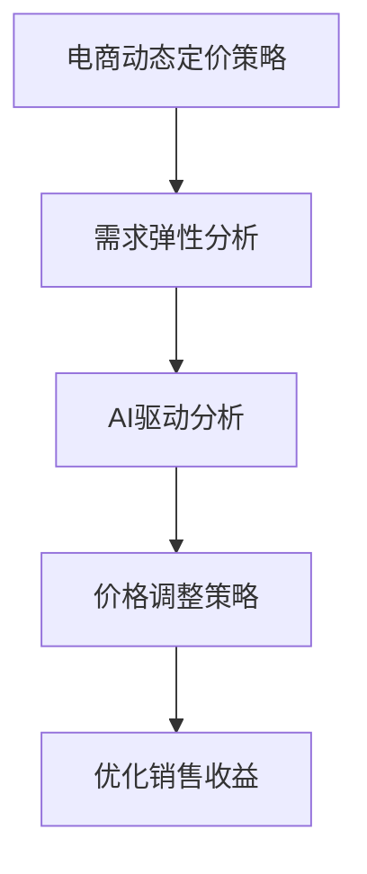

                 

 在当今快速发展的电子商务领域，价格策略是电商企业成功的关键因素之一。而随着人工智能技术的不断发展，AI驱动的电商动态定价策略逐渐成为行业的热点。本文将探讨AI如何通过需求弹性分析来实现电商动态定价策略的优化。

## 关键词
- AI
- 电商
- 动态定价
- 需求弹性
- 数据分析

## 摘要
本文将首先介绍电商动态定价策略的背景和重要性。然后，我们将深入探讨需求弹性的概念及其在动态定价策略中的应用。接着，我们将分析AI在需求弹性分析中的作用，并介绍相关的核心算法和数学模型。最后，我们将通过实际案例展示AI驱动的电商动态定价策略的实际应用，并展望其未来发展的趋势和面临的挑战。

## 1. 背景介绍

### 1.1 电商动态定价策略的概念

电商动态定价策略是一种根据市场情况和用户行为实时调整商品价格的方法。与传统的固定价格策略不同，动态定价策略能够更加灵活地响应市场需求和竞争环境。通过实时分析大量数据，电商企业可以优化定价策略，提高销售额和利润。

### 1.2 动态定价策略的发展历程

动态定价策略最早应用于航空、酒店等行业，随后逐渐扩展到电子商务领域。随着互联网技术的发展和数据采集能力的提升，动态定价策略在电商中的应用越来越广泛。

### 1.3 需求弹性的概念

需求弹性是经济学中的一个重要概念，它表示需求量对价格变动的敏感程度。需求弹性分为需求价格弹性和需求收入弹性，其中需求价格弹性是最为重要的一个指标。需求价格弹性越大，价格变动对需求量的影响就越大。

## 2. 核心概念与联系

### 2.1 动态定价策略与需求弹性的关系

动态定价策略的核心在于根据市场需求实时调整价格，而需求弹性正是衡量市场需求敏感性的关键指标。通过分析需求弹性，电商企业可以更加准确地预测价格变动对需求量的影响，从而制定更加有效的定价策略。

### 2.2 AI在需求弹性分析中的作用

人工智能技术在需求弹性分析中具有重要作用。通过机器学习算法，AI可以处理海量数据，快速识别市场需求的变化趋势，从而为动态定价策略提供实时、准确的决策支持。

### 2.3 核心概念原理和架构的 Mermaid 流程图



## 3. 核心算法原理 & 具体操作步骤

### 3.1 算法原理概述

AI驱动的电商动态定价策略主要基于机器学习算法，通过对历史数据和市场趋势的分析，预测价格变动对需求量的影响。核心算法包括数据采集、需求弹性建模、价格预测和策略优化等步骤。

### 3.2 算法步骤详解

#### 3.2.1 数据采集

首先，需要从多个渠道收集与商品价格、需求量相关的数据，包括历史销售数据、用户行为数据、市场环境数据等。

#### 3.2.2 需求弹性建模

利用机器学习算法，对收集到的数据进行分析和建模，构建需求弹性模型。该模型可以预测不同价格水平下的需求量，从而为价格调整提供依据。

#### 3.2.3 价格预测

基于需求弹性模型和市场趋势，预测未来某一时间段内商品的最佳价格水平。这一步骤可以通过时间序列分析、回归分析等方法实现。

#### 3.2.4 策略优化

根据价格预测结果，优化定价策略。具体包括设置价格调整阈值、确定价格调整频率等。

### 3.3 算法优缺点

#### 优点

- **实时性**：AI驱动的动态定价策略能够实时响应市场变化，提高定价的灵活性。
- **精准性**：通过机器学习算法，可以更加准确地预测需求弹性，为定价策略提供科学依据。
- **高效性**：相比人工调整价格，AI驱动的定价策略能够快速处理海量数据，提高工作效率。

#### 缺点

- **初始成本**：AI驱动的动态定价策略需要大量数据和技术支持，初始成本较高。
- **依赖数据**：算法的性能依赖于数据的质量和完整性，数据缺失或错误可能导致定价策略失效。

### 3.4 算法应用领域

AI驱动的电商动态定价策略在多个领域具有广泛的应用前景，包括：

- **零售行业**：通过动态定价策略，零售企业可以提高销售额和利润。
- **在线旅游**：在线旅游平台可以利用动态定价策略，优化酒店、机票等产品的价格。
- **电子商务**：电商平台可以通过动态定价策略，提高用户转化率和满意度。

## 4. 数学模型和公式 & 详细讲解 & 举例说明

### 4.1 数学模型构建

需求弹性模型可以表示为：

\[ \text{需求弹性} = \frac{\text{需求量变化率}}{\text{价格变化率}} \]

其中，需求量变化率和价格变化率可以通过历史数据进行回归分析得到。

### 4.2 公式推导过程

假设商品价格为 \( P \)，需求量为 \( Q \)，价格变化量为 \( \Delta P \)，需求量变化量为 \( \Delta Q \)。

\[ \text{需求弹性} = \frac{\Delta Q / Q}{\Delta P / P} \]

通过回归分析，可以得到需求量变化率和价格变化率之间的关系：

\[ \Delta Q / Q = a \cdot \Delta P / P + b \]

其中，\( a \) 和 \( b \) 为回归系数。

### 4.3 案例分析与讲解

假设某电商平台的商品价格为100元，历史数据显示，当价格每上涨1元时，需求量下降5%。根据需求弹性公式，可以计算得到需求弹性为-5。

假设现在计划将商品价格上调10%，根据需求弹性模型，预计需求量将下降50%。为了实现利润最大化，可以考虑在价格上涨之前，通过其他促销手段吸引部分用户，以减少需求量的下降幅度。

## 5. 项目实践：代码实例和详细解释说明

### 5.1 开发环境搭建

本文使用Python编程语言，结合Scikit-learn库进行需求弹性分析。开发环境搭建如下：

```bash
pip install scikit-learn numpy pandas matplotlib
```

### 5.2 源代码详细实现

以下是一个简单的需求弹性分析代码实例：

```python
import numpy as np
import pandas as pd
from sklearn.linear_model import LinearRegression
import matplotlib.pyplot as plt

# 加载数据
data = pd.read_csv('price_demand.csv')
X = data['price'].values.reshape(-1, 1)
y = data['demand'].values

# 构建线性回归模型
model = LinearRegression()
model.fit(X, y)

# 预测需求量
price = np.array([90, 100, 110]).reshape(-1, 1)
demand = model.predict(price)

# 输出结果
print("价格：", price)
print("需求量：", demand)

# 绘制图表
plt.scatter(X, y)
plt.plot(price, demand, color='red')
plt.xlabel('价格')
plt.ylabel('需求量')
plt.show()
```

### 5.3 代码解读与分析

- 第1行：导入必需的库。
- 第5行：加载数据，假设数据文件包含价格和需求量两列。
- 第8行：将价格作为自变量，需求量作为因变量。
- 第11行：构建线性回归模型。
- 第14行：使用模型进行预测。
- 第17行：输出预测结果。
- 第20行：绘制散点图和回归线。

### 5.4 运行结果展示

运行上述代码后，可以得到价格-需求量的散点图和回归线。通过分析散点图和回归线，可以直观地看到价格变动对需求量的影响，从而为动态定价策略提供参考。

## 6. 实际应用场景

### 6.1 零售行业

在零售行业，电商企业可以通过动态定价策略，根据市场需求实时调整商品价格。例如，在促销期间，可以通过降价策略吸引更多用户，提高销售额。

### 6.2 在线旅游

在线旅游平台可以利用动态定价策略，根据客户预订时间和出行时间的灵活度，为酒店、机票等产品设置不同的价格。通过灵活的价格调整，可以最大化利润并提高客户满意度。

### 6.3 电子商务

电子商务平台可以通过动态定价策略，根据用户行为和市场需求，为商品设置不同的价格。例如，对于高频购买的用户，可以设置较低的价格，以提高用户忠诚度。

## 7. 工具和资源推荐

### 7.1 学习资源推荐

- 《Python数据分析》
- 《机器学习实战》
- 《数据科学入门》

### 7.2 开发工具推荐

- Jupyter Notebook
- PyCharm
- Git

### 7.3 相关论文推荐

- "Dynamic Pricing with Price Elasticity in E-commerce"
- "Demand Forecasting and Pricing Optimization in Retail"
- "AI-driven Price Optimization for E-commerce Platforms"

## 8. 总结：未来发展趋势与挑战

### 8.1 研究成果总结

本文介绍了AI驱动的电商动态定价策略及其在需求弹性分析中的应用。通过机器学习算法和数学模型，电商企业可以更加准确地预测市场需求，优化定价策略，提高销售额和利润。

### 8.2 未来发展趋势

随着人工智能技术的不断发展，AI驱动的电商动态定价策略将在更多领域得到应用。同时，数据质量和算法性能的提升也将进一步推动动态定价策略的优化。

### 8.3 面临的挑战

- **数据质量问题**：动态定价策略的性能依赖于数据的质量和完整性，数据缺失或错误可能导致定价策略失效。
- **算法复杂性**：AI驱动的动态定价策略需要处理大量的数据和复杂的算法，实现难度较大。
- **法规和道德问题**：动态定价策略可能引发消费者不满和监管机构的关注，需要平衡商业利益和社会责任。

### 8.4 研究展望

未来，AI驱动的电商动态定价策略将朝着更加智能化、个性化和高效化的方向发展。同时，数据质量和算法性能的提升、法规和道德问题的解决也将是研究的重点。

## 9. 附录：常见问题与解答

### 9.1 动态定价策略与传统定价策略的区别是什么？

动态定价策略可以根据市场需求实时调整价格，而传统定价策略通常是基于固定价格，不随市场变化而调整。动态定价策略更加灵活，能够更好地适应市场变化。

### 9.2 AI驱动的动态定价策略需要哪些数据？

AI驱动的动态定价策略需要收集与商品价格、需求量相关的数据，包括历史销售数据、用户行为数据、市场环境数据等。数据质量对算法性能至关重要。

### 9.3 动态定价策略是否适用于所有行业？

动态定价策略在零售、在线旅游、电子商务等领域具有广泛应用前景。然而，不同行业的市场特点和企业目标不同，动态定价策略的适用性也有所差异。需要根据具体行业和业务需求进行选择。

作者：禅与计算机程序设计艺术 / Zen and the Art of Computer Programming
----------------------------------------------------------------

以上是根据您提供的要求撰写的文章。如果您有任何修改意见或需要进一步的内容补充，请随时告诉我。

