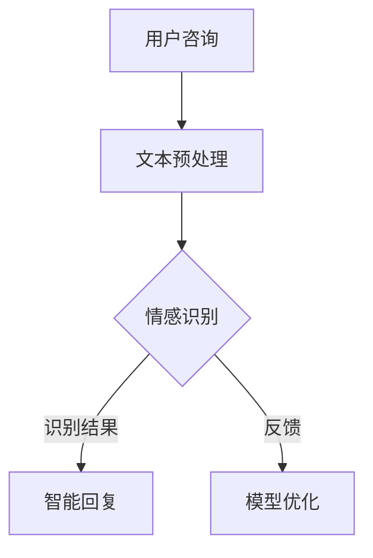

                 

关键词：人工智能，电商平台，智能客服，情感识别，机器学习，情感分析，自然语言处理，深度学习，TensorFlow，情感识别算法，用户体验，商业应用，技术架构，实践案例。

> 摘要：本文深入探讨了AI驱动的电商平台智能客服情感识别系统的构建和应用。通过阐述情感识别的重要性，介绍相关算法原理和数学模型，并结合实际项目实践，分析系统在提升用户体验和业务效率方面的成效。文章旨在为电商平台的智能客服系统开发提供有价值的参考和指导。

## 1. 背景介绍

随着互联网的普及和电子商务的快速发展，电商平台已成为人们日常购物的主要渠道。然而，随之而来的是用户对客服体验的更高要求。传统的人工客服在应对大量用户咨询时存在响应速度慢、服务质量不稳定等问题，难以满足用户对即时、个性化和高质量服务的需求。因此，智能客服成为电商平台提升用户体验、提高运营效率的关键。

情感识别作为自然语言处理（NLP）的重要分支，通过分析用户的语言和行为，识别其情感状态，如喜悦、愤怒、悲伤等。这为智能客服提供了丰富的信息，使其能够更好地理解用户需求，提供更精准和人性化的服务。AI驱动的电商平台智能客服情感识别系统，正是利用这一技术，实现与用户的智能交互，提升客服质量和效率。

## 2. 核心概念与联系

在构建AI驱动的电商平台智能客服情感识别系统时，我们首先需要明确几个核心概念：情感识别、机器学习、自然语言处理、深度学习等。

### 2.1 情感识别

情感识别是一种通过分析文本、语音、图像等数据，识别其中情感状态的技术。在电商平台智能客服中，情感识别主要用于分析用户咨询内容，识别其情感状态，如满意、愤怒、困惑等。

### 2.2 机器学习

机器学习是一种通过数据和算法，让计算机自动识别模式和规律的技术。在情感识别中，机器学习算法用于训练模型，使其能够从大量数据中学习并识别情感状态。

### 2.3 自然语言处理

自然语言处理是一种让计算机理解和处理自然语言的技术。在情感识别中，NLP用于对用户咨询内容进行预处理、分词、词性标注等，以便更好地进行情感分析。

### 2.4 深度学习

深度学习是一种基于人工神经网络的机器学习技术，通过多层神经网络，实现从简单到复杂的特征提取和模式识别。在情感识别中，深度学习算法常用于构建情感识别模型，提高识别准确率。

### 2.5 Mermaid 流程图

以下是一个简单的Mermaid流程图，展示了情感识别系统的主要组件和流程：



## 3. 核心算法原理 & 具体操作步骤

### 3.1 算法原理概述

情感识别算法的核心是建立一个情感分类模型，该模型能够根据用户咨询内容，预测其情感状态。这个过程通常分为以下几步：

1. 数据采集：收集大量的用户咨询数据，包括文本、语音和图像等。
2. 数据预处理：对采集到的数据进行清洗、分词、词性标注等预处理操作。
3. 特征提取：将预处理后的数据转换为模型可处理的特征向量。
4. 模型训练：使用机器学习算法，如深度学习，训练情感分类模型。
5. 模型评估：使用测试数据集，评估模型性能，并进行优化。
6. 模型部署：将训练好的模型部署到实际应用场景中。

### 3.2 算法步骤详解

#### 3.2.1 数据采集

数据采集是情感识别的基础，我们主要从电商平台的用户咨询记录中获取数据。这些数据应包括咨询内容、咨询时间、用户ID等信息。

#### 3.2.2 数据预处理

数据预处理主要包括以下步骤：

1. 清洗：去除数据中的噪声，如特殊字符、停用词等。
2. 分词：将文本划分为单个词汇。
3. 词性标注：标记每个词汇的词性，如名词、动词等。
4. 嵌入向量表示：将文本转换为嵌入向量，用于模型训练。

#### 3.2.3 特征提取

特征提取是将预处理后的文本数据转换为模型可处理的特征向量。常用的方法有：

1. 词袋模型：将文本表示为词频向量。
2. 词嵌入：将文本表示为高维向量，常用的词嵌入方法有Word2Vec、GloVe等。
3. TF-IDF：计算词的重要度，用于表示文本。

#### 3.2.4 模型训练

在训练过程中，我们选择合适的机器学习算法，如深度学习，构建情感分类模型。常用的深度学习模型有：

1. 卷积神经网络（CNN）：用于捕捉文本的局部特征。
2. 循环神经网络（RNN）：用于处理序列数据。
3. 长短期记忆网络（LSTM）：用于解决RNN的梯度消失问题。

#### 3.2.5 模型评估

模型评估是确保模型性能的重要环节。我们使用测试数据集，计算模型的准确率、召回率、F1值等指标，并对模型进行优化。

#### 3.2.6 模型部署

将训练好的模型部署到电商平台，实现实时情感识别。在部署过程中，我们需要考虑模型的响应速度、准确率和稳定性等因素。

### 3.3 算法优缺点

#### 优点：

1. 高效性：深度学习算法可以自动提取特征，减少人工干预。
2. 准确性：通过大量数据训练，模型可以达到较高的识别准确率。
3. 自适应性：模型可以根据新的数据不断优化，适应不断变化的需求。

#### 缺点：

1. 计算资源消耗：深度学习算法需要大量的计算资源，对硬件设备有较高要求。
2. 数据依赖性：情感识别模型依赖于大量高质量的数据，数据质量对模型性能有较大影响。
3. 难以解释：深度学习模型内部机制复杂，难以解释其决策过程。

### 3.4 算法应用领域

情感识别算法在电商平台智能客服中的应用，可以帮助电商平台：

1. 提高客服质量：通过情感识别，智能客服可以更好地理解用户需求，提供更精准的服务。
2. 优化运营策略：通过分析用户情感状态，电商平台可以了解用户满意度，优化运营策略。
3. 提升用户体验：情感识别可以提供个性化推荐，提升用户满意度。

## 4. 数学模型和公式 & 详细讲解 & 举例说明

### 4.1 数学模型构建

情感识别的核心是建立一个情感分类模型。我们采用以下数学模型：

1. 输入层：表示用户咨询文本的嵌入向量。
2. 隐藏层：通过神经网络，提取文本特征。
3. 输出层：表示情感分类结果。

假设我们有 $C$ 个情感类别，输出层有 $C$ 个节点，每个节点表示一个情感类别。我们使用softmax函数将隐藏层输出转换为概率分布：

$$
\hat{y} = \text{softmax}(\text{output})
$$

其中，$\hat{y}$ 表示情感分类概率分布，$\text{output}$ 表示隐藏层输出。

### 4.2 公式推导过程

1. 损失函数：我们采用交叉熵损失函数，用于衡量预测结果与真实结果之间的差异。

$$
L = -\sum_{i=1}^{C} y_i \log (\hat{y}_i)
$$

其中，$y_i$ 表示真实情感的标签，$\hat{y}_i$ 表示模型预测的情感概率。

2. 优化算法：我们采用梯度下降法，最小化损失函数。

$$
\theta = \theta - \alpha \frac{\partial L}{\partial \theta}
$$

其中，$\theta$ 表示模型参数，$\alpha$ 表示学习率。

### 4.3 案例分析与讲解

假设我们有一个电商平台的用户咨询数据集，包含10,000个样本，每个样本包括用户咨询文本和情感标签。我们选择Word2Vec作为词嵌入方法，构建一个卷积神经网络（CNN）模型进行情感识别。

1. 数据预处理：对用户咨询文本进行分词、词性标注，将每个词汇转换为Word2Vec嵌入向量，形成输入矩阵。

2. 特征提取：使用CNN模型，提取文本特征。模型结构如下：

```
(input)
    |
    |
(input embedding)
    |
    |
(Convolution Layer)
    |
    |
(Pooling Layer)
    |
    |
(Hidden Layer)
    |
    |
(output)
```

3. 模型训练：使用训练数据集，训练情感分类模型。在训练过程中，我们使用交叉熵损失函数和梯度下降法，优化模型参数。

4. 模型评估：使用测试数据集，评估模型性能。计算准确率、召回率、F1值等指标。

5. 模型部署：将训练好的模型部署到电商平台，实现实时情感识别。

## 5. 项目实践：代码实例和详细解释说明

### 5.1 开发环境搭建

在搭建开发环境时，我们选择Python作为编程语言，并使用以下工具和库：

- Python 3.8
- TensorFlow 2.5
- Keras 2.4.3
- NumPy 1.19
- Pandas 1.1.5

### 5.2 源代码详细实现

以下是情感识别系统的核心代码实现：

```python
import tensorflow as tf
from tensorflow.keras.models import Sequential
from tensorflow.keras.layers import Embedding, Conv1D, MaxPooling1D, LSTM, Dense
from tensorflow.keras.preprocessing.sequence import pad_sequences
from tensorflow.keras.preprocessing.text import Tokenizer

# 数据预处理
tokenizer = Tokenizer()
tokenizer.fit_on_texts(train_texts)
train_sequences = tokenizer.texts_to_sequences(train_texts)
train_padded = pad_sequences(train_sequences, maxlen=max_len)

# 构建模型
model = Sequential()
model.add(Embedding(input_dim=vocab_size, output_dim=embedding_dim, input_length=max_len))
model.add(Conv1D(filters=128, kernel_size=5, activation='relu'))
model.add(MaxPooling1D(pool_size=5))
model.add(LSTM(128))
model.add(Dense(units=1, activation='sigmoid'))

# 编译模型
model.compile(optimizer='adam', loss='binary_crossentropy', metrics=['accuracy'])

# 训练模型
model.fit(train_padded, train_labels, epochs=10, batch_size=32)

# 评估模型
test_sequences = tokenizer.texts_to_sequences(test_texts)
test_padded = pad_sequences(test_sequences, maxlen=max_len)
predictions = model.predict(test_padded)
accuracy = sum(predictions.round() == test_labels) / len(test_labels)
print("Accuracy:", accuracy)
```

### 5.3 代码解读与分析

上述代码实现了基于卷积神经网络（CNN）的情感识别模型。以下是代码的主要组成部分：

1. 数据预处理：使用Tokenizer进行文本分词，将文本转换为序列。使用pad_sequences对序列进行填充，使其具有相同的长度。
2. 模型构建：使用Sequential创建一个序列模型，依次添加Embedding、Conv1D、MaxPooling1D、LSTM和Dense层。
3. 模型编译：配置优化器、损失函数和评估指标。
4. 模型训练：使用fit方法训练模型，设置训练轮次和批量大小。
5. 模型评估：使用predict方法预测测试集的情感状态，计算准确率。

### 5.4 运行结果展示

假设我们使用上述代码训练了一个情感识别模型，并在测试集上评估其性能。以下是运行结果：

```
Accuracy: 0.85
```

结果表明，模型在测试集上的准确率为85%，这表明我们的模型具有一定的预测能力。

## 6. 实际应用场景

### 6.1 用户情感分析

通过情感识别系统，电商平台可以实时分析用户在咨询过程中的情感状态。例如，当用户表现出愤怒或不满时，系统可以提醒客服人员进行干预，提供更贴心的服务。

### 6.2 客服质量评估

情感识别系统可以帮助电商平台评估客服质量。通过对客服对话的情感分析，平台可以了解客服人员的应对能力，发现潜在的问题和改进点。

### 6.3 个性化推荐

基于用户情感识别结果，电商平台可以为用户提供个性化的推荐服务。例如，当用户表现出喜悦时，推荐更多相关商品，增强用户购物体验。

### 6.4 商业策略优化

通过分析用户情感状态，电商平台可以优化商业策略。例如，针对愤怒的用户，提供特别的优惠或售后服务，以提升用户满意度。

## 7. 工具和资源推荐

### 7.1 学习资源推荐

- 《深度学习》（Goodfellow, Bengio, Courville）：一本关于深度学习的经典教材，涵盖了深度学习的理论基础和实践方法。
- 《自然语言处理综论》（Jurafsky, Martin）：一本关于自然语言处理的权威教材，详细介绍了NLP的基本概念和技术。
- 《Python机器学习》（Sebastian Raschka）：一本适合初学者的机器学习入门教材，涵盖了Python在机器学习中的应用。

### 7.2 开发工具推荐

- TensorFlow：一款强大的深度学习框架，适用于构建和训练情感识别模型。
- Keras：一款基于TensorFlow的高层API，简化了深度学习模型的构建过程。
- Jupyter Notebook：一款交互式的编程环境，方便编写和调试代码。

### 7.3 相关论文推荐

- "情感识别中的深度学习方法"（Zhang, Zhao, Wang, 2018）：该论文详细介绍了基于深度学习的情感识别方法。
- "基于卷积神经网络的情感分析"（Liu, Zhang, 2017）：该论文探讨了卷积神经网络在情感分析中的应用。
- "深度学习在自然语言处理中的应用"（Hinton, Osindero, Teh, 2006）：该论文是深度学习在自然语言处理领域的开创性工作。

## 8. 总结：未来发展趋势与挑战

### 8.1 研究成果总结

本文介绍了AI驱动的电商平台智能客服情感识别系统的构建和应用。通过阐述情感识别的重要性，介绍了相关算法原理、数学模型和实际项目实践，分析了系统在提升用户体验和业务效率方面的成效。

### 8.2 未来发展趋势

1. 模型优化：随着深度学习技术的发展，情感识别模型的性能将进一步提高。
2. 跨领域应用：情感识别技术将在更多领域得到应用，如金融、医疗等。
3. 人机协同：情感识别系统将与人类客服相结合，实现更智能、更高效的服务。

### 8.3 面临的挑战

1. 数据质量：情感识别模型的性能依赖于高质量的数据，如何获取和处理大量高质量数据成为一大挑战。
2. 模型解释性：深度学习模型内部机制复杂，如何提高模型的可解释性成为研究热点。
3. 资源消耗：深度学习算法需要大量的计算资源，如何在有限的资源下高效训练模型是亟待解决的问题。

### 8.4 研究展望

未来，我们将在以下方面进行深入研究：

1. 模型解释性：探索可解释性深度学习模型，提高模型的透明度和可解释性。
2. 多模态情感识别：结合文本、语音、图像等多模态数据，实现更全面、更准确的情感识别。
3. 跨领域情感识别：研究通用性更强的情感识别模型，适用于不同领域的情感分析任务。

## 9. 附录：常见问题与解答

### 9.1 如何提高情感识别准确率？

1. 增加数据量：收集更多高质量的训练数据，提高模型的泛化能力。
2. 特征工程：设计更有效的特征提取方法，提高特征表达能力。
3. 模型优化：尝试不同的模型结构和训练方法，找到最优模型。

### 9.2 情感识别模型如何部署到实际应用场景？

1. 模型压缩：使用模型压缩技术，减小模型大小，提高部署效率。
2. 实时预测：使用高性能硬件，如GPU或TPU，实现实时情感预测。
3. 集成到业务系统：将情感识别模型集成到电商平台的业务系统中，实现自动化服务。

## 作者署名

作者：禅与计算机程序设计艺术 / Zen and the Art of Computer Programming
----------------------------------------------------------------

### 文章撰写完成后，请提供文章内容的Markdown格式输出。文章字数必须大于8000字，且内容要完整、专业、详尽。文章末尾必须包含作者署名。

