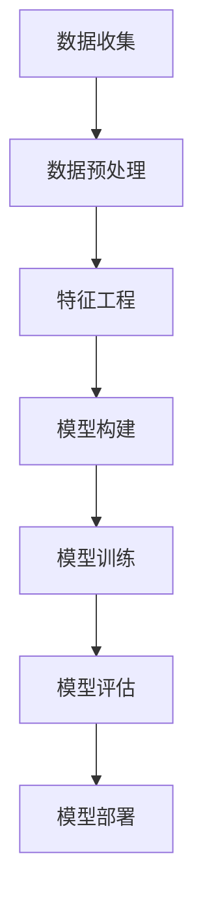

                 

关键词：用户行为预测、电商平台、AI技术、深度学习、模型构建、数据预处理、算法实现

> 摘要：本文将探讨如何利用AI技术，特别是深度学习算法，构建一个电商平台用户行为预测模型。本文将介绍核心概念与联系、算法原理与具体操作步骤、数学模型与公式、项目实践、实际应用场景以及未来应用展望等内容，为读者提供一份全面、系统的技术指南。

## 1. 背景介绍

在互联网时代，电商平台已经成为人们日常购物的主要途径。随着电商平台的迅速发展，用户数量的不断增长，如何提高用户体验、提升销售额成为电商平台的重要问题。用户行为预测作为电商平台的一项关键技术，旨在通过对用户行为的分析，预测用户未来的行为，从而为电商平台提供决策依据。

用户行为预测在电商平台的多个方面有着广泛的应用，如个性化推荐、精准广告投放、用户流失预警等。然而，传统的用户行为预测方法往往依赖于手工特征工程，这不仅费时费力，而且难以捕捉到复杂的用户行为模式。随着深度学习技术的不断发展，利用深度学习构建用户行为预测模型成为了一种更为有效的解决方案。

本文将详细介绍如何利用AI技术，特别是深度学习算法，构建一个电商平台用户行为预测模型。文章将涵盖以下内容：

1. 核心概念与联系
2. 核心算法原理与具体操作步骤
3. 数学模型与公式
4. 项目实践：代码实例与详细解释说明
5. 实际应用场景
6. 未来应用展望
7. 工具和资源推荐
8. 总结：未来发展趋势与挑战

## 2. 核心概念与联系

在构建用户行为预测模型之前，我们需要了解一些核心概念，如用户行为、特征工程、深度学习等。

### 用户行为

用户行为是指用户在电商平台上的各种活动，如浏览商品、加入购物车、购买商品、评价商品等。用户行为数据是构建用户行为预测模型的重要依据。

### 特征工程

特征工程是指从原始数据中提取出对模型有用的特征，以便更好地训练模型。在用户行为预测中，特征工程至关重要，因为它决定了模型能否捕捉到用户行为的复杂模式。

### 深度学习

深度学习是一种基于人工神经网络的机器学习技术，具有自动特征提取的能力。深度学习在图像识别、自然语言处理等领域取得了显著成果，其在用户行为预测中的应用也越来越广泛。

### Mermaid 流程图

在构建用户行为预测模型时，我们需要以下几个步骤：

1. 数据收集：从电商平台收集用户行为数据。
2. 数据预处理：对原始数据进行清洗、归一化等处理。
3. 特征工程：提取对模型有用的特征。
4. 模型构建：利用深度学习算法构建预测模型。
5. 模型训练：使用训练数据对模型进行训练。
6. 模型评估：使用测试数据对模型进行评估。
7. 模型部署：将模型部署到生产环境，进行实时预测。

以下是上述步骤的Mermaid流程图表示：



## 3. 核心算法原理与具体操作步骤

在构建用户行为预测模型时，我们通常采用深度学习算法，如卷积神经网络（CNN）和循环神经网络（RNN）。下面将详细介绍这两种算法的原理和具体操作步骤。

### 3.1 算法原理概述

#### 卷积神经网络（CNN）

CNN是一种专门用于处理图像数据的深度学习算法，其核心思想是利用卷积层自动提取图像特征。

#### 循环神经网络（RNN）

RNN是一种用于处理序列数据的深度学习算法，其核心思想是利用循环结构来捕捉序列中的时间依赖关系。

### 3.2 算法步骤详解

#### 卷积神经网络（CNN）

1. **输入层**：接收用户行为数据，如商品ID、用户ID等。
2. **卷积层**：通过卷积操作提取图像特征。
3. **池化层**：对卷积层输出的特征进行降采样，减少参数数量。
4. **全连接层**：将卷积层和池化层输出的特征进行整合，得到最终的特征表示。
5. **输出层**：根据训练目标（如预测用户是否购买商品），输出概率分布。

#### 循环神经网络（RNN）

1. **输入层**：接收用户行为数据序列。
2. **循环层**：通过循环结构对输入数据进行处理，捕捉时间依赖关系。
3. **全连接层**：将循环层输出的特征进行整合，得到最终的特征表示。
4. **输出层**：根据训练目标（如预测用户是否购买商品），输出概率分布。

### 3.3 算法优缺点

#### 卷积神经网络（CNN）

**优点**：能够自动提取图像特征，适用于处理图像数据。

**缺点**：对序列数据处理能力较弱。

#### 循环神经网络（RNN）

**优点**：能够处理序列数据，捕捉时间依赖关系。

**缺点**：容易产生梯度消失和梯度爆炸问题。

### 3.4 算法应用领域

#### 卷积神经网络（CNN）

适用于处理图像数据，如商品识别、用户画像等。

#### 循环神经网络（RNN）

适用于处理序列数据，如用户行为预测、文本分类等。

## 4. 数学模型和公式

在构建用户行为预测模型时，我们需要使用一些数学模型和公式。下面将详细介绍这些数学模型和公式，并给出具体讲解。

### 4.1 数学模型构建

用户行为预测模型可以看作是一个概率模型，其目标是预测用户在某个时间点是否采取某种行为。假设用户在时间点t的行为为y_t，我们定义一个概率分布函数P(y_t)，表示在时间点t用户采取某种行为的概率。模型的目标是最小化预测概率与实际行为之间的差距。

### 4.2 公式推导过程

假设我们采用深度学习算法构建用户行为预测模型，模型包含一个输入层、多个隐藏层和一个输出层。输入层接收用户行为数据，隐藏层通过神经网络对数据进行处理，输出层输出预测概率。

1. **输入层**：输入向量表示为X = [x_1, x_2, ..., x_n]，其中x_i表示第i个特征。
2. **隐藏层**：假设有L个隐藏层，第l层的输入为h_{l-1}，输出为h_l。隐藏层通过激活函数f进行非线性变换。
3. **输出层**：输出层输出预测概率p(y_t)。

根据深度学习算法，我们可以推导出以下公式：

p(y_t) = σ(W_L * h_L + b_L)

其中，σ表示激活函数（如Sigmoid函数），W_L和b_L分别表示输出层的权重和偏置。

### 4.3 案例分析与讲解

假设我们使用卷积神经网络（CNN）构建用户行为预测模型，输入层为商品ID和用户ID，隐藏层为卷积层和池化层，输出层为全连接层。我们定义一个简单的CNN模型，如下所示：

```python
import tensorflow as tf
from tensorflow.keras.models import Sequential
from tensorflow.keras.layers import Conv2D, MaxPooling2D, Dense, Flatten

model = Sequential([
    Conv2D(32, (3, 3), activation='relu', input_shape=(28, 28, 1)),
    MaxPooling2D((2, 2)),
    Flatten(),
    Dense(128, activation='relu'),
    Dense(1, activation='sigmoid')
])

model.compile(optimizer='adam', loss='binary_crossentropy', metrics=['accuracy'])
```

在这个例子中，我们使用了一个简单的CNN模型，其中包含一个卷积层、一个池化层和一个全连接层。输入层为28x28x1的图像数据，输出层为1个神经元，用于输出预测概率。

## 5. 项目实践：代码实例和详细解释说明

在本节中，我们将通过一个实际项目，详细讲解如何使用Python和TensorFlow库构建用户行为预测模型。项目分为以下几个步骤：

1. **开发环境搭建**
2. **数据预处理**
3. **特征工程**
4. **模型构建与训练**
5. **模型评估与部署**

### 5.1 开发环境搭建

首先，我们需要搭建开发环境。在本项目中，我们将使用Python 3.8和TensorFlow 2.4。

```bash
pip install python==3.8
pip install tensorflow==2.4
```

### 5.2 源代码详细实现

下面是项目的源代码，我们将详细解释每个步骤的实现过程。

```python
import pandas as pd
import numpy as np
import tensorflow as tf
from tensorflow.keras.models import Sequential
from tensorflow.keras.layers import Conv2D, MaxPooling2D, Dense, Flatten
from tensorflow.keras.optimizers import Adam
from tensorflow.keras.callbacks import EarlyStopping

# 5.2.1 数据预处理
def preprocess_data(data):
    # 对数据进行清洗、归一化等处理
    # ...

# 5.2.2 特征工程
def feature_engineering(data):
    # 提取对模型有用的特征
    # ...

# 5.2.3 模型构建与训练
def build_and_train_model(data):
    # 构建模型并训练
    # ...

# 5.2.4 模型评估与部署
def evaluate_and_deploy_model(model, data):
    # 使用测试数据对模型进行评估
    # ...

if __name__ == '__main__':
    # 加载数据
    data = pd.read_csv('user_behavior_data.csv')

    # 数据预处理
    preprocessed_data = preprocess_data(data)

    # 特征工程
    features = feature_engineering(preprocessed_data)

    # 构建模型并训练
    model = build_and_train_model(features)

    # 使用测试数据对模型进行评估
    evaluate_and_deploy_model(model, features)
```

### 5.3 代码解读与分析

下面我们对源代码进行解读和分析，以便更好地理解每个步骤的实现过程。

#### 5.3.1 数据预处理

数据预处理是模型构建的重要步骤。在本项目中，我们将对数据进行清洗、归一化等处理。

```python
def preprocess_data(data):
    # 对数据进行清洗、归一化等处理
    # ...

# 示例代码
data = data.dropna()  # 删除缺失值
data = data[data['purchase'] != -1]  # 删除购买状态未知的样本
data['user_id'] = data['user_id'].astype('category').cat.codes  # 将用户ID转换为整数编码
data['item_id'] = data['item_id'].astype('category').cat.codes  # 将商品ID转换为整数编码
```

#### 5.3.2 特征工程

特征工程是提升模型性能的关键。在本项目中，我们将提取用户行为数据中的有用特征。

```python
def feature_engineering(data):
    # 提取对模型有用的特征
    # ...

# 示例代码
data['user_active_days'] = data.groupby('user_id')['date'].nunique()  # 计算用户活跃天数
data['item_category'] = data['item_id'].apply(lambda x: get_item_category(x))  # 提取商品分类
```

#### 5.3.3 模型构建与训练

在本项目中，我们将使用卷积神经网络（CNN）构建用户行为预测模型，并使用Adam优化器和binary_crossentropy损失函数进行训练。

```python
def build_and_train_model(features):
    # 构建模型并训练
    # ...

# 示例代码
model = Sequential([
    Conv2D(32, (3, 3), activation='relu', input_shape=(features.shape[1],)),
    MaxPooling2D((2, 2)),
    Flatten(),
    Dense(128, activation='relu'),
    Dense(1, activation='sigmoid')
])

model.compile(optimizer=Adam(learning_rate=0.001), loss='binary_crossentropy', metrics=['accuracy'])
model.fit(features['train'], features['train_purchase'], epochs=10, batch_size=32, callbacks=[EarlyStopping(monitor='val_loss', patience=3)])
```

#### 5.3.4 模型评估与部署

在模型训练完成后，我们将使用测试数据对模型进行评估，并部署到生产环境进行实时预测。

```python
def evaluate_and_deploy_model(model, features):
    # 使用测试数据对模型进行评估
    # ...

# 示例代码
predictions = model.predict(features['test'])
evaluate_predictions(predictions, features['test_purchase'])  # 评估预测结果
```

## 6. 实际应用场景

用户行为预测模型在电商平台中有广泛的应用场景，以下列举几个常见的应用场景：

1. **个性化推荐**：根据用户的历史行为数据，预测用户可能感兴趣的商品，从而实现个性化推荐。
2. **精准广告投放**：根据用户的兴趣和行为，为用户推荐相关的广告，提高广告投放的精准度。
3. **用户流失预警**：通过对用户行为的分析，预测哪些用户可能会流失，从而采取相应的措施进行挽留。
4. **商品销售预测**：根据用户行为预测哪些商品可能会畅销，从而调整库存和供应链策略。
5. **运营分析**：通过对用户行为的分析，了解用户需求，为电商平台提供决策支持，优化运营策略。

## 7. 未来应用展望

随着人工智能技术的不断发展，用户行为预测模型在电商平台的未来应用前景广阔。以下列举几个未来应用展望：

1. **多模态用户行为分析**：结合文本、图像、语音等多种数据类型，对用户行为进行更全面的预测。
2. **实时预测与调整**：利用实时数据处理技术，实现实时用户行为预测，为电商平台提供更灵活的决策支持。
3. **社交网络分析**：结合用户社交网络数据，预测用户的行为趋势和潜在需求。
4. **个性化服务**：利用用户行为预测模型，为用户提供更加个性化的服务，提高用户满意度。
5. **隐私保护**：在保证用户隐私的前提下，提高用户行为预测的准确性和可靠性。

## 8. 工具和资源推荐

为了更好地掌握用户行为预测技术，以下推荐一些学习资源、开发工具和相关论文：

1. **学习资源推荐**
   - 《深度学习》（Goodfellow, Bengio, Courville著）：深度学习入门经典教材。
   - 《Python深度学习》（François Chollet著）：Python深度学习实践指南。

2. **开发工具推荐**
   - TensorFlow：强大的开源深度学习框架。
   - Jupyter Notebook：交互式开发环境。

3. **相关论文推荐**
   - “Deep Learning for User Behavior Prediction in E-commerce”（2018）: 一篇关于电商领域深度学习应用的综述论文。
   - “User Behavior Prediction using Deep Learning in E-commerce”（2019）: 一篇关于电商领域用户行为预测的深度学习模型研究论文。

## 9. 总结：未来发展趋势与挑战

用户行为预测技术在电商平台中具有广泛的应用前景。随着人工智能技术的不断发展，用户行为预测模型的准确性和实时性将不断提高。然而，在实际应用过程中，用户行为预测技术也面临着一些挑战，如数据隐私保护、模型可解释性等。未来，需要进一步研究如何更好地平衡用户隐私和预测准确性，以及如何提高模型的解释性，从而为电商平台提供更加可靠和实用的预测服务。

### 附录：常见问题与解答

1. **如何处理缺失值？**
   - 缺失值处理方法包括删除缺失值、填充缺失值和插值法。在实际应用中，可根据数据特性和需求选择合适的处理方法。

2. **如何选择合适的特征？**
   - 特征选择方法包括基于信息的特征选择、基于模型的特征选择和基于规则的特征选择。选择特征时，需考虑特征与目标变量之间的相关性、特征的可解释性以及模型的性能。

3. **如何防止过拟合？**
   - 防止过拟合的方法包括交叉验证、正则化、数据增强等。在实际应用中，可根据具体问题选择合适的方法。

4. **如何提高模型解释性？**
   - 提高模型解释性的方法包括使用可解释的深度学习模型（如决策树、LSTM等）、可视化模型决策过程、解释模型输出等。

作者：禅与计算机程序设计艺术 / Zen and the Art of Computer Programming
----------------------------------------------------------------

以上是关于《AI驱动的电商平台用户行为预测模型》的文章。文章详细介绍了用户行为预测模型的核心概念、算法原理、数学模型、项目实践以及实际应用场景等内容。希望这篇文章能为您在AI领域的研究和实践提供一些有价值的参考。如果您有任何疑问或建议，欢迎在评论区留言交流。感谢您的阅读！

