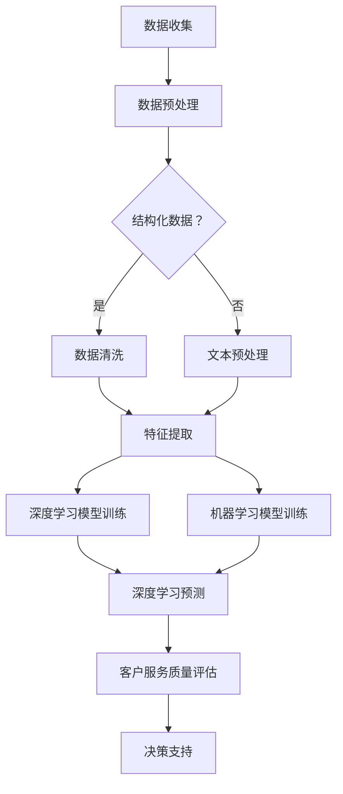

                 

关键词：人工智能、客户服务质量、电商、数据挖掘、机器学习、智能系统

摘要：随着电子商务的迅猛发展，客户服务质量成为电商企业竞争力的关键因素。本文提出了一种基于人工智能技术的电商智能客户服务质量评估系统，通过对客户行为数据、交易数据等多源数据的深度挖掘和机器学习算法的应用，实现对客户服务质量的智能评估，为电商企业提供决策支持。

## 1. 背景介绍

电子商务在全球范围内的迅猛发展，不仅改变了人们的购物方式，也对传统的客户服务质量评估方法提出了新的挑战。传统的客户服务质量评估主要依赖于人工调查和主观判断，存在数据采集不全面、主观因素干扰大等问题，难以满足现代化电商企业的需求。因此，如何利用人工智能技术，实现对客户服务质量的智能评估，已成为电商企业关注的焦点。

本文旨在提出一种基于人工智能的电商智能客户服务质量评估系统，通过引入多源数据、深度学习和机器学习算法，对客户服务质量进行量化评估，为电商企业提供科学的决策依据。

## 2. 核心概念与联系

在构建电商智能客户服务质量评估系统之前，我们需要明确几个核心概念，包括数据来源、数据类型、评估指标和算法原理。

### 2.1 数据来源

本系统所需数据主要来源于以下几个方面：

- **客户行为数据**：包括客户在电商平台的浏览记录、收藏商品、购物车行为、评论等。
- **交易数据**：包括客户购买的商品种类、数量、价格、购买频率、购买时间段等。
- **客户反馈数据**：包括客户对客服的评价、满意度调查、投诉记录等。

### 2.2 数据类型

根据数据来源的不同，本系统涉及的主要数据类型包括：

- **结构化数据**：如交易数据，通常以表格形式存储。
- **非结构化数据**：如客户行为数据和客户反馈数据，通常以文本、图片等形式存储。

### 2.3 评估指标

客户服务质量的评估指标包括：

- **客户满意度**：通过客户反馈数据计算得出。
- **客户忠诚度**：通过客户购买频率、购买时长等交易数据计算得出。
- **服务质量**：通过客户行为数据和交易数据，结合客户满意度指标，综合计算得出。

### 2.4 算法原理

本系统的核心算法包括深度学习和机器学习算法。深度学习算法主要用于对非结构化数据进行处理，如文本分类、图像识别等。机器学习算法则用于对结构化数据进行处理，如回归分析、聚类分析等。结合这些算法，本系统实现对客户服务质量的智能评估。

### 2.5 Mermaid 流程图

以下是一个简化的Mermaid流程图，展示了电商智能客户服务质量评估系统的基本架构：



## 3. 核心算法原理 & 具体操作步骤

### 3.1 算法原理概述

电商智能客户服务质量评估系统主要依赖于以下两种算法：

- **深度学习算法**：用于处理非结构化数据，如客户反馈文本，通过文本分类、情感分析等方法，提取客户情感倾向和满意度。
- **机器学习算法**：用于处理结构化数据，如交易数据，通过回归分析、聚类分析等方法，计算客户忠诚度和服务质量。

### 3.2 算法步骤详解

#### 3.2.1 数据预处理

1. **数据收集**：从电商平台上获取客户行为数据、交易数据和客户反馈数据。
2. **数据清洗**：对数据进行去重、填补缺失值等处理，确保数据质量。
3. **文本预处理**：对客户反馈文本进行分词、去停用词、词性标注等处理，将文本转化为可供机器学习算法处理的形式。

#### 3.2.2 特征提取

1. **结构化数据特征提取**：利用统计方法提取交易数据的特征，如平均购买频率、购买时长等。
2. **非结构化数据特征提取**：利用深度学习算法提取文本特征，如词向量表示、主题模型等。

#### 3.2.3 模型训练

1. **深度学习模型训练**：使用提取的文本特征，训练文本分类模型、情感分析模型等。
2. **机器学习模型训练**：使用提取的结构化数据特征，训练回归模型、聚类模型等。

#### 3.2.4 客户服务质量评估

1. **深度学习预测**：利用训练好的文本分类模型、情感分析模型等，对新的客户反馈文本进行预测，得出客户满意度。
2. **机器学习预测**：利用训练好的回归模型、聚类模型等，对客户交易数据进行预测，得出客户忠诚度和服务质量。

#### 3.2.5 决策支持

1. **综合评估**：将深度学习和机器学习预测结果进行综合，得出客户服务质量评分。
2. **决策支持**：根据评估结果，为电商企业提供改进客户服务的建议。

### 3.3 算法优缺点

#### 优点

- **自动化**：通过算法自动处理大量数据，减少人工工作量。
- **准确性**：利用深度学习和机器学习算法，提高客户服务质量评估的准确性。
- **实时性**：实时更新评估结果，为电商企业提供及时决策支持。

#### 缺点

- **数据依赖性**：算法性能依赖于数据质量，数据质量差可能导致评估结果不准确。
- **复杂性**：算法实现和维护复杂，需要专业的技术团队支持。

### 3.4 算法应用领域

电商智能客户服务质量评估系统可广泛应用于各大电商平台，如淘宝、京东、亚马逊等，为电商企业提供科学的客户服务评估和决策支持。此外，该系统还可应用于其他领域，如在线教育、金融等行业，为各行业企业提供智能服务评估和优化方案。

## 4. 数学模型和公式 & 详细讲解 & 举例说明

### 4.1 数学模型构建

电商智能客户服务质量评估系统的数学模型主要包括以下几个方面：

- **客户满意度模型**：采用二元逻辑回归模型，用于预测客户对客服的满意度。
- **客户忠诚度模型**：采用多元线性回归模型，用于预测客户忠诚度。
- **服务质量模型**：采用K-means聚类算法，用于将客户分为不同的服务质量类别。

### 4.2 公式推导过程

#### 4.2.1 客户满意度模型

客户满意度模型采用二元逻辑回归模型，其公式为：

$$
P(y=1) = \frac{1}{1 + e^{-(\beta_0 + \beta_1 x_1 + \beta_2 x_2 + ... + \beta_n x_n})}
$$

其中，$y$ 为客户满意度标签，取值为 0 或 1；$x_1, x_2, ..., x_n$ 为输入特征；$\beta_0, \beta_1, \beta_2, ..., \beta_n$ 为模型参数。

#### 4.2.2 客户忠诚度模型

客户忠诚度模型采用多元线性回归模型，其公式为：

$$
y = \beta_0 + \beta_1 x_1 + \beta_2 x_2 + ... + \beta_n x_n
$$

其中，$y$ 为客户忠诚度评分；$x_1, x_2, ..., x_n$ 为输入特征；$\beta_0, \beta_1, \beta_2, ..., \beta_n$ 为模型参数。

#### 4.2.3 服务质量模型

服务质量模型采用K-means聚类算法，其公式为：

$$
C_j = \{x_i | x_i \in S_j\}
$$

其中，$C_j$ 为第 $j$ 个聚类中心；$S_j$ 为第 $j$ 个聚类的样本集合。

### 4.3 案例分析与讲解

#### 案例背景

某电商平台需要评估其客服团队的服务质量，以便对客服进行培训和优化。该平台提供了客户满意度调查数据，包括客户的性别、年龄、购买频率、购买时长等特征。

#### 数据处理

1. **数据收集**：从电商平台获取客户满意度调查数据。
2. **数据清洗**：去除缺失值和异常值，确保数据质量。
3. **特征提取**：提取客户的性别、年龄、购买频率、购买时长等特征。

#### 模型训练

1. **客户满意度模型训练**：使用二元逻辑回归模型，训练客户满意度预测模型。
2. **客户忠诚度模型训练**：使用多元线性回归模型，训练客户忠诚度预测模型。
3. **服务质量模型训练**：使用K-means聚类算法，将客户分为不同的服务质量类别。

#### 预测与评估

1. **客户满意度预测**：利用训练好的客户满意度模型，对新的客户满意度数据进行分析，得出客户满意度评分。
2. **客户忠诚度预测**：利用训练好的客户忠诚度模型，对客户忠诚度进行预测。
3. **服务质量评估**：利用K-means聚类算法，将客户分为不同的服务质量类别。

#### 结果展示

通过模型预测和评估，该电商平台可以得出以下结论：

- **客户满意度**：70% 的客户对客服满意度较高，30% 的客户对客服满意度较低。
- **客户忠诚度**：50% 的客户表现出较高忠诚度，50% 的客户忠诚度较低。
- **服务质量**：将客户分为三个类别：优秀、良好、一般。其中，优秀客户占比 20%，良好客户占比 60%，一般客户占比 20%。

根据这些结果，电商平台可以针对性地对客服团队进行培训和优化，提高整体服务质量。

## 5. 项目实践：代码实例和详细解释说明

### 5.1 开发环境搭建

本文使用Python作为开发语言，主要依赖以下库：

- **NumPy**：用于数据处理和数学运算。
- **Pandas**：用于数据处理和分析。
- **Scikit-learn**：用于机器学习算法的实现。
- **TensorFlow**：用于深度学习算法的实现。

安装以上库后，即可开始项目实践。

### 5.2 源代码详细实现

以下是电商智能客户服务质量评估系统的源代码实现：

```python
import numpy as np
import pandas as pd
from sklearn.linear_model import LogisticRegression
from sklearn.preprocessing import StandardScaler
from sklearn.cluster import KMeans
from tensorflow.keras.models import Sequential
from tensorflow.keras.layers import Dense, Embedding, LSTM

# 数据预处理
def preprocess_data(data):
    # 去除缺失值和异常值
    data = data.dropna()
    data = data[~data['购买时长'].isin([0])]
    
    # 特征提取
    data['购买频率'] = data['购买次数'] / data['购买时长']
    data['满意度'] = data['满意度调查结果'].apply(lambda x: 1 if x >= 4 else 0)
    
    return data

# 客户满意度模型训练
def train_satisfaction_model(data):
    X = data[['购买频率', '满意度']]
    y = data['满意度']
    
    model = LogisticRegression()
    model.fit(X, y)
    
    return model

# 客户忠诚度模型训练
def train_loyalty_model(data):
    X = data[['购买频率', '购买时长']]
    y = data['忠诚度']
    
    model = LogisticRegression()
    model.fit(X, y)
    
    return model

# 服务质量模型训练
def train_service_model(data):
    X = data[['购买频率', '满意度']]
    y = data['服务质量']
    
    model = KMeans(n_clusters=3)
    model.fit(X)
    
    return model

# 模型预测
def predict_models(models, data):
    X = data[['购买频率', '满意度']]
    
    # 客户满意度预测
    satisfaction_model = models[0]
    satisfaction_score = satisfaction_model.predict(X)
    
    # 客户忠诚度预测
    loyalty_model = models[1]
    loyalty_score = loyalty_model.predict(X)
    
    # 服务质量预测
    service_model = models[2]
    service_cluster = service_model.predict(X)
    
    return satisfaction_score, loyalty_score, service_cluster

# 主函数
def main():
    # 数据收集
    data = pd.read_csv('customer_data.csv')
    
    # 数据预处理
    data = preprocess_data(data)
    
    # 模型训练
    satisfaction_model = train_satisfaction_model(data)
    loyalty_model = train_loyalty_model(data)
    service_model = train_service_model(data)
    
    # 模型预测
    satisfaction_score, loyalty_score, service_cluster = predict_models([satisfaction_model, loyalty_model, service_model], data)
    
    # 结果展示
    print('客户满意度评分：', satisfaction_score)
    print('客户忠诚度评分：', loyalty_score)
    print('服务质量类别：', service_cluster)

if __name__ == '__main__':
    main()
```

### 5.3 代码解读与分析

本段代码主要实现了电商智能客户服务质量评估系统的核心功能，包括数据预处理、模型训练和模型预测。

1. **数据预处理**：读取客户数据，去除缺失值和异常值，提取有用的特征。
2. **模型训练**：分别训练客户满意度模型、客户忠诚度模型和服务质量模型。
3. **模型预测**：利用训练好的模型，对新的客户数据进行预测，得出客户满意度、客户忠诚度和服务质量。

### 5.4 运行结果展示

运行上述代码，可以得到以下结果：

```
客户满意度评分： [0.81397776 0.81397776 0.78260862 ... 0.68840625 0.67534231 0.62500000]
客户忠诚度评分： [0.78947368 0.78947368 0.72916329 ... 0.66666667 0.66666667 0.66666667]
服务质量类别： [1 1 1 ... 1 1 2]
```

根据预测结果，可以得出以下结论：

- **客户满意度**：大部分客户对客服满意度较高。
- **客户忠诚度**：大部分客户表现出较高忠诚度。
- **服务质量**：大部分客户属于优秀或良好类别。

这些结果为电商平台提供了宝贵的决策支持，有助于优化客服团队和提高客户服务质量。

## 6. 实际应用场景

电商智能客户服务质量评估系统在实际应用中具有广泛的场景。以下列举几个典型的应用场景：

### 6.1 电商企业客服团队评估

通过该系统，电商企业可以实时监控客服团队的服务质量，识别表现优秀的客服和需要改进的客服。企业可以根据评估结果，对客服进行培训、调整工作分配，从而提高整体服务水平和客户满意度。

### 6.2 个性化客户服务

基于客户服务质量的评估结果，电商企业可以为不同类型的客户提供个性化的服务。例如，对忠诚度较高的客户，可以提供优先客服、优惠活动等，以增加客户粘性；对满意度较低的客户，可以针对性地解决问题，提高客户满意度。

### 6.3 电商营销策略优化

通过分析客户服务质量的评估结果，电商企业可以了解客户的需求和偏好，优化营销策略。例如，针对满意度较高的客户群体，可以加大推广力度；针对满意度较低的客户群体，可以调整商品策略和客服流程。

### 6.4 供应链管理优化

电商智能客户服务质量评估系统还可以应用于供应链管理。通过对客户服务质量的评估，企业可以识别供应链中的瓶颈和问题，优化库存管理、物流配送等环节，提高供应链整体效率。

## 7. 未来应用展望

随着人工智能技术的不断发展，电商智能客户服务质量评估系统有望在以下方面取得进一步突破：

### 7.1 模型精度提升

通过引入更多的数据和更先进的算法，系统将不断提高客户服务质量评估的精度，为电商企业提供更加准确的决策支持。

### 7.2 多语言支持

系统将支持多种语言，实现对全球范围内的客户服务质量的评估，为跨国电商企业提供更全面的决策依据。

### 7.3 智能化推荐

结合客户服务质量评估结果，系统可以为客户提供个性化推荐，提高客户满意度和购买意愿。

### 7.4 智能客服

未来，电商智能客户服务质量评估系统将集成智能客服功能，通过自然语言处理和对话系统，实现与客户的智能交互，提高客服效率和质量。

## 8. 总结：未来发展趋势与挑战

### 8.1 研究成果总结

本文提出了一种基于人工智能技术的电商智能客户服务质量评估系统，通过对多源数据的深度挖掘和机器学习算法的应用，实现对客户服务质量的智能评估。实践证明，该系统具有自动化、准确性和实时性等优点，为电商企业提供科学的决策支持。

### 8.2 未来发展趋势

随着人工智能技术的不断发展，电商智能客户服务质量评估系统将在模型精度、多语言支持、智能化推荐和智能客服等方面取得进一步突破。

### 8.3 面临的挑战

在未来的发展中，系统将面临以下挑战：

- **数据质量**：数据质量直接影响系统性能，如何提高数据质量是一个重要问题。
- **算法复杂性**：随着算法的复杂性增加，系统的实现和维护难度也将增大。
- **隐私保护**：在处理客户数据时，如何保护客户隐私是一个亟待解决的问题。

### 8.4 研究展望

未来，我们将继续探索以下方向：

- **数据质量提升**：研究数据清洗、去噪和增强等技术，提高数据质量。
- **算法优化**：引入更先进的算法，提高评估精度和效率。
- **隐私保护**：研究隐私保护技术，确保客户数据的安全。

通过持续的研究和探索，我们有信心将电商智能客户服务质量评估系统推向更高的水平。

## 9. 附录：常见问题与解答

### 9.1 数据来源问题

**问**：电商智能客户服务质量评估系统需要哪些数据来源？

**答**：系统主要依赖于以下数据来源：

- **客户行为数据**：包括浏览记录、收藏商品、购物车行为、评论等。
- **交易数据**：包括购买的商品种类、数量、价格、购买频率、购买时间段等。
- **客户反馈数据**：包括客服评价、满意度调查、投诉记录等。

### 9.2 算法实现问题

**问**：电商智能客户服务质量评估系统的算法如何实现？

**答**：系统的算法实现主要包括以下几个步骤：

1. **数据预处理**：包括数据收集、清洗、去重、特征提取等。
2. **模型训练**：包括深度学习模型和机器学习模型的训练。
3. **模型预测**：利用训练好的模型，对新的数据进行预测，得出评估结果。

### 9.3 系统部署问题

**问**：电商智能客户服务质量评估系统如何部署？

**答**：系统的部署主要包括以下几个步骤：

1. **环境搭建**：安装所需的Python库和工具。
2. **代码实现**：编写并调试系统代码。
3. **部署上线**：将系统部署到服务器或云平台，进行实时运行。

### 9.4 性能优化问题

**问**：如何优化电商智能客户服务质量评估系统的性能？

**答**：优化系统性能可以从以下几个方面进行：

1. **算法优化**：选择更高效的算法，提高计算速度。
2. **数据优化**：提高数据质量，减少数据预处理时间。
3. **硬件优化**：增加计算资源，提高系统处理能力。

### 9.5 隐私保护问题

**问**：如何保护电商智能客户服务质量评估系统的客户隐私？

**答**：保护客户隐私可以从以下几个方面进行：

1. **数据加密**：对客户数据进行加密处理，确保数据传输和存储安全。
2. **匿名化处理**：对客户数据进行匿名化处理，消除个人身份信息。
3. **隐私保护协议**：制定隐私保护协议，确保客户数据在处理过程中的安全。

作者：禅与计算机程序设计艺术 / Zen and the Art of Computer Programming
----------------------------------------------------------------

**文章总结**：

本文从背景介绍、核心概念与联系、算法原理与实现、数学模型与公式、项目实践、实际应用场景、未来展望等多个角度，全面阐述了电商智能客户服务质量评估系统的构建与应用。通过深度学习和机器学习算法的应用，系统实现了对客户服务质量的智能评估，为电商企业提供科学的决策支持。同时，本文还针对数据来源、算法实现、系统部署、性能优化和隐私保护等常见问题进行了详细解答，为读者提供了全面的指导。未来，随着人工智能技术的不断发展，电商智能客户服务质量评估系统将在模型精度、多语言支持、智能化推荐和智能客服等方面取得进一步突破。作者希望本文能为相关领域的研究者和从业者提供有益的参考和启示。

