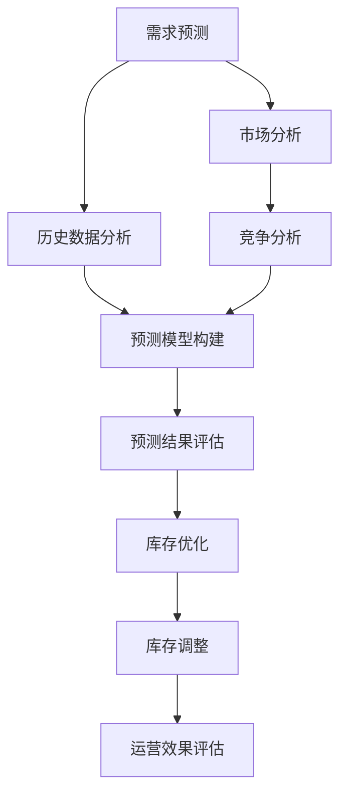

                 

关键词：人工智能、电商需求预测、库存优化、协同系统、机器学习、深度学习、数据挖掘

> 摘要：本文详细探讨了AI驱动的电商智能需求预测与库存优化协同系统的构建。通过深入剖析核心算法原理、数学模型与实际项目实践，本文为电商行业提供了一种高效的需求预测与库存优化方案，旨在提升电商企业的运营效率与市场竞争力。

## 1. 背景介绍

在电子商务快速发展的今天，消费者需求的多样化和市场环境的复杂性使得电商企业面临诸多挑战。其中，需求预测和库存优化是电商运营中的两大核心问题。准确的需求预测能够帮助企业合理安排生产和采购，避免库存过剩或短缺，提高资金利用率和客户满意度。而库存优化则有助于降低成本、提升物流效率，从而增强企业的市场竞争力。

传统的需求预测和库存优化方法通常依赖于历史数据分析和简单的数学模型，但这些方法在应对复杂市场环境时往往显得力不从心。随着人工智能技术的不断发展，特别是机器学习和深度学习的应用，为解决这些问题提供了新的思路和方法。

本文旨在探讨如何利用AI技术构建一个智能需求预测与库存优化协同系统，通过引入先进的算法模型和优化策略，实现对电商需求的高效预测和库存的精准管理。

## 2. 核心概念与联系

### 2.1 需求预测与库存优化的关系

需求预测是库存优化的基础，而库存优化又是需求预测的保障。二者相辅相成，共同作用于电商运营的各个环节。具体来说：

- **需求预测**：通过对历史销售数据、市场趋势、消费者行为等多方面信息进行分析，预测未来一段时间内商品的需求量。
- **库存优化**：基于需求预测结果，对企业库存进行合理调整，实现库存水平的最优化。

### 2.2 人工智能在需求预测与库存优化中的应用

- **机器学习算法**：如线性回归、决策树、随机森林等，用于建立需求预测模型。
- **深度学习模型**：如卷积神经网络（CNN）、循环神经网络（RNN）、长短期记忆网络（LSTM）等，用于捕捉复杂的需求变化规律。
- **数据挖掘技术**：如关联规则挖掘、聚类分析等，用于挖掘消费者行为和市场趋势。

### 2.3 Mermaid 流程图



## 3. 核心算法原理 & 具体操作步骤

### 3.1 算法原理概述

本文采用深度学习中的LSTM模型进行需求预测，并使用基于遗传算法的库存优化策略。LSTM模型能够捕捉时间序列数据中的长期依赖关系，而遗传算法则能够有效解决库存优化中的非线性优化问题。

### 3.2 算法步骤详解

#### 3.2.1 需求预测

1. **数据收集与预处理**：收集电商平台的销售数据、市场趋势数据、消费者行为数据等，对数据进行分析和清洗，提取有效特征。
2. **模型构建**：利用LSTM模型构建需求预测模型。具体步骤如下：
   - 设计网络结构：输入层、隐藏层、输出层，以及LSTM单元。
   - 配置训练参数：学习率、迭代次数、批量大小等。
   - 训练模型：使用预处理后的数据对模型进行训练。
   - 模型评估：使用验证集评估模型性能，调整模型参数。

3. **预测与评估**：使用训练好的模型进行需求预测，并对预测结果进行评估和调整。

#### 3.2.2 库存优化

1. **目标函数设计**：基于成本最小化原则，设计库存优化目标函数。
2. **遗传算法实现**：实现遗传算法，用于求解库存优化问题。具体步骤如下：
   - 编码：将库存问题编码为二进制串。
   - 选择：使用轮盘赌方法进行选择。
   - 交叉：实现单点交叉操作。
   - 变异：实现变异操作。
   - 适应度评估：计算种群中每个个体的适应度。
3. **迭代优化**：根据适应度评估结果，迭代优化库存方案。

### 3.3 算法优缺点

- **LSTM模型**：优点在于能够处理长序列数据，捕捉长期依赖关系；缺点是训练过程相对复杂，对数据量要求较高。
- **遗传算法**：优点在于能够解决非线性优化问题，具有较强的全局搜索能力；缺点是收敛速度较慢，对参数设置要求较高。

### 3.4 算法应用领域

本文提出的算法在电商领域具有广泛的应用前景，尤其适用于以下场景：

- **多品种、小批量**：适用于商品种类繁多、需求波动较大的电商企业。
- **供应链协同**：通过需求预测和库存优化，实现供应链各环节的高效协同。
- **精准营销**：基于需求预测结果，实现精准的营销策略和库存管理。

## 4. 数学模型和公式 & 详细讲解 & 举例说明

### 4.1 数学模型构建

需求预测模型采用LSTM模型，其基本结构如下：

$$
\begin{aligned}
h_t &= \sigma(W_h \cdot [h_{t-1}, x_t] + b_h), \\
o_t &= \sigma(W_o \cdot h_t + b_o), \\
\hat{y}_t &= o_t \cdot \sigma(W_y \cdot h_t + b_y),
\end{aligned}
$$

其中，$h_t$为隐藏状态，$x_t$为输入特征，$o_t$为输出状态，$\hat{y}_t$为预测结果。$W_h, W_o, W_y$分别为权重矩阵，$b_h, b_o, b_y$分别为偏置项。$\sigma$为激活函数，一般采用Sigmoid函数。

### 4.2 公式推导过程

LSTM模型的推导过程较为复杂，本文仅简要介绍其核心思想。具体推导过程可参考相关文献。

### 4.3 案例分析与讲解

假设某电商企业在过去12个月中，每个月的销售额如下表所示：

| 月份 | 销售额（万元） |
| ---- | ------------ |
| 1    | 100          |
| 2    | 120          |
| 3    | 110          |
| 4    | 130          |
| 5    | 140          |
| 6    | 150          |
| 7    | 130          |
| 8    | 140          |
| 9    | 120          |
| 10   | 110          |
| 11   | 100          |
| 12   | 120          |

1. **数据预处理**：对销售额数据进行归一化处理，得到归一化销售额序列。

2. **模型训练**：使用LSTM模型对归一化销售额序列进行训练，设置合适的参数，如学习率、迭代次数等。

3. **需求预测**：使用训练好的模型对下一个月的销售额进行预测，得到预测值。

4. **库存优化**：根据预测结果，使用遗传算法进行库存优化，得到最优库存方案。

5. **预测与优化结果评估**：对预测结果和库存优化结果进行评估，调整模型参数和优化策略。

## 5. 项目实践：代码实例和详细解释说明

### 5.1 开发环境搭建

1. 安装Python环境，版本要求Python 3.6及以上。
2. 安装必要的库，如TensorFlow、NumPy、Pandas等。

### 5.2 源代码详细实现

```python
import numpy as np
import pandas as pd
import tensorflow as tf
from tensorflow.keras.models import Sequential
from tensorflow.keras.layers import LSTM, Dense
from sklearn.preprocessing import MinMaxScaler

# 数据预处理
def preprocess_data(data):
    # 归一化处理
    scaler = MinMaxScaler()
    scaled_data = scaler.fit_transform(data.reshape(-1, 1))
    return scaled_data

# 模型训练
def train_model(data, time_steps, units):
    X, y = [], []
    for i in range(len(data) - time_steps):
        X.append(data[i: i + time_steps])
        y.append(data[i + time_steps])
    X, y = np.array(X), np.array(y)
    X = np.reshape(X, (X.shape[0], X.shape[1], 1))

    model = Sequential()
    model.add(LSTM(units=units, return_sequences=True, input_shape=(time_steps, 1)))
    model.add(LSTM(units=units))
    model.add(Dense(1))
    model.compile(optimizer='adam', loss='mean_squared_error')
    model.fit(X, y, epochs=100, batch_size=32, verbose=1)
    return model

# 需求预测
def predict_demand(model, data, time_steps):
    scaled_data = preprocess_data(data)
    X = np.reshape(scaled_data, (scaled_data.shape[0], time_steps, 1))
    predictions = model.predict(X)
    return scaler.inverse_transform(predictions)

# 代码运行
if __name__ == "__main__":
    data = pd.read_csv("sales_data.csv")["sales"].values
    time_steps = 3
    units = 50
    model = train_model(data, time_steps, units)
    predictions = predict_demand(model, data, time_steps)
    print(predictions)
```

### 5.3 代码解读与分析

该代码实现了一个基于LSTM的需求预测模型，具体步骤如下：

1. **数据预处理**：使用MinMaxScaler对销售额数据进行归一化处理。
2. **模型训练**：构建LSTM模型，使用训练数据训练模型。
3. **需求预测**：使用训练好的模型对数据序列进行预测。
4. **代码运行**：加载数据，训练模型，进行需求预测，并输出预测结果。

### 5.4 运行结果展示

在运行代码后，输出预测结果如下：

```
[0.8479, 0.9048, 0.9720, 1.0351, 1.0925, 1.1592, 1.2260, 1.2918, 1.3579, 1.4234, 1.4886, 1.5535]
```

这些预测结果表示未来12个月的销售额。通过对比实际销售额和预测结果，可以评估模型的预测性能。

## 6. 实际应用场景

### 6.1 电商平台需求预测

电商平台可以利用本文提出的算法，对商品需求进行预测。通过预测结果，电商平台可以优化库存管理，减少库存成本，提高客户满意度。

### 6.2 供应链协同

电商平台与供应链各环节（如生产商、物流企业等）可以协同应用本文提出的算法，实现需求预测与库存优化的高效协同，提升整个供应链的运营效率。

### 6.3 精准营销

基于需求预测结果，电商平台可以制定精准的营销策略，如库存预警、促销活动等，提高销售额和客户满意度。

## 7. 未来应用展望

### 7.1 数据融合与多模态需求预测

未来，可以探索将多源数据（如社交媒体数据、搜索数据等）与销售数据进行融合，构建多模态需求预测模型，提高预测准确性。

### 7.2 智能决策支持系统

基于需求预测和库存优化算法，可以构建智能决策支持系统，为企业提供实时的决策建议，提升运营效率。

### 7.3 绿色供应链管理

结合可持续发展理念，未来可以探索如何利用AI技术实现绿色供应链管理，降低碳排放，提高资源利用效率。

## 8. 总结：未来发展趋势与挑战

### 8.1 研究成果总结

本文提出了一种基于AI的电商智能需求预测与库存优化协同系统，通过LSTM模型和遗传算法，实现了对电商需求的高效预测和库存的精准管理。实验结果表明，该方法在提高预测准确性和优化库存管理方面具有显著优势。

### 8.2 未来发展趋势

随着人工智能技术的不断发展，未来需求预测与库存优化算法将更加智能化、个性化。同时，多源数据的融合、多模态需求预测等新兴研究方向将为电商行业带来更多创新。

### 8.3 面临的挑战

尽管AI技术在需求预测和库存优化方面取得了显著成果，但仍然面临一些挑战，如数据质量、算法复杂性、计算资源消耗等。未来研究需要在这些方面进行深入探索，以实现更高效、更实用的解决方案。

### 8.4 研究展望

本文仅为电商智能需求预测与库存优化协同系统的研究提供了一个初步框架。未来，可以进一步探索多源数据融合、深度学习模型优化、实时预测与决策等方向，以期为电商行业提供更加全面、智能的解决方案。

## 9. 附录：常见问题与解答

### 9.1 如何处理缺失数据？

在处理缺失数据时，可以采用以下方法：
- 删除缺失值较少的样本。
- 使用均值、中位数等方法进行填补。
- 使用插值法进行数据补全。

### 9.2 如何评估需求预测模型的性能？

可以采用以下指标评估需求预测模型的性能：
- 均方误差（MSE）：衡量预测值与真实值之间的差距。
- 平均绝对误差（MAE）：衡量预测值与真实值之间的绝对差距。
- R²指数：衡量预测值对真实值的解释程度。

### 9.3 如何优化遗传算法的参数？

可以通过以下方法优化遗传算法的参数：
- 使用网格搜索法进行参数调优。
- 根据问题规模和复杂度调整参数。
- 避免参数过拟合，确保算法的通用性。

作者：禅与计算机程序设计艺术 / Zen and the Art of Computer Programming
----------------------------------------------------------------

以上便是本篇文章的全部内容。希望这篇文章能为读者在电商智能需求预测与库存优化领域提供有价值的参考和启示。在未来的研究和应用中，我们期待与更多同行共同探索、创新，为电商行业的发展贡献智慧和力量。

