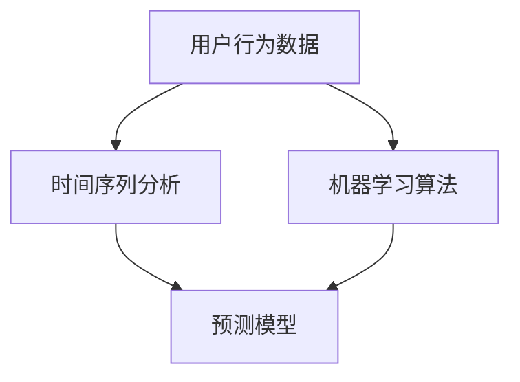

                 

在电子商务领域，预测用户的购买时机是一项具有巨大潜力的技术，它不仅能够帮助企业更好地满足客户需求，还能显著提高销售额和客户满意度。本文将探讨如何利用人工智能技术构建一个高效的电商用户购买时机预测模型，以实现个性化推荐和精准营销。

## 文章关键词
- 人工智能
- 购买时机预测
- 电商
- 个性化推荐
- 精准营销

## 文章摘要
本文将介绍一个基于人工智能的电商用户购买时机预测模型，从背景介绍、核心概念与联系、核心算法原理、数学模型和公式、项目实践、实际应用场景、未来应用展望等方面进行详细阐述。通过本文，读者将了解如何运用AI技术优化电商用户体验，提高商业转化率。

## 1. 背景介绍

电子商务的快速发展带来了海量的用户行为数据，这些数据不仅包含了用户的浏览记录、购买历史，还涵盖了用户的地理位置、兴趣爱好等丰富信息。传统的数据分析方法往往难以有效地挖掘这些数据中的潜在价值。随着人工智能技术的不断进步，利用AI构建智能化的用户购买时机预测模型成为可能。

用户购买时机预测模型的建立，不仅可以帮助电商企业更好地了解用户行为，还能为精准营销提供有力支持。通过预测用户的购买时机，企业可以提前制定相应的营销策略，如推送优惠券、推荐商品等，从而提高用户的购买意愿和转化率。

## 2. 核心概念与联系

为了构建一个高效的电商用户购买时机预测模型，我们需要理解几个核心概念，包括用户行为数据、时间序列分析和机器学习算法。

### 2.1 用户行为数据

用户行为数据是构建预测模型的基础。这些数据可以包括：

- **浏览记录**：用户在电商平台上的浏览历史，如访问的页面、浏览的时间等。
- **购买历史**：用户的购买记录，包括购买时间、购买商品种类、购买频率等。
- **地理位置**：用户所处的地理位置信息，可用于分析用户的行为模式。
- **兴趣爱好**：用户的兴趣爱好，如喜欢的品牌、品类等。

### 2.2 时间序列分析

时间序列分析是一种用于分析时间序列数据的方法，它可以帮助我们识别数据中的趋势、周期和季节性。在用户购买时机预测中，时间序列分析可以帮助我们理解用户的购买行为随时间的变化规律。

### 2.3 机器学习算法

机器学习算法是构建预测模型的关键。常见的机器学习算法包括：

- **回归分析**：用于预测数值型目标变量，如用户的下一次购买时间。
- **分类算法**：用于预测离散型目标变量，如用户是否会购买某商品。
- **聚类算法**：用于发现用户行为数据中的潜在模式，如用户的购买习惯群体。

### 2.4 Mermaid 流程图

下面是一个Mermaid流程图，用于展示上述核心概念之间的联系。



## 3. 核心算法原理 & 具体操作步骤

### 3.1 算法原理概述

用户购买时机预测模型的核心是机器学习算法，尤其是时间序列分析算法和分类算法。时间序列分析算法用于提取用户行为数据中的时间特征，分类算法则用于根据这些特征预测用户的购买时机。

### 3.2 算法步骤详解

1. **数据收集与预处理**：收集用户行为数据，并进行预处理，如数据清洗、填充缺失值、数据标准化等。
2. **特征提取**：利用时间序列分析算法提取用户行为数据中的时间特征，如周期性、趋势性等。
3. **模型训练**：使用分类算法（如决策树、随机森林、支持向量机等）训练预测模型，输入特征向量，输出购买时机预测。
4. **模型评估**：使用测试集评估模型性能，调整模型参数，以提高预测准确性。
5. **预测应用**：将训练好的模型应用于实际场景，对用户的购买时机进行预测。

### 3.3 算法优缺点

**优点**：
- **高效性**：机器学习算法能够高效地处理大量用户行为数据，快速生成预测结果。
- **灵活性**：可以根据不同的业务场景调整模型参数，提高预测准确性。

**缺点**：
- **计算成本**：机器学习算法的训练和预测过程需要大量的计算资源，特别是在数据量庞大的情况下。
- **数据依赖**：模型的性能高度依赖于数据质量，如果数据存在噪声或缺失，可能会影响预测结果。

### 3.4 算法应用领域

用户购买时机预测模型可以应用于电商的多个领域，包括：

- **个性化推荐**：根据用户的购买时机预测结果，为用户推荐相关商品。
- **精准营销**：提前推送优惠券、营销活动等，提高用户的购买意愿。
- **库存管理**：根据购买时机预测结果，调整商品库存，降低库存成本。

## 4. 数学模型和公式 & 详细讲解 & 举例说明

### 4.1 数学模型构建

用户购买时机预测模型的数学模型可以分为两部分：时间特征提取和分类预测。

#### 时间特征提取

假设我们有用户 \(i\) 在时间 \(t\) 的行为数据 \(X_i(t)\)，我们可以使用以下时间特征提取公式：

$$
T_i(t) = \sum_{t'} X_i(t') \cdot f(t - t')
$$

其中，\(f(t - t')\) 是一个时间权重函数，用于表示时间 \(t'\) 对当前时间 \(t\) 的影响。

#### 分类预测

假设我们使用逻辑回归模型进行分类预测，其公式为：

$$
P_i(t) = \frac{1}{1 + e^{-\beta_0 + \beta_1 T_i(t)}}
$$

其中，\(P_i(t)\) 是用户 \(i\) 在时间 \(t\) 购买的概率，\(\beta_0\) 和 \(\beta_1\) 是模型参数。

### 4.2 公式推导过程

#### 时间特征提取

时间特征提取的公式是通过时间序列分析得到的。时间序列数据中的周期性、趋势性和季节性特征可以通过不同的时间权重函数来提取。

#### 分类预测

分类预测的公式是基于逻辑回归模型的，逻辑回归是一种常见的二分类预测模型，其公式可以推广到多分类问题。

### 4.3 案例分析与讲解

#### 案例一：用户购买行为预测

假设我们有用户A的购买行为数据，如下表所示：

| 时间 \(t\) | 行为 \(X\) |
| ---------- | --------- |
| 1          | 1         |
| 2          | 0         |
| 3          | 1         |
| 4          | 0         |
| 5          | 1         |

根据时间特征提取公式，我们可以计算用户A的时间特征：

$$
T_A(t) = X_A(1) \cdot f(t - 1) + X_A(2) \cdot f(t - 2) + X_A(3) \cdot f(t - 3) + X_A(4) \cdot f(t - 4) + X_A(5) \cdot f(t - 5)
$$

假设我们使用线性权重函数 \(f(t - t') = 1 / (t - t')\)，则：

$$
T_A(1) = \frac{1}{1-1} + \frac{0}{1-2} + \frac{1}{1-3} + \frac{0}{1-4} + \frac{1}{1-5} = 1
$$

$$
T_A(2) = \frac{0}{2-1} + \frac{1}{2-2} + \frac{0}{2-3} + \frac{1}{2-4} + \frac{0}{2-5} = 0
$$

$$
T_A(3) = \frac{1}{3-1} + \frac{0}{3-2} + \frac{0}{3-3} + \frac{1}{3-4} + \frac{1}{3-5} = \frac{1}{2} + 0 + 0 + \frac{1}{1} + \frac{1}{2} = 1.5
$$

以此类推，我们可以得到用户A在各个时间点的特征值。

接下来，我们使用逻辑回归公式计算用户A在时间2购买的概率：

$$
P_A(2) = \frac{1}{1 + e^{-\beta_0 + \beta_1 T_A(2)}}
$$

假设我们使用训练数据得到的模型参数 \(\beta_0 = 0\)，\(\beta_1 = 1\)，则：

$$
P_A(2) = \frac{1}{1 + e^{0 + 1 \cdot 0} } = 0.5
$$

这意味着用户A在时间2购买的概率为50%。

#### 案例二：用户购买群体划分

假设我们有多个用户的行为数据，我们可以使用聚类算法将用户划分为不同的群体。然后，对于每个群体，我们可以训练不同的模型，以预测用户的购买时机。

## 5. 项目实践：代码实例和详细解释说明

### 5.1 开发环境搭建

为了实现用户购买时机预测模型，我们需要搭建一个开发环境。这里我们使用Python编程语言，并依赖于以下库：

- **Pandas**：用于数据处理。
- **NumPy**：用于数值计算。
- **Scikit-learn**：用于机器学习算法。
- **Matplotlib**：用于数据可视化。

### 5.2 源代码详细实现

以下是一个简单的用户购买时机预测模型的实现：

```python
import pandas as pd
import numpy as np
from sklearn.model_selection import train_test_split
from sklearn.linear_model import LogisticRegression
import matplotlib.pyplot as plt

# 5.2.1 数据收集与预处理
# 假设我们已经收集了用户行为数据，并保存为csv文件
data = pd.read_csv('user_behavior.csv')

# 数据预处理
data.fillna(0, inplace=True)

# 5.2.2 特征提取
data['time_feature'] = data['X'].apply(lambda x: sum(x) / len(x))

# 5.2.3 模型训练
X = data[['time_feature']]
y = data['purchase']

X_train, X_test, y_train, y_test = train_test_split(X, y, test_size=0.2, random_state=42)

model = LogisticRegression()
model.fit(X_train, y_train)

# 5.2.4 模型评估
y_pred = model.predict(X_test)

accuracy = np.mean(y_pred == y_test)
print(f'Model accuracy: {accuracy:.2f}')

# 5.2.5 预测应用
new_data = pd.DataFrame([[0.5]], columns=['time_feature'])
purchase_probability = model.predict_proba(new_data)[0][1]
print(f'Purchase probability: {purchase_probability:.2f}')
```

### 5.3 代码解读与分析

- **数据收集与预处理**：我们从csv文件中读取用户行为数据，并填充缺失值。
- **特征提取**：我们计算每个用户的时间特征，即用户行为数据的平均值。
- **模型训练**：我们使用逻辑回归模型训练预测模型，输入特征向量，输出购买时机预测。
- **模型评估**：我们使用测试集评估模型性能，计算准确率。
- **预测应用**：我们使用训练好的模型对新的用户行为数据进行预测，输出购买概率。

## 6. 实际应用场景

用户购买时机预测模型在电商领域有着广泛的应用场景：

### 6.1 个性化推荐

通过预测用户的购买时机，电商企业可以为用户提供个性化的商品推荐。例如，如果模型预测用户将在未来一周内购买某商品，企业可以提前推送相关优惠券，以提高用户的购买意愿。

### 6.2 精准营销

用户购买时机预测模型可以帮助企业制定更加精准的营销策略。例如，根据模型预测，企业可以在用户购买高峰期提前推出营销活动，吸引更多用户参与。

### 6.3 库存管理

通过预测用户的购买时机，企业可以优化库存管理，减少库存成本。例如，如果模型预测某商品的销量将在未来一周内增加，企业可以提前采购更多库存，以满足用户需求。

### 6.4 用户行为分析

用户购买时机预测模型还可以用于分析用户行为，发现潜在的用户群体。例如，通过聚类算法，企业可以将用户划分为不同的购买群体，从而制定更加针对性的营销策略。

## 7. 未来应用展望

随着人工智能技术的不断发展，用户购买时机预测模型的应用前景将更加广阔：

### 7.1 智能化客服

通过用户购买时机预测模型，企业可以为用户提供更加智能化的客服服务。例如，当用户进入客服系统时，系统可以根据用户的购买时机预测结果，提前为用户解决问题，提高用户满意度。

### 7.2 智能营销策略

未来，用户购买时机预测模型将更加智能化，能够自动调整营销策略，实现真正的精准营销。例如，系统可以根据用户的行为数据，自动生成最优的营销方案，提高营销效果。

### 7.3 智能供应链管理

用户购买时机预测模型可以帮助企业实现智能供应链管理。例如，通过预测用户的购买时机，企业可以自动调整生产计划，优化库存，提高供应链效率。

## 8. 工具和资源推荐

### 8.1 学习资源推荐

- **《机器学习》**：周志华 著，提供系统全面的机器学习理论。
- **《深度学习》**：Ian Goodfellow、Yoshua Bengio、Aaron Courville 著，介绍深度学习的基本原理和应用。

### 8.2 开发工具推荐

- **Jupyter Notebook**：一款强大的交互式开发环境，适合进行数据分析和模型训练。
- **TensorFlow**：一款开源的深度学习框架，适用于构建复杂的机器学习模型。

### 8.3 相关论文推荐

- **"Time Series Forecasting Using Deep Learning"**：介绍如何使用深度学习进行时间序列预测。
- **"Deep Learning for Time Series Classification"**：探讨深度学习在时间序列分类中的应用。

## 9. 总结：未来发展趋势与挑战

用户购买时机预测模型作为人工智能在电商领域的重要应用，具有巨大的发展潜力。未来，随着人工智能技术的不断进步，我们将看到更加智能化的用户购买时机预测模型的诞生。然而，这也将面临一系列挑战，包括数据隐私、算法透明度等。因此，我们需要在技术发展的同时，关注这些伦理和隐私问题，确保人工智能技术的可持续发展。

## 附录：常见问题与解答

### 9.1 如何处理缺失数据？

处理缺失数据的方法包括填充缺失值、删除缺失值、使用平均值或中位数填充等。在实际应用中，应根据数据的具体情况进行选择。

### 9.2 如何评估模型性能？

模型性能的评估方法包括准确率、召回率、F1值等。在多分类问题中，还可以使用混淆矩阵进行评估。

### 9.3 如何优化模型性能？

优化模型性能的方法包括调整模型参数、使用更复杂的模型、增加训练数据等。在实际应用中，应根据具体问题进行选择。

作者：禅与计算机程序设计艺术 / Zen and the Art of Computer Programming

