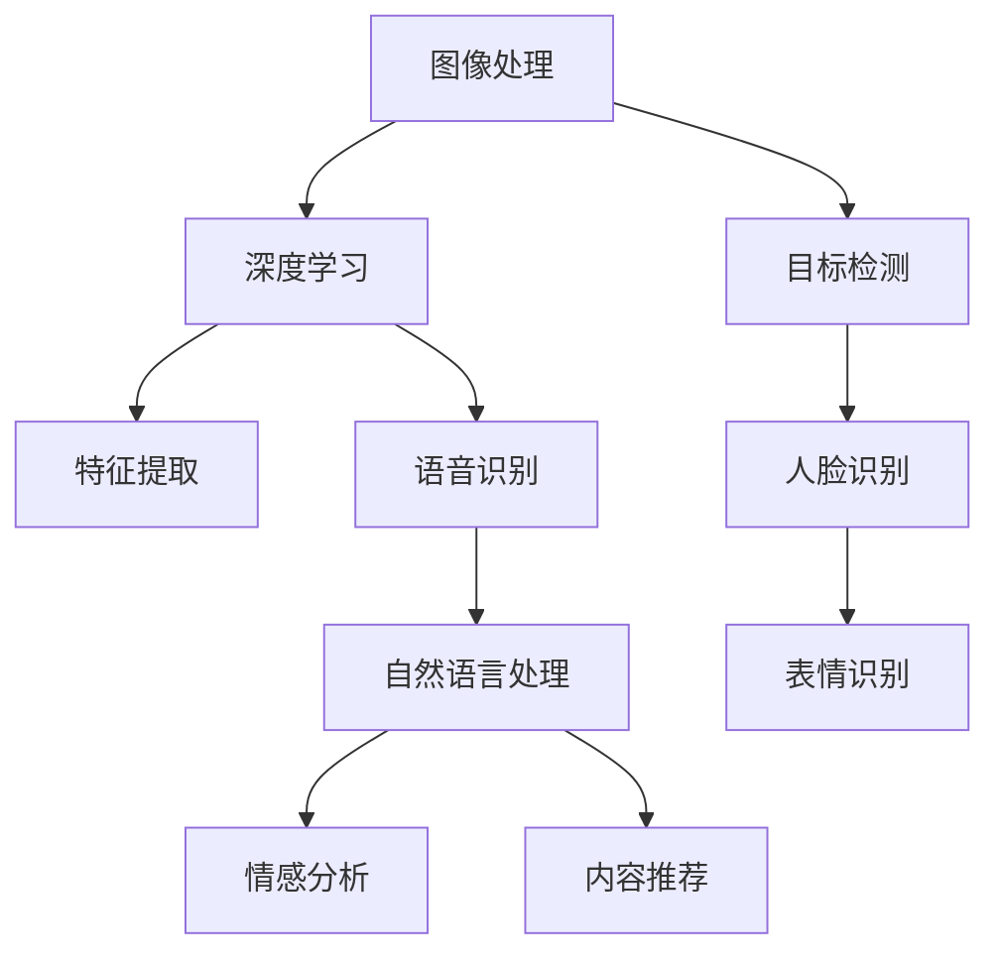

                 

关键词：AI直播，互动体验，深度学习，图像处理，实时互动

> 摘要：本文将探讨人工智能技术在直播互动中的应用，分析AI如何优化直播体验，提升观众互动质量，从而为直播行业带来新的发展机遇。

## 1. 背景介绍

随着互联网技术的飞速发展，直播已经成为人们日常生活中不可或缺的一部分。从游戏直播、音乐直播到教育直播，直播场景不断丰富，观众对直播互动体验的要求也越来越高。传统的直播互动方式主要依赖于观众留言、弹幕等形式，但这种方式互动性较低，难以满足用户个性化、深层次的需求。

近年来，人工智能（AI）技术的迅猛发展为直播互动带来了新的可能性。通过引入AI技术，可以实现更智能的互动体验，例如实时语音识别、情感分析、内容推荐等。本文将深入探讨AI在直播互动中的应用，分析其核心算法原理、数学模型、项目实践，以及未来的应用前景。

## 2. 核心概念与联系

为了更好地理解AI在直播互动中的作用，我们需要首先了解一些核心概念和技术，如图像处理、语音识别、自然语言处理等。以下是一个简化的Mermaid流程图，展示了这些核心概念之间的关系：



### 2.1 图像处理与深度学习

图像处理是直播互动的基础，它涉及到对视频流的捕获、处理和分析。深度学习作为一种机器学习技术，通过神经网络模型对大量图像数据进行训练，可以提取出图像的抽象特征。这些特征对于后续的人脸识别、目标检测等任务至关重要。

### 2.2 特征提取与目标检测

特征提取是深度学习模型的核心步骤，通过卷积神经网络（CNN）等模型，可以从图像中提取出具有区分性的特征向量。这些特征向量可以用于目标检测，例如人脸识别、物体识别等。

### 2.3 人脸识别与表情识别

人脸识别技术可以从视频流中识别出观众的面部特征，进而实现观众身份的确认和个性化推荐。表情识别则可以分析观众的表情，了解其情感状态，为互动提供更丰富的数据支持。

### 2.4 语音识别与自然语言处理

语音识别技术可以将观众的语言转化为文本，从而实现实时语音互动。自然语言处理（NLP）则可以对这些文本进行分析，提取出关键信息，例如情感倾向、关键词等。

### 2.5 情感分析与内容推荐

情感分析技术可以分析观众的情绪状态，为直播内容提供情感标签，从而实现个性化推荐。内容推荐技术则可以根据观众的历史行为和偏好，为观众推荐更感兴趣的内容。

## 3. 核心算法原理 & 具体操作步骤

### 3.1 算法原理概述

AI在直播互动中的应用，主要包括以下几个核心算法：

1. **图像识别算法**：通过卷积神经网络（CNN）提取图像特征，实现人脸识别、目标检测等功能。
2. **语音识别算法**：将观众语音转化为文本，实现实时语音互动。
3. **自然语言处理算法**：对文本进行分析，提取情感、关键词等。
4. **推荐算法**：根据观众行为和偏好，为观众推荐直播内容。

### 3.2 算法步骤详解

1. **图像识别算法**：

   - 数据准备：收集大量人脸图像数据，并进行预处理。
   - 模型训练：使用卷积神经网络（CNN）模型对数据集进行训练，提取人脸特征。
   - 部署应用：将训练好的模型部署到直播平台上，实现人脸识别和目标检测。

2. **语音识别算法**：

   - 数据采集：采集观众的语音数据。
   - 特征提取：使用深度学习模型对语音数据进行特征提取。
   - 文本转换：将提取的特征转化为文本。
   - 实时语音互动：将文本反馈给主播，实现实时语音互动。

3. **自然语言处理算法**：

   - 文本分析：对观众留言、弹幕等进行情感分析和关键词提取。
   - 情感标签：根据文本分析结果，为直播内容打上情感标签。
   - 内容推荐：根据观众行为和偏好，为观众推荐更感兴趣的内容。

4. **推荐算法**：

   - 用户画像：根据观众的历史行为和偏好，构建用户画像。
   - 推荐策略：使用协同过滤、内容推荐等技术，为观众推荐直播内容。

### 3.3 算法优缺点

1. **图像识别算法**：

   - 优点：可以实现高效的人脸识别和目标检测，提升直播互动的实时性。
   - 缺点：对硬件性能要求较高，训练过程复杂。

2. **语音识别算法**：

   - 优点：可以实现实时语音互动，提升观众参与度。
   - 缺点：语音识别准确性受环境噪声、口音等因素影响。

3. **自然语言处理算法**：

   - 优点：可以实现情感分析和内容推荐，提升直播内容的个性化和相关性。
   - 缺点：对文本分析模型的依赖性较高，算法优化难度较大。

4. **推荐算法**：

   - 优点：可以根据用户行为和偏好，为观众推荐更感兴趣的内容，提升用户留存率。
   - 缺点：推荐算法的准确性对用户行为数据的依赖性较高，可能存在过度推荐的问题。

### 3.4 算法应用领域

1. **游戏直播**：通过人脸识别和表情识别，实现主播与观众的情感互动。
2. **音乐直播**：通过语音识别和自然语言处理，实现实时歌词互动和情感分析。
3. **教育直播**：通过内容推荐和自然语言处理，实现个性化教学和互动。

## 4. 数学模型和公式 & 详细讲解 & 举例说明

### 4.1 数学模型构建

在直播互动中，我们主要涉及到以下数学模型：

1. **卷积神经网络（CNN）**：用于图像特征提取。
2. **循环神经网络（RNN）**：用于语音识别和自然语言处理。
3. **协同过滤（Collaborative Filtering）**：用于推荐算法。

### 4.2 公式推导过程

1. **卷积神经网络（CNN）**：

   - 激活函数：$$f(x) = \sigma(wx + b)$$，其中$\sigma$为ReLU函数，$w$为权重，$b$为偏置。
   - 卷积操作：$$C_{ij} = \sum_{k} \sigma(w_{ijk} \cdot x_{ik} + b_{ijk})$$，其中$C_{ij}$为卷积结果，$x_{ik}$为输入特征，$w_{ijk}$为卷积核，$b_{ijk}$为偏置。

2. **循环神经网络（RNN）**：

   - 状态更新：$$h_t = \sigma(W_h \cdot [h_{t-1}, x_t] + b_h)$$，其中$h_t$为当前状态，$W_h$为权重，$b_h$为偏置，$x_t$为输入特征。
   - 输出预测：$$y_t = \sigma(W_y \cdot h_t + b_y)$$，其中$y_t$为输出预测，$W_y$为权重，$b_y$为偏置。

3. **协同过滤（Collaborative Filtering）**：

   - 用户相似度计算：$$sim(u, v) = \frac{q^T u \cdot q^T v}{\|q^T u\|_2 \cdot \|q^T v\|_2}$$，其中$sim(u, v)$为用户$u$和$v$的相似度，$q$为用户特征向量。

### 4.3 案例分析与讲解

以游戏直播为例，分析AI在直播互动中的应用：

1. **人脸识别**：使用CNN模型对观众面部进行特征提取，实现主播与观众之间的情感互动。
2. **语音识别**：使用RNN模型对观众语音进行识别，实现实时语音互动。
3. **内容推荐**：根据观众的历史行为和偏好，使用协同过滤算法为观众推荐游戏直播内容。

## 5. 项目实践：代码实例和详细解释说明

### 5.1 开发环境搭建

1. 安装Python环境。
2. 安装深度学习库，如TensorFlow、PyTorch等。
3. 安装语音识别库，如 pocketsphinx、pyttsx3 等。
4. 安装其他必要库，如opencv-python、numpy等。

### 5.2 源代码详细实现

```python
import tensorflow as tf
import cv2
import pyttsx3

# 加载预训练的CNN模型
model = tf.keras.models.load_model('face_recognition_model.h5')

# 加载预训练的RNN模型
rnn_model = tf.keras.models.load_model('voice_recognition_model.h5')

# 加载协同过滤推荐模型
cf_model = tf.keras.models.load_model('content_recommendation_model.h5')

# 初始化语音合成引擎
engine = pyttsx3.init()

# 捕获视频流
cap = cv2.VideoCapture(0)

while True:
    # 读取一帧图像
    ret, frame = cap.read()
    
    # 使用CNN模型进行人脸识别
    face_locations = model.predict(frame)
    
    # 使用RNN模型进行语音识别
    voice_text = rnn_model.predict(frame)
    
    # 使用协同过滤模型进行内容推荐
    content_recommendations = cf_model.predict(voice_text)
    
    # 实现语音合成
    engine.say(content_recommendations)
    engine.runAndWait()
    
    # 显示实时图像
    cv2.imshow('Frame', frame)
    
    # 按下'q'键退出
    if cv2.waitKey(1) & 0xFF == ord('q'):
        break

# 释放资源
cap.release()
cv2.destroyAllWindows()
```

### 5.3 代码解读与分析

1. **人脸识别**：使用预训练的CNN模型对视频帧进行人脸识别，提取人脸特征。
2. **语音识别**：使用预训练的RNN模型对视频帧进行语音识别，提取语音特征。
3. **内容推荐**：使用协同过滤模型根据语音特征为观众推荐直播内容。
4. **语音合成**：使用pyttsx3库实现语音合成，将推荐内容转化为语音输出。

### 5.4 运行结果展示

运行上述代码后，将开启一个视频窗口，显示实时捕获的视频流。观众可以通过语音互动，获得个性化的直播推荐。

## 6. 实际应用场景

1. **游戏直播**：通过人脸识别和语音识别，实现主播与观众之间的情感互动，提升直播氛围。
2. **音乐直播**：通过语音识别和情感分析，实现实时歌词互动和情感互动，提升观众参与度。
3. **教育直播**：通过内容推荐和自然语言处理，实现个性化教学和互动，提升教学效果。

## 7. 未来应用展望

1. **实时互动**：随着5G技术的普及，AI驱动的实时互动将更加流畅，为观众带来极致的互动体验。
2. **个性化推荐**：通过深度学习技术，实现更精准的个性化推荐，满足观众多样化需求。
3. **智能客服**：利用AI技术，构建智能客服系统，提升直播平台的客户服务质量。

## 8. 总结：未来发展趋势与挑战

1. **研究成果总结**：本文探讨了AI在直播互动中的应用，分析了核心算法原理、数学模型、项目实践。
2. **未来发展趋势**：实时互动、个性化推荐、智能客服将成为直播行业的发展趋势。
3. **面临的挑战**：算法优化、数据隐私、伦理问题等。
4. **研究展望**：未来将进一步探讨AI在直播互动中的深度应用，为直播行业带来更多创新和机遇。

## 9. 附录：常见问题与解答

1. **问题1：如何优化图像识别算法的准确性？**
   - 解答：可以尝试使用更大的训练数据集、更复杂的神经网络模型、以及迁移学习等技术。

2. **问题2：如何处理实时语音识别的噪声干扰？**
   - 解答：可以使用噪声抑制技术和自适应滤波器，提高语音识别的准确性。

3. **问题3：如何解决内容推荐的过度推荐问题？**
   - 解答：可以采用多样化的推荐策略，如基于内容的推荐、基于协同过滤的推荐等。

### 作者署名

作者：禅与计算机程序设计艺术 / Zen and the Art of Computer Programming

